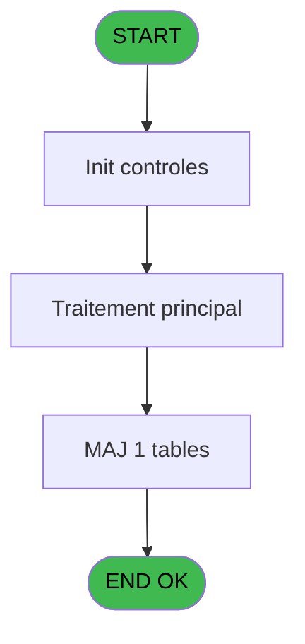

# ADH IDE 229 - Ventilation Lignes Ventes

> **Analyse**: Phases 1-4 2026-02-07 03:53 -> 03:54 (30s) | Assemblage 03:54
> **Pipeline**: V7.2 Enrichi
> **Structure**: 4 onglets (Resume | Ecrans | Donnees | Connexions)

<!-- TAB:Resume -->

## 1. FICHE D'IDENTITE

| Attribut | Valeur |
|----------|--------|
| Projet | ADH |
| IDE Position | 229 |
| Nom Programme | Ventilation Lignes Ventes |
| Fichier source | `Prg_229.xml` |
| Dossier IDE | Ventes |
| Taches | 7 (0 ecrans visibles) |
| Tables modifiees | 1 |
| Programmes appeles | 0 |

## 2. DESCRIPTION FONCTIONNELLE

**Ventilation Lignes Ventes** assure la gestion complete de ce processus.

Le flux de traitement s'organise en **4 blocs fonctionnels** :

- **Reglement** (3 taches) : gestion des moyens de paiement et reglements
- **Traitement** (2 taches) : traitements metier divers
- **Creation** (1 tache) : insertion d'enregistrements en base (mouvements, prestations)
- **Saisie** (1 tache) : ecrans de saisie utilisateur (formulaires, champs, donnees)

**Donnees modifiees** : 1 tables en ecriture (type_mail_a_traiter).

Detail : phases du traitement

#### Phase 1 : Saisie (1 tache)

- **229** - Maj lignes de ventes\Multi Reg

#### Phase 2 : Traitement (2 taches)

- **229.1** - Creaion Temp Fac
- **229.3.2** - Efface

#### Phase 3 : Reglement (3 taches)

- **229.2** - Lecture Fact/Reglement **[[ECRAN]](#ecran-t3)**
- **229.3** - Nb Lg Reglement < Nb LgFacture **[[ECRAN]](#ecran-t4)**
- **229.3.1** - REcherche reglement **[[ECRAN]](#ecran-t5)**

#### Phase 4 : Creation (1 tache)

- **229.3.1.1** - Creation **[[ECRAN]](#ecran-t6)**

#### Tables impactees

| Table | Operations | Role metier |
|-------|-----------|-------------|
| type_mail_a_traiter | **W** (6 usages) |  |

## 3. BLOCS FONCTIONNELS

### 3.1 Saisie (1 tache)

Ce bloc traite la saisie des donnees de la transaction.

---

#### 229 - Maj lignes de ventes\Multi Reg

**Role** : Saisie des donnees : Maj lignes de ventes\Multi Reg.

### 3.2 Traitement (2 taches)

Traitements internes.

---

#### 229.1 - Creaion Temp Fac

**Role** : Traitement : Creaion Temp Fac.

---

#### 229.3.2 - Efface

**Role** : Traitement : Efface.

### 3.3 Reglement (3 taches)

Gestion des moyens de paiement : 3 taches de reglement.

---

#### 229.2 - Lecture Fact/Reglement [[ECRAN]](#ecran-t3)

**Role** : Gestion du reglement : Lecture Fact/Reglement.
**Ecran** : 467 x 0 DLU | [Voir mockup](#ecran-t3)
**Variables liees** : G (V.Nb ligne Fact/Reglement)

---

#### 229.3 - Nb Lg Reglement < Nb LgFacture [[ECRAN]](#ecran-t4)

**Role** : Gestion du reglement : Nb Lg Reglement < Nb LgFacture.
**Ecran** : 612 x 169 DLU | [Voir mockup](#ecran-t4)
**Variables liees** : G (V.Nb ligne Fact/Reglement)

---

#### 229.3.1 - REcherche reglement [[ECRAN]](#ecran-t5)

**Role** : Gestion du reglement : REcherche reglement.
**Ecran** : 502 x 192 DLU | [Voir mockup](#ecran-t5)
**Variables liees** : G (V.Nb ligne Fact/Reglement)

### 3.4 Creation (1 tache)

Insertion de nouveaux enregistrements en base.

---

#### 229.3.1.1 - Creation [[ECRAN]](#ecran-t6)

**Role** : Creation d'enregistrement : Creation.
**Ecran** : 143 x 138 DLU | [Voir mockup](#ecran-t6)

## 5. REGLES METIER

*(Aucune regle metier identifiee)*

## 6. CONTEXTE

- **Appele par**: (aucun)
- **Appelle**: 0 programmes | **Tables**: 3 (W:1 R:0 L:2) | **Taches**: 7 | **Expressions**: 2

<!-- TAB:Ecrans -->

## 8. ECRANS

*(Programme sans ecran visible)*

## 9. NAVIGATION

### 9.3 Structure hierarchique (7 taches)

| Position | Tache | Type | Dimensions | Bloc |
|----------|-------|------|------------|------|
| **229.1** | [**Maj lignes de ventes\Multi Reg** (229)](#t1) | - | - | Saisie |
| **229.2** | [**Creaion Temp Fac** (229.1)](#t2) | - | - | Traitement |
| 229.2.1 | [Efface (229.3.2)](#t7) | - | - | |
| **229.3** | [**Lecture Fact/Reglement** (229.2)](#t3) [mockup](#ecran-t3) | - | 467x0 | Reglement |
| 229.3.1 | [Nb Lg Reglement < Nb LgFacture (229.3)](#t4) [mockup](#ecran-t4) | - | 612x169 | |
| 229.3.2 | [REcherche reglement (229.3.1)](#t5) [mockup](#ecran-t5) | - | 502x192 | |
| **229.4** | [**Creation** (229.3.1.1)](#t6) [mockup](#ecran-t6) | - | 143x138 | Creation |

### 9.4 Algorigramme

> **Legende**: Vert = START/END OK | Rouge = END KO | Bleu = Decisions
> *Algorigramme auto-genere. Utiliser `/algorigramme` pour une synthese metier detaillee.*

<!-- TAB:Donnees -->

## 10. TABLES

### Tables utilisees (3)

| ID | Nom | Description | Type | R | W | L | Usages |
|----|-----|-------------|------|---|---|---|--------|
| 596 | tempo_ecran_police | Table temporaire ecran | TMP |   |   | L | 1 |
| 847 | stat_lieu_vente_date | Statistiques point de vente | TMP |   |   | L | 1 |
| 864 | type_mail_a_traiter |  | DB |   | **W** |   | 6 |

### Colonnes par table (1 / 1 tables avec colonnes identifiees)

Table 864 - type_mail_a_traiter (**W**) - 6 usages

| Lettre | Variable | Acces | Type |
|--------|----------|-------|------|
| A | v Montant Restant | W | Numeric |
| B | v Montant de la ligne a creer | W | Numeric |
| C | V.type Payment | W | Alpha |
| D | v Compteur | W | Numeric |

## 11. VARIABLES

### 11.1 Parametres entrants (4)

Variables recues en parametre.

| Lettre | Nom | Type | Usage dans |
|--------|-----|------|-----------|
| A | P.Societe | Alpha | - |
| B | P.Compte | Numeric | - |
| C | P.Filiation | Numeric | - |
| D | P.type d'enregistrement créé | Alpha | - |

### 11.2 Variables de session (5)

Variables persistantes pendant toute la session.

| Lettre | Nom | Type | Usage dans |
|--------|-----|------|-----------|
| E | V.Nb ligne facturée | Numeric | - |
| F | V.Mtt Ligne Facturee | Numeric | - |
| G | V.Nb ligne Fact/Reglement | Numeric | - |
| H | V.Mtt Ligne regle | Numeric | - |
| I | V.Dernier Article Lu | Numeric | - |

## 12. EXPRESSIONS

**2 / 2 expressions decodees (100%)**

### 12.1 Repartition par type

| Type | Expressions | Regles |
|------|-------------|--------|
| CONSTANTE | 1 | 0 |
| OTHER | 1 | 0 |

### 12.2 Expressions cles par type

#### CONSTANTE (1 expressions)

| Type | IDE | Expression | Regle |
|------|-----|------------|-------|
| CONSTANTE | 2 | `'N'` | - |

#### OTHER (1 expressions)

| Type | IDE | Expression | Regle |
|------|-----|------------|-------|
| OTHER | 1 | `DbDel('{864,4}'DSOURCE,'')` | - |

<!-- TAB:Connexions -->

## 13. GRAPHE D'APPELS

### 13.1 Chaine depuis Main (Callers)

**Chemin**: (pas de callers directs)

### 13.2 Callers

| IDE | Nom Programme | Nb Appels |
|-----|---------------|-----------|
| - | (aucun) | - |

### 13.3 Callees (programmes appeles)

### 13.4 Detail Callees avec contexte

| IDE | Nom Programme | Appels | Contexte |
|-----|---------------|--------|----------|
| - | (aucun) | - | - |

## 14. RECOMMANDATIONS MIGRATION

### 14.1 Profil du programme

| Metrique | Valeur | Impact migration |
|----------|--------|-----------------|
| Lignes de logique | 161 | Programme compact |
| Expressions | 2 | Peu de logique |
| Tables WRITE | 1 | Impact faible |
| Sous-programmes | 0 | Peu de dependances |
| Ecrans visibles | 0 | Ecran unique ou traitement batch |
| Code desactive | 0% (0 / 161) | Code sain |
| Regles metier | 0 | Pas de regle identifiee |

### 14.2 Plan de migration par bloc

#### Saisie (1 tache: 0 ecran, 1 traitement)

- **Strategie** : Formulaire React/Blazor avec validation Zod/FluentValidation.
- Validation temps reel cote client + serveur

#### Traitement (2 taches: 0 ecran, 2 traitements)

- **Strategie** : 2 service(s) backend injectable(s) (Domain Services).
- Decomposer les taches en services unitaires testables.

#### Reglement (3 taches: 3 ecrans, 0 traitement)

- **Strategie** : Service `IReglementService` avec pattern Strategy par mode de paiement.
- Integration TPE si applicable

#### Creation (1 tache: 1 ecran, 0 traitement)

- **Strategie** : Repository pattern avec Entity Framework Core.
- Insertion via `IRepository<T>.CreateAsync()`

### 14.3 Dependances critiques

| Dependance | Type | Appels | Impact |
|------------|------|--------|--------|
| type_mail_a_traiter | Table WRITE (Database) | 6x | Schema + repository |

---
*Spec DETAILED generee par Pipeline V7.2 - 2026-02-07 03:54*
