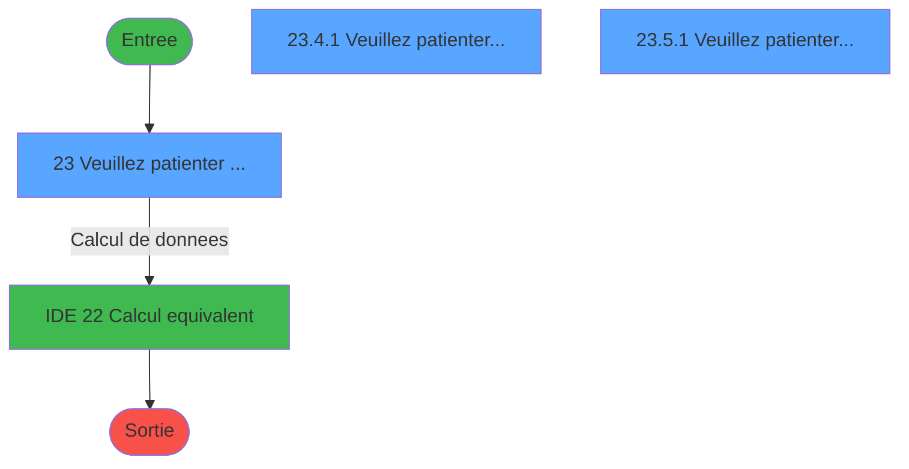
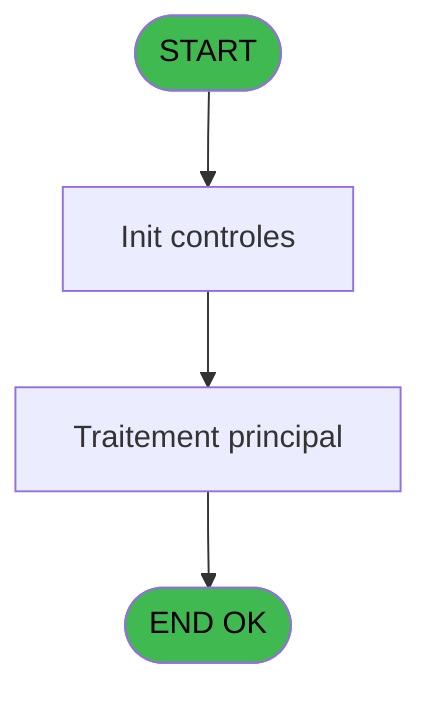

# ADH IDE 23 - Print reçu change achat

> **Analyse**: Phases 1-4 2026-02-07 03:41 -> 01:21 (21h40min) | Assemblage 01:21
> **Pipeline**: V7.2 Enrichi
> **Structure**: 4 onglets (Resume | Ecrans | Donnees | Connexions)

<!-- TAB:Resume -->

## 1. FICHE D'IDENTITE

| Attribut | Valeur |
|----------|--------|
| Projet | ADH |
| IDE Position | 23 |
| Nom Programme | Print reçu change achat |
| Fichier source | `Prg_23.xml` |
| Dossier IDE | Change |
| Taches | 14 (3 ecrans visibles) |
| Tables modifiees | 0 |
| Programmes appeles | 1 |
| Complexite | **BASSE** (score 12/100) |

## 2. DESCRIPTION FONCTIONNELLE

### 1.1 Objectif metier

**Print reçu change achat** est le **programme d'impression des recus pour les operations d'achat de devises** qui **genere les tickets de confirmation pour les clients ayant achete des devises etrangeres**.

**Objectif metier** : Ce programme produit le recu imprime remis au client lorsqu'il achete des devises etrangeres au bureau de change du village. Le ticket contient toutes les informations de la transaction : numero d'operation, mode de paiement, taux applique, montant en devise locale, frais de change eventuels et equivalent en devise achetee. Le programme gere l'impression sur plusieurs types d'imprimantes (1, 4, 5, 8, 9) selon la configuration du village et supporte le multilinguisme (francais/anglais selon le code langue).

**Print reçu change achat** assure la gestion complete de ce processus, accessible depuis [Solde compte fin sejour (IDE 193)](ADH-IDE-193.md), [Change GM (IDE 25)](ADH-IDE-25.md), [Versement/Retrait (IDE 174)](ADH-IDE-174.md).

Le flux de traitement s'organise en **2 blocs fonctionnels** :

- **Traitement** (9 taches) : traitements metier divers
- **Impression** (5 taches) : generation de tickets et documents

**Logique metier** : 1 regles identifiees couvrant conditions metier.

Detail : phases du traitement

#### Phase 1 : Traitement (9 taches)

- **23** - Veuillez patienter ... **[[ECRAN]](#ecran-t1)**
- **23.1.1** - Impression reçu change
- **23.1.2** - Impression reçu change
- **23.2.1** - Impression reçu change
- **23.2.2** - Impression reçu change
- **23.3.1** - Veuillez patienter ... **[[ECRAN]](#ecran-t9)**
- **23.4.1** - Veuillez patienter... **[[ECRAN]](#ecran-t11)**
- **23.5.1** - Veuillez patienter... **[[ECRAN]](#ecran-t13)**
- **23.6** - Existe ligne

#### Phase 2 : Impression (5 taches)

- **23.1** - Printer 1
- **23.2** - Printer 4
- **23.3** - Printer 5 **[[ECRAN]](#ecran-t8)**
- **23.4** - Printer 8 **[[ECRAN]](#ecran-t10)**
- **23.5** - Printer 9 **[[ECRAN]](#ecran-t12)**

## 3. BLOCS FONCTIONNELS

### 3.1 Traitement (9 taches)

Traitements internes.

---

#### 23 - Veuillez patienter ... [[ECRAN]](#ecran-t1)

**Role** : Tache d'orchestration : point d'entree du programme (9 sous-taches). Coordonne l'enchainement des traitements.
**Ecran** : 422 x 56 DLU (MDI) | [Voir mockup](#ecran-t1)

8 sous-taches directes

| Tache | Nom | Bloc |
|-------|-----|------|
| [23.1.1](#t3) | Impression reçu change | Traitement |
| [23.1.2](#t4) | Impression reçu change | Traitement |
| [23.2.1](#t6) | Impression reçu change | Traitement |
| [23.2.2](#t7) | Impression reçu change | Traitement |
| [23.3.1](#t9) | Veuillez patienter ... **[[ECRAN]](#ecran-t9)** | Traitement |
| [23.4.1](#t11) | Veuillez patienter... **[[ECRAN]](#ecran-t11)** | Traitement |
| [23.5.1](#t13) | Veuillez patienter... **[[ECRAN]](#ecran-t13)** | Traitement |
| [23.6](#t14) | Existe ligne | Traitement |

---

#### 23.1.1 - Impression reçu change

**Role** : Generation du document : Impression reçu change.
**Variables liees** : FI (v. Frais de change (Libelle))

---

#### 23.1.2 - Impression reçu change

**Role** : Generation du document : Impression reçu change.
**Variables liees** : FI (v. Frais de change (Libelle))

---

#### 23.2.1 - Impression reçu change

**Role** : Generation du document : Impression reçu change.
**Variables liees** : FI (v. Frais de change (Libelle))

---

#### 23.2.2 - Impression reçu change

**Role** : Generation du document : Impression reçu change.
**Variables liees** : FI (v. Frais de change (Libelle))

---

#### 23.3.1 - Veuillez patienter ... [[ECRAN]](#ecran-t9)

**Role** : Traitement : Veuillez patienter ....
**Ecran** : 424 x 56 DLU (MDI) | [Voir mockup](#ecran-t9)

---

#### 23.4.1 - Veuillez patienter... [[ECRAN]](#ecran-t11)

**Role** : Traitement : Veuillez patienter....
**Ecran** : 422 x 57 DLU (MDI) | [Voir mockup](#ecran-t11)

---

#### 23.5.1 - Veuillez patienter... [[ECRAN]](#ecran-t13)

**Role** : Traitement : Veuillez patienter....
**Ecran** : 422 x 57 DLU (MDI) | [Voir mockup](#ecran-t13)

---

#### 23.6 - Existe ligne

**Role** : Traitement : Existe ligne.
**Variables liees** : FD (W0 existe ligne à editer), FQ (V.Libellé ligne transaction), FR (V.Libellé ligne acceptation), FS (V.Edition ligne détail carte?)

### 3.2 Impression (5 taches)

Generation des documents et tickets.

---

#### 23.1 - Printer 1

**Role** : Generation du document : Printer 1.

---

#### 23.2 - Printer 4

**Role** : Generation du document : Printer 4.

---

#### 23.3 - Printer 5 [[ECRAN]](#ecran-t8)

**Role** : Generation du document : Printer 5.
**Ecran** : 424 x 56 DLU (MDI) | [Voir mockup](#ecran-t8)

---

#### 23.4 - Printer 8 [[ECRAN]](#ecran-t10)

**Role** : Generation du document : Printer 8.
**Ecran** : 422 x 57 DLU (MDI) | [Voir mockup](#ecran-t10)

---

#### 23.5 - Printer 9 [[ECRAN]](#ecran-t12)

**Role** : Generation du document : Printer 9.
**Ecran** : 422 x 57 DLU (MDI) | [Voir mockup](#ecran-t12)

## 5. REGLES METIER

7 regles identifiees:

### Impression (5 regles)

#### [RM-001] Verification que l'imprimante courante est la n1

| Element | Detail |
|---------|--------|
| **Condition** | `GetParam ('CURRENTPRINTERNUM')=1` |
| **Si vrai** | Action si CURRENTPRINTERNUM = 1 |
| **Expression source** | Expression 7 : `GetParam ('CURRENTPRINTERNUM')=1` |
| **Exemple** | Si GetParam ('CURRENTPRINTERNUM')=1 → Action si CURRENTPRINTERNUM = 1 |
| **Impact** | [23.1 - Printer 1](#t2) |

#### [RM-002] Verification que l'imprimante courante est la n4

| Element | Detail |
|---------|--------|
| **Condition** | `GetParam ('CURRENTPRINTERNUM')=4` |
| **Si vrai** | Action si CURRENTPRINTERNUM = 4 |
| **Expression source** | Expression 8 : `GetParam ('CURRENTPRINTERNUM')=4` |
| **Exemple** | Si GetParam ('CURRENTPRINTERNUM')=4 → Action si CURRENTPRINTERNUM = 4 |
| **Impact** | [23.1 - Printer 1](#t2) |

#### [RM-003] Verification que l'imprimante courante est la n5

| Element | Detail |
|---------|--------|
| **Condition** | `GetParam ('CURRENTPRINTERNUM')=5` |
| **Si vrai** | Action si CURRENTPRINTERNUM = 5 |
| **Expression source** | Expression 9 : `GetParam ('CURRENTPRINTERNUM')=5` |
| **Exemple** | Si GetParam ('CURRENTPRINTERNUM')=5 → Action si CURRENTPRINTERNUM = 5 |
| **Impact** | [23.1 - Printer 1](#t2) |

#### [RM-004] Verification que l'imprimante courante est la n8

| Element | Detail |
|---------|--------|
| **Condition** | `GetParam ('CURRENTPRINTERNUM')=8` |
| **Si vrai** | Action si CURRENTPRINTERNUM = 8 |
| **Expression source** | Expression 10 : `GetParam ('CURRENTPRINTERNUM')=8` |
| **Exemple** | Si GetParam ('CURRENTPRINTERNUM')=8 → Action si CURRENTPRINTERNUM = 8 |
| **Impact** | [23.1 - Printer 1](#t2) |

#### [RM-005] Verification que l'imprimante courante est la n9

| Element | Detail |
|---------|--------|
| **Condition** | `GetParam ('CURRENTPRINTERNUM')=9` |
| **Si vrai** | Action si CURRENTPRINTERNUM = 9 |
| **Expression source** | Expression 11 : `GetParam ('CURRENTPRINTERNUM')=9` |
| **Exemple** | Si GetParam ('CURRENTPRINTERNUM')=9 → Action si CURRENTPRINTERNUM = 9 |
| **Impact** | [23.1 - Printer 1](#t2) |

### Autres (2 regles)

#### [RM-006] Si [BL]='010' alors 'Opération N°' sinon 'Transaction N°')

| Element | Detail |
|---------|--------|
| **Condition** | `[BL]='010'` |
| **Si vrai** | 'Opération N°' |
| **Si faux** | 'Transaction N°') |
| **Expression source** | Expression 16 : `IF ([BL]='010','Opération N°','Transaction N°')` |
| **Exemple** | Si [BL]='010' → 'Opération N°'. Sinon → 'Transaction N°') |

#### [RM-007] Condition composite: Trim([BZ])<>'' AND VG106

| Element | Detail |
|---------|--------|
| **Condition** | `Trim([BZ])<>'' AND VG106` |
| **Si vrai** | Action si vrai |
| **Expression source** | Expression 28 : `Trim([BZ])<>'' AND VG106` |
| **Exemple** | Si Trim([BZ])<>'' AND VG106 → Action si vrai |

## 6. CONTEXTE

- **Appele par**: [Solde compte fin sejour (IDE 193)](ADH-IDE-193.md), [Change GM (IDE 25)](ADH-IDE-25.md), [Versement/Retrait (IDE 174)](ADH-IDE-174.md)
- **Appelle**: 1 programmes | **Tables**: 8 (W:0 R:3 L:7) | **Taches**: 14 | **Expressions**: 30

<!-- TAB:Ecrans -->

## 8. ECRANS

### 8.1 Forms visibles (3 / 14)

| # | Position | Tache | Nom | Type | Largeur | Hauteur | Bloc |
|---|----------|-------|-----|------|---------|---------|------|
| 1 | 23 | 23 | Veuillez patienter ... | MDI | 422 | 56 | Traitement |
| 2 | 23.4.1 | 23.4.1 | Veuillez patienter... | MDI | 422 | 57 | Traitement |
| 3 | 23.5.1 | 23.5.1 | Veuillez patienter... | MDI | 422 | 57 | Traitement |

### 8.2 Mockups Ecrans

---

#### 23 - Veuillez patienter ...
**Tache** : [23](#t1) | **Type** : MDI | **Dimensions** : 422 x 56 DLU
**Bloc** : Traitement | **Titre IDE** : Veuillez patienter ...

<!-- FORM-DATA:
{
    "width":  422,
    "vFactor":  8,
    "type":  "MDI",
    "hFactor":  8,
    "controls":  [
                     {
                         "x":  0,
                         "type":  "label",
                         "var":  "",
                         "y":  0,
                         "w":  423,
                         "fmt":  "",
                         "name":  "",
                         "h":  29,
                         "color":  "",
                         "text":  "",
                         "parent":  null
                     },
                     {
                         "x":  120,
                         "type":  "label",
                         "var":  "",
                         "y":  10,
                         "w":  221,
                         "fmt":  "",
                         "name":  "",
                         "h":  8,
                         "color":  "7",
                         "text":  "Impression en cours ...",
                         "parent":  null
                     },
                     {
                         "x":  0,
                         "type":  "label",
                         "var":  "",
                         "y":  29,
                         "w":  423,
                         "fmt":  "",
                         "name":  "",
                         "h":  27,
                         "color":  "",
                         "text":  "",
                         "parent":  null
                     },
                     {
                         "x":  87,
                         "type":  "label",
                         "var":  "",
                         "y":  38,
                         "w":  270,
                         "fmt":  "",
                         "name":  "",
                         "h":  8,
                         "color":  "",
                         "text":  "Edition reçu change",
                         "parent":  null
                     },
                     {
                         "x":  4,
                         "type":  "image",
                         "var":  "",
                         "y":  2,
                         "w":  72,
                         "fmt":  "",
                         "name":  "",
                         "h":  25,
                         "color":  "",
                         "text":  "",
                         "parent":  null
                     }
                 ],
    "taskId":  "23",
    "height":  56
}
-->

---

#### 23.4.1 - Veuillez patienter...
**Tache** : [23.4.1](#t11) | **Type** : MDI | **Dimensions** : 422 x 57 DLU
**Bloc** : Traitement | **Titre IDE** : Veuillez patienter...

<!-- FORM-DATA:
{
    "width":  422,
    "vFactor":  8,
    "type":  "MDI",
    "hFactor":  8,
    "controls":  [
                     {
                         "x":  0,
                         "type":  "label",
                         "var":  "",
                         "y":  0,
                         "w":  423,
                         "fmt":  "",
                         "name":  "",
                         "h":  29,
                         "color":  "",
                         "text":  "",
                         "parent":  null
                     },
                     {
                         "x":  120,
                         "type":  "label",
                         "var":  "",
                         "y":  10,
                         "w":  221,
                         "fmt":  "",
                         "name":  "",
                         "h":  8,
                         "color":  "7",
                         "text":  "Impression en cours ...",
                         "parent":  null
                     },
                     {
                         "x":  0,
                         "type":  "label",
                         "var":  "",
                         "y":  29,
                         "w":  423,
                         "fmt":  "",
                         "name":  "",
                         "h":  27,
                         "color":  "",
                         "text":  "",
                         "parent":  null
                     },
                     {
                         "x":  69,
                         "type":  "label",
                         "var":  "",
                         "y":  38,
                         "w":  285,
                         "fmt":  "",
                         "name":  "",
                         "h":  8,
                         "color":  "",
                         "text":  "Edition de l\u0027extrait de compte",
                         "parent":  null
                     },
                     {
                         "x":  4,
                         "type":  "image",
                         "var":  "",
                         "y":  2,
                         "w":  72,
                         "fmt":  "",
                         "name":  "",
                         "h":  25,
                         "color":  "",
                         "text":  "",
                         "parent":  null
                     }
                 ],
    "taskId":  "23.4.1",
    "height":  57
}
-->

---

#### 23.5.1 - Veuillez patienter...
**Tache** : [23.5.1](#t13) | **Type** : MDI | **Dimensions** : 422 x 57 DLU
**Bloc** : Traitement | **Titre IDE** : Veuillez patienter...

<!-- FORM-DATA:
{
    "width":  422,
    "vFactor":  8,
    "type":  "MDI",
    "hFactor":  8,
    "controls":  [
                     {
                         "x":  0,
                         "type":  "label",
                         "var":  "",
                         "y":  0,
                         "w":  423,
                         "fmt":  "",
                         "name":  "",
                         "h":  29,
                         "color":  "",
                         "text":  "",
                         "parent":  null
                     },
                     {
                         "x":  120,
                         "type":  "label",
                         "var":  "",
                         "y":  10,
                         "w":  221,
                         "fmt":  "",
                         "name":  "",
                         "h":  8,
                         "color":  "7",
                         "text":  "Impression en cours ...",
                         "parent":  null
                     },
                     {
                         "x":  0,
                         "type":  "label",
                         "var":  "",
                         "y":  29,
                         "w":  423,
                         "fmt":  "",
                         "name":  "",
                         "h":  27,
                         "color":  "",
                         "text":  "",
                         "parent":  null
                     },
                     {
                         "x":  69,
                         "type":  "label",
                         "var":  "",
                         "y":  38,
                         "w":  285,
                         "fmt":  "",
                         "name":  "",
                         "h":  8,
                         "color":  "",
                         "text":  "Edition de l\u0027extrait de compte",
                         "parent":  null
                     },
                     {
                         "x":  4,
                         "type":  "image",
                         "var":  "",
                         "y":  2,
                         "w":  72,
                         "fmt":  "",
                         "name":  "",
                         "h":  25,
                         "color":  "",
                         "text":  "",
                         "parent":  null
                     }
                 ],
    "taskId":  "23.5.1",
    "height":  57
}
-->

## 9. NAVIGATION

### 9.1 Enchainement des ecrans

**Detail par enchainement :**

| Depuis | Action | Vers | Retour |
|--------|--------|------|--------|
| Veuillez patienter ... | Calcul de donnees | [Calcul equivalent (IDE 22)](ADH-IDE-22.md) | Retour ecran |

### 9.3 Structure hierarchique (14 taches)

| Position | Tache | Type | Dimensions | Bloc |
|----------|-------|------|------------|------|
| **23.1** | [**Veuillez patienter ...** (23)](#t1) [mockup](#ecran-t1) | MDI | 422x56 | Traitement |
| 23.1.1 | [Impression reçu change (23.1.1)](#t3) | MDI | - | |
| 23.1.2 | [Impression reçu change (23.1.2)](#t4) | MDI | - | |
| 23.1.3 | [Impression reçu change (23.2.1)](#t6) | MDI | - | |
| 23.1.4 | [Impression reçu change (23.2.2)](#t7) | MDI | - | |
| 23.1.5 | [Veuillez patienter ... (23.3.1)](#t9) [mockup](#ecran-t9) | MDI | 424x56 | |
| 23.1.6 | [Veuillez patienter... (23.4.1)](#t11) [mockup](#ecran-t11) | MDI | 422x57 | |
| 23.1.7 | [Veuillez patienter... (23.5.1)](#t13) [mockup](#ecran-t13) | MDI | 422x57 | |
| 23.1.8 | [Existe ligne (23.6)](#t14) | MDI | - | |
| **23.2** | [**Printer 1** (23.1)](#t2) | MDI | - | Impression |
| 23.2.1 | [Printer 4 (23.2)](#t5) | MDI | - | |
| 23.2.2 | [Printer 5 (23.3)](#t8) [mockup](#ecran-t8) | MDI | 424x56 | |
| 23.2.3 | [Printer 8 (23.4)](#t10) [mockup](#ecran-t10) | MDI | 422x57 | |
| 23.2.4 | [Printer 9 (23.5)](#t12) [mockup](#ecran-t12) | MDI | 422x57 | |

### 9.4 Algorigramme

> **Legende**: Vert = START/END OK | Rouge = END KO | Bleu = Decisions
> *Algorigramme auto-genere. Utiliser `/algorigramme` pour une synthese metier detaillee.*

<!-- TAB:Donnees -->

## 10. TABLES

### Tables utilisees (8)

| ID | Nom | Description | Type | R | W | L | Usages |
|----|-----|-------------|------|---|---|---|--------|
| 44 | change___________chg |  | DB | R |   | L | 8 |
| 30 | gm-recherche_____gmr | Index de recherche | DB | R |   | L | 7 |
| 31 | gm-complet_______gmc |  | DB | R |   |   | 1 |
| 474 | comptage_caisse_devise | Sessions de caisse | TMP |   |   | L | 7 |
| 122 | unilateral_bilateral |  | DB |   |   | L | 1 |
| 368 | pms_village |  | DB |   |   | L | 1 |
| 34 | hebergement______heb | Hebergement (chambres) | DB |   |   | L | 1 |
| 324 | frais_change___fchg |  | DB |   |   | L | 1 |

### Colonnes par table (5 / 3 tables avec colonnes identifiees)

Table 44 - change___________chg (R/L) - 8 usages

| Lettre | Variable | Acces | Type |
|--------|----------|-------|------|
| A | W1 Equivalent | R | Numeric |
| B | W1 large | R | Alpha |
| C | W1 normal | R | Alpha |
| D | W1 condense | R | Alpha |
| E | W1 detecteur | R | Alpha |
| F | W1 inhibe Panel | R | Alpha |
| G | W1 massicot | R | Alpha |
| H | W1 selection feuille | R | Alpha |
| I | W1 selection rouleau | R | Alpha |
| J | W1 ejection feuille | R | Alpha |
| K | W1 equivalent | R | Numeric |

Table 30 - gm-recherche_____gmr (R/L) - 7 usages

*Table utilisee uniquement en Link ou aucune colonne Real identifiee dans le DataView.*

Table 31 - gm-complet_______gmc (R) - 1 usages

| Lettre | Variable | Acces | Type |
|--------|----------|-------|------|
| A | P0 societe | R | Alpha |
| B | P0 n° adherent | R | Numeric |
| C | P0 filiation | R | Numeric |
| D | P0 date | R | Date |
| E | P0 heure | R | Time |
| F | P0 devise locale | R | Alpha |
| G | P0 nb decimale | R | Numeric |
| H | P0 masque montant | R | Alpha |
| I | P0 nom village | R | Alpha |
| J | P0 telephone | R | Alpha |
| K | P0 fax | R | Alpha |
| L | Pi.N° Ticket | R | Numeric |
| M | Pi.id_transaction | R | Unicode |
| N | Pi.id_acceptation | R | Unicode |
| O | W0 en-tête ? | R | Alpha |
| P | W0 fin tâche | R | Alpha |
| Q | W0 existe ligne à editer | R | Logical |
| R | v. Operation (Libelle) | R | Alpha |
| S | v. Mode paiement (Libelle) | R | Alpha |
| T | v. Taux (Libelle) | R | Alpha |
| U | v. Montant Devise Local Libelle | R | Alpha |
| V | v. Frais de change (Libelle) | R | Alpha |
| W | v.Soit (Libelle) | R | Alpha |
| X | v. Achat de devise (Libelle) | R | Alpha |
| Y | v.Message (Libelle) | R | Alpha |
| Z | v. Paiement (Libelle) | R | Alpha |
| BA | v. Devise (Libelle) | R | Alpha |
| BB | v.Montant Product | R | Numeric |
| BC | v.Nombre de copies | R | Numeric |
| BD | V.Libellé ligne transaction | R | Unicode |
| BE | V.Libellé ligne acceptation | R | Unicode |
| BF | V.Edition ligne détail carte? | R | Logical |

## 11. VARIABLES

### 11.1 Parametres entrants (14)

Variables recues du programme appelant ([Solde compte fin sejour (IDE 193)](ADH-IDE-193.md)).

| Lettre | Nom | Type | Usage dans |
|--------|-----|------|-----------|
| EN | P0 societe | Alpha | 1x parametre entrant |
| EO | P0 n° adherent | Numeric | 1x parametre entrant |
| EP | P0 filiation | Numeric | 1x parametre entrant |
| EQ | P0 date | Date | 1x parametre entrant |
| ER | P0 heure | Time | 1x parametre entrant |
| ES | P0 devise locale | Alpha | - |
| ET | P0 nb decimale | Numeric | - |
| EU | P0 masque montant | Alpha | - |
| EV | P0 nom village | Alpha | - |
| EW | P0 telephone | Alpha | - |
| EX | P0 fax | Alpha | - |
| EY | Pi.N° Ticket | Numeric | - |
| EZ | Pi.id_transaction | Unicode | - |
| FA | Pi.id_acceptation | Unicode | - |

### 11.2 Variables de session (15)

Variables persistantes pendant toute la session.

| Lettre | Nom | Type | Usage dans |
|--------|-----|------|-----------|
| FE | v. Operation (Libelle) | Alpha | - |
| FF | v. Mode paiement (Libelle) | Alpha | - |
| FG | v. Taux (Libelle) | Alpha | - |
| FH | v. Montant Devise Local Libelle | Alpha | - |
| FI | v. Frais de change (Libelle) | Alpha | - |
| FJ | v.Soit (Libelle) | Alpha | - |
| FK | v. Achat de devise (Libelle) | Alpha | - |
| FL | v.Message (Libelle) | Alpha | - |
| FM | v. Paiement (Libelle) | Alpha | - |
| FN | v. Devise (Libelle) | Alpha | - |
| FO | v.Montant Product | Numeric | - |
| FP | v.Nombre de copies | Numeric | - |
| FQ | V.Libellé ligne transaction | Unicode | - |
| FR | V.Libellé ligne acceptation | Unicode | - |
| FS | V.Edition ligne détail carte? | Logical | - |

### 11.3 Variables de travail (3)

Variables internes au programme.

| Lettre | Nom | Type | Usage dans |
|--------|-----|------|-----------|
| FB | W0 en-tête ? | Alpha | 1x calcul interne |
| FC | W0 fin tâche | Alpha | - |
| FD | W0 existe ligne à editer | Logical | - |

Toutes les 32 variables (liste complete)

| Cat | Lettre | Nom Variable | Type |
|-----|--------|--------------|------|
| P0 | **EN** | P0 societe | Alpha |
| P0 | **EO** | P0 n° adherent | Numeric |
| P0 | **EP** | P0 filiation | Numeric |
| P0 | **EQ** | P0 date | Date |
| P0 | **ER** | P0 heure | Time |
| P0 | **ES** | P0 devise locale | Alpha |
| P0 | **ET** | P0 nb decimale | Numeric |
| P0 | **EU** | P0 masque montant | Alpha |
| P0 | **EV** | P0 nom village | Alpha |
| P0 | **EW** | P0 telephone | Alpha |
| P0 | **EX** | P0 fax | Alpha |
| P0 | **EY** | Pi.N° Ticket | Numeric |
| P0 | **EZ** | Pi.id_transaction | Unicode |
| P0 | **FA** | Pi.id_acceptation | Unicode |
| W0 | **FB** | W0 en-tête ? | Alpha |
| W0 | **FC** | W0 fin tâche | Alpha |
| W0 | **FD** | W0 existe ligne à editer | Logical |
| V. | **FE** | v. Operation (Libelle) | Alpha |
| V. | **FF** | v. Mode paiement (Libelle) | Alpha |
| V. | **FG** | v. Taux (Libelle) | Alpha |
| V. | **FH** | v. Montant Devise Local Libelle | Alpha |
| V. | **FI** | v. Frais de change (Libelle) | Alpha |
| V. | **FJ** | v.Soit (Libelle) | Alpha |
| V. | **FK** | v. Achat de devise (Libelle) | Alpha |
| V. | **FL** | v.Message (Libelle) | Alpha |
| V. | **FM** | v. Paiement (Libelle) | Alpha |
| V. | **FN** | v. Devise (Libelle) | Alpha |
| V. | **FO** | v.Montant Product | Numeric |
| V. | **FP** | v.Nombre de copies | Numeric |
| V. | **FQ** | V.Libellé ligne transaction | Unicode |
| V. | **FR** | V.Libellé ligne acceptation | Unicode |
| V. | **FS** | V.Edition ligne détail carte? | Logical |

## 12. EXPRESSIONS

**30 / 30 expressions decodees (100%)**

### 12.1 Repartition par type

| Type | Expressions | Regles |
|------|-------------|--------|
| CONDITION | 16 | 7 |
| CONSTANTE | 2 | 0 |
| OTHER | 9 | 0 |
| CAST_LOGIQUE | 1 | 0 |
| STRING | 2 | 0 |

### 12.2 Expressions cles par type

#### CONDITION (16 expressions)

| Type | IDE | Expression | Regle |
|------|-----|------------|-------|
| CONDITION | 11 | `GetParam ('CURRENTPRINTERNUM')=9` | [RM-005](#rm-RM-005) |
| CONDITION | 16 | `IF ([BL]='010','Opération N°','Transaction N°')` | [RM-006](#rm-RM-006) |
| CONDITION | 28 | `Trim([BZ])<>'' AND VG106` | [RM-007](#rm-RM-007) |
| CONDITION | 10 | `GetParam ('CURRENTPRINTERNUM')=8` | [RM-004](#rm-RM-004) |
| CONDITION | 7 | `GetParam ('CURRENTPRINTERNUM')=1` | [RM-001](#rm-RM-001) |
| ... | | *+11 autres* | |

#### CONSTANTE (2 expressions)

| Type | IDE | Expression | Regle |
|------|-----|------------|-------|
| CONSTANTE | 15 | `'Z'` | - |
| CONSTANTE | 14 | `'A'` | - |

#### OTHER (9 expressions)

| Type | IDE | Expression | Regle |
|------|-----|------------|-------|
| OTHER | 12 | `W0 en-tête ? [O]` | - |
| OTHER | 6 | `P0 heure [E]` | - |
| OTHER | 27 | `GetParam ('NUMBERCOPIES')` | - |
| OTHER | 13 | `P0 filiation [C]` | - |
| OTHER | 5 | `P0 date [D]` | - |
| ... | | *+4 autres* | |

#### CAST_LOGIQUE (1 expressions)

| Type | IDE | Expression | Regle |
|------|-----|------------|-------|
| CAST_LOGIQUE | 26 | `'TRUE'LOG` | - |

#### STRING (2 expressions)

| Type | IDE | Expression | Regle |
|------|-----|------------|-------|
| STRING | 30 | `'Autorisation Number : '&Trim([CA])` | - |
| STRING | 29 | `'File Number : '&Trim([BZ])` | - |

### 12.3 Toutes les expressions (30)

Voir les 30 expressions

#### CONDITION (16)

| IDE | Expression Decodee |
|-----|-------------------|
| 7 | `GetParam ('CURRENTPRINTERNUM')=1` |
| 8 | `GetParam ('CURRENTPRINTERNUM')=4` |
| 9 | `GetParam ('CURRENTPRINTERNUM')=5` |
| 10 | `GetParam ('CURRENTPRINTERNUM')=8` |
| 11 | `GetParam ('CURRENTPRINTERNUM')=9` |
| 16 | `IF ([BL]='010','Opération N°','Transaction N°')` |
| 17 | `IF ([BL]='010','Mode de paiement','Payment method')` |
| 18 | `IF ([BL]='010','Taux','Rate')` |
| 19 | `IF ([BL]='010','Montant devise locale','Amount local currency')` |
| 20 | `IF ([BL]='010','Frais de change','Change fees')` |
| 21 | `IF ([BL]='010','Soit','Equal')` |
| 22 | `IF ([BL]='010','ACHAT DE DEVISES','CURRENCY PURCHASE')` |
| 23 | `IF ([BL]='010','Merci de votre visite','Thank you for your visit')` |
| 24 | `IF ([BL]='010','Paiement','Payment')` |
| 25 | `IF ([BL]='010','Devise','Currency')` |
| 28 | `Trim([BZ])<>'' AND VG106` |

#### CONSTANTE (2)

| IDE | Expression Decodee |
|-----|-------------------|
| 14 | `'A'` |
| 15 | `'Z'` |

#### OTHER (9)

| IDE | Expression Decodee |
|-----|-------------------|
| 1 | `SetCrsr (2)` |
| 2 | `SetCrsr (1)` |
| 3 | `P0 societe [A]` |
| 4 | `P0 n° adherent [B]` |
| 5 | `P0 date [D]` |
| 6 | `P0 heure [E]` |
| 12 | `W0 en-tête ? [O]` |
| 13 | `P0 filiation [C]` |
| 27 | `GetParam ('NUMBERCOPIES')` |

#### CAST_LOGIQUE (1)

| IDE | Expression Decodee |
|-----|-------------------|
| 26 | `'TRUE'LOG` |

#### STRING (2)

| IDE | Expression Decodee |
|-----|-------------------|
| 29 | `'File Number : '&Trim([BZ])` |
| 30 | `'Autorisation Number : '&Trim([CA])` |

<!-- TAB:Connexions -->

## 13. GRAPHE D'APPELS

### 13.1 Chaine depuis Main (Callers)

Main -> ... -> [Solde compte fin sejour (IDE 193)](ADH-IDE-193.md) -> **Print reçu change achat (IDE 23)**

Main -> ... -> [Change GM (IDE 25)](ADH-IDE-25.md) -> **Print reçu change achat (IDE 23)**

Main -> ... -> [Versement/Retrait (IDE 174)](ADH-IDE-174.md) -> **Print reçu change achat (IDE 23)**

### 13.2 Callers

| IDE | Nom Programme | Nb Appels |
|-----|---------------|-----------|
| [193](ADH-IDE-193.md) | Solde compte fin sejour | 2 |
| [25](ADH-IDE-25.md) | Change GM | 1 |
| [174](ADH-IDE-174.md) | Versement/Retrait | 1 |

### 13.3 Callees (programmes appeles)

### 13.4 Detail Callees avec contexte

| IDE | Nom Programme | Appels | Contexte |
|-----|---------------|--------|----------|
| [22](ADH-IDE-22.md) | Calcul equivalent | 7 | Calcul de donnees |

## 14. RECOMMANDATIONS MIGRATION

### 14.1 Profil du programme

| Metrique | Valeur | Impact migration |
|----------|--------|-----------------|
| Lignes de logique | 471 | Taille moyenne |
| Expressions | 30 | Peu de logique |
| Tables WRITE | 0 | Impact faible |
| Sous-programmes | 1 | Peu de dependances |
| Ecrans visibles | 3 | Quelques ecrans |
| Code desactive | 0% (0 / 471) | Code sain |
| Regles metier | 7 | Quelques regles a preserver |

### 14.2 Plan de migration par bloc

#### Traitement (9 taches: 4 ecrans, 5 traitements)

- **Strategie** : Orchestrateur avec 4 ecrans (Razor/React) et 5 traitements backend (services).
- Les ecrans deviennent des composants UI, les traitements invisibles deviennent des services injectables.
- 1 sous-programme(s) a migrer ou a reutiliser depuis les services existants.
- Decomposer les taches en services unitaires testables.

#### Impression (5 taches: 3 ecrans, 2 traitements)

- **Strategie** : Templates HTML -> PDF via wkhtmltopdf ou Puppeteer.
- `PrintService` injectable avec choix imprimante

### 14.3 Dependances critiques

| Dependance | Type | Appels | Impact |
|------------|------|--------|--------|
| [Calcul equivalent (IDE 22)](ADH-IDE-22.md) | Sous-programme | 7x | **CRITIQUE** - Calcul de donnees |

---
*Spec DETAILED generee par Pipeline V7.2 - 2026-02-08 01:21*
