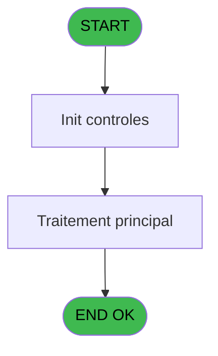
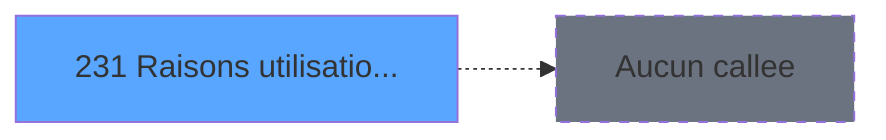

# ADH IDE 231 - Raisons utilisation ADH

> **Analyse**: Phases 1-4 2026-02-08 04:30 -> 04:30 (5s) | Assemblage 04:30
> **Pipeline**: V7.2 Enrichi
> **Structure**: 4 onglets (Resume | Ecrans | Donnees | Connexions)

<!-- TAB:Resume -->

## 1. FICHE D'IDENTITE

| Attribut | Valeur |
|----------|--------|
| Projet | ADH |
| IDE Position | 231 |
| Nom Programme | Raisons utilisation ADH |
| Fichier source | `Prg_231.xml` |
| Dossier IDE | General |
| Taches | 1 (0 ecrans visibles) |
| Tables modifiees | 0 |
| Programmes appeles | 0 |
| Complexite | **BASSE** (score 0/100) |

## 2. DESCRIPTION FONCTIONNELLE

ADH IDE 231 est un programme de consultation des raisons d'utilisation du compte adhérent dans le contexte du workflow Easy Check-Out. Il interroge la table des motifs (cafil069_dat) pour afficher les codes et libellés des raisons possibles, permettant à l'opérateur de caisse de justifier les opérations effectuées lors d'un paiement simplifié.

Ce programme fonctionne comme un zoom/lookup appelé depuis ADH IDE 55 (Easy Check-Out V2.00). Il récupère la liste des motifs de débit/crédit disponibles pour le service en cours et les restitue à l'écran en format grille, facilitant la sélection rapide par l'utilisateur sans avoir à mémoriser les codes.

La logique est simple : lecture de la table de référence, tri par code motif, et présentation en DataView accessible. C'est un programme de support métier typique du domaine Caisse, contribuant à la traçabilité des mouvements de compte en Easy Check-Out.

## 3. BLOCS FONCTIONNELS

## 5. REGLES METIER

4 regles identifiees:

### Autres (4 regles)

#### [RM-001] Si [BR] alors [BO] sinon [BN])

| Element | Detail |
|---------|--------|
| **Condition** | `[BR]` |
| **Si vrai** | [BO] |
| **Si faux** | [BN]) |
| **Expression source** | Expression 5 : `IF([BR],[BO],[BN])` |
| **Exemple** | Si [BR] → [BO]. Sinon → [BN]) |

#### [RM-002] Condition: Trim([BP])='' AND [BY] AND LastClicked () different de 'Bt.Abandonner'

| Element | Detail |
|---------|--------|
| **Condition** | `Trim([BP])='' AND [BY] AND LastClicked ()<>'Bt.Abandonner'` |
| **Si vrai** | Action si vrai |
| **Expression source** | Expression 7 : `Trim([BP])='' AND [BY] AND LastClicked ()<>'Bt.Abandonner'` |
| **Exemple** | Si Trim([BP])='' AND [BY] AND LastClicked ()<>'Bt.Abandonner' → Action si vrai |

#### [RM-003] Condition: [BM] egale 6

| Element | Detail |
|---------|--------|
| **Condition** | `[BM]=6` |
| **Si vrai** | Action si vrai |
| **Expression source** | Expression 8 : `[BM]=6` |
| **Exemple** | Si [BM]=6 → Action si vrai |

#### [RM-004] Condition: [BR] AND [BN] different de 0

| Element | Detail |
|---------|--------|
| **Condition** | `[BR] AND [BN]<>0` |
| **Si vrai** | Action si vrai |
| **Expression source** | Expression 11 : `[BR] AND [BN]<>0` |
| **Exemple** | Si [BR] AND [BN]<>0 → Action si vrai |

## 6. CONTEXTE

- **Appele par**: [Easy Check-Out === V2.00 (IDE 55)](ADH-IDE-55.md)
- **Appelle**: 0 programmes | **Tables**: 1 (W:0 R:1 L:0) | **Taches**: 1 | **Expressions**: 14

<!-- TAB:Ecrans -->

## 8. ECRANS

*(Programme sans ecran visible)*

## 9. NAVIGATION

### 9.3 Structure hierarchique (0 tache)

| Position | Tache | Type | Dimensions | Bloc |
|----------|-------|------|------------|------|

### 9.4 Algorigramme

> **Legende**: Vert = START/END OK | Rouge = END KO | Bleu = Decisions
> *Algorigramme auto-genere. Utiliser `/algorigramme` pour une synthese metier detaillee.*

<!-- TAB:Donnees -->

## 10. TABLES

### Tables utilisees (1)

| ID | Nom | Description | Type | R | W | L | Usages |
|----|-----|-------------|------|---|---|---|--------|
| 1094 | Table_1094 |  | MEM | R |   |   | 1 |

### Colonnes par table (1 / 1 tables avec colonnes identifiees)

Table 1094 - Table_1094 (R) - 1 usages

| Lettre | Variable | Acces | Type |
|--------|----------|-------|------|
| A | v.confirmation | R | Numeric |
| B | v.id primaire | R | Numeric |
| C | v.id secondaire | R | Numeric |
| D | v.commentaire | R | Unicode |
| E | v.Existe Raison Secondaire | R | Logical |
| F | v.Retour Raison | R | Logical |

## 11. VARIABLES

### 11.1 Variables de session (6)

Variables persistantes pendant toute la session.

| Lettre | Nom | Type | Usage dans |
|--------|-----|------|-----------|
| EN | v.confirmation | Numeric | - |
| EO | v.id primaire | Numeric | - |
| EP | v.id secondaire | Numeric | - |
| EQ | v.commentaire | Unicode | - |
| ER | v.Existe Raison Secondaire | Logical | - |
| ES | v.Retour Raison | Logical | - |

## 12. EXPRESSIONS

**14 / 14 expressions decodees (100%)**

### 12.1 Repartition par type

| Type | Expressions | Regles |
|------|-------------|--------|
| CONDITION | 4 | 4 |
| CONSTANTE | 3 | 0 |
| DATE | 1 | 0 |
| OTHER | 4 | 0 |
| REFERENCE_VG | 2 | 0 |

### 12.2 Expressions cles par type

#### CONDITION (4 expressions)

| Type | IDE | Expression | Regle |
|------|-----|------------|-------|
| CONDITION | 8 | `[BM]=6` | [RM-003](#rm-RM-003) |
| CONDITION | 11 | `[BR] AND [BN]<>0` | [RM-004](#rm-RM-004) |
| CONDITION | 5 | `IF([BR],[BO],[BN])` | [RM-001](#rm-RM-001) |
| CONDITION | 7 | `Trim([BP])='' AND [BY] AND LastClicked ()<>'Bt.Abandonner'` | [RM-002](#rm-RM-002) |

#### CONSTANTE (3 expressions)

| Type | IDE | Expression | Regle |
|------|-----|------------|-------|
| CONSTANTE | 9 | `'ABANDON'` | - |
| CONSTANTE | 4 | `0` | - |
| CONSTANTE | 3 | `'ADH'` | - |

#### DATE (1 expressions)

| Type | IDE | Expression | Regle |
|------|-----|------------|-------|
| DATE | 13 | `Date()` | - |

#### OTHER (4 expressions)

| Type | IDE | Expression | Regle |
|------|-----|------------|-------|
| OTHER | 12 | `[CB]` | - |
| OTHER | 14 | `Time()` | - |
| OTHER | 1 | `[BN]` | - |
| OTHER | 10 | `Term()` | - |

#### REFERENCE_VG (2 expressions)

| Type | IDE | Expression | Regle |
|------|-----|------------|-------|
| REFERENCE_VG | 6 | `VG11` | - |
| REFERENCE_VG | 2 | `VG11` | - |

<!-- TAB:Connexions -->

## 13. GRAPHE D'APPELS

### 13.1 Chaine depuis Main (Callers)

Main -> ... -> [Easy Check-Out === V2.00 (IDE 55)](ADH-IDE-55.md) -> **Raisons utilisation ADH (IDE 231)**

### 13.2 Callers

| IDE | Nom Programme | Nb Appels |
|-----|---------------|-----------|
| [55](ADH-IDE-55.md) | Easy Check-Out === V2.00 | 1 |

### 13.3 Callees (programmes appeles)

### 13.4 Detail Callees avec contexte

| IDE | Nom Programme | Appels | Contexte |
|-----|---------------|--------|----------|
| - | (aucun) | - | - |

## 14. RECOMMANDATIONS MIGRATION

### 14.1 Profil du programme

| Metrique | Valeur | Impact migration |
|----------|--------|-----------------|
| Lignes de logique | 32 | Programme compact |
| Expressions | 14 | Peu de logique |
| Tables WRITE | 0 | Impact faible |
| Sous-programmes | 0 | Peu de dependances |
| Ecrans visibles | 0 | Ecran unique ou traitement batch |
| Code desactive | 0% (0 / 32) | Code sain |
| Regles metier | 4 | Quelques regles a preserver |

### 14.2 Plan de migration par bloc

### 14.3 Dependances critiques

| Dependance | Type | Appels | Impact |
|------------|------|--------|--------|

---
*Spec DETAILED generee par Pipeline V7.2 - 2026-02-08 04:31*
