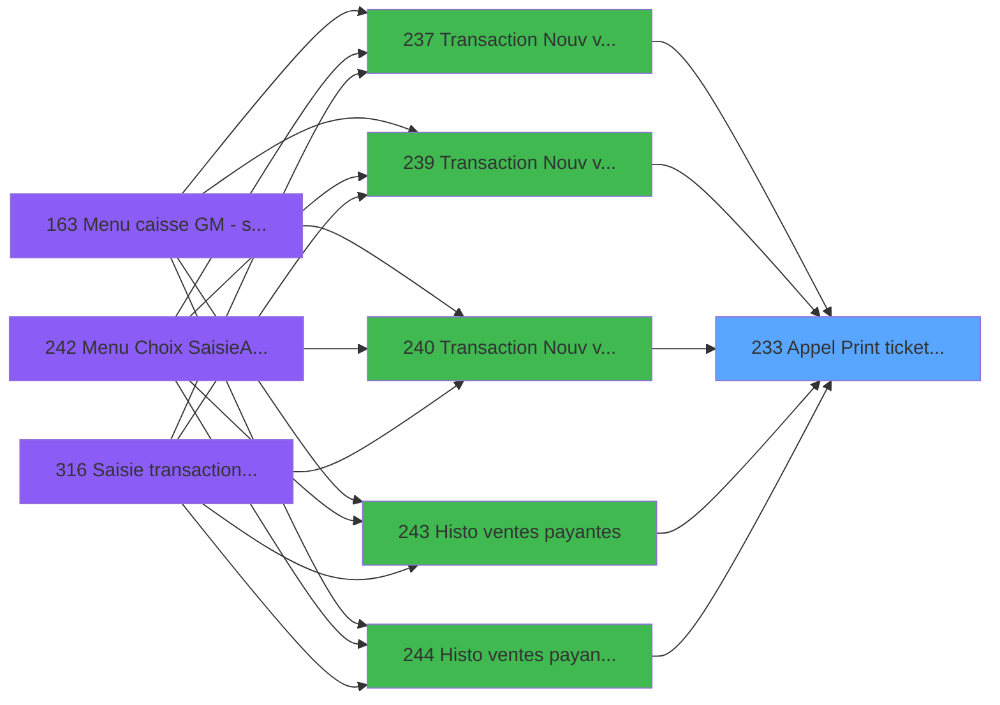
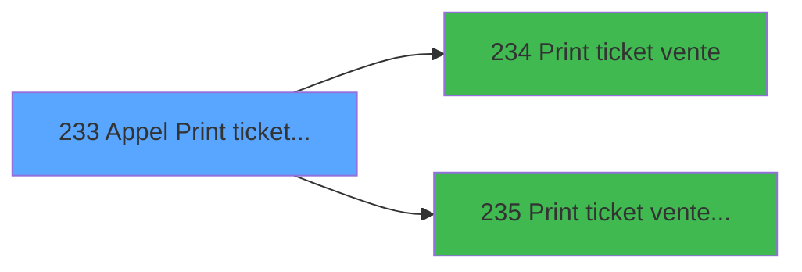

# ADH IDE 233 - Appel Print ticket vente PMS28

> **Analyse**: Phases 1-4 2026-01-30 19:09 -> 19:09 (9s) | Assemblage 19:09
> **Pipeline**: V7.2 Enrichi
> **Structure**: 4 onglets (Resume | Ecrans | Donnees | Connexions)

<!-- TAB:Resume -->

## 1. FICHE D'IDENTITE

| Attribut | Valeur |
|----------|--------|
| Projet | ADH |
| IDE Position | 233 |
| Nom Programme | Appel Print ticket vente PMS28 |
| Fichier source | `Prg_233.xml` |
| Domaine metier | Ventes |
| Taches | 1 (1 ecrans visibles) |
| Tables modifiees | 0 |
| Programmes appeles | 2 |

## 2. DESCRIPTION FONCTIONNELLE

**Appel Print ticket vente PMS28** est le **dispatcher d'impression de tickets** qui **orchestre l'appel au bon programme d'impression selon le format requis (standard ou LEX)**.

**Objectif metier** : Centraliser la logique d'appel des programmes d'impression de tickets de vente. Ce programme agit comme un aiguilleur qui recoit les donnees de la vente (article, prix, client, mode de paiement) et decide quel programme d'impression invoquer selon le contexte (Print ticket vente standard ou Print ticket vente LEX pour les formats specifiques).

Ce programme est accessible depuis [Historique des ventes - Gratui (IDE 312)](ADH-IDE-312.md), [Annulation Ventes Gratuites (IDE 319)](ADH-IDE-319.md), [Histo ventes payantes /PMS-623 (IDE 245)](ADH-IDE-245.md), [Transaction Nouv vente avec GP (IDE 237)](ADH-IDE-237.md), [Transaction Nouv vente PMS-721 (IDE 239)](ADH-IDE-239.md), [Transaction Nouv vente PMS-710 (IDE 240)](ADH-IDE-240.md), [Histo ventes payantes (IDE 243)](ADH-IDE-243.md), [Histo ventes payantes /PMS-605 (IDE 244)](ADH-IDE-244.md), [Histo ventes IGR (IDE 252)](ADH-IDE-252.md), [Histo ventes Gratuités (IDE 253)](ADH-IDE-253.md), [VAD validés à imprimer (IDE 255)](ADH-IDE-255.md).

Le flux de traitement s'organise en **1 blocs fonctionnels** :

- **Traitement** (1 tache) : traitements metier divers

## 3. BLOCS FONCTIONNELS

### 3.1 Traitement (1 tache)

Traitements internes.

---

#### T1 - Veuillez patienter ... [ECRAN]

**Role** : Traitement : Veuillez patienter ....
**Ecran** : 422 x 56 DLU (MDI) | [Voir mockup](#ecran-t1)

## 5. REGLES METIER

*(Aucune regle metier identifiee)*

## 6. CONTEXTE

- **Appele par**: [Historique des ventes - Gratui (IDE 312)](ADH-IDE-312.md), [Annulation Ventes Gratuites (IDE 319)](ADH-IDE-319.md), [Histo ventes payantes /PMS-623 (IDE 245)](ADH-IDE-245.md), [Transaction Nouv vente avec GP (IDE 237)](ADH-IDE-237.md), [Transaction Nouv vente PMS-721 (IDE 239)](ADH-IDE-239.md), [Transaction Nouv vente PMS-710 (IDE 240)](ADH-IDE-240.md), [Histo ventes payantes (IDE 243)](ADH-IDE-243.md), [Histo ventes payantes /PMS-605 (IDE 244)](ADH-IDE-244.md), [Histo ventes IGR (IDE 252)](ADH-IDE-252.md), [Histo ventes Gratuités (IDE 253)](ADH-IDE-253.md), [VAD validés à imprimer (IDE 255)](ADH-IDE-255.md)
- **Appelle**: 2 programmes | **Tables**: 0 (W:0 R:0 L:0) | **Taches**: 1 | **Expressions**: 2

<!-- TAB:Ecrans -->

## 8. ECRANS

### 8.1 Forms visibles (1 / 1)

| # | Position | Tache | Nom | Type | Largeur | Hauteur | Bloc |
|---|----------|-------|-----|------|---------|---------|------|
| 1 | 233.1 | T1 | Veuillez patienter ... | MDI | 422 | 56 | Traitement |

### 8.2 Mockups Ecrans

---

#### 233.1 - Veuillez patienter ...
**Tache** : [T1](#t1) | **Type** : MDI | **Dimensions** : 422 x 56 DLU
**Bloc** : Traitement | **Titre IDE** : Veuillez patienter ...

<!-- FORM-DATA:
{
    "width":  422,
    "controls":  [
                     {
                         "w":  130,
                         "readonly":  true,
                         "y":  13,
                         "type":  "edit",
                         "x":  10,
                         "label":  "P0 od annulation",
                         "h":  20,
                         "var":  "A"
                     },
                     {
                         "w":  130,
                         "readonly":  true,
                         "y":  13,
                         "type":  "edit",
                         "x":  150,
                         "label":  "P0 Nom",
                         "h":  20,
                         "var":  "B"
                     },
                     {
                         "w":  130,
                         "readonly":  true,
                         "y":  13,
                         "type":  "edit",
                         "x":  290,
                         "label":  "P0 Date",
                         "h":  20,
                         "var":  "C"
                     },
                     {
                         "w":  130,
                         "readonly":  true,
                         "y":  13,
                         "type":  "edit",
                         "x":  430,
                         "label":  "P0 Article libelle 1",
                         "h":  20,
                         "var":  "D"
                     },
                     {
                         "w":  130,
                         "readonly":  true,
                         "y":  13,
                         "type":  "edit",
                         "x":  570,
                         "label":  "P0 Article complementaire",
                         "h":  20,
                         "var":  "E"
                     },
                     {
                         "w":  130,
                         "readonly":  true,
                         "y":  43,
                         "type":  "edit",
                         "x":  10,
                         "label":  "P0 Qte *NU*",
                         "h":  20,
                         "var":  "F"
                     }
                 ],
    "type":  "MDI",
    "height":  56,
    "taskId":  1
}
-->

**Champs :**

| Variable | Nom | Type | Saisie |
|----------|-----|------|--------|
| A | P0 od annulation | Logical | Lecture |
| B | P0 Nom | Alpha | Lecture |
| C | P0 Date | Date | Lecture |
| D | P0 Article libelle 1 | Alpha | Lecture |
| E | P0 Article complementaire | Alpha | Lecture |
| F | P0 Qte *NU* | Numeric | Lecture |

## 9. NAVIGATION

Ecran unique: **Veuillez patienter ...**

### 9.3 Structure hierarchique (1 tache)

| Position | Tache | Type | Dimensions | Bloc |
|----------|-------|------|------------|------|
| **233.1** | [**Veuillez patienter ...** (T1)](#t1) [mockup](#ecran-t1) | MDI | 422x56 | Traitement |

<!-- TAB:Donnees -->

## 10. TABLES

### Tables utilisees (0)

| ID | Nom | Description | Type | R | W | L | Usages |
|----|-----|-------------|------|---|---|---|--------|

### Colonnes par table (0 / 0 tables avec colonnes identifiees)

## 11. VARIABLES

### 11.1 Parametres entrants (29)

Variables recues du programme appelant ([Historique des ventes - Gratui (IDE 312)](ADH-IDE-312.md)).

| Lettre | Nom | Type | Usage dans |
|--------|-----|------|-----------|
| A | P0 od annulation | Logical | - |
| B | P0 Nom | Alpha | - |
| C | P0 Date | Date | - |
| D | P0 Article libelle 1 | Alpha | - |
| E | P0 Article complementaire | Alpha | - |
| F | P0 Qte *NU* | Numeric | - |
| G | P0 Prix unitaire | Numeric | - |
| H | P0 Total | Numeric | - |
| I | P0 Devise locale | Alpha | - |
| J | P0 Masque | Alpha | - |
| K | P0 Chambre | Alpha | - |
| L | P0 mode de paiement | Alpha | - |
| M | P0 libelle paiement | Alpha | - |
| N | P0 Numero Ticket(VRL) | Numeric | - |
| O | P0 Num GM | Numeric | - |
| P | P0 UNI/BI | Alpha | - |
| Q | PO is TAI | Logical | - |
| R | P0 TAI Cash | Alpha | - |
| S | P0 TAI start date | Date | - |
| T | P0 TAI end date | Date | - |
| U | P0 OD ? | Logical | - |
| V | P.PDF | Logical | - |
| W | P.Document ticket | Alpha | - |
| X | P.Filename signature | Alpha | - |
| Y | p.Re_Print | Logical | - |
| Z | p.Re_Print_Annulation | Logical | - |
| BA | PI.N° de Ticket si VG TENV10 | Numeric | - |
| BB | Pi.TPE N° Dossier Axis | Alpha | - |
| BC | Pi TPE Num autorisation | Alpha | - |

Toutes les 29 variables (liste complete)

| Cat | Lettre | Nom Variable | Type |
|-----|--------|--------------|------|
| P0 | **A** | P0 od annulation | Logical |
| P0 | **B** | P0 Nom | Alpha |
| P0 | **C** | P0 Date | Date |
| P0 | **D** | P0 Article libelle 1 | Alpha |
| P0 | **E** | P0 Article complementaire | Alpha |
| P0 | **F** | P0 Qte *NU* | Numeric |
| P0 | **G** | P0 Prix unitaire | Numeric |
| P0 | **H** | P0 Total | Numeric |
| P0 | **I** | P0 Devise locale | Alpha |
| P0 | **J** | P0 Masque | Alpha |
| P0 | **K** | P0 Chambre | Alpha |
| P0 | **L** | P0 mode de paiement | Alpha |
| P0 | **M** | P0 libelle paiement | Alpha |
| P0 | **N** | P0 Numero Ticket(VRL) | Numeric |
| P0 | **O** | P0 Num GM | Numeric |
| P0 | **P** | P0 UNI/BI | Alpha |
| P0 | **Q** | PO is TAI | Logical |
| P0 | **R** | P0 TAI Cash | Alpha |
| P0 | **S** | P0 TAI start date | Date |
| P0 | **T** | P0 TAI end date | Date |
| P0 | **U** | P0 OD ? | Logical |
| P0 | **V** | P.PDF | Logical |
| P0 | **W** | P.Document ticket | Alpha |
| P0 | **X** | P.Filename signature | Alpha |
| P0 | **Y** | p.Re_Print | Logical |
| P0 | **Z** | p.Re_Print_Annulation | Logical |
| P0 | **BA** | PI.N° de Ticket si VG TENV10 | Numeric |
| P0 | **BB** | Pi.TPE N° Dossier Axis | Alpha |
| P0 | **BC** | Pi TPE Num autorisation | Alpha |

## 12. EXPRESSIONS

**2 / 2 expressions decodees (100%)**

### 12.1 Repartition par type

| Type | Expressions | Regles |
|------|-------------|--------|
| CALCULATION | 1 | 0 |
| REFERENCE_VG | 1 | 0 |

### 12.2 Expressions cles par type

#### CALCULATION (1 expressions)

| Type | IDE | Expression | Regle |
|------|-----|------------|-------|
| CALCULATION | 2 | `Left(VG22,Len(Trim(VG22))-1)` | - |

#### REFERENCE_VG (1 expressions)

| Type | IDE | Expression | Regle |
|------|-----|------------|-------|
| REFERENCE_VG | 1 | `VG59` | - |

<!-- TAB:Connexions -->

## 13. GRAPHE D'APPELS

### 13.1 Chaine depuis Main (Callers)

Main -> ... -> [Historique des ventes - Gratui (IDE 312)](ADH-IDE-312.md) -> **Appel Print ticket vente PMS28 (IDE 233)**

Main -> ... -> [Annulation Ventes Gratuites (IDE 319)](ADH-IDE-319.md) -> **Appel Print ticket vente PMS28 (IDE 233)**

Main -> ... -> [Histo ventes payantes /PMS-623 (IDE 245)](ADH-IDE-245.md) -> **Appel Print ticket vente PMS28 (IDE 233)**

Main -> ... -> [Transaction Nouv vente avec GP (IDE 237)](ADH-IDE-237.md) -> **Appel Print ticket vente PMS28 (IDE 233)**

Main -> ... -> [Transaction Nouv vente PMS-721 (IDE 239)](ADH-IDE-239.md) -> **Appel Print ticket vente PMS28 (IDE 233)**

Main -> ... -> [Transaction Nouv vente PMS-710 (IDE 240)](ADH-IDE-240.md) -> **Appel Print ticket vente PMS28 (IDE 233)**

Main -> ... -> [Histo ventes payantes (IDE 243)](ADH-IDE-243.md) -> **Appel Print ticket vente PMS28 (IDE 233)**

Main -> ... -> [Histo ventes payantes /PMS-605 (IDE 244)](ADH-IDE-244.md) -> **Appel Print ticket vente PMS28 (IDE 233)**

Main -> ... -> [Histo ventes IGR (IDE 252)](ADH-IDE-252.md) -> **Appel Print ticket vente PMS28 (IDE 233)**

Main -> ... -> [Histo ventes Gratuités (IDE 253)](ADH-IDE-253.md) -> **Appel Print ticket vente PMS28 (IDE 233)**

Main -> ... -> [VAD validés à imprimer (IDE 255)](ADH-IDE-255.md) -> **Appel Print ticket vente PMS28 (IDE 233)**

### 13.2 Callers

| IDE | Nom Programme | Nb Appels |
|-----|---------------|-----------|
| [312](ADH-IDE-312.md) | Historique des ventes - Gratui | 4 |
| [319](ADH-IDE-319.md) | Annulation Ventes Gratuites | 4 |
| [245](ADH-IDE-245.md) | Histo ventes payantes /PMS-623 | 3 |
| [237](ADH-IDE-237.md) | Transaction Nouv vente avec GP | 2 |
| [239](ADH-IDE-239.md) | Transaction Nouv vente PMS-721 | 2 |
| [240](ADH-IDE-240.md) | Transaction Nouv vente PMS-710 | 2 |
| [243](ADH-IDE-243.md) | Histo ventes payantes | 2 |
| [244](ADH-IDE-244.md) | Histo ventes payantes /PMS-605 | 2 |
| [252](ADH-IDE-252.md) | Histo ventes IGR | 2 |
| [253](ADH-IDE-253.md) | Histo ventes Gratuités | 2 |
| [255](ADH-IDE-255.md) | VAD validés à imprimer | 1 |

### 13.3 Callees (programmes appeles)

### 13.4 Detail Callees avec contexte

| IDE | Nom Programme | Appels | Contexte |
|-----|---------------|--------|----------|
| [234](ADH-IDE-234.md) |  Print ticket vente | 1 | Impression ticket/document |
| [235](ADH-IDE-235.md) |  Print ticket vente LEX | 1 | Impression ticket/document |

## 14. RECOMMANDATIONS MIGRATION

### 14.1 Profil du programme

| Metrique | Valeur | Impact migration |
|----------|--------|-----------------|
| Lignes de logique | 44 | Programme compact |
| Expressions | 2 | Peu de logique |
| Tables WRITE | 0 | Impact faible |
| Sous-programmes | 2 | Peu de dependances |
| Ecrans visibles | 1 | Ecran unique ou traitement batch |
| Code desactive | 0% (0 / 44) | Code sain |
| Regles metier | 0 | Pas de regle identifiee |

### 14.2 Plan de migration par bloc

#### Traitement (1 tache: 1 ecran, 0 traitement)

- **Strategie** : 1 composant(s) UI (Razor/React) avec formulaires et validation.
- 2 sous-programme(s) a migrer ou a reutiliser depuis les services existants.
- Decomposer les taches en services unitaires testables.

### 14.3 Dependances critiques

| Dependance | Type | Appels | Impact |
|------------|------|--------|--------|
| [ Print ticket vente LEX (IDE 235)](ADH-IDE-235.md) | Sous-programme | 1x | Normale - Impression ticket/document |
| [ Print ticket vente (IDE 234)](ADH-IDE-234.md) | Sous-programme | 1x | Normale - Impression ticket/document |

---
*Spec DETAILED generee par Pipeline V7.2 - 2026-01-30 19:09*
