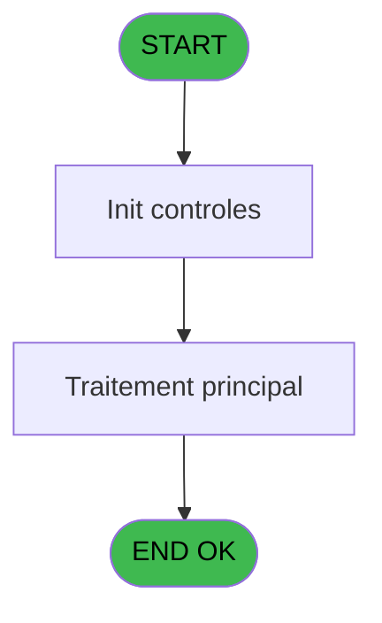

# ADH IDE 233 - Appel Print ticket vente PMS28

> **Analyse**: Phases 1-4 2026-02-08 04:31 -> 04:31 (5s) | Assemblage 04:31
> **Pipeline**: V7.2 Enrichi
> **Structure**: 4 onglets (Resume | Ecrans | Donnees | Connexions)

<!-- TAB:Resume -->

## 1. FICHE D'IDENTITE

| Attribut | Valeur |
|----------|--------|
| Projet | ADH |
| IDE Position | 233 |
| Nom Programme | Appel Print ticket vente PMS28 |
| Fichier source | `Prg_233.xml` |
| Dossier IDE | Ventes |
| Taches | 1 (0 ecrans visibles) |
| Tables modifiees | 0 |
| Programmes appeles | 0 |
| Complexite | **BASSE** (score 0/100) |
| Statut | **ORPHELIN_POTENTIEL** |

## 2. DESCRIPTION FONCTIONNELLE

ADH IDE 233 **Appel Print ticket vente PMS28** est un programme de **routage d'impression** qui orchestre l'appel au bon programme d'impression selon le contexte. Il agit comme un aiguilleur centralisé entre 10 programmes appelants (historiques ventes, transactions, annulations) et 2 programmes d'exécution d'impression (Print ticket standard ou Print ticket LEX pour les formats spécialisés).

Le programme reçoit 29 paramètres d'entrée décrivant la vente (article, prix, client, mode paiement, TAI, données TPE, signatures) dans un seul écran texte « Veuillez patienter... » sans traitement métier visible. La logique reste minimaliste : 2 expressions seulement (une référence à VG59 et un calcul sur VG22), aucune modification de table, aucune règle complexe identifiée.

En termes de migration, c'est un programme léger et bien candidat : 44 lignes de logique compactes, 0% de code désactivé, peu de dépendances externes. Il se réduira simplement à un endpoint de routage (dispatcher pattern) qui choisit entre deux services d'impression selon les conditions transmises en paramètres.

## 3. BLOCS FONCTIONNELS

## 5. REGLES METIER

*(Aucune regle metier identifiee dans les expressions)*

## 6. CONTEXTE

- **Appele par**: (aucun)
- **Appelle**: 0 programmes | **Tables**: 0 (W:0 R:0 L:0) | **Taches**: 1 | **Expressions**: 2

<!-- TAB:Ecrans -->

## 8. ECRANS

*(Programme sans ecran visible)*

## 9. NAVIGATION

### 9.3 Structure hierarchique (0 tache)

| Position | Tache | Type | Dimensions | Bloc |
|----------|-------|------|------------|------|

### 9.4 Algorigramme

> **Legende**: Vert = START/END OK | Rouge = END KO | Bleu = Decisions
> *Algorigramme auto-genere. Utiliser `/algorigramme` pour une synthese metier detaillee.*

<!-- TAB:Donnees -->

## 10. TABLES

### Tables utilisees (0)

| ID | Nom | Description | Type | R | W | L | Usages |
|----|-----|-------------|------|---|---|---|--------|

### Colonnes par table (0 / 0 tables avec colonnes identifiees)

## 11. VARIABLES

### 11.1 Parametres entrants (29)

Variables recues en parametre.

| Lettre | Nom | Type | Usage dans |
|--------|-----|------|-----------|
| EN | P0 od annulation | Logical | - |
| EO | P0 Nom | Alpha | - |
| EP | P0 Date | Date | - |
| EQ | P0 Article libelle 1 | Alpha | - |
| ER | P0 Article complementaire | Alpha | - |
| ES | P0 Qte *NU* | Numeric | - |
| ET | P0 Prix unitaire | Numeric | - |
| EU | P0 Total | Numeric | - |
| EV | P0 Devise locale | Alpha | - |
| EW | P0 Masque | Alpha | - |
| EX | P0 Chambre | Alpha | - |
| EY | P0 mode de paiement | Alpha | - |
| EZ | P0 libelle paiement | Alpha | - |
| FA | P0 Numero Ticket(VRL) | Numeric | - |
| FB | P0 Num GM | Numeric | - |
| FC | P0 UNI/BI | Alpha | - |
| FD | PO is TAI | Logical | - |
| FE | P0 TAI Cash | Alpha | - |
| FF | P0 TAI start date | Date | - |
| FG | P0 TAI end date | Date | - |
| FH | P0 OD ? | Logical | - |
| FI | P.PDF | Logical | - |
| FJ | P.Document ticket | Alpha | - |
| FK | P.Filename signature | Alpha | - |
| FL | p.Re_Print | Logical | - |
| FM | p.Re_Print_Annulation | Logical | - |
| FN | PI.N° de Ticket si VG TENV10 | Numeric | - |
| FO | Pi.TPE N° Dossier Axis | Alpha | - |
| FP | Pi TPE Num autorisation | Alpha | - |

Toutes les 29 variables (liste complete)

| Cat | Lettre | Nom Variable | Type |
|-----|--------|--------------|------|
| P0 | **EN** | P0 od annulation | Logical |
| P0 | **EO** | P0 Nom | Alpha |
| P0 | **EP** | P0 Date | Date |
| P0 | **EQ** | P0 Article libelle 1 | Alpha |
| P0 | **ER** | P0 Article complementaire | Alpha |
| P0 | **ES** | P0 Qte *NU* | Numeric |
| P0 | **ET** | P0 Prix unitaire | Numeric |
| P0 | **EU** | P0 Total | Numeric |
| P0 | **EV** | P0 Devise locale | Alpha |
| P0 | **EW** | P0 Masque | Alpha |
| P0 | **EX** | P0 Chambre | Alpha |
| P0 | **EY** | P0 mode de paiement | Alpha |
| P0 | **EZ** | P0 libelle paiement | Alpha |
| P0 | **FA** | P0 Numero Ticket(VRL) | Numeric |
| P0 | **FB** | P0 Num GM | Numeric |
| P0 | **FC** | P0 UNI/BI | Alpha |
| P0 | **FD** | PO is TAI | Logical |
| P0 | **FE** | P0 TAI Cash | Alpha |
| P0 | **FF** | P0 TAI start date | Date |
| P0 | **FG** | P0 TAI end date | Date |
| P0 | **FH** | P0 OD ? | Logical |
| P0 | **FI** | P.PDF | Logical |
| P0 | **FJ** | P.Document ticket | Alpha |
| P0 | **FK** | P.Filename signature | Alpha |
| P0 | **FL** | p.Re_Print | Logical |
| P0 | **FM** | p.Re_Print_Annulation | Logical |
| P0 | **FN** | PI.N° de Ticket si VG TENV10 | Numeric |
| P0 | **FO** | Pi.TPE N° Dossier Axis | Alpha |
| P0 | **FP** | Pi TPE Num autorisation | Alpha |

## 12. EXPRESSIONS

**2 / 2 expressions decodees (100%)**

### 12.1 Repartition par type

| Type | Expressions | Regles |
|------|-------------|--------|
| CALCULATION | 1 | 0 |
| REFERENCE_VG | 1 | 0 |

### 12.2 Expressions cles par type

#### CALCULATION (1 expressions)

| Type | IDE | Expression | Regle |
|------|-----|------------|-------|
| CALCULATION | 2 | `Left(VG22,Len(Trim(VG22))-1)` | - |

#### REFERENCE_VG (1 expressions)

| Type | IDE | Expression | Regle |
|------|-----|------------|-------|
| REFERENCE_VG | 1 | `VG59` | - |

<!-- TAB:Connexions -->

## 13. GRAPHE D'APPELS

### 13.1 Chaine depuis Main (Callers)

**Chemin**: (pas de callers directs)

### 13.2 Callers

| IDE | Nom Programme | Nb Appels |
|-----|---------------|-----------|
| - | (aucun) | - |

### 13.3 Callees (programmes appeles)

### 13.4 Detail Callees avec contexte

| IDE | Nom Programme | Appels | Contexte |
|-----|---------------|--------|----------|
| - | (aucun) | - | - |

## 14. RECOMMANDATIONS MIGRATION

### 14.1 Profil du programme

| Metrique | Valeur | Impact migration |
|----------|--------|-----------------|
| Lignes de logique | 44 | Programme compact |
| Expressions | 2 | Peu de logique |
| Tables WRITE | 0 | Impact faible |
| Sous-programmes | 0 | Peu de dependances |
| Ecrans visibles | 0 | Ecran unique ou traitement batch |
| Code desactive | 0% (0 / 44) | Code sain |
| Regles metier | 0 | Pas de regle identifiee |

### 14.2 Plan de migration par bloc

### 14.3 Dependances critiques

| Dependance | Type | Appels | Impact |
|------------|------|--------|--------|

---
*Spec DETAILED generee par Pipeline V7.2 - 2026-02-08 04:32*
