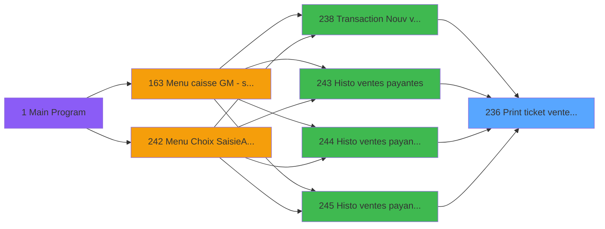
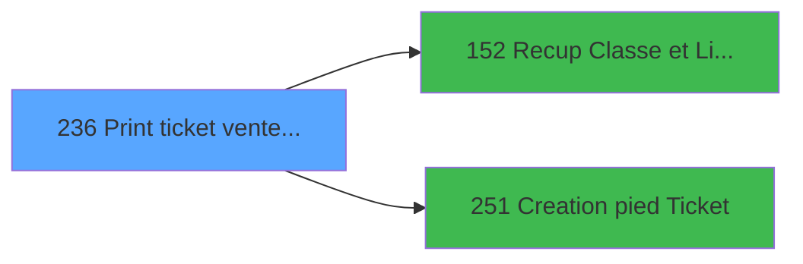

# ADH IDE 236 - Print ticket vente PMS-584

> **Analyse**: Phases 1-4 2026-01-29 19:45 -> 19:45 (9s) | Assemblage 19:45
> **Pipeline**: V7.0 Deep Analysis
> **Structure**: 4 onglets (Resume | Ecrans | Donnees | Connexions)

<!-- TAB:Resume -->

## 1. FICHE D'IDENTITE

| Attribut | Valeur |
|----------|--------|
| Projet | ADH |
| IDE Position | 236 |
| Nom Programme | Print ticket vente PMS-584 |
| Fichier source | `Prg_236.xml` |
| Domaine metier | Ventes |
| Taches | 38 (15 ecrans visibles) |
| Tables modifiees | 0 |
| Programmes appeles | 2 |

## 2. DESCRIPTION FONCTIONNELLE

**Print ticket vente PMS-584** assure la gestion complete de ce processus, accessible depuis Transaction Nouv vente PMS-584, Histo ventes payantes, Histo ventes payantes /PMS-605, Histo ventes payantes /PMS-623.

Le flux de traitement s'organise en **4 blocs fonctionnels** :

- **Traitement** (16 taches) : traitements metier divers
- **Impression** (15 taches) : generation de tickets et documents
- **Reglement** (5 taches) : gestion des moyens de paiement et reglements
- **Consultation** (2 taches) : ecrans de recherche, selection et consultation

Le programme delegue des operations a **2 sous-programmes** couvrant :

- **Impression ticket/document** : Creation pied Ticket
- **Recuperation donnees** : Recup Classe et Lib du MOP

## 3. BLOCS FONCTIONNELS

### 3.1 Traitement (16 taches)

Traitements internes : 16 tache(s) de traitement metier.

- **Veuillez patienter ...** (T1, MDI, 422x56)
- **Impression reçu change** (T3, MDI, 333x86)
- **Veuillez patienter ...** (T18, MDI, 424x56)
- **Veuillez patienter ...** (T23, MDI, 424x56)
- **Veuillez patienter ...** (T29, MDI, 435x63)
- **Errors** (T37, Type0, 600x259)
- **** (T41, Type0, 725x303)
- *Internes*: Counter (T2), Impression reçu change (T5), Counter (T11), Impression reçu change (T12), Impression reçu change (T13), Récup. dates de séjour /PMS28/ (T24), Récup. dates de séjour /PMS28/ (T31), recup terminal (T35), recup terminal (T36)

### 3.2 Consultation (2 taches)

Consultation de donnees : 2 tache(s) permettent l'acces aux informations existantes.

- *Internes*: Recherche dates de séjour (T4), Recherche dates de séjour (T9)
- **Sous-programmes**: Recup Classe et Lib du MOP (IDE 152)

### 3.3 Impression (15 taches)

Generation des documents et tickets : 15 tache(s) gerent l'impression des recus, tickets et documents associes a l'operation.

- **Print Tva** (T8, Type0, 506x0)
- **Print Tva** (T15, Type0, 506x0)
- **Printer 5** (T17, MDI, 424x56)
- **Print Tva** (T21, Type0, 506x0)
- **Printer 5** (T22, MDI, 424x56)
- **Print Tva** (T27, Type0, 506x0)
- **Printer 9** (T28, MDI, 424x56)
- **Print Tva** (T34, Type0, 565x0)
- *Internes*: Print reduction (T6), Edition LCO Liberation (T10), Print reduction (T14), Print reduction (T20), Print reduction (T26), Edition LCO Liberation (T30), Print reduction (T32)
- **Sous-programmes**: Creation pied Ticket (IDE 251)
- **Variables cles**: N (P0 Numero Ticket(VRL)), BH (v.Itération Compteur ticket), BI (v.NumeroTicketsvg), BL (v.Num printer), W (P.Document ticket)

### 3.4 Reglement (5 taches)

Gestion des moyens de paiement : le programme traite 5 tache(s) de reglement couvrant le choix du mode de paiement, le calcul des montants et la validation du paiement.

- *Internes*: Edition Multi Moyen Paiement (T7), Edition Multi Moyen Paiement (T16), Edition Multi Moyen Paiement (T19), Edition Multi Moyen Paiement (T25), Edition Multi Moyen Paiement (T33)
- **Sous-programmes**: Recup Classe et Lib du MOP (IDE 152)
- **Variables cles**: H (P0 Total), I (P0 Devise locale), L (P0 mode de paiement), M (P0 libelle paiement)

## 5. REGLES METIER

*(Aucune regle metier identifiee)*

## 6. CONTEXTE

- **Appele par**: Transaction Nouv vente PMS-584 (IDE 238), Histo ventes payantes (IDE 243), Histo ventes payantes /PMS-605 (IDE 244), Histo ventes payantes /PMS-623 (IDE 245)
- **Appelle**: 2 programmes | **Tables**: 15 (W:0 R:11 L:9) | **Taches**: 38 | **Expressions**: 19

<!-- TAB:Ecrans -->

## 8. ECRANS

### 8.1 Forms visibles (15 / 38)

| # | Tache | Nom | Type | Largeur | Hauteur |
|---|-------|-----|------|---------|---------|
| 1 | 1 | Veuillez patienter ... | MDI | 422 | 56 |
| 2 | 3 | Impression reçu change | MDI | 333 | 86 |
| 3 | 8 | Print Tva | Type0 | 506 | 0 |
| 4 | 15 | Print Tva | Type0 | 506 | 0 |
| 5 | 17 | Printer 5 | MDI | 424 | 56 |
| 6 | 18 | Veuillez patienter ... | MDI | 424 | 56 |
| 7 | 21 | Print Tva | Type0 | 506 | 0 |
| 8 | 22 | Printer 5 | MDI | 424 | 56 |
| 9 | 23 | Veuillez patienter ... | MDI | 424 | 56 |
| 10 | 27 | Print Tva | Type0 | 506 | 0 |
| 11 | 28 | Printer 9 | MDI | 424 | 56 |
| 12 | 29 | Veuillez patienter ... | MDI | 435 | 63 |
| 13 | 34 | Print Tva | Type0 | 565 | 0 |
| 14 | 37 | Errors | Type0 | 600 | 259 |
| 15 | 41 |  | Type0 | 725 | 303 |

### 8.2 Mockups Ecrans

```
+============================+
| Veuillez patienter ... [... |
+----------------------------+
|  [P0 od annulation (A)] ...|
|  [W0 en-tête ? (BE) ____...|
|  [W0 copies (BG) ____]     |
|                            |
+============================+

+============================+
| Impression reçu change [... |
+----------------------------+
|  [P0 od annulation (A)] ...|
|  [W0 en-tête ? (BE) ____...|
|  [W0 copies (BG) ____]     |
|                            |
+============================+

+============================+
| Print Tva [Type0] 506x0 ... |
+----------------------------+
|  [P0 od annulation (A)] ...|
|                            |
|                            |
|                            |
+============================+

+============================+
| Print Tva [Type0] 506x0 ... |
+----------------------------+
|  [P0 od annulation (A)] ...|
|                            |
|                            |
|                            |
+============================+

+============================+
| Printer 5 [MDI] 424x56 -... |
+----------------------------+
|  [P0 od annulation (A)] ...|
|                            |
|                            |
|                            |
+============================+

+============================+
| Veuillez patienter ... [... |
+----------------------------+
|  [P0 od annulation (A)] ...|
|  [W0 en-tête ? (BE) ____...|
|  [W0 copies (BG) ____]     |
|                            |
+============================+

+============================+
| Print Tva [Type0] 506x0 ... |
+----------------------------+
|  [P0 od annulation (A)] ...|
|                            |
|                            |
|                            |
+============================+

+============================+
| Printer 5 [MDI] 424x56 -... |
+----------------------------+
|  [P0 od annulation (A)] ...|
|                            |
|                            |
|                            |
+============================+

+============================+
| Veuillez patienter ... [... |
+----------------------------+
|  [P0 od annulation (A)] ...|
|  [W0 en-tête ? (BE) ____...|
|  [W0 copies (BG) ____]     |
|                            |
+============================+

+============================+
| Print Tva [Type0] 506x0 ... |
+----------------------------+
|  [P0 od annulation (A)] ...|
|                            |
|                            |
|                            |
+============================+

+============================+
| Printer 9 [MDI] 424x56 -... |
+----------------------------+
|  [P0 od annulation (A)] ...|
|                            |
|                            |
|                            |
+============================+

+============================+
| Veuillez patienter ... [... |
+----------------------------+
|  [P0 od annulation (A)] ...|
|  [W0 en-tête ? (BE) ____...|
|  [W0 copies (BG) ____]     |
|                            |
+============================+

+============================+
| Print Tva [Type0] 565x0 ... |
+----------------------------+
|  [P0 od annulation (A)] ...|
|                            |
|                            |
|                            |
+============================+

+============================+
| Errors [Type0] 600x259 -... |
+----------------------------+
|  [P0 od annulation (A)] ...|
|  [W0 en-tête ? (BE) ____...|
|  [W0 copies (BG) ____]     |
|                            |
|                            |
+============================+

+==================================+
|  [Type0] 725x303 - Tache 41      |
+----------------------------------+
|  [P0 od annulation (A)]  [P0 N...|
|  [W0 en-tête ? (BE) ____]  [W0...|
|  [W0 copies (BG) ____]           |
|                                  |
|                                  |
+==================================+

```

## 9. NAVIGATION

### 9.1 Enchainement des ecrans


**Detail par bloc:**

- **Traitement**: Veuillez patienter ... (T1), Impression reçu change (T3), Veuillez patienter ... (T18), Veuillez patienter ... (T23), Veuillez patienter ... (T29), Errors (T37),  (T41)
- **Consultation**: traitement interne (2 taches)
- **Impression**: Print Tva (T8), Print Tva (T15), Printer 5 (T17), Print Tva (T21), Printer 5 (T22), Print Tva (T27), Printer 9 (T28), Print Tva (T34)
- **Reglement**: traitement interne (5 taches)

### 9.2 Logique decisionnelle

*(Pas de regles metier pour l'algorigramme)*

### 9.3 Structure hierarchique (38 taches)

- **236.1** Veuillez patienter ... (T1) **[ECRAN]** (MDI) 422x56 *[Traitement]*
  - **236.1.1** Counter (T2)  (MDI)
  - **236.1.2** Impression reçu change (T3) **[ECRAN]** (MDI) 333x86
  - **236.1.3** Impression reçu change (T5)  (MDI)
  - **236.1.4** Counter (T11)  (MDI)
  - **236.1.5** Impression reçu change (T12)  (MDI)
  - **236.1.6** Impression reçu change (T13)  (MDI)
  - **236.1.7** Veuillez patienter ... (T18) **[ECRAN]** (MDI) 424x56
  - **236.1.8** Veuillez patienter ... (T23) **[ECRAN]** (MDI) 424x56
  - **236.1.9** Récup. dates de séjour /PMS28/ (T24)  
  - **236.1.10** Veuillez patienter ... (T29) **[ECRAN]** (MDI) 435x63
  - **236.1.11** Récup. dates de séjour /PMS28/ (T31)  
  - **236.1.12** recup terminal (T35)  
  - **236.1.13** recup terminal (T36)  
  - **236.1.14** Errors (T37) **[ECRAN]**  600x259
  - **236.1.15** (sans nom) (T41) **[ECRAN]**  725x303
- **236.2** Recherche dates de séjour (T4)   *[Consultation]*
  - **236.2.1** Recherche dates de séjour (T9)  
- **236.3** Print reduction (T6)   *[Impression]*
  - **236.3.1** Print Tva (T8) **[ECRAN]**  506x0
  - **236.3.2** Edition LCO Liberation (T10)  
  - **236.3.3** Print reduction (T14)  
  - **236.3.4** Print Tva (T15) **[ECRAN]**  506x0
  - **236.3.5** Printer 5 (T17) **[ECRAN]** (MDI) 424x56
  - **236.3.6** Print reduction (T20)  
  - **236.3.7** Print Tva (T21) **[ECRAN]**  506x0
  - **236.3.8** Printer 5 (T22) **[ECRAN]** (MDI) 424x56
  - **236.3.9** Print reduction (T26)  
  - **236.3.10** Print Tva (T27) **[ECRAN]**  506x0
  - **236.3.11** Printer 9 (T28) **[ECRAN]** (MDI) 424x56
  - **236.3.12** Edition LCO Liberation (T30)  
  - **236.3.13** Print reduction (T32)  
  - **236.3.14** Print Tva (T34) **[ECRAN]**  565x0
- **236.4** Edition Multi Moyen Paiement (T7)   *[Reglement]*
  - **236.4.1** Edition Multi Moyen Paiement (T16)  
  - **236.4.2** Edition Multi Moyen Paiement (T19)  
  - **236.4.3** Edition Multi Moyen Paiement (T25)  
  - **236.4.4** Edition Multi Moyen Paiement (T33)  

<!-- TAB:Donnees -->

## 10. TABLES

### 10.1 Tables utilisees (15)

| ID | Nom | Description | Type | R | W | L | Usages |
|----|-----|-------------|------|---|---|---|--------|
| 31 | gm-complet_______gmc |  | DB | R |   |   | 2 |
| 34 | hebergement______heb | Hebergement (chambres) | DB | R |   | L | 4 |
| 40 | comptable________cte |  | DB | R |   |   | 4 |
| 67 | tables___________tab |  | DB | R |   | L | 3 |
| 69 | initialisation___ini |  | DB | R |   |   | 1 |
| 77 | articles_________art |  | DB | R |   | L | 3 |
| 263 | vente |  | DB |   |   | L | 4 |
| 596 | tempo_ecran_police | Table temporaire ecran | TMP | R |   | L | 14 |
| 728 | arc_cc_total |  | DB |   |   | L | 1 |
| 818 | Circuit supprime |  | DB |   |   | L | 1 |
| 847 | stat_lieu_vente_date | Statistiques point de vente | TMP | R |   | L | 15 |
| 867 | log_maj_tpe |  | DB | R |   |   | 5 |
| 878 | categorie_operation_mw |  | DB | R |   |   | 2 |
| 904 | Boo_AvailibleEmployees |  | DB |   |   | L | 3 |
| 1037 | Table_1037 |  | MEM | R |   |   | 2 |

### 10.2 Colonnes par table

<details>
<summary>Table 31 - gm-complet_______gmc (R) - 2 usages</summary>

*Colonnes accessibles via outils MCP (magic_get_line)*

</details>

<details>
<summary>Table 34 - hebergement______heb (R/L) - 4 usages</summary>

*Colonnes accessibles via outils MCP (magic_get_line)*

</details>

<details>
<summary>Table 40 - comptable________cte (R) - 4 usages</summary>

*Colonnes accessibles via outils MCP (magic_get_line)*

</details>

<details>
<summary>Table 67 - tables___________tab (R/L) - 3 usages</summary>

*Colonnes accessibles via outils MCP (magic_get_line)*

</details>

<details>
<summary>Table 69 - initialisation___ini (R) - 1 usages</summary>

*Colonnes accessibles via outils MCP (magic_get_line)*

</details>

<details>
<summary>Table 77 - articles_________art (R/L) - 3 usages</summary>

*Colonnes accessibles via outils MCP (magic_get_line)*

</details>

<details>
<summary>Table 596 - tempo_ecran_police (R/L) - 14 usages</summary>

*Colonnes accessibles via outils MCP (magic_get_line)*

</details>

<details>
<summary>Table 847 - stat_lieu_vente_date (R/L) - 15 usages</summary>

*Colonnes accessibles via outils MCP (magic_get_line)*

</details>

<details>
<summary>Table 867 - log_maj_tpe (R) - 5 usages</summary>

*Colonnes accessibles via outils MCP (magic_get_line)*

</details>

<details>
<summary>Table 878 - categorie_operation_mw (R) - 2 usages</summary>

*Colonnes accessibles via outils MCP (magic_get_line)*

</details>

<details>
<summary>Table 1037 - Table_1037 (R) - 2 usages</summary>

*Colonnes accessibles via outils MCP (magic_get_line)*

</details>

## 11. VARIABLES

### 11.1 Variables principales (Top 20 par usage / 39)

| Cat | Lettre | Nom Variable | Type | Usages | Ref |
|-----|--------|--------------|------|--------|-----|
| Autre | **V** | P.PDF | Logical | 1x | `{0,22}` |
| P0 | **O** | P0 Num GM | Numeric | 1x | `{0,15}` |
| P0 | **U** | P0 OD ? | Logical | 1x | `{0,21}` |
| V. | **BM** | v. nb lignes erreurs | Numeric | - | `{0,65}` |
| V. | **BK** | v.TPE ICMP | Logical | - | `{0,63}` |
| V. | **BL** | v.Num printer | Numeric | - | `{0,64}` |
| V. | **BJ** | v.Date Conso ou date séjour | Alpha | - | `{0,62}` |
| W0 | **BG** | W0 copies | Numeric | - | `{0,59}` |
| W0 | **BF** | W0 fin tâche | Alpha | - | `{0,58}` |
| V. | **BI** | v.NumeroTicketsvg | Numeric | - | `{0,61}` |
| V. | **BH** | v.Itération Compteur ticket | Numeric | - | `{0,60}` |
| Autre | **BA** | P.i.N° de Ticket si VG TENV10 | Numeric | - | `{0,53}` |
| Autre | **Z** | p.Re_Print_Annulation | Logical | - | `{0,26}` |
| Autre | **BC** | P.i.TPE.N° autorisation | Alpha | - | `{0,55}` |
| Autre | **BB** | P.i.TPE.N° Dossier Axis | Alpha | - | `{0,54}` |
| Autre | **Y** | P.i Duplicata | Logical | - | `{0,25}` |
| Autre | **BD** | P.i.Decline envoi mail | Logical | - | `{0,56}` |
| Autre | **Q** | PO is TAI | Logical | - | `{0,17}` |
| Autre | **X** | P.Filename signature | Alpha | - | `{0,24}` |
| Autre | **W** | P.Document ticket | Alpha | - | `{0,23}` |

### 11.2 Toutes les variables (39)

<details>
<summary>Voir les 39 variables</summary>

| Cat | Lettre | Nom Variable | Type | Ref |
|-----|--------|--------------|------|-----|
| Autre | **Q** | PO is TAI | Logical | `{0,17}` |
| Autre | **V** | P.PDF | Logical | `{0,22}` |
| Autre | **W** | P.Document ticket | Alpha | `{0,23}` |
| Autre | **X** | P.Filename signature | Alpha | `{0,24}` |
| Autre | **Y** | P.i Duplicata | Logical | `{0,25}` |
| Autre | **Z** | p.Re_Print_Annulation | Logical | `{0,26}` |
| Autre | **BA** | P.i.N° de Ticket si VG TENV10 | Numeric | `{0,53}` |
| Autre | **BB** | P.i.TPE.N° Dossier Axis | Alpha | `{0,54}` |
| Autre | **BC** | P.i.TPE.N° autorisation | Alpha | `{0,55}` |
| Autre | **BD** | P.i.Decline envoi mail | Logical | `{0,56}` |
| P0 | **A** | P0 od annulation | Logical | `{0,1}` |
| P0 | **B** | P0 Nom | Alpha | `{0,2}` |
| P0 | **C** | P0 Date | Date | `{0,3}` |
| P0 | **D** | P0 Article libelle 1 | Alpha | `{0,4}` |
| P0 | **E** | P0 Article complementaire | Alpha | `{0,5}` |
| P0 | **F** | P0 Qte *NU* | Numeric | `{0,6}` |
| P0 | **G** | P0 Prix unitaire | Numeric | `{0,7}` |
| P0 | **H** | P0 Total | Numeric | `{0,8}` |
| P0 | **I** | P0 Devise locale | Alpha | `{0,9}` |
| P0 | **J** | P0 Masque | Alpha | `{0,10}` |
| P0 | **K** | P0 Chambre | Alpha | `{0,11}` |
| P0 | **L** | P0 mode de paiement | Alpha | `{0,12}` |
| P0 | **M** | P0 libelle paiement | Alpha | `{0,13}` |
| P0 | **N** | P0 Numero Ticket(VRL) | Numeric | `{0,14}` |
| P0 | **O** | P0 Num GM | Numeric | `{0,15}` |
| P0 | **P** | P0 UNI/BI | Alpha | `{0,16}` |
| P0 | **R** | P0 TAI Cash | Alpha | `{0,18}` |
| P0 | **S** | P0 TAI start date | Date | `{0,19}` |
| P0 | **T** | P0 TAI end date | Date | `{0,20}` |
| P0 | **U** | P0 OD ? | Logical | `{0,21}` |
| V. | **BH** | v.Itération Compteur ticket | Numeric | `{0,60}` |
| V. | **BI** | v.NumeroTicketsvg | Numeric | `{0,61}` |
| V. | **BJ** | v.Date Conso ou date séjour | Alpha | `{0,62}` |
| V. | **BK** | v.TPE ICMP | Logical | `{0,63}` |
| V. | **BL** | v.Num printer | Numeric | `{0,64}` |
| V. | **BM** | v. nb lignes erreurs | Numeric | `{0,65}` |
| W0 | **BE** | W0 en-tête ? | Alpha | `{0,57}` |
| W0 | **BF** | W0 fin tâche | Alpha | `{0,58}` |
| W0 | **BG** | W0 copies | Numeric | `{0,59}` |

</details>

## 12. EXPRESSIONS

**19 / 19 expressions decodees (100%)**

### 12.1 Repartition par bloc

| Bloc fonctionnel | Expressions | Regles |
|-----------------|-------------|--------|
| Impression | 7 | 0 |
| Autre | 12 | 0 |

### 12.2 Expressions cles par bloc

#### Impression (7 expressions)

| Type | IDE | Expression | Regle |
|------|-----|------------|-------|
| DATE | 16 | `Translate ('%TempDir%')&'ticket_vente_'&IF(P0 OD ? [U],'OD_','')&
Str(P0 Num GM [O],'8P0')&'_'& DStr (Date(),'YYMMDD')&
'_'&TStr(Time(),'HHMMSS')&'.pdf'` | - |
| OTHER | 6 | `GetParam ('CURRENTPRINTERNUM')=8` | - |
| OTHER | 7 | `GetParam ('CURRENTPRINTERNUM')=9` | - |
| OTHER | 17 | `GetParam ('CURRENTPRINTERNUM')` | - |
| OTHER | 3 | `GetParam ('CURRENTPRINTERNUM')=1` | - |
| ... | | *+2 autres* | |

#### Autre (12 expressions)

| Type | IDE | Expression | Regle |
|------|-----|------------|-------|
| CONSTANT | 9 | `'VSL'` | - |
| CONSTANT | 8 | `'VRL'` | - |
| OTHER | 14 | `VG78` | - |
| OTHER | 13 | `'TRUE'LOG` | - |
| OTHER | 15 | `NOT VG78` | - |
| ... | | *+7 autres* | |

<!-- TAB:Connexions -->

## 13. GRAPHE D'APPELS

### 13.1 Chaine depuis Main (Callers)

Main -> ... -> Transaction Nouv vente PMS-584 (IDE 238) -> **Print ticket vente PMS-584 (IDE 236)**

Main -> ... -> Histo ventes payantes (IDE 243) -> **Print ticket vente PMS-584 (IDE 236)**

Main -> ... -> Histo ventes payantes /PMS-605 (IDE 244) -> **Print ticket vente PMS-584 (IDE 236)**

Main -> ... -> Histo ventes payantes /PMS-623 (IDE 245) -> **Print ticket vente PMS-584 (IDE 236)**



### 13.2 Callers

| IDE | Nom Programme | Nb Appels |
|-----|---------------|-----------|
| 238 | Transaction Nouv vente PMS-584 | 4 |
| 243 | Histo ventes payantes | 2 |
| 244 | Histo ventes payantes /PMS-605 | 2 |
| 245 | Histo ventes payantes /PMS-623 | 2 |

### 13.3 Callees (programmes appeles)



### 13.4 Detail Callees avec contexte

| IDE | Nom Programme | Appels | Contexte |
|-----|---------------|--------|----------|
| 152 | Recup Classe et Lib du MOP | 5 | Recuperation donnees |
| 251 | Creation pied Ticket | 5 | Impression ticket/document |

## 14. RECOMMANDATIONS MIGRATION

### 14.1 Profil du programme

| Metrique | Valeur | Impact migration |
|----------|--------|-----------------|
| Lignes de logique | 1231 | Programme volumineux |
| Expressions | 19 | Peu de logique |
| Tables WRITE | 0 | Impact faible |
| Sous-programmes | 2 | Peu de dependances |
| Ecrans visibles | 15 | Interface complexe multi-ecrans |
| Code desactive | 0% (0 / 1231) | Code sain |
| Regles metier | 0 | Pas de regle identifiee |

### 14.2 Plan de migration par bloc

#### Traitement (16 taches: 7 ecrans, 9 traitements)

- Traitement standard a migrer

#### Consultation (2 taches: 0 ecrans, 2 traitements)

- Ecrans de recherche/selection en modales ou composants

#### Impression (15 taches: 8 ecrans, 7 traitements)

- Remplacer par generation PDF/HTML
- Configurer le systeme d'impression

#### Reglement (5 taches: 0 ecrans, 5 traitements)

- Logique multi-moyens de paiement a implementer
- Integration TPE si applicable
- 5 traitement(s) internes de reglement

### 14.3 Dependances critiques

| Dependance | Type | Appels | Impact |
|------------|------|--------|--------|
| IDE 251 - Creation pied Ticket | Sous-programme | 5x | **CRITIQUE** - Impression ticket/document |
| IDE 152 - Recup Classe et Lib du MOP | Sous-programme | 5x | **CRITIQUE** - Recuperation donnees |

---
*Spec DETAILED generee par Pipeline V7.0 - 2026-01-29 19:45*
