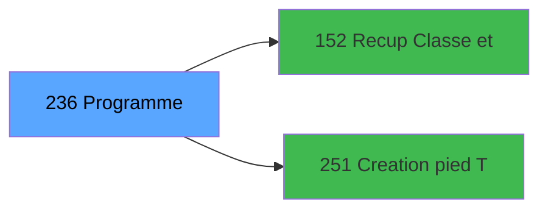

# ADH IDE 236 - Print ticket vente PMS-584

> **Version spec**: 3.5
> **Analyse**: 2026-01-27 17:57
> **Source**: `Prg_XXX.xml`

---

<!-- TAB:Fonctionnel -->

## SPECIFICATION FONCTIONNELLE

### 1.1 Objectif metier

| Element | Description |
|---------|-------------|
| **Qui** | Operateur |
| **Quoi** | Print ticket vente PMS-584 |
| **Pourquoi** | A documenter |
| **Declencheur** | A identifier |

### 1.2 Regles metier

| Code | Regle | Condition |
|------|-------|-----------|
| RM-001 | A documenter | - |

### 1.3 Flux utilisateur

1. Demarrage programme
2. Traitement principal
3. Fin programme

### 1.4 Cas d'erreur

| Erreur | Comportement |
|--------|--------------|
| - | A documenter |

---

<!-- TAB:Technique -->

## SPECIFICATION TECHNIQUE

### 2.1 Identification

| Attribut | Valeur |
|----------|--------|
| **Format IDE** | ADH IDE 236 |
| **Description** | Print ticket vente PMS-584 |
| **Module** | ADH |

### 2.2 Tables

| # | Nom physique | Acces | Usage |
|---|--------------|-------|-------|
| #31 | `Table_31` | R | 2x |
| #34 | `Table_34` | LINK | 2x |
| #34 | `Table_34` | R | 2x |
| #40 | `Table_40` | R | 4x |
| #67 | `Table_67` | LINK | 2x |
| #67 | `Table_67` | R | 1x |
| #69 | `Table_69` | R | 1x |
| #77 | `Table_77` | LINK | 1x |
| #77 | `Table_77` | R | 2x |
| #263 | `Table_263` | LINK | 4x |
| #596 | `Table_596` | LINK | 7x |
| #596 | `Table_596` | R | 7x |
| #728 | `Table_728` | LINK | 1x |
| #818 | `Table_818` | LINK | 1x |
| #847 | `Table_847` | LINK | 10x |
| #847 | `Table_847` | R | 5x |
| #867 | `Table_867` | R | 5x |
| #878 | `Table_878` | R | 2x |
| #904 | `Table_904` | LINK | 3x |
| #1037 | `Table_1037` | R | 2x |
### 2.3 Parametres d'entree

### 2.4 Algorigramme

### 2.5 Expressions cles

### 2.6 Variables importantes

### 2.7 Statistiques

---

<!-- TAB:Cartographie -->

## CARTOGRAPHIE APPLICATIVE

### 3.1 Chaine d'appels depuis Main

### 3.2 Callers directs

| IDE | Programme | Nb appels |
|-----|-----------|-----------|
| 238 | Transaction Nouv vente PMS-584 | 4 |
| 243 | Histo ventes payantes | 2 |
| 244 | Histo ventes payantes /PMS-605 | 2 |
| 245 | Histo ventes payantes /PMS-623 | 2 |
### 3.3 Callees

| Niv | IDE | Programme | Nb appels |
|-----|-----|-----------|-----------|
| 1 | 152 | Recup Classe et Lib du MOP | 5 |
| 1 | 251 | Creation pied Ticket | 5 |
### 3.4 Verification orphelin

| Critere | Resultat |
|---------|----------|
| Callers actifs | A verifier |
| **Conclusion** | A analyser |

---

## HISTORIQUE

| Date | Action | Auteur |
|------|--------|--------|
| 2026-01-27 19:50 | **DATA POPULATED** - Tables, Callgraph (19 expr) | Script |
| 2026-01-27 17:57 | **Upgrade V3.5** - TAB markers, Mermaid | Claude |

---

*Specification V3.5 - Format avec TAB markers et Mermaid*
