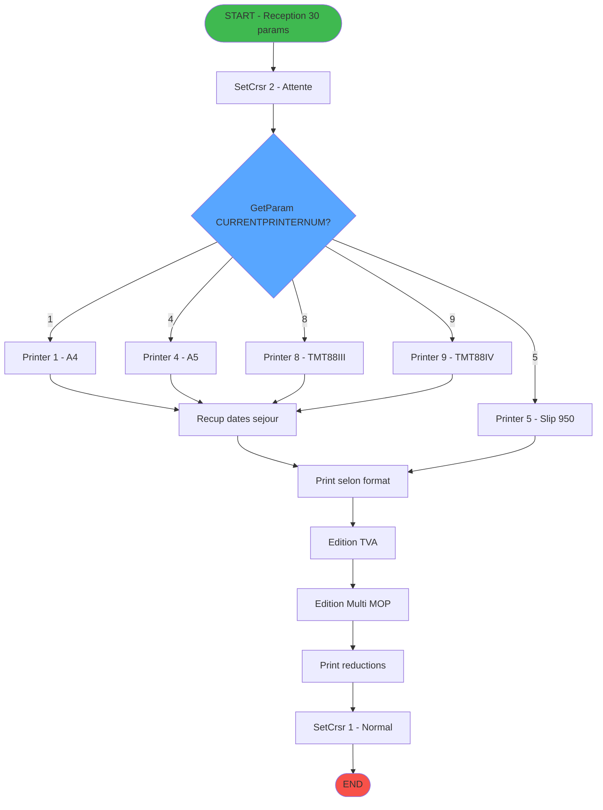
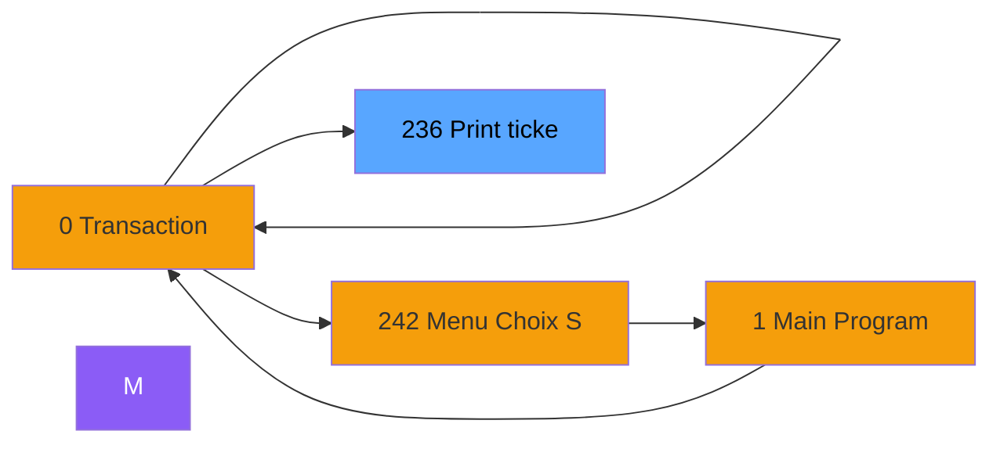
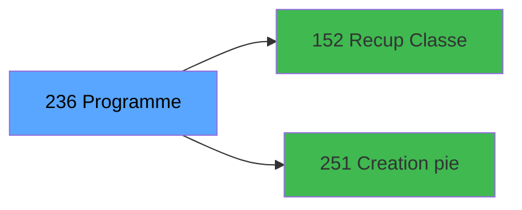

# ADH IDE 236 - Print ticket vente PMS-584

> **Version spec**: 3.6
> **Analyse**: 2026-01-27 22:15
> **Source**: `Prg_232.xml`

---

<!-- TAB:Fonctionnel -->

## SPECIFICATION FONCTIONNELLE

### 1.1 Objectif metier

| Element | Description |
|---------|-------------|
| **Qui** | Operateur caisse |
| **Quoi** | Impression ticket de vente selon type d'imprimante |
| **Pourquoi** | Fournir un justificatif de transaction au client (vente payante ou transfert sur compte) |
| **Declencheur** | Validation d'une vente (VRL=Vente Reglee Locale, VSL=Vente Sur Logement) |

### 1.2 Regles metier

| Code | Regle | Condition |
|------|-------|-----------|
| RM-001 | Selection imprimante automatique | Selon `GetParam('CURRENTPRINTERNUM')` : 1=A4, 4=A5, 5=Slip950, 8=TMT88III, 9=TMT88IV |
| RM-002 | Format ticket adapte | A4/A5 = ticket complet, Slip = reduit, TMT = thermique |
| RM-003 | Gestion multi-paiement | Si plusieurs moyens de paiement, edition detaillee par MOP |
| RM-004 | Calcul TVA | Extraction et affichage du detail TVA par taux |
| RM-005 | Reductions affichees | Section separee si remises appliquees |
| RM-006 | Dates sejour | Recuperees depuis hebergement (check-in/check-out) |

### 1.3 Flux utilisateur

1. Reception parametres vente (30 params: annulation, nom, date, articles, prix, qte, total, devise, MOP...)
2. Detection type imprimante configuree (GetParam)
3. Branchement vers sous-tache impression appropriee (Printer 1/4/5/8/9)
4. Recuperation dates sejour si necessaire
5. Generation sections: entete, lignes articles, reductions, TVA, multi-paiement
6. Impression et retour

### 1.4 Cas d'erreur

| Erreur | Comportement |
|--------|--------------|
| Imprimante non configuree | Tache 37 "Errors" - affiche message |
| Erreur impression | Tache 41 "count errors" - compteur erreurs |
| Donnees manquantes | Ticket partiel avec sections vides |

---

<!-- TAB:Technique -->

## SPECIFICATION TECHNIQUE

### 2.1 Identification

| Attribut | Valeur |
|----------|--------|
| **Format IDE** | ADH IDE 236 |
| **Description** | Print ticket vente PMS-584 |
| **Module** | ADH |

### 2.2 Tables

| # | Nom logique | Nom physique | Acces | Usage |
|---|-------------|--------------|-------|-------|
| 31 | gm-complet_______gmc | `cafil009_dat` | R | 2x |
| 34 | hebergement______heb | `cafil012_dat` | L | 2x |
| 34 | hebergement______heb | `cafil012_dat` | R | 2x |
| 40 | comptable________cte | `cafil018_dat` | R | 4x |
| 67 | tables___________tab | `cafil045_dat` | L | 2x |
| 67 | tables___________tab | `cafil045_dat` | R | 1x |
| 69 | initialisation___ini | `cafil047_dat` | R | 1x |
| 77 | articles_________art | `cafil055_dat` | L | 1x |
| 77 | articles_________art | `cafil055_dat` | R | 2x |
| 263 | vente | `caisse_vente` | L | 4x |
| 596 | tempo_ecran_police | `%club_user%tmp_ecrpolice_dat` | L | 7x |
| 596 | tempo_ecran_police | `%club_user%tmp_ecrpolice_dat` | R | 7x |
| 728 | arc_cc_total | `arc_cctotal` | L | 1x |
| 818 | Circuit supprime | `zcircafil146` | L | 1x |
| 847 | stat_lieu_vente_date | `%club_user%_stat_lieu_vente_date` | L | 10x |
| 847 | stat_lieu_vente_date | `%club_user%_stat_lieu_vente_date` | R | 5x |
| 867 | log_maj_tpe | `log_maj_tpe` | R | 5x |
| 878 | categorie_operation_mw | `categorie_operation_mw` | R | 2x |
| 904 | Boo_AvailibleEmployees | `Boo_AvailibleEmployees` | L | 3x |
| 1037 | Table_1037 | - | R | 2x |
### 2.3 Parametres d'entree (30 parametres)

| Variable | Nom | Type | Picture |
|----------|-----|------|---------|
| A | P0 od annulation | LOGICAL | 1 |
| B | P0 Nom | ALPHA | 60 |
| C | P0 Date | DATE | ##/##/##Z |
| D | P0 Article libelle 1 | ALPHA | 30 |
| E | P0 Article complementaire | ALPHA | 30 |
| F | P0 Qte | NUMERIC | 3 |
| G | P0 Prix unitaire | NUMERIC | 10.4 |
| H | P0 Total | NUMERIC | 10.4 |
| I | P0 Devise locale | ALPHA | U3 |
| J | P0 Masque | ALPHA | 16 |
| K | P0 Chambre | ALPHA | 10 |
| L | P0 mode de paiement | ALPHA | 4 |
| M | P0 libelle paiement | ALPHA | 30 |
| BC | P0 Numero Ticket(VRL) | NUMERIC | 10 |
| BD | P0 Num GM | NUMERIC | 10 |
| BE | P0 UNI/BI | ALPHA | 3 |
| N | PO is TAI | LOGICAL | 1 |
| O | P0 TAI Cash | ALPHA | 10 |
| P | P0 TAI start date | DATE | ##/##/## |
| Q | P0 TAI end date | DATE | ##/##/## |
### 2.4 Algorigramme

### 2.5 Expressions cles

| IDE | Expression | Commentaire |
|-----|------------|-------------|
| 1 | `SetCrsr(2)` | Curseur attente pendant impression |
| 2 | `SetCrsr(1)` | Retour curseur normal |
| 3 | `GetParam('CURRENTPRINTERNUM')=1` | Test imprimante A4 |
| 4 | `GetParam('CURRENTPRINTERNUM')=4` | Test imprimante A5 |
| 5 | `GetParam('CURRENTPRINTERNUM')=5` | Test imprimante Slip 950 |
| 6 | `GetParam('CURRENTPRINTERNUM')=8` | Test imprimante TMT88III |
| 7 | `GetParam('CURRENTPRINTERNUM')=9` | Test imprimante TMT88IV |
| 8 | `'VRL'` | Vente Reglee Locale |
| 9 | `'VSL'` | Vente Sur Logement |
| 10 | `Variable A` | P0 od annulation (LOGICAL) - flag annulation |
| 11 | `INIPut('EmbedFonts=N','FALSE'LOG)` | Config PDF sans polices embarquees |
| 12 | `INIPut('CompressPDF=Y','FALSE'LOG)` | Config PDF compresse |
| 13 | `'TRUE'LOG` | Constante logique vraie |
| 14 | `VG78` | Variable globale - flag impression |
| 15 | `NOT VG78` | Negation flag impression |
| 16 | `Translate('%TempDir%')&'ticket_vente_'&...` | Chemin fichier PDF temporaire |
| 17 | `GetParam('CURRENTPRINTERNUM')` | Numero imprimante courante |
| 18 | `ExpCalc('3'EXP) OR ExpCalc('7'EXP)` | Evaluation conditionnelle expressions |
| 19 | `Variable BC > 0` | P0 Numero Ticket (NUMERIC) non nul |

> **Total**: 19 expressions - Format IDE decode

### 2.6 Variables importantes

| Variable | Nom | Type | Role |
|----------|-----|------|------|
| A | P0 od annulation | LOGICAL | Flag si ticket d'annulation |
| B | P0 Nom | ALPHA(60) | Nom client sur ticket |
| C | P0 Date | DATE | Date de la transaction |
| H | P0 Total | NUMERIC(10.4) | Montant total a afficher |
| I | P0 Devise locale | ALPHA(3) | Code devise (EUR, USD...) |
| K | P0 Chambre | ALPHA(10) | Numero chambre client |
| L | P0 mode de paiement | ALPHA(4) | Code MOP (ESP, CB, CHQ...) |
| BC | P0 Numero Ticket | NUMERIC | Numero sequence ticket VRL/VSL |
| BE | P0 UNI/BI | ALPHA(3) | Mode UNI=unique ou BI=bilateral |
| VG78 | Flag impression | LOGICAL | Controle etat impression en cours |

### 2.7 Statistiques

| Metrique | Valeur |
|----------|--------|
| **Taches** | 38 |
| **Lignes logique** | 1231 |
| **Lignes desactivees** | 0 |
---

<!-- TAB:Cartographie -->

## CARTOGRAPHIE APPLICATIVE

### 3.1 Chaine d'appels depuis Main

### 3.2 Callers directs

| IDE | Programme | Nb appels |
|-----|-----------|-----------|
| 238 | Transaction Nouv vente PMS-584 | 4 |
| 243 | Histo ventes payantes | 2 |
| 244 | Histo ventes payantes /PMS-605 | 2 |
| 245 | Histo ventes payantes /PMS-623 | 2 |
### 3.3 Callees

| Niv | IDE | Programme | Nb appels |
|-----|-----|-----------|-----------|
| 1 | 152 | Recup Classe et Lib du MOP | 5 |
| 1 | 251 | Creation pied Ticket | 5 |
### 3.4 Verification orphelin

| Critere | Resultat |
|---------|----------|
| Callers actifs | 4 programmes (238, 243, 244, 245) |
| **Conclusion** | NON ORPHELIN - appele depuis plusieurs contextes vente |

---

## NOTES MIGRATION

### Complexite

| Critere | Score | Detail |
|---------|-------|--------|
| Taches | 38 | Nombreuses branches imprimante |
| Tables | 17 | Lecture seule, pas de MAJ |
| Callees | 2 | Faible couplage |
| **Score global** | MOYEN | Branch par imprimante, mais logique simple |

### Points d'attention

1. **GetParam('CURRENTPRINTERNUM')** - Configuration externe, prevoir enum ou config
2. **INIPut** - Ecriture Magic.ini, remplacer par config moderne
3. **SetCrsr** - UI specifique, abstraire en service
4. **Translate('%TempDir%')** - Chemin temporaire, utiliser Path.GetTempPath()

### Strategie recommandee

- **Pattern**: Template Method - une classe abstraite TicketPrinter avec implementations par type
- **Format cible**: PDF via bibliotheque (QuestPDF, iTextSharp)
- **Tests**: Mock imprimante, validation contenu PDF

---

## HISTORIQUE

| Date | Action | Auteur |
|------|--------|--------|
| 2026-01-27 22:15 | **V3.6 APEX** - Analyse profonde, expressions IDE, algorigramme reel, notes migration | Claude |
| 2026-01-27 20:24 | **DATA V2** - Tables reelles, Expressions, Stats, CallChain | Script |
| 2026-01-27 19:50 | **DATA POPULATED** - Tables, Callgraph (19 expr) | Script |
| 2026-01-27 17:57 | **Upgrade V3.5** - TAB markers, Mermaid | Claude |

---

*Specification V3.6 - Analyse APEX avec expressions IDE et notes migration*
