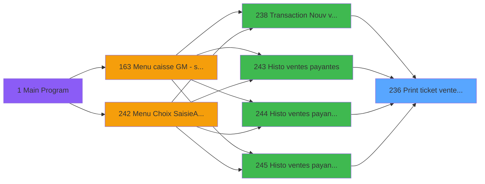
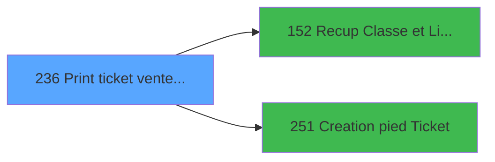

# ADH IDE 236 - Print ticket vente PMS-584

> **Analyse**: Phases 1-4 2026-01-30 09:42 -> 09:42 (8s) | Assemblage 09:42
> **Pipeline**: V7.2 Enrichi
> **Structure**: 4 onglets (Resume | Ecrans | Donnees | Connexions)

<!-- TAB:Resume -->

## 1. FICHE D'IDENTITE

| Attribut | Valeur |
|----------|--------|
| Projet | ADH |
| IDE Position | 236 |
| Nom Programme | Print ticket vente PMS-584 |
| Fichier source | `Prg_236.xml` |
| Domaine metier | Ventes |
| Taches | 38 (15 ecrans visibles) |
| Tables modifiees | 0 |
| Programmes appeles | 2 |

## 2. DESCRIPTION FONCTIONNELLE

**Print ticket vente PMS-584** assure la gestion complete de ce processus, accessible depuis [Transaction Nouv vente PMS-584 (IDE 238)](ADH-IDE-238.md), [Histo ventes payantes (IDE 243)](ADH-IDE-243.md), [Histo ventes payantes /PMS-605 (IDE 244)](ADH-IDE-244.md), [Histo ventes payantes /PMS-623 (IDE 245)](ADH-IDE-245.md).

Le flux de traitement s'organise en **4 blocs fonctionnels** :

- **Traitement** (16 taches) : traitements metier divers
- **Impression** (15 taches) : generation de tickets et documents
- **Reglement** (5 taches) : gestion des moyens de paiement et reglements
- **Consultation** (2 taches) : ecrans de recherche, selection et consultation

Detail : phases du traitement

#### Phase 1 : Traitement (16 taches)

- **T1** - Veuillez patienter ... **[ECRAN]**
- **T2** - Counter
- **T3** - Impression reçu change **[ECRAN]**
- **T5** - Impression reçu change
- **T11** - Counter
- **T12** - Impression reçu change
- **T13** - Impression reçu change
- **T18** - Veuillez patienter ... **[ECRAN]**
- **T23** - Veuillez patienter ... **[ECRAN]**
- **T24** - Récup. dates de séjour /PMS28/
- **T29** - Veuillez patienter ... **[ECRAN]**
- **T31** - Récup. dates de séjour /PMS28/
- **T35** - recup terminal
- **T36** - recup terminal
- **T37** - Errors **[ECRAN]**
- **T41** - (sans nom) **[ECRAN]**

#### Phase 2 : Consultation (2 taches)

- **T4** - Recherche dates de séjour
- **T9** - Recherche dates de séjour

Delegue a : [Recup Classe et Lib du MOP (IDE 152)](ADH-IDE-152.md)

#### Phase 3 : Impression (15 taches)

- **T6** - Print reduction
- **T8** - Print Tva **[ECRAN]**
- **T10** - Edition LCO Liberation
- **T14** - Print reduction
- **T15** - Print Tva **[ECRAN]**
- **T17** - Printer 5 **[ECRAN]**
- **T20** - Print reduction
- **T21** - Print Tva **[ECRAN]**
- **T22** - Printer 5 **[ECRAN]**
- **T26** - Print reduction
- **T27** - Print Tva **[ECRAN]**
- **T28** - Printer 9 **[ECRAN]**
- **T30** - Edition LCO Liberation
- **T32** - Print reduction
- **T34** - Print Tva **[ECRAN]**

Delegue a : [Creation pied Ticket (IDE 251)](ADH-IDE-251.md)

#### Phase 4 : Reglement (5 taches)

- **T7** - Edition Multi Moyen Paiement
- **T16** - Edition Multi Moyen Paiement
- **T19** - Edition Multi Moyen Paiement
- **T25** - Edition Multi Moyen Paiement
- **T33** - Edition Multi Moyen Paiement

Delegue a : [Recup Classe et Lib du MOP (IDE 152)](ADH-IDE-152.md)

## 3. BLOCS FONCTIONNELS

### 3.1 Traitement (16 taches)

Traitements internes.

---

#### T1 - Veuillez patienter ... [ECRAN]

**Role** : Traitement interne.
**Ecran** : 422 x 56 DLU (MDI) | [Voir mockup](#ecran-t1)

---

#### T2 - Counter

**Role** : Traitement interne.

---

#### T3 - Impression reçu change [ECRAN]

**Role** : Traitement interne.
**Ecran** : 333 x 86 DLU (MDI) | [Voir mockup](#ecran-t3)

---

#### T5 - Impression reçu change

**Role** : Traitement interne.

---

#### T11 - Counter

**Role** : Traitement interne.

---

#### T12 - Impression reçu change

**Role** : Traitement interne.

---

#### T13 - Impression reçu change

**Role** : Traitement interne.

---

#### T18 - Veuillez patienter ... [ECRAN]

**Role** : Traitement interne.
**Ecran** : 424 x 56 DLU (MDI) | [Voir mockup](#ecran-t18)

---

#### T23 - Veuillez patienter ... [ECRAN]

**Role** : Traitement interne.
**Ecran** : 424 x 56 DLU (MDI) | [Voir mockup](#ecran-t23)

---

#### T24 - Récup. dates de séjour /PMS28/

**Role** : Traitement interne.

---

#### T29 - Veuillez patienter ... [ECRAN]

**Role** : Traitement interne.
**Ecran** : 435 x 63 DLU (MDI) | [Voir mockup](#ecran-t29)

---

#### T31 - Récup. dates de séjour /PMS28/

**Role** : Traitement interne.

---

#### T35 - recup terminal

**Role** : Traitement interne.

---

#### T36 - recup terminal

**Role** : Traitement interne.

---

#### T37 - Errors [ECRAN]

**Role** : Traitement interne.
**Ecran** : 600 x 259 DLU | [Voir mockup](#ecran-t37)

---

#### T41 - (sans nom) [ECRAN]

**Role** : Traitement interne.
**Ecran** : 725 x 303 DLU | [Voir mockup](#ecran-t41)

### 3.2 Consultation (2 taches)

Ecrans de recherche et consultation.

---

#### T4 - Recherche dates de séjour

**Role** : Ecran de consultation ou recherche.

---

#### T9 - Recherche dates de séjour

**Role** : Ecran de consultation ou recherche.

### 3.3 Impression (15 taches)

Generation des documents et tickets.

---

#### T6 - Print reduction

**Role** : Generation de ticket ou document.

---

#### T8 - Print Tva [ECRAN]

**Role** : Generation de ticket ou document.
**Ecran** : 506 x 0 DLU | [Voir mockup](#ecran-t8)

---

#### T10 - Edition LCO Liberation

**Role** : Generation de ticket ou document.

---

#### T14 - Print reduction

**Role** : Generation de ticket ou document.

---

#### T15 - Print Tva [ECRAN]

**Role** : Generation de ticket ou document.
**Ecran** : 506 x 0 DLU | [Voir mockup](#ecran-t15)

---

#### T17 - Printer 5 [ECRAN]

**Role** : Generation de ticket ou document.
**Ecran** : 424 x 56 DLU (MDI) | [Voir mockup](#ecran-t17)

---

#### T20 - Print reduction

**Role** : Generation de ticket ou document.

---

#### T21 - Print Tva [ECRAN]

**Role** : Generation de ticket ou document.
**Ecran** : 506 x 0 DLU | [Voir mockup](#ecran-t21)

---

#### T22 - Printer 5 [ECRAN]

**Role** : Generation de ticket ou document.
**Ecran** : 424 x 56 DLU (MDI) | [Voir mockup](#ecran-t22)

---

#### T26 - Print reduction

**Role** : Generation de ticket ou document.

---

#### T27 - Print Tva [ECRAN]

**Role** : Generation de ticket ou document.
**Ecran** : 506 x 0 DLU | [Voir mockup](#ecran-t27)

---

#### T28 - Printer 9 [ECRAN]

**Role** : Generation de ticket ou document.
**Ecran** : 424 x 56 DLU (MDI) | [Voir mockup](#ecran-t28)

---

#### T30 - Edition LCO Liberation

**Role** : Generation de ticket ou document.

---

#### T32 - Print reduction

**Role** : Generation de ticket ou document.

---

#### T34 - Print Tva [ECRAN]

**Role** : Generation de ticket ou document.
**Ecran** : 565 x 0 DLU | [Voir mockup](#ecran-t34)

### 3.4 Reglement (5 taches)

Gestion des moyens de paiement : 5 taches de reglement.

---

#### T7 - Edition Multi Moyen Paiement

**Role** : Gestion du reglement et moyens de paiement.
**Delegue a** : [Recup Classe et Lib du MOP (IDE 152)](ADH-IDE-152.md)

---

#### T16 - Edition Multi Moyen Paiement

**Role** : Gestion du reglement et moyens de paiement.
**Delegue a** : [Recup Classe et Lib du MOP (IDE 152)](ADH-IDE-152.md)

---

#### T19 - Edition Multi Moyen Paiement

**Role** : Gestion du reglement et moyens de paiement.
**Delegue a** : [Recup Classe et Lib du MOP (IDE 152)](ADH-IDE-152.md)

---

#### T25 - Edition Multi Moyen Paiement

**Role** : Gestion du reglement et moyens de paiement.
**Delegue a** : [Recup Classe et Lib du MOP (IDE 152)](ADH-IDE-152.md)

---

#### T33 - Edition Multi Moyen Paiement

**Role** : Gestion du reglement et moyens de paiement.
**Delegue a** : [Recup Classe et Lib du MOP (IDE 152)](ADH-IDE-152.md)

## 5. REGLES METIER

*(Aucune regle metier identifiee)*

## 6. CONTEXTE

- **Appele par**: [Transaction Nouv vente PMS-584 (IDE 238)](ADH-IDE-238.md), [Histo ventes payantes (IDE 243)](ADH-IDE-243.md), [Histo ventes payantes /PMS-605 (IDE 244)](ADH-IDE-244.md), [Histo ventes payantes /PMS-623 (IDE 245)](ADH-IDE-245.md)
- **Appelle**: 2 programmes | **Tables**: 15 (W:0 R:11 L:9) | **Taches**: 38 | **Expressions**: 19

<!-- TAB:Ecrans -->

## 8. ECRANS

### 8.1 Forms visibles (15 / 38)

| # | Position | Tache | Nom | Type | Largeur | Hauteur | Bloc |
|---|----------|-------|-----|------|---------|---------|------|
| 1 | 236.1 | T1 | Veuillez patienter ... | MDI | 422 | 56 | Traitement |
| 2 | 236.2 | T3 | Impression reçu change | MDI | 333 | 86 | Traitement |
| 3 | 236.3 | T8 | Print Tva | Type0 | 506 | 0 | Impression |
| 4 | 236.4 | T15 | Print Tva | Type0 | 506 | 0 | Impression |
| 5 | 236.5 | T17 | Printer 5 | MDI | 424 | 56 | Impression |
| 6 | 236.6 | T18 | Veuillez patienter ... | MDI | 424 | 56 | Traitement |
| 7 | 236.7 | T21 | Print Tva | Type0 | 506 | 0 | Impression |
| 8 | 236.8 | T22 | Printer 5 | MDI | 424 | 56 | Impression |
| 9 | 236.9 | T23 | Veuillez patienter ... | MDI | 424 | 56 | Traitement |
| 10 | 236.10 | T27 | Print Tva | Type0 | 506 | 0 | Impression |
| 11 | 236.11 | T28 | Printer 9 | MDI | 424 | 56 | Impression |
| 12 | 236.12 | T29 | Veuillez patienter ... | MDI | 435 | 63 | Traitement |
| 13 | 236.13 | T34 | Print Tva | Type0 | 565 | 0 | Impression |
| 14 | 236.14 | T37 | Errors | Type0 | 600 | 259 | Traitement |
| 15 | 236.15 | T41 | (sans nom) | Type0 | 725 | 303 | Traitement |

### 8.2 Mockups Ecrans

---

#### 236.1 - Veuillez patienter ...
**Tache** : [T1](#t1) | **Type** : MDI | **Dimensions** : 422 x 56 DLU
**Bloc** : Traitement | **Titre IDE** : Veuillez patienter ...

<!-- FORM-DATA:
{
    "width":  422,
    "controls":  [
                     {
                         "w":  130,
                         "readonly":  true,
                         "y":  13,
                         "type":  "edit",
                         "x":  10,
                         "label":  "P0 od annulation",
                         "h":  20,
                         "var":  "A"
                     },
                     {
                         "w":  130,
                         "readonly":  true,
                         "y":  13,
                         "type":  "edit",
                         "x":  150,
                         "label":  "P0 Nom",
                         "h":  20,
                         "var":  "B"
                     },
                     {
                         "w":  130,
                         "readonly":  true,
                         "y":  13,
                         "type":  "edit",
                         "x":  290,
                         "label":  "P0 Date",
                         "h":  20,
                         "var":  "C"
                     },
                     {
                         "w":  130,
                         "readonly":  true,
                         "y":  13,
                         "type":  "edit",
                         "x":  430,
                         "label":  "P0 Article libelle 1",
                         "h":  20,
                         "var":  "D"
                     },
                     {
                         "w":  130,
                         "readonly":  true,
                         "y":  13,
                         "type":  "edit",
                         "x":  570,
                         "label":  "P0 Article complementaire",
                         "h":  20,
                         "var":  "E"
                     },
                     {
                         "w":  130,
                         "readonly":  true,
                         "y":  43,
                         "type":  "edit",
                         "x":  10,
                         "label":  "P0 Qte *NU*",
                         "h":  20,
                         "var":  "F"
                     },
                     {
                         "w":  200,
                         "readonly":  false,
                         "y":  73,
                         "type":  "edit",
                         "x":  10,
                         "label":  "W0 en-tête ?",
                         "h":  20,
                         "var":  "BE"
                     },
                     {
                         "w":  200,
                         "readonly":  false,
                         "y":  73,
                         "type":  "edit",
                         "x":  220,
                         "label":  "W0 fin tâche",
                         "h":  20,
                         "var":  "BF"
                     },
                     {
                         "w":  200,
                         "readonly":  false,
                         "y":  73,
                         "type":  "edit",
                         "x":  430,
                         "label":  "W0 copies",
                         "h":  20,
                         "var":  "BG"
                     }
                 ],
    "type":  "MDI",
    "height":  56,
    "taskId":  1
}
-->

**Champs :**

| Variable | Nom | Type | Saisie |
|----------|-----|------|--------|
| A | P0 od annulation | Logical | Lecture |
| B | P0 Nom | Alpha | Lecture |
| C | P0 Date | Date | Lecture |
| D | P0 Article libelle 1 | Alpha | Lecture |
| E | P0 Article complementaire | Alpha | Lecture |
| F | P0 Qte *NU* | Numeric | Lecture |
| BE | W0 en-tête ? | Alpha | **Saisie** |
| BF | W0 fin tâche | Alpha | **Saisie** |
| BG | W0 copies | Numeric | **Saisie** |

---

#### 236.2 - Impression reçu change
**Tache** : [T3](#t3) | **Type** : MDI | **Dimensions** : 333 x 86 DLU
**Bloc** : Traitement | **Titre IDE** : Impression reçu change

<!-- FORM-DATA:
{
    "width":  333,
    "controls":  [
                     {
                         "w":  130,
                         "readonly":  true,
                         "y":  13,
                         "type":  "edit",
                         "x":  10,
                         "label":  "P0 od annulation",
                         "h":  20,
                         "var":  "A"
                     },
                     {
                         "w":  130,
                         "readonly":  true,
                         "y":  13,
                         "type":  "edit",
                         "x":  150,
                         "label":  "P0 Nom",
                         "h":  20,
                         "var":  "B"
                     },
                     {
                         "w":  130,
                         "readonly":  true,
                         "y":  13,
                         "type":  "edit",
                         "x":  290,
                         "label":  "P0 Date",
                         "h":  20,
                         "var":  "C"
                     },
                     {
                         "w":  130,
                         "readonly":  true,
                         "y":  13,
                         "type":  "edit",
                         "x":  430,
                         "label":  "P0 Article libelle 1",
                         "h":  20,
                         "var":  "D"
                     },
                     {
                         "w":  130,
                         "readonly":  true,
                         "y":  13,
                         "type":  "edit",
                         "x":  570,
                         "label":  "P0 Article complementaire",
                         "h":  20,
                         "var":  "E"
                     },
                     {
                         "w":  130,
                         "readonly":  true,
                         "y":  43,
                         "type":  "edit",
                         "x":  10,
                         "label":  "P0 Qte *NU*",
                         "h":  20,
                         "var":  "F"
                     },
                     {
                         "w":  200,
                         "readonly":  false,
                         "y":  73,
                         "type":  "edit",
                         "x":  10,
                         "label":  "W0 en-tête ?",
                         "h":  20,
                         "var":  "BE"
                     },
                     {
                         "w":  200,
                         "readonly":  false,
                         "y":  73,
                         "type":  "edit",
                         "x":  220,
                         "label":  "W0 fin tâche",
                         "h":  20,
                         "var":  "BF"
                     },
                     {
                         "w":  200,
                         "readonly":  false,
                         "y":  73,
                         "type":  "edit",
                         "x":  430,
                         "label":  "W0 copies",
                         "h":  20,
                         "var":  "BG"
                     }
                 ],
    "type":  "MDI",
    "height":  86,
    "taskId":  3
}
-->

**Champs :**

| Variable | Nom | Type | Saisie |
|----------|-----|------|--------|
| A | P0 od annulation | Logical | Lecture |
| B | P0 Nom | Alpha | Lecture |
| C | P0 Date | Date | Lecture |
| D | P0 Article libelle 1 | Alpha | Lecture |
| E | P0 Article complementaire | Alpha | Lecture |
| F | P0 Qte *NU* | Numeric | Lecture |
| BE | W0 en-tête ? | Alpha | **Saisie** |
| BF | W0 fin tâche | Alpha | **Saisie** |
| BG | W0 copies | Numeric | **Saisie** |

---

#### 236.3 - Print Tva
**Tache** : [T8](#t8) | **Type** : Type0 | **Dimensions** : 506 x 0 DLU
**Bloc** : Impression | **Titre IDE** : Print Tva

<!-- FORM-DATA:
{
    "width":  506,
    "controls":  [
                     {
                         "w":  130,
                         "readonly":  true,
                         "y":  13,
                         "type":  "edit",
                         "x":  10,
                         "label":  "P0 od annulation",
                         "h":  20,
                         "var":  "A"
                     },
                     {
                         "w":  130,
                         "readonly":  true,
                         "y":  13,
                         "type":  "edit",
                         "x":  150,
                         "label":  "P0 Nom",
                         "h":  20,
                         "var":  "B"
                     },
                     {
                         "w":  130,
                         "readonly":  true,
                         "y":  13,
                         "type":  "edit",
                         "x":  290,
                         "label":  "P0 Date",
                         "h":  20,
                         "var":  "C"
                     },
                     {
                         "w":  130,
                         "readonly":  true,
                         "y":  13,
                         "type":  "edit",
                         "x":  430,
                         "label":  "P0 Article libelle 1",
                         "h":  20,
                         "var":  "D"
                     },
                     {
                         "w":  130,
                         "readonly":  true,
                         "y":  13,
                         "type":  "edit",
                         "x":  570,
                         "label":  "P0 Article complementaire",
                         "h":  20,
                         "var":  "E"
                     },
                     {
                         "w":  130,
                         "readonly":  true,
                         "y":  43,
                         "type":  "edit",
                         "x":  10,
                         "label":  "P0 Qte *NU*",
                         "h":  20,
                         "var":  "F"
                     }
                 ],
    "type":  "Type0",
    "height":  0,
    "taskId":  8
}
-->

**Champs :**

| Variable | Nom | Type | Saisie |
|----------|-----|------|--------|
| A | P0 od annulation | Logical | Lecture |
| B | P0 Nom | Alpha | Lecture |
| C | P0 Date | Date | Lecture |
| D | P0 Article libelle 1 | Alpha | Lecture |
| E | P0 Article complementaire | Alpha | Lecture |
| F | P0 Qte *NU* | Numeric | Lecture |

---

#### 236.4 - Print Tva
**Tache** : [T15](#t15) | **Type** : Type0 | **Dimensions** : 506 x 0 DLU
**Bloc** : Impression | **Titre IDE** : Print Tva

<!-- FORM-DATA:
{
    "width":  506,
    "controls":  [
                     {
                         "w":  130,
                         "readonly":  true,
                         "y":  13,
                         "type":  "edit",
                         "x":  10,
                         "label":  "P0 od annulation",
                         "h":  20,
                         "var":  "A"
                     },
                     {
                         "w":  130,
                         "readonly":  true,
                         "y":  13,
                         "type":  "edit",
                         "x":  150,
                         "label":  "P0 Nom",
                         "h":  20,
                         "var":  "B"
                     },
                     {
                         "w":  130,
                         "readonly":  true,
                         "y":  13,
                         "type":  "edit",
                         "x":  290,
                         "label":  "P0 Date",
                         "h":  20,
                         "var":  "C"
                     },
                     {
                         "w":  130,
                         "readonly":  true,
                         "y":  13,
                         "type":  "edit",
                         "x":  430,
                         "label":  "P0 Article libelle 1",
                         "h":  20,
                         "var":  "D"
                     },
                     {
                         "w":  130,
                         "readonly":  true,
                         "y":  13,
                         "type":  "edit",
                         "x":  570,
                         "label":  "P0 Article complementaire",
                         "h":  20,
                         "var":  "E"
                     },
                     {
                         "w":  130,
                         "readonly":  true,
                         "y":  43,
                         "type":  "edit",
                         "x":  10,
                         "label":  "P0 Qte *NU*",
                         "h":  20,
                         "var":  "F"
                     }
                 ],
    "type":  "Type0",
    "height":  0,
    "taskId":  15
}
-->

**Champs :**

| Variable | Nom | Type | Saisie |
|----------|-----|------|--------|
| A | P0 od annulation | Logical | Lecture |
| B | P0 Nom | Alpha | Lecture |
| C | P0 Date | Date | Lecture |
| D | P0 Article libelle 1 | Alpha | Lecture |
| E | P0 Article complementaire | Alpha | Lecture |
| F | P0 Qte *NU* | Numeric | Lecture |

---

#### 236.5 - Printer 5
**Tache** : [T17](#t17) | **Type** : MDI | **Dimensions** : 424 x 56 DLU
**Bloc** : Impression | **Titre IDE** : Printer 5

<!-- FORM-DATA:
{
    "width":  424,
    "controls":  [
                     {
                         "w":  130,
                         "readonly":  true,
                         "y":  13,
                         "type":  "edit",
                         "x":  10,
                         "label":  "P0 od annulation",
                         "h":  20,
                         "var":  "A"
                     },
                     {
                         "w":  130,
                         "readonly":  true,
                         "y":  13,
                         "type":  "edit",
                         "x":  150,
                         "label":  "P0 Nom",
                         "h":  20,
                         "var":  "B"
                     },
                     {
                         "w":  130,
                         "readonly":  true,
                         "y":  13,
                         "type":  "edit",
                         "x":  290,
                         "label":  "P0 Date",
                         "h":  20,
                         "var":  "C"
                     },
                     {
                         "w":  130,
                         "readonly":  true,
                         "y":  13,
                         "type":  "edit",
                         "x":  430,
                         "label":  "P0 Article libelle 1",
                         "h":  20,
                         "var":  "D"
                     },
                     {
                         "w":  130,
                         "readonly":  true,
                         "y":  13,
                         "type":  "edit",
                         "x":  570,
                         "label":  "P0 Article complementaire",
                         "h":  20,
                         "var":  "E"
                     },
                     {
                         "w":  130,
                         "readonly":  true,
                         "y":  43,
                         "type":  "edit",
                         "x":  10,
                         "label":  "P0 Qte *NU*",
                         "h":  20,
                         "var":  "F"
                     }
                 ],
    "type":  "MDI",
    "height":  56,
    "taskId":  17
}
-->

**Champs :**

| Variable | Nom | Type | Saisie |
|----------|-----|------|--------|
| A | P0 od annulation | Logical | Lecture |
| B | P0 Nom | Alpha | Lecture |
| C | P0 Date | Date | Lecture |
| D | P0 Article libelle 1 | Alpha | Lecture |
| E | P0 Article complementaire | Alpha | Lecture |
| F | P0 Qte *NU* | Numeric | Lecture |

---

#### 236.6 - Veuillez patienter ...
**Tache** : [T18](#t18) | **Type** : MDI | **Dimensions** : 424 x 56 DLU
**Bloc** : Traitement | **Titre IDE** : Veuillez patienter ...

<!-- FORM-DATA:
{
    "width":  424,
    "controls":  [
                     {
                         "w":  130,
                         "readonly":  true,
                         "y":  13,
                         "type":  "edit",
                         "x":  10,
                         "label":  "P0 od annulation",
                         "h":  20,
                         "var":  "A"
                     },
                     {
                         "w":  130,
                         "readonly":  true,
                         "y":  13,
                         "type":  "edit",
                         "x":  150,
                         "label":  "P0 Nom",
                         "h":  20,
                         "var":  "B"
                     },
                     {
                         "w":  130,
                         "readonly":  true,
                         "y":  13,
                         "type":  "edit",
                         "x":  290,
                         "label":  "P0 Date",
                         "h":  20,
                         "var":  "C"
                     },
                     {
                         "w":  130,
                         "readonly":  true,
                         "y":  13,
                         "type":  "edit",
                         "x":  430,
                         "label":  "P0 Article libelle 1",
                         "h":  20,
                         "var":  "D"
                     },
                     {
                         "w":  130,
                         "readonly":  true,
                         "y":  13,
                         "type":  "edit",
                         "x":  570,
                         "label":  "P0 Article complementaire",
                         "h":  20,
                         "var":  "E"
                     },
                     {
                         "w":  130,
                         "readonly":  true,
                         "y":  43,
                         "type":  "edit",
                         "x":  10,
                         "label":  "P0 Qte *NU*",
                         "h":  20,
                         "var":  "F"
                     },
                     {
                         "w":  200,
                         "readonly":  false,
                         "y":  73,
                         "type":  "edit",
                         "x":  10,
                         "label":  "W0 en-tête ?",
                         "h":  20,
                         "var":  "BE"
                     },
                     {
                         "w":  200,
                         "readonly":  false,
                         "y":  73,
                         "type":  "edit",
                         "x":  220,
                         "label":  "W0 fin tâche",
                         "h":  20,
                         "var":  "BF"
                     },
                     {
                         "w":  200,
                         "readonly":  false,
                         "y":  73,
                         "type":  "edit",
                         "x":  430,
                         "label":  "W0 copies",
                         "h":  20,
                         "var":  "BG"
                     }
                 ],
    "type":  "MDI",
    "height":  56,
    "taskId":  18
}
-->

**Champs :**

| Variable | Nom | Type | Saisie |
|----------|-----|------|--------|
| A | P0 od annulation | Logical | Lecture |
| B | P0 Nom | Alpha | Lecture |
| C | P0 Date | Date | Lecture |
| D | P0 Article libelle 1 | Alpha | Lecture |
| E | P0 Article complementaire | Alpha | Lecture |
| F | P0 Qte *NU* | Numeric | Lecture |
| BE | W0 en-tête ? | Alpha | **Saisie** |
| BF | W0 fin tâche | Alpha | **Saisie** |
| BG | W0 copies | Numeric | **Saisie** |

---

#### 236.7 - Print Tva
**Tache** : [T21](#t21) | **Type** : Type0 | **Dimensions** : 506 x 0 DLU
**Bloc** : Impression | **Titre IDE** : Print Tva

<!-- FORM-DATA:
{
    "width":  506,
    "controls":  [
                     {
                         "w":  130,
                         "readonly":  true,
                         "y":  13,
                         "type":  "edit",
                         "x":  10,
                         "label":  "P0 od annulation",
                         "h":  20,
                         "var":  "A"
                     },
                     {
                         "w":  130,
                         "readonly":  true,
                         "y":  13,
                         "type":  "edit",
                         "x":  150,
                         "label":  "P0 Nom",
                         "h":  20,
                         "var":  "B"
                     },
                     {
                         "w":  130,
                         "readonly":  true,
                         "y":  13,
                         "type":  "edit",
                         "x":  290,
                         "label":  "P0 Date",
                         "h":  20,
                         "var":  "C"
                     },
                     {
                         "w":  130,
                         "readonly":  true,
                         "y":  13,
                         "type":  "edit",
                         "x":  430,
                         "label":  "P0 Article libelle 1",
                         "h":  20,
                         "var":  "D"
                     },
                     {
                         "w":  130,
                         "readonly":  true,
                         "y":  13,
                         "type":  "edit",
                         "x":  570,
                         "label":  "P0 Article complementaire",
                         "h":  20,
                         "var":  "E"
                     },
                     {
                         "w":  130,
                         "readonly":  true,
                         "y":  43,
                         "type":  "edit",
                         "x":  10,
                         "label":  "P0 Qte *NU*",
                         "h":  20,
                         "var":  "F"
                     }
                 ],
    "type":  "Type0",
    "height":  0,
    "taskId":  21
}
-->

**Champs :**

| Variable | Nom | Type | Saisie |
|----------|-----|------|--------|
| A | P0 od annulation | Logical | Lecture |
| B | P0 Nom | Alpha | Lecture |
| C | P0 Date | Date | Lecture |
| D | P0 Article libelle 1 | Alpha | Lecture |
| E | P0 Article complementaire | Alpha | Lecture |
| F | P0 Qte *NU* | Numeric | Lecture |

---

#### 236.8 - Printer 5
**Tache** : [T22](#t22) | **Type** : MDI | **Dimensions** : 424 x 56 DLU
**Bloc** : Impression | **Titre IDE** : Printer 5

<!-- FORM-DATA:
{
    "width":  424,
    "controls":  [
                     {
                         "w":  130,
                         "readonly":  true,
                         "y":  13,
                         "type":  "edit",
                         "x":  10,
                         "label":  "P0 od annulation",
                         "h":  20,
                         "var":  "A"
                     },
                     {
                         "w":  130,
                         "readonly":  true,
                         "y":  13,
                         "type":  "edit",
                         "x":  150,
                         "label":  "P0 Nom",
                         "h":  20,
                         "var":  "B"
                     },
                     {
                         "w":  130,
                         "readonly":  true,
                         "y":  13,
                         "type":  "edit",
                         "x":  290,
                         "label":  "P0 Date",
                         "h":  20,
                         "var":  "C"
                     },
                     {
                         "w":  130,
                         "readonly":  true,
                         "y":  13,
                         "type":  "edit",
                         "x":  430,
                         "label":  "P0 Article libelle 1",
                         "h":  20,
                         "var":  "D"
                     },
                     {
                         "w":  130,
                         "readonly":  true,
                         "y":  13,
                         "type":  "edit",
                         "x":  570,
                         "label":  "P0 Article complementaire",
                         "h":  20,
                         "var":  "E"
                     },
                     {
                         "w":  130,
                         "readonly":  true,
                         "y":  43,
                         "type":  "edit",
                         "x":  10,
                         "label":  "P0 Qte *NU*",
                         "h":  20,
                         "var":  "F"
                     }
                 ],
    "type":  "MDI",
    "height":  56,
    "taskId":  22
}
-->

**Champs :**

| Variable | Nom | Type | Saisie |
|----------|-----|------|--------|
| A | P0 od annulation | Logical | Lecture |
| B | P0 Nom | Alpha | Lecture |
| C | P0 Date | Date | Lecture |
| D | P0 Article libelle 1 | Alpha | Lecture |
| E | P0 Article complementaire | Alpha | Lecture |
| F | P0 Qte *NU* | Numeric | Lecture |

---

#### 236.9 - Veuillez patienter ...
**Tache** : [T23](#t23) | **Type** : MDI | **Dimensions** : 424 x 56 DLU
**Bloc** : Traitement | **Titre IDE** : Veuillez patienter ...

<!-- FORM-DATA:
{
    "width":  424,
    "controls":  [
                     {
                         "w":  130,
                         "readonly":  true,
                         "y":  13,
                         "type":  "edit",
                         "x":  10,
                         "label":  "P0 od annulation",
                         "h":  20,
                         "var":  "A"
                     },
                     {
                         "w":  130,
                         "readonly":  true,
                         "y":  13,
                         "type":  "edit",
                         "x":  150,
                         "label":  "P0 Nom",
                         "h":  20,
                         "var":  "B"
                     },
                     {
                         "w":  130,
                         "readonly":  true,
                         "y":  13,
                         "type":  "edit",
                         "x":  290,
                         "label":  "P0 Date",
                         "h":  20,
                         "var":  "C"
                     },
                     {
                         "w":  130,
                         "readonly":  true,
                         "y":  13,
                         "type":  "edit",
                         "x":  430,
                         "label":  "P0 Article libelle 1",
                         "h":  20,
                         "var":  "D"
                     },
                     {
                         "w":  130,
                         "readonly":  true,
                         "y":  13,
                         "type":  "edit",
                         "x":  570,
                         "label":  "P0 Article complementaire",
                         "h":  20,
                         "var":  "E"
                     },
                     {
                         "w":  130,
                         "readonly":  true,
                         "y":  43,
                         "type":  "edit",
                         "x":  10,
                         "label":  "P0 Qte *NU*",
                         "h":  20,
                         "var":  "F"
                     },
                     {
                         "w":  200,
                         "readonly":  false,
                         "y":  73,
                         "type":  "edit",
                         "x":  10,
                         "label":  "W0 en-tête ?",
                         "h":  20,
                         "var":  "BE"
                     },
                     {
                         "w":  200,
                         "readonly":  false,
                         "y":  73,
                         "type":  "edit",
                         "x":  220,
                         "label":  "W0 fin tâche",
                         "h":  20,
                         "var":  "BF"
                     },
                     {
                         "w":  200,
                         "readonly":  false,
                         "y":  73,
                         "type":  "edit",
                         "x":  430,
                         "label":  "W0 copies",
                         "h":  20,
                         "var":  "BG"
                     }
                 ],
    "type":  "MDI",
    "height":  56,
    "taskId":  23
}
-->

**Champs :**

| Variable | Nom | Type | Saisie |
|----------|-----|------|--------|
| A | P0 od annulation | Logical | Lecture |
| B | P0 Nom | Alpha | Lecture |
| C | P0 Date | Date | Lecture |
| D | P0 Article libelle 1 | Alpha | Lecture |
| E | P0 Article complementaire | Alpha | Lecture |
| F | P0 Qte *NU* | Numeric | Lecture |
| BE | W0 en-tête ? | Alpha | **Saisie** |
| BF | W0 fin tâche | Alpha | **Saisie** |
| BG | W0 copies | Numeric | **Saisie** |

---

#### 236.10 - Print Tva
**Tache** : [T27](#t27) | **Type** : Type0 | **Dimensions** : 506 x 0 DLU
**Bloc** : Impression | **Titre IDE** : Print Tva

<!-- FORM-DATA:
{
    "width":  506,
    "controls":  [
                     {
                         "w":  130,
                         "readonly":  true,
                         "y":  13,
                         "type":  "edit",
                         "x":  10,
                         "label":  "P0 od annulation",
                         "h":  20,
                         "var":  "A"
                     },
                     {
                         "w":  130,
                         "readonly":  true,
                         "y":  13,
                         "type":  "edit",
                         "x":  150,
                         "label":  "P0 Nom",
                         "h":  20,
                         "var":  "B"
                     },
                     {
                         "w":  130,
                         "readonly":  true,
                         "y":  13,
                         "type":  "edit",
                         "x":  290,
                         "label":  "P0 Date",
                         "h":  20,
                         "var":  "C"
                     },
                     {
                         "w":  130,
                         "readonly":  true,
                         "y":  13,
                         "type":  "edit",
                         "x":  430,
                         "label":  "P0 Article libelle 1",
                         "h":  20,
                         "var":  "D"
                     },
                     {
                         "w":  130,
                         "readonly":  true,
                         "y":  13,
                         "type":  "edit",
                         "x":  570,
                         "label":  "P0 Article complementaire",
                         "h":  20,
                         "var":  "E"
                     },
                     {
                         "w":  130,
                         "readonly":  true,
                         "y":  43,
                         "type":  "edit",
                         "x":  10,
                         "label":  "P0 Qte *NU*",
                         "h":  20,
                         "var":  "F"
                     }
                 ],
    "type":  "Type0",
    "height":  0,
    "taskId":  27
}
-->

**Champs :**

| Variable | Nom | Type | Saisie |
|----------|-----|------|--------|
| A | P0 od annulation | Logical | Lecture |
| B | P0 Nom | Alpha | Lecture |
| C | P0 Date | Date | Lecture |
| D | P0 Article libelle 1 | Alpha | Lecture |
| E | P0 Article complementaire | Alpha | Lecture |
| F | P0 Qte *NU* | Numeric | Lecture |

---

#### 236.11 - Printer 9
**Tache** : [T28](#t28) | **Type** : MDI | **Dimensions** : 424 x 56 DLU
**Bloc** : Impression | **Titre IDE** : Printer 9

<!-- FORM-DATA:
{
    "width":  424,
    "controls":  [
                     {
                         "w":  130,
                         "readonly":  true,
                         "y":  13,
                         "type":  "edit",
                         "x":  10,
                         "label":  "P0 od annulation",
                         "h":  20,
                         "var":  "A"
                     },
                     {
                         "w":  130,
                         "readonly":  true,
                         "y":  13,
                         "type":  "edit",
                         "x":  150,
                         "label":  "P0 Nom",
                         "h":  20,
                         "var":  "B"
                     },
                     {
                         "w":  130,
                         "readonly":  true,
                         "y":  13,
                         "type":  "edit",
                         "x":  290,
                         "label":  "P0 Date",
                         "h":  20,
                         "var":  "C"
                     },
                     {
                         "w":  130,
                         "readonly":  true,
                         "y":  13,
                         "type":  "edit",
                         "x":  430,
                         "label":  "P0 Article libelle 1",
                         "h":  20,
                         "var":  "D"
                     },
                     {
                         "w":  130,
                         "readonly":  true,
                         "y":  13,
                         "type":  "edit",
                         "x":  570,
                         "label":  "P0 Article complementaire",
                         "h":  20,
                         "var":  "E"
                     },
                     {
                         "w":  130,
                         "readonly":  true,
                         "y":  43,
                         "type":  "edit",
                         "x":  10,
                         "label":  "P0 Qte *NU*",
                         "h":  20,
                         "var":  "F"
                     }
                 ],
    "type":  "MDI",
    "height":  56,
    "taskId":  28
}
-->

**Champs :**

| Variable | Nom | Type | Saisie |
|----------|-----|------|--------|
| A | P0 od annulation | Logical | Lecture |
| B | P0 Nom | Alpha | Lecture |
| C | P0 Date | Date | Lecture |
| D | P0 Article libelle 1 | Alpha | Lecture |
| E | P0 Article complementaire | Alpha | Lecture |
| F | P0 Qte *NU* | Numeric | Lecture |

---

#### 236.12 - Veuillez patienter ...
**Tache** : [T29](#t29) | **Type** : MDI | **Dimensions** : 435 x 63 DLU
**Bloc** : Traitement | **Titre IDE** : Veuillez patienter ...

<!-- FORM-DATA:
{
    "width":  435,
    "controls":  [
                     {
                         "w":  130,
                         "readonly":  true,
                         "y":  13,
                         "type":  "edit",
                         "x":  10,
                         "label":  "P0 od annulation",
                         "h":  20,
                         "var":  "A"
                     },
                     {
                         "w":  130,
                         "readonly":  true,
                         "y":  13,
                         "type":  "edit",
                         "x":  150,
                         "label":  "P0 Nom",
                         "h":  20,
                         "var":  "B"
                     },
                     {
                         "w":  130,
                         "readonly":  true,
                         "y":  13,
                         "type":  "edit",
                         "x":  290,
                         "label":  "P0 Date",
                         "h":  20,
                         "var":  "C"
                     },
                     {
                         "w":  130,
                         "readonly":  true,
                         "y":  13,
                         "type":  "edit",
                         "x":  430,
                         "label":  "P0 Article libelle 1",
                         "h":  20,
                         "var":  "D"
                     },
                     {
                         "w":  130,
                         "readonly":  true,
                         "y":  13,
                         "type":  "edit",
                         "x":  570,
                         "label":  "P0 Article complementaire",
                         "h":  20,
                         "var":  "E"
                     },
                     {
                         "w":  130,
                         "readonly":  true,
                         "y":  43,
                         "type":  "edit",
                         "x":  10,
                         "label":  "P0 Qte *NU*",
                         "h":  20,
                         "var":  "F"
                     },
                     {
                         "w":  200,
                         "readonly":  false,
                         "y":  73,
                         "type":  "edit",
                         "x":  10,
                         "label":  "W0 en-tête ?",
                         "h":  20,
                         "var":  "BE"
                     },
                     {
                         "w":  200,
                         "readonly":  false,
                         "y":  73,
                         "type":  "edit",
                         "x":  220,
                         "label":  "W0 fin tâche",
                         "h":  20,
                         "var":  "BF"
                     },
                     {
                         "w":  200,
                         "readonly":  false,
                         "y":  73,
                         "type":  "edit",
                         "x":  430,
                         "label":  "W0 copies",
                         "h":  20,
                         "var":  "BG"
                     }
                 ],
    "type":  "MDI",
    "height":  63,
    "taskId":  29
}
-->

**Champs :**

| Variable | Nom | Type | Saisie |
|----------|-----|------|--------|
| A | P0 od annulation | Logical | Lecture |
| B | P0 Nom | Alpha | Lecture |
| C | P0 Date | Date | Lecture |
| D | P0 Article libelle 1 | Alpha | Lecture |
| E | P0 Article complementaire | Alpha | Lecture |
| F | P0 Qte *NU* | Numeric | Lecture |
| BE | W0 en-tête ? | Alpha | **Saisie** |
| BF | W0 fin tâche | Alpha | **Saisie** |
| BG | W0 copies | Numeric | **Saisie** |

---

#### 236.13 - Print Tva
**Tache** : [T34](#t34) | **Type** : Type0 | **Dimensions** : 565 x 0 DLU
**Bloc** : Impression | **Titre IDE** : Print Tva

<!-- FORM-DATA:
{
    "width":  565,
    "controls":  [
                     {
                         "w":  130,
                         "readonly":  true,
                         "y":  13,
                         "type":  "edit",
                         "x":  10,
                         "label":  "P0 od annulation",
                         "h":  20,
                         "var":  "A"
                     },
                     {
                         "w":  130,
                         "readonly":  true,
                         "y":  13,
                         "type":  "edit",
                         "x":  150,
                         "label":  "P0 Nom",
                         "h":  20,
                         "var":  "B"
                     },
                     {
                         "w":  130,
                         "readonly":  true,
                         "y":  13,
                         "type":  "edit",
                         "x":  290,
                         "label":  "P0 Date",
                         "h":  20,
                         "var":  "C"
                     },
                     {
                         "w":  130,
                         "readonly":  true,
                         "y":  13,
                         "type":  "edit",
                         "x":  430,
                         "label":  "P0 Article libelle 1",
                         "h":  20,
                         "var":  "D"
                     },
                     {
                         "w":  130,
                         "readonly":  true,
                         "y":  13,
                         "type":  "edit",
                         "x":  570,
                         "label":  "P0 Article complementaire",
                         "h":  20,
                         "var":  "E"
                     },
                     {
                         "w":  130,
                         "readonly":  true,
                         "y":  43,
                         "type":  "edit",
                         "x":  10,
                         "label":  "P0 Qte *NU*",
                         "h":  20,
                         "var":  "F"
                     }
                 ],
    "type":  "Type0",
    "height":  0,
    "taskId":  34
}
-->

**Champs :**

| Variable | Nom | Type | Saisie |
|----------|-----|------|--------|
| A | P0 od annulation | Logical | Lecture |
| B | P0 Nom | Alpha | Lecture |
| C | P0 Date | Date | Lecture |
| D | P0 Article libelle 1 | Alpha | Lecture |
| E | P0 Article complementaire | Alpha | Lecture |
| F | P0 Qte *NU* | Numeric | Lecture |

---

#### 236.14 - Errors
**Tache** : [T37](#t37) | **Type** : Type0 | **Dimensions** : 600 x 259 DLU
**Bloc** : Traitement | **Titre IDE** : Errors

<!-- FORM-DATA:
{
    "width":  600,
    "controls":  [
                     {
                         "w":  130,
                         "readonly":  true,
                         "y":  13,
                         "type":  "edit",
                         "x":  10,
                         "label":  "P0 od annulation",
                         "h":  20,
                         "var":  "A"
                     },
                     {
                         "w":  130,
                         "readonly":  true,
                         "y":  13,
                         "type":  "edit",
                         "x":  150,
                         "label":  "P0 Nom",
                         "h":  20,
                         "var":  "B"
                     },
                     {
                         "w":  130,
                         "readonly":  true,
                         "y":  13,
                         "type":  "edit",
                         "x":  290,
                         "label":  "P0 Date",
                         "h":  20,
                         "var":  "C"
                     },
                     {
                         "w":  130,
                         "readonly":  true,
                         "y":  13,
                         "type":  "edit",
                         "x":  430,
                         "label":  "P0 Article libelle 1",
                         "h":  20,
                         "var":  "D"
                     },
                     {
                         "w":  130,
                         "readonly":  true,
                         "y":  13,
                         "type":  "edit",
                         "x":  570,
                         "label":  "P0 Article complementaire",
                         "h":  20,
                         "var":  "E"
                     },
                     {
                         "w":  130,
                         "readonly":  true,
                         "y":  43,
                         "type":  "edit",
                         "x":  10,
                         "label":  "P0 Qte *NU*",
                         "h":  20,
                         "var":  "F"
                     },
                     {
                         "w":  200,
                         "readonly":  false,
                         "y":  73,
                         "type":  "edit",
                         "x":  10,
                         "label":  "W0 en-tête ?",
                         "h":  20,
                         "var":  "BE"
                     },
                     {
                         "w":  200,
                         "readonly":  false,
                         "y":  73,
                         "type":  "edit",
                         "x":  220,
                         "label":  "W0 fin tâche",
                         "h":  20,
                         "var":  "BF"
                     },
                     {
                         "w":  200,
                         "readonly":  false,
                         "y":  73,
                         "type":  "edit",
                         "x":  430,
                         "label":  "W0 copies",
                         "h":  20,
                         "var":  "BG"
                     }
                 ],
    "type":  "Type0",
    "height":  259,
    "taskId":  37
}
-->

**Champs :**

| Variable | Nom | Type | Saisie |
|----------|-----|------|--------|
| A | P0 od annulation | Logical | Lecture |
| B | P0 Nom | Alpha | Lecture |
| C | P0 Date | Date | Lecture |
| D | P0 Article libelle 1 | Alpha | Lecture |
| E | P0 Article complementaire | Alpha | Lecture |
| F | P0 Qte *NU* | Numeric | Lecture |
| BE | W0 en-tête ? | Alpha | **Saisie** |
| BF | W0 fin tâche | Alpha | **Saisie** |
| BG | W0 copies | Numeric | **Saisie** |

---

#### 236.15 - (sans nom)
**Tache** : [T41](#t41) | **Type** : Type0 | **Dimensions** : 725 x 303 DLU
**Bloc** : Traitement | **Titre IDE** : (sans nom)

<!-- FORM-DATA:
{
    "width":  725,
    "controls":  [
                     {
                         "w":  130,
                         "readonly":  true,
                         "y":  13,
                         "type":  "edit",
                         "x":  10,
                         "label":  "P0 od annulation",
                         "h":  20,
                         "var":  "A"
                     },
                     {
                         "w":  130,
                         "readonly":  true,
                         "y":  13,
                         "type":  "edit",
                         "x":  150,
                         "label":  "P0 Nom",
                         "h":  20,
                         "var":  "B"
                     },
                     {
                         "w":  130,
                         "readonly":  true,
                         "y":  13,
                         "type":  "edit",
                         "x":  290,
                         "label":  "P0 Date",
                         "h":  20,
                         "var":  "C"
                     },
                     {
                         "w":  130,
                         "readonly":  true,
                         "y":  13,
                         "type":  "edit",
                         "x":  430,
                         "label":  "P0 Article libelle 1",
                         "h":  20,
                         "var":  "D"
                     },
                     {
                         "w":  130,
                         "readonly":  true,
                         "y":  13,
                         "type":  "edit",
                         "x":  570,
                         "label":  "P0 Article complementaire",
                         "h":  20,
                         "var":  "E"
                     },
                     {
                         "w":  130,
                         "readonly":  true,
                         "y":  43,
                         "type":  "edit",
                         "x":  10,
                         "label":  "P0 Qte *NU*",
                         "h":  20,
                         "var":  "F"
                     },
                     {
                         "w":  200,
                         "readonly":  false,
                         "y":  73,
                         "type":  "edit",
                         "x":  10,
                         "label":  "W0 en-tête ?",
                         "h":  20,
                         "var":  "BE"
                     },
                     {
                         "w":  200,
                         "readonly":  false,
                         "y":  73,
                         "type":  "edit",
                         "x":  220,
                         "label":  "W0 fin tâche",
                         "h":  20,
                         "var":  "BF"
                     },
                     {
                         "w":  200,
                         "readonly":  false,
                         "y":  73,
                         "type":  "edit",
                         "x":  430,
                         "label":  "W0 copies",
                         "h":  20,
                         "var":  "BG"
                     }
                 ],
    "type":  "Type0",
    "height":  303,
    "taskId":  41
}
-->

**Champs :**

| Variable | Nom | Type | Saisie |
|----------|-----|------|--------|
| A | P0 od annulation | Logical | Lecture |
| B | P0 Nom | Alpha | Lecture |
| C | P0 Date | Date | Lecture |
| D | P0 Article libelle 1 | Alpha | Lecture |
| E | P0 Article complementaire | Alpha | Lecture |
| F | P0 Qte *NU* | Numeric | Lecture |
| BE | W0 en-tête ? | Alpha | **Saisie** |
| BF | W0 fin tâche | Alpha | **Saisie** |
| BG | W0 copies | Numeric | **Saisie** |

## 9. NAVIGATION

### 9.1 Enchainement des ecrans

```mermaid
flowchart TD
    START([Entree])
    style START fill:#3fb950
    VF1[T1 Veuillez patienter ...]
    style VF1 fill:#58a6ff
    VF3[T3 Impression reçu change]
    style VF3 fill:#58a6ff
    VF8[T8 Print Tva]
    style VF8 fill:#58a6ff
    VF15[T15 Print Tva]
    style VF15 fill:#58a6ff
    VF17[T17 Printer 5]
    style VF17 fill:#58a6ff
    VF18[T18 Veuillez patienter...]
    style VF18 fill:#58a6ff
    VF21[T21 Print Tva]
    style VF21 fill:#58a6ff
    VF22[T22 Printer 5]
    style VF22 fill:#58a6ff
    VF23[T23 Veuillez patienter...]
    style VF23 fill:#58a6ff
    VF27[T27 Print Tva]
    style VF27 fill:#58a6ff
    VF28[T28 Printer 9]
    style VF28 fill:#58a6ff
    VF29[T29 Veuillez patienter...]
    style VF29 fill:#58a6ff
    VF34[T34 Print Tva]
    style VF34 fill:#58a6ff
    VF37[T37 Errors]
    style VF37 fill:#58a6ff
    VF41[T41 sans nom]
    style VF41 fill:#58a6ff
    EXT152[IDE 152 Recup Classe e...]
    style EXT152 fill:#3fb950
    EXT251[IDE 251 Creation pied ...]
    style EXT251 fill:#3fb950
    FIN([Sortie])
    style FIN fill:#f85149
    START --> VF1
    VF1 -->|Recuperation donnees| EXT152
    VF1 -->|Impression ticket/document| EXT251
    EXT251 --> FIN
```

**Detail par enchainement :**

| Depuis | Action | Vers | Retour |
|--------|--------|------|--------|
| Veuillez patienter ... | Recuperation donnees | [Recup Classe et Lib du MOP (IDE 152)](ADH-IDE-152.md) | Retour ecran |
| Veuillez patienter ... | Impression ticket/document | [Creation pied Ticket (IDE 251)](ADH-IDE-251.md) | Retour ecran |

### 9.3 Structure hierarchique (38 taches)

- **236.1** [Veuillez patienter ... (T1)](#t1) **[ECRAN]** (MDI) 422x56 -> [mockup](#ecran-t1) *[Traitement]*
  - **236.1.1** [Counter (T2)](#t2)  (MDI)
  - **236.1.2** [Impression reçu change (T3)](#t3) **[ECRAN]** (MDI) 333x86 -> [mockup](#ecran-t3)
  - **236.1.3** [Impression reçu change (T5)](#t5)  (MDI)
  - **236.1.4** [Counter (T11)](#t11)  (MDI)
  - **236.1.5** [Impression reçu change (T12)](#t12)  (MDI)
  - **236.1.6** [Impression reçu change (T13)](#t13)  (MDI)
  - **236.1.7** [Veuillez patienter ... (T18)](#t18) **[ECRAN]** (MDI) 424x56 -> [mockup](#ecran-t18)
  - **236.1.8** [Veuillez patienter ... (T23)](#t23) **[ECRAN]** (MDI) 424x56 -> [mockup](#ecran-t23)
  - **236.1.9** [Récup. dates de séjour /PMS28/ (T24)](#t24)  
  - **236.1.10** [Veuillez patienter ... (T29)](#t29) **[ECRAN]** (MDI) 435x63 -> [mockup](#ecran-t29)
  - **236.1.11** [Récup. dates de séjour /PMS28/ (T31)](#t31)  
  - **236.1.12** [recup terminal (T35)](#t35)  
  - **236.1.13** [recup terminal (T36)](#t36)  
  - **236.1.14** [Errors (T37)](#t37) **[ECRAN]**  600x259 -> [mockup](#ecran-t37)
  - **236.1.15** [(sans nom) (T41)](#t41) **[ECRAN]**  725x303 -> [mockup](#ecran-t41)
- **236.2** [Recherche dates de séjour (T4)](#t4)   *[Consultation]*
  - **236.2.1** [Recherche dates de séjour (T9)](#t9)  
- **236.3** [Print reduction (T6)](#t6)   *[Impression]*
  - **236.3.1** [Print Tva (T8)](#t8) **[ECRAN]**  506x0 -> [mockup](#ecran-t8)
  - **236.3.2** [Edition LCO Liberation (T10)](#t10)  
  - **236.3.3** [Print reduction (T14)](#t14)  
  - **236.3.4** [Print Tva (T15)](#t15) **[ECRAN]**  506x0 -> [mockup](#ecran-t15)
  - **236.3.5** [Printer 5 (T17)](#t17) **[ECRAN]** (MDI) 424x56 -> [mockup](#ecran-t17)
  - **236.3.6** [Print reduction (T20)](#t20)  
  - **236.3.7** [Print Tva (T21)](#t21) **[ECRAN]**  506x0 -> [mockup](#ecran-t21)
  - **236.3.8** [Printer 5 (T22)](#t22) **[ECRAN]** (MDI) 424x56 -> [mockup](#ecran-t22)
  - **236.3.9** [Print reduction (T26)](#t26)  
  - **236.3.10** [Print Tva (T27)](#t27) **[ECRAN]**  506x0 -> [mockup](#ecran-t27)
  - **236.3.11** [Printer 9 (T28)](#t28) **[ECRAN]** (MDI) 424x56 -> [mockup](#ecran-t28)
  - **236.3.12** [Edition LCO Liberation (T30)](#t30)  
  - **236.3.13** [Print reduction (T32)](#t32)  
  - **236.3.14** [Print Tva (T34)](#t34) **[ECRAN]**  565x0 -> [mockup](#ecran-t34)
- **236.4** [Edition Multi Moyen Paiement (T7)](#t7)   *[Reglement]*
  - **236.4.1** [Edition Multi Moyen Paiement (T16)](#t16)  
  - **236.4.2** [Edition Multi Moyen Paiement (T19)](#t19)  
  - **236.4.3** [Edition Multi Moyen Paiement (T25)](#t25)  
  - **236.4.4** [Edition Multi Moyen Paiement (T33)](#t33)  

<!-- TAB:Donnees -->

## 10. TABLES

### Tables utilisees (15)

| ID | Nom | Description | Type | R | W | L | Usages |
|----|-----|-------------|------|---|---|---|--------|
| 31 | gm-complet_______gmc |  | DB | R |   |   | 2 |
| 34 | hebergement______heb | Hebergement (chambres) | DB | R |   | L | 4 |
| 40 | comptable________cte |  | DB | R |   |   | 4 |
| 67 | tables___________tab |  | DB | R |   | L | 3 |
| 69 | initialisation___ini |  | DB | R |   |   | 1 |
| 77 | articles_________art | Articles et stock | DB | R |   | L | 3 |
| 263 | vente | Donnees de ventes | DB |   |   | L | 4 |
| 596 | tempo_ecran_police | Table temporaire ecran | TMP | R |   | L | 14 |
| 728 | arc_cc_total |  | DB |   |   | L | 1 |
| 818 | Circuit supprime |  | DB |   |   | L | 1 |
| 847 | stat_lieu_vente_date | Statistiques point de vente | TMP | R |   | L | 15 |
| 867 | log_maj_tpe |  | DB | R |   |   | 5 |
| 878 | categorie_operation_mw | Operations comptables | DB | R |   |   | 2 |
| 904 | Boo_AvailibleEmployees |  | DB |   |   | L | 3 |
| 1037 | Table_1037 |  | MEM | R |   |   | 2 |

### Colonnes par table

Table 31 - gm-complet_______gmc (R) - 2 usages

*Colonnes accessibles via outils MCP (`magic_get_line`)*

Table 34 - hebergement______heb (R/L) - 4 usages

*Colonnes accessibles via outils MCP (`magic_get_line`)*

Table 40 - comptable________cte (R) - 4 usages

*Colonnes accessibles via outils MCP (`magic_get_line`)*

Table 67 - tables___________tab (R/L) - 3 usages

*Colonnes accessibles via outils MCP (`magic_get_line`)*

Table 69 - initialisation___ini (R) - 1 usages

*Colonnes accessibles via outils MCP (`magic_get_line`)*

Table 77 - articles_________art (R/L) - 3 usages

*Colonnes accessibles via outils MCP (`magic_get_line`)*

Table 596 - tempo_ecran_police (R/L) - 14 usages

*Colonnes accessibles via outils MCP (`magic_get_line`)*

Table 847 - stat_lieu_vente_date (R/L) - 15 usages

*Colonnes accessibles via outils MCP (`magic_get_line`)*

Table 867 - log_maj_tpe (R) - 5 usages

*Colonnes accessibles via outils MCP (`magic_get_line`)*

Table 878 - categorie_operation_mw (R) - 2 usages

*Colonnes accessibles via outils MCP (`magic_get_line`)*

Table 1037 - Table_1037 (R) - 2 usages

*Colonnes accessibles via outils MCP (`magic_get_line`)*

## 11. VARIABLES

### 11.1 Parametres entrants (20)

Variables recues du programme appelant ([Transaction Nouv vente PMS-584 (IDE 238)](ADH-IDE-238.md)).

| Lettre | Nom | Type | Usage dans |
|--------|-----|------|-----------|
| A | P0 od annulation | Logical | - |
| B | P0 Nom | Alpha | - |
| C | P0 Date | Date | - |
| D | P0 Article libelle 1 | Alpha | - |
| E | P0 Article complementaire | Alpha | - |
| F | P0 Qte *NU* | Numeric | - |
| G | P0 Prix unitaire | Numeric | - |
| H | P0 Total | Numeric | - |
| I | P0 Devise locale | Alpha | - |
| J | P0 Masque | Alpha | - |
| K | P0 Chambre | Alpha | - |
| L | P0 mode de paiement | Alpha | - |
| M | P0 libelle paiement | Alpha | - |
| N | P0 Numero Ticket(VRL) | Numeric | - |
| O | P0 Num GM | Numeric | 1x refs |
| P | P0 UNI/BI | Alpha | - |
| R | P0 TAI Cash | Alpha | - |
| S | P0 TAI start date | Date | - |
| T | P0 TAI end date | Date | - |
| U | P0 OD ? | Logical | 1x refs |

### 11.2 Variables de session (6)

Variables persistantes pendant toute la session.

| Lettre | Nom | Type | Usage dans |
|--------|-----|------|-----------|
| BH | v.Itération Compteur ticket | Numeric | - |
| BI | v.NumeroTicketsvg | Numeric | - |
| BJ | v.Date Conso ou date séjour | Alpha | - |
| BK | v.TPE ICMP | Logical | - |
| BL | v.Num printer | Numeric | - |
| BM | v. nb lignes erreurs | Numeric | - |

### 11.3 Variables de travail (3)

Variables internes au programme.

| Lettre | Nom | Type | Usage dans |
|--------|-----|------|-----------|
| BE | W0 en-tête ? | Alpha | - |
| BF | W0 fin tâche | Alpha | - |
| BG | W0 copies | Numeric | - |

### 11.4 Autres (10)

Variables diverses.

| Lettre | Nom | Type | Usage dans |
|--------|-----|------|-----------|
| Q | PO is TAI | Logical | - |
| V | P.PDF | Logical | 1x refs |
| W | P.Document ticket | Alpha | - |
| X | P.Filename signature | Alpha | - |
| Y | P.i Duplicata | Logical | - |
| Z | p.Re_Print_Annulation | Logical | - |
| BA | P.i.N° de Ticket si VG TENV10 | Numeric | - |
| BB | P.i.TPE.N° Dossier Axis | Alpha | - |
| BC | P.i.TPE.N° autorisation | Alpha | - |
| BD | P.i.Decline envoi mail | Logical | - |

Toutes les 39 variables (liste complete)

| Cat | Lettre | Nom Variable | Type |
|-----|--------|--------------|------|
| P0 | **A** | P0 od annulation | Logical |
| P0 | **B** | P0 Nom | Alpha |
| P0 | **C** | P0 Date | Date |
| P0 | **D** | P0 Article libelle 1 | Alpha |
| P0 | **E** | P0 Article complementaire | Alpha |
| P0 | **F** | P0 Qte *NU* | Numeric |
| P0 | **G** | P0 Prix unitaire | Numeric |
| P0 | **H** | P0 Total | Numeric |
| P0 | **I** | P0 Devise locale | Alpha |
| P0 | **J** | P0 Masque | Alpha |
| P0 | **K** | P0 Chambre | Alpha |
| P0 | **L** | P0 mode de paiement | Alpha |
| P0 | **M** | P0 libelle paiement | Alpha |
| P0 | **N** | P0 Numero Ticket(VRL) | Numeric |
| P0 | **O** | P0 Num GM | Numeric |
| P0 | **P** | P0 UNI/BI | Alpha |
| P0 | **R** | P0 TAI Cash | Alpha |
| P0 | **S** | P0 TAI start date | Date |
| P0 | **T** | P0 TAI end date | Date |
| P0 | **U** | P0 OD ? | Logical |
| W0 | **BE** | W0 en-tête ? | Alpha |
| W0 | **BF** | W0 fin tâche | Alpha |
| W0 | **BG** | W0 copies | Numeric |
| V. | **BH** | v.Itération Compteur ticket | Numeric |
| V. | **BI** | v.NumeroTicketsvg | Numeric |
| V. | **BJ** | v.Date Conso ou date séjour | Alpha |
| V. | **BK** | v.TPE ICMP | Logical |
| V. | **BL** | v.Num printer | Numeric |
| V. | **BM** | v. nb lignes erreurs | Numeric |
| Autre | **Q** | PO is TAI | Logical |
| Autre | **V** | P.PDF | Logical |
| Autre | **W** | P.Document ticket | Alpha |
| Autre | **X** | P.Filename signature | Alpha |
| Autre | **Y** | P.i Duplicata | Logical |
| Autre | **Z** | p.Re_Print_Annulation | Logical |
| Autre | **BA** | P.i.N° de Ticket si VG TENV10 | Numeric |
| Autre | **BB** | P.i.TPE.N° Dossier Axis | Alpha |
| Autre | **BC** | P.i.TPE.N° autorisation | Alpha |
| Autre | **BD** | P.i.Decline envoi mail | Logical |

## 12. EXPRESSIONS

**19 / 19 expressions decodees (100%)**

### 12.1 Repartition par type

| Type | Expressions | Regles |
|------|-------------|--------|
| CONSTANTE | 2 | 0 |
| FORMAT | 1 | 0 |
| OTHER | 5 | 0 |
| CONDITION | 6 | 0 |
| CAST_LOGIQUE | 3 | 0 |
| REFERENCE_VG | 1 | 0 |
| NEGATION | 1 | 0 |

### 12.2 Expressions cles par type

#### CONSTANTE (2 expressions)

| Type | IDE | Expression | Regle |
|------|-----|------------|-------|
| CONSTANTE | 9 | `'VSL'` | - |
| CONSTANTE | 8 | `'VRL'` | - |

#### FORMAT (1 expressions)

| Type | IDE | Expression | Regle |
|------|-----|------------|-------|
| FORMAT | 16 | `Translate ('%TempDir%')&'ticket_vente_'&IF(P0 OD ? [U],'OD_','')&
Str(P0 Num GM [O],'8P0')&'_'& DStr (Date(),'YYMMDD')&
'_'&TStr(Time(),'HHMMSS')&'.pdf'` | - |

#### OTHER (5 expressions)

| Type | IDE | Expression | Regle |
|------|-----|------------|-------|
| OTHER | 17 | `GetParam ('CURRENTPRINTERNUM')` | - |
| OTHER | 18 | `ExpCalc('3'EXP) OR ExpCalc('7'EXP)` | - |
| OTHER | 10 | `P.PDF [V]` | - |
| OTHER | 1 | `SetCrsr (2)` | - |
| OTHER | 2 | `SetCrsr (1)` | - |

#### CONDITION (6 expressions)

| Type | IDE | Expression | Regle |
|------|-----|------------|-------|
| CONDITION | 6 | `GetParam ('CURRENTPRINTERNUM')=8` | - |
| CONDITION | 7 | `GetParam ('CURRENTPRINTERNUM')=9` | - |
| CONDITION | 19 | `[AX]>0` | - |
| CONDITION | 3 | `GetParam ('CURRENTPRINTERNUM')=1` | - |
| CONDITION | 4 | `GetParam ('CURRENTPRINTERNUM')=4` | - |
| ... | | *+1 autres* | |

#### CAST_LOGIQUE (3 expressions)

| Type | IDE | Expression | Regle |
|------|-----|------------|-------|
| CAST_LOGIQUE | 13 | `'TRUE'LOG` | - |
| CAST_LOGIQUE | 12 | `INIPut('CompressPDF =Y','FALSE'LOG)` | - |
| CAST_LOGIQUE | 11 | `INIPut('EmbedFonts=N','FALSE'LOG)` | - |

#### REFERENCE_VG (1 expressions)

| Type | IDE | Expression | Regle |
|------|-----|------------|-------|
| REFERENCE_VG | 14 | `VG78` | - |

#### NEGATION (1 expressions)

| Type | IDE | Expression | Regle |
|------|-----|------------|-------|
| NEGATION | 15 | `NOT VG78` | - |

<!-- TAB:Connexions -->

## 13. GRAPHE D'APPELS

### 13.1 Chaine depuis Main (Callers)

Main -> ... -> [Transaction Nouv vente PMS-584 (IDE 238)](ADH-IDE-238.md) -> **Print ticket vente PMS-584 (IDE 236)**

Main -> ... -> [Histo ventes payantes (IDE 243)](ADH-IDE-243.md) -> **Print ticket vente PMS-584 (IDE 236)**

Main -> ... -> [Histo ventes payantes /PMS-605 (IDE 244)](ADH-IDE-244.md) -> **Print ticket vente PMS-584 (IDE 236)**

Main -> ... -> [Histo ventes payantes /PMS-623 (IDE 245)](ADH-IDE-245.md) -> **Print ticket vente PMS-584 (IDE 236)**

### 13.2 Callers

| IDE | Nom Programme | Nb Appels |
|-----|---------------|-----------|
| [238](ADH-IDE-238.md) | Transaction Nouv vente PMS-584 | 4 |
| [243](ADH-IDE-243.md) | Histo ventes payantes | 2 |
| [244](ADH-IDE-244.md) | Histo ventes payantes /PMS-605 | 2 |
| [245](ADH-IDE-245.md) | Histo ventes payantes /PMS-623 | 2 |

### 13.3 Callees (programmes appeles)

### 13.4 Detail Callees avec contexte

| IDE | Nom Programme | Appels | Contexte |
|-----|---------------|--------|----------|
| [152](ADH-IDE-152.md) | Recup Classe et Lib du MOP | 5 | Recuperation donnees |
| [251](ADH-IDE-251.md) | Creation pied Ticket | 5 | Impression ticket/document |

## 14. RECOMMANDATIONS MIGRATION

### 14.1 Profil du programme

| Metrique | Valeur | Impact migration |
|----------|--------|-----------------|
| Lignes de logique | 1231 | Programme volumineux |
| Expressions | 19 | Peu de logique |
| Tables WRITE | 0 | Impact faible |
| Sous-programmes | 2 | Peu de dependances |
| Ecrans visibles | 15 | Interface complexe multi-ecrans |
| Code desactive | 0% (0 / 1231) | Code sain |
| Regles metier | 0 | Pas de regle identifiee |

### 14.2 Plan de migration par bloc

#### Traitement (16 taches: 7 ecrans, 9 traitements)

- Traitement standard a migrer

#### Consultation (2 taches: 0 ecran, 2 traitements)

- **Strategie** : Composants de recherche/selection en modales.

#### Impression (15 taches: 8 ecrans, 7 traitements)

- **Strategie** : Templates HTML -> PDF via wkhtmltopdf ou Puppeteer.
- `PrintService` injectable avec choix imprimante

#### Reglement (5 taches: 0 ecran, 5 traitements)

- **Strategie** : Service `IReglementService` avec pattern Strategy par mode de paiement.
- Integration TPE si applicable

### 14.3 Dependances critiques

| Dependance | Type | Appels | Impact |
|------------|------|--------|--------|
| [Creation pied Ticket (IDE 251)](ADH-IDE-251.md) | Sous-programme | 5x | **CRITIQUE** - Impression ticket/document |
| [Recup Classe et Lib du MOP (IDE 152)](ADH-IDE-152.md) | Sous-programme | 5x | **CRITIQUE** - Recuperation donnees |

---
*Spec DETAILED generee par Pipeline V7.2 - 2026-01-30 09:42*
