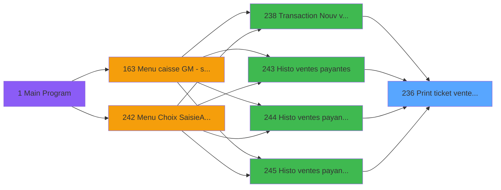
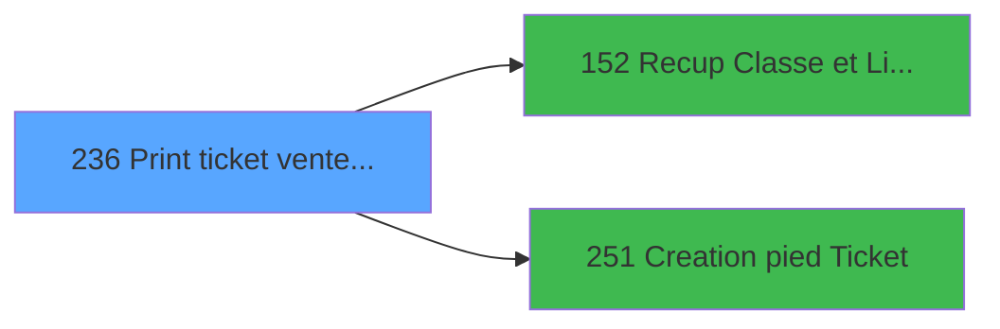

# ADH IDE 236 - Print ticket vente PMS-584

> **Analyse**: 2026-01-29 17:07
> **Pipeline**: V7.0 Deep Analysis
> **Structure**: 4 onglets (Resume | Ecrans | Donnees | Connexions)

<!-- TAB:Resume -->

## 1. FICHE D'IDENTITE

| Attribut | Valeur |
|----------|--------|
| Projet | ADH |
| IDE Position | 236 |
| Nom Programme | Print ticket vente PMS-584 |
| Fichier source | `Prg_236.xml` |
| Domaine metier | Ventes |
| Taches | 38 (0 ecrans visibles) |
| Tables modifiees | 0 |
| Programmes appeles | 2 |

## 2. DESCRIPTION FONCTIONNELLE

**Print ticket vente PMS-584** assure la gestion complete de ce processus, accessible depuis Transaction Nouv vente PMS-584, Histo ventes payantes, Histo ventes payantes /PMS-605, Histo ventes payantes /PMS-623.

Le flux de traitement s'organise en **4 blocs fonctionnels** :

- **Traitement** (16 taches) : traitements metier divers
- **Impression** (15 taches) : generation de tickets et documents
- **Reglement** (5 taches) : gestion des moyens de paiement et reglements
- **Consultation** (2 taches) : ecrans de recherche, selection et consultation

Le programme delegue des operations a **2 sous-programmes** couvrant :

- **Impression ticket/document** : Creation pied Ticket
- **Recuperation donnees** : Recup Classe et Lib du MOP

## 3. BLOCS FONCTIONNELS

### 3.1 Traitement (16 taches)

- *Internes*: Veuillez patienter ... (T1), Counter (T2), Impression reçu change (T3), Impression reçu change (T5), Counter (T11), Impression reçu change (T12), Impression reçu change (T13), Veuillez patienter ... (T18), Veuillez patienter ... (T23), Récup. dates de séjour /PMS28/ (T24), Veuillez patienter ... (T29), Récup. dates de séjour /PMS28/ (T31), recup terminal (T35), recup terminal (T36), Errors (T37),  (T41)

### 3.2 Consultation (2 taches)

- *Internes*: Recherche dates de séjour (T4), Recherche dates de séjour (T9)
- **Sous-programmes**: Recup Classe et Lib du MOP (IDE 152)

### 3.3 Impression (15 taches)

- *Internes*: Print reduction (T6), Print Tva (T8), Edition LCO Liberation (T10), Print reduction (T14), Print Tva (T15), Printer 5 (T17), Print reduction (T20), Print Tva (T21), Printer 5 (T22), Print reduction (T26), Print Tva (T27), Printer 9 (T28), Edition LCO Liberation (T30), Print reduction (T32), Print Tva (T34)
- **Sous-programmes**: Creation pied Ticket (IDE 251)

### 3.4 Reglement (5 taches)

- *Internes*: Edition Multi Moyen Paiement (T7), Edition Multi Moyen Paiement (T16), Edition Multi Moyen Paiement (T19), Edition Multi Moyen Paiement (T25), Edition Multi Moyen Paiement (T33)
- **Sous-programmes**: Recup Classe et Lib du MOP (IDE 152)

## 5. REGLES METIER

*(Aucune regle metier identifiee)*

## 6. CONTEXTE

- **Appele par**: Transaction Nouv vente PMS-584 (IDE 238), Histo ventes payantes (IDE 243), Histo ventes payantes /PMS-605 (IDE 244), Histo ventes payantes /PMS-623 (IDE 245)
- **Appelle**: 2 programmes | **Tables**: 15 (W:0 R:11 L:9) | **Taches**: 38 | **Expressions**: 19

<!-- TAB:Ecrans -->

## 8. ECRANS

*(Programme sans ecran visible)*

## 9. NAVIGATION

### 9.2 Logique decisionnelle

*(Pas de regles metier pour l'algorigramme)*

### 9.3 Structure hierarchique (38 taches)

- **236.1** Veuillez patienter ...  (MDI) *[Traitement]*
- **236.2** Counter  (MDI) *[Traitement]*
- **236.3** Impression reçu change  (MDI) *[Traitement]*
- **236.4** Recherche dates de séjour   *[Consultation]*
- **236.5** Impression reçu change  (MDI) *[Traitement]*
- **236.6** Print reduction   *[Impression]*
- **236.7** Edition Multi Moyen Paiement   *[Reglement]*
- **236.8** Print Tva   *[Impression]*
- **236.9** Recherche dates de séjour   *[Consultation]*
- **236.10** Edition LCO Liberation   *[Impression]*
- **236.11** Counter  (MDI) *[Traitement]*
- **236.12** Impression reçu change  (MDI) *[Traitement]*
- **236.13** Impression reçu change  (MDI) *[Traitement]*
- **236.14** Print reduction   *[Impression]*
- **236.15** Print Tva   *[Impression]*
- **236.16** Edition Multi Moyen Paiement   *[Reglement]*
- **236.17** Printer 5  (MDI) *[Impression]*
- **236.18** Veuillez patienter ...  (MDI) *[Traitement]*
- **236.19** Edition Multi Moyen Paiement   *[Reglement]*
- **236.20** Print reduction   *[Impression]*
- **236.21** Print Tva   *[Impression]*
- **236.22** Printer 5  (MDI) *[Impression]*
- **236.23** Veuillez patienter ...  (MDI) *[Traitement]*
- **236.24** Récup. dates de séjour /PMS28/   *[Traitement]*
- **236.25** Edition Multi Moyen Paiement   *[Reglement]*
- **236.26** Print reduction   *[Impression]*
- **236.27** Print Tva   *[Impression]*
- **236.28** Printer 9  (MDI) *[Impression]*
- **236.29** Veuillez patienter ...  (MDI) *[Traitement]*
- **236.30** Edition LCO Liberation   *[Impression]*
- **236.31** Récup. dates de séjour /PMS28/   *[Traitement]*
- **236.32** Print reduction   *[Impression]*
- **236.33** Edition Multi Moyen Paiement   *[Reglement]*
- **236.34** Print Tva   *[Impression]*
- **236.35** recup terminal   *[Traitement]*
- **236.36** recup terminal   *[Traitement]*
- **236.37** Errors   *[Traitement]*
- **236.41** (sans nom)   *[Traitement]*

<!-- TAB:Donnees -->

## 10. TABLES

### 10.1 Tables utilisees (15)

| ID | Nom | Description | Type | R | W | L | Usages |
|----|-----|-------------|------|---|---|---|--------|
| 31 | gm-complet_______gmc |  | DB | R |   |   | 2 |
| 34 | hebergement______heb | Hebergement (chambres) | DB | R |   | L | 4 |
| 40 | comptable________cte |  | DB | R |   |   | 4 |
| 67 | tables___________tab |  | DB | R |   | L | 3 |
| 69 | initialisation___ini |  | DB | R |   |   | 1 |
| 77 | articles_________art |  | DB | R |   | L | 3 |
| 263 | vente |  | DB |   |   | L | 4 |
| 596 | tempo_ecran_police | Table temporaire ecran | TMP | R |   | L | 14 |
| 728 | arc_cc_total |  | DB |   |   | L | 1 |
| 818 | Circuit supprime |  | DB |   |   | L | 1 |
| 847 | stat_lieu_vente_date | Statistiques point de vente | TMP | R |   | L | 15 |
| 867 | log_maj_tpe |  | DB | R |   |   | 5 |
| 878 | categorie_operation_mw |  | DB | R |   |   | 2 |
| 904 | Boo_AvailibleEmployees |  | DB |   |   | L | 3 |
| 1037 | Table_1037 |  | MEM | R |   |   | 2 |

### 10.2 Colonnes par table

*[Phase 2] Analyse des colonnes lues (R) et modifiees (W) par table avec details depliables.*

## 11. VARIABLES

*(Programme sans variables locales mappees)*

## 12. EXPRESSIONS

**19 / 19 expressions decodees (100%)**

### 12.1 Repartition par bloc

| Bloc fonctionnel | Expressions | Regles |
|-----------------|-------------|--------|
| Impression | 7 | 0 |
| Autre | 12 | 0 |

### 12.2 Expressions cles par bloc

#### Impression (7 expressions)

| Type | IDE | Expression | Regle |
|------|-----|------------|-------|
| DATE | 16 | `Translate ('%TempDir%')&'ticket_vente_'&IF(Var_U,'OD_','')&
Str(Var_O,'8P0')&'_'& DStr (Date(),'YYMMDD')&
'_'&TStr(Time(),'HHMMSS')&'.pdf'` | - |
| OTHER | 6 | `GetParam ('CURRENTPRINTERNUM')=8` | - |
| OTHER | 7 | `GetParam ('CURRENTPRINTERNUM')=9` | - |
| OTHER | 17 | `GetParam ('CURRENTPRINTERNUM')` | - |
| OTHER | 3 | `GetParam ('CURRENTPRINTERNUM')=1` | - |
| ... | | *+2 autres* | |

#### Autre (12 expressions)

| Type | IDE | Expression | Regle |
|------|-----|------------|-------|
| CONSTANT | 9 | `'VSL'` | - |
| CONSTANT | 8 | `'VRL'` | - |
| OTHER | 14 | `VG78` | - |
| OTHER | 13 | `'TRUE'LOG` | - |
| OTHER | 15 | `NOT VG78` | - |
| ... | | *+7 autres* | |

<!-- TAB:Connexions -->

## 13. GRAPHE D'APPELS

### 13.1 Chaine depuis Main (Callers)

Main -> ... -> Transaction Nouv vente PMS-584 (IDE 238) -> **Print ticket vente PMS-584 (IDE 236)**

Main -> ... -> Histo ventes payantes (IDE 243) -> **Print ticket vente PMS-584 (IDE 236)**

Main -> ... -> Histo ventes payantes /PMS-605 (IDE 244) -> **Print ticket vente PMS-584 (IDE 236)**

Main -> ... -> Histo ventes payantes /PMS-623 (IDE 245) -> **Print ticket vente PMS-584 (IDE 236)**

### 13.2 Callers

| IDE | Nom Programme | Nb Appels |
|-----|---------------|-----------|
| 238 | Transaction Nouv vente PMS-584 | 4 |
| 243 | Histo ventes payantes | 2 |
| 244 | Histo ventes payantes /PMS-605 | 2 |
| 245 | Histo ventes payantes /PMS-623 | 2 |

### 13.3 Callees (programmes appeles)

### 13.4 Detail Callees avec contexte

| IDE | Nom Programme | Appels | Contexte |
|-----|---------------|--------|----------|
| 152 | Recup Classe et Lib du MOP | 5 | Recuperation donnees |
| 251 | Creation pied Ticket | 5 | Impression ticket/document |

## 14. RECOMMANDATIONS MIGRATION

### 14.1 Profil du programme

| Metrique | Valeur | Impact migration |
|----------|--------|-----------------|
| Lignes de logique | 1231 | Programme volumineux |
| Expressions | 19 | Peu de logique |
| Tables WRITE | 0 | Impact faible |
| Sous-programmes | 2 | Peu de dependances |
| Ecrans visibles | 0 | Ecran unique ou traitement batch |
| Code desactive | 0% (0 / 1231) | Code sain |
| Regles metier | 0 | Pas de regle identifiee |

**Estimation effort**: ~**14 jours** de developpement

### 14.2 Plan de migration par bloc

#### Traitement (16 taches: 0 ecrans, 16 traitements)

- Traitement standard a migrer

#### Consultation (2 taches: 0 ecrans, 2 traitements)

- Ecrans de recherche/selection en modales ou composants

#### Impression (15 taches: 0 ecrans, 15 traitements)

- Remplacer par generation PDF/HTML
- Configurer le systeme d'impression

#### Reglement (5 taches: 0 ecrans, 5 traitements)

- Logique multi-moyens de paiement a implementer
- Integration TPE si applicable
- 5 traitement(s) internes de reglement

### 14.3 Dependances critiques

| Dependance | Type | Appels | Impact |
|------------|------|--------|--------|
| IDE 251 - Creation pied Ticket | Sous-programme | 5x | **CRITIQUE** - Impression ticket/document |
| IDE 152 - Recup Classe et Lib du MOP | Sous-programme | 5x | **CRITIQUE** - Recuperation donnees |

---
*Spec DETAILED generee par Pipeline V7.0 - 2026-01-29 17:07*
