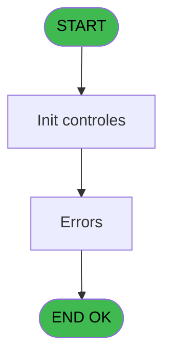

# ADH IDE 236 - Print ticket vente PMS-584

> **Analyse**: Phases 1-4 2026-02-07 03:53 -> 03:54 (28s) | Assemblage 03:54
> **Pipeline**: V7.2 Enrichi
> **Structure**: 4 onglets (Resume | Ecrans | Donnees | Connexions)

<!-- TAB:Resume -->

## 1. FICHE D'IDENTITE

| Attribut | Valeur |
|----------|--------|
| Projet | ADH |
| IDE Position | 236 |
| Nom Programme | Print ticket vente PMS-584 |
| Fichier source | `Prg_236.xml` |
| Dossier IDE | Ventes |
| Taches | 38 (1 ecrans visibles) |
| Tables modifiees | 0 |
| Programmes appeles | 2 |

## 2. DESCRIPTION FONCTIONNELLE

**Print ticket vente PMS-584** assure la gestion complete de ce processus, accessible depuis [Transaction Nouv vente PMS-584 (IDE 238)](ADH-IDE-238.md), [Histo ventes payantes (IDE 243)](ADH-IDE-243.md), [Histo ventes payantes /PMS-605 (IDE 244)](ADH-IDE-244.md), [Histo ventes payantes /PMS-623 (IDE 245)](ADH-IDE-245.md).

Le flux de traitement s'organise en **4 blocs fonctionnels** :

- **Traitement** (16 taches) : traitements metier divers
- **Impression** (15 taches) : generation de tickets et documents
- **Reglement** (5 taches) : gestion des moyens de paiement et reglements
- **Consultation** (2 taches) : ecrans de recherche, selection et consultation

Detail : phases du traitement

#### Phase 1 : Traitement (16 taches)

- **236** - Veuillez patienter ... **[[ECRAN]](#ecran-t1)**
- **236.1** - Counter
- **236.1.1** - Impression reçu change **[[ECRAN]](#ecran-t3)**
- **236.1.2** - Impression reçu change
- **236.2** - Counter
- **236.2.1** - Impression reçu change
- **236.2.2** - Impression reçu change
- **236.3.1** - Veuillez patienter ... **[[ECRAN]](#ecran-t18)**
- **236.4.1** - Veuillez patienter ... **[[ECRAN]](#ecran-t23)**
- **236.4.1.1** - Récup. dates de séjour /PMS28/
- **236.5.1** - Veuillez patienter ... **[[ECRAN]](#ecran-t29)**
- **236.5.1.2** - Récup. dates de séjour /PMS28/
- **236.6** - recup terminal
- **236.7** - recup terminal
- **236.8** - Errors **[[ECRAN]](#ecran-t37)**
- **236.9** - (sans nom) **[[ECRAN]](#ecran-t41)**

#### Phase 2 : Consultation (2 taches)

- **236.1.1.1** - Recherche dates de séjour
- **236.1.2.4** - Recherche dates de séjour

Delegue a : [Recup Classe et Lib du MOP (IDE 152)](ADH-IDE-152.md)

#### Phase 3 : Impression (15 taches)

- **236.1.2.1** - Print reduction
- **236.1.2.3** - Print Tva **[[ECRAN]](#ecran-t8)**
- **236.1.2.5** - Edition LCO Liberation
- **236.2.2.1** - Print reduction
- **236.2.2.2** - Print Tva **[[ECRAN]](#ecran-t15)**
- **236.3** - Printer 5 **[[ECRAN]](#ecran-t17)**
- **236.3.1.2** - Print reduction
- **236.3.1.3** - Print Tva **[[ECRAN]](#ecran-t21)**
- **236.4** - Printer 5 **[[ECRAN]](#ecran-t22)**
- **236.4.1.3** - Print reduction
- **236.4.1.4** - Print Tva **[[ECRAN]](#ecran-t27)**
- **236.5** - Printer 9 **[[ECRAN]](#ecran-t28)**
- **236.5.1.1** - Edition LCO Liberation
- **236.5.1.3** - Print reduction
- **236.5.1.5** - Print Tva **[[ECRAN]](#ecran-t34)**

Delegue a : [Creation pied Ticket (IDE 251)](ADH-IDE-251.md)

#### Phase 4 : Reglement (5 taches)

- **236.1.2.2** - Edition Multi Moyen Paiement
- **236.2.2.3** - Edition Multi Moyen Paiement
- **236.3.1.1** - Edition Multi Moyen Paiement
- **236.4.1.2** - Edition Multi Moyen Paiement
- **236.5.1.4** - Edition Multi Moyen Paiement

Delegue a : [Recup Classe et Lib du MOP (IDE 152)](ADH-IDE-152.md)

## 3. BLOCS FONCTIONNELS

### 3.1 Traitement (16 taches)

Traitements internes.

---

#### 236 - Veuillez patienter ... [[ECRAN]](#ecran-t1)

**Role** : Tache d'orchestration : point d'entree du programme (16 sous-taches). Coordonne l'enchainement des traitements.
**Ecran** : 422 x 56 DLU (MDI) | [Voir mockup](#ecran-t1)

15 sous-taches directes

| Tache | Nom | Bloc |
|-------|-----|------|
| [236.1](#t2) | Counter | Traitement |
| [236.1.1](#t3) | Impression reçu change **[[ECRAN]](#ecran-t3)** | Traitement |
| [236.1.2](#t5) | Impression reçu change | Traitement |
| [236.2](#t11) | Counter | Traitement |
| [236.2.1](#t12) | Impression reçu change | Traitement |
| [236.2.2](#t13) | Impression reçu change | Traitement |
| [236.3.1](#t18) | Veuillez patienter ... **[[ECRAN]](#ecran-t18)** | Traitement |
| [236.4.1](#t23) | Veuillez patienter ... **[[ECRAN]](#ecran-t23)** | Traitement |
| [236.4.1.1](#t24) | Récup. dates de séjour /PMS28/ | Traitement |
| [236.5.1](#t29) | Veuillez patienter ... **[[ECRAN]](#ecran-t29)** | Traitement |
| [236.5.1.2](#t31) | Récup. dates de séjour /PMS28/ | Traitement |
| [236.6](#t35) | recup terminal | Traitement |
| [236.7](#t36) | recup terminal | Traitement |
| [236.8](#t37) | Errors **[[ECRAN]](#ecran-t37)** | Traitement |
| [236.9](#t41) | (sans nom) **[[ECRAN]](#ecran-t41)** | Traitement |

---

#### 236.1 - Counter

**Role** : Traitement : Counter.

---

#### 236.1.1 - Impression reçu change [[ECRAN]](#ecran-t3)

**Role** : Generation du document : Impression reçu change.
**Ecran** : 333 x 86 DLU (MDI) | [Voir mockup](#ecran-t3)

---

#### 236.1.2 - Impression reçu change

**Role** : Generation du document : Impression reçu change.

---

#### 236.2 - Counter

**Role** : Traitement : Counter.

---

#### 236.2.1 - Impression reçu change

**Role** : Generation du document : Impression reçu change.

---

#### 236.2.2 - Impression reçu change

**Role** : Generation du document : Impression reçu change.

---

#### 236.3.1 - Veuillez patienter ... [[ECRAN]](#ecran-t18)

**Role** : Traitement : Veuillez patienter ....
**Ecran** : 424 x 56 DLU (MDI) | [Voir mockup](#ecran-t18)

---

#### 236.4.1 - Veuillez patienter ... [[ECRAN]](#ecran-t23)

**Role** : Traitement : Veuillez patienter ....
**Ecran** : 424 x 56 DLU (MDI) | [Voir mockup](#ecran-t23)

---

#### 236.4.1.1 - Récup. dates de séjour /PMS28/

**Role** : Traitement : Récup. dates de séjour /PMS28/.
**Variables liees** : BJ (v.Date Conso ou date séjour)

---

#### 236.5.1 - Veuillez patienter ... [[ECRAN]](#ecran-t29)

**Role** : Traitement : Veuillez patienter ....
**Ecran** : 435 x 63 DLU (MDI) | [Voir mockup](#ecran-t29)

---

#### 236.5.1.2 - Récup. dates de séjour /PMS28/

**Role** : Traitement : Récup. dates de séjour /PMS28/.
**Variables liees** : BJ (v.Date Conso ou date séjour)

---

#### 236.6 - recup terminal

**Role** : Consultation/chargement : recup terminal.

---

#### 236.7 - recup terminal

**Role** : Consultation/chargement : recup terminal.

---

#### 236.8 - Errors [[ECRAN]](#ecran-t37)

**Role** : Traitement : Errors.
**Ecran** : 600 x 259 DLU | [Voir mockup](#ecran-t37)

---

#### 236.9 - (sans nom) [[ECRAN]](#ecran-t41)

**Role** : Traitement interne.
**Ecran** : 725 x 303 DLU | [Voir mockup](#ecran-t41)

### 3.2 Consultation (2 taches)

Ecrans de recherche et consultation.

---

#### 236.1.1.1 - Recherche dates de séjour

**Role** : Traitement : Recherche dates de séjour.
**Variables liees** : BJ (v.Date Conso ou date séjour)

---

#### 236.1.2.4 - Recherche dates de séjour

**Role** : Traitement : Recherche dates de séjour.
**Variables liees** : BJ (v.Date Conso ou date séjour)

### 3.3 Impression (15 taches)

Generation des documents et tickets.

---

#### 236.1.2.1 - Print reduction

**Role** : Generation du document : Print reduction.
**Variables liees** : Z (p.Re_Print_Annulation), BL (v.Num printer)

---

#### 236.1.2.3 - Print Tva [[ECRAN]](#ecran-t8)

**Role** : Generation du document : Print Tva.
**Ecran** : 506 x 0 DLU | [Voir mockup](#ecran-t8)
**Variables liees** : Z (p.Re_Print_Annulation), BL (v.Num printer)

---

#### 236.1.2.5 - Edition LCO Liberation

**Role** : Generation du document : Edition LCO Liberation.

---

#### 236.2.2.1 - Print reduction

**Role** : Generation du document : Print reduction.
**Variables liees** : Z (p.Re_Print_Annulation), BL (v.Num printer)

---

#### 236.2.2.2 - Print Tva [[ECRAN]](#ecran-t15)

**Role** : Generation du document : Print Tva.
**Ecran** : 506 x 0 DLU | [Voir mockup](#ecran-t15)
**Variables liees** : Z (p.Re_Print_Annulation), BL (v.Num printer)

---

#### 236.3 - Printer 5 [[ECRAN]](#ecran-t17)

**Role** : Generation du document : Printer 5.
**Ecran** : 424 x 56 DLU (MDI) | [Voir mockup](#ecran-t17)
**Variables liees** : BL (v.Num printer)

---

#### 236.3.1.2 - Print reduction

**Role** : Generation du document : Print reduction.
**Variables liees** : Z (p.Re_Print_Annulation), BL (v.Num printer)

---

#### 236.3.1.3 - Print Tva [[ECRAN]](#ecran-t21)

**Role** : Generation du document : Print Tva.
**Ecran** : 506 x 0 DLU | [Voir mockup](#ecran-t21)
**Variables liees** : Z (p.Re_Print_Annulation), BL (v.Num printer)

---

#### 236.4 - Printer 5 [[ECRAN]](#ecran-t22)

**Role** : Generation du document : Printer 5.
**Ecran** : 424 x 56 DLU (MDI) | [Voir mockup](#ecran-t22)
**Variables liees** : BL (v.Num printer)

---

#### 236.4.1.3 - Print reduction

**Role** : Generation du document : Print reduction.
**Variables liees** : Z (p.Re_Print_Annulation), BL (v.Num printer)

---

#### 236.4.1.4 - Print Tva [[ECRAN]](#ecran-t27)

**Role** : Generation du document : Print Tva.
**Ecran** : 506 x 0 DLU | [Voir mockup](#ecran-t27)
**Variables liees** : Z (p.Re_Print_Annulation), BL (v.Num printer)

---

#### 236.5 - Printer 9 [[ECRAN]](#ecran-t28)

**Role** : Generation du document : Printer 9.
**Ecran** : 424 x 56 DLU (MDI) | [Voir mockup](#ecran-t28)
**Variables liees** : BL (v.Num printer)

---

#### 236.5.1.1 - Edition LCO Liberation

**Role** : Generation du document : Edition LCO Liberation.

---

#### 236.5.1.3 - Print reduction

**Role** : Generation du document : Print reduction.
**Variables liees** : Z (p.Re_Print_Annulation), BL (v.Num printer)

---

#### 236.5.1.5 - Print Tva [[ECRAN]](#ecran-t34)

**Role** : Generation du document : Print Tva.
**Ecran** : 565 x 0 DLU | [Voir mockup](#ecran-t34)
**Variables liees** : Z (p.Re_Print_Annulation), BL (v.Num printer)

### 3.4 Reglement (5 taches)

Gestion des moyens de paiement : 5 taches de reglement.

---

#### 236.1.2.2 - Edition Multi Moyen Paiement

**Role** : Gestion du reglement : Edition Multi Moyen Paiement.
**Variables liees** : L (P0 mode de paiement), M (P0 libelle paiement)
**Delegue a** : [Recup Classe et Lib du MOP (IDE 152)](ADH-IDE-152.md)

---

#### 236.2.2.3 - Edition Multi Moyen Paiement

**Role** : Gestion du reglement : Edition Multi Moyen Paiement.
**Variables liees** : L (P0 mode de paiement), M (P0 libelle paiement)
**Delegue a** : [Recup Classe et Lib du MOP (IDE 152)](ADH-IDE-152.md)

---

#### 236.3.1.1 - Edition Multi Moyen Paiement

**Role** : Gestion du reglement : Edition Multi Moyen Paiement.
**Variables liees** : L (P0 mode de paiement), M (P0 libelle paiement)
**Delegue a** : [Recup Classe et Lib du MOP (IDE 152)](ADH-IDE-152.md)

---

#### 236.4.1.2 - Edition Multi Moyen Paiement

**Role** : Gestion du reglement : Edition Multi Moyen Paiement.
**Variables liees** : L (P0 mode de paiement), M (P0 libelle paiement)
**Delegue a** : [Recup Classe et Lib du MOP (IDE 152)](ADH-IDE-152.md)

---

#### 236.5.1.4 - Edition Multi Moyen Paiement

**Role** : Gestion du reglement : Edition Multi Moyen Paiement.
**Variables liees** : L (P0 mode de paiement), M (P0 libelle paiement)
**Delegue a** : [Recup Classe et Lib du MOP (IDE 152)](ADH-IDE-152.md)

## 5. REGLES METIER

*(Aucune regle metier identifiee)*

## 6. CONTEXTE

- **Appele par**: [Transaction Nouv vente PMS-584 (IDE 238)](ADH-IDE-238.md), [Histo ventes payantes (IDE 243)](ADH-IDE-243.md), [Histo ventes payantes /PMS-605 (IDE 244)](ADH-IDE-244.md), [Histo ventes payantes /PMS-623 (IDE 245)](ADH-IDE-245.md)
- **Appelle**: 2 programmes | **Tables**: 15 (W:0 R:11 L:9) | **Taches**: 38 | **Expressions**: 19

<!-- TAB:Ecrans -->

## 8. ECRANS

### 8.1 Forms visibles (1 / 38)

| # | Position | Tache | Nom | Type | Largeur | Hauteur | Bloc |
|---|----------|-------|-----|------|---------|---------|------|
| 1 | 236.8 | 236.8 | Errors | Type0 | 600 | 259 | Traitement |

### 8.2 Mockups Ecrans

---

#### 236.8 - Errors
**Tache** : [236.8](#t37) | **Type** : Type0 | **Dimensions** : 600 x 259 DLU
**Bloc** : Traitement | **Titre IDE** : Errors

<!-- FORM-DATA:
{
    "width":  600,
    "vFactor":  8,
    "type":  "Type0",
    "hFactor":  4,
    "controls":  [
                     {
                         "x":  4,
                         "type":  "table",
                         "var":  "",
                         "name":  "",
                         "titleH":  12,
                         "color":  "110",
                         "w":  592,
                         "y":  24,
                         "fmt":  "",
                         "parent":  null,
                         "text":  "",
                         "rowH":  13,
                         "h":  185,
                         "cols":  [
                                      {
                                          "title":  "Imputation",
                                          "layer":  1,
                                          "w":  60
                                      },
                                      {
                                          "title":  "Ss Imp.",
                                          "layer":  2,
                                          "w":  80
                                      },
                                      {
                                          "title":  "Service",
                                          "layer":  3,
                                          "w":  49
                                      },
                                      {
                                          "title":  "Libellé",
                                          "layer":  4,
                                          "w":  122
                                      },
                                      {
                                          "title":  "Libellé sup.",
                                          "layer":  5,
                                          "w":  122
                                      },
                                      {
                                          "title":  "Paiement",
                                          "layer":  6,
                                          "w":  40
                                      },
                                      {
                                          "title":  "Montant",
                                          "layer":  7,
                                          "w":  98
                                      }
                                  ],
                         "rows":  7
                     },
                     {
                         "x":  0,
                         "type":  "label",
                         "var":  "",
                         "y":  0,
                         "w":  600,
                         "fmt":  "",
                         "name":  "",
                         "h":  21,
                         "color":  "",
                         "text":  "",
                         "parent":  null
                     },
                     {
                         "x":  0,
                         "type":  "label",
                         "var":  "",
                         "y":  235,
                         "w":  600,
                         "fmt":  "",
                         "name":  "",
                         "h":  24,
                         "color":  "",
                         "text":  "",
                         "parent":  null
                     },
                     {
                         "x":  5,
                         "type":  "label",
                         "var":  "",
                         "y":  214,
                         "w":  587,
                         "fmt":  "",
                         "name":  "",
                         "h":  16,
                         "color":  "143",
                         "text":  "Une ou plusieurs lignes de transaction n\u0027ont pas été enregistrés. Merci d\u0027ouvrir un incident au support.",
                         "parent":  null
                     },
                     {
                         "x":  6,
                         "type":  "edit",
                         "var":  "",
                         "y":  5,
                         "w":  134,
                         "fmt":  "20",
                         "name":  "",
                         "h":  10,
                         "color":  "",
                         "text":  "",
                         "parent":  null
                     },
                     {
                         "x":  490,
                         "type":  "edit",
                         "var":  "",
                         "y":  6,
                         "w":  102,
                         "fmt":  "WWW DD MMM YYYYT",
                         "name":  "",
                         "h":  10,
                         "color":  "",
                         "text":  "",
                         "parent":  null
                     },
                     {
                         "x":  8,
                         "type":  "edit",
                         "var":  "",
                         "y":  39,
                         "w":  48,
                         "fmt":  "",
                         "name":  "sod_imputation",
                         "h":  8,
                         "color":  "110",
                         "text":  "",
                         "parent":  1
                     },
                     {
                         "x":  68,
                         "type":  "edit",
                         "var":  "",
                         "y":  39,
                         "w":  14,
                         "fmt":  "",
                         "name":  "sod_sous-imputation",
                         "h":  8,
                         "color":  "110",
                         "text":  "",
                         "parent":  1
                     },
                     {
                         "x":  148,
                         "type":  "edit",
                         "var":  "",
                         "y":  39,
                         "w":  26,
                         "fmt":  "",
                         "name":  "sod_service",
                         "h":  10,
                         "color":  "110",
                         "text":  "",
                         "parent":  1
                     },
                     {
                         "x":  198,
                         "type":  "edit",
                         "var":  "",
                         "y":  39,
                         "w":  115,
                         "fmt":  "",
                         "name":  "sod_libelle_article",
                         "h":  10,
                         "color":  "110",
                         "text":  "",
                         "parent":  1
                     },
                     {
                         "x":  319,
                         "type":  "edit",
                         "var":  "",
                         "y":  39,
                         "w":  115,
                         "fmt":  "",
                         "name":  "sod_lib_supplement",
                         "h":  10,
                         "color":  "110",
                         "text":  "",
                         "parent":  1
                     },
                     {
                         "x":  442,
                         "type":  "edit",
                         "var":  "",
                         "y":  39,
                         "w":  26,
                         "fmt":  "",
                         "name":  "sod_moyen_paiement",
                         "h":  10,
                         "color":  "110",
                         "text":  "",
                         "parent":  1
                     },
                     {
                         "x":  482,
                         "type":  "edit",
                         "var":  "",
                         "y":  39,
                         "w":  91,
                         "fmt":  "",
                         "name":  "sod_montant",
                         "h":  8,
                         "color":  "110",
                         "text":  "",
                         "parent":  1
                     },
                     {
                         "x":  517,
                         "type":  "button",
                         "var":  "",
                         "y":  238,
                         "w":  77,
                         "fmt":  "\u0026Quitter",
                         "name":  "",
                         "h":  18,
                         "color":  "",
                         "text":  "",
                         "parent":  null
                     }
                 ],
    "taskId":  "236.8",
    "height":  259
}
-->

<strong>Champs : 9 champs</strong>

| Pos (x,y) | Nom | Variable | Type |
|-----------|-----|----------|------|
| 6,5 | 20 | - | edit |
| 490,6 | WWW DD MMM YYYYT | - | edit |
| 8,39 | sod_imputation | - | edit |
| 68,39 | sod_sous-imputation | - | edit |
| 148,39 | sod_service | - | edit |
| 198,39 | sod_libelle_article | - | edit |
| 319,39 | sod_lib_supplement | - | edit |
| 442,39 | sod_moyen_paiement | - | edit |
| 482,39 | sod_montant | - | edit |

<strong>Boutons : 1 boutons</strong>

| Bouton | Pos (x,y) | Action |
|--------|-----------|--------|
| Quitter | 517,238 | Quitte le programme |

## 9. NAVIGATION

Ecran unique: **Errors**

### 9.3 Structure hierarchique (38 taches)

| Position | Tache | Type | Dimensions | Bloc |
|----------|-------|------|------------|------|
| **236.1** | [**Veuillez patienter ...** (236)](#t1) [mockup](#ecran-t1) | MDI | 422x56 | Traitement |
| 236.1.1 | [Counter (236.1)](#t2) | MDI | - | |
| 236.1.2 | [Impression reçu change (236.1.1)](#t3) [mockup](#ecran-t3) | MDI | 333x86 | |
| 236.1.3 | [Impression reçu change (236.1.2)](#t5) | MDI | - | |
| 236.1.4 | [Counter (236.2)](#t11) | MDI | - | |
| 236.1.5 | [Impression reçu change (236.2.1)](#t12) | MDI | - | |
| 236.1.6 | [Impression reçu change (236.2.2)](#t13) | MDI | - | |
| 236.1.7 | [Veuillez patienter ... (236.3.1)](#t18) [mockup](#ecran-t18) | MDI | 424x56 | |
| 236.1.8 | [Veuillez patienter ... (236.4.1)](#t23) [mockup](#ecran-t23) | MDI | 424x56 | |
| 236.1.9 | [Récup. dates de séjour /PMS28/ (236.4.1.1)](#t24) | - | - | |
| 236.1.10 | [Veuillez patienter ... (236.5.1)](#t29) [mockup](#ecran-t29) | MDI | 435x63 | |
| 236.1.11 | [Récup. dates de séjour /PMS28/ (236.5.1.2)](#t31) | - | - | |
| 236.1.12 | [recup terminal (236.6)](#t35) | - | - | |
| 236.1.13 | [recup terminal (236.7)](#t36) | - | - | |
| 236.1.14 | [Errors (236.8)](#t37) [mockup](#ecran-t37) | - | 600x259 | |
| 236.1.15 | [(sans nom) (236.9)](#t41) [mockup](#ecran-t41) | - | 725x303 | |
| **236.2** | [**Recherche dates de séjour** (236.1.1.1)](#t4) | - | - | Consultation |
| 236.2.1 | [Recherche dates de séjour (236.1.2.4)](#t9) | - | - | |
| **236.3** | [**Print reduction** (236.1.2.1)](#t6) | - | - | Impression |
| 236.3.1 | [Print Tva (236.1.2.3)](#t8) [mockup](#ecran-t8) | - | 506x0 | |
| 236.3.2 | [Edition LCO Liberation (236.1.2.5)](#t10) | - | - | |
| 236.3.3 | [Print reduction (236.2.2.1)](#t14) | - | - | |
| 236.3.4 | [Print Tva (236.2.2.2)](#t15) [mockup](#ecran-t15) | - | 506x0 | |
| 236.3.5 | [Printer 5 (236.3)](#t17) [mockup](#ecran-t17) | MDI | 424x56 | |
| 236.3.6 | [Print reduction (236.3.1.2)](#t20) | - | - | |
| 236.3.7 | [Print Tva (236.3.1.3)](#t21) [mockup](#ecran-t21) | - | 506x0 | |
| 236.3.8 | [Printer 5 (236.4)](#t22) [mockup](#ecran-t22) | MDI | 424x56 | |
| 236.3.9 | [Print reduction (236.4.1.3)](#t26) | - | - | |
| 236.3.10 | [Print Tva (236.4.1.4)](#t27) [mockup](#ecran-t27) | - | 506x0 | |
| 236.3.11 | [Printer 9 (236.5)](#t28) [mockup](#ecran-t28) | MDI | 424x56 | |
| 236.3.12 | [Edition LCO Liberation (236.5.1.1)](#t30) | - | - | |
| 236.3.13 | [Print reduction (236.5.1.3)](#t32) | - | - | |
| 236.3.14 | [Print Tva (236.5.1.5)](#t34) [mockup](#ecran-t34) | - | 565x0 | |
| **236.4** | [**Edition Multi Moyen Paiement** (236.1.2.2)](#t7) | - | - | Reglement |
| 236.4.1 | [Edition Multi Moyen Paiement (236.2.2.3)](#t16) | - | - | |
| 236.4.2 | [Edition Multi Moyen Paiement (236.3.1.1)](#t19) | - | - | |
| 236.4.3 | [Edition Multi Moyen Paiement (236.4.1.2)](#t25) | - | - | |
| 236.4.4 | [Edition Multi Moyen Paiement (236.5.1.4)](#t33) | - | - | |

### 9.4 Algorigramme

> **Legende**: Vert = START/END OK | Rouge = END KO | Bleu = Decisions
> *Algorigramme auto-genere. Utiliser `/algorigramme` pour une synthese metier detaillee.*

<!-- TAB:Donnees -->

## 10. TABLES

### Tables utilisees (15)

| ID | Nom | Description | Type | R | W | L | Usages |
|----|-----|-------------|------|---|---|---|--------|
| 31 | gm-complet_______gmc |  | DB | R |   |   | 2 |
| 34 | hebergement______heb | Hebergement (chambres) | DB | R |   | L | 4 |
| 40 | comptable________cte |  | DB | R |   |   | 4 |
| 67 | tables___________tab |  | DB | R |   | L | 3 |
| 69 | initialisation___ini |  | DB | R |   |   | 1 |
| 77 | articles_________art | Articles et stock | DB | R |   | L | 3 |
| 263 | vente | Donnees de ventes | DB |   |   | L | 4 |
| 596 | tempo_ecran_police | Table temporaire ecran | TMP | R |   | L | 14 |
| 728 | arc_cc_total |  | DB |   |   | L | 1 |
| 818 | Circuit supprime |  | DB |   |   | L | 1 |
| 847 | stat_lieu_vente_date | Statistiques point de vente | TMP | R |   | L | 15 |
| 867 | log_maj_tpe |  | DB | R |   |   | 5 |
| 878 | categorie_operation_mw | Operations comptables | DB | R |   |   | 2 |
| 904 | Boo_AvailibleEmployees |  | DB |   |   | L | 3 |
| 1037 | Table_1037 |  | MEM | R |   |   | 2 |

### Colonnes par table (7 / 11 tables avec colonnes identifiees)

Table 31 - gm-complet_______gmc (R) - 2 usages

*Table utilisee uniquement en Link ou aucune colonne Real identifiee dans le DataView.*

Table 34 - hebergement______heb (R/L) - 4 usages

*Table utilisee uniquement en Link ou aucune colonne Real identifiee dans le DataView.*

Table 40 - comptable________cte (R) - 4 usages

| Lettre | Variable | Acces | Type |
|--------|----------|-------|------|
| A | V.Existe OD ? | R | Logical |
| B | v.Existe Entête pour ce type Ar | R | Logical |
| C | v.Début séjour | R | Date |
| D | v.Fin séjour | R | Date |
| E | v.TOTAL | R | Numeric |
| F | v.TOTAL_GP | R | Numeric |
| G | v.NAP | R | Numeric |
| H | v.Existe Reduction ? | R | Logical |
| I | v.Numero de ticket | R | Numeric |
| J | v.Date Conso. lue | R | Date |
| K | v.Dernière Date Conso. lue | R | Date |
| L | v.A editer ? | R | Logical |
| M | v. code_inscription | R | Unicode |
| N | v. Date Opération (Libelle) | R | Alpha |
| O | v. Total général (Libelle) | R | Alpha |
| P | v. Net à payer (Libelle) | R | Alpha |
| Q | v. Message (Libelle) | R | Alpha |
| R | v.Taxes Multiples | R | Logical |
| S | v. retour OD | R | Logical |
| T | v. retour CV | R | Logical |

Table 67 - tables___________tab (R/L) - 3 usages

| Lettre | Variable | Acces | Type |
|--------|----------|-------|------|
| A | V.Date Début Séjour | R | Date |
| B | V.Date Fin Séjour | R | Date |
| C | V.Existe OD ? | R | Logical |
| D | V.Existe entête pour Type art | R | Logical |
| E | V Total | R | Numeric |
| F | V Total_Gift Pass | R | Numeric |
| G | V.NAP | R | Numeric |
| H | V.Existe reduction ? | R | Logical |
| I | V.Numéro de Ticket | R | Numeric |
| J | V.Date Conso Lu | R | Date |
| K | V.Dernière Date Conso Lu | R | Date |

Table 69 - initialisation___ini (R) - 1 usages

| Lettre | Variable | Acces | Type |
|--------|----------|-------|------|
| A | P0 od annulation | R | Logical |
| B | P0 Nom | R | Alpha |
| C | P0 Date | R | Date |
| D | P0 Article libelle 1 | R | Alpha |
| E | P0 Article complementaire | R | Alpha |
| F | P0 Qte *NU* | R | Numeric |
| G | P0 Prix unitaire | R | Numeric |
| H | P0 Total | R | Numeric |
| I | P0 Devise locale | R | Alpha |
| J | P0 Masque | R | Alpha |
| K | P0 Chambre | R | Alpha |
| L | P0 mode de paiement | R | Alpha |
| M | P0 libelle paiement | R | Alpha |
| N | P0 Numero Ticket(VRL) | R | Numeric |
| O | P0 Num GM | R | Numeric |
| P | P0 UNI/BI | R | Alpha |
| Q | PO is TAI | R | Logical |
| R | P0 TAI Cash | R | Alpha |
| S | P0 TAI start date | R | Date |
| T | P0 TAI end date | R | Date |
| U | P0 OD ? | R | Logical |
| V | P.PDF | R | Logical |
| W | P.Document ticket | R | Alpha |
| X | P.Filename signature | R | Alpha |
| Y | P.i Duplicata | R | Logical |
| Z | p.Re_Print_Annulation | R | Logical |
| BA | P.i.N° de Ticket si VG TENV10 | R | Numeric |
| BB | P.i.TPE.N° Dossier Axis | R | Alpha |
| BC | P.i.TPE.N° autorisation | R | Alpha |
| BD | P.i.Decline envoi mail | R | Logical |
| BE | W0 en-tête ? | R | Alpha |
| BF | W0 fin tâche | R | Alpha |
| BG | W0 copies | R | Numeric |
| BH | v.Itération Compteur ticket | R | Numeric |
| BI | v.NumeroTicketsvg | R | Numeric |
| BJ | v.Date Conso ou date séjour | R | Alpha |
| BK | v.TPE ICMP | R | Logical |
| BL | v.Num printer | R | Numeric |
| BM | v. nb lignes erreurs | R | Numeric |

Table 77 - articles_________art (R/L) - 3 usages

| Lettre | Variable | Acces | Type |
|--------|----------|-------|------|
| A | V.Existe OD ? | R | Logical |
| B | V TOTAL | R | Numeric |
| C | V TOTAL_GP | R | Numeric |
| D | V.NAP | R | Numeric |
| E | V.Existe reduction ? | R | Logical |
| F | v.Numero de Ticket | R | Numeric |
| G | v.Date de Consom. lue | R | Date |
| H | v.Dernière Date de Conso. lue | R | Date |
| I | V.A editer ? | R | Logical |

Table 596 - tempo_ecran_police (R/L) - 14 usages

| Lettre | Variable | Acces | Type |
|--------|----------|-------|------|
| A | V TOTAL | R | Numeric |
| B | V.Début séjour | R | Date |
| C | V.Fin séjour | R | Date |

Table 847 - stat_lieu_vente_date (R/L) - 15 usages

| Lettre | Variable | Acces | Type |
|--------|----------|-------|------|
| A | v Libellé Moyen Paiement | R | Alpha |
| B | v.Total mp | R | Numeric |

Table 867 - log_maj_tpe (R) - 5 usages

*Table utilisee uniquement en Link ou aucune colonne Real identifiee dans le DataView.*

Table 878 - categorie_operation_mw (R) - 2 usages

*Table utilisee uniquement en Link ou aucune colonne Real identifiee dans le DataView.*

Table 1037 - Table_1037 (R) - 2 usages

*Table utilisee uniquement en Link ou aucune colonne Real identifiee dans le DataView.*

## 11. VARIABLES

### 11.1 Parametres entrants (30)

Variables recues du programme appelant ([Transaction Nouv vente PMS-584 (IDE 238)](ADH-IDE-238.md)).

| Lettre | Nom | Type | Usage dans |
|--------|-----|------|-----------|
| A | P0 od annulation | Logical | - |
| B | P0 Nom | Alpha | - |
| C | P0 Date | Date | - |
| D | P0 Article libelle 1 | Alpha | - |
| E | P0 Article complementaire | Alpha | - |
| F | P0 Qte *NU* | Numeric | - |
| G | P0 Prix unitaire | Numeric | - |
| H | P0 Total | Numeric | - |
| I | P0 Devise locale | Alpha | - |
| J | P0 Masque | Alpha | - |
| K | P0 Chambre | Alpha | - |
| L | P0 mode de paiement | Alpha | - |
| M | P0 libelle paiement | Alpha | - |
| N | P0 Numero Ticket(VRL) | Numeric | - |
| O | P0 Num GM | Numeric | 1x parametre entrant |
| P | P0 UNI/BI | Alpha | - |
| Q | PO is TAI | Logical | - |
| R | P0 TAI Cash | Alpha | - |
| S | P0 TAI start date | Date | - |
| T | P0 TAI end date | Date | - |
| U | P0 OD ? | Logical | 1x parametre entrant |
| V | P.PDF | Logical | 1x parametre entrant |
| W | P.Document ticket | Alpha | - |
| X | P.Filename signature | Alpha | - |
| Y | P.i Duplicata | Logical | - |
| Z | p.Re_Print_Annulation | Logical | - |
| BA | P.i.N° de Ticket si VG TENV10 | Numeric | - |
| BB | P.i.TPE.N° Dossier Axis | Alpha | - |
| BC | P.i.TPE.N° autorisation | Alpha | - |
| BD | P.i.Decline envoi mail | Logical | - |

### 11.2 Variables de session (6)

Variables persistantes pendant toute la session.

| Lettre | Nom | Type | Usage dans |
|--------|-----|------|-----------|
| BH | v.Itération Compteur ticket | Numeric | - |
| BI | v.NumeroTicketsvg | Numeric | - |
| BJ | v.Date Conso ou date séjour | Alpha | - |
| BK | v.TPE ICMP | Logical | - |
| BL | v.Num printer | Numeric | - |
| BM | v. nb lignes erreurs | Numeric | - |

### 11.3 Variables de travail (3)

Variables internes au programme.

| Lettre | Nom | Type | Usage dans |
|--------|-----|------|-----------|
| BE | W0 en-tête ? | Alpha | - |
| BF | W0 fin tâche | Alpha | - |
| BG | W0 copies | Numeric | - |

Toutes les 39 variables (liste complete)

| Cat | Lettre | Nom Variable | Type |
|-----|--------|--------------|------|
| P0 | **A** | P0 od annulation | Logical |
| P0 | **B** | P0 Nom | Alpha |
| P0 | **C** | P0 Date | Date |
| P0 | **D** | P0 Article libelle 1 | Alpha |
| P0 | **E** | P0 Article complementaire | Alpha |
| P0 | **F** | P0 Qte *NU* | Numeric |
| P0 | **G** | P0 Prix unitaire | Numeric |
| P0 | **H** | P0 Total | Numeric |
| P0 | **I** | P0 Devise locale | Alpha |
| P0 | **J** | P0 Masque | Alpha |
| P0 | **K** | P0 Chambre | Alpha |
| P0 | **L** | P0 mode de paiement | Alpha |
| P0 | **M** | P0 libelle paiement | Alpha |
| P0 | **N** | P0 Numero Ticket(VRL) | Numeric |
| P0 | **O** | P0 Num GM | Numeric |
| P0 | **P** | P0 UNI/BI | Alpha |
| P0 | **Q** | PO is TAI | Logical |
| P0 | **R** | P0 TAI Cash | Alpha |
| P0 | **S** | P0 TAI start date | Date |
| P0 | **T** | P0 TAI end date | Date |
| P0 | **U** | P0 OD ? | Logical |
| P0 | **V** | P.PDF | Logical |
| P0 | **W** | P.Document ticket | Alpha |
| P0 | **X** | P.Filename signature | Alpha |
| P0 | **Y** | P.i Duplicata | Logical |
| P0 | **Z** | p.Re_Print_Annulation | Logical |
| P0 | **BA** | P.i.N° de Ticket si VG TENV10 | Numeric |
| P0 | **BB** | P.i.TPE.N° Dossier Axis | Alpha |
| P0 | **BC** | P.i.TPE.N° autorisation | Alpha |
| P0 | **BD** | P.i.Decline envoi mail | Logical |
| W0 | **BE** | W0 en-tête ? | Alpha |
| W0 | **BF** | W0 fin tâche | Alpha |
| W0 | **BG** | W0 copies | Numeric |
| V. | **BH** | v.Itération Compteur ticket | Numeric |
| V. | **BI** | v.NumeroTicketsvg | Numeric |
| V. | **BJ** | v.Date Conso ou date séjour | Alpha |
| V. | **BK** | v.TPE ICMP | Logical |
| V. | **BL** | v.Num printer | Numeric |
| V. | **BM** | v. nb lignes erreurs | Numeric |

## 12. EXPRESSIONS

**19 / 19 expressions decodees (100%)**

### 12.1 Repartition par type

| Type | Expressions | Regles |
|------|-------------|--------|
| CONSTANTE | 2 | 0 |
| FORMAT | 1 | 0 |
| OTHER | 5 | 0 |
| CONDITION | 6 | 0 |
| CAST_LOGIQUE | 3 | 0 |
| REFERENCE_VG | 1 | 0 |
| NEGATION | 1 | 0 |

### 12.2 Expressions cles par type

#### CONSTANTE (2 expressions)

| Type | IDE | Expression | Regle |
|------|-----|------------|-------|
| CONSTANTE | 9 | `'VSL'` | - |
| CONSTANTE | 8 | `'VRL'` | - |

#### FORMAT (1 expressions)

| Type | IDE | Expression | Regle |
|------|-----|------------|-------|
| FORMAT | 16 | `Translate ('%TempDir%')&'ticket_vente_'&IF(P0 OD ? [U],'OD_','')&
Str(P0 Num GM [O],'8P0')&'_'& DStr (Date(),'YYMMDD')&
'_'&TStr(Time(),'HHMMSS')&'.pdf'` | - |

#### OTHER (5 expressions)

| Type | IDE | Expression | Regle |
|------|-----|------------|-------|
| OTHER | 17 | `GetParam ('CURRENTPRINTERNUM')` | - |
| OTHER | 18 | `ExpCalc('3'EXP) OR ExpCalc('7'EXP)` | - |
| OTHER | 10 | `P.PDF [V]` | - |
| OTHER | 1 | `SetCrsr (2)` | - |
| OTHER | 2 | `SetCrsr (1)` | - |

#### CONDITION (6 expressions)

| Type | IDE | Expression | Regle |
|------|-----|------------|-------|
| CONDITION | 6 | `GetParam ('CURRENTPRINTERNUM')=8` | - |
| CONDITION | 7 | `GetParam ('CURRENTPRINTERNUM')=9` | - |
| CONDITION | 19 | `[AX]>0` | - |
| CONDITION | 3 | `GetParam ('CURRENTPRINTERNUM')=1` | - |
| CONDITION | 4 | `GetParam ('CURRENTPRINTERNUM')=4` | - |
| ... | | *+1 autres* | |

#### CAST_LOGIQUE (3 expressions)

| Type | IDE | Expression | Regle |
|------|-----|------------|-------|
| CAST_LOGIQUE | 13 | `'TRUE'LOG` | - |
| CAST_LOGIQUE | 12 | `INIPut('CompressPDF =Y','FALSE'LOG)` | - |
| CAST_LOGIQUE | 11 | `INIPut('EmbedFonts=N','FALSE'LOG)` | - |

#### REFERENCE_VG (1 expressions)

| Type | IDE | Expression | Regle |
|------|-----|------------|-------|
| REFERENCE_VG | 14 | `VG78` | - |

#### NEGATION (1 expressions)

| Type | IDE | Expression | Regle |
|------|-----|------------|-------|
| NEGATION | 15 | `NOT VG78` | - |

<!-- TAB:Connexions -->

## 13. GRAPHE D'APPELS

### 13.1 Chaine depuis Main (Callers)

Main -> ... -> [Transaction Nouv vente PMS-584 (IDE 238)](ADH-IDE-238.md) -> **Print ticket vente PMS-584 (IDE 236)**

Main -> ... -> [Histo ventes payantes (IDE 243)](ADH-IDE-243.md) -> **Print ticket vente PMS-584 (IDE 236)**

Main -> ... -> [Histo ventes payantes /PMS-605 (IDE 244)](ADH-IDE-244.md) -> **Print ticket vente PMS-584 (IDE 236)**

Main -> ... -> [Histo ventes payantes /PMS-623 (IDE 245)](ADH-IDE-245.md) -> **Print ticket vente PMS-584 (IDE 236)**

### 13.2 Callers

| IDE | Nom Programme | Nb Appels |
|-----|---------------|-----------|
| [238](ADH-IDE-238.md) | Transaction Nouv vente PMS-584 | 4 |
| [243](ADH-IDE-243.md) | Histo ventes payantes | 2 |
| [244](ADH-IDE-244.md) | Histo ventes payantes /PMS-605 | 2 |
| [245](ADH-IDE-245.md) | Histo ventes payantes /PMS-623 | 2 |

### 13.3 Callees (programmes appeles)

### 13.4 Detail Callees avec contexte

| IDE | Nom Programme | Appels | Contexte |
|-----|---------------|--------|----------|
| [152](ADH-IDE-152.md) | Recup Classe et Lib du MOP | 5 | Recuperation donnees |
| [251](ADH-IDE-251.md) | Creation pied Ticket | 5 | Impression ticket/document |

## 14. RECOMMANDATIONS MIGRATION

### 14.1 Profil du programme

| Metrique | Valeur | Impact migration |
|----------|--------|-----------------|
| Lignes de logique | 1231 | Programme volumineux |
| Expressions | 19 | Peu de logique |
| Tables WRITE | 0 | Impact faible |
| Sous-programmes | 2 | Peu de dependances |
| Ecrans visibles | 1 | Ecran unique ou traitement batch |
| Code desactive | 0.3% (4 / 1231) | Code sain |
| Regles metier | 0 | Pas de regle identifiee |

### 14.2 Plan de migration par bloc

#### Traitement (16 taches: 7 ecrans, 9 traitements)

- **Strategie** : Orchestrateur avec 7 ecrans (Razor/React) et 9 traitements backend (services).
- Les ecrans deviennent des composants UI, les traitements invisibles deviennent des services injectables.
- 2 sous-programme(s) a migrer ou a reutiliser depuis les services existants.
- Decomposer les taches en services unitaires testables.

#### Consultation (2 taches: 0 ecran, 2 traitements)

- **Strategie** : Composants de recherche/selection en modales.

#### Impression (15 taches: 8 ecrans, 7 traitements)

- **Strategie** : Templates HTML -> PDF via wkhtmltopdf ou Puppeteer.
- `PrintService` injectable avec choix imprimante

#### Reglement (5 taches: 0 ecran, 5 traitements)

- **Strategie** : Service `IReglementService` avec pattern Strategy par mode de paiement.
- Integration TPE si applicable

### 14.3 Dependances critiques

| Dependance | Type | Appels | Impact |
|------------|------|--------|--------|
| [Creation pied Ticket (IDE 251)](ADH-IDE-251.md) | Sous-programme | 5x | **CRITIQUE** - Impression ticket/document |
| [Recup Classe et Lib du MOP (IDE 152)](ADH-IDE-152.md) | Sous-programme | 5x | **CRITIQUE** - Recuperation donnees |

---
*Spec DETAILED generee par Pipeline V7.2 - 2026-02-07 03:54*
