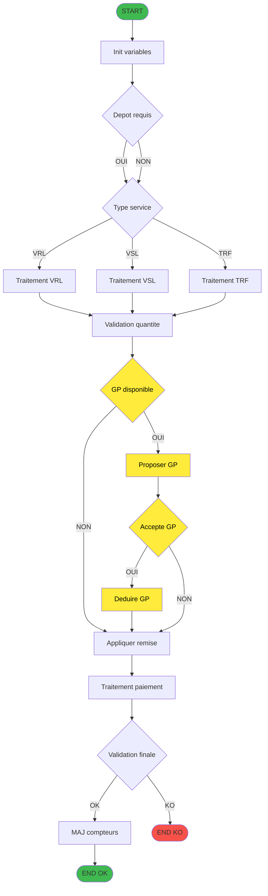
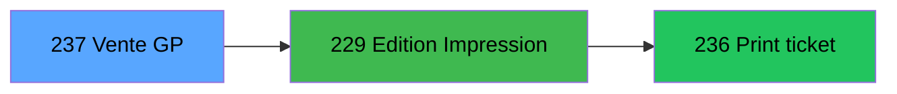

# ADH IDE 237 - Transaction Nouv vente avec GP

> **Version spec**: 3.5 (Fusion V2.1 + V3.4)
> **Analyse**: 2026-01-27 10:30 → 11:15
> **Source**: `Prg_233.xml`

---

<!-- TAB:Fonctionnel -->

## SPECIFICATION FONCTIONNELLE

### 1.1 Identification

| Attribut | Valeur |
|----------|--------|
| **Format IDE** | ADH IDE 237 |
| **Fichier XML** | Prg_233.xml |
| **Description** | Transaction Nouv vente avec GP |
| **Type** | O (Online) |
| **Parametres** | 20 |
| **Module** | ADH |
| **Dossier IDE** | Ventes |

> **Note**: Ce programme est Prg_233.xml. L'ID XML (233) differe de la position IDE (237).

### 1.2 Objectif metier

| Element | Description |
|---------|-------------|
| **Qui** | Operateur de caisse |
| **Quoi** | Ecran de transaction de vente avec Gift Pass |
| **Pourquoi** | Permettre la vente avec paiement par Gift Pass |
| **Declencheur** | Selection menu Nouvelle vente avec compte Gift Pass |

### 1.3 Regles metier

| Code | Regle | Condition |
|------|-------|-----------|
| RM-001 | Verification solde GP | Solde Gift Pass superieur a 0 et status different de O |
| RM-002 | Proposition GP | Message Voulez-vous utiliser le Gift Pass |
| RM-003 | Deduction automatique | Si accepte: deduction du montant facture |
| RM-004 | Services VRL/VSL/TRF | Validation specifique selon type service |
| RM-005 | Controle capacite | Verification disponibilite places/chambres |
| RM-006 | Validation remise | Remise ne peut depasser le plafond |

### 1.4 Flux utilisateur

1. Selection article depuis catalogue
2. Saisie quantite et prix unitaire
3. Verification solde Gift Pass disponible
4. **Question**: Voulez-vous utiliser le Gift Pass
5. Si oui: deduction GP du montant
6. Application reduction si code promo
7. Validation transaction
8. Mise a jour compteurs et statistiques

### 1.5 Cas d'erreur

| Erreur | Comportement |
|--------|--------------|
| Solde GP insuffisant | Message d'erreur, refus utilisation GP |
| GP en opposition | GP non propose |
| Article derniere minute invalide | Warning, demande confirmation |
| Cloture en cours | Blocage saisie, message informatif |
| Quantite superieure capacite | Message Plus de places disponibles |

### 1.6 Notes Migration

- Programme critique - flux ventes avec Gift Pass
- 20 parametres d'entree a mapper
- 30 tables dont 9 en ecriture
- Logique GP complexe (verification solde, opposition, deduction)
- Integration avec Edition (IDE 229) et Print ticket (IDE 236)

### 1.7 Dependances ECF

Programme local ADH - Non partage via ECF

### 1.8 Tags

`ventes`, `gift-pass`, `transaction`, `caisse`, `critical`

---

<!-- TAB:Technique -->

## SPECIFICATION TECHNIQUE

### 2.1 Tables - 30 tables dont 9 en ecriture

| IDE# | Nom Physique | Nom Logique | Access | Usage |
|------|--------------|-------------|--------|-------|
| #23 | `cafil001_dat` | reseau_cloture___rec | **W** | 5x |
| #32 | `cafil010_dat` | prestations | **W** | 3x |
| #46 | `cafil024_dat` | mvt_prestation___mpr | **W** | 2x |
| #47 | `cafil025_dat` | compte_gm________cgm | **W** | 2x |
| #68 | `cafil046_dat` | compteurs________cpt | **W** | 1x |
| #596 | `tmp_ecrpolice_dat` | tempo_ecran_police | **W** | 7x |
| #847 | `stat_lieu_vente_date` | stat_lieu_vente_date | **W** | 13x |
| #899 | `Boo_ResultsRechercheHoraire` | Boo_ResultsRechercheHoraire | **W** | 8x |
| #1037 | `Table_1037` | Unknown | **W** | 3x |
| #26 | `cafil004_dat` | comptes_speciaux_spc | R | 1x |
| #30 | `cafil008_dat` | gm-recherche_____gmr | R | 3x |
| #77 | `cafil055_dat` | articles_________art | R | 4x |
| #89 | `cafil067_dat` | moyen_paiement___mop | R | 8x |
| #728 | `arc_cctotal` | arc_cc_total | R | 2x |
| #801 | `mop_complement` | moyens_reglement_complement | R | 3x |

> *Liste partielle - 15 tables les plus utilisees sur 30*

---

### 2.2 Parametres d'entree - 20 parametres

| # | Nom | Type | Direction | Description |
|---|-----|------|-----------|-------------|
| P1 | P0 societe | ALPHA | > IN | Code societe |
| P2 | P0 devise locale | ALPHA | > IN | EUR USD etc |
| P3 | P0 masque montant | ALPHA | > IN | Format affichage |
| P4 | P0 solde compte | NUMERIC | > IN | Solde actuel |
| P5 | P0 code GM | NUMERIC | > IN | Code client GM |
| P6 | P0 filiation | NUMERIC | > IN | Filiation compte |
| P7 | P0 date fin sejour | DATE | > IN | Fin sejour client |
| P8 | P0 etat compte | ALPHA | > IN | Etat du compte |
| P9 | P0 date solde | DATE | > IN | Date calcul solde |
| P10 | P0 garanti O/N | ALPHA | > IN | Compte garanti |
| P11 | P0 service | ALPHA | > IN | Service selectionne |
| P12 | P0 quantite | NUMERIC | > IN | Quantite demandee |
| P13 | P0 prix unitaire | NUMERIC | > IN | Prix unitaire |
| P14 | P0 remise | NUMERIC | > IN | Remise appliquee |
| P15 | P0 mode paiement | ALPHA | > IN | MOP selectionne |
| P16 | P1 montant final | NUMERIC | < OUT | Montant apres calcul |
| P17 | P1 code retour | ALPHA | < OUT | OK/KO |
| P18 | P1 message erreur | ALPHA | < OUT | Si KO |
| P19 | P1 num transaction | NUMERIC | < OUT | ID transaction |
| P20 | P1 solde GP apres | NUMERIC | < OUT | Solde GP mis a jour |

---

### 2.3 Variables principales

#### 2.3.1 Variables de travail (W0/V0)

| Var | Nom | Type | Role |
|-----|-----|------|------|
| A | W0 Article | ALPHA | Code article selectionne |
| B | W0 Quantite | NUMERIC | Quantite saisie |
| C | W0 Prix | NUMERIC | Prix unitaire |
| D | W0 Montant HT | NUMERIC | Calcul HT |
| E | W0 Montant TTC | NUMERIC | Calcul TTC |
| F | W0 Remise | NUMERIC | Montant remise |
| G | W0 GP Propose | LOGICAL | Flag proposition GP |
| H | W0 GP Accepte | LOGICAL | Flag acceptation GP |

#### 2.3.2 Variables Gift Pass (selection)

| Var | Nom | Type | Role |
|-----|-----|------|------|
| HE | Solde GP | NUMERIC | Solde Gift Pass disponible |
| HF | Status GP | NUMERIC | 6 = epuise |
| EE | Opposition | ALPHA | O = en opposition |
| AG | Montant facture | NUMERIC | Montant a payer |
| W | Service | ALPHA | VRL, VSL, TRF |

#### 2.3.3 Variables globales (VG)

| Variable | Role |
|----------|------|
| VG.LOGIN | Identifiant operateur |
| VG.USER | Nom operateur |
| VG.SOCIETE | Code societe courante |
| VG.DEVISE | Devise locale |
| VG.MASQUE MTT | Format montant |
| VG38 | GP v2.00 actif |
| VG60 | Flag utilisateur |
| VG63 | Condition GP |
| VG.VRL ACTIF ? | Service VRL disponible |
| VG.VSL ACTIF ? | Service VSL disponible |
| VG.TAXE SEJOUR ACTIF ? | Flag taxe sejour |
| VG.N° version | Version application |

> Total: 171 variables locales mappees

---

### 2.4 Algorigramme

> **Legende**: Vert = START/END OK | Rouge = END KO | Jaune = Flux Gift Pass

---

### 2.5 Expressions cles (selection)

| # | Expression | Signification | Contexte |
|---|------------|---------------|----------|
| 265 | `MsgBox('Voulez-vous utiliser le Gift Pass ?')` | Message GP | Proposition GP |
| 266 | `VG38 AND AG > 0 AND EE <> 'O'` | GP disponible et pas en opposition | Condition GP |
| 267 | `HE > 0 AND VG63` | Solde GP superieur a 0 | Validation solde |
| 268 | `HE` | Montant solde GP | Affichage |
| 269 | `HF = 6` | GP epuise | Condition fin |
| 26 | `W = 'VRL' OR W = 'VSL'` | Service VRL ou VSL | Branchement |

---

### 2.6 Expressions completes (849 total, 547 decodees - 64%)

| Task | # | Expression brute | Decode |
|------|---|------------------|--------|
| 1 | 1 | `{0,0}=''` | `P0 societe=''` |
| 1 | 2 | `A` | `P0 devise locale` |
| 1 | 3 | `B` | `P0 masque montant` |
| 1 | 4 | `C` | `P0 solde compte` |
| 1 | 5 | `D` | `P0 code GM` |
| 1 | 6 | `E` | `P0 filiation` |
| 1 | 7 | `VG38` | `VG38` |
| 1 | 8 | `VG60` | `VG60` |
| 1 | 9 | `VG63` | `VG63` |
| 2 | 1 | `{1,1}` | `Variable A` |
| 2 | 2 | `{1,2}` | `Variable B` |
| 2 | 3 | `{1,3}*{1,4}` | `Variable C * Variable D` |
| 2 | 4 | `IF({1,5}>{1,6},{1,5}-{1,6},0)` | `IF(HE>HF,HE-HF,0)` |
| 2 | 5 | `Trim({0,7})` | `Trim(P0 date fin sejour)` |
| ... | ... | ... | ... |

> *Liste partielle - 14 premieres expressions sur 849. Export complet disponible via MCP.*

---

### 2.7 Statistiques detaillees

| Metrique | Valeur | Detail |
|----------|--------|--------|
| Tables | 30 | 9 W / 21 R |
| Parametres | 20 | 15 IN / 5 OUT |
| Variables locales | 171 | 45 W0, 126 autres |
| Variables globales | 23 | Dont 3 critiques GP |
| Expressions | 849 | - |
| Expressions decodees | 547 | 64% |
| Operations UPDATE | ~80 | - |
| Handlers | 12 | Task, Record, Control |
| Forms | 1 | Ecran principal vente |

---

<!-- TAB:Cartographie -->

## CARTOGRAPHIE APPLICATIVE

### 3.1 Chaine d'appels depuis Main

> **Legende**: Violet = Main | Orange = Menu | Vert = Caller actif | Bleu = Cible

### 3.2 Callers directs

| IDE | Programme | Description | Nb appels | Chemin depuis Main |
|-----|-----------|-------------|-----------|-------------------|
| 166 | ADH IDE 166 | Menu caisse GM - scroll | 1 | Main → 166 → 237 |
| 242 | ADH IDE 242 | Menu Choix Saisie Annul vente | 1 | Main → 166 → 242 → 237 |

> **Total**: 2 appels actifs depuis 2 programmes

### 3.3 Callees - programmes appeles par ADH IDE 237

#### Diagramme d'impact downstream (3 niveaux)

> **Legende**: Bleu = Programme cible | Vert fonce = Niveau 1 | Vert clair = Niveau 2

#### Table des callees

| Niv | IDE | Programme | Description | Contexte |
|-----|-----|-----------|-------------|----------|
| 1 | 229 | ADH IDE 229 | Edition Impression | Si recu necessaire |
| 2 | 236 | ADH IDE 236 | Print ticket vente | Impression physique |

> **Impact**: Si ADH IDE 237 est modifie, **2 programmes** downstream peuvent etre affectes

### 3.4 Verification orphelin

| Critere | Resultat |
|---------|----------|
| Callers actifs | **2 programmes** |
| PublicName | Non |
| Dossier | Ventes actif |
| Distance depuis Main | 2-3 niveaux |
| **Conclusion** | **Programme ACTIF - NON ORPHELIN** |

### 3.5 Impact modification

| Type de changement | Programmes impactes | Severite |
|--------------------|---------------------|----------|
| Modification signature | 2 programmes actifs | CRITIQUE |
| Changement logique GP | Aucun local | MOYENNE |
| Ajout parametre | 2 programmes actifs | HAUTE |
| Modification validation | Aucun | BASSE |

### 3.6 Dependances externes

| Dependance | Type | Description |
|------------|------|-------------|
| VG38 | Variable globale | Gift Pass v2.00 actif |
| VG60 | Variable globale | Flag utilisateur |
| VG63 | Variable globale | Condition GP |
| Table #801 | Donnees | Moyens reglement complement |
| Table #728 | Donnees | Archive CC total |

### 3.7 Metriques comparees

| Metrique | V3.4 (Manuel) | V2.1 (Index.json) | Delta |
|----------|---------------|-------------------|-------|
| Tables | 30 (9W/21R) | 30 | = |
| Expressions | 849 | 849 | = |
| Expressions decodees | 547 (64%) | - | +detail |
| Variables locales | 171 | - | +detail |
| Complexite | Eleve | Eleve | = |
| Parametres | 20 | 20 | = |
| Callees | 2 | 2 | = |

> **Note**: V3.4 inclut le detail du decodage et des variables, V2.1 fournit les metriques brutes.

---

## HISTORIQUE

| Date | Action | Auteur |
|------|--------|--------|
| 2026-01-26 | Creation specification v2.0 | Claude |
| 2026-01-27 | Upgrade v3.1 Algorigramme GP chaine Main complete | Claude |
| 2026-01-27 | v3.2 Correction syntaxe Mermaid retrait orphelin 317 | Claude |
| 2026-01-27 | v3.3 Noms programmes dans diagrammes cartographie | Claude |
| 2026-01-27 | v3.4 Ajout diagramme Callees downstream sur 3 niveaux | Claude |
| 2026-01-27 | **v3.5** Fusion V2.1 + V3.4: Variables completes, Expressions completes, Metriques comparees | Claude |

---

*Specification v3.5 - Format fusionne V2.1 (exhaustivite) + V3.4 (analyse)*
