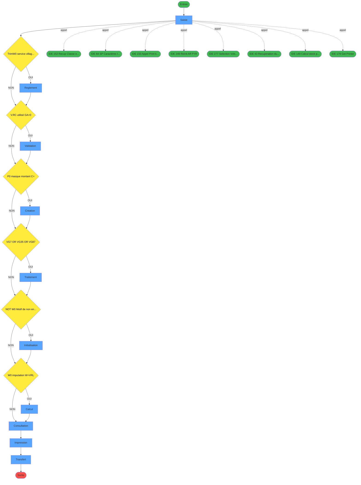
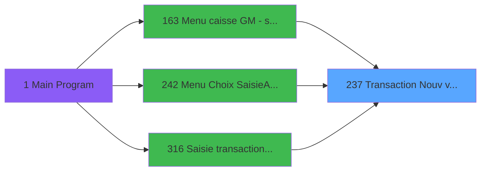
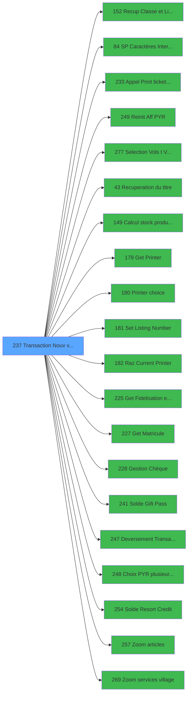

# ADH IDE 237 - Transaction Nouv vente avec GP

> **Analyse**: Phases 1-4 2026-01-30 21:50 -> 21:50 (12s) | Assemblage 21:50
> **Pipeline**: V7.2 Enrichi
> **Structure**: 4 onglets (Resume | Ecrans | Donnees | Connexions)

<!-- TAB:Resume -->

## 1. FICHE D'IDENTITE

| Attribut | Valeur |
|----------|--------|
| Projet | ADH |
| IDE Position | 237 |
| Nom Programme | Transaction Nouv vente avec GP |
| Fichier source | `Prg_237.xml` |
| Domaine metier | Ventes |
| Taches | 49 (14 ecrans visibles) |
| Tables modifiees | 9 |
| Programmes appeles | 20 |

## 2. DESCRIPTION FONCTIONNELLE

**Transaction Nouv vente avec GP** assure la gestion complete de ce processus, accessible depuis [Menu caisse GM - scroll (IDE 163)](ADH-IDE-163.md), [Menu Choix Saisie/Annul vente (IDE 242)](ADH-IDE-242.md), [Saisie transaction Nouv vente (IDE 316)](ADH-IDE-316.md).

Le flux de traitement s'organise en **10 blocs fonctionnels** :

- **Traitement** (18 taches) : traitements metier divers
- **Saisie** (7 taches) : ecrans de saisie utilisateur (formulaires, champs, donnees)
- **Calcul** (5 taches) : calculs de montants, stocks ou compteurs
- **Creation** (5 taches) : insertion d'enregistrements en base (mouvements, prestations)
- **Transfert** (4 taches) : transferts de donnees entre modules ou deversements
- **Reglement** (4 taches) : gestion des moyens de paiement et reglements
- **Initialisation** (3 taches) : reinitialisation d'etats et de variables de travail
- **Validation** (1 tache) : controles et verifications de coherence
- **Impression** (1 tache) : generation de tickets et documents
- **Consultation** (1 tache) : ecrans de recherche, selection et consultation

**Donnees modifiees** : 9 tables en ecriture (reseau_cloture___rec, prestations, mvt_prestation___mpr, compte_gm________cgm, compteurs________cpt, tempo_ecran_police, stat_lieu_vente_date, Boo_ResultsRechercheHoraire, Table_1037).

**Logique metier** : 17 regles identifiees couvrant conditions metier, calculs avec pourcentages, positionnement dynamique d'UI, valeurs par defaut.

Detail : phases du traitement

#### Phase 1 : Saisie (7 taches)

- **T1** - Saisie transaction **[ECRAN]**
- **T7** - Saisie Bilaterale **[ECRAN]**
- **T8** - Saisie mode de règlement **[ECRAN]**
- **T10** - Saisie Commentaires **[ECRAN]**
- **T11** - VRL : Saisie identité **[ECRAN]**
- **T19** - Saisie dates forfait **[ECRAN]**
- **T30** - Affiche saisie **[ECRAN]**

Delegue a : [Appel Print ticket vente PMS28 (IDE 233)](ADH-IDE-233.md), [Deversement Transaction (IDE 247)](ADH-IDE-247.md)

#### Phase 2 : Reglement (4 taches)

- **T2** - Reglements suite a refus TPE **[ECRAN]**
- **T5** - Verif reglement tpe
- **T28** - Creation reglement
- **T34** - Changement MOP multi paiement

Delegue a : [Recup Classe et Lib du MOP (IDE 152)](ADH-IDE-152.md), [Gestion Chèque (IDE 228)](ADH-IDE-228.md)

#### Phase 3 : Validation (1 tache)

- **T3** - verif reg restant

Delegue a : [    SP Caractères Interdits (IDE 84)](ADH-IDE-84.md)

#### Phase 4 : Creation (5 taches)

- **T4** - creation règlement
- **T22** - Creation prestation
- **T27** - Creation Tempo
- **T29** - Creation
- **T47** - Creation_heure_liberation

#### Phase 5 : Traitement (18 taches)

- **T6** - Dé-Affecition
- **T12** - Test si cloture en cours
- **T13** - Blocage cloture v1
- **T14** - Blocage cloture v1
- **T16** - Test reseau
- **T17** - Forfait
- **T18** - (sans nom) **[ECRAN]**
- **T20** - Effacement forfait
- **T21** - Effacement mvt forfait
- **T23** - Deblocage cloture v1
- **T24** - Deblocage cloture
- **T25** - Gratuite ?
- **T31** - garantie?
- **T41** - Supprime enregs non affectés
- **T44** - Affectation Auto
- **T45** - MaJ Num Chèque
- **T46** - Libération du logement **[ECRAN]**
- **T49** - Récup nb chambre /LCO **[ECRAN]**

Delegue a : [    SP Caractères Interdits (IDE 84)](ADH-IDE-84.md), [Recuperation du titre (IDE 43)](ADH-IDE-43.md), [Set Listing Number (IDE 181)](ADH-IDE-181.md), [Get Fidelisation et Remise (IDE 225)](ADH-IDE-225.md), [Get Matricule (IDE 227)](ADH-IDE-227.md), [Gestion Chèque (IDE 228)](ADH-IDE-228.md), [Solde Gift Pass (IDE 241)](ADH-IDE-241.md), [Solde Resort Credit (IDE 254)](ADH-IDE-254.md)

#### Phase 6 : Initialisation (3 taches)

- **T9** - RAZ 269
- **T32** - RAZ 269
- **T48** - RAZ LCO liberation

Delegue a : [Reinit Aff PYR (IDE 249)](ADH-IDE-249.md)

#### Phase 7 : Calcul (5 taches)

- **T15** - Reaffichage infos compte
- **T35** - calcul nombre carte
- **T37** - Compte Enregs affectés
- **T42** - Compte Enregs affectés
- **T43** - Compte Enregs affectés

Delegue a : [Calcul stock produit WS (IDE 149)](ADH-IDE-149.md), [Solde Gift Pass (IDE 241)](ADH-IDE-241.md), [Solde Resort Credit (IDE 254)](ADH-IDE-254.md)

#### Phase 8 : Consultation (1 tache)

- **T26** - Recherche imputation/ssimput

Delegue a : [Recup Classe et Lib du MOP (IDE 152)](ADH-IDE-152.md), [Selection Vols /t Ville à côté (IDE 277)](ADH-IDE-277.md), [Recuperation du titre (IDE 43)](ADH-IDE-43.md), [Get Fidelisation et Remise (IDE 225)](ADH-IDE-225.md), [Get Matricule (IDE 227)](ADH-IDE-227.md), [Choix PYR (plusieurs chambres) (IDE 248)](ADH-IDE-248.md), [Zoom articles (IDE 257)](ADH-IDE-257.md), [Zoom services village (IDE 269)](ADH-IDE-269.md)

#### Phase 9 : Impression (1 tache)

- **T33** - Increment Num. Ticket(VRL/VSL)

Delegue a : [Appel Print ticket vente PMS28 (IDE 233)](ADH-IDE-233.md), [Get Printer (IDE 179)](ADH-IDE-179.md), [Printer choice (IDE 180)](ADH-IDE-180.md), [Set Listing Number (IDE 181)](ADH-IDE-181.md), [Raz Current Printer (IDE 182)](ADH-IDE-182.md)

#### Phase 10 : Transfert (4 taches)

- **T36** - Raz Affectation Transfert
- **T38** - Type transfert **[ECRAN]**
- **T39** - Affiche Transfert A/R **[ECRAN]**
- **T40** - Affectation PAX / Transfert **[ECRAN]**

Delegue a : [Deversement Transaction (IDE 247)](ADH-IDE-247.md)

#### Tables impactees

| Table | Operations | Role metier |
|-------|-----------|-------------|
| stat_lieu_vente_date | **W**/L (13 usages) | Statistiques point de vente |
| Boo_ResultsRechercheHoraire | R/**W** (8 usages) | Index de recherche |
| tempo_ecran_police | R/**W**/L (7 usages) | Table temporaire ecran |
| reseau_cloture___rec | R/**W** (5 usages) | Donnees reseau/cloture |
| Table_1037 | **W** (3 usages) |  |
| prestations | R/**W** (3 usages) | Prestations/services vendus |
| compte_gm________cgm | **W** (2 usages) | Comptes GM (generaux) |
| mvt_prestation___mpr | **W**/L (2 usages) | Prestations/services vendus |
| compteurs________cpt | **W** (1 usages) | Comptes GM (generaux) |

## 3. BLOCS FONCTIONNELS

### 3.1 Saisie (7 taches)

L'operateur saisit les donnees de la transaction via 7 ecrans (Saisie transaction, Saisie Bilaterale, Saisie mode de règlement, Saisie Commentaires, VRL : Saisie identité, Saisie dates forfait, Affiche saisie).

---

#### T1 - Saisie transaction [ECRAN]

**Role** : Tache d'orchestration : point d'entree du programme (7 sous-taches). Coordonne l'enchainement des traitements.
**Ecran** : 1112 x 279 DLU (Modal) | [Voir mockup](#ecran-t1)

6 sous-taches directes

| Tache | Nom | Bloc |
|-------|-----|------|
| [T7](#t7) | Saisie Bilaterale **[ECRAN]** | Saisie |
| [T8](#t8) | Saisie mode de règlement **[ECRAN]** | Saisie |
| [T10](#t10) | Saisie Commentaires **[ECRAN]** | Saisie |
| [T11](#t11) | VRL : Saisie identité **[ECRAN]** | Saisie |
| [T19](#t19) | Saisie dates forfait **[ECRAN]** | Saisie |
| [T30](#t30) | Affiche saisie **[ECRAN]** | Saisie |

**Variables liees** : R (W0 FIN SAISIE OD), CC (W0 b.Saisie PAX), DZ (W0 Forcer Transaction Manuelle), EC (W0 Fin Transaction TPE), FC (V Nbre de Ligne Saisies)
**Delegue a** : [Appel Print ticket vente PMS28 (IDE 233)](ADH-IDE-233.md), [Deversement Transaction (IDE 247)](ADH-IDE-247.md)

---

#### T7 - Saisie Bilaterale [ECRAN]

**Role** : Saisie des donnees : Saisie Bilaterale.
**Ecran** : 326 x 249 DLU (Type6) | [Voir mockup](#ecran-t7)
**Variables liees** : R (W0 FIN SAISIE OD), CC (W0 b.Saisie PAX), FC (V Nbre de Ligne Saisies), S (Bouton FIN SAISIE OD)
**Delegue a** : [Appel Print ticket vente PMS28 (IDE 233)](ADH-IDE-233.md), [Deversement Transaction (IDE 247)](ADH-IDE-247.md)

---

#### T8 - Saisie mode de règlement [ECRAN]

**Role** : Saisie des donnees : Saisie mode de règlement.
**Ecran** : 506 x 250 DLU (Type6) | [Voir mockup](#ecran-t8)
**Variables liees** : R (W0 FIN SAISIE OD), CC (W0 b.Saisie PAX), DG (W0 mode de paiement), FB (v Réponse mode paiement), FC (V Nbre de Ligne Saisies)
**Delegue a** : [Appel Print ticket vente PMS28 (IDE 233)](ADH-IDE-233.md), [Deversement Transaction (IDE 247)](ADH-IDE-247.md)

---

#### T10 - Saisie Commentaires [ECRAN]

**Role** : Saisie des donnees : Saisie Commentaires.
**Ecran** : 772 x 169 DLU (Type6) | [Voir mockup](#ecran-t10)
**Variables liees** : R (W0 FIN SAISIE OD), CC (W0 b.Saisie PAX), FC (V Nbre de Ligne Saisies), S (Bouton FIN SAISIE OD)
**Delegue a** : [Appel Print ticket vente PMS28 (IDE 233)](ADH-IDE-233.md), [Deversement Transaction (IDE 247)](ADH-IDE-247.md)

---

#### T11 - VRL : Saisie identité [ECRAN]

**Role** : Saisie des donnees : VRL : Saisie identité.
**Ecran** : 699 x 157 DLU (MDI) | [Voir mockup](#ecran-t11)
**Variables liees** : R (W0 FIN SAISIE OD), CC (W0 b.Saisie PAX), FC (V Nbre de Ligne Saisies), S (Bouton FIN SAISIE OD)
**Delegue a** : [Appel Print ticket vente PMS28 (IDE 233)](ADH-IDE-233.md), [Deversement Transaction (IDE 247)](ADH-IDE-247.md)

---

#### T19 - Saisie dates forfait [ECRAN]

**Role** : Saisie des donnees : Saisie dates forfait.
**Ecran** : 528 x 121 DLU (MDI) | [Voir mockup](#ecran-t19)
**Variables liees** : R (W0 FIN SAISIE OD), CC (W0 b.Saisie PAX), DP (W0 forfait (O/N)), DR (W0 forfait date(O/N)), DS (W0 code forfait)
**Delegue a** : [Appel Print ticket vente PMS28 (IDE 233)](ADH-IDE-233.md), [Deversement Transaction (IDE 247)](ADH-IDE-247.md)

---

#### T30 - Affiche saisie [ECRAN]

**Role** : Saisie des donnees : Affiche saisie.
**Ecran** : 427 x 124 DLU (Modal) | [Voir mockup](#ecran-t30)
**Variables liees** : R (W0 FIN SAISIE OD), CC (W0 b.Saisie PAX), FC (V Nbre de Ligne Saisies), S (Bouton FIN SAISIE OD)
**Delegue a** : [Appel Print ticket vente PMS28 (IDE 233)](ADH-IDE-233.md), [Deversement Transaction (IDE 247)](ADH-IDE-247.md)

### 3.2 Reglement (4 taches)

Gestion des moyens de paiement : 4 taches de reglement.

---

#### T2 - Reglements suite a refus TPE [ECRAN]

**Role** : Gestion du reglement : Reglements suite a refus TPE.
**Ecran** : 708 x 256 DLU (Type6) | [Voir mockup](#ecran-t2)
**Delegue a** : [Recup Classe et Lib du MOP (IDE 152)](ADH-IDE-152.md)

---

#### T5 - Verif reglement tpe

**Role** : Gestion du reglement : Verif reglement tpe.
**Variables liees** : ET (V.Reglement premier article), FD (v Nbre ligne de reglement Saisi), FF (V.Total reglement ligne), FG (V.Multi reglement ligne)
**Delegue a** : [Recup Classe et Lib du MOP (IDE 152)](ADH-IDE-152.md)

---

#### T28 - Creation reglement

**Role** : Gestion du reglement : Creation reglement.
**Variables liees** : ET (V.Reglement premier article), FD (v Nbre ligne de reglement Saisi), FF (V.Total reglement ligne), FG (V.Multi reglement ligne)
**Delegue a** : [Recup Classe et Lib du MOP (IDE 152)](ADH-IDE-152.md)

---

#### T34 - Changement MOP multi paiement

**Role** : Gestion du reglement : Changement MOP multi paiement.
**Variables liees** : DG (W0 mode de paiement), FB (v Réponse mode paiement), FG (V.Multi reglement ligne), DH (Existe mode de paiement)
**Delegue a** : [Recup Classe et Lib du MOP (IDE 152)](ADH-IDE-152.md)

### 3.3 Validation (1 tache)

Controles de coherence : 1 tache verifie les donnees et conditions.

---

#### T3 - verif reg restant

**Role** : Verification : verif reg restant.

### 3.4 Creation (5 taches)

Insertion de nouveaux enregistrements en base.

---

#### T4 - creation règlement

**Role** : Creation d'enregistrement : creation règlement.

---

#### T22 - Creation prestation

**Role** : Creation d'enregistrement : Creation prestation.

---

#### T27 - Creation Tempo

**Role** : Creation d'enregistrement : Creation Tempo.

---

#### T29 - Creation

**Role** : Creation d'enregistrement : Creation.

---

#### T47 - Creation_heure_liberation

**Role** : Creation d'enregistrement : Creation_heure_liberation.

### 3.5 Traitement (18 taches)

Traitements internes.

---

#### T6 - Dé-Affecition

**Role** : Traitement : Dé-Affecition.

---

#### T12 - Test si cloture en cours

**Role** : Verification : Test si cloture en cours.
**Variables liees** : T (W0 Cloture en cours)

---

#### T13 - Blocage cloture v1

**Role** : Traitement : Blocage cloture v1.
**Variables liees** : T (W0 Cloture en cours)

---

#### T14 - Blocage cloture v1

**Role** : Traitement : Blocage cloture v1.
**Variables liees** : T (W0 Cloture en cours)

---

#### T16 - Test reseau

**Role** : Verification : Test reseau.
**Variables liees** : DN (W0 reseau)

---

#### T17 - Forfait

**Role** : Traitement : Forfait.
**Variables liees** : DP (W0 forfait (O/N)), DR (W0 forfait date(O/N)), DS (W0 code forfait)

---

#### T18 - (sans nom) [ECRAN]

**Role** : Traitement interne.
**Ecran** : 116 x 32 DLU (Modal) | [Voir mockup](#ecran-t18)

---

#### T20 - Effacement forfait

**Role** : Traitement : Effacement forfait.
**Variables liees** : DP (W0 forfait (O/N)), DQ (W0 effacement (O/N)), DR (W0 forfait date(O/N)), DS (W0 code forfait)

---

#### T21 - Effacement mvt forfait

**Role** : Traitement : Effacement mvt forfait.
**Variables liees** : DP (W0 forfait (O/N)), DQ (W0 effacement (O/N)), DR (W0 forfait date(O/N)), DS (W0 code forfait)

---

#### T23 - Deblocage cloture v1

**Role** : Traitement : Deblocage cloture v1.
**Variables liees** : T (W0 Cloture en cours)

---

#### T24 - Deblocage cloture

**Role** : Traitement : Deblocage cloture.
**Variables liees** : T (W0 Cloture en cours)

---

#### T25 - Gratuite ?

**Role** : Traitement : Gratuite ?.
**Variables liees** : DV (W0 gratuite ?)

---

#### T31 - garantie?

**Role** : Traitement : garantie?.

---

#### T41 - Supprime enregs non affectés

**Role** : Traitement : Supprime enregs non affectés.

---

#### T44 - Affectation Auto

**Role** : Traitement : Affectation Auto.
**Variables liees** : FK (V.Num Autorisation)

---

#### T45 - MaJ Num Chèque

**Role** : Traitement : MaJ Num Chèque.

---

#### T46 - Libération du logement [ECRAN]

**Role** : Traitement : Libération du logement.
**Ecran** : 123 x 149 DLU | [Voir mockup](#ecran-t46)
**Variables liees** : EO (W0 Lien Logement Lieu Séjour), GF (v.Flag abandon libération)

---

#### T49 - Récup nb chambre /LCO [ECRAN]

**Role** : Traitement : Récup nb chambre /LCO.
**Ecran** : 123 x 89 DLU | [Voir mockup](#ecran-t49)
**Variables liees** : BF (W0 Categorie de chambre), CW (W0 Nb Chambres), CX (W0 Chambre), CZ (W0 Lib Bouton Chambre), GD (v.Nb chambres /LCO)

### 3.6 Initialisation (3 taches)

Reinitialisation d'etats et variables de travail.

---

#### T9 - RAZ 269

**Role** : Reinitialisation : RAZ 269.
**Delegue a** : [Reinit Aff PYR (IDE 249)](ADH-IDE-249.md)

---

#### T32 - RAZ 269

**Role** : Reinitialisation : RAZ 269.
**Delegue a** : [Reinit Aff PYR (IDE 249)](ADH-IDE-249.md)

---

#### T48 - RAZ LCO liberation

**Role** : Reinitialisation : RAZ LCO liberation.
**Delegue a** : [Reinit Aff PYR (IDE 249)](ADH-IDE-249.md)

### 3.7 Calcul (5 taches)

Calculs metier : montants, stocks, compteurs.

---

#### T15 - Reaffichage infos compte

**Role** : Reinitialisation : Reaffichage infos compte.
**Variables liees** : D (P0 solde compte), H (P0 etat compte), EH (W0 Compte garanti)
**Delegue a** : [Calcul stock produit WS (IDE 149)](ADH-IDE-149.md)

---

#### T35 - calcul nombre carte

**Role** : Calcul : calcul nombre carte.
**Variables liees** : FN (V.Total carte), FP (V.Nombre de carte)
**Delegue a** : [Calcul stock produit WS (IDE 149)](ADH-IDE-149.md)

---

#### T37 - Compte Enregs affectés

**Role** : Traitement : Compte Enregs affectés.
**Variables liees** : D (P0 solde compte), H (P0 etat compte), EH (W0 Compte garanti)
**Delegue a** : [Calcul stock produit WS (IDE 149)](ADH-IDE-149.md)

---

#### T42 - Compte Enregs affectés

**Role** : Traitement : Compte Enregs affectés.
**Variables liees** : D (P0 solde compte), H (P0 etat compte), EH (W0 Compte garanti)
**Delegue a** : [Calcul stock produit WS (IDE 149)](ADH-IDE-149.md)

---

#### T43 - Compte Enregs affectés

**Role** : Traitement : Compte Enregs affectés.
**Variables liees** : D (P0 solde compte), H (P0 etat compte), EH (W0 Compte garanti)
**Delegue a** : [Calcul stock produit WS (IDE 149)](ADH-IDE-149.md)

### 3.8 Consultation (1 tache)

Ecrans de recherche et consultation.

---

#### T26 - Recherche imputation/ssimput

**Role** : Traitement : Recherche imputation/ssimput.
**Delegue a** : [Selection Vols /t Ville à côté (IDE 277)](ADH-IDE-277.md), [Choix PYR (plusieurs chambres) (IDE 248)](ADH-IDE-248.md), [Zoom articles (IDE 257)](ADH-IDE-257.md)

### 3.9 Impression (1 tache)

Generation des documents et tickets.

---

#### T33 - Increment Num. Ticket(VRL/VSL)

**Role** : Generation du document : Increment Num. Ticket(VRL/VSL).
**Variables liees** : EX (v.IncrémentTicket(VRL/VSL) OK), EZ (v.NumeroTicket(VRL/VSL))
**Delegue a** : [Get Printer (IDE 179)](ADH-IDE-179.md), [Printer choice (IDE 180)](ADH-IDE-180.md), [Raz Current Printer (IDE 182)](ADH-IDE-182.md)

### 3.10 Transfert (4 taches)

Transfert de donnees entre modules.

---

#### T36 - Raz Affectation Transfert

**Role** : Reinitialisation : Raz Affectation Transfert.
**Variables liees** : BM (W0 Sens du transfert Aller), BN (W0 Date du transfert Aller), BO (W0 Heure du transfert Aller), BP (W0 b.Date du transfert), BV (W0 Sens du transfert Retour)

---

#### T38 - Type transfert [ECRAN]

**Role** : Transfert de donnees : Type transfert.
**Ecran** : 722 x 292 DLU (Type6) | [Voir mockup](#ecran-t38)
**Variables liees** : BM (W0 Sens du transfert Aller), BN (W0 Date du transfert Aller), BO (W0 Heure du transfert Aller), BP (W0 b.Date du transfert), BQ (W0 Type d'endroit Aller)

---

#### T39 - Affiche Transfert A/R [ECRAN]

**Role** : Reinitialisation : Affiche Transfert A/R.
**Ecran** : 681 x 205 DLU (Type6) | [Voir mockup](#ecran-t39)
**Variables liees** : BM (W0 Sens du transfert Aller), BN (W0 Date du transfert Aller), BO (W0 Heure du transfert Aller), BP (W0 b.Date du transfert), BV (W0 Sens du transfert Retour)

---

#### T40 - Affectation PAX / Transfert [ECRAN]

**Role** : Transfert de donnees : Affectation PAX / Transfert.
**Ecran** : 1056 x 281 DLU | [Voir mockup](#ecran-t40)
**Variables liees** : BM (W0 Sens du transfert Aller), BN (W0 Date du transfert Aller), BO (W0 Heure du transfert Aller), BP (W0 b.Date du transfert), BV (W0 Sens du transfert Retour)

## 5. REGLES METIER

17 regles identifiees:

### Saisie (13 regles)

#### [RM-001] Determine le sens du trajet selon le service village (1=ALLER, 2=RETOUR, 3=A/R)

| Element | Detail |
|---------|--------|
| **Condition** | `Trim(W0 service village [BA])='1'` |
| **Si vrai** | 'ALLER' |
| **Si faux** | IF(Trim(W0 service village [BA])='2','RETOUR',IF(Trim(W0 service village [BA])='3','ALLER/RETOUR',''))) |
| **Variables** | BA (W0 service village) |
| **Expression source** | Expression 2 : `IF(Trim(W0 service village [BA])='1','ALLER',IF(Trim(W0 serv` |
| **Exemple** | Si Trim(W0 service village [BA])='1' → 'ALLER' |
| **Impact** | Bloc Saisie |

#### [RM-002] Si V.RC utilisé [GA] est nul, choix conditionnel selon W0 imputation [W] (valeur 'VSL')

| Element | Detail |
|---------|--------|
| **Condition** | `V.RC utilisé [GA]=0` |
| **Si vrai** | IF(W0 imputation [W]='VSL' |
| **Si faux** | P0.Date debut sejour [M],Date()),W0 Num rue [CR]) |
| **Variables** | M (P0.Date debut sejour), W (W0 imputation), CR (W0 Num rue), GA (V.RC utilisé) |
| **Expression source** | Expression 5 : `IF(V.RC utilisé [GA]=0,IF(W0 imputation [W]='VSL',P0.Date de` |
| **Exemple** | Si V.RC utilisé [GA]=0 → IF(W0 imputation [W]='VSL'. Sinon → P0.Date debut sejour [M],Date()),W0 Num rue [CR]) |
| **Impact** | Bloc Saisie |

#### [RM-005] Si W0 Motif de non enreg NA [CL] est FAUX, branche alternative

| Element | Detail |
|---------|--------|
| **Condition** | `NOT W0 Motif de non enreg NA [CL]` |
| **Si vrai** | W0.Date fin sejour [CK] |
| **Si faux** | W0 Titre [CO]) |
| **Variables** | CK (W0.Date fin sejour), CL (W0 Motif de non enreg NA), CO (W0 Titre) |
| **Expression source** | Expression 94 : `IF(NOT W0 Motif de non enreg NA [CL],W0.Date fin sejour [CK]` |
| **Exemple** | Si NOT W0 Motif de non enreg NA [CL] → W0.Date fin sejour [CK]. Sinon → W0 Titre [CO]) |
| **Impact** | Bloc Saisie |

#### [RM-006] Si W0 imputation [W] vaut 'VRL' alors 'Date consommation', sinon 'Date début séjour'

| Element | Detail |
|---------|--------|
| **Condition** | `W0 imputation [W]='VRL'` |
| **Si vrai** | 'Date consommation' |
| **Si faux** | 'Date début séjour') |
| **Variables** | W (W0 imputation) |
| **Expression source** | Expression 111 : `IF(W0 imputation [W]='VRL','Date consommation','Date début s` |
| **Exemple** | Si W0 imputation [W]='VRL' → 'Date consommation'. Sinon → 'Date début séjour') |
| **Impact** | Bloc Saisie |

#### [RM-007] Calcul de pourcentage avec arrondi

| Element | Detail |
|---------|--------|
| **Condition** | `W0 Titre [CO]<>0 AND NOT(W0 Motif de non enreg NA [CL])` |
| **Si vrai** | Fix(W0 Motif annulation [CN]*W0 Titre [CO]/100 |
| **Si faux** | 11,P0.Nb decimales [O]),W0 Prenom [CQ]) |
| **Variables** | O (P0.Nb decimales), CL (W0 Motif de non enreg NA), CN (W0 Motif annulation), CO (W0 Titre), CQ (W0 Prenom) |
| **Expression source** | Expression 114 : `IF(W0 Titre [CO]<>0 AND NOT(W0 Motif de non enreg NA [CL]),F` |
| **Exemple** | Si W0 Titre [CO]<>0 AND NOT(W0 Motif de non enreg NA [CL]) → Fix(W0 Motif annulation [CN]*W0 Titre [CO]/100. Sinon → 11,P0.Nb decimales [O]),W0 Prenom [CQ]) |
| **Impact** | Bloc Saisie |

#### [RM-008] Comportement conditionnel selon type d'imputation 'VRL'

| Element | Detail |
|---------|--------|
| **Condition** | `W0 imputation [W]='VRL' OR W0 imputation [W]='VSL'` |
| **Si vrai** | 'Nb forfait' |
| **Si faux** | IF(W0 imputation [W]='TRF', 'Nb PAX','Nbre')) |
| **Variables** | W (W0 imputation) |
| **Expression source** | Expression 120 : `IF(W0 imputation [W]='VRL' OR W0 imputation [W]='VSL','Nb fo` |
| **Exemple** | Si W0 imputation [W]='VRL' OR W0 imputation [W]='VSL' → 'Nb forfait'. Sinon → IF(W0 imputation [W]='TRF', 'Nb PAX','Nbre')) |
| **Impact** | [T17 - Forfait](#t17) |

#### [RM-009] Position UI conditionnelle selon W0 imputation [W]

| Element | Detail |
|---------|--------|
| **Condition** | `IN (W0 imputation [W]` |
| **Si vrai** | 'VRL' |
| **Si faux** | 'VSL','TRF','PYR'),31.125,14.875) |
| **Variables** | W (W0 imputation) |
| **Expression source** | Expression 125 : `IF(IN (W0 imputation [W],'VRL','VSL','TRF','PYR'),31.125,14.` |
| **Exemple** | Si IN (W0 imputation [W] → 'VRL'. Sinon → 'VSL','TRF','PYR'),31.125,14.875) |
| **Impact** | Bloc Saisie |

#### [RM-010] Comportement conditionnel selon type d'imputation 'TRF'

| Element | Detail |
|---------|--------|
| **Condition** | `W0 imputation [W]='TRF'` |
| **Si vrai** | 31.750 |
| **Si faux** | 40.125) |
| **Variables** | W (W0 imputation) |
| **Expression source** | Expression 131 : `IF(W0 imputation [W]='TRF',31.750,40.125)` |
| **Exemple** | Si W0 imputation [W]='TRF' → 31.750. Sinon → 40.125) |
| **Impact** | Bloc Saisie |

#### [RM-011] Traitement si W0 Chambre [CX] est renseigne

| Element | Detail |
|---------|--------|
| **Condition** | `W0 Chambre [CX]<>''` |
| **Si vrai** | RTrim (W0 Nb Chambres [CW])&Fill (' ' |
| **Si faux** | Len (RTrim (W0 Nb Chambres [CW]))-1)&RTrim (W0 Chambre [CX])&' '&W0 PYR Valide [CY],Trim(P0 Nom & prenom [K])) |
| **Variables** | K (P0 Nom & prenom), CW (W0 Nb Chambres), CX (W0 Chambre), CY (W0 PYR Valide) |
| **Expression source** | Expression 147 : `IF(W0 Chambre [CX]<>'',RTrim (W0 Nb Chambres [CW])&Fill (' '` |
| **Exemple** | Si W0 Chambre [CX]<>'' → RTrim (W0 Nb Chambres [CW])&Fill (' ' |
| **Impact** | Bloc Saisie |

#### [RM-012] Si V.Total reglement ligne [FF] alors V.Id transaction PMS [FI] sinon VG18)

| Element | Detail |
|---------|--------|
| **Condition** | `V.Total reglement ligne [FF]` |
| **Si vrai** | V.Id transaction PMS [FI] |
| **Si faux** | VG18) |
| **Variables** | FF (V.Total reglement ligne), FI (V.Id transaction PMS) |
| **Expression source** | Expression 154 : `IF(V.Total reglement ligne [FF],V.Id transaction PMS [FI],VG` |
| **Exemple** | Si V.Total reglement ligne [FF] → V.Id transaction PMS [FI]. Sinon → VG18) |
| **Impact** | Bloc Saisie |

#### [RM-014] Si NOT(CHG_PRV_W0 nbre articles [GO]) alors 132.875 sinon 105.875)

| Element | Detail |
|---------|--------|
| **Condition** | `NOT(CHG_PRV_W0 nbre articles [GO])` |
| **Si vrai** | 132.875 |
| **Si faux** | 105.875) |
| **Variables** | BD (W0 nbre articles), GO (CHG_PRV_W0 nbre articles) |
| **Expression source** | Expression 225 : `IF (NOT(CHG_PRV_W0 nbre articles [GO]),132.875,105.875)` |
| **Exemple** | Si NOT(CHG_PRV_W0 nbre articles [GO]) → 132.875. Sinon → 105.875) |
| **Impact** | Bloc Saisie |

#### [RM-015] Si W0 imputation [W] vaut 'ANN' alors 'O', sinon 'N'

| Element | Detail |
|---------|--------|
| **Condition** | `W0 imputation [W]='ANN'` |
| **Si vrai** | 'O' |
| **Si faux** | 'N') |
| **Variables** | W (W0 imputation) |
| **Expression source** | Expression 236 : `IF(W0 imputation [W]='ANN','O','N')` |
| **Exemple** | Si W0 imputation [W]='ANN' → 'O'. Sinon → 'N') |
| **Impact** | Bloc Saisie |

#### [RM-016] Comportement conditionnel selon type d'imputation 'PYR'

| Element | Detail |
|---------|--------|
| **Condition** | `W0 imputation [W]='PYR'` |
| **Si vrai** | NOT(W0 mode de paiement [DG]) |
| **Si faux** | 'FALSE'LOG) |
| **Variables** | W (W0 imputation), DG (W0 mode de paiement) |
| **Expression source** | Expression 272 : `IF(W0 imputation [W]='PYR',NOT(W0 mode de paiement [DG]),'FA` |
| **Exemple** | Si W0 imputation [W]='PYR' → NOT(W0 mode de paiement [DG]). Sinon → 'FALSE'LOG) |
| **Impact** | Bloc Saisie |

### Reglement (2 regles)

#### [RM-003] Valeur par defaut si P0 masque montant [C] est vide

| Element | Detail |
|---------|--------|
| **Condition** | `P0 masque montant [C]=''` |
| **Si vrai** | '15.2' |
| **Si faux** | P0 masque montant [C]) |
| **Variables** | C (P0 masque montant) |
| **Expression source** | Expression 35 : `IF (P0 masque montant [C]='','15.2',P0 masque montant [C])` |
| **Exemple** | Si P0 masque montant [C]='' → '15.2'. Sinon → P0 masque montant [C]) |
| **Impact** | Bloc Reglement |

#### [RM-004] Si VG7 OR VG35 OR VG87 alors 'P0 masque montant [C]'FORM sinon 'P0 devise locale [B]'FORM)

| Element | Detail |
|---------|--------|
| **Condition** | `VG7 OR VG35 OR VG87` |
| **Si vrai** | 'P0 masque montant [C]'FORM |
| **Si faux** | 'P0 devise locale [B]'FORM) |
| **Variables** | B (P0 devise locale), C (P0 masque montant) |
| **Expression source** | Expression 92 : `IF(VG7 OR VG35 OR VG87,'P0 masque montant [C]'FORM,'P0 devis` |
| **Exemple** | Si VG7 OR VG35 OR VG87 → 'P0 masque montant [C]'FORM. Sinon → 'P0 devise locale [B]'FORM) |
| **Impact** | Bloc Reglement |

### Autres (2 regles)

#### [RM-013] Si V.ConfirmeUseGP? [FZ] alors 'V' sinon IF([AP]='O','C','D'))

| Element | Detail |
|---------|--------|
| **Condition** | `V.ConfirmeUseGP? [FZ]` |
| **Si vrai** | 'V' |
| **Si faux** | IF([AP]='O','C','D')) |
| **Variables** | FZ (V.ConfirmeUseGP?) |
| **Expression source** | Expression 167 : `IF(V.ConfirmeUseGP? [FZ],'V',IF([AP]='O','C','D'))` |
| **Exemple** | Si V.ConfirmeUseGP? [FZ] → 'V'. Sinon → IF([AP]='O','C','D')) |

#### [RM-017] Si VG20>1 alors [AY] sinon 'G')

| Element | Detail |
|---------|--------|
| **Condition** | `VG20>1` |
| **Si vrai** | [AY] |
| **Si faux** | 'G') |
| **Expression source** | Expression 290 : `IF(VG20>1,[AY],'G')` |
| **Exemple** | Si VG20>1 → [AY]. Sinon → 'G') |

## 6. CONTEXTE

- **Appele par**: [Menu caisse GM - scroll (IDE 163)](ADH-IDE-163.md), [Menu Choix Saisie/Annul vente (IDE 242)](ADH-IDE-242.md), [Saisie transaction Nouv vente (IDE 316)](ADH-IDE-316.md)
- **Appelle**: 20 programmes | **Tables**: 30 (W:9 R:13 L:18) | **Taches**: 49 | **Expressions**: 305

<!-- TAB:Ecrans -->

## 8. ECRANS

### 8.1 Forms visibles (14 / 49)

| # | Position | Tache | Nom | Type | Largeur | Hauteur | Bloc |
|---|----------|-------|-----|------|---------|---------|------|
| 1 | 237.1 | T1 | Saisie transaction | Modal | 1112 | 279 | Saisie |
| 2 | 237.2 | T2 | Reglements suite a refus TPE | Type6 | 708 | 256 | Reglement |
| 3 | 237.3 | T7 | Saisie Bilaterale | Type6 | 326 | 249 | Saisie |
| 4 | 237.4 | T8 | Saisie mode de règlement | Type6 | 506 | 250 | Saisie |
| 5 | 237.5 | T10 | Saisie Commentaires | Type6 | 772 | 169 | Saisie |
| 6 | 237.6 | T11 | VRL : Saisie identité | MDI | 699 | 157 | Saisie |
| 7 | 237.7 | T18 | (sans nom) | Modal | 116 | 32 | Traitement |
| 8 | 237.8 | T19 | Saisie dates forfait | MDI | 528 | 121 | Saisie |
| 9 | 237.9 | T30 | Affiche saisie | Modal | 427 | 124 | Saisie |
| 10 | 237.10 | T38 | Type transfert | Type6 | 722 | 292 | Transfert |
| 11 | 237.11 | T39 | Affiche Transfert A/R | Type6 | 681 | 205 | Transfert |
| 12 | 237.12 | T40 | Affectation PAX / Transfert | Type0 | 1056 | 281 | Transfert |
| 13 | 237.13 | T46 | Libération du logement | Type0 | 123 | 149 | Traitement |
| 14 | 237.14 | T49 | Récup nb chambre /LCO | Type0 | 123 | 89 | Traitement |

### 8.2 Mockups Ecrans

---

#### 237.1 - Saisie transaction
**Tache** : [T1](#t1) | **Type** : Modal | **Dimensions** : 1112 x 279 DLU
**Bloc** : Saisie | **Titre IDE** : Saisie transaction

<!-- FORM-DATA:
{
    "width":  1112,
    "controls":  [
                     {
                         "w":  130,
                         "readonly":  true,
                         "y":  13,
                         "type":  "edit",
                         "x":  10,
                         "label":  "P0 societe",
                         "h":  20,
                         "var":  "A"
                     },
                     {
                         "w":  130,
                         "readonly":  true,
                         "y":  13,
                         "type":  "edit",
                         "x":  150,
                         "label":  "P0 devise locale",
                         "h":  20,
                         "var":  "B"
                     },
                     {
                         "w":  130,
                         "readonly":  true,
                         "y":  13,
                         "type":  "edit",
                         "x":  290,
                         "label":  "P0 masque montant",
                         "h":  20,
                         "var":  "C"
                     },
                     {
                         "w":  130,
                         "readonly":  true,
                         "y":  13,
                         "type":  "edit",
                         "x":  430,
                         "label":  "P0 solde compte",
                         "h":  20,
                         "var":  "D"
                     },
                     {
                         "w":  130,
                         "readonly":  true,
                         "y":  13,
                         "type":  "edit",
                         "x":  570,
                         "label":  "P0 code GM",
                         "h":  20,
                         "var":  "E"
                     },
                     {
                         "w":  130,
                         "readonly":  true,
                         "y":  43,
                         "type":  "edit",
                         "x":  10,
                         "label":  "P0 filiation",
                         "h":  20,
                         "var":  "F"
                     },
                     {
                         "w":  200,
                         "readonly":  false,
                         "y":  73,
                         "type":  "edit",
                         "x":  10,
                         "label":  "W0 FIN SAISIE OD",
                         "h":  20,
                         "var":  "R"
                     },
                     {
                         "w":  200,
                         "readonly":  false,
                         "y":  73,
                         "type":  "edit",
                         "x":  220,
                         "label":  "W0 code article",
                         "h":  20,
                         "var":  "U"
                     },
                     {
                         "w":  200,
                         "readonly":  false,
                         "y":  73,
                         "type":  "edit",
                         "x":  430,
                         "label":  "W0 imputation",
                         "h":  20,
                         "var":  "W"
                     },
                     {
                         "w":  200,
                         "readonly":  false,
                         "y":  103,
                         "type":  "edit",
                         "x":  10,
                         "label":  "W0 date d\u0027achat",
                         "h":  20,
                         "var":  "Y"
                     },
                     {
                         "w":  200,
                         "readonly":  false,
                         "y":  103,
                         "type":  "edit",
                         "x":  220,
                         "label":  "W0 service village",
                         "h":  20,
                         "var":  "BA"
                     },
                     {
                         "w":  200,
                         "readonly":  false,
                         "y":  103,
                         "type":  "edit",
                         "x":  430,
                         "label":  "W0 libelle article",
                         "h":  20,
                         "var":  "BB"
                     },
                     {
                         "w":  200,
                         "readonly":  false,
                         "y":  133,
                         "type":  "edit",
                         "x":  10,
                         "label":  "W0 article dernière minute",
                         "h":  20,
                         "var":  "BC"
                     },
                     {
                         "w":  200,
                         "readonly":  false,
                         "y":  133,
                         "type":  "edit",
                         "x":  220,
                         "label":  "W0 nbre articles",
                         "h":  20,
                         "var":  "BD"
                     },
                     {
                         "h":  25,
                         "label":  "IDENTITE",
                         "var":  "P",
                         "y":  200,
                         "type":  "button",
                         "x":  10,
                         "w":  80
                     },
                     {
                         "h":  25,
                         "label":  "ABANDON",
                         "var":  "Q",
                         "y":  200,
                         "type":  "button",
                         "x":  100,
                         "w":  80
                     },
                     {
                         "h":  25,
                         "label":  "FIN SAISIE OD",
                         "var":  "S",
                         "y":  200,
                         "type":  "button",
                         "x":  190,
                         "w":  80
                     },
                     {
                         "h":  25,
                         "label":  "Ok",
                         "var":  "EN",
                         "y":  200,
                         "type":  "button",
                         "x":  280,
                         "w":  80
                     }
                 ],
    "type":  "Modal",
    "height":  279,
    "taskId":  1
}
-->

**Champs :**

| Variable | Nom | Type | Saisie |
|----------|-----|------|--------|
| A | P0 societe | Alpha | Lecture |
| B | P0 devise locale | Alpha | Lecture |
| C | P0 masque montant | Alpha | Lecture |
| D | P0 solde compte | Numeric | Lecture |
| E | P0 code GM | Numeric | Lecture |
| F | P0 filiation | Numeric | Lecture |
| R | W0 FIN SAISIE OD | Logical | **Saisie** |
| U | W0 code article | Numeric | **Saisie** |
| W | W0 imputation | Numeric | **Saisie** |
| Y | W0 date d'achat | Date | **Saisie** |
| BA | W0 service village | Alpha | **Saisie** |
| BB | W0 libelle article | Alpha | **Saisie** |
| BC | W0 article dernière minute | Logical | **Saisie** |
| BD | W0 nbre articles | Numeric | **Saisie** |

**Boutons :**

| Bouton | Variable | Action |
|--------|----------|--------|
| IDENTITE | P | Identification du client |
| ABANDON | Q | Annule et retour au menu |
| FIN SAISIE OD | S | Termine la saisie en cours |
| Ok | EN | Valide la saisie et enregistre |

---

#### 237.2 - Reglements suite a refus TPE
**Tache** : [T2](#t2) | **Type** : Type6 | **Dimensions** : 708 x 256 DLU
**Bloc** : Reglement | **Titre IDE** : Reglements suite a refus TPE

<!-- FORM-DATA:
{
    "width":  708,
    "controls":  [
                     {
                         "w":  130,
                         "readonly":  true,
                         "y":  13,
                         "type":  "edit",
                         "x":  10,
                         "label":  "P0 societe",
                         "h":  20,
                         "var":  "A"
                     },
                     {
                         "w":  130,
                         "readonly":  true,
                         "y":  13,
                         "type":  "edit",
                         "x":  150,
                         "label":  "P0 devise locale",
                         "h":  20,
                         "var":  "B"
                     },
                     {
                         "w":  130,
                         "readonly":  true,
                         "y":  13,
                         "type":  "edit",
                         "x":  290,
                         "label":  "P0 masque montant",
                         "h":  20,
                         "var":  "C"
                     },
                     {
                         "w":  130,
                         "readonly":  true,
                         "y":  13,
                         "type":  "edit",
                         "x":  430,
                         "label":  "P0 solde compte",
                         "h":  20,
                         "var":  "D"
                     },
                     {
                         "w":  130,
                         "readonly":  true,
                         "y":  13,
                         "type":  "edit",
                         "x":  570,
                         "label":  "P0 code GM",
                         "h":  20,
                         "var":  "E"
                     },
                     {
                         "w":  130,
                         "readonly":  true,
                         "y":  43,
                         "type":  "edit",
                         "x":  10,
                         "label":  "P0 filiation",
                         "h":  20,
                         "var":  "F"
                     },
                     {
                         "w":  200,
                         "readonly":  false,
                         "y":  73,
                         "type":  "edit",
                         "x":  10,
                         "label":  "W0 montant avant reduction",
                         "h":  20,
                         "var":  "CF"
                     },
                     {
                         "w":  200,
                         "readonly":  false,
                         "y":  73,
                         "type":  "edit",
                         "x":  220,
                         "label":  "W0 Montant reduction",
                         "h":  20,
                         "var":  "CI"
                     },
                     {
                         "w":  200,
                         "readonly":  false,
                         "y":  73,
                         "type":  "edit",
                         "x":  430,
                         "label":  "W0 montant",
                         "h":  20,
                         "var":  "DF"
                     },
                     {
                         "w":  200,
                         "readonly":  false,
                         "y":  103,
                         "type":  "edit",
                         "x":  10,
                         "label":  "W0 mode de paiement",
                         "h":  20,
                         "var":  "DG"
                     },
                     {
                         "w":  200,
                         "readonly":  false,
                         "y":  103,
                         "type":  "edit",
                         "x":  220,
                         "label":  "W0 Libelle MOP",
                         "h":  20,
                         "var":  "DI"
                     },
                     {
                         "w":  200,
                         "readonly":  false,
                         "y":  103,
                         "type":  "edit",
                         "x":  430,
                         "label":  "W0 Code Devise",
                         "h":  20,
                         "var":  "DX"
                     },
                     {
                         "w":  200,
                         "readonly":  false,
                         "y":  133,
                         "type":  "edit",
                         "x":  10,
                         "label":  "W0 Total_Vente",
                         "h":  20,
                         "var":  "EE"
                     },
                     {
                         "w":  200,
                         "readonly":  false,
                         "y":  133,
                         "type":  "edit",
                         "x":  220,
                         "label":  "W0 Total_GiftPass",
                         "h":  20,
                         "var":  "EF"
                     },
                     {
                         "h":  25,
                         "label":  "IDENTITE",
                         "var":  "P",
                         "y":  200,
                         "type":  "button",
                         "x":  10,
                         "w":  80
                     },
                     {
                         "h":  25,
                         "label":  "ABANDON",
                         "var":  "Q",
                         "y":  200,
                         "type":  "button",
                         "x":  100,
                         "w":  80
                     },
                     {
                         "h":  25,
                         "label":  "FIN SAISIE OD",
                         "var":  "S",
                         "y":  200,
                         "type":  "button",
                         "x":  190,
                         "w":  80
                     },
                     {
                         "h":  25,
                         "label":  "Ok",
                         "var":  "EN",
                         "y":  200,
                         "type":  "button",
                         "x":  280,
                         "w":  80
                     }
                 ],
    "type":  "Type6",
    "height":  256,
    "taskId":  2
}
-->

**Champs :**

| Variable | Nom | Type | Saisie |
|----------|-----|------|--------|
| A | P0 societe | Alpha | Lecture |
| B | P0 devise locale | Alpha | Lecture |
| C | P0 masque montant | Alpha | Lecture |
| D | P0 solde compte | Numeric | Lecture |
| E | P0 code GM | Numeric | Lecture |
| F | P0 filiation | Numeric | Lecture |
| CF | W0 montant avant reduction | Numeric | **Saisie** |
| CI | W0 Montant reduction | Numeric | **Saisie** |
| DF | W0 montant | Numeric | **Saisie** |
| DG | W0 mode de paiement | Alpha | **Saisie** |
| DI | W0 Libelle MOP | Alpha | **Saisie** |
| DX | W0 Code Devise | Numeric | **Saisie** |
| EE | W0 Total_Vente | Numeric | **Saisie** |
| EF | W0 Total_GiftPass | Numeric | **Saisie** |

**Boutons :**

| Bouton | Variable | Action |
|--------|----------|--------|
| IDENTITE | P | Identification du client |
| ABANDON | Q | Annule et retour au menu |
| FIN SAISIE OD | S | Termine la saisie en cours |
| Ok | EN | Valide la saisie et enregistre |

---

#### 237.3 - Saisie Bilaterale
**Tache** : [T7](#t7) | **Type** : Type6 | **Dimensions** : 326 x 249 DLU
**Bloc** : Saisie | **Titre IDE** : Saisie Bilaterale

<!-- FORM-DATA:
{
    "width":  326,
    "controls":  [
                     {
                         "w":  130,
                         "readonly":  true,
                         "y":  13,
                         "type":  "edit",
                         "x":  10,
                         "label":  "P0 societe",
                         "h":  20,
                         "var":  "A"
                     },
                     {
                         "w":  130,
                         "readonly":  true,
                         "y":  13,
                         "type":  "edit",
                         "x":  150,
                         "label":  "P0 devise locale",
                         "h":  20,
                         "var":  "B"
                     },
                     {
                         "w":  130,
                         "readonly":  true,
                         "y":  13,
                         "type":  "edit",
                         "x":  290,
                         "label":  "P0 masque montant",
                         "h":  20,
                         "var":  "C"
                     },
                     {
                         "w":  130,
                         "readonly":  true,
                         "y":  13,
                         "type":  "edit",
                         "x":  430,
                         "label":  "P0 solde compte",
                         "h":  20,
                         "var":  "D"
                     },
                     {
                         "w":  130,
                         "readonly":  true,
                         "y":  13,
                         "type":  "edit",
                         "x":  570,
                         "label":  "P0 code GM",
                         "h":  20,
                         "var":  "E"
                     },
                     {
                         "w":  130,
                         "readonly":  true,
                         "y":  43,
                         "type":  "edit",
                         "x":  10,
                         "label":  "P0 filiation",
                         "h":  20,
                         "var":  "F"
                     },
                     {
                         "w":  200,
                         "readonly":  false,
                         "y":  73,
                         "type":  "edit",
                         "x":  10,
                         "label":  "W0 FIN SAISIE OD",
                         "h":  20,
                         "var":  "R"
                     },
                     {
                         "w":  200,
                         "readonly":  false,
                         "y":  73,
                         "type":  "edit",
                         "x":  220,
                         "label":  "W0 code article",
                         "h":  20,
                         "var":  "U"
                     },
                     {
                         "w":  200,
                         "readonly":  false,
                         "y":  73,
                         "type":  "edit",
                         "x":  430,
                         "label":  "W0 imputation",
                         "h":  20,
                         "var":  "W"
                     },
                     {
                         "w":  200,
                         "readonly":  false,
                         "y":  103,
                         "type":  "edit",
                         "x":  10,
                         "label":  "W0 date d\u0027achat",
                         "h":  20,
                         "var":  "Y"
                     },
                     {
                         "w":  200,
                         "readonly":  false,
                         "y":  103,
                         "type":  "edit",
                         "x":  220,
                         "label":  "W0 service village",
                         "h":  20,
                         "var":  "BA"
                     },
                     {
                         "w":  200,
                         "readonly":  false,
                         "y":  103,
                         "type":  "edit",
                         "x":  430,
                         "label":  "W0 libelle article",
                         "h":  20,
                         "var":  "BB"
                     },
                     {
                         "w":  200,
                         "readonly":  false,
                         "y":  133,
                         "type":  "edit",
                         "x":  10,
                         "label":  "W0 article dernière minute",
                         "h":  20,
                         "var":  "BC"
                     },
                     {
                         "w":  200,
                         "readonly":  false,
                         "y":  133,
                         "type":  "edit",
                         "x":  220,
                         "label":  "W0 nbre articles",
                         "h":  20,
                         "var":  "BD"
                     },
                     {
                         "h":  25,
                         "label":  "IDENTITE",
                         "var":  "P",
                         "y":  200,
                         "type":  "button",
                         "x":  10,
                         "w":  80
                     },
                     {
                         "h":  25,
                         "label":  "ABANDON",
                         "var":  "Q",
                         "y":  200,
                         "type":  "button",
                         "x":  100,
                         "w":  80
                     },
                     {
                         "h":  25,
                         "label":  "FIN SAISIE OD",
                         "var":  "S",
                         "y":  200,
                         "type":  "button",
                         "x":  190,
                         "w":  80
                     },
                     {
                         "h":  25,
                         "label":  "Ok",
                         "var":  "EN",
                         "y":  200,
                         "type":  "button",
                         "x":  280,
                         "w":  80
                     }
                 ],
    "type":  "Type6",
    "height":  249,
    "taskId":  7
}
-->

**Champs :**

| Variable | Nom | Type | Saisie |
|----------|-----|------|--------|
| A | P0 societe | Alpha | Lecture |
| B | P0 devise locale | Alpha | Lecture |
| C | P0 masque montant | Alpha | Lecture |
| D | P0 solde compte | Numeric | Lecture |
| E | P0 code GM | Numeric | Lecture |
| F | P0 filiation | Numeric | Lecture |
| R | W0 FIN SAISIE OD | Logical | **Saisie** |
| U | W0 code article | Numeric | **Saisie** |
| W | W0 imputation | Numeric | **Saisie** |
| Y | W0 date d'achat | Date | **Saisie** |
| BA | W0 service village | Alpha | **Saisie** |
| BB | W0 libelle article | Alpha | **Saisie** |
| BC | W0 article dernière minute | Logical | **Saisie** |
| BD | W0 nbre articles | Numeric | **Saisie** |

**Boutons :**

| Bouton | Variable | Action |
|--------|----------|--------|
| IDENTITE | P | Identification du client |
| ABANDON | Q | Annule et retour au menu |
| FIN SAISIE OD | S | Termine la saisie en cours |
| Ok | EN | Valide la saisie et enregistre |

---

#### 237.4 - Saisie mode de règlement
**Tache** : [T8](#t8) | **Type** : Type6 | **Dimensions** : 506 x 250 DLU
**Bloc** : Saisie | **Titre IDE** : Saisie mode de règlement

<!-- FORM-DATA:
{
    "width":  506,
    "controls":  [
                     {
                         "w":  130,
                         "readonly":  true,
                         "y":  13,
                         "type":  "edit",
                         "x":  10,
                         "label":  "P0 societe",
                         "h":  20,
                         "var":  "A"
                     },
                     {
                         "w":  130,
                         "readonly":  true,
                         "y":  13,
                         "type":  "edit",
                         "x":  150,
                         "label":  "P0 devise locale",
                         "h":  20,
                         "var":  "B"
                     },
                     {
                         "w":  130,
                         "readonly":  true,
                         "y":  13,
                         "type":  "edit",
                         "x":  290,
                         "label":  "P0 masque montant",
                         "h":  20,
                         "var":  "C"
                     },
                     {
                         "w":  130,
                         "readonly":  true,
                         "y":  13,
                         "type":  "edit",
                         "x":  430,
                         "label":  "P0 solde compte",
                         "h":  20,
                         "var":  "D"
                     },
                     {
                         "w":  130,
                         "readonly":  true,
                         "y":  13,
                         "type":  "edit",
                         "x":  570,
                         "label":  "P0 code GM",
                         "h":  20,
                         "var":  "E"
                     },
                     {
                         "w":  130,
                         "readonly":  true,
                         "y":  43,
                         "type":  "edit",
                         "x":  10,
                         "label":  "P0 filiation",
                         "h":  20,
                         "var":  "F"
                     },
                     {
                         "w":  200,
                         "readonly":  false,
                         "y":  73,
                         "type":  "edit",
                         "x":  10,
                         "label":  "W0 FIN SAISIE OD",
                         "h":  20,
                         "var":  "R"
                     },
                     {
                         "w":  200,
                         "readonly":  false,
                         "y":  73,
                         "type":  "edit",
                         "x":  220,
                         "label":  "W0 code article",
                         "h":  20,
                         "var":  "U"
                     },
                     {
                         "w":  200,
                         "readonly":  false,
                         "y":  73,
                         "type":  "edit",
                         "x":  430,
                         "label":  "W0 imputation",
                         "h":  20,
                         "var":  "W"
                     },
                     {
                         "w":  200,
                         "readonly":  false,
                         "y":  103,
                         "type":  "edit",
                         "x":  10,
                         "label":  "W0 date d\u0027achat",
                         "h":  20,
                         "var":  "Y"
                     },
                     {
                         "w":  200,
                         "readonly":  false,
                         "y":  103,
                         "type":  "edit",
                         "x":  220,
                         "label":  "W0 service village",
                         "h":  20,
                         "var":  "BA"
                     },
                     {
                         "w":  200,
                         "readonly":  false,
                         "y":  103,
                         "type":  "edit",
                         "x":  430,
                         "label":  "W0 libelle article",
                         "h":  20,
                         "var":  "BB"
                     },
                     {
                         "w":  200,
                         "readonly":  false,
                         "y":  133,
                         "type":  "edit",
                         "x":  10,
                         "label":  "W0 article dernière minute",
                         "h":  20,
                         "var":  "BC"
                     },
                     {
                         "w":  200,
                         "readonly":  false,
                         "y":  133,
                         "type":  "edit",
                         "x":  220,
                         "label":  "W0 nbre articles",
                         "h":  20,
                         "var":  "BD"
                     },
                     {
                         "h":  25,
                         "label":  "IDENTITE",
                         "var":  "P",
                         "y":  200,
                         "type":  "button",
                         "x":  10,
                         "w":  80
                     },
                     {
                         "h":  25,
                         "label":  "ABANDON",
                         "var":  "Q",
                         "y":  200,
                         "type":  "button",
                         "x":  100,
                         "w":  80
                     },
                     {
                         "h":  25,
                         "label":  "FIN SAISIE OD",
                         "var":  "S",
                         "y":  200,
                         "type":  "button",
                         "x":  190,
                         "w":  80
                     },
                     {
                         "h":  25,
                         "label":  "Ok",
                         "var":  "EN",
                         "y":  200,
                         "type":  "button",
                         "x":  280,
                         "w":  80
                     }
                 ],
    "type":  "Type6",
    "height":  250,
    "taskId":  8
}
-->

**Champs :**

| Variable | Nom | Type | Saisie |
|----------|-----|------|--------|
| A | P0 societe | Alpha | Lecture |
| B | P0 devise locale | Alpha | Lecture |
| C | P0 masque montant | Alpha | Lecture |
| D | P0 solde compte | Numeric | Lecture |
| E | P0 code GM | Numeric | Lecture |
| F | P0 filiation | Numeric | Lecture |
| R | W0 FIN SAISIE OD | Logical | **Saisie** |
| U | W0 code article | Numeric | **Saisie** |
| W | W0 imputation | Numeric | **Saisie** |
| Y | W0 date d'achat | Date | **Saisie** |
| BA | W0 service village | Alpha | **Saisie** |
| BB | W0 libelle article | Alpha | **Saisie** |
| BC | W0 article dernière minute | Logical | **Saisie** |
| BD | W0 nbre articles | Numeric | **Saisie** |

**Boutons :**

| Bouton | Variable | Action |
|--------|----------|--------|
| IDENTITE | P | Identification du client |
| ABANDON | Q | Annule et retour au menu |
| FIN SAISIE OD | S | Termine la saisie en cours |
| Ok | EN | Valide la saisie et enregistre |

---

#### 237.5 - Saisie Commentaires
**Tache** : [T10](#t10) | **Type** : Type6 | **Dimensions** : 772 x 169 DLU
**Bloc** : Saisie | **Titre IDE** : Saisie Commentaires

<!-- FORM-DATA:
{
    "width":  772,
    "controls":  [
                     {
                         "w":  130,
                         "readonly":  true,
                         "y":  13,
                         "type":  "edit",
                         "x":  10,
                         "label":  "P0 societe",
                         "h":  20,
                         "var":  "A"
                     },
                     {
                         "w":  130,
                         "readonly":  true,
                         "y":  13,
                         "type":  "edit",
                         "x":  150,
                         "label":  "P0 devise locale",
                         "h":  20,
                         "var":  "B"
                     },
                     {
                         "w":  130,
                         "readonly":  true,
                         "y":  13,
                         "type":  "edit",
                         "x":  290,
                         "label":  "P0 masque montant",
                         "h":  20,
                         "var":  "C"
                     },
                     {
                         "w":  130,
                         "readonly":  true,
                         "y":  13,
                         "type":  "edit",
                         "x":  430,
                         "label":  "P0 solde compte",
                         "h":  20,
                         "var":  "D"
                     },
                     {
                         "w":  130,
                         "readonly":  true,
                         "y":  13,
                         "type":  "edit",
                         "x":  570,
                         "label":  "P0 code GM",
                         "h":  20,
                         "var":  "E"
                     },
                     {
                         "w":  130,
                         "readonly":  true,
                         "y":  43,
                         "type":  "edit",
                         "x":  10,
                         "label":  "P0 filiation",
                         "h":  20,
                         "var":  "F"
                     },
                     {
                         "w":  200,
                         "readonly":  false,
                         "y":  73,
                         "type":  "edit",
                         "x":  10,
                         "label":  "W0 FIN SAISIE OD",
                         "h":  20,
                         "var":  "R"
                     },
                     {
                         "w":  200,
                         "readonly":  false,
                         "y":  73,
                         "type":  "edit",
                         "x":  220,
                         "label":  "W0 code article",
                         "h":  20,
                         "var":  "U"
                     },
                     {
                         "w":  200,
                         "readonly":  false,
                         "y":  73,
                         "type":  "edit",
                         "x":  430,
                         "label":  "W0 imputation",
                         "h":  20,
                         "var":  "W"
                     },
                     {
                         "w":  200,
                         "readonly":  false,
                         "y":  103,
                         "type":  "edit",
                         "x":  10,
                         "label":  "W0 date d\u0027achat",
                         "h":  20,
                         "var":  "Y"
                     },
                     {
                         "w":  200,
                         "readonly":  false,
                         "y":  103,
                         "type":  "edit",
                         "x":  220,
                         "label":  "W0 service village",
                         "h":  20,
                         "var":  "BA"
                     },
                     {
                         "w":  200,
                         "readonly":  false,
                         "y":  103,
                         "type":  "edit",
                         "x":  430,
                         "label":  "W0 libelle article",
                         "h":  20,
                         "var":  "BB"
                     },
                     {
                         "w":  200,
                         "readonly":  false,
                         "y":  133,
                         "type":  "edit",
                         "x":  10,
                         "label":  "W0 article dernière minute",
                         "h":  20,
                         "var":  "BC"
                     },
                     {
                         "w":  200,
                         "readonly":  false,
                         "y":  133,
                         "type":  "edit",
                         "x":  220,
                         "label":  "W0 nbre articles",
                         "h":  20,
                         "var":  "BD"
                     },
                     {
                         "h":  25,
                         "label":  "IDENTITE",
                         "var":  "P",
                         "y":  200,
                         "type":  "button",
                         "x":  10,
                         "w":  80
                     },
                     {
                         "h":  25,
                         "label":  "ABANDON",
                         "var":  "Q",
                         "y":  200,
                         "type":  "button",
                         "x":  100,
                         "w":  80
                     },
                     {
                         "h":  25,
                         "label":  "FIN SAISIE OD",
                         "var":  "S",
                         "y":  200,
                         "type":  "button",
                         "x":  190,
                         "w":  80
                     },
                     {
                         "h":  25,
                         "label":  "Ok",
                         "var":  "EN",
                         "y":  200,
                         "type":  "button",
                         "x":  280,
                         "w":  80
                     }
                 ],
    "type":  "Type6",
    "height":  169,
    "taskId":  10
}
-->

**Champs :**

| Variable | Nom | Type | Saisie |
|----------|-----|------|--------|
| A | P0 societe | Alpha | Lecture |
| B | P0 devise locale | Alpha | Lecture |
| C | P0 masque montant | Alpha | Lecture |
| D | P0 solde compte | Numeric | Lecture |
| E | P0 code GM | Numeric | Lecture |
| F | P0 filiation | Numeric | Lecture |
| R | W0 FIN SAISIE OD | Logical | **Saisie** |
| U | W0 code article | Numeric | **Saisie** |
| W | W0 imputation | Numeric | **Saisie** |
| Y | W0 date d'achat | Date | **Saisie** |
| BA | W0 service village | Alpha | **Saisie** |
| BB | W0 libelle article | Alpha | **Saisie** |
| BC | W0 article dernière minute | Logical | **Saisie** |
| BD | W0 nbre articles | Numeric | **Saisie** |

**Boutons :**

| Bouton | Variable | Action |
|--------|----------|--------|
| IDENTITE | P | Identification du client |
| ABANDON | Q | Annule et retour au menu |
| FIN SAISIE OD | S | Termine la saisie en cours |
| Ok | EN | Valide la saisie et enregistre |

---

#### 237.6 - VRL : Saisie identité
**Tache** : [T11](#t11) | **Type** : MDI | **Dimensions** : 699 x 157 DLU
**Bloc** : Saisie | **Titre IDE** : VRL : Saisie identité

<!-- FORM-DATA:
{
    "width":  699,
    "controls":  [
                     {
                         "w":  130,
                         "readonly":  true,
                         "y":  13,
                         "type":  "edit",
                         "x":  10,
                         "label":  "P0 societe",
                         "h":  20,
                         "var":  "A"
                     },
                     {
                         "w":  130,
                         "readonly":  true,
                         "y":  13,
                         "type":  "edit",
                         "x":  150,
                         "label":  "P0 devise locale",
                         "h":  20,
                         "var":  "B"
                     },
                     {
                         "w":  130,
                         "readonly":  true,
                         "y":  13,
                         "type":  "edit",
                         "x":  290,
                         "label":  "P0 masque montant",
                         "h":  20,
                         "var":  "C"
                     },
                     {
                         "w":  130,
                         "readonly":  true,
                         "y":  13,
                         "type":  "edit",
                         "x":  430,
                         "label":  "P0 solde compte",
                         "h":  20,
                         "var":  "D"
                     },
                     {
                         "w":  130,
                         "readonly":  true,
                         "y":  13,
                         "type":  "edit",
                         "x":  570,
                         "label":  "P0 code GM",
                         "h":  20,
                         "var":  "E"
                     },
                     {
                         "w":  130,
                         "readonly":  true,
                         "y":  43,
                         "type":  "edit",
                         "x":  10,
                         "label":  "P0 filiation",
                         "h":  20,
                         "var":  "F"
                     },
                     {
                         "w":  200,
                         "readonly":  false,
                         "y":  73,
                         "type":  "edit",
                         "x":  10,
                         "label":  "W0 FIN SAISIE OD",
                         "h":  20,
                         "var":  "R"
                     },
                     {
                         "w":  200,
                         "readonly":  false,
                         "y":  73,
                         "type":  "edit",
                         "x":  220,
                         "label":  "W0 code article",
                         "h":  20,
                         "var":  "U"
                     },
                     {
                         "w":  200,
                         "readonly":  false,
                         "y":  73,
                         "type":  "edit",
                         "x":  430,
                         "label":  "W0 imputation",
                         "h":  20,
                         "var":  "W"
                     },
                     {
                         "w":  200,
                         "readonly":  false,
                         "y":  103,
                         "type":  "edit",
                         "x":  10,
                         "label":  "W0 date d\u0027achat",
                         "h":  20,
                         "var":  "Y"
                     },
                     {
                         "w":  200,
                         "readonly":  false,
                         "y":  103,
                         "type":  "edit",
                         "x":  220,
                         "label":  "W0 service village",
                         "h":  20,
                         "var":  "BA"
                     },
                     {
                         "w":  200,
                         "readonly":  false,
                         "y":  103,
                         "type":  "edit",
                         "x":  430,
                         "label":  "W0 libelle article",
                         "h":  20,
                         "var":  "BB"
                     },
                     {
                         "w":  200,
                         "readonly":  false,
                         "y":  133,
                         "type":  "edit",
                         "x":  10,
                         "label":  "W0 article dernière minute",
                         "h":  20,
                         "var":  "BC"
                     },
                     {
                         "w":  200,
                         "readonly":  false,
                         "y":  133,
                         "type":  "edit",
                         "x":  220,
                         "label":  "W0 nbre articles",
                         "h":  20,
                         "var":  "BD"
                     },
                     {
                         "h":  25,
                         "label":  "IDENTITE",
                         "var":  "P",
                         "y":  200,
                         "type":  "button",
                         "x":  10,
                         "w":  80
                     },
                     {
                         "h":  25,
                         "label":  "ABANDON",
                         "var":  "Q",
                         "y":  200,
                         "type":  "button",
                         "x":  100,
                         "w":  80
                     },
                     {
                         "h":  25,
                         "label":  "FIN SAISIE OD",
                         "var":  "S",
                         "y":  200,
                         "type":  "button",
                         "x":  190,
                         "w":  80
                     },
                     {
                         "h":  25,
                         "label":  "Ok",
                         "var":  "EN",
                         "y":  200,
                         "type":  "button",
                         "x":  280,
                         "w":  80
                     }
                 ],
    "type":  "MDI",
    "height":  157,
    "taskId":  11
}
-->

**Champs :**

| Variable | Nom | Type | Saisie |
|----------|-----|------|--------|
| A | P0 societe | Alpha | Lecture |
| B | P0 devise locale | Alpha | Lecture |
| C | P0 masque montant | Alpha | Lecture |
| D | P0 solde compte | Numeric | Lecture |
| E | P0 code GM | Numeric | Lecture |
| F | P0 filiation | Numeric | Lecture |
| R | W0 FIN SAISIE OD | Logical | **Saisie** |
| U | W0 code article | Numeric | **Saisie** |
| W | W0 imputation | Numeric | **Saisie** |
| Y | W0 date d'achat | Date | **Saisie** |
| BA | W0 service village | Alpha | **Saisie** |
| BB | W0 libelle article | Alpha | **Saisie** |
| BC | W0 article dernière minute | Logical | **Saisie** |
| BD | W0 nbre articles | Numeric | **Saisie** |

**Boutons :**

| Bouton | Variable | Action |
|--------|----------|--------|
| IDENTITE | P | Identification du client |
| ABANDON | Q | Annule et retour au menu |
| FIN SAISIE OD | S | Termine la saisie en cours |
| Ok | EN | Valide la saisie et enregistre |

---

#### 237.7 - (sans nom)
**Tache** : [T18](#t18) | **Type** : Modal | **Dimensions** : 116 x 32 DLU
**Bloc** : Traitement | **Titre IDE** : (sans nom)

<!-- FORM-DATA:
{
    "width":  116,
    "controls":  [
                     {
                         "w":  130,
                         "readonly":  true,
                         "y":  13,
                         "type":  "edit",
                         "x":  10,
                         "label":  "P0 societe",
                         "h":  20,
                         "var":  "A"
                     },
                     {
                         "w":  130,
                         "readonly":  true,
                         "y":  13,
                         "type":  "edit",
                         "x":  150,
                         "label":  "P0 devise locale",
                         "h":  20,
                         "var":  "B"
                     },
                     {
                         "w":  130,
                         "readonly":  true,
                         "y":  13,
                         "type":  "edit",
                         "x":  290,
                         "label":  "P0 masque montant",
                         "h":  20,
                         "var":  "C"
                     },
                     {
                         "w":  130,
                         "readonly":  true,
                         "y":  13,
                         "type":  "edit",
                         "x":  430,
                         "label":  "P0 solde compte",
                         "h":  20,
                         "var":  "D"
                     },
                     {
                         "w":  130,
                         "readonly":  true,
                         "y":  13,
                         "type":  "edit",
                         "x":  570,
                         "label":  "P0 code GM",
                         "h":  20,
                         "var":  "E"
                     },
                     {
                         "w":  130,
                         "readonly":  true,
                         "y":  43,
                         "type":  "edit",
                         "x":  10,
                         "label":  "P0 filiation",
                         "h":  20,
                         "var":  "F"
                     },
                     {
                         "w":  200,
                         "readonly":  false,
                         "y":  73,
                         "type":  "edit",
                         "x":  10,
                         "label":  "W0 FIN SAISIE OD",
                         "h":  20,
                         "var":  "R"
                     },
                     {
                         "w":  200,
                         "readonly":  false,
                         "y":  73,
                         "type":  "edit",
                         "x":  220,
                         "label":  "W0 Cloture en cours",
                         "h":  20,
                         "var":  "T"
                     },
                     {
                         "w":  200,
                         "readonly":  false,
                         "y":  73,
                         "type":  "edit",
                         "x":  430,
                         "label":  "W0 code article",
                         "h":  20,
                         "var":  "U"
                     },
                     {
                         "w":  200,
                         "readonly":  false,
                         "y":  103,
                         "type":  "edit",
                         "x":  10,
                         "label":  "W0 imputation",
                         "h":  20,
                         "var":  "W"
                     },
                     {
                         "w":  200,
                         "readonly":  false,
                         "y":  103,
                         "type":  "edit",
                         "x":  220,
                         "label":  "W0 sous-imput.",
                         "h":  20,
                         "var":  "X"
                     },
                     {
                         "w":  200,
                         "readonly":  false,
                         "y":  103,
                         "type":  "edit",
                         "x":  430,
                         "label":  "W0 date d\u0027achat",
                         "h":  20,
                         "var":  "Y"
                     },
                     {
                         "w":  200,
                         "readonly":  false,
                         "y":  133,
                         "type":  "edit",
                         "x":  10,
                         "label":  "W0 annulation",
                         "h":  20,
                         "var":  "Z"
                     },
                     {
                         "w":  200,
                         "readonly":  false,
                         "y":  133,
                         "type":  "edit",
                         "x":  220,
                         "label":  "W0 service village",
                         "h":  20,
                         "var":  "BA"
                     },
                     {
                         "h":  25,
                         "label":  "IDENTITE",
                         "var":  "P",
                         "y":  200,
                         "type":  "button",
                         "x":  10,
                         "w":  80
                     },
                     {
                         "h":  25,
                         "label":  "ABANDON",
                         "var":  "Q",
                         "y":  200,
                         "type":  "button",
                         "x":  100,
                         "w":  80
                     },
                     {
                         "h":  25,
                         "label":  "FIN SAISIE OD",
                         "var":  "S",
                         "y":  200,
                         "type":  "button",
                         "x":  190,
                         "w":  80
                     },
                     {
                         "h":  25,
                         "label":  "Ok",
                         "var":  "EN",
                         "y":  200,
                         "type":  "button",
                         "x":  280,
                         "w":  80
                     }
                 ],
    "type":  "Modal",
    "height":  32,
    "taskId":  18
}
-->

**Champs :**

| Variable | Nom | Type | Saisie |
|----------|-----|------|--------|
| A | P0 societe | Alpha | Lecture |
| B | P0 devise locale | Alpha | Lecture |
| C | P0 masque montant | Alpha | Lecture |
| D | P0 solde compte | Numeric | Lecture |
| E | P0 code GM | Numeric | Lecture |
| F | P0 filiation | Numeric | Lecture |
| R | W0 FIN SAISIE OD | Logical | **Saisie** |
| T | W0 Cloture en cours | Logical | **Saisie** |
| U | W0 code article | Numeric | **Saisie** |
| W | W0 imputation | Numeric | **Saisie** |
| X | W0 sous-imput. | Numeric | **Saisie** |
| Y | W0 date d'achat | Date | **Saisie** |
| Z | W0 annulation | Alpha | **Saisie** |
| BA | W0 service village | Alpha | **Saisie** |

**Boutons :**

| Bouton | Variable | Action |
|--------|----------|--------|
| IDENTITE | P | Identification du client |
| ABANDON | Q | Annule et retour au menu |
| FIN SAISIE OD | S | Termine la saisie en cours |
| Ok | EN | Valide la saisie et enregistre |

---

#### 237.8 - Saisie dates forfait
**Tache** : [T19](#t19) | **Type** : MDI | **Dimensions** : 528 x 121 DLU
**Bloc** : Saisie | **Titre IDE** : Saisie dates forfait

<!-- FORM-DATA:
{
    "width":  528,
    "controls":  [
                     {
                         "w":  130,
                         "readonly":  true,
                         "y":  13,
                         "type":  "edit",
                         "x":  10,
                         "label":  "P0 societe",
                         "h":  20,
                         "var":  "A"
                     },
                     {
                         "w":  130,
                         "readonly":  true,
                         "y":  13,
                         "type":  "edit",
                         "x":  150,
                         "label":  "P0 devise locale",
                         "h":  20,
                         "var":  "B"
                     },
                     {
                         "w":  130,
                         "readonly":  true,
                         "y":  13,
                         "type":  "edit",
                         "x":  290,
                         "label":  "P0 masque montant",
                         "h":  20,
                         "var":  "C"
                     },
                     {
                         "w":  130,
                         "readonly":  true,
                         "y":  13,
                         "type":  "edit",
                         "x":  430,
                         "label":  "P0 solde compte",
                         "h":  20,
                         "var":  "D"
                     },
                     {
                         "w":  130,
                         "readonly":  true,
                         "y":  13,
                         "type":  "edit",
                         "x":  570,
                         "label":  "P0 code GM",
                         "h":  20,
                         "var":  "E"
                     },
                     {
                         "w":  130,
                         "readonly":  true,
                         "y":  43,
                         "type":  "edit",
                         "x":  10,
                         "label":  "P0 filiation",
                         "h":  20,
                         "var":  "F"
                     },
                     {
                         "w":  200,
                         "readonly":  false,
                         "y":  73,
                         "type":  "edit",
                         "x":  10,
                         "label":  "W0 FIN SAISIE OD",
                         "h":  20,
                         "var":  "R"
                     },
                     {
                         "w":  200,
                         "readonly":  false,
                         "y":  73,
                         "type":  "edit",
                         "x":  220,
                         "label":  "W0 code article",
                         "h":  20,
                         "var":  "U"
                     },
                     {
                         "w":  200,
                         "readonly":  false,
                         "y":  73,
                         "type":  "edit",
                         "x":  430,
                         "label":  "W0 imputation",
                         "h":  20,
                         "var":  "W"
                     },
                     {
                         "w":  200,
                         "readonly":  false,
                         "y":  103,
                         "type":  "edit",
                         "x":  10,
                         "label":  "W0 date d\u0027achat",
                         "h":  20,
                         "var":  "Y"
                     },
                     {
                         "w":  200,
                         "readonly":  false,
                         "y":  103,
                         "type":  "edit",
                         "x":  220,
                         "label":  "W0 service village",
                         "h":  20,
                         "var":  "BA"
                     },
                     {
                         "w":  200,
                         "readonly":  false,
                         "y":  103,
                         "type":  "edit",
                         "x":  430,
                         "label":  "W0 libelle article",
                         "h":  20,
                         "var":  "BB"
                     },
                     {
                         "w":  200,
                         "readonly":  false,
                         "y":  133,
                         "type":  "edit",
                         "x":  10,
                         "label":  "W0 article dernière minute",
                         "h":  20,
                         "var":  "BC"
                     },
                     {
                         "w":  200,
                         "readonly":  false,
                         "y":  133,
                         "type":  "edit",
                         "x":  220,
                         "label":  "W0 nbre articles",
                         "h":  20,
                         "var":  "BD"
                     },
                     {
                         "h":  25,
                         "label":  "IDENTITE",
                         "var":  "P",
                         "y":  200,
                         "type":  "button",
                         "x":  10,
                         "w":  80
                     },
                     {
                         "h":  25,
                         "label":  "ABANDON",
                         "var":  "Q",
                         "y":  200,
                         "type":  "button",
                         "x":  100,
                         "w":  80
                     },
                     {
                         "h":  25,
                         "label":  "FIN SAISIE OD",
                         "var":  "S",
                         "y":  200,
                         "type":  "button",
                         "x":  190,
                         "w":  80
                     },
                     {
                         "h":  25,
                         "label":  "Ok",
                         "var":  "EN",
                         "y":  200,
                         "type":  "button",
                         "x":  280,
                         "w":  80
                     }
                 ],
    "type":  "MDI",
    "height":  121,
    "taskId":  19
}
-->

**Champs :**

| Variable | Nom | Type | Saisie |
|----------|-----|------|--------|
| A | P0 societe | Alpha | Lecture |
| B | P0 devise locale | Alpha | Lecture |
| C | P0 masque montant | Alpha | Lecture |
| D | P0 solde compte | Numeric | Lecture |
| E | P0 code GM | Numeric | Lecture |
| F | P0 filiation | Numeric | Lecture |
| R | W0 FIN SAISIE OD | Logical | **Saisie** |
| U | W0 code article | Numeric | **Saisie** |
| W | W0 imputation | Numeric | **Saisie** |
| Y | W0 date d'achat | Date | **Saisie** |
| BA | W0 service village | Alpha | **Saisie** |
| BB | W0 libelle article | Alpha | **Saisie** |
| BC | W0 article dernière minute | Logical | **Saisie** |
| BD | W0 nbre articles | Numeric | **Saisie** |

**Boutons :**

| Bouton | Variable | Action |
|--------|----------|--------|
| IDENTITE | P | Identification du client |
| ABANDON | Q | Annule et retour au menu |
| FIN SAISIE OD | S | Termine la saisie en cours |
| Ok | EN | Valide la saisie et enregistre |

---

#### 237.9 - Affiche saisie
**Tache** : [T30](#t30) | **Type** : Modal | **Dimensions** : 427 x 124 DLU
**Bloc** : Saisie | **Titre IDE** : Affiche saisie

<!-- FORM-DATA:
{
    "width":  427,
    "controls":  [
                     {
                         "w":  130,
                         "readonly":  true,
                         "y":  13,
                         "type":  "edit",
                         "x":  10,
                         "label":  "P0 societe",
                         "h":  20,
                         "var":  "A"
                     },
                     {
                         "w":  130,
                         "readonly":  true,
                         "y":  13,
                         "type":  "edit",
                         "x":  150,
                         "label":  "P0 devise locale",
                         "h":  20,
                         "var":  "B"
                     },
                     {
                         "w":  130,
                         "readonly":  true,
                         "y":  13,
                         "type":  "edit",
                         "x":  290,
                         "label":  "P0 masque montant",
                         "h":  20,
                         "var":  "C"
                     },
                     {
                         "w":  130,
                         "readonly":  true,
                         "y":  13,
                         "type":  "edit",
                         "x":  430,
                         "label":  "P0 solde compte",
                         "h":  20,
                         "var":  "D"
                     },
                     {
                         "w":  130,
                         "readonly":  true,
                         "y":  13,
                         "type":  "edit",
                         "x":  570,
                         "label":  "P0 code GM",
                         "h":  20,
                         "var":  "E"
                     },
                     {
                         "w":  130,
                         "readonly":  true,
                         "y":  43,
                         "type":  "edit",
                         "x":  10,
                         "label":  "P0 filiation",
                         "h":  20,
                         "var":  "F"
                     },
                     {
                         "w":  200,
                         "readonly":  false,
                         "y":  73,
                         "type":  "edit",
                         "x":  10,
                         "label":  "W0 FIN SAISIE OD",
                         "h":  20,
                         "var":  "R"
                     },
                     {
                         "w":  200,
                         "readonly":  false,
                         "y":  73,
                         "type":  "edit",
                         "x":  220,
                         "label":  "W0 code article",
                         "h":  20,
                         "var":  "U"
                     },
                     {
                         "w":  200,
                         "readonly":  false,
                         "y":  73,
                         "type":  "edit",
                         "x":  430,
                         "label":  "W0 imputation",
                         "h":  20,
                         "var":  "W"
                     },
                     {
                         "w":  200,
                         "readonly":  false,
                         "y":  103,
                         "type":  "edit",
                         "x":  10,
                         "label":  "W0 date d\u0027achat",
                         "h":  20,
                         "var":  "Y"
                     },
                     {
                         "w":  200,
                         "readonly":  false,
                         "y":  103,
                         "type":  "edit",
                         "x":  220,
                         "label":  "W0 service village",
                         "h":  20,
                         "var":  "BA"
                     },
                     {
                         "w":  200,
                         "readonly":  false,
                         "y":  103,
                         "type":  "edit",
                         "x":  430,
                         "label":  "W0 libelle article",
                         "h":  20,
                         "var":  "BB"
                     },
                     {
                         "w":  200,
                         "readonly":  false,
                         "y":  133,
                         "type":  "edit",
                         "x":  10,
                         "label":  "W0 article dernière minute",
                         "h":  20,
                         "var":  "BC"
                     },
                     {
                         "w":  200,
                         "readonly":  false,
                         "y":  133,
                         "type":  "edit",
                         "x":  220,
                         "label":  "W0 nbre articles",
                         "h":  20,
                         "var":  "BD"
                     },
                     {
                         "h":  25,
                         "label":  "IDENTITE",
                         "var":  "P",
                         "y":  200,
                         "type":  "button",
                         "x":  10,
                         "w":  80
                     },
                     {
                         "h":  25,
                         "label":  "ABANDON",
                         "var":  "Q",
                         "y":  200,
                         "type":  "button",
                         "x":  100,
                         "w":  80
                     },
                     {
                         "h":  25,
                         "label":  "FIN SAISIE OD",
                         "var":  "S",
                         "y":  200,
                         "type":  "button",
                         "x":  190,
                         "w":  80
                     },
                     {
                         "h":  25,
                         "label":  "Ok",
                         "var":  "EN",
                         "y":  200,
                         "type":  "button",
                         "x":  280,
                         "w":  80
                     }
                 ],
    "type":  "Modal",
    "height":  124,
    "taskId":  30
}
-->

**Champs :**

| Variable | Nom | Type | Saisie |
|----------|-----|------|--------|
| A | P0 societe | Alpha | Lecture |
| B | P0 devise locale | Alpha | Lecture |
| C | P0 masque montant | Alpha | Lecture |
| D | P0 solde compte | Numeric | Lecture |
| E | P0 code GM | Numeric | Lecture |
| F | P0 filiation | Numeric | Lecture |
| R | W0 FIN SAISIE OD | Logical | **Saisie** |
| U | W0 code article | Numeric | **Saisie** |
| W | W0 imputation | Numeric | **Saisie** |
| Y | W0 date d'achat | Date | **Saisie** |
| BA | W0 service village | Alpha | **Saisie** |
| BB | W0 libelle article | Alpha | **Saisie** |
| BC | W0 article dernière minute | Logical | **Saisie** |
| BD | W0 nbre articles | Numeric | **Saisie** |

**Boutons :**

| Bouton | Variable | Action |
|--------|----------|--------|
| IDENTITE | P | Identification du client |
| ABANDON | Q | Annule et retour au menu |
| FIN SAISIE OD | S | Termine la saisie en cours |
| Ok | EN | Valide la saisie et enregistre |

---

#### 237.10 - Type transfert
**Tache** : [T38](#t38) | **Type** : Type6 | **Dimensions** : 722 x 292 DLU
**Bloc** : Transfert | **Titre IDE** : Type transfert

<!-- FORM-DATA:
{
    "width":  722,
    "controls":  [
                     {
                         "w":  130,
                         "readonly":  true,
                         "y":  13,
                         "type":  "edit",
                         "x":  10,
                         "label":  "P0 societe",
                         "h":  20,
                         "var":  "A"
                     },
                     {
                         "w":  130,
                         "readonly":  true,
                         "y":  13,
                         "type":  "edit",
                         "x":  150,
                         "label":  "P0 devise locale",
                         "h":  20,
                         "var":  "B"
                     },
                     {
                         "w":  130,
                         "readonly":  true,
                         "y":  13,
                         "type":  "edit",
                         "x":  290,
                         "label":  "P0 masque montant",
                         "h":  20,
                         "var":  "C"
                     },
                     {
                         "w":  130,
                         "readonly":  true,
                         "y":  13,
                         "type":  "edit",
                         "x":  430,
                         "label":  "P0 solde compte",
                         "h":  20,
                         "var":  "D"
                     },
                     {
                         "w":  130,
                         "readonly":  true,
                         "y":  13,
                         "type":  "edit",
                         "x":  570,
                         "label":  "P0 code GM",
                         "h":  20,
                         "var":  "E"
                     },
                     {
                         "w":  130,
                         "readonly":  true,
                         "y":  43,
                         "type":  "edit",
                         "x":  10,
                         "label":  "P0 filiation",
                         "h":  20,
                         "var":  "F"
                     },
                     {
                         "w":  200,
                         "readonly":  false,
                         "y":  73,
                         "type":  "edit",
                         "x":  10,
                         "label":  "W0 FIN SAISIE OD",
                         "h":  20,
                         "var":  "R"
                     },
                     {
                         "w":  200,
                         "readonly":  false,
                         "y":  73,
                         "type":  "edit",
                         "x":  220,
                         "label":  "W0 Cloture en cours",
                         "h":  20,
                         "var":  "T"
                     },
                     {
                         "w":  200,
                         "readonly":  false,
                         "y":  73,
                         "type":  "edit",
                         "x":  430,
                         "label":  "W0 code article",
                         "h":  20,
                         "var":  "U"
                     },
                     {
                         "w":  200,
                         "readonly":  false,
                         "y":  103,
                         "type":  "edit",
                         "x":  10,
                         "label":  "W0 imputation",
                         "h":  20,
                         "var":  "W"
                     },
                     {
                         "w":  200,
                         "readonly":  false,
                         "y":  103,
                         "type":  "edit",
                         "x":  220,
                         "label":  "W0 sous-imput.",
                         "h":  20,
                         "var":  "X"
                     },
                     {
                         "w":  200,
                         "readonly":  false,
                         "y":  103,
                         "type":  "edit",
                         "x":  430,
                         "label":  "W0 date d\u0027achat",
                         "h":  20,
                         "var":  "Y"
                     },
                     {
                         "w":  200,
                         "readonly":  false,
                         "y":  133,
                         "type":  "edit",
                         "x":  10,
                         "label":  "W0 annulation",
                         "h":  20,
                         "var":  "Z"
                     },
                     {
                         "w":  200,
                         "readonly":  false,
                         "y":  133,
                         "type":  "edit",
                         "x":  220,
                         "label":  "W0 service village",
                         "h":  20,
                         "var":  "BA"
                     },
                     {
                         "h":  25,
                         "label":  "IDENTITE",
                         "var":  "P",
                         "y":  200,
                         "type":  "button",
                         "x":  10,
                         "w":  80
                     },
                     {
                         "h":  25,
                         "label":  "ABANDON",
                         "var":  "Q",
                         "y":  200,
                         "type":  "button",
                         "x":  100,
                         "w":  80
                     },
                     {
                         "h":  25,
                         "label":  "FIN SAISIE OD",
                         "var":  "S",
                         "y":  200,
                         "type":  "button",
                         "x":  190,
                         "w":  80
                     },
                     {
                         "h":  25,
                         "label":  "Ok",
                         "var":  "EN",
                         "y":  200,
                         "type":  "button",
                         "x":  280,
                         "w":  80
                     }
                 ],
    "type":  "Type6",
    "height":  292,
    "taskId":  38
}
-->

**Champs :**

| Variable | Nom | Type | Saisie |
|----------|-----|------|--------|
| A | P0 societe | Alpha | Lecture |
| B | P0 devise locale | Alpha | Lecture |
| C | P0 masque montant | Alpha | Lecture |
| D | P0 solde compte | Numeric | Lecture |
| E | P0 code GM | Numeric | Lecture |
| F | P0 filiation | Numeric | Lecture |
| R | W0 FIN SAISIE OD | Logical | **Saisie** |
| T | W0 Cloture en cours | Logical | **Saisie** |
| U | W0 code article | Numeric | **Saisie** |
| W | W0 imputation | Numeric | **Saisie** |
| X | W0 sous-imput. | Numeric | **Saisie** |
| Y | W0 date d'achat | Date | **Saisie** |
| Z | W0 annulation | Alpha | **Saisie** |
| BA | W0 service village | Alpha | **Saisie** |

**Boutons :**

| Bouton | Variable | Action |
|--------|----------|--------|
| IDENTITE | P | Identification du client |
| ABANDON | Q | Annule et retour au menu |
| FIN SAISIE OD | S | Termine la saisie en cours |
| Ok | EN | Valide la saisie et enregistre |

---

#### 237.11 - Affiche Transfert A/R
**Tache** : [T39](#t39) | **Type** : Type6 | **Dimensions** : 681 x 205 DLU
**Bloc** : Transfert | **Titre IDE** : Affiche Transfert A/R

<!-- FORM-DATA:
{
    "width":  681,
    "controls":  [
                     {
                         "w":  130,
                         "readonly":  true,
                         "y":  13,
                         "type":  "edit",
                         "x":  10,
                         "label":  "P0 societe",
                         "h":  20,
                         "var":  "A"
                     },
                     {
                         "w":  130,
                         "readonly":  true,
                         "y":  13,
                         "type":  "edit",
                         "x":  150,
                         "label":  "P0 devise locale",
                         "h":  20,
                         "var":  "B"
                     },
                     {
                         "w":  130,
                         "readonly":  true,
                         "y":  13,
                         "type":  "edit",
                         "x":  290,
                         "label":  "P0 masque montant",
                         "h":  20,
                         "var":  "C"
                     },
                     {
                         "w":  130,
                         "readonly":  true,
                         "y":  13,
                         "type":  "edit",
                         "x":  430,
                         "label":  "P0 solde compte",
                         "h":  20,
                         "var":  "D"
                     },
                     {
                         "w":  130,
                         "readonly":  true,
                         "y":  13,
                         "type":  "edit",
                         "x":  570,
                         "label":  "P0 code GM",
                         "h":  20,
                         "var":  "E"
                     },
                     {
                         "w":  130,
                         "readonly":  true,
                         "y":  43,
                         "type":  "edit",
                         "x":  10,
                         "label":  "P0 filiation",
                         "h":  20,
                         "var":  "F"
                     },
                     {
                         "w":  200,
                         "readonly":  false,
                         "y":  73,
                         "type":  "edit",
                         "x":  10,
                         "label":  "W0 FIN SAISIE OD",
                         "h":  20,
                         "var":  "R"
                     },
                     {
                         "w":  200,
                         "readonly":  false,
                         "y":  73,
                         "type":  "edit",
                         "x":  220,
                         "label":  "W0 Cloture en cours",
                         "h":  20,
                         "var":  "T"
                     },
                     {
                         "w":  200,
                         "readonly":  false,
                         "y":  73,
                         "type":  "edit",
                         "x":  430,
                         "label":  "W0 code article",
                         "h":  20,
                         "var":  "U"
                     },
                     {
                         "w":  200,
                         "readonly":  false,
                         "y":  103,
                         "type":  "edit",
                         "x":  10,
                         "label":  "W0 imputation",
                         "h":  20,
                         "var":  "W"
                     },
                     {
                         "w":  200,
                         "readonly":  false,
                         "y":  103,
                         "type":  "edit",
                         "x":  220,
                         "label":  "W0 sous-imput.",
                         "h":  20,
                         "var":  "X"
                     },
                     {
                         "w":  200,
                         "readonly":  false,
                         "y":  103,
                         "type":  "edit",
                         "x":  430,
                         "label":  "W0 date d\u0027achat",
                         "h":  20,
                         "var":  "Y"
                     },
                     {
                         "w":  200,
                         "readonly":  false,
                         "y":  133,
                         "type":  "edit",
                         "x":  10,
                         "label":  "W0 annulation",
                         "h":  20,
                         "var":  "Z"
                     },
                     {
                         "w":  200,
                         "readonly":  false,
                         "y":  133,
                         "type":  "edit",
                         "x":  220,
                         "label":  "W0 service village",
                         "h":  20,
                         "var":  "BA"
                     },
                     {
                         "h":  25,
                         "label":  "IDENTITE",
                         "var":  "P",
                         "y":  200,
                         "type":  "button",
                         "x":  10,
                         "w":  80
                     },
                     {
                         "h":  25,
                         "label":  "ABANDON",
                         "var":  "Q",
                         "y":  200,
                         "type":  "button",
                         "x":  100,
                         "w":  80
                     },
                     {
                         "h":  25,
                         "label":  "FIN SAISIE OD",
                         "var":  "S",
                         "y":  200,
                         "type":  "button",
                         "x":  190,
                         "w":  80
                     },
                     {
                         "h":  25,
                         "label":  "Ok",
                         "var":  "EN",
                         "y":  200,
                         "type":  "button",
                         "x":  280,
                         "w":  80
                     }
                 ],
    "type":  "Type6",
    "height":  205,
    "taskId":  39
}
-->

**Champs :**

| Variable | Nom | Type | Saisie |
|----------|-----|------|--------|
| A | P0 societe | Alpha | Lecture |
| B | P0 devise locale | Alpha | Lecture |
| C | P0 masque montant | Alpha | Lecture |
| D | P0 solde compte | Numeric | Lecture |
| E | P0 code GM | Numeric | Lecture |
| F | P0 filiation | Numeric | Lecture |
| R | W0 FIN SAISIE OD | Logical | **Saisie** |
| T | W0 Cloture en cours | Logical | **Saisie** |
| U | W0 code article | Numeric | **Saisie** |
| W | W0 imputation | Numeric | **Saisie** |
| X | W0 sous-imput. | Numeric | **Saisie** |
| Y | W0 date d'achat | Date | **Saisie** |
| Z | W0 annulation | Alpha | **Saisie** |
| BA | W0 service village | Alpha | **Saisie** |

**Boutons :**

| Bouton | Variable | Action |
|--------|----------|--------|
| IDENTITE | P | Identification du client |
| ABANDON | Q | Annule et retour au menu |
| FIN SAISIE OD | S | Termine la saisie en cours |
| Ok | EN | Valide la saisie et enregistre |

---

#### 237.12 - Affectation PAX / Transfert
**Tache** : [T40](#t40) | **Type** : Type0 | **Dimensions** : 1056 x 281 DLU
**Bloc** : Transfert | **Titre IDE** : Affectation PAX / Transfert

<!-- FORM-DATA:
{
    "width":  1056,
    "controls":  [
                     {
                         "w":  130,
                         "readonly":  true,
                         "y":  13,
                         "type":  "edit",
                         "x":  10,
                         "label":  "P0 societe",
                         "h":  20,
                         "var":  "A"
                     },
                     {
                         "w":  130,
                         "readonly":  true,
                         "y":  13,
                         "type":  "edit",
                         "x":  150,
                         "label":  "P0 devise locale",
                         "h":  20,
                         "var":  "B"
                     },
                     {
                         "w":  130,
                         "readonly":  true,
                         "y":  13,
                         "type":  "edit",
                         "x":  290,
                         "label":  "P0 masque montant",
                         "h":  20,
                         "var":  "C"
                     },
                     {
                         "w":  130,
                         "readonly":  true,
                         "y":  13,
                         "type":  "edit",
                         "x":  430,
                         "label":  "P0 solde compte",
                         "h":  20,
                         "var":  "D"
                     },
                     {
                         "w":  130,
                         "readonly":  true,
                         "y":  13,
                         "type":  "edit",
                         "x":  570,
                         "label":  "P0 code GM",
                         "h":  20,
                         "var":  "E"
                     },
                     {
                         "w":  130,
                         "readonly":  true,
                         "y":  43,
                         "type":  "edit",
                         "x":  10,
                         "label":  "P0 filiation",
                         "h":  20,
                         "var":  "F"
                     },
                     {
                         "w":  200,
                         "readonly":  false,
                         "y":  73,
                         "type":  "edit",
                         "x":  10,
                         "label":  "W0 FIN SAISIE OD",
                         "h":  20,
                         "var":  "R"
                     },
                     {
                         "w":  200,
                         "readonly":  false,
                         "y":  73,
                         "type":  "edit",
                         "x":  220,
                         "label":  "W0 Cloture en cours",
                         "h":  20,
                         "var":  "T"
                     },
                     {
                         "w":  200,
                         "readonly":  false,
                         "y":  73,
                         "type":  "edit",
                         "x":  430,
                         "label":  "W0 code article",
                         "h":  20,
                         "var":  "U"
                     },
                     {
                         "w":  200,
                         "readonly":  false,
                         "y":  103,
                         "type":  "edit",
                         "x":  10,
                         "label":  "W0 imputation",
                         "h":  20,
                         "var":  "W"
                     },
                     {
                         "w":  200,
                         "readonly":  false,
                         "y":  103,
                         "type":  "edit",
                         "x":  220,
                         "label":  "W0 sous-imput.",
                         "h":  20,
                         "var":  "X"
                     },
                     {
                         "w":  200,
                         "readonly":  false,
                         "y":  103,
                         "type":  "edit",
                         "x":  430,
                         "label":  "W0 date d\u0027achat",
                         "h":  20,
                         "var":  "Y"
                     },
                     {
                         "w":  200,
                         "readonly":  false,
                         "y":  133,
                         "type":  "edit",
                         "x":  10,
                         "label":  "W0 annulation",
                         "h":  20,
                         "var":  "Z"
                     },
                     {
                         "w":  200,
                         "readonly":  false,
                         "y":  133,
                         "type":  "edit",
                         "x":  220,
                         "label":  "W0 service village",
                         "h":  20,
                         "var":  "BA"
                     },
                     {
                         "h":  25,
                         "label":  "IDENTITE",
                         "var":  "P",
                         "y":  200,
                         "type":  "button",
                         "x":  10,
                         "w":  80
                     },
                     {
                         "h":  25,
                         "label":  "ABANDON",
                         "var":  "Q",
                         "y":  200,
                         "type":  "button",
                         "x":  100,
                         "w":  80
                     },
                     {
                         "h":  25,
                         "label":  "FIN SAISIE OD",
                         "var":  "S",
                         "y":  200,
                         "type":  "button",
                         "x":  190,
                         "w":  80
                     },
                     {
                         "h":  25,
                         "label":  "Ok",
                         "var":  "EN",
                         "y":  200,
                         "type":  "button",
                         "x":  280,
                         "w":  80
                     }
                 ],
    "type":  "Type0",
    "height":  281,
    "taskId":  40
}
-->

**Champs :**

| Variable | Nom | Type | Saisie |
|----------|-----|------|--------|
| A | P0 societe | Alpha | Lecture |
| B | P0 devise locale | Alpha | Lecture |
| C | P0 masque montant | Alpha | Lecture |
| D | P0 solde compte | Numeric | Lecture |
| E | P0 code GM | Numeric | Lecture |
| F | P0 filiation | Numeric | Lecture |
| R | W0 FIN SAISIE OD | Logical | **Saisie** |
| T | W0 Cloture en cours | Logical | **Saisie** |
| U | W0 code article | Numeric | **Saisie** |
| W | W0 imputation | Numeric | **Saisie** |
| X | W0 sous-imput. | Numeric | **Saisie** |
| Y | W0 date d'achat | Date | **Saisie** |
| Z | W0 annulation | Alpha | **Saisie** |
| BA | W0 service village | Alpha | **Saisie** |

**Boutons :**

| Bouton | Variable | Action |
|--------|----------|--------|
| IDENTITE | P | Identification du client |
| ABANDON | Q | Annule et retour au menu |
| FIN SAISIE OD | S | Termine la saisie en cours |
| Ok | EN | Valide la saisie et enregistre |

---

#### 237.13 - Libération du logement
**Tache** : [T46](#t46) | **Type** : Type0 | **Dimensions** : 123 x 149 DLU
**Bloc** : Traitement | **Titre IDE** : Libération du logement

<!-- FORM-DATA:
{
    "width":  123,
    "controls":  [
                     {
                         "w":  130,
                         "readonly":  true,
                         "y":  13,
                         "type":  "edit",
                         "x":  10,
                         "label":  "P0 societe",
                         "h":  20,
                         "var":  "A"
                     },
                     {
                         "w":  130,
                         "readonly":  true,
                         "y":  13,
                         "type":  "edit",
                         "x":  150,
                         "label":  "P0 devise locale",
                         "h":  20,
                         "var":  "B"
                     },
                     {
                         "w":  130,
                         "readonly":  true,
                         "y":  13,
                         "type":  "edit",
                         "x":  290,
                         "label":  "P0 masque montant",
                         "h":  20,
                         "var":  "C"
                     },
                     {
                         "w":  130,
                         "readonly":  true,
                         "y":  13,
                         "type":  "edit",
                         "x":  430,
                         "label":  "P0 solde compte",
                         "h":  20,
                         "var":  "D"
                     },
                     {
                         "w":  130,
                         "readonly":  true,
                         "y":  13,
                         "type":  "edit",
                         "x":  570,
                         "label":  "P0 code GM",
                         "h":  20,
                         "var":  "E"
                     },
                     {
                         "w":  130,
                         "readonly":  true,
                         "y":  43,
                         "type":  "edit",
                         "x":  10,
                         "label":  "P0 filiation",
                         "h":  20,
                         "var":  "F"
                     },
                     {
                         "w":  200,
                         "readonly":  false,
                         "y":  73,
                         "type":  "edit",
                         "x":  10,
                         "label":  "W0 FIN SAISIE OD",
                         "h":  20,
                         "var":  "R"
                     },
                     {
                         "w":  200,
                         "readonly":  false,
                         "y":  73,
                         "type":  "edit",
                         "x":  220,
                         "label":  "W0 Cloture en cours",
                         "h":  20,
                         "var":  "T"
                     },
                     {
                         "w":  200,
                         "readonly":  false,
                         "y":  73,
                         "type":  "edit",
                         "x":  430,
                         "label":  "W0 code article",
                         "h":  20,
                         "var":  "U"
                     },
                     {
                         "w":  200,
                         "readonly":  false,
                         "y":  103,
                         "type":  "edit",
                         "x":  10,
                         "label":  "W0 imputation",
                         "h":  20,
                         "var":  "W"
                     },
                     {
                         "w":  200,
                         "readonly":  false,
                         "y":  103,
                         "type":  "edit",
                         "x":  220,
                         "label":  "W0 sous-imput.",
                         "h":  20,
                         "var":  "X"
                     },
                     {
                         "w":  200,
                         "readonly":  false,
                         "y":  103,
                         "type":  "edit",
                         "x":  430,
                         "label":  "W0 date d\u0027achat",
                         "h":  20,
                         "var":  "Y"
                     },
                     {
                         "w":  200,
                         "readonly":  false,
                         "y":  133,
                         "type":  "edit",
                         "x":  10,
                         "label":  "W0 annulation",
                         "h":  20,
                         "var":  "Z"
                     },
                     {
                         "w":  200,
                         "readonly":  false,
                         "y":  133,
                         "type":  "edit",
                         "x":  220,
                         "label":  "W0 service village",
                         "h":  20,
                         "var":  "BA"
                     },
                     {
                         "h":  25,
                         "label":  "IDENTITE",
                         "var":  "P",
                         "y":  200,
                         "type":  "button",
                         "x":  10,
                         "w":  80
                     },
                     {
                         "h":  25,
                         "label":  "ABANDON",
                         "var":  "Q",
                         "y":  200,
                         "type":  "button",
                         "x":  100,
                         "w":  80
                     },
                     {
                         "h":  25,
                         "label":  "FIN SAISIE OD",
                         "var":  "S",
                         "y":  200,
                         "type":  "button",
                         "x":  190,
                         "w":  80
                     },
                     {
                         "h":  25,
                         "label":  "Ok",
                         "var":  "EN",
                         "y":  200,
                         "type":  "button",
                         "x":  280,
                         "w":  80
                     }
                 ],
    "type":  "Type0",
    "height":  149,
    "taskId":  46
}
-->

**Champs :**

| Variable | Nom | Type | Saisie |
|----------|-----|------|--------|
| A | P0 societe | Alpha | Lecture |
| B | P0 devise locale | Alpha | Lecture |
| C | P0 masque montant | Alpha | Lecture |
| D | P0 solde compte | Numeric | Lecture |
| E | P0 code GM | Numeric | Lecture |
| F | P0 filiation | Numeric | Lecture |
| R | W0 FIN SAISIE OD | Logical | **Saisie** |
| T | W0 Cloture en cours | Logical | **Saisie** |
| U | W0 code article | Numeric | **Saisie** |
| W | W0 imputation | Numeric | **Saisie** |
| X | W0 sous-imput. | Numeric | **Saisie** |
| Y | W0 date d'achat | Date | **Saisie** |
| Z | W0 annulation | Alpha | **Saisie** |
| BA | W0 service village | Alpha | **Saisie** |

**Boutons :**

| Bouton | Variable | Action |
|--------|----------|--------|
| IDENTITE | P | Identification du client |
| ABANDON | Q | Annule et retour au menu |
| FIN SAISIE OD | S | Termine la saisie en cours |
| Ok | EN | Valide la saisie et enregistre |

---

#### 237.14 - Récup nb chambre /LCO
**Tache** : [T49](#t49) | **Type** : Type0 | **Dimensions** : 123 x 89 DLU
**Bloc** : Traitement | **Titre IDE** : Récup nb chambre /LCO

<!-- FORM-DATA:
{
    "width":  123,
    "controls":  [
                     {
                         "w":  130,
                         "readonly":  true,
                         "y":  13,
                         "type":  "edit",
                         "x":  10,
                         "label":  "P0 societe",
                         "h":  20,
                         "var":  "A"
                     },
                     {
                         "w":  130,
                         "readonly":  true,
                         "y":  13,
                         "type":  "edit",
                         "x":  150,
                         "label":  "P0 devise locale",
                         "h":  20,
                         "var":  "B"
                     },
                     {
                         "w":  130,
                         "readonly":  true,
                         "y":  13,
                         "type":  "edit",
                         "x":  290,
                         "label":  "P0 masque montant",
                         "h":  20,
                         "var":  "C"
                     },
                     {
                         "w":  130,
                         "readonly":  true,
                         "y":  13,
                         "type":  "edit",
                         "x":  430,
                         "label":  "P0 solde compte",
                         "h":  20,
                         "var":  "D"
                     },
                     {
                         "w":  130,
                         "readonly":  true,
                         "y":  13,
                         "type":  "edit",
                         "x":  570,
                         "label":  "P0 code GM",
                         "h":  20,
                         "var":  "E"
                     },
                     {
                         "w":  130,
                         "readonly":  true,
                         "y":  43,
                         "type":  "edit",
                         "x":  10,
                         "label":  "P0 filiation",
                         "h":  20,
                         "var":  "F"
                     },
                     {
                         "w":  200,
                         "readonly":  false,
                         "y":  73,
                         "type":  "edit",
                         "x":  10,
                         "label":  "W0 FIN SAISIE OD",
                         "h":  20,
                         "var":  "R"
                     },
                     {
                         "w":  200,
                         "readonly":  false,
                         "y":  73,
                         "type":  "edit",
                         "x":  220,
                         "label":  "W0 Cloture en cours",
                         "h":  20,
                         "var":  "T"
                     },
                     {
                         "w":  200,
                         "readonly":  false,
                         "y":  73,
                         "type":  "edit",
                         "x":  430,
                         "label":  "W0 code article",
                         "h":  20,
                         "var":  "U"
                     },
                     {
                         "w":  200,
                         "readonly":  false,
                         "y":  103,
                         "type":  "edit",
                         "x":  10,
                         "label":  "W0 imputation",
                         "h":  20,
                         "var":  "W"
                     },
                     {
                         "w":  200,
                         "readonly":  false,
                         "y":  103,
                         "type":  "edit",
                         "x":  220,
                         "label":  "W0 sous-imput.",
                         "h":  20,
                         "var":  "X"
                     },
                     {
                         "w":  200,
                         "readonly":  false,
                         "y":  103,
                         "type":  "edit",
                         "x":  430,
                         "label":  "W0 date d\u0027achat",
                         "h":  20,
                         "var":  "Y"
                     },
                     {
                         "w":  200,
                         "readonly":  false,
                         "y":  133,
                         "type":  "edit",
                         "x":  10,
                         "label":  "W0 annulation",
                         "h":  20,
                         "var":  "Z"
                     },
                     {
                         "w":  200,
                         "readonly":  false,
                         "y":  133,
                         "type":  "edit",
                         "x":  220,
                         "label":  "W0 service village",
                         "h":  20,
                         "var":  "BA"
                     },
                     {
                         "h":  25,
                         "label":  "IDENTITE",
                         "var":  "P",
                         "y":  200,
                         "type":  "button",
                         "x":  10,
                         "w":  80
                     },
                     {
                         "h":  25,
                         "label":  "ABANDON",
                         "var":  "Q",
                         "y":  200,
                         "type":  "button",
                         "x":  100,
                         "w":  80
                     },
                     {
                         "h":  25,
                         "label":  "FIN SAISIE OD",
                         "var":  "S",
                         "y":  200,
                         "type":  "button",
                         "x":  190,
                         "w":  80
                     },
                     {
                         "h":  25,
                         "label":  "Ok",
                         "var":  "EN",
                         "y":  200,
                         "type":  "button",
                         "x":  280,
                         "w":  80
                     }
                 ],
    "type":  "Type0",
    "height":  89,
    "taskId":  49
}
-->

**Champs :**

| Variable | Nom | Type | Saisie |
|----------|-----|------|--------|
| A | P0 societe | Alpha | Lecture |
| B | P0 devise locale | Alpha | Lecture |
| C | P0 masque montant | Alpha | Lecture |
| D | P0 solde compte | Numeric | Lecture |
| E | P0 code GM | Numeric | Lecture |
| F | P0 filiation | Numeric | Lecture |
| R | W0 FIN SAISIE OD | Logical | **Saisie** |
| T | W0 Cloture en cours | Logical | **Saisie** |
| U | W0 code article | Numeric | **Saisie** |
| W | W0 imputation | Numeric | **Saisie** |
| X | W0 sous-imput. | Numeric | **Saisie** |
| Y | W0 date d'achat | Date | **Saisie** |
| Z | W0 annulation | Alpha | **Saisie** |
| BA | W0 service village | Alpha | **Saisie** |

**Boutons :**

| Bouton | Variable | Action |
|--------|----------|--------|
| IDENTITE | P | Identification du client |
| ABANDON | Q | Annule et retour au menu |
| FIN SAISIE OD | S | Termine la saisie en cours |
| Ok | EN | Valide la saisie et enregistre |

## 9. NAVIGATION

### 9.1 Enchainement des ecrans

```mermaid
flowchart TD
    START([Entree])
    style START fill:#3fb950
    VF1[T1 Saisie transaction]
    style VF1 fill:#58a6ff
    VF2[T2 Reglements suite a ...]
    style VF2 fill:#58a6ff
    VF7[T7 Saisie Bilaterale]
    style VF7 fill:#58a6ff
    VF8[T8 Saisie mode de règl...]
    style VF8 fill:#58a6ff
    VF10[T10 Saisie Commentaires]
    style VF10 fill:#58a6ff
    VF11[T11 VRL : Saisie identité]
    style VF11 fill:#58a6ff
    VF18[T18 sans nom]
    style VF18 fill:#58a6ff
    VF19[T19 Saisie dates forfait]
    style VF19 fill:#58a6ff
    VF30[T30 Affiche saisie]
    style VF30 fill:#58a6ff
    VF38[T38 Type transfert]
    style VF38 fill:#58a6ff
    VF39[T39 Affiche Transfert AR]
    style VF39 fill:#58a6ff
    VF40[T40 Affectation PAX Tr...]
    style VF40 fill:#58a6ff
    VF46[T46 Libération du loge...]
    style VF46 fill:#58a6ff
    VF49[T49 Récup nb chambre LCO]
    style VF49 fill:#58a6ff
    EXT152[IDE 152 Recup Classe e...]
    style EXT152 fill:#3fb950
    EXT84[IDE 84 SP Caractères I...]
    style EXT84 fill:#3fb950
    EXT233[IDE 233 Appel Print ti...]
    style EXT233 fill:#3fb950
    EXT249[IDE 249 Reinit Aff PYR]
    style EXT249 fill:#3fb950
    EXT277[IDE 277 Selection Vols...]
    style EXT277 fill:#3fb950
    EXT43[IDE 43 Recuperation du...]
    style EXT43 fill:#3fb950
    EXT149[IDE 149 Calcul stock p...]
    style EXT149 fill:#3fb950
    EXT179[IDE 179 Get Printer]
    style EXT179 fill:#3fb950
    EXT180[IDE 180 Printer choice]
    style EXT180 fill:#3fb950
    EXT181[IDE 181 Set Listing Nu...]
    style EXT181 fill:#3fb950
    EXT182[IDE 182 Raz Current Pr...]
    style EXT182 fill:#3fb950
    EXT225[IDE 225 Get Fidelisati...]
    style EXT225 fill:#3fb950
    EXT227[IDE 227 Get Matricule]
    style EXT227 fill:#3fb950
    EXT228[IDE 228 Gestion Chèque]
    style EXT228 fill:#3fb950
    EXT241[IDE 241 Solde Gift Pass]
    style EXT241 fill:#3fb950
    EXT247[IDE 247 Deversement Tr...]
    style EXT247 fill:#3fb950
    EXT248[IDE 248 Choix PYR plus...]
    style EXT248 fill:#3fb950
    EXT254[IDE 254 Solde Resort C...]
    style EXT254 fill:#3fb950
    EXT257[IDE 257 Zoom articles]
    style EXT257 fill:#3fb950
    EXT269[IDE 269 Zoom services ...]
    style EXT269 fill:#3fb950
    FIN([Sortie])
    style FIN fill:#f85149
    START --> VF1
    VF1 -->|Recuperation donnees| EXT152
    VF1 -->|Validation saisie| EXT84
    VF1 -->|Impression ticket/document| EXT233
    VF1 -->|Reinitialisation| EXT249
    VF1 -->|Selection/consultation| EXT277
    VF1 -->|Recuperation donnees| EXT43
    VF1 -->|Calcul de donnees| EXT149
    VF1 -->|Impression ticket/document| EXT179
    EXT269 --> FIN
```

**Detail par enchainement :**

| Depuis | Action | Vers | Retour |
|--------|--------|------|--------|
| Saisie transaction | Recuperation donnees | [Recup Classe et Lib du MOP (IDE 152)](ADH-IDE-152.md) | Retour ecran |
| Saisie transaction | Validation saisie | [    SP Caractères Interdits (IDE 84)](ADH-IDE-84.md) | Retour ecran |
| Saisie transaction | Impression ticket/document | [Appel Print ticket vente PMS28 (IDE 233)](ADH-IDE-233.md) | Retour ecran |
| Saisie transaction | Reinitialisation | [Reinit Aff PYR (IDE 249)](ADH-IDE-249.md) | Retour ecran |
| Saisie transaction | Selection/consultation | [Selection Vols /t Ville à côté (IDE 277)](ADH-IDE-277.md) | Retour ecran |
| Saisie transaction | Recuperation donnees | [Recuperation du titre (IDE 43)](ADH-IDE-43.md) | Retour ecran |
| Saisie transaction | Calcul de donnees | [Calcul stock produit WS (IDE 149)](ADH-IDE-149.md) | Retour ecran |
| Saisie transaction | Impression ticket/document | [Get Printer (IDE 179)](ADH-IDE-179.md) | Retour ecran |
| Saisie transaction | Impression ticket/document | [Printer choice (IDE 180)](ADH-IDE-180.md) | Retour ecran |
| Saisie transaction | Configuration impression | [Set Listing Number (IDE 181)](ADH-IDE-181.md) | Retour ecran |
| Saisie transaction | Impression ticket/document | [Raz Current Printer (IDE 182)](ADH-IDE-182.md) | Retour ecran |
| Saisie transaction | Recuperation donnees | [Get Fidelisation et Remise (IDE 225)](ADH-IDE-225.md) | Retour ecran |
| Saisie transaction | Recuperation donnees | [Get Matricule (IDE 227)](ADH-IDE-227.md) | Retour ecran |
| Saisie transaction | Gestion moyens paiement | [Gestion Chèque (IDE 228)](ADH-IDE-228.md) | Retour ecran |
| Saisie transaction | Verification solde | [Solde Gift Pass (IDE 241)](ADH-IDE-241.md) | Retour ecran |
| Saisie transaction | Transfert donnees | [Deversement Transaction (IDE 247)](ADH-IDE-247.md) | Retour ecran |
| Saisie transaction | Selection/consultation | [Choix PYR (plusieurs chambres) (IDE 248)](ADH-IDE-248.md) | Retour ecran |
| Saisie transaction | Verification solde | [Solde Resort Credit (IDE 254)](ADH-IDE-254.md) | Retour ecran |
| Saisie transaction | Selection/consultation | [Zoom articles (IDE 257)](ADH-IDE-257.md) | Retour ecran |
| Saisie transaction | Selection/consultation | [Zoom services village (IDE 269)](ADH-IDE-269.md) | Retour ecran |

### 9.3 Structure hierarchique (49 taches)

| Position | Tache | Type | Dimensions | Bloc |
|----------|-------|------|------------|------|
| **237.1** | [**Saisie transaction** (T1)](#t1) [mockup](#ecran-t1) | Modal | 1112x279 | Saisie |
| 237.1.1 | [Saisie Bilaterale (T7)](#t7) [mockup](#ecran-t7) | Type6 | 326x249 | |
| 237.1.2 | [Saisie mode de règlement (T8)](#t8) [mockup](#ecran-t8) | Type6 | 506x250 | |
| 237.1.3 | [Saisie Commentaires (T10)](#t10) [mockup](#ecran-t10) | Type6 | 772x169 | |
| 237.1.4 | [VRL : Saisie identité (T11)](#t11) [mockup](#ecran-t11) | MDI | 699x157 | |
| 237.1.5 | [Saisie dates forfait (T19)](#t19) [mockup](#ecran-t19) | MDI | 528x121 | |
| 237.1.6 | [Affiche saisie (T30)](#t30) [mockup](#ecran-t30) | Modal | 427x124 | |
| **237.2** | [**Reglements suite a refus TPE** (T2)](#t2) [mockup](#ecran-t2) | Type6 | 708x256 | Reglement |
| 237.2.1 | [Verif reglement tpe (T5)](#t5) | - | - | |
| 237.2.2 | [Creation reglement (T28)](#t28) | - | - | |
| 237.2.3 | [Changement MOP multi paiement (T34)](#t34) | - | - | |
| **237.3** | [**verif reg restant** (T3)](#t3) | - | - | Validation |
| **237.4** | [**creation règlement** (T4)](#t4) | - | - | Creation |
| 237.4.1 | [Creation prestation (T22)](#t22) | MDI | - | |
| 237.4.2 | [Creation Tempo (T27)](#t27) | MDI | - | |
| 237.4.3 | [Creation (T29)](#t29) | - | - | |
| 237.4.4 | [Creation_heure_liberation (T47)](#t47) | - | - | |
| **237.5** | [**Dé-Affecition** (T6)](#t6) | - | - | Traitement |
| 237.5.1 | [Test si cloture en cours (T12)](#t12) | MDI | - | |
| 237.5.2 | [Blocage cloture v1 (T13)](#t13) | MDI | - | |
| 237.5.3 | [Blocage cloture v1 (T14)](#t14) | MDI | - | |
| 237.5.4 | [Test reseau (T16)](#t16) | MDI | - | |
| 237.5.5 | [Forfait (T17)](#t17) | MDI | - | |
| 237.5.6 | [(sans nom) (T18)](#t18) [mockup](#ecran-t18) | Modal | 116x32 | |
| 237.5.7 | [Effacement forfait (T20)](#t20) | MDI | - | |
| 237.5.8 | [Effacement mvt forfait (T21)](#t21) | MDI | - | |
| 237.5.9 | [Deblocage cloture v1 (T23)](#t23) | MDI | - | |
| 237.5.10 | [Deblocage cloture (T24)](#t24) | MDI | - | |
| 237.5.11 | [Gratuite ? (T25)](#t25) | MDI | - | |
| 237.5.12 | [garantie? (T31)](#t31) | MDI | - | |
| 237.5.13 | [Supprime enregs non affectés (T41)](#t41) | - | - | |
| 237.5.14 | [Affectation Auto (T44)](#t44) | - | - | |
| 237.5.15 | [MaJ Num Chèque (T45)](#t45) | - | - | |
| 237.5.16 | [Libération du logement (T46)](#t46) [mockup](#ecran-t46) | - | 123x149 | |
| 237.5.17 | [Récup nb chambre /LCO (T49)](#t49) [mockup](#ecran-t49) | - | 123x89 | |
| **237.6** | [**RAZ 269** (T9)](#t9) | MDI | - | Initialisation |
| 237.6.1 | [RAZ 269 (T32)](#t32) | MDI | - | |
| 237.6.2 | [RAZ LCO liberation (T48)](#t48) | - | - | |
| **237.7** | [**Reaffichage infos compte** (T15)](#t15) | MDI | - | Calcul |
| 237.7.1 | [calcul nombre carte (T35)](#t35) | - | - | |
| 237.7.2 | [Compte Enregs affectés (T37)](#t37) | - | - | |
| 237.7.3 | [Compte Enregs affectés (T42)](#t42) | - | - | |
| 237.7.4 | [Compte Enregs affectés (T43)](#t43) | - | - | |
| **237.8** | [**Recherche imputation/ssimput** (T26)](#t26) | MDI | - | Consultation |
| **237.9** | [**Increment Num. Ticket(VRL/VSL)** (T33)](#t33) | - | - | Impression |
| **237.10** | [**Raz Affectation Transfert** (T36)](#t36) | - | - | Transfert |
| 237.10.1 | [Type transfert (T38)](#t38) [mockup](#ecran-t38) | Type6 | 722x292 | |
| 237.10.2 | [Affiche Transfert A/R (T39)](#t39) [mockup](#ecran-t39) | Type6 | 681x205 | |
| 237.10.3 | [Affectation PAX / Transfert (T40)](#t40) [mockup](#ecran-t40) | - | 1056x281 | |

### 9.4 Algorigramme

> **Legende** : Bleu = blocs fonctionnels | Vert = programmes externes | Jaune = decisions | Rouge = sortie

<!-- TAB:Donnees -->

## 10. TABLES

### Tables utilisees (30)

| ID | Nom | Description | Type | R | W | L | Usages |
|----|-----|-------------|------|---|---|---|--------|
| 23 | reseau_cloture___rec | Donnees reseau/cloture | DB | R | **W** |   | 5 |
| 26 | comptes_speciaux_spc | Comptes GM (generaux) | DB |   |   | L | 1 |
| 30 | gm-recherche_____gmr | Index de recherche | DB | R |   | L | 3 |
| 32 | prestations | Prestations/services vendus | DB | R | **W** |   | 3 |
| 34 | hebergement______heb | Hebergement (chambres) | DB |   |   | L | 1 |
| 39 | depot_garantie___dga | Depots et garanties | DB | R |   |   | 1 |
| 46 | mvt_prestation___mpr | Prestations/services vendus | DB |   | **W** | L | 2 |
| 47 | compte_gm________cgm | Comptes GM (generaux) | DB |   | **W** |   | 2 |
| 50 | moyens_reglement_mor | Reglements / paiements | DB | R |   |   | 3 |
| 67 | tables___________tab |  | DB |   |   | L | 1 |
| 68 | compteurs________cpt | Comptes GM (generaux) | DB |   | **W** |   | 1 |
| 70 | date_comptable___dat |  | DB |   |   | L | 1 |
| 77 | articles_________art | Articles et stock | DB | R |   | L | 4 |
| 79 | gratuites________gra |  | DB | R |   |   | 1 |
| 89 | moyen_paiement___mop |  | DB | R |   | L | 8 |
| 96 | table_prestation_pre | Prestations/services vendus | DB |   |   | L | 1 |
| 103 | logement_client__loc |  | DB | R |   |   | 1 |
| 109 | table_utilisateurs |  | DB | R |   |   | 1 |
| 139 | moyens_reglement_mor | Reglements / paiements | DB | R |   |   | 1 |
| 140 | moyen_paiement___mop |  | DB |   |   | L | 1 |
| 197 | articles_en_stock | Articles et stock | DB |   |   | L | 1 |
| 372 | pv_budget |  | DB |   |   | L | 1 |
| 596 | tempo_ecran_police | Table temporaire ecran | TMP | R | **W** | L | 7 |
| 697 | droits_applications | Droits operateur | DB |   |   | L | 1 |
| 728 | arc_cc_total |  | DB |   |   | L | 1 |
| 801 | moyens_reglement_complem | Reglements / paiements | DB |   |   | L | 1 |
| 818 | Circuit supprime |  | DB |   |   | L | 1 |
| 847 | stat_lieu_vente_date | Statistiques point de vente | TMP |   | **W** | L | 13 |
| 899 | Boo_ResultsRechercheHoraire | Index de recherche | DB | R | **W** |   | 8 |
| 1037 | Table_1037 |  | MEM |   | **W** |   | 3 |

### Colonnes par table (20 / 18 tables avec colonnes identifiees)

Table 23 - reseau_cloture___rec (R/**W**) - 5 usages

| Lettre | Variable | Acces | Type |
|--------|----------|-------|------|
| A | W1 fin tache | W | Alpha |
| B | W1 cloture en cours | W | Numeric |

Table 30 - gm-recherche_____gmr (R/L) - 3 usages

*Table utilisee uniquement en Link ou aucune colonne Real identifiee dans le DataView.*

Table 32 - prestations (R/**W**) - 3 usages

| Lettre | Variable | Acces | Type |
|--------|----------|-------|------|
| A | W1 ret.lien forfait | W | Numeric |
| B | W1 ret.lien PRE annu | W | Numeric |
| C | W1 ret.lien MPR | W | Numeric |
| D | W1 ret.lien PRE sais | W | Numeric |

Table 39 - depot_garantie___dga (R) - 1 usages

| Lettre | Variable | Acces | Type |
|--------|----------|-------|------|
| A | V garantie trouvee | R | Logical |

Table 46 - mvt_prestation___mpr (**W**/L) - 2 usages

*Table utilisee uniquement en Link ou aucune colonne Real identifiee dans le DataView.*

Table 47 - compte_gm________cgm (**W**) - 2 usages

| Lettre | Variable | Acces | Type |
|--------|----------|-------|------|
| D | P0 solde compte | W | Numeric |
| EH | W0 Compte garanti | W | Logical |
| H | P0 etat compte | W | Alpha |

Table 50 - moyens_reglement_mor (R) - 3 usages

| Lettre | Variable | Acces | Type |
|--------|----------|-------|------|
| A | V.Existe MOP ? | R | Logical |
| B | V.Existe MOP ligne ? | R | Logical |
| C | V.Existe new VSL NA ? | R | Logical |
| D | V.Article VSL NA ? | R | Logical |
| E | V.Plus de reglement ? | R | Logical |
| F | V.Ecart montant ? | R | Logical |
| G | V.Ecart num ligne | R | Numeric |

Table 68 - compteurs________cpt (**W**) - 1 usages

*Table utilisee uniquement en Link ou aucune colonne Real identifiee dans le DataView.*

Table 77 - articles_________art (R/L) - 4 usages

| Lettre | Variable | Acces | Type |
|--------|----------|-------|------|
| BD | W0 nbre articles | R | Numeric |
| GN | CHG_REASON_W0 nbre articles | R | Numeric |
| GO | CHG_PRV_W0 nbre articles | R | Numeric |

Table 79 - gratuites________gra (R) - 1 usages

*Table utilisee uniquement en Link ou aucune colonne Real identifiee dans le DataView.*

Table 89 - moyen_paiement___mop (R/L) - 8 usages

| Lettre | Variable | Acces | Type |
|--------|----------|-------|------|
| A | P.Toute ligne | R | Logical |
| B | V.Confirmation Gift Pass ? | R | Numeric |

Table 103 - logement_client__loc (R) - 1 usages

| Lettre | Variable | Acces | Type |
|--------|----------|-------|------|
| A | P0 societe | R | Alpha |
| B | P0 devise locale | R | Alpha |
| C | P0 masque montant | R | Alpha |
| D | P0 solde compte | R | Numeric |
| E | P0 code GM | R | Numeric |
| F | P0 filiation | R | Numeric |
| G | P0 date fin sejour | R | Date |
| H | P0 etat compte | R | Alpha |
| I | P0 date solde | R | Date |
| J | P0 garanti O/N | R | Alpha |
| K | P0 Nom & prenom | R | Alpha |
| L | P0 UNI/BI | R | Alpha |
| M | P0.Date debut sejour | R | Date |
| N | P0.Valide ? | R | Numeric |
| O | P0.Nb decimales | R | Numeric |
| P | Bouton IDENTITE | R | Alpha |
| Q | Bouton ABANDON | R | Alpha |
| R | W0 FIN SAISIE OD | R | Logical |
| S | Bouton FIN SAISIE OD | R | Alpha |
| T | W0 Cloture en cours | R | Logical |
| U | W0 code article | R | Numeric |
| V | v.SoldeGiftPass | R | Numeric |
| W | W0 imputation | R | Numeric |
| X | W0 sous-imput. | R | Numeric |
| Y | W0 date d'achat | R | Date |
| Z | W0 annulation | R | Alpha |
| BA | W0 service village | R | Alpha |
| BB | W0 libelle article | R | Alpha |
| BC | W0 article dernière minute | R | Logical |
| BD | W0 nbre articles | R | Numeric |
| BE | W0 prix unitaire | R | Numeric |
| BF | W0 Categorie de chambre | R | Alpha |
| BG | W0 Lieu sejour | R | Alpha |
| BH | W0 Code reduction | R | Alpha |
| BI | v Sens Transfert Global | R | Alpha |
| BJ | v.Date activité VAE | R | Date |
| BK | v.VAE pendant le séjour ? | R | Logical |
| BL | v.Matin/Après midi | R | Unicode |
| BM | W0 Sens du transfert Aller | R | Alpha |
| BN | W0 Date du transfert Aller | R | Date |
| BO | W0 Heure du transfert Aller | R | Time |
| BP | W0 b.Date du transfert | R | Alpha |
| BQ | W0 Type d'endroit Aller | R | Alpha |
| BR | W0 Code Gare/Aéroport Aller | R | Alpha |
| BS | W0 Numéro du vol Aller | R | Alpha |
| BT | W0 Compagnie Aller | R | Alpha |
| BU | W0 Commentaire Aller | R | Alpha |
| BV | W0 Sens du transfert Retour | R | Alpha |
| BW | W0 Date du transfert Retour | R | Date |
| BX | W0 Heure du transfert Retour | R | Time |
| BY | W0 Type d'endroit Retour | R | Alpha |
| BZ | W0 Code Gare/Aéroport Retour | R | Alpha |
| CA | W0 Numéro du vol Retour | R | Alpha |
| CB | W0 Compagnie Retour | R | Alpha |
| CC | W0 b.Saisie PAX | R | Alpha |
| CD | W0 Nbre de PAX enregistré | R | Numeric |
| CE | W0 Commentaire Retour | R | Alpha |
| CF | W0 montant avant reduction | R | Numeric |
| CG | W0 Pourcentage reduction | R | Numeric |
| CH | W0 Remise Obligatoire | R | Numeric |
| CI | W0 Montant reduction | R | Numeric |
| CJ | W0.Date consommation | R | Date |
| CK | W0.Date fin sejour | R | Date |
| CL | W0 Motif de non enreg NA | R | Numeric |
| CM | W0 Commentaire | R | Alpha |
| CN | W0 Motif annulation | R | Alpha |
| CO | W0 Titre | R | Alpha |
| CP | W0 Nom | R | Alpha |
| CQ | W0 Prenom | R | Alpha |
| CR | W0 Num rue | R | Alpha |
| CS | W0 Nom de la rue | R | Alpha |
| CT | W0 Commune | R | Alpha |
| CU | W0 CP | R | Alpha |
| CV | W0 Ville | R | Alpha |
| CW | W0 Nb Chambres | R | Numeric |
| CX | W0 Chambre | R | Unicode |
| CY | W0 PYR Valide | R | Logical |
| CZ | W0 Lib Bouton Chambre | R | Unicode |
| DA | W0 Vendeur | R | Unicode |
| DB | W0 libelle supplem | R | Alpha |
| DC | W0 libelle supplem pour édition | R | Alpha |
| DD | W0 article trouve | R | Logical |
| DE | W0 Stock produit | R | Numeric |
| DF | W0 montant | R | Numeric |
| DG | W0 mode de paiement | R | Alpha |
| DH | Existe mode de paiement | R | Logical |
| DI | W0 Libelle MOP | R | Alpha |
| DJ | WO Classe MOP | R | Alpha |
| DK | V0 memo-service | R | Alpha |
| DL | V0 memo-nom GM | R | Alpha |
| DM | V0 validation | R | Logical |
| DN | W0 reseau | R | Alpha |
| DO | W0 fin tache | R | Alpha |
| DP | W0 forfait (O/N) | R | Alpha |
| DQ | W0 effacement (O/N) | R | Alpha |
| DR | W0 forfait date(O/N) | R | Alpha |
| DS | W0 code forfait | R | Alpha |
| DT | W0 date debut | R | Date |
| DU | W0 date fin | R | Date |
| DV | W0 gratuite ? | R | Alpha |
| DW | W0 ret lien special | R | Numeric |
| DX | W0 Code Devise | R | Numeric |
| DY | W0 Retour Transmission TPE | R | Logical |
| DZ | W0 Forcer Transaction Manuelle | R | Logical |
| EA | W0 Message TPE | R | Alpha |
| EB | W0 Retour Lecture TPE | R | Logical |
| EC | W0 Fin Transaction TPE | R | Logical |
| ED | v. titre | R | Alpha |
| EE | W0 Total_Vente | R | Numeric |
| EF | W0 Total_GiftPass | R | Numeric |
| EG | W0 Annulation OD active | R | Logical |
| EH | W0 Compte garanti | R | Logical |
| EI | W0 confirmation si non garanti | R | Numeric |
| EJ | W0 Abandon | R | Logical |
| EK | W0 validation | R | Logical |
| EL | W0 choix personne absente | R | Numeric |
| EM | W0 choix transac manuelle | R | Numeric |
| EN | Bouton Ok | R | Alpha |
| EO | W0 Lien Logement Lieu Séjour | R | Logical |
| EP | V.VADA ? | R | Logical |
| EQ | V.VADV ? | R | Logical |
| ER | V.VAD ? | R | Logical |
| ES | Nbre ecriture | R | Numeric |
| ET | V.Reglement premier article | R | Alpha |
| EU | V.Type premier article | R | Alpha |
| EV | V.Premier article VSL NA ? | R | Logical |
| EW | V.Article VSL NA ? | R | Logical |
| EX | v.IncrémentTicket(VRL/VSL) OK | R | Logical |
| EY | v.IncrémentTicket(VTE) OK | R | Logical |
| EZ | v.NumeroTicket(VRL/VSL) | R | Numeric |
| FA | v.NumeroTicket(VTE) | R | Numeric |
| FB | v Réponse mode paiement | R | Numeric |
| FC | V Nbre de Ligne Saisies | R | Numeric |
| FD | v Nbre ligne de reglement Saisi | R | Numeric |
| FE | V.Num ligne vente | R | Numeric |
| FF | V.Total reglement ligne | R | Numeric |
| FG | V.Multi reglement ligne | R | Logical |
| FH | V.MOP TPE | R | Alpha |
| FI | V.Id transaction PMS | R | Alpha |
| FJ | V.Id transaction AXIS | R | Alpha |
| FK | V.Num Autorisation | R | Alpha |
| FL | V.Transaction TPE validee | R | Logical |
| FM | V.Message erreur transac TPE | R | Alpha |
| FN | V.Total carte | R | Numeric |
| FO | V.Transaction ok | R | Logical |
| FP | V.Nombre de carte | R | Numeric |
| FQ | b.type de transfert | R | Alpha |
| FR | v is the First time | R | Numeric |
| FS | v.Montant-giftPass | R | Numeric |
| FT | v.email GM pour VAD | R | Alpha |
| FU | V.N°Ticket OD | R | Numeric |
| FV | V.N°Ticket Autres Moyen Paie | R | Numeric |
| FW | V.Num Cheque | R | Unicode |
| FX | V.SoldeResortCredit | R | Numeric |
| FY | V.Confirm Use Resort Credit | R | Numeric |
| FZ | V.ConfirmeUseGP? | R | Numeric |
| GA | V.RC utilisé | R | Logical |
| GB | v.Token Id | R | Unicode |
| GC | v.Transaction Id | R | Unicode |
| GD | v.Nb chambres /LCO | R | Numeric |
| GE | v.Flag exist Vte LCO | R | Logical |
| GF | v.Flag abandon libération | R | Logical |
| GG | v. pied stype? | R | Logical |
| GH | v. pied type? | R | Logical |
| GI | v. type a utiliser | R | Unicode |
| GJ | v. stype a utiliser | R | Unicode |
| GK | CHG_REASON_W0 libelle article | R | Numeric |
| GL | CHG_PRV_W0 libelle article | R | Alpha |
| GM | P.Toute ligne | R | Logical |
| GN | CHG_REASON_W0 nbre articles | R | Numeric |
| GO | CHG_PRV_W0 nbre articles | R | Numeric |

Table 109 - table_utilisateurs (R) - 1 usages

| Lettre | Variable | Acces | Type |
|--------|----------|-------|------|
| A | W2 Titre | R | Alpha |
| B | W2 Nom | R | Alpha |
| C | W2 Prenom | R | Alpha |
| D | W2 Num rue | R | Alpha |
| E | W2 Nom rue | R | Alpha |
| F | W2 Commune | R | Alpha |
| G | W2 CP | R | Alpha |
| H | W2 Ville | R | Alpha |
| I | Bouton Ok | R | Alpha |
| J | V.Chaine OK | R | Alpha |

Table 139 - moyens_reglement_mor (R) - 1 usages

| Lettre | Variable | Acces | Type |
|--------|----------|-------|------|
| A | v Montant cumulé saisie | R | Numeric |
| B | b.abandonner | R | Alpha |
| C | b.Valider | R | Alpha |

Table 596 - tempo_ecran_police (R/**W**/L) - 7 usages

| Lettre | Variable | Acces | Type |
|--------|----------|-------|------|
| A | DETAIL | W | Alpha |
| B | QUITTER | W | Alpha |
| C | SUPPRIMER | W | Alpha |

Table 847 - stat_lieu_vente_date (**W**/L) - 13 usages

| Lettre | Variable | Acces | Type |
|--------|----------|-------|------|
| A | P.Ligne | W | Numeric |
| B | p.Mont-GiftPass | W | Numeric |
| C | V.Existe ligne reglement multi? | W | Logical |

Table 899 - Boo_ResultsRechercheHoraire (R/**W**) - 8 usages

| Lettre | Variable | Acces | Type |
|--------|----------|-------|------|
| A | v Concatenation | W | Alpha |
| B | W1 V Nom recherche | W | Alpha |
| C | W1 Afficher cochés | W | Logical |
| D | W1 Afficher filiation | W | Logical |
| E | W1 B.Exit | W | Alpha |
| F | W1 B.Tout décocher | W | Alpha |
| G | W1 Nbre de Pax Enregistrés | W | Numeric |
| H | W1 Names of non filiated ppl | W | Alpha |
| I | CHG_REASON_W1 V Nom recherche | W | Numeric |
| J | CHG_PRV_W1 V Nom recherche | W | Alpha |
| K | CHG_REASON_W1 Afficher cochés | W | Numeric |
| L | CHG_PRV_W1 Afficher cochés | W | Logical |
| M | CHG_REASON_W1 Afficher filiati | W | Numeric |
| N | CHG_PRV_W1 Afficher filiation | W | Logical |
| O | v. response | W | Numeric |

Table 1037 - Table_1037 (**W**) - 3 usages

| Lettre | Variable | Acces | Type |
|--------|----------|-------|------|
| A | p.o.Abandon | W | Logical |
| B | v.Heb_nom_logement | W | Unicode |
| C | v.Nb chambres saisies | W | Numeric |
| D | CHG_REASON_Heure_liberation | W | Numeric |
| E | CHG_PRV_Heure_liberation | W | Time |

## 11. VARIABLES

### 11.1 Parametres entrants (16)

Variables recues du programme appelant ([Menu caisse GM - scroll (IDE 163)](ADH-IDE-163.md)).

| Lettre | Nom | Type | Usage dans |
|--------|-----|------|-----------|
| A | P0 societe | Alpha | 2x parametre entrant |
| B | P0 devise locale | Alpha | 3x parametre entrant |
| C | P0 masque montant | Alpha | 3x parametre entrant |
| D | P0 solde compte | Numeric | - |
| E | P0 code GM | Numeric | 2x parametre entrant |
| F | P0 filiation | Numeric | 2x parametre entrant |
| G | P0 date fin sejour | Date | [T19](#t19) |
| H | P0 etat compte | Alpha | - |
| I | P0 date solde | Date | - |
| J | P0 garanti O/N | Alpha | - |
| K | P0 Nom & prenom | Alpha | 2x parametre entrant |
| L | P0 UNI/BI | Alpha | 2x parametre entrant |
| M | P0.Date debut sejour | Date | 1x parametre entrant |
| N | P0.Valide ? | Numeric | 1x parametre entrant |
| O | P0.Nb decimales | Numeric | 2x parametre entrant |
| GM | P.Toute ligne | Logical | - |

### 11.2 Variables de session (51)

Variables persistantes pendant toute la session.

| Lettre | Nom | Type | Usage dans |
|--------|-----|------|-----------|
| V | v.SoldeGiftPass | Numeric | 2x session |
| BI | v Sens Transfert Global | Alpha | [T36](#t36), [T38](#t38), [T39](#t39) |
| BJ | v.Date activité VAE | Date | 1x session |
| BK | v.VAE pendant le séjour ? | Logical | - |
| BL | v.Matin/Après midi | Unicode | 1x session |
| ED | v. titre | Alpha | - |
| EP | V.VADA ? | Logical | 1x session |
| EQ | V.VADV ? | Logical | 4x session |
| ER | V.VAD ? | Logical | 1x session |
| ET | V.Reglement premier article | Alpha | - |
| EU | V.Type premier article | Alpha | 1x session |
| EV | V.Premier article VSL NA ? | Logical | - |
| EW | V.Article VSL NA ? | Logical | - |
| EX | v.IncrémentTicket(VRL/VSL) OK | Logical | - |
| EY | v.IncrémentTicket(VTE) OK | Logical | - |
| EZ | v.NumeroTicket(VRL/VSL) | Numeric | - |
| FA | v.NumeroTicket(VTE) | Numeric | - |
| FB | v Réponse mode paiement | Numeric | - |
| FC | V Nbre de Ligne Saisies | Numeric | 1x session |
| FD | v Nbre ligne de reglement Saisi | Numeric | - |
| FE | V.Num ligne vente | Numeric | - |
| FF | V.Total reglement ligne | Numeric | [T2](#t2), [T5](#t5), [T28](#t28) |
| FG | V.Multi reglement ligne | Logical | - |
| FH | V.MOP TPE | Alpha | - |
| FI | V.Id transaction PMS | Alpha | [T1](#t1) |
| FJ | V.Id transaction AXIS | Alpha | - |
| FK | V.Num Autorisation | Alpha | - |
| FL | V.Transaction TPE validee | Logical | - |
| FM | V.Message erreur transac TPE | Alpha | - |
| FN | V.Total carte | Numeric | [T35](#t35) |
| FO | V.Transaction ok | Logical | 1x session |
| FP | V.Nombre de carte | Numeric | [T35](#t35) |
| FR | v is the First time | Numeric | - |
| FS | v.Montant-giftPass | Numeric | - |
| FT | v.email GM pour VAD | Alpha | - |
| FU | V.N°Ticket OD | Numeric | 1x session |
| FV | V.N°Ticket Autres Moyen Paie | Numeric | - |
| FW | V.Num Cheque | Unicode | - |
| FX | V.SoldeResortCredit | Numeric | - |
| FY | V.Confirm Use Resort Credit | Numeric | - |
| FZ | V.ConfirmeUseGP? | Numeric | 5x session |
| GA | V.RC utilisé | Logical | 10x session |
| GB | v.Token Id | Unicode | 2x session |
| GC | v.Transaction Id | Unicode | 1x session |
| GD | v.Nb chambres /LCO | Numeric | - |
| GE | v.Flag exist Vte LCO | Logical | 6x session |
| GF | v.Flag abandon libération | Logical | [T46](#t46) |
| GG | v. pied stype? | Logical | - |
| GH | v. pied type? | Logical | 1x session |
| GI | v. type a utiliser | Unicode | - |
| GJ | v. stype a utiliser | Unicode | - |

### 11.3 Variables de travail (89)

Variables internes au programme.

| Lettre | Nom | Type | Usage dans |
|--------|-----|------|-----------|
| R | W0 FIN SAISIE OD | Logical | [T1](#t1), [T7](#t7), [T8](#t8) |
| T | W0 Cloture en cours | Logical | [T12](#t12), [T13](#t13), [T14](#t14) |
| U | W0 code article | Numeric | 6x calcul interne |
| W | W0 imputation | Numeric | [T26](#t26) |
| X | W0 sous-imput. | Numeric | 2x calcul interne |
| Y | W0 date d'achat | Date | - |
| Z | W0 annulation | Alpha | 1x calcul interne |
| BA | W0 service village | Alpha | 3x calcul interne |
| BB | W0 libelle article | Alpha | 2x calcul interne |
| BC | W0 article dernière minute | Logical | - |
| BD | W0 nbre articles | Numeric | 4x calcul interne |
| BE | W0 prix unitaire | Numeric | - |
| BF | W0 Categorie de chambre | Alpha | - |
| BG | W0 Lieu sejour | Alpha | - |
| BH | W0 Code reduction | Alpha | - |
| BM | W0 Sens du transfert Aller | Alpha | - |
| BN | W0 Date du transfert Aller | Date | - |
| BO | W0 Heure du transfert Aller | Time | - |
| BP | W0 b.Date du transfert | Alpha | [T36](#t36), [T38](#t38), [T39](#t39) |
| BQ | W0 Type d'endroit Aller | Alpha | - |
| BR | W0 Code Gare/Aéroport Aller | Alpha | - |
| BS | W0 Numéro du vol Aller | Alpha | 1x calcul interne |
| BT | W0 Compagnie Aller | Alpha | - |
| BU | W0 Commentaire Aller | Alpha | [T10](#t10) |
| BV | W0 Sens du transfert Retour | Alpha | - |
| BW | W0 Date du transfert Retour | Date | - |
| BX | W0 Heure du transfert Retour | Time | - |
| BY | W0 Type d'endroit Retour | Alpha | - |
| BZ | W0 Code Gare/Aéroport Retour | Alpha | - |
| CA | W0 Numéro du vol Retour | Alpha | 1x calcul interne |
| CB | W0 Compagnie Retour | Alpha | 1x calcul interne |
| CC | W0 b.Saisie PAX | Alpha | 1x calcul interne |
| CD | W0 Nbre de PAX enregistré | Numeric | 1x calcul interne |
| CE | W0 Commentaire Retour | Alpha | [T10](#t10) |
| CF | W0 montant avant reduction | Numeric | - |
| CG | W0 Pourcentage reduction | Numeric | - |
| CH | W0 Remise Obligatoire | Numeric | 1x calcul interne |
| CI | W0 Montant reduction | Numeric | - |
| CJ | W0.Date consommation | Date | - |
| CK | W0.Date fin sejour | Date | 1x calcul interne |
| CL | W0 Motif de non enreg NA | Numeric | [T37](#t37), [T41](#t41), [T42](#t42) |
| CM | W0 Commentaire | Alpha | [T10](#t10) |
| CN | W0 Motif annulation | Alpha | 3x calcul interne |
| CO | W0 Titre | Alpha | 9x calcul interne |
| CP | W0 Nom | Alpha | 6x calcul interne |
| CQ | W0 Prenom | Alpha | 6x calcul interne |
| CR | W0 Num rue | Alpha | 6x calcul interne |
| CS | W0 Nom de la rue | Alpha | 3x calcul interne |
| CT | W0 Commune | Alpha | - |
| CU | W0 CP | Alpha | 2x calcul interne |
| CV | W0 Ville | Alpha | 1x calcul interne |
| CW | W0 Nb Chambres | Numeric | 1x calcul interne |
| CX | W0 Chambre | Unicode | [T49](#t49) |
| CY | W0 PYR Valide | Logical | 1x calcul interne |
| CZ | W0 Lib Bouton Chambre | Unicode | - |
| DA | W0 Vendeur | Unicode | - |
| DB | W0 libelle supplem | Alpha | - |
| DC | W0 libelle supplem pour édition | Alpha | - |
| DD | W0 article trouve | Logical | - |
| DE | W0 Stock produit | Numeric | 3x calcul interne |
| DF | W0 montant | Numeric | 4x calcul interne |
| DG | W0 mode de paiement | Alpha | [T8](#t8), [T34](#t34) |
| DI | W0 Libelle MOP | Alpha | - |
| DN | W0 reseau | Alpha | [T16](#t16) |
| DO | W0 fin tache | Alpha | 7x calcul interne |
| DP | W0 forfait (O/N) | Alpha | [T17](#t17), [T19](#t19), [T20](#t20) |
| DQ | W0 effacement (O/N) | Alpha | [T20](#t20), [T21](#t21) |
| DR | W0 forfait date(O/N) | Alpha | [T17](#t17), [T19](#t19), [T20](#t20) |
| DS | W0 code forfait | Alpha | [T17](#t17), [T19](#t19), [T20](#t20) |
| DT | W0 date debut | Date | - |
| DU | W0 date fin | Date | - |
| DV | W0 gratuite ? | Alpha | [T25](#t25) |
| DW | W0 ret lien special | Numeric | 1x calcul interne |
| DX | W0 Code Devise | Numeric | 1x calcul interne |
| DY | W0 Retour Transmission TPE | Logical | - |
| DZ | W0 Forcer Transaction Manuelle | Logical | - |
| EA | W0 Message TPE | Alpha | 1x calcul interne |
| EB | W0 Retour Lecture TPE | Logical | - |
| EC | W0 Fin Transaction TPE | Logical | - |
| EE | W0 Total_Vente | Numeric | 1x calcul interne |
| EF | W0 Total_GiftPass | Numeric | 5x calcul interne |
| EG | W0 Annulation OD active | Logical | - |
| EH | W0 Compte garanti | Logical | - |
| EI | W0 confirmation si non garanti | Numeric | - |
| EJ | W0 Abandon | Logical | - |
| EK | W0 validation | Logical | - |
| EL | W0 choix personne absente | Numeric | - |
| EM | W0 choix transac manuelle | Numeric | [T1](#t1) |
| EO | W0 Lien Logement Lieu Séjour | Logical | - |

### 11.4 Autres (15)

Variables diverses.

| Lettre | Nom | Type | Usage dans |
|--------|-----|------|-----------|
| P | Bouton IDENTITE | Alpha | - |
| Q | Bouton ABANDON | Alpha | 16x refs |
| S | Bouton FIN SAISIE OD | Alpha | - |
| DH | Existe mode de paiement | Logical | [T8](#t8), [T34](#t34) |
| DJ | WO Classe MOP | Alpha | 1x refs |
| DK | V0 memo-service | Alpha | - |
| DL | V0 memo-nom GM | Alpha | - |
| DM | V0 validation | Logical | 1x refs |
| EN | Bouton Ok | Alpha | - |
| ES | Nbre ecriture | Numeric | 3x refs |
| FQ | b.type de transfert | Alpha | - |
| GK | CHG_REASON_W0 libelle article | Numeric | - |
| GL | CHG_PRV_W0 libelle article | Alpha | - |
| GN | CHG_REASON_W0 nbre articles | Numeric | - |
| GO | CHG_PRV_W0 nbre articles | Numeric | 4x refs |

Toutes les 171 variables (liste complete)

| Cat | Lettre | Nom Variable | Type |
|-----|--------|--------------|------|
| P0 | **A** | P0 societe | Alpha |
| P0 | **B** | P0 devise locale | Alpha |
| P0 | **C** | P0 masque montant | Alpha |
| P0 | **D** | P0 solde compte | Numeric |
| P0 | **E** | P0 code GM | Numeric |
| P0 | **F** | P0 filiation | Numeric |
| P0 | **G** | P0 date fin sejour | Date |
| P0 | **H** | P0 etat compte | Alpha |
| P0 | **I** | P0 date solde | Date |
| P0 | **J** | P0 garanti O/N | Alpha |
| P0 | **K** | P0 Nom & prenom | Alpha |
| P0 | **L** | P0 UNI/BI | Alpha |
| P0 | **M** | P0.Date debut sejour | Date |
| P0 | **N** | P0.Valide ? | Numeric |
| P0 | **O** | P0.Nb decimales | Numeric |
| P0 | **GM** | P.Toute ligne | Logical |
| W0 | **R** | W0 FIN SAISIE OD | Logical |
| W0 | **T** | W0 Cloture en cours | Logical |
| W0 | **U** | W0 code article | Numeric |
| W0 | **W** | W0 imputation | Numeric |
| W0 | **X** | W0 sous-imput. | Numeric |
| W0 | **Y** | W0 date d'achat | Date |
| W0 | **Z** | W0 annulation | Alpha |
| W0 | **BA** | W0 service village | Alpha |
| W0 | **BB** | W0 libelle article | Alpha |
| W0 | **BC** | W0 article dernière minute | Logical |
| W0 | **BD** | W0 nbre articles | Numeric |
| W0 | **BE** | W0 prix unitaire | Numeric |
| W0 | **BF** | W0 Categorie de chambre | Alpha |
| W0 | **BG** | W0 Lieu sejour | Alpha |
| W0 | **BH** | W0 Code reduction | Alpha |
| W0 | **BM** | W0 Sens du transfert Aller | Alpha |
| W0 | **BN** | W0 Date du transfert Aller | Date |
| W0 | **BO** | W0 Heure du transfert Aller | Time |
| W0 | **BP** | W0 b.Date du transfert | Alpha |
| W0 | **BQ** | W0 Type d'endroit Aller | Alpha |
| W0 | **BR** | W0 Code Gare/Aéroport Aller | Alpha |
| W0 | **BS** | W0 Numéro du vol Aller | Alpha |
| W0 | **BT** | W0 Compagnie Aller | Alpha |
| W0 | **BU** | W0 Commentaire Aller | Alpha |
| W0 | **BV** | W0 Sens du transfert Retour | Alpha |
| W0 | **BW** | W0 Date du transfert Retour | Date |
| W0 | **BX** | W0 Heure du transfert Retour | Time |
| W0 | **BY** | W0 Type d'endroit Retour | Alpha |
| W0 | **BZ** | W0 Code Gare/Aéroport Retour | Alpha |
| W0 | **CA** | W0 Numéro du vol Retour | Alpha |
| W0 | **CB** | W0 Compagnie Retour | Alpha |
| W0 | **CC** | W0 b.Saisie PAX | Alpha |
| W0 | **CD** | W0 Nbre de PAX enregistré | Numeric |
| W0 | **CE** | W0 Commentaire Retour | Alpha |
| W0 | **CF** | W0 montant avant reduction | Numeric |
| W0 | **CG** | W0 Pourcentage reduction | Numeric |
| W0 | **CH** | W0 Remise Obligatoire | Numeric |
| W0 | **CI** | W0 Montant reduction | Numeric |
| W0 | **CJ** | W0.Date consommation | Date |
| W0 | **CK** | W0.Date fin sejour | Date |
| W0 | **CL** | W0 Motif de non enreg NA | Numeric |
| W0 | **CM** | W0 Commentaire | Alpha |
| W0 | **CN** | W0 Motif annulation | Alpha |
| W0 | **CO** | W0 Titre | Alpha |
| W0 | **CP** | W0 Nom | Alpha |
| W0 | **CQ** | W0 Prenom | Alpha |
| W0 | **CR** | W0 Num rue | Alpha |
| W0 | **CS** | W0 Nom de la rue | Alpha |
| W0 | **CT** | W0 Commune | Alpha |
| W0 | **CU** | W0 CP | Alpha |
| W0 | **CV** | W0 Ville | Alpha |
| W0 | **CW** | W0 Nb Chambres | Numeric |
| W0 | **CX** | W0 Chambre | Unicode |
| W0 | **CY** | W0 PYR Valide | Logical |
| W0 | **CZ** | W0 Lib Bouton Chambre | Unicode |
| W0 | **DA** | W0 Vendeur | Unicode |
| W0 | **DB** | W0 libelle supplem | Alpha |
| W0 | **DC** | W0 libelle supplem pour édition | Alpha |
| W0 | **DD** | W0 article trouve | Logical |
| W0 | **DE** | W0 Stock produit | Numeric |
| W0 | **DF** | W0 montant | Numeric |
| W0 | **DG** | W0 mode de paiement | Alpha |
| W0 | **DI** | W0 Libelle MOP | Alpha |
| W0 | **DN** | W0 reseau | Alpha |
| W0 | **DO** | W0 fin tache | Alpha |
| W0 | **DP** | W0 forfait (O/N) | Alpha |
| W0 | **DQ** | W0 effacement (O/N) | Alpha |
| W0 | **DR** | W0 forfait date(O/N) | Alpha |
| W0 | **DS** | W0 code forfait | Alpha |
| W0 | **DT** | W0 date debut | Date |
| W0 | **DU** | W0 date fin | Date |
| W0 | **DV** | W0 gratuite ? | Alpha |
| W0 | **DW** | W0 ret lien special | Numeric |
| W0 | **DX** | W0 Code Devise | Numeric |
| W0 | **DY** | W0 Retour Transmission TPE | Logical |
| W0 | **DZ** | W0 Forcer Transaction Manuelle | Logical |
| W0 | **EA** | W0 Message TPE | Alpha |
| W0 | **EB** | W0 Retour Lecture TPE | Logical |
| W0 | **EC** | W0 Fin Transaction TPE | Logical |
| W0 | **EE** | W0 Total_Vente | Numeric |
| W0 | **EF** | W0 Total_GiftPass | Numeric |
| W0 | **EG** | W0 Annulation OD active | Logical |
| W0 | **EH** | W0 Compte garanti | Logical |
| W0 | **EI** | W0 confirmation si non garanti | Numeric |
| W0 | **EJ** | W0 Abandon | Logical |
| W0 | **EK** | W0 validation | Logical |
| W0 | **EL** | W0 choix personne absente | Numeric |
| W0 | **EM** | W0 choix transac manuelle | Numeric |
| W0 | **EO** | W0 Lien Logement Lieu Séjour | Logical |
| V. | **V** | v.SoldeGiftPass | Numeric |
| V. | **BI** | v Sens Transfert Global | Alpha |
| V. | **BJ** | v.Date activité VAE | Date |
| V. | **BK** | v.VAE pendant le séjour ? | Logical |
| V. | **BL** | v.Matin/Après midi | Unicode |
| V. | **ED** | v. titre | Alpha |
| V. | **EP** | V.VADA ? | Logical |
| V. | **EQ** | V.VADV ? | Logical |
| V. | **ER** | V.VAD ? | Logical |
| V. | **ET** | V.Reglement premier article | Alpha |
| V. | **EU** | V.Type premier article | Alpha |
| V. | **EV** | V.Premier article VSL NA ? | Logical |
| V. | **EW** | V.Article VSL NA ? | Logical |
| V. | **EX** | v.IncrémentTicket(VRL/VSL) OK | Logical |
| V. | **EY** | v.IncrémentTicket(VTE) OK | Logical |
| V. | **EZ** | v.NumeroTicket(VRL/VSL) | Numeric |
| V. | **FA** | v.NumeroTicket(VTE) | Numeric |
| V. | **FB** | v Réponse mode paiement | Numeric |
| V. | **FC** | V Nbre de Ligne Saisies | Numeric |
| V. | **FD** | v Nbre ligne de reglement Saisi | Numeric |
| V. | **FE** | V.Num ligne vente | Numeric |
| V. | **FF** | V.Total reglement ligne | Numeric |
| V. | **FG** | V.Multi reglement ligne | Logical |
| V. | **FH** | V.MOP TPE | Alpha |
| V. | **FI** | V.Id transaction PMS | Alpha |
| V. | **FJ** | V.Id transaction AXIS | Alpha |
| V. | **FK** | V.Num Autorisation | Alpha |
| V. | **FL** | V.Transaction TPE validee | Logical |
| V. | **FM** | V.Message erreur transac TPE | Alpha |
| V. | **FN** | V.Total carte | Numeric |
| V. | **FO** | V.Transaction ok | Logical |
| V. | **FP** | V.Nombre de carte | Numeric |
| V. | **FR** | v is the First time | Numeric |
| V. | **FS** | v.Montant-giftPass | Numeric |
| V. | **FT** | v.email GM pour VAD | Alpha |
| V. | **FU** | V.N°Ticket OD | Numeric |
| V. | **FV** | V.N°Ticket Autres Moyen Paie | Numeric |
| V. | **FW** | V.Num Cheque | Unicode |
| V. | **FX** | V.SoldeResortCredit | Numeric |
| V. | **FY** | V.Confirm Use Resort Credit | Numeric |
| V. | **FZ** | V.ConfirmeUseGP? | Numeric |
| V. | **GA** | V.RC utilisé | Logical |
| V. | **GB** | v.Token Id | Unicode |
| V. | **GC** | v.Transaction Id | Unicode |
| V. | **GD** | v.Nb chambres /LCO | Numeric |
| V. | **GE** | v.Flag exist Vte LCO | Logical |
| V. | **GF** | v.Flag abandon libération | Logical |
| V. | **GG** | v. pied stype? | Logical |
| V. | **GH** | v. pied type? | Logical |
| V. | **GI** | v. type a utiliser | Unicode |
| V. | **GJ** | v. stype a utiliser | Unicode |
| Autre | **P** | Bouton IDENTITE | Alpha |
| Autre | **Q** | Bouton ABANDON | Alpha |
| Autre | **S** | Bouton FIN SAISIE OD | Alpha |
| Autre | **DH** | Existe mode de paiement | Logical |
| Autre | **DJ** | WO Classe MOP | Alpha |
| Autre | **DK** | V0 memo-service | Alpha |
| Autre | **DL** | V0 memo-nom GM | Alpha |
| Autre | **DM** | V0 validation | Logical |
| Autre | **EN** | Bouton Ok | Alpha |
| Autre | **ES** | Nbre ecriture | Numeric |
| Autre | **FQ** | b.type de transfert | Alpha |
| Autre | **GK** | CHG_REASON_W0 libelle article | Numeric |
| Autre | **GL** | CHG_PRV_W0 libelle article | Alpha |
| Autre | **GN** | CHG_REASON_W0 nbre articles | Numeric |
| Autre | **GO** | CHG_PRV_W0 nbre articles | Numeric |

## 12. EXPRESSIONS

**305 / 305 expressions decodees (100%)**

### 12.1 Repartition par type

| Type | Expressions | Regles |
|------|-------------|--------|
| CONDITION | 31 | 0 |

### 12.2 Expressions cles par type

#### CONDITION (31 expressions)

| Type | IDE | Expression | Regle |
|------|-----|------------|-------|
| CONDITION | 136 | `IF(W0 imputation [W]='TRF',27,27)` | - |
| CONDITION | 137 | `IF(W0 imputation [W]='TRF',110.625,110.625)` | - |
| CONDITION | 147 | `IF(W0 Chambre [CX]<>'',RTrim (W0 Nb Chambres [CW])&Fill (' ',Len (RTrim (W0 Nb Chambres [CW]))-1)&RTrim (W0 Chambre [CX])&' '&W0 PYR Valide [CY],Trim(P0 Nom & prenom [K]))` | - |
| CONDITION | 135 | `IF(W0 imputation [W]='TRF',83.625,83.625)` | - |
| CONDITION | 132 | `IF(W0 imputation [W]='TRF',26.875,26.875)` | - |
| ... | | *+26 autres* | |

### 12.3 Toutes les expressions (31)

Voir les 31 expressions

#### CONDITION (31)

| IDE | Expression Decodee |
|-----|-------------------|
| 2 | `IF(Trim(W0 service village [BA])='1','ALLER',IF(Trim(W0 service village [BA])='2','RETOUR',IF(Trim(W0 service village [BA])='3','ALLER/RETOUR','')))` |
| 5 | `IF(V.RC utilisé [GA]=0,IF(W0 imputation [W]='VSL',P0.Date debut sejour [M],Date()),W0 Num rue [CR])` |
| 35 | `IF (P0 masque montant [C]='','15.2',P0 masque montant [C])` |
| 92 | `IF(VG7 OR VG35 OR VG87,'P0 masque montant [C]'FORM,'P0 devise locale [B]'FORM)` |
| 94 | `IF(NOT W0 Motif de non enreg NA [CL],W0.Date fin sejour [CK],W0 Titre [CO])` |
| 111 | `IF(W0 imputation [W]='VRL','Date consommation','Date début séjour')` |
| 114 | `IF(W0 Titre [CO]<>0 AND NOT(W0 Motif de non enreg NA [CL]),Fix(W0 Motif annulation [CN]*W0 Titre [CO]/100,11,P0.Nb decimales [O]),W0 Prenom [CQ])` |
| 119 | `IF(V.RC utilisé [GA]=0,IF(W0 imputation [W]='VSL',P0 date fin sejour [G],W0 Nom de la rue [CS]),W0 Nom de la rue [CS])` |
| 120 | `IF(W0 imputation [W]='VRL' OR W0 imputation [W]='VSL','Nb forfait',IF(W0 imputation [W]='TRF', 'Nb PAX','Nbre'))` |
| 125 | `IF(IN (W0 imputation [W],'VRL','VSL','TRF','PYR'),31.125,14.875)` |
| 126 | `IF(IN (W0 imputation [W],'VRL','VSL','TRF','PYR'),32.125,16.125)` |
| 127 | `IF(IN (W0 imputation [W],'VRL','VSL','TRF','PYR'),33.75,26.75)` |
| 128 | `IF(IN (W0 imputation [W],'VRL','VSL','TRF','PYR'),40.375,32)` |
| 129 | `IF(IN (W0 imputation [W],'VRL','VSL','TRF','PYR'),40.75,32.5)` |
| 130 | `IF(IN (W0 imputation [W],'VRL','VSL','TRF','PYR'),43.375,35.5)` |
| 131 | `IF(W0 imputation [W]='TRF',31.750,40.125)` |
| 132 | `IF(W0 imputation [W]='TRF',26.875,26.875)` |
| 133 | `IF(W0 imputation [W]='TRF',62.750,62.750)` |
| 134 | `IF(W0 imputation [W]='TRF',26.75,26.75)` |
| 135 | `IF(W0 imputation [W]='TRF',83.625,83.625)` |
| 136 | `IF(W0 imputation [W]='TRF',27,27)` |
| 137 | `IF(W0 imputation [W]='TRF',110.625,110.625)` |
| 147 | `IF(W0 Chambre [CX]<>'',RTrim (W0 Nb Chambres [CW])&Fill (' ',Len (RTrim (W0 Nb Chambres [CW]))-1)&RTrim (W0 Chambre [CX])&' '&W0 PYR Valide [CY],Trim(P0 Nom & prenom [K]))` |
| 154 | `IF(V.Total reglement ligne [FF],V.Id transaction PMS [FI],VG18)` |
| 162 | `IF(W0 imputation [W]='VRL','TRUE'LOG,V.RC utilisé [GA]=0)` |
| 167 | `IF(V.ConfirmeUseGP? [FZ],'V',IF([AP]='O','C','D'))` |
| 210 | `IF(V.ConfirmeUseGP? [FZ],P0 devise locale [B],VG30)` |
| 225 | `IF (NOT(CHG_PRV_W0 nbre articles [GO]),132.875,105.875)` |
| 236 | `IF(W0 imputation [W]='ANN','O','N')` |
| 272 | `IF(W0 imputation [W]='PYR',NOT(W0 mode de paiement [DG]),'FALSE'LOG)` |
| 290 | `IF(VG20>1,[AY],'G')` |

<!-- TAB:Connexions -->

## 13. GRAPHE D'APPELS

### 13.1 Chaine depuis Main (Callers)

Main -> ... -> [Menu caisse GM - scroll (IDE 163)](ADH-IDE-163.md) -> **Transaction Nouv vente avec GP (IDE 237)**

Main -> ... -> [Menu Choix Saisie/Annul vente (IDE 242)](ADH-IDE-242.md) -> **Transaction Nouv vente avec GP (IDE 237)**

Main -> ... -> [Saisie transaction Nouv vente (IDE 316)](ADH-IDE-316.md) -> **Transaction Nouv vente avec GP (IDE 237)**

### 13.2 Callers

| IDE | Nom Programme | Nb Appels |
|-----|---------------|-----------|
| [163](ADH-IDE-163.md) | Menu caisse GM - scroll | 1 |
| [242](ADH-IDE-242.md) | Menu Choix Saisie/Annul vente | 1 |
| [316](ADH-IDE-316.md) | Saisie transaction Nouv vente | 1 |

### 13.3 Callees (programmes appeles)

### 13.4 Detail Callees avec contexte

| IDE | Nom Programme | Appels | Contexte |
|-----|---------------|--------|----------|
| [152](ADH-IDE-152.md) | Recup Classe et Lib du MOP | 4 | Recuperation donnees |
| [84](ADH-IDE-84.md) |     SP Caractères Interdits | 2 | Validation saisie |
| [233](ADH-IDE-233.md) | Appel Print ticket vente PMS28 | 2 | Impression ticket/document |
| [249](ADH-IDE-249.md) | Reinit Aff PYR | 2 | Reinitialisation |
| [277](ADH-IDE-277.md) | Selection Vols /t Ville à côté | 2 | Selection/consultation |
| [43](ADH-IDE-43.md) | Recuperation du titre | 1 | Recuperation donnees |
| [149](ADH-IDE-149.md) | Calcul stock produit WS | 1 | Calcul de donnees |
| [179](ADH-IDE-179.md) | Get Printer | 1 | Impression ticket/document |
| [180](ADH-IDE-180.md) | Printer choice | 1 | Impression ticket/document |
| [181](ADH-IDE-181.md) | Set Listing Number | 1 | Configuration impression |
| [182](ADH-IDE-182.md) | Raz Current Printer | 1 | Impression ticket/document |
| [225](ADH-IDE-225.md) | Get Fidelisation et Remise | 1 | Recuperation donnees |
| [227](ADH-IDE-227.md) | Get Matricule | 1 | Recuperation donnees |
| [228](ADH-IDE-228.md) | Gestion Chèque | 1 | Gestion moyens paiement |
| [241](ADH-IDE-241.md) | Solde Gift Pass | 1 | Verification solde |
| [247](ADH-IDE-247.md) | Deversement Transaction | 1 | Transfert donnees |
| [248](ADH-IDE-248.md) | Choix PYR (plusieurs chambres) | 1 | Selection/consultation |
| [254](ADH-IDE-254.md) | Solde Resort Credit | 1 | Verification solde |
| [257](ADH-IDE-257.md) | Zoom articles | 1 | Selection/consultation |
| [269](ADH-IDE-269.md) | Zoom services village | 1 | Selection/consultation |

## 14. RECOMMANDATIONS MIGRATION

### 14.1 Profil du programme

| Metrique | Valeur | Impact migration |
|----------|--------|-----------------|
| Lignes de logique | 1818 | Programme volumineux |
| Expressions | 305 | Beaucoup de logique conditionnelle |
| Tables WRITE | 9 | Fort impact donnees |
| Sous-programmes | 20 | Forte dependance |
| Ecrans visibles | 14 | Interface complexe multi-ecrans |
| Code desactive | 0% (0 / 1818) | Code sain |
| Regles metier | 17 | Logique metier riche |

### 14.2 Plan de migration par bloc

#### Saisie (7 taches: 7 ecrans, 0 traitement)

- **Strategie** : Formulaire React/Blazor avec validation Zod/FluentValidation.
- Reproduire 7 ecrans : Saisie transaction, Saisie Bilaterale, Saisie mode de règlement, Saisie Commentaires, VRL : Saisie identité, Saisie dates forfait, Affiche saisie
- Validation temps reel cote client + serveur

#### Reglement (4 taches: 1 ecran, 3 traitements)

- **Strategie** : Service `IReglementService` avec pattern Strategy par mode de paiement.
- Integration TPE si applicable

#### Validation (1 tache: 0 ecran, 1 traitement)

- **Strategie** : FluentValidation avec validators specifiques.
- Chaque tache de validation -> un validator injectable

#### Creation (5 taches: 0 ecran, 5 traitements)

- **Strategie** : Repository pattern avec Entity Framework Core.
- Insertion via `IRepository<T>.CreateAsync()`

#### Traitement (18 taches: 3 ecrans, 15 traitements)

- **Strategie** : Orchestrateur avec 3 ecrans (Razor/React) et 15 traitements backend (services).
- Les ecrans deviennent des composants UI, les traitements invisibles deviennent des services injectables.
- 20 sous-programme(s) a migrer ou a reutiliser depuis les services existants.
- Decomposer les taches en services unitaires testables.

#### Initialisation (3 taches: 0 ecran, 3 traitements)

- **Strategie** : Constructeur/methode `InitAsync()` dans l'orchestrateur.

#### Calcul (5 taches: 0 ecran, 5 traitements)

- **Strategie** : Services de calcul purs (Domain Services).
- Migrer la logique de calcul (stock, compteurs, montants)

#### Consultation (1 tache: 0 ecran, 1 traitement)

- **Strategie** : Composants de recherche/selection en modales.

#### Impression (1 tache: 0 ecran, 1 traitement)

- **Strategie** : Templates HTML -> PDF via wkhtmltopdf ou Puppeteer.
- `PrintService` injectable avec choix imprimante

#### Transfert (4 taches: 3 ecrans, 1 traitement)

- **Strategie** : Service `ITransfertService` avec logique de deversement.

### 14.3 Dependances critiques

| Dependance | Type | Appels | Impact |
|------------|------|--------|--------|
| reseau_cloture___rec | Table WRITE (Database) | 4x | Schema + repository |
| prestations | Table WRITE (Database) | 2x | Schema + repository |
| mvt_prestation___mpr | Table WRITE (Database) | 1x | Schema + repository |
| compte_gm________cgm | Table WRITE (Database) | 2x | Schema + repository |
| compteurs________cpt | Table WRITE (Database) | 1x | Schema + repository |
| tempo_ecran_police | Table WRITE (Temp) | 2x | Schema + repository |
| stat_lieu_vente_date | Table WRITE (Temp) | 3x | Schema + repository |
| Boo_ResultsRechercheHoraire | Table WRITE (Database) | 6x | Schema + repository |
| Table_1037 | Table WRITE (Memory) | 3x | Schema + repository |
| [Recup Classe et Lib du MOP (IDE 152)](ADH-IDE-152.md) | Sous-programme | 4x | **CRITIQUE** - Recuperation donnees |
| [Reinit Aff PYR (IDE 249)](ADH-IDE-249.md) | Sous-programme | 2x | Haute - Reinitialisation |
| [Selection Vols /t Ville à côté (IDE 277)](ADH-IDE-277.md) | Sous-programme | 2x | Haute - Selection/consultation |
| [    SP Caractères Interdits (IDE 84)](ADH-IDE-84.md) | Sous-programme | 2x | Haute - Validation saisie |
| [Appel Print ticket vente PMS28 (IDE 233)](ADH-IDE-233.md) | Sous-programme | 2x | Haute - Impression ticket/document |
| [Deversement Transaction (IDE 247)](ADH-IDE-247.md) | Sous-programme | 1x | Normale - Transfert donnees |
| [Solde Gift Pass (IDE 241)](ADH-IDE-241.md) | Sous-programme | 1x | Normale - Verification solde |
| [Gestion Chèque (IDE 228)](ADH-IDE-228.md) | Sous-programme | 1x | Normale - Gestion moyens paiement |
| [Choix PYR (plusieurs chambres) (IDE 248)](ADH-IDE-248.md) | Sous-programme | 1x | Normale - Selection/consultation |
| [Zoom services village (IDE 269)](ADH-IDE-269.md) | Sous-programme | 1x | Normale - Selection/consultation |

---
*Spec DETAILED generee par Pipeline V7.2 - 2026-01-30 21:50*
