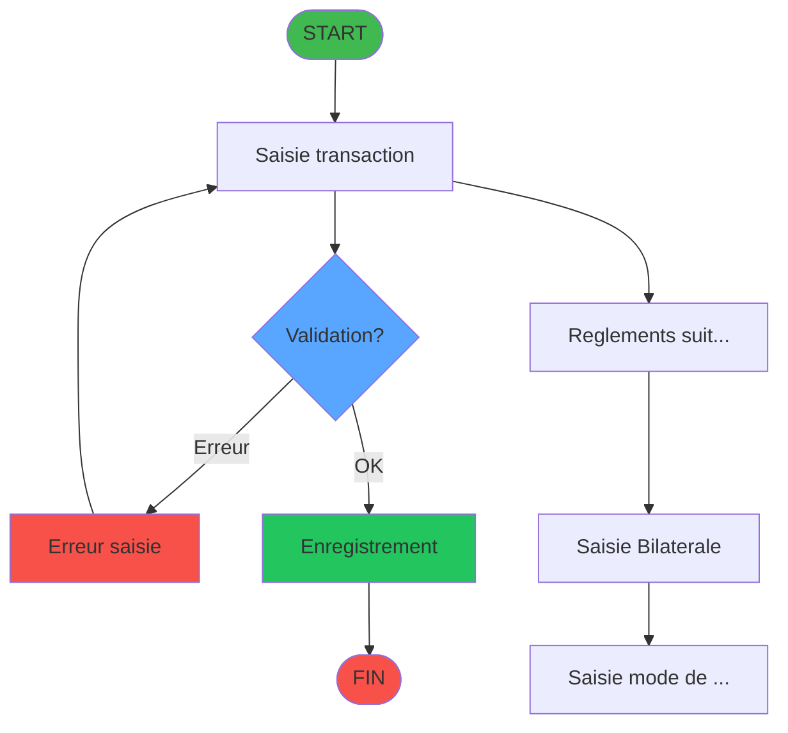
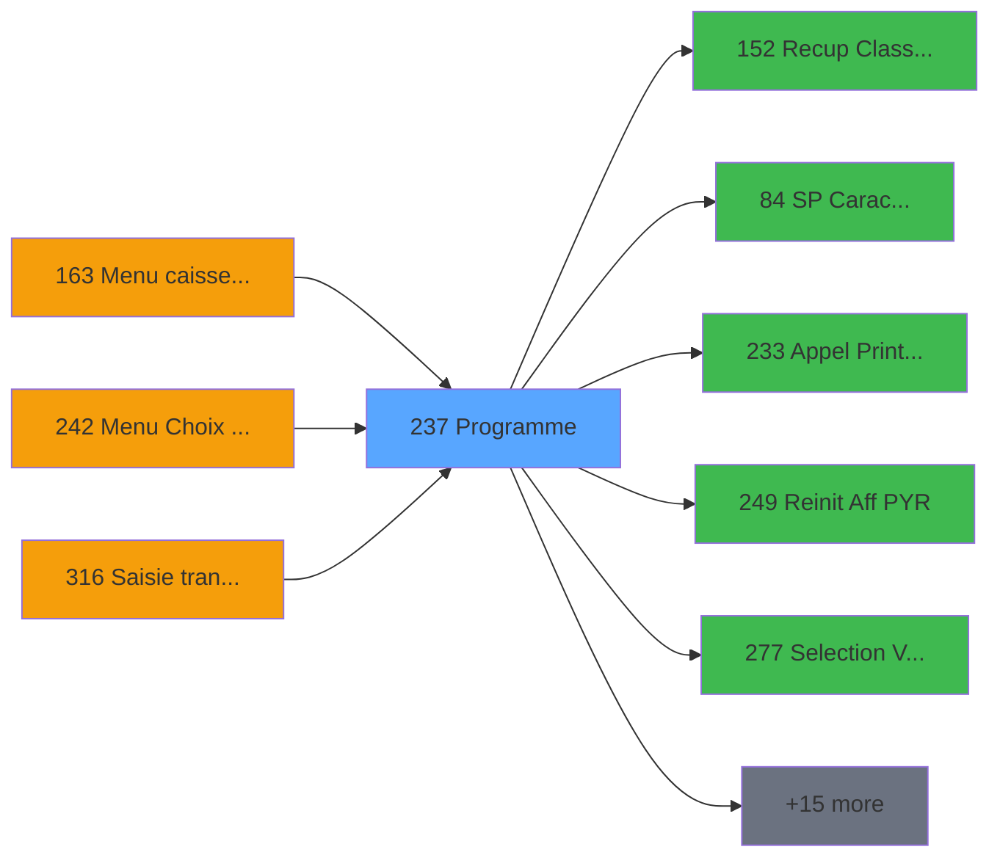

# ADH IDE 237 - Transaction Nouv vente avec GP

> **Analyse**: 2026-01-28 19:47
> **Pipeline**: V6.0 Deep Analysis
> **Niveau**: DETAILED (Migration)

<!-- TAB:Fonctionnel -->

## 1. IDENTIFICATION

| Attribut | Valeur |
|----------|--------|
| Projet | ADH |
| IDE Position | 237 |
| Nom Programme | Transaction Nouv vente avec GP |
| Statut Orphelin | NON_ORPHELIN |
| Raison | Appele par 3 programme(s): IDE 163, IDE 242, IDE 316 |

## 2. OBJECTIF METIER

**Transaction Nouv vente avec GP** - Programme de gestion des transactions et operations metier.

### Fonctionnalites principales

- **Saisie transaction** (Tache 1)
- **Reglements suite a refus TPE** (Tache 2)
- **Saisie Bilaterale** (Tache 7)
- **Saisie mode de règlement** (Tache 8)
- **Saisie Commentaires** (Tache 10)
- **Affiche saisie** (Tache 30)
- **Type transfert** (Tache 38)

### Operations sur les donnees

Ce programme **modifie** les tables suivantes:
- `reseau_cloture___rec` (cafil001_dat)
- `prestations` (cafil010_dat)
- `mvt_prestation___mpr` (cafil024_dat)
- `compte_gm________cgm` (cafil025_dat)
- `compteurs________cpt` (cafil046_dat)
- `tempo_ecran_police` (%club_user%tmp_ecrpolice_dat)
- ... et 3 autres tables

### Regles metier cles

- [RM-001] Si Trim(W0 service village [BA])='1' alors 'ALLER' sinon IF(Trim(W0 service v...
- [RM-002] Si V.RC utilisé [GA]=0 alors IF(W0 imputation [W]='VSL' sinon P0.Date debut s...
- [RM-003] Si P0 masque montant [C]='' alors '15.2' sinon P0 masque montant [C])
- [RM-004] Si VG7 OR VG35 OR VG87 alors 'P0 masque montant [C]'FORM sinon 'P0 devise loc...
- [RM-005] Si NOT W0 Motif de non enreg NA [CL] alors W0.Date fin sejour [CK] sinon W0 T...


### Contexte d'utilisation

- Appele depuis: Menu caisse GM - scroll (IDE 163), Menu Choix Saisie/Annul vente (IDE 242), Saisie transaction Nouv vente (IDE 316)
- Appelle: Recup Classe et Lib du MOP (IDE 152),     SP Caractères Interdits (IDE 84), Appel Print ticket vente PMS28 (IDE 233), Reinit Aff PYR (IDE 249), Selection Vols /t Ville à côté (IDE 277)

<!-- TAB:Technique -->

## 3. MODELE DE DONNEES

### Tables par mode d'acces

#### WRITE (Modification)

| Table ID | Nom Logique | Nom Physique | Occurrences |
|----------|-------------|--------------|-------------|
| 23 | reseau_cloture___rec | cafil001_dat | 4 |
| 32 | prestations | cafil010_dat | 2 |
| 46 | mvt_prestation___mpr | cafil024_dat | 1 |
| 47 | compte_gm________cgm | cafil025_dat | 2 |
| 68 | compteurs________cpt | cafil046_dat | 1 |
| 596 | tempo_ecran_police | %club_user%tmp_ecrpolice_dat | 2 |
| 847 | stat_lieu_vente_date | %club_user%_stat_lieu_vente_date | 3 |
| 899 | Boo_ResultsRechercheHoraire | Boo_ResultsRechercheHoraire | 6 |
| 1037 | Table_1037 |  | 3 |
#### READ (Lecture)

| Table ID | Nom Logique | Nom Physique | Occurrences |
|----------|-------------|--------------|-------------|
| 23 | reseau_cloture___rec | cafil001_dat | 1 |
| 30 | gm-recherche_____gmr | cafil008_dat | 1 |
| 32 | prestations | cafil010_dat | 1 |
| 39 | depot_garantie___dga | cafil017_dat | 1 |
| 50 | moyens_reglement_mor | cafil028_dat | 3 |
| 77 | articles_________art | cafil055_dat | 2 |
| 79 | gratuites________gra | cafil057_dat | 1 |
| 89 | moyen_paiement___mop | cafil067_dat | 4 |
| 103 | logement_client__loc | cafil081_dat | 1 |
| 109 | table_utilisateurs | cafil087_dat | 1 |
| 139 | moyens_reglement_mor | cafil117_dat | 1 |
| 596 | tempo_ecran_police | %club_user%tmp_ecrpolice_dat | 1 |
| 899 | Boo_ResultsRechercheHoraire | Boo_ResultsRechercheHoraire | 2 |
#### LINK (Reference)

| Table ID | Nom Logique | Nom Physique | Occurrences |
|----------|-------------|--------------|-------------|
| 26 | comptes_speciaux_spc | cafil004_dat | 1 |
| 30 | gm-recherche_____gmr | cafil008_dat | 2 |
| 34 | hebergement______heb | cafil012_dat | 1 |
| 46 | mvt_prestation___mpr | cafil024_dat | 1 |
| 67 | tables___________tab | cafil045_dat | 1 |
| 70 | date_comptable___dat | cafil048_dat | 1 |
| 77 | articles_________art | cafil055_dat | 2 |
| 89 | moyen_paiement___mop | cafil067_dat | 4 |
| 96 | table_prestation_pre | cafil074_dat | 1 |
| 140 | moyen_paiement___mop | cafil118_dat | 1 |
| 197 | articles_en_stock | caisse_artstock | 1 |
| 372 | pv_budget | pv_budget_dat | 1 |
| 596 | tempo_ecran_police | %club_user%tmp_ecrpolice_dat | 4 |
| 697 | droits_applications | droits | 1 |
| 728 | arc_cc_total | arc_cctotal | 1 |

## 4. VARIABLES ET PARAMETRES

### Variables Locales (Mapping Expression)

| Ref Expression | Lettre IDE | Nom Variable |
|----------------|------------|--------------|
| `{0,1}` | **A** | P0 societe |
| `{0,2}` | **B** | P0 devise locale |
| `{0,3}` | **C** | P0 masque montant |
| `{0,4}` | **D** | P0 solde compte |
| `{0,5}` | **E** | P0 code GM |
| `{0,6}` | **F** | P0 filiation |
| `{0,7}` | **G** | P0 date fin sejour |
| `{0,8}` | **H** | P0 etat compte |
| `{0,9}` | **I** | P0 date solde |
| `{0,10}` | **J** | P0 garanti O/N |
| `{0,11}` | **K** | P0 Nom & prenom |
| `{0,12}` | **L** | P0 UNI/BI |
| `{0,13}` | **M** | P0.Date debut sejour |
| `{0,14}` | **N** | P0.Valide ? |
| `{0,15}` | **O** | P0.Nb decimales |
| `{0,16}` | **P** | Bouton IDENTITE |
| `{0,17}` | **Q** | Bouton ABANDON |
| `{0,18}` | **R** | W0 FIN SAISIE OD |
| `{0,19}` | **S** | Bouton FIN SAISIE OD |
| `{0,20}` | **T** | W0 Cloture en cours |
| `{0,21}` | **U** | W0 code article |
| `{0,22}` | **V** | v.SoldeGiftPass |
| `{0,23}` | **W** | W0 imputation |
| `{0,24}` | **X** | W0 sous-imput. |
| `{0,25}` | **Y** | W0 date d'achat |
| `{0,26}` | **Z** | W0 annulation |
| `{0,53}` | **BA** | W0 service village |
| `{0,54}` | **BB** | W0 libelle article |
| `{0,55}` | **BC** | W0 article dernière minute |
| `{0,56}` | **BD** | W0 nbre articles |
| `{0,57}` | **BE** | W0 prix unitaire |
| `{0,58}` | **BF** | W0 Categorie de chambre |
| `{0,59}` | **BG** | W0 Lieu sejour |
| `{0,60}` | **BH** | W0 Code reduction |
| `{0,61}` | **BI** | v Sens Transfert Global |
| `{0,62}` | **BJ** | v.Date activité VAE |
| `{0,63}` | **BK** | v.VAE pendant le séjour ? |
| `{0,64}` | **BL** | v.Matin/Après midi |
| `{0,65}` | **BM** | W0 Sens du transfert Aller |
| `{0,66}` | **BN** | W0 Date du transfert Aller |
| `{0,67}` | **BO** | W0 Heure du transfert Aller |
| `{0,68}` | **BP** | W0 b.Date du transfert |
| `{0,69}` | **BQ** | W0 Type d'endroit Aller |
| `{0,70}` | **BR** | W0 Code Gare/Aéroport Aller |
| `{0,71}` | **BS** | W0 Numéro du vol Aller |
| `{0,72}` | **BT** | W0 Compagnie Aller |
| `{0,73}` | **BU** | W0 Commentaire Aller |
| `{0,74}` | **BV** | W0 Sens du transfert Retour |
| `{0,75}` | **BW** | W0 Date du transfert Retour |
| `{0,76}` | **BX** | W0 Heure du transfert Retour |

## 5. LOGIQUE METIER

### Algorigramme Simplifie



### Expressions Decodees

**Couverture**: 305 / 305 (100%)

#### Regles Metier Extraites

| ID | Condition | Resultat | Description |
|----|-----------|----------|-------------|
| RM-001 | `Trim(W0 service village [BA])='1'` | 'ALLER' | Si Trim(W0 service village [BA])='1' alors 'ALL... |
| RM-002 | `V.RC utilisé [GA]=0` | IF(W0 imputation [W]='VSL' | Si V.RC utilisé [GA]=0 alors IF(W0 imputation [... |
| RM-003 | `P0 masque montant [C]=''` | '15.2' | Si P0 masque montant [C]='' alors '15.2' sinon ... |
| RM-004 | `VG7 OR VG35 OR VG87` | 'P0 masque montant [C]'FORM | Si VG7 OR VG35 OR VG87 alors 'P0 masque montant... |
| RM-005 | `NOT W0 Motif de non enreg NA [CL]` | W0.Date fin sejour [CK] | Si NOT W0 Motif de non enreg NA [CL] alors W0.D... |
| RM-006 | `W0 imputation [W]='VRL'` | 'Date consommation' | Si W0 imputation [W]='VRL' alors 'Date consomma... |
| RM-007 | `W0 Titre [CO]<>0 AND NOT(W0 Motif de ...` | Fix(W0 Motif annulation [CN]*W0 Titre [CO]/100 | Si W0 Titre [CO]<>0 AND NOT(W0 Motif de non enr... |
| RM-008 | `W0 imputation [W]='VRL' OR W0 imputat...` | 'Nb forfait' | Si W0 imputation [W]='VRL' OR W0 imputation [W]... |
| RM-009 | `IN (W0 imputation [W]` | 'VRL' | Si IN (W0 imputation [W] alors 'VRL' sinon 'VSL... |
| RM-010 | `W0 imputation [W]='TRF'` | 31.750 | Si W0 imputation [W]='TRF' alors 31.750 sinon 4... |
| RM-011 | `W0 Chambre [CX]<>''` | RTrim (W0 Nb Chambres [CW])&Fill (' ' | Si W0 Chambre [CX]<>'' alors RTrim (W0 Nb Chamb... |
| RM-012 | `V.Total reglement ligne [FF]` | V.Id transaction PMS [FI] | Si V.Total reglement ligne [FF] alors V.Id tran... |
| RM-013 | `V.ConfirmeUseGP? [FZ]` | 'V' | Si V.ConfirmeUseGP? [FZ] alors 'V' sinon IF([AP... |
| RM-014 | `NOT(CHG_PRV_W0 nbre articles [GO])` | 132.875 | Si NOT(CHG_PRV_W0 nbre articles [GO]) alors 132... |
| RM-015 | `W0 imputation [W]='ANN'` | 'O' | Si W0 imputation [W]='ANN' alors 'O' sinon 'N') |
#### Top 20 Expressions

| IDE | Type | Expression Decodee |
|-----|------|-------------------|
| 1 | DATE | `DStr(P0 date fin sejour [G],'DD/MM/YYYY')` |
| 2 | CONDITION | `IF(Trim(W0 service village [BA])='1','ALLER',IF(Trim(W0 s...` |
| 3 | STRING | `MlsTrans ('Verifier que la transaction est bien pour')&' ...` |
| 4 | DATE | `Date ()` |
| 5 | CONDITION | `IF(V.RC utilisé [GA]=0,IF(W0 imputation [W]='VSL',P0.Date...` |
| 6 | OTHER | `NOT VG38` |
| 7 | OTHER | `VG2` |
| 8 | STRING | `Trim (W0 choix transac manuelle [EM])` |
| 9 | CONSTANT | `154` |
| 10 | OTHER | `P0 societe [A]` |
| 11 | OTHER | `P0 code GM [E]` |
| 12 | OTHER | `P0 filiation [F]` |
| 13 | CONSTANT | `'F'` |
| 14 | DATE | `Date ()` |
| 15 | CALCULATION | `[AW]*[AV]` |
| 16 | CALCULATION | `([AW]*[AV])-W0 Prenom [CQ]` |
| 17 | OTHER | `'FALSE'LOG` |
| 18 | CONSTANT | `'N'` |
| 19 | CONSTANT | `1` |
| 20 | CONSTANT | `'CAISSE'` |

## 6. INTERFACE UTILISATEUR

### Forms (Ecrans)

| Tache | Nom | Type | Dimensions |
|-------|-----|------|------------|
| 1 | Saisie transaction | Modal | 1112 x 279 |
| 2 | Reglements suite a refus TPE | Type6 | 708 x 256 |
| 3 | verif reg restant | Type0 | - |
| 4 | creation règlement | Type0 | - |
| 5 | Verif reglement tpe | Type0 | - |
| 6 | Dé-Affecition | Type0 | - |
| 7 | Saisie Bilaterale | Type6 | 326 x 249 |
| 8 | Saisie mode de règlement | Type6 | 506 x 250 |
| 9 | RAZ 269 | MDI | - |
| 10 | Saisie Commentaires | Type6 | 772 x 169 |
| 11 | VRL : Saisie identité | MDI | 699 x 157 |
| 12 | Test si cloture en cours | MDI | - |
| 13 | Blocage cloture v1 | MDI | - |
| 14 | Blocage cloture v1 | MDI | - |
| 15 | Reaffichage infos compte | MDI | - |
| 16 | Test reseau | MDI | - |
| 17 | Forfait | MDI | - |
| 18 |  | Modal | 116 x 32 |
| 19 | Saisie dates forfait | MDI | 528 x 121 |
| 20 | Effacement forfait | MDI | - |
| 21 | Effacement mvt forfait | MDI | - |
| 22 | Creation prestation | MDI | - |
| 23 | Deblocage cloture v1 | MDI | - |
| 24 | Deblocage cloture | MDI | - |
| 25 | Gratuite ? | MDI | - |
| 26 | Recherche imputation/ssimput | MDI | - |
| 27 | Creation Tempo | MDI | - |
| 28 | Creation reglement | Type0 | - |
| 29 | Creation | Type0 | - |
| 30 | Affiche saisie | Modal | 427 x 124 |
| 31 | garantie? | MDI | - |
| 32 | RAZ 269 | MDI | - |
| 33 | Increment Num. Ticket(VRL/VSL) | Type0 | - |
| 34 | Changement MOP multi paiement | Type0 | - |
| 35 | calcul nombre carte | Type0 | - |
| 36 | Raz Affectation Transfert | Type0 | - |
| 37 | Compte Enregs affectés | Type0 | - |
| 38 | Type transfert | Type6 | 722 x 292 |
| 39 | Affiche Transfert A/R | Type6 | 681 x 205 |
| 40 | Affectation PAX / Transfert | Type0 | 1056 x 281 |
| 41 | Supprime enregs non affectés | Type0 | - |
| 42 | Compte Enregs affectés | Type0 | - |
| 43 | Compte Enregs affectés | Type0 | - |
| 44 | Affectation Auto | Type0 | - |
| 45 | MaJ Num Chèque | Type0 | - |
| 46 | Libération du logement | Type0 | 123 x 149 |
| 47 | Creation_heure_liberation | Type0 | - |
| 48 | RAZ LCO liberation | Type0 | - |
| 49 | Récup nb chambre /LCO | Type0 | 123 x 89 |
### Mockup ASCII

```
+--------------------------------------------------------------------+
|                         Saisie transaction                         |
+--------------------------------------------------------------------+
|  [Form content - Modal]                                            |
|  Size: 1112 x 279 DLU                                              |
|  Task: 1                                                           |
|                                                                    |
|                                                                    |
|                                                                    |
|                                                                    |
|                                                                    |
|                                                                    |
|                                                                    |
|                                                                    |
+--------------------------------------------------------------------+
```

<!-- TAB:Cartographie -->

## 7. GRAPHE D'APPELS

### 7.1 Chaine depuis Main

**Chemin d'acces**: Main (IDE 1) -> Menu caisse GM - scroll (IDE 163) -> Transaction Nouv vente avec GP (IDE 237)



### 7.2 Callers (Qui m'appelle)

| IDE | Nom Programme | Nb Appels |
|-----|---------------|-----------|
| 163 | Menu caisse GM - scroll | 1 |
| 242 | Menu Choix Saisie/Annul vente | 1 |
| 316 | Saisie transaction Nouv vente | 1 |

### 7.3 Callees (Qui j'appelle)

| IDE | Nom Programme | Nb Appels |
|-----|---------------|-----------|
| 152 | Recup Classe et Lib du MOP | 4 |
| 84 |     SP Caractères Interdits | 2 |
| 233 | Appel Print ticket vente PMS28 | 2 |
| 249 | Reinit Aff PYR | 2 |
| 277 | Selection Vols /t Ville à côté | 2 |
| 43 | Recuperation du titre | 1 |
| 149 | Calcul stock produit WS | 1 |
| 179 | Get Printer | 1 |
| 180 | Printer choice | 1 |
| 181 | Set Listing Number | 1 |
| 182 | Raz Current Printer | 1 |
| 225 | Get Fidelisation et Remise | 1 |
| 227 | Get Matricule | 1 |
| 228 | Gestion Chèque | 1 |
| 241 | Solde Gift Pass | 1 |
| 247 | Deversement Transaction | 1 |
| 248 | Choix PYR (plusieurs chambres) | 1 |
| 254 | Solde Resort Credit | 1 |
| 257 | Zoom articles | 1 |
| 269 | Zoom services village | 1 |

## 8. STATISTIQUES

| Metrique | Valeur |
|----------|--------|
| Taches | 49 |
| Lignes Logic | 1818 |
| Lignes Desactivees | 0 |
| Expressions | 305 |
| Regles Metier | 17 |
| Tables (total) | 30 |
| Tables WRITE | 9 |
| Tables READ | 13 |
| Callers | 3 |
| Callees | 20 |

---

## 9. NOTES MIGRATION

### Complexite estimee

**HAUTE** - Plus de 200 expressions

### Points d'attention

- Tables en ecriture: reseau_cloture___rec, prestations, mvt_prestation___mpr, compte_gm________cgm, compteurs________cpt, tempo_ecran_police, stat_lieu_vente_date, Boo_ResultsRechercheHoraire, Table_1037
- Dependances callees: 20 programmes appeles
- Expressions conditionnelles: 31

---
*Spec DETAILED generee par Pipeline V6.0 - 2026-01-28 19:47*
