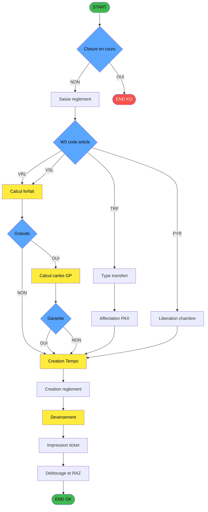
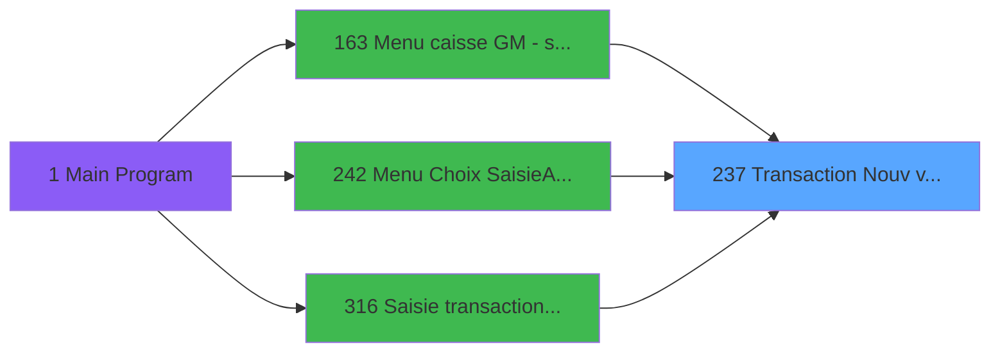
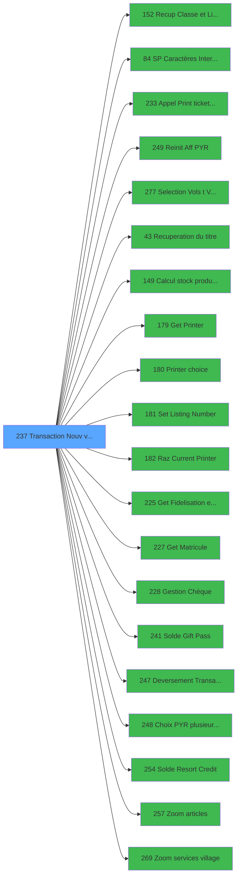

# ADH IDE 237 - Transaction Nouv vente avec GP

> **Analyse**: Phases 1-4 2026-02-03 00:05 -> 00:05 (27s) | Assemblage 00:05
> **Pipeline**: V7.2 Enrichi
> **Structure**: 4 onglets (Resume | Ecrans | Donnees | Connexions)

<!-- TAB:Resume -->

## 1. FICHE D'IDENTITE

| Attribut | Valeur |
|----------|--------|
| Projet | ADH |
| IDE Position | 237 |
| Nom Programme | Transaction Nouv vente avec GP |
| Fichier source | `Prg_237.xml` |
| Domaine metier | Ventes |
| Taches | 49 (12 ecrans visibles) |
| Tables modifiees | 9 |
| Programmes appeles | 20 |

## 2. DESCRIPTION FONCTIONNELLE

**Transaction Nouv vente avec GP** gere le processus complet de vente au point de caisse, couvrant 4 types d'articles : VRL (Vente Residents Locaux), VSL (Village Sejour Libre), TRF (Transfert) et PYR (Payer/Liberation chambre). Le programme comprend 49 taches dont 36 au niveau 1, avec un flux fortement conditionne par la variable W0 code article [W] qui oriente vers des ecrans et traitements specifiques a chaque type. Il ecrit dans 9 tables et appelle 23 sous-programmes.

### Controles pre-vente

Avant toute operation de vente, le programme verifie que la caisse n'est pas en cours de cloture en lisant la table reseau_cloture (cafil001_dat). Si une cloture est detectee, un verrou est pose (mode Create) pour bloquer la transaction. Un test reseau ecrit dans la table compte_gm (cafil025_dat) pour confirmer la connectivite de la base de donnees. Ces controles securisent la coherence comptable en empechant toute vente pendant une phase de cloture ou en cas de deconnexion.

4 taches : 237.8, 237.9, 237.10, 237.2

- **237.8** - Test si cloture en cours (28 lignes, lit reseau_cloture)
- **237.8.1** - Blocage cloture v1 (8 lignes, ecrit reseau_cloture)
- **237.8.2** - Blocage cloture T2H (9 lignes, ecrit reseau_cloture)
- **237.9** - Reaffichage infos compte (14 lignes, ecrit compte_gm)
- **237.10** - Test reseau (11 lignes, ecrit compte_gm)
- **237.2** - Desaffectation (9 lignes, ecrit Boo_ResultsRechercheHoraire)

### Saisie

Le programme presente des ecrans de saisie differents selon le type d'article. L'ecran principal (tache racine 237) est un formulaire Online sur la table n103 en mode Modify. La saisie du reglement peut etre bilaterale (BI, tache 237.3) ou unilaterale (UNI, tache 237.4) selon le mode de paiement choisi. Des ecrans specifiques apparaissent pour les commentaires VSL (tache 237.6, conditionne par code article = 'VSL') et l'identification du compte special VRL (tache 237.7, conditionne par code article = 'VRL'). La saisie des dates de forfait (237.12.1) est declenchee pour les sejours. L'ecran d'affichage de saisie (237.21) permet la confirmation avant deversement.

7 taches : 237.3, 237.4, 237.6, 237.7, 237.12, 237.21, 237.29

- **237.3** - Saisie mode de reglement BI (30 lignes, lit moyen_paiement, **[ECRAN]**)
- **237.4** - Saisie mode de reglement UNI (34 lignes, lit moyen_paiement, **[ECRAN]**)
- **237.6** - Saisie commentaire VSL NA (33 lignes, lit articles, **[ECRAN]**)
- **237.7** - Saisie ident cpt spe VRL (31 lignes, lit comptes, **[ECRAN]**)
- **237.12** - Saisie des dates forfait (5 lignes)
- **237.12.1** - Saisie dates forfait (7 lignes, **[ECRAN]**)
- **237.21** - Affiche saisie (28 lignes, ecrit tempo_ecran_police, **[ECRAN]**)
- **237.29** - Type Transfert (17 lignes, **[ECRAN]**)

### Forfait et tarification

Le calcul du forfait (tache 237.11, 62 lignes) lit la table prestations (cafil010_dat) pour determiner le montant de la prestation selon le type d'article et la duree du sejour. La date de debut est calculee differemment selon le type : date du jour pour VRL, date debut sejour pour VSL (expression 5). La creation de la prestation (237.15) ecrit un nouvel enregistrement dans la table prestations en mode Create, et l'effacement (237.13, 237.14) supprime les enregistrements existants dans prestations et mvt_prestation (cafil024_dat) en mode Write. Le programme appelle [Calcul stock produit WS (IDE 149)](ADH-IDE-149.md) pour verifier la disponibilite des produits.

4 taches : 237.11, 237.12, 237.13, 237.14, 237.15

- **237.11** - Forfait (62 lignes, lit prestations)
- **237.12** - Saisie des dates forfait (5 lignes)
- **237.13** - Effacement forfait (5 lignes, ecrit prestations)
- **237.14** - Effacement mvt forfait (5 lignes, ecrit mvt_prestation)
- **237.15** - Creation prestation (19 lignes, ecrit prestations)

### Garantie et Gift Pass

Deux taches interrogatives verifient les conditions de gratuites et garanties. La tache 237.18 ("Gratuite ?", 10 lignes) lit la table gm-recherche pour determiner si l'operation beneficie d'une gratuite, avec une sous-tache de recherche d'imputation (237.18.1). La tache 237.22 ("garantie?", 10 lignes) lit la table depot_garantie pour verifier si un depot de garantie est requis ou existant. Le calcul du nombre de cartes et du montant Gift Pass (237.26, 18 lignes) lit la table moyen_paiement pour determiner les montants GP applicables. Le programme appelle [Solde Gift Pass (IDE 241)](ADH-IDE-241.md) et [Solde Resort Credit (IDE 254)](ADH-IDE-254.md) pour consulter les soldes disponibles.

4 taches : 237.18, 237.22, 237.25, 237.26

- **237.18** - Gratuite ? (10 lignes, lit gm-recherche)
- **237.18.1** - Recherche imputation/ssimput (10 lignes, lit tables-imputations)
- **237.22** - garantie? (10 lignes, lit depot_garantie)
- **237.25** - Changement MOP (41 lignes, lit articles)
- **237.26** - Calcul nombre carte et montant (18 lignes, lit moyen_paiement)

### Preparation transaction

La tache "Creation Tempo" (237.19, 202 lignes) est la plus volumineuse du programme. Elle lit la table moyen_paiement et assemble toutes les donnees temporaires necessaires a la transaction : montants, references, informations client, parametres de vente. Cette tache prepare le paquet de donnees qui sera ensuite deverse en base. Elle appelle [Recuperation du titre (IDE 43)](ADH-IDE-43.md), [Get Fidelisation et Remise (IDE 225)](ADH-IDE-225.md) et [Get Matricule (IDE 227)](ADH-IDE-227.md) pour enrichir les donnees.

1 tache : 237.19

- **237.19** - Creation Tempo (202 lignes, lit moyen_paiement)

### Reglements

Le reglement suite a erreur TPE (237.1, 85 lignes, **[ECRAN]**) permet de ressaisir un paiement apres un echec de terminal de paiement electronique. Il contient 3 sous-taches : verification du restant a regler (237.1.1), creation du reglement en ecriture (237.1.2, ecrit stat_lieu_vente_date), et verification du total par ligne (237.1.3). La creation du reglement principal (237.20, 20 lignes) ecrit dans stat_lieu_vente_date avec une sous-tache de creation (237.20.1). Le changement de MOP (237.25, 41 lignes) gere les cas de paiement multi-modes. Le programme delegue a [Recup Classe et Lib du MOP (IDE 152)](ADH-IDE-152.md) (4 appels), [Gestion Cheque (IDE 228)](ADH-IDE-228.md) et [Zoom modes de paiement (IDE 272)](ADH-IDE-272.md).

4 taches : 237.1, 237.5, 237.20, 237.32

- **237.1** - Reglement suite a erreur TPE (85 lignes, lit moyen_paiement, **[ECRAN]**)
- **237.1.1** - verif reg restant (14 lignes, lit moyen_paiement)
- **237.1.2** - creation reglement (9 lignes, ecrit stat_lieu_vente_date)
- **237.1.3** - Verif total par ligne (13 lignes, lit tempo_ecran_police)
- **237.5** - RAZ tempo reglement (14 lignes, lit moyen_paiement)
- **237.20** - Creation reglement (20 lignes, ecrit stat_lieu_vente_date)
- **237.20.1** - Creation (16 lignes, lit moyen_paiement)
- **237.32** - MaJ Num Cheque (4 lignes, ecrit stat_lieu_vente_date)

### Transfert (specifique TRF)

Lorsque le code article est 'TRF' (Transfert), un flux specifique est active. L'ecran de type de transfert (237.29, **[ECRAN]**) avec sous-ecran de details (237.29.1, 102 lignes, **[ECRAN]**) permet de selectionner le type (Aller, Retour, Aller/Retour via expression 2). L'affectation PAX (237.30, 67 lignes, **[ECRAN]**) ecrit dans Boo_ResultsRechercheHoraire pour assigner les passagers aux horaires. Les sous-taches gerent la suppression des enregistrements non affectes (237.30.1), le recomptage (237.30.2) et la deselection globale (237.30.3). L'affectation automatique (237.31) et la reinitialisation (237.27) completent le flux. Delegue a [Selection Vols (IDE 277)](ADH-IDE-277.md).

6 taches : 237.27, 237.28, 237.29, 237.30, 237.31, 237.36

- **237.27** - Raz Affectation Transfert (2 lignes, ecrit Boo_ResultsRechercheHoraire)
- **237.28** - Compte Enregs affectes (5 lignes, lit Boo_ResultsRechercheHoraire)
- **237.29** - Type Transfert (17 lignes, **[ECRAN]**)
- **237.29.1** - Affiche details transfert (102 lignes, **[ECRAN]**)
- **237.30** - Affectation PAX / Transfert (67 lignes, ecrit Boo_ResultsRechercheHoraire, **[ECRAN]**)
- **237.30.1** - Supprime enregs non affectes (2 lignes, ecrit Boo_ResultsRechercheHoraire)
- **237.30.2** - Compte Enregs affectes (11 lignes, lit Boo_ResultsRechercheHoraire)
- **237.30.3** - Tout decocher (5 lignes, ecrit Boo_ResultsRechercheHoraire)
- **237.31** - Affectation Auto (13 lignes, ecrit Boo_ResultsRechercheHoraire)
- **237.36** - Recup nb chambres /LCO (5 lignes)

### Liberation chambre (specifique PYR)

Lorsque le code article est 'PYR' (Payer), le programme gere la liberation de la chambre du client. La mise a jour de l'heure de liberation (237.33, 24 lignes, **[ECRAN]**) ecrit dans Table_1037 pour enregistrer l'horaire de depart. La creation de l'heure de liberation (237.34, 16 lignes) et la reinitialisation LCO (237.35, 3 lignes, mode Delete) completent le traitement. Ce flux est conditionne par l'expression 272 : `IF(W0 code article = 'PYR', NOT(memo-service), FALSE)`. Delegue a [Choix PYR (IDE 248)](ADH-IDE-248.md) et [Reinit Aff PYR (IDE 249)](ADH-IDE-249.md).

3 taches : 237.33, 237.34, 237.35

- **237.33** - Maj heure Liberation chambre (24 lignes, ecrit Table_1037, **[ECRAN]**)
- **237.34** - Creation_heure_liberation (16 lignes, ecrit Table_1037)
- **237.35** - RAZ LCO liberation (3 lignes, ecrit Table_1037)

### Finalisation

Apres la transaction, le programme effectue le nettoyage : incrementation du numero de ticket (237.24, conditionne VRL/VSL, ecrit compteurs), deblocage des verrous de cloture (237.16, 237.17, ecrit reseau_cloture), reinitialisation des lignes de vente temporaires (237.23, ecrit tempo_ecran_police, mode Delete) et RAZ du reglement temporaire (237.5). L'impression du ticket est deleguee a [PRINT_TICKET (IDE 233)](ADH-IDE-233.md) via la chaine [Get Printer (IDE 179)](ADH-IDE-179.md) > [Printer choice (IDE 180)](ADH-IDE-180.md) > [Set Listing Number (IDE 181)](ADH-IDE-181.md) > [Raz Current Printer (IDE 182)](ADH-IDE-182.md). Le deversement final est assure par [DEVERSEMENT (IDE 247)](ADH-IDE-247.md).

4 taches : 237.16, 237.17, 237.23, 237.24

- **237.16** - Deblocage cloture v1 (4 lignes, ecrit reseau_cloture)
- **237.17** - Deblocage cloture T2H (5 lignes, ecrit reseau_cloture)
- **237.23** - RAZ tempo ligne vente (7 lignes, ecrit tempo_ecran_police)
- **237.24** - Increment Num. Ticket VRL/VSL (10 lignes, ecrit compteurs)

## 3. BLOCS FONCTIONNELS

### 3.1 Saisie (7 taches)

L'operateur saisit les donnees de la transaction via 7 ecrans (Saisie transaction, Saisie Bilaterale, Saisie mode de règlement, Saisie Commentaires, VRL : Saisie identité, Saisie dates forfait, Affiche saisie).

---

#### 237 - Saisie transaction [[ECRAN]](#ecran-t1)

**Role** : Tache d'orchestration : point d'entree du programme (7 sous-taches). Coordonne l'enchainement des traitements.
**Ecran** : 1112 x 279 DLU (Modal) | [Voir mockup](#ecran-t1)

6 sous-taches directes

| Tache | Nom | Bloc |
|-------|-----|------|
| [237.3](#t7) | Saisie Bilaterale **[[ECRAN]](#ecran-t7)** | Saisie |
| [237.4](#t8) | Saisie mode de règlement **[[ECRAN]](#ecran-t8)** | Saisie |
| [237.6](#t10) | Saisie Commentaires **[[ECRAN]](#ecran-t10)** | Saisie |
| [237.7](#t11) | VRL : Saisie identité **[[ECRAN]](#ecran-t11)** | Saisie |
| [237.12.1](#t19) | Saisie dates forfait **[[ECRAN]](#ecran-t19)** | Saisie |
| [237.21](#t30) | Affiche saisie **[[ECRAN]](#ecran-t30)** | Saisie |

**Variables liees** : R (W0 FIN SAISIE OD), CC (W0 b.Saisie PAX), DZ (W0 Forcer Transaction Manuelle), EC (W0 Fin Transaction TPE), FC (V Nbre de Ligne Saisies)
**Delegue a** : [Appel Print ticket vente PMS28 (IDE 233)](ADH-IDE-233.md), [Deversement Transaction (IDE 247)](ADH-IDE-247.md)

---

#### 237.3 - Saisie Bilaterale [[ECRAN]](#ecran-t7)

**Role** : Saisie des donnees : Saisie Bilaterale.
**Ecran** : 326 x 249 DLU (Type6) | [Voir mockup](#ecran-t7)
**Variables liees** : R (W0 FIN SAISIE OD), CC (W0 b.Saisie PAX), FC (V Nbre de Ligne Saisies), S (Bouton FIN SAISIE OD)
**Delegue a** : [Appel Print ticket vente PMS28 (IDE 233)](ADH-IDE-233.md), [Deversement Transaction (IDE 247)](ADH-IDE-247.md)

---

#### 237.4 - Saisie mode de règlement [[ECRAN]](#ecran-t8)

**Role** : Saisie des donnees : Saisie mode de règlement.
**Ecran** : 506 x 250 DLU (Type6) | [Voir mockup](#ecran-t8)
**Variables liees** : R (W0 FIN SAISIE OD), CC (W0 b.Saisie PAX), DG (W0 mode de paiement), FB (v Réponse mode paiement), FC (V Nbre de Ligne Saisies)
**Delegue a** : [Appel Print ticket vente PMS28 (IDE 233)](ADH-IDE-233.md), [Deversement Transaction (IDE 247)](ADH-IDE-247.md)

---

#### 237.6 - Saisie Commentaires [[ECRAN]](#ecran-t10)

**Role** : Saisie des donnees : Saisie Commentaires.
**Ecran** : 772 x 169 DLU (Type6) | [Voir mockup](#ecran-t10)
**Variables liees** : R (W0 FIN SAISIE OD), CC (W0 b.Saisie PAX), FC (V Nbre de Ligne Saisies), S (Bouton FIN SAISIE OD)
**Delegue a** : [Appel Print ticket vente PMS28 (IDE 233)](ADH-IDE-233.md), [Deversement Transaction (IDE 247)](ADH-IDE-247.md)

---

#### 237.7 - VRL : Saisie identité [[ECRAN]](#ecran-t11)

**Role** : Saisie des donnees : VRL : Saisie identité.
**Ecran** : 699 x 157 DLU (MDI) | [Voir mockup](#ecran-t11)
**Variables liees** : R (W0 FIN SAISIE OD), CC (W0 b.Saisie PAX), FC (V Nbre de Ligne Saisies), S (Bouton FIN SAISIE OD)
**Delegue a** : [Appel Print ticket vente PMS28 (IDE 233)](ADH-IDE-233.md), [Deversement Transaction (IDE 247)](ADH-IDE-247.md)

---

#### 237.12.1 - Saisie dates forfait [[ECRAN]](#ecran-t19)

**Role** : Saisie des donnees : Saisie dates forfait.
**Ecran** : 528 x 121 DLU (MDI) | [Voir mockup](#ecran-t19)
**Variables liees** : R (W0 FIN SAISIE OD), CC (W0 b.Saisie PAX), DP (W0 forfait (O/N)), DR (W0 forfait date(O/N)), DS (W0 code forfait)
**Delegue a** : [Appel Print ticket vente PMS28 (IDE 233)](ADH-IDE-233.md), [Deversement Transaction (IDE 247)](ADH-IDE-247.md)

---

#### 237.21 - Affiche saisie [[ECRAN]](#ecran-t30)

**Role** : Saisie des donnees : Affiche saisie.
**Ecran** : 427 x 124 DLU (Modal) | [Voir mockup](#ecran-t30)
**Variables liees** : R (W0 FIN SAISIE OD), CC (W0 b.Saisie PAX), FC (V Nbre de Ligne Saisies), S (Bouton FIN SAISIE OD)
**Delegue a** : [Appel Print ticket vente PMS28 (IDE 233)](ADH-IDE-233.md), [Deversement Transaction (IDE 247)](ADH-IDE-247.md)

### 3.2 Reglement (4 taches)

Gestion des moyens de paiement : 4 taches de reglement.

---

#### 237.1 - Reglements suite a refus TPE [[ECRAN]](#ecran-t2)

**Role** : Gestion du reglement : Reglements suite a refus TPE.
**Ecran** : 708 x 256 DLU (Type6) | [Voir mockup](#ecran-t2)
**Delegue a** : [Recup Classe et Lib du MOP (IDE 152)](ADH-IDE-152.md)

---

#### 237.1.3 - Verif reglement tpe

**Role** : Gestion du reglement : Verif reglement tpe.
**Variables liees** : ET (V.Reglement premier article), FD (v Nbre ligne de reglement Saisi), FF (V.Total reglement ligne), FG (V.Multi reglement ligne)
**Delegue a** : [Recup Classe et Lib du MOP (IDE 152)](ADH-IDE-152.md)

---

#### 237.20 - Creation reglement

**Role** : Gestion du reglement : Creation reglement.
**Variables liees** : ET (V.Reglement premier article), FD (v Nbre ligne de reglement Saisi), FF (V.Total reglement ligne), FG (V.Multi reglement ligne)
**Delegue a** : [Recup Classe et Lib du MOP (IDE 152)](ADH-IDE-152.md)

---

#### 237.25 - Changement MOP multi paiement

**Role** : Gestion du reglement : Changement MOP multi paiement.
**Variables liees** : DG (W0 mode de paiement), FB (v Réponse mode paiement), FG (V.Multi reglement ligne), DH (Existe mode de paiement)
**Delegue a** : [Recup Classe et Lib du MOP (IDE 152)](ADH-IDE-152.md)

### 3.3 Validation (1 tache)

Controles de coherence : 1 tache verifie les donnees et conditions.

---

#### 237.1.1 - verif reg restant

**Role** : Verification : verif reg restant.

### 3.4 Creation (5 taches)

Insertion de nouveaux enregistrements en base.

---

#### 237.1.2 - creation règlement

**Role** : Creation d'enregistrement : creation règlement.

---

#### 237.15 - Creation prestation

**Role** : Creation d'enregistrement : Creation prestation.

---

#### 237.19 - Creation Tempo

**Role** : Creation d'enregistrement : Creation Tempo.

---

#### 237.20.1 - Creation

**Role** : Creation d'enregistrement : Creation.

---

#### 237.34 - Creation_heure_liberation

**Role** : Creation d'enregistrement : Creation_heure_liberation.

### 3.5 Traitement (18 taches)

Traitements internes.

---

#### 237.2 - Dé-Affecition

**Role** : Traitement : Dé-Affecition.

---

#### 237.8 - Test si cloture en cours

**Role** : Verification : Test si cloture en cours.
**Variables liees** : T (W0 Cloture en cours)

---

#### 237.8.1 - Blocage cloture v1

**Role** : Traitement : Blocage cloture v1.
**Variables liees** : T (W0 Cloture en cours)

---

#### 237.8.2 - Blocage cloture v1

**Role** : Traitement : Blocage cloture v1.
**Variables liees** : T (W0 Cloture en cours)

---

#### 237.10 - Test reseau

**Role** : Verification : Test reseau.
**Variables liees** : DN (W0 reseau)

---

#### 237.11 - Forfait

**Role** : Traitement : Forfait.
**Variables liees** : DP (W0 forfait (O/N)), DR (W0 forfait date(O/N)), DS (W0 code forfait)

---

#### 237.12 - (sans nom) [[ECRAN]](#ecran-t18)

**Role** : Traitement interne.
**Ecran** : 116 x 32 DLU (Modal) | [Voir mockup](#ecran-t18)

---

#### 237.13 - Effacement forfait

**Role** : Traitement : Effacement forfait.
**Variables liees** : DP (W0 forfait (O/N)), DQ (W0 effacement (O/N)), DR (W0 forfait date(O/N)), DS (W0 code forfait)

---

#### 237.14 - Effacement mvt forfait

**Role** : Traitement : Effacement mvt forfait.
**Variables liees** : DP (W0 forfait (O/N)), DQ (W0 effacement (O/N)), DR (W0 forfait date(O/N)), DS (W0 code forfait)

---

#### 237.16 - Deblocage cloture v1

**Role** : Traitement : Deblocage cloture v1.
**Variables liees** : T (W0 Cloture en cours)

---

#### 237.17 - Deblocage cloture

**Role** : Traitement : Deblocage cloture.
**Variables liees** : T (W0 Cloture en cours)

---

#### 237.18 - Gratuite ?

**Role** : Traitement : Gratuite ?.
**Variables liees** : DV (W0 gratuite ?)

---

#### 237.22 - garantie?

**Role** : Traitement : garantie?.

---

#### 237.30.1 - Supprime enregs non affectés

**Role** : Traitement : Supprime enregs non affectés.

---

#### 237.31 - Affectation Auto

**Role** : Traitement : Affectation Auto.
**Variables liees** : FK (V.Num Autorisation)

---

#### 237.32 - MaJ Num Chèque

**Role** : Traitement : MaJ Num Chèque.

---

#### 237.33 - Libération du logement [[ECRAN]](#ecran-t46)

**Role** : Traitement : Libération du logement.
**Ecran** : 123 x 149 DLU | [Voir mockup](#ecran-t46)
**Variables liees** : EO (W0 Lien Logement Lieu Séjour), GF (v.Flag abandon libération)

---

#### 237.36 - Récup nb chambre /LCO [[ECRAN]](#ecran-t49)

**Role** : Traitement : Récup nb chambre /LCO.
**Ecran** : 123 x 89 DLU | [Voir mockup](#ecran-t49)
**Variables liees** : BF (W0 Categorie de chambre), CW (W0 Nb Chambres), CX (W0 Chambre), CZ (W0 Lib Bouton Chambre), GD (v.Nb chambres /LCO)

### 3.6 Initialisation (3 taches)

Reinitialisation d'etats et variables de travail.

---

#### 237.5 - RAZ 269

**Role** : Reinitialisation : RAZ 269.
**Delegue a** : [Reinit Aff PYR (IDE 249)](ADH-IDE-249.md)

---

#### 237.23 - RAZ 269

**Role** : Reinitialisation : RAZ 269.
**Delegue a** : [Reinit Aff PYR (IDE 249)](ADH-IDE-249.md)

---

#### 237.35 - RAZ LCO liberation

**Role** : Reinitialisation : RAZ LCO liberation.
**Delegue a** : [Reinit Aff PYR (IDE 249)](ADH-IDE-249.md)

### 3.7 Calcul (5 taches)

Calculs metier : montants, stocks, compteurs.

---

#### 237.9 - Reaffichage infos compte

**Role** : Reinitialisation : Reaffichage infos compte.
**Variables liees** : D (P0 solde compte), H (P0 etat compte), EH (W0 Compte garanti)
**Delegue a** : [Calcul stock produit WS (IDE 149)](ADH-IDE-149.md)

---

#### 237.26 - calcul nombre carte

**Role** : Calcul : calcul nombre carte.
**Variables liees** : FN (V.Total carte), FP (V.Nombre de carte)
**Delegue a** : [Calcul stock produit WS (IDE 149)](ADH-IDE-149.md)

---

#### 237.28 - Compte Enregs affectés

**Role** : Traitement : Compte Enregs affectés.
**Variables liees** : D (P0 solde compte), H (P0 etat compte), EH (W0 Compte garanti)
**Delegue a** : [Calcul stock produit WS (IDE 149)](ADH-IDE-149.md)

---

#### 237.30.2 - Compte Enregs affectés

**Role** : Traitement : Compte Enregs affectés.
**Variables liees** : D (P0 solde compte), H (P0 etat compte), EH (W0 Compte garanti)
**Delegue a** : [Calcul stock produit WS (IDE 149)](ADH-IDE-149.md)

---

#### 237.30.3 - Compte Enregs affectés

**Role** : Traitement : Compte Enregs affectés.
**Variables liees** : D (P0 solde compte), H (P0 etat compte), EH (W0 Compte garanti)
**Delegue a** : [Calcul stock produit WS (IDE 149)](ADH-IDE-149.md)

### 3.8 Consultation (1 tache)

Ecrans de recherche et consultation.

---

#### 237.18.1 - Recherche imputation/ssimput

**Role** : Traitement : Recherche imputation/ssimput.
**Delegue a** : [Selection Vols /t Ville à côté (IDE 277)](ADH-IDE-277.md), [Choix PYR (plusieurs chambres) (IDE 248)](ADH-IDE-248.md), [Zoom articles (IDE 257)](ADH-IDE-257.md)

### 3.9 Impression (1 tache)

Generation des documents et tickets.

---

#### 237.24 - Increment Num. Ticket(VRL/VSL)

**Role** : Generation du document : Increment Num. Ticket(VRL/VSL).
**Variables liees** : EX (v.IncrémentTicket(VRL/VSL) OK), EZ (v.NumeroTicket(VRL/VSL))
**Delegue a** : [Get Printer (IDE 179)](ADH-IDE-179.md), [Printer choice (IDE 180)](ADH-IDE-180.md), [Raz Current Printer (IDE 182)](ADH-IDE-182.md)

### 3.10 Transfert (4 taches)

Transfert de donnees entre modules.

---

#### 237.27 - Raz Affectation Transfert

**Role** : Reinitialisation : Raz Affectation Transfert.
**Variables liees** : BM (W0 Sens du transfert Aller), BN (W0 Date du transfert Aller), BO (W0 Heure du transfert Aller), BP (W0 b.Date du transfert), BV (W0 Sens du transfert Retour)

---

#### 237.29 - Type transfert [[ECRAN]](#ecran-t38)

**Role** : Transfert de donnees : Type transfert.
**Ecran** : 722 x 292 DLU (Type6) | [Voir mockup](#ecran-t38)
**Variables liees** : BM (W0 Sens du transfert Aller), BN (W0 Date du transfert Aller), BO (W0 Heure du transfert Aller), BP (W0 b.Date du transfert), BQ (W0 Type d'endroit Aller)

---

#### 237.29.1 - Affiche Transfert A/R [[ECRAN]](#ecran-t39)

**Role** : Reinitialisation : Affiche Transfert A/R.
**Ecran** : 681 x 205 DLU (Type6) | [Voir mockup](#ecran-t39)
**Variables liees** : BM (W0 Sens du transfert Aller), BN (W0 Date du transfert Aller), BO (W0 Heure du transfert Aller), BP (W0 b.Date du transfert), BV (W0 Sens du transfert Retour)

---

#### 237.30 - Affectation PAX / Transfert [[ECRAN]](#ecran-t40)

**Role** : Transfert de donnees : Affectation PAX / Transfert.
**Ecran** : 1056 x 281 DLU | [Voir mockup](#ecran-t40)
**Variables liees** : BM (W0 Sens du transfert Aller), BN (W0 Date du transfert Aller), BO (W0 Heure du transfert Aller), BP (W0 b.Date du transfert), BV (W0 Sens du transfert Retour)

## 5. REGLES METIER

17 regles identifiees:

### Saisie (13 regles)

#### [RM-001] Determine le sens du trajet selon le service village (1=ALLER, 2=RETOUR, 3=A/R)

| Element | Detail |
|---------|--------|
| **Condition** | `Trim(W0 service village [BA])='1'` |
| **Si vrai** | 'ALLER' |
| **Si faux** | IF(Trim(W0 service village [BA])='2','RETOUR',IF(Trim(W0 service village [BA])='3','ALLER/RETOUR',''))) |
| **Variables** | BA (W0 service village) |
| **Expression source** | Expression 2 : `IF(Trim(W0 service village [BA])='1','ALLER',IF(Trim(W0 serv` |
| **Exemple** | Si Trim(W0 service village [BA])='1' → 'ALLER' |
| **Impact** | Bloc Saisie |

#### [RM-002] Si V.RC utilisé [GA] est nul, choix conditionnel selon W0 imputation [W] (valeur 'VSL')

| Element | Detail |
|---------|--------|
| **Condition** | `V.RC utilisé [GA]=0` |
| **Si vrai** | IF(W0 imputation [W]='VSL' |
| **Si faux** | P0.Date debut sejour [M],Date()),W0 Num rue [CR]) |
| **Variables** | M (P0.Date debut sejour), W (W0 imputation), CR (W0 Num rue), GA (V.RC utilisé) |
| **Expression source** | Expression 5 : `IF(V.RC utilisé [GA]=0,IF(W0 imputation [W]='VSL',P0.Date de` |
| **Exemple** | Si V.RC utilisé [GA]=0 → IF(W0 imputation [W]='VSL'. Sinon → P0.Date debut sejour [M],Date()),W0 Num rue [CR]) |
| **Impact** | Bloc Saisie |

#### [RM-005] Si W0 Motif de non enreg NA [CL] est FAUX, branche alternative

| Element | Detail |
|---------|--------|
| **Condition** | `NOT W0 Motif de non enreg NA [CL]` |
| **Si vrai** | W0.Date fin sejour [CK] |
| **Si faux** | W0 Titre [CO]) |
| **Variables** | CK (W0.Date fin sejour), CL (W0 Motif de non enreg NA), CO (W0 Titre) |
| **Expression source** | Expression 94 : `IF(NOT W0 Motif de non enreg NA [CL],W0.Date fin sejour [CK]` |
| **Exemple** | Si NOT W0 Motif de non enreg NA [CL] → W0.Date fin sejour [CK]. Sinon → W0 Titre [CO]) |
| **Impact** | Bloc Saisie |

#### [RM-006] Si W0 imputation [W] vaut 'VRL' alors 'Date consommation', sinon 'Date début séjour'

| Element | Detail |
|---------|--------|
| **Condition** | `W0 imputation [W]='VRL'` |
| **Si vrai** | 'Date consommation' |
| **Si faux** | 'Date début séjour') |
| **Variables** | W (W0 imputation) |
| **Expression source** | Expression 111 : `IF(W0 imputation [W]='VRL','Date consommation','Date début s` |
| **Exemple** | Si W0 imputation [W]='VRL' → 'Date consommation'. Sinon → 'Date début séjour') |
| **Impact** | Bloc Saisie |

#### [RM-007] Calcul de pourcentage avec arrondi

| Element | Detail |
|---------|--------|
| **Condition** | `W0 Titre [CO]<>0 AND NOT(W0 Motif de non enreg NA [CL])` |
| **Si vrai** | Fix(W0 Motif annulation [CN]*W0 Titre [CO]/100 |
| **Si faux** | 11,P0.Nb decimales [O]),W0 Prenom [CQ]) |
| **Variables** | O (P0.Nb decimales), CL (W0 Motif de non enreg NA), CN (W0 Motif annulation), CO (W0 Titre), CQ (W0 Prenom) |
| **Expression source** | Expression 114 : `IF(W0 Titre [CO]<>0 AND NOT(W0 Motif de non enreg NA [CL]),F` |
| **Exemple** | Si W0 Titre [CO]<>0 AND NOT(W0 Motif de non enreg NA [CL]) → Fix(W0 Motif annulation [CN]*W0 Titre [CO]/100. Sinon → 11,P0.Nb decimales [O]),W0 Prenom [CQ]) |
| **Impact** | Bloc Saisie |

#### [RM-008] Comportement conditionnel selon type d'imputation 'VRL'

| Element | Detail |
|---------|--------|
| **Condition** | `W0 imputation [W]='VRL' OR W0 imputation [W]='VSL'` |
| **Si vrai** | 'Nb forfait' |
| **Si faux** | IF(W0 imputation [W]='TRF', 'Nb PAX','Nbre')) |
| **Variables** | W (W0 imputation) |
| **Expression source** | Expression 120 : `IF(W0 imputation [W]='VRL' OR W0 imputation [W]='VSL','Nb fo` |
| **Exemple** | Si W0 imputation [W]='VRL' OR W0 imputation [W]='VSL' → 'Nb forfait'. Sinon → IF(W0 imputation [W]='TRF', 'Nb PAX','Nbre')) |
| **Impact** | [237.11 - Forfait](#t17) |

#### [RM-009] Position UI conditionnelle selon W0 imputation [W]

| Element | Detail |
|---------|--------|
| **Condition** | `IN (W0 imputation [W]` |
| **Si vrai** | 'VRL' |
| **Si faux** | 'VSL','TRF','PYR'),31.125,14.875) |
| **Variables** | W (W0 imputation) |
| **Expression source** | Expression 125 : `IF(IN (W0 imputation [W],'VRL','VSL','TRF','PYR'),31.125,14.` |
| **Exemple** | Si IN (W0 imputation [W] → 'VRL'. Sinon → 'VSL','TRF','PYR'),31.125,14.875) |
| **Impact** | Bloc Saisie |

#### [RM-010] Comportement conditionnel selon type d'imputation 'TRF'

| Element | Detail |
|---------|--------|
| **Condition** | `W0 imputation [W]='TRF'` |
| **Si vrai** | 31.750 |
| **Si faux** | 40.125) |
| **Variables** | W (W0 imputation) |
| **Expression source** | Expression 131 : `IF(W0 imputation [W]='TRF',31.750,40.125)` |
| **Exemple** | Si W0 imputation [W]='TRF' → 31.750. Sinon → 40.125) |
| **Impact** | Bloc Saisie |

#### [RM-011] Traitement si W0 Chambre [CX] est renseigne

| Element | Detail |
|---------|--------|
| **Condition** | `W0 Chambre [CX]<>''` |
| **Si vrai** | RTrim (W0 Nb Chambres [CW])&Fill (' ' |
| **Si faux** | Len (RTrim (W0 Nb Chambres [CW]))-1)&RTrim (W0 Chambre [CX])&' '&W0 PYR Valide [CY],Trim(P0 Nom & prenom [K])) |
| **Variables** | K (P0 Nom & prenom), CW (W0 Nb Chambres), CX (W0 Chambre), CY (W0 PYR Valide) |
| **Expression source** | Expression 147 : `IF(W0 Chambre [CX]<>'',RTrim (W0 Nb Chambres [CW])&Fill (' '` |
| **Exemple** | Si W0 Chambre [CX]<>'' → RTrim (W0 Nb Chambres [CW])&Fill (' ' |
| **Impact** | Bloc Saisie |

#### [RM-012] Si V.Total reglement ligne [FF] alors V.Id transaction PMS [FI] sinon VG18)

| Element | Detail |
|---------|--------|
| **Condition** | `V.Total reglement ligne [FF]` |
| **Si vrai** | V.Id transaction PMS [FI] |
| **Si faux** | VG18) |
| **Variables** | FF (V.Total reglement ligne), FI (V.Id transaction PMS) |
| **Expression source** | Expression 154 : `IF(V.Total reglement ligne [FF],V.Id transaction PMS [FI],VG` |
| **Exemple** | Si V.Total reglement ligne [FF] → V.Id transaction PMS [FI]. Sinon → VG18) |
| **Impact** | Bloc Saisie |

#### [RM-014] Si NOT(CHG_PRV_W0 nbre articles [GO]) alors 132.875 sinon 105.875)

| Element | Detail |
|---------|--------|
| **Condition** | `NOT(CHG_PRV_W0 nbre articles [GO])` |
| **Si vrai** | 132.875 |
| **Si faux** | 105.875) |
| **Variables** | BD (W0 nbre articles), GO (CHG_PRV_W0 nbre articles) |
| **Expression source** | Expression 225 : `IF (NOT(CHG_PRV_W0 nbre articles [GO]),132.875,105.875)` |
| **Exemple** | Si NOT(CHG_PRV_W0 nbre articles [GO]) → 132.875. Sinon → 105.875) |
| **Impact** | Bloc Saisie |

#### [RM-015] Si W0 imputation [W] vaut 'ANN' alors 'O', sinon 'N'

| Element | Detail |
|---------|--------|
| **Condition** | `W0 imputation [W]='ANN'` |
| **Si vrai** | 'O' |
| **Si faux** | 'N') |
| **Variables** | W (W0 imputation) |
| **Expression source** | Expression 236 : `IF(W0 imputation [W]='ANN','O','N')` |
| **Exemple** | Si W0 imputation [W]='ANN' → 'O'. Sinon → 'N') |
| **Impact** | Bloc Saisie |

#### [RM-016] Comportement conditionnel selon type d'imputation 'PYR'

| Element | Detail |
|---------|--------|
| **Condition** | `W0 imputation [W]='PYR'` |
| **Si vrai** | NOT(W0 mode de paiement [DG]) |
| **Si faux** | 'FALSE'LOG) |
| **Variables** | W (W0 imputation), DG (W0 mode de paiement) |
| **Expression source** | Expression 272 : `IF(W0 imputation [W]='PYR',NOT(W0 mode de paiement [DG]),'FA` |
| **Exemple** | Si W0 imputation [W]='PYR' → NOT(W0 mode de paiement [DG]). Sinon → 'FALSE'LOG) |
| **Impact** | Bloc Saisie |

### Reglement (2 regles)

#### [RM-003] Valeur par defaut si P0 masque montant [C] est vide

| Element | Detail |
|---------|--------|
| **Condition** | `P0 masque montant [C]=''` |
| **Si vrai** | '15.2' |
| **Si faux** | P0 masque montant [C]) |
| **Variables** | C (P0 masque montant) |
| **Expression source** | Expression 35 : `IF (P0 masque montant [C]='','15.2',P0 masque montant [C])` |
| **Exemple** | Si P0 masque montant [C]='' → '15.2'. Sinon → P0 masque montant [C]) |
| **Impact** | Bloc Reglement |

#### [RM-004] Si VG7 OR VG35 OR VG87 alors 'P0 masque montant [C]'FORM sinon 'P0 devise locale [B]'FORM)

| Element | Detail |
|---------|--------|
| **Condition** | `VG7 OR VG35 OR VG87` |
| **Si vrai** | 'P0 masque montant [C]'FORM |
| **Si faux** | 'P0 devise locale [B]'FORM) |
| **Variables** | B (P0 devise locale), C (P0 masque montant) |
| **Expression source** | Expression 92 : `IF(VG7 OR VG35 OR VG87,'P0 masque montant [C]'FORM,'P0 devis` |
| **Exemple** | Si VG7 OR VG35 OR VG87 → 'P0 masque montant [C]'FORM. Sinon → 'P0 devise locale [B]'FORM) |
| **Impact** | Bloc Reglement |

### Autres (2 regles)

#### [RM-013] Si V.ConfirmeUseGP? [FZ] alors 'V' sinon IF([AP]='O','C','D'))

| Element | Detail |
|---------|--------|
| **Condition** | `V.ConfirmeUseGP? [FZ]` |
| **Si vrai** | 'V' |
| **Si faux** | IF([AP]='O','C','D')) |
| **Variables** | FZ (V.ConfirmeUseGP?) |
| **Expression source** | Expression 167 : `IF(V.ConfirmeUseGP? [FZ],'V',IF([AP]='O','C','D'))` |
| **Exemple** | Si V.ConfirmeUseGP? [FZ] → 'V'. Sinon → IF([AP]='O','C','D')) |

#### [RM-017] Si VG20>1 alors [AY] sinon 'G')

| Element | Detail |
|---------|--------|
| **Condition** | `VG20>1` |
| **Si vrai** | [AY] |
| **Si faux** | 'G') |
| **Expression source** | Expression 290 : `IF(VG20>1,[AY],'G')` |
| **Exemple** | Si VG20>1 → [AY]. Sinon → 'G') |

## 6. CONTEXTE

- **Appele par**: [Menu caisse GM - scroll (IDE 163)](ADH-IDE-163.md), [Menu Choix Saisie/Annul vente (IDE 242)](ADH-IDE-242.md), [Saisie transaction Nouv vente (IDE 316)](ADH-IDE-316.md)
- **Appelle**: 20 programmes | **Tables**: 30 (W:9 R:13 L:18) | **Taches**: 49 | **Expressions**: 305

<!-- TAB:Ecrans -->

## 8. ECRANS

### 8.1 Forms visibles (12 / 49)

| # | Position | Tache | Nom | Type | Largeur | Hauteur | Bloc |
|---|----------|-------|-----|------|---------|---------|------|
| 1 | 237 | 237 | Saisie transaction | Modal | 1112 | 279 | Saisie |
| 2 | 237.1 | 237.1 | Reglements suite a refus TPE | Type6 | 708 | 256 | Reglement |
| 3 | 237.3 | 237.3 | Saisie Bilaterale | Type6 | 326 | 249 | Saisie |
| 4 | 237.4 | 237.4 | Saisie mode de règlement | Type6 | 506 | 250 | Saisie |
| 5 | 237.6 | 237.6 | Saisie Commentaires | Type6 | 772 | 169 | Saisie |
| 6 | 237.7 | 237.7 | VRL : Saisie identité | MDI | 699 | 157 | Saisie |
| 7 | 237.12.1 | 237.12.1 | Saisie dates forfait | MDI | 528 | 121 | Saisie |
| 8 | 237.21 | 237.21 | Affiche saisie | Modal | 427 | 124 | Saisie |
| 9 | 237.29 | 237.29 | Type transfert | Type6 | 722 | 292 | Transfert |
| 10 | 237.29.1 | 237.29.1 | Affiche Transfert A/R | Type6 | 681 | 205 | Transfert |
| 11 | 237.30 | 237.30 | Affectation PAX / Transfert | Type0 | 1056 | 281 | Transfert |
| 12 | 237.33 | 237.33 | Libération du logement | Type0 | 123 | 149 | Traitement |

### 8.2 Mockups Ecrans

---

#### 237 - Saisie transaction
**Tache** : [237](#t1) | **Type** : Modal | **Dimensions** : 1112 x 279 DLU
**Bloc** : Saisie | **Titre IDE** : Saisie transaction

<!-- FORM-DATA:
{
    "width":  1112,
    "vFactor":  8,
    "type":  "Modal",
    "hFactor":  8,
    "controls":  [
                     {
                         "x":  2,
                         "type":  "label",
                         "var":  "",
                         "y":  2,
                         "w":  1039,
                         "fmt":  "",
                         "name":  "",
                         "h":  17,
                         "color":  "",
                         "text":  "",
                         "parent":  null
                     },
                     {
                         "x":  226,
                         "type":  "label",
                         "var":  "",
                         "y":  21,
                         "w":  886,
                         "fmt":  "",
                         "name":  "",
                         "h":  230,
                         "color":  "",
                         "text":  "",
                         "parent":  null
                     },
                     {
                         "x":  252,
                         "type":  "label",
                         "var":  "",
                         "y":  35,
                         "w":  133,
                         "fmt":  "",
                         "name":  "",
                         "h":  10,
                         "color":  "195",
                         "text":  "Date d\u0027achat",
                         "parent":  null
                     },
                     {
                         "x":  769,
                         "type":  "label",
                         "var":  "",
                         "y":  35,
                         "w":  135,
                         "fmt":  "",
                         "name":  "",
                         "h":  11,
                         "color":  "120",
                         "text":  "Annulation ?",
                         "parent":  null
                     },
                     {
                         "x":  3,
                         "type":  "label",
                         "var":  "",
                         "y":  244,
                         "w":  265,
                         "fmt":  "",
                         "name":  "",
                         "h":  8,
                         "color":  "143",
                         "text":  "Clôture en cours",
                         "parent":  null
                     },
                     {
                         "x":  0,
                         "type":  "label",
                         "var":  "",
                         "y":  254,
                         "w":  1042,
                         "fmt":  "",
                         "name":  "",
                         "h":  24,
                         "color":  "",
                         "text":  "",
                         "parent":  null
                     },
                     {
                         "x":  242,
                         "type":  "label",
                         "var":  "",
                         "y":  47,
                         "w":  865,
                         "fmt":  "",
                         "name":  "",
                         "h":  201,
                         "color":  "195",
                         "text":  "Article",
                         "parent":  null
                     },
                     {
                         "x":  256,
                         "type":  "line",
                         "var":  "",
                         "y":  181,
                         "w":  746,
                         "fmt":  "",
                         "name":  "",
                         "h":  0,
                         "color":  "",
                         "text":  "",
                         "parent":  13
                     },
                     {
                         "x":  253,
                         "type":  "label",
                         "var":  "",
                         "y":  184,
                         "w":  58,
                         "fmt":  "",
                         "name":  "",
                         "h":  9,
                         "color":  "",
                         "text":  "Service",
                         "parent":  13
                     },
                     {
                         "x":  322,
                         "type":  "label",
                         "var":  "",
                         "y":  184,
                         "w":  146,
                         "fmt":  "",
                         "name":  "",
                         "h":  9,
                         "color":  "",
                         "text":  "Article",
                         "parent":  13
                     },
                     {
                         "x":  478,
                         "type":  "label",
                         "var":  "",
                         "y":  184,
                         "w":  146,
                         "fmt":  "",
                         "name":  "",
                         "h":  9,
                         "color":  "",
                         "text":  "Libellé",
                         "parent":  13
                     },
                     {
                         "x":  669,
                         "type":  "label",
                         "var":  "",
                         "y":  184,
                         "w":  48,
                         "fmt":  "",
                         "name":  "",
                         "h":  9,
                         "color":  "",
                         "text":  "Nbre",
                         "parent":  13
                     },
                     {
                         "x":  760,
                         "type":  "label",
                         "var":  "",
                         "y":  184,
                         "w":  182,
                         "fmt":  "",
                         "name":  "",
                         "h":  9,
                         "color":  "",
                         "text":  "Montant",
                         "parent":  13
                     },
                     {
                         "x":  728,
                         "type":  "label",
                         "var":  "",
                         "y":  193,
                         "w":  19,
                         "fmt":  "",
                         "name":  "",
                         "h":  8,
                         "color":  "7",
                         "text":  "X",
                         "parent":  13
                     },
                     {
                         "x":  478,
                         "type":  "label",
                         "var":  "",
                         "y":  219,
                         "w":  182,
                         "fmt":  "",
                         "name":  "",
                         "h":  10,
                         "color":  "",
                         "text":  "Règlement",
                         "parent":  13
                     },
                     {
                         "x":  957,
                         "type":  "edit",
                         "var":  "",
                         "y":  193,
                         "w":  48,
                         "fmt":  "",
                         "name":  "",
                         "h":  10,
                         "color":  "7",
                         "text":  "",
                         "parent":  13
                     },
                     {
                         "x":  631,
                         "type":  "button",
                         "var":  "",
                         "y":  257,
                         "w":  168,
                         "fmt":  "",
                         "name":  "Bouton DETAIL",
                         "h":  18,
                         "color":  "",
                         "text":  "",
                         "parent":  null
                     },
                     {
                         "x":  215,
                         "type":  "button",
                         "var":  "",
                         "y":  257,
                         "w":  168,
                         "fmt":  "",
                         "name":  "Bouton ABANDON",
                         "h":  18,
                         "color":  "",
                         "text":  "",
                         "parent":  null
                     },
                     {
                         "x":  841,
                         "type":  "button",
                         "var":  "",
                         "y":  257,
                         "w":  192,
                         "fmt":  "",
                         "name":  "Bouton FIN SAISIE OD",
                         "h":  18,
                         "color":  "",
                         "text":  "",
                         "parent":  11
                     },
                     {
                         "x":  396,
                         "type":  "edit",
                         "var":  "",
                         "y":  35,
                         "w":  126,
                         "fmt":  "##/##/####Z",
                         "name":  "",
                         "h":  10,
                         "color":  "6",
                         "text":  "",
                         "parent":  null
                     },
                     {
                         "x":  908,
                         "type":  "combobox",
                         "var":  "",
                         "y":  35,
                         "w":  110,
                         "fmt":  "",
                         "name":  "W0 annulation",
                         "h":  12,
                         "color":  "110",
                         "text":  "",
                         "parent":  4
                     },
                     {
                         "x":  253,
                         "type":  "edit",
                         "var":  "",
                         "y":  193,
                         "w":  59,
                         "fmt":  "U4A",
                         "name":  "W0 service village",
                         "h":  10,
                         "color":  "6",
                         "text":  "",
                         "parent":  13
                     },
                     {
                         "x":  322,
                         "type":  "edit",
                         "var":  "",
                         "y":  193,
                         "w":  149,
                         "fmt":  "",
                         "name":  "W0 libelle article",
                         "h":  10,
                         "color":  "6",
                         "text":  "",
                         "parent":  13
                     },
                     {
                         "x":  478,
                         "type":  "edit",
                         "var":  "",
                         "y":  193,
                         "w":  182,
                         "fmt":  "",
                         "name":  "W0 libelle supplem",
                         "h":  10,
                         "color":  "6",
                         "text":  "",
                         "parent":  13
                     },
                     {
                         "x":  669,
                         "type":  "edit",
                         "var":  "",
                         "y":  193,
                         "w":  48,
                         "fmt":  "",
                         "name":  "W0 nbre articles",
                         "h":  10,
                         "color":  "6",
                         "text":  "",
                         "parent":  13
                     },
                     {
                         "x":  760,
                         "type":  "edit",
                         "var":  "",
                         "y":  193,
                         "w":  182,
                         "fmt":  "15",
                         "name":  "",
                         "h":  10,
                         "color":  "6",
                         "text":  "",
                         "parent":  13
                     },
                     {
                         "x":  760,
                         "type":  "edit",
                         "var":  "",
                         "y":  205,
                         "w":  182,
                         "fmt":  "15",
                         "name":  "W0 montant",
                         "h":  10,
                         "color":  "6",
                         "text":  "",
                         "parent":  13
                     },
                     {
                         "x":  669,
                         "type":  "edit",
                         "var":  "",
                         "y":  219,
                         "w":  80,
                         "fmt":  "U5",
                         "name":  "W0 mode de paiement",
                         "h":  10,
                         "color":  "6",
                         "text":  "",
                         "parent":  13
                     },
                     {
                         "x":  7,
                         "type":  "button",
                         "var":  "",
                         "y":  257,
                         "w":  168,
                         "fmt":  "\u0026Ok",
                         "name":  "Bouton Ok",
                         "h":  18,
                         "color":  "",
                         "text":  "",
                         "parent":  null
                     },
                     {
                         "x":  8,
                         "type":  "edit",
                         "var":  "",
                         "y":  6,
                         "w":  267,
                         "fmt":  "20",
                         "name":  "",
                         "h":  8,
                         "color":  "",
                         "text":  "",
                         "parent":  1
                     },
                     {
                         "x":  833,
                         "type":  "edit",
                         "var":  "",
                         "y":  6,
                         "w":  203,
                         "fmt":  "WWW DD MMM YYYYT",
                         "name":  "",
                         "h":  8,
                         "color":  "",
                         "text":  "",
                         "parent":  1
                     },
                     {
                         "x":  235,
                         "type":  "edit",
                         "var":  "",
                         "y":  23,
                         "w":  792,
                         "fmt":  "60",
                         "name":  "",
                         "h":  10,
                         "color":  "143",
                         "text":  "",
                         "parent":  null
                     },
                     {
                         "x":  24,
                         "type":  "image",
                         "var":  "",
                         "y":  77,
                         "w":  182,
                         "fmt":  "",
                         "name":  "",
                         "h":  92,
                         "color":  "",
                         "text":  "",
                         "parent":  null
                     },
                     {
                         "x":  760,
                         "type":  "edit",
                         "var":  "",
                         "y":  219,
                         "w":  182,
                         "fmt":  "20",
                         "name":  "",
                         "h":  10,
                         "color":  "6",
                         "text":  "",
                         "parent":  13
                     },
                     {
                         "x":  423,
                         "type":  "button",
                         "var":  "",
                         "y":  257,
                         "w":  168,
                         "fmt":  "Printer",
                         "name":  "",
                         "h":  18,
                         "color":  "",
                         "text":  "",
                         "parent":  null
                     }
                 ],
    "taskId":  "237",
    "height":  279
}
-->

<strong>Champs : 14 champs</strong>

| Pos (x,y) | Nom | Variable | Type |
|-----------|-----|----------|------|
| 957,193 | (sans nom) | - | edit |
| 396,35 | ##/##/####Z | - | edit |
| 908,35 | W0 annulation | - | combobox |
| 253,193 | W0 service village | - | edit |
| 322,193 | W0 libelle article | - | edit |
| 478,193 | W0 libelle supplem | - | edit |
| 669,193 | W0 nbre articles | - | edit |
| 760,193 | 15 | - | edit |
| 760,205 | W0 montant | - | edit |
| 669,219 | W0 mode de paiement | - | edit |
| 8,6 | 20 | - | edit |
| 833,6 | WWW DD MMM YYYYT | - | edit |
| 235,23 | 60 | - | edit |
| 760,219 | 20 | - | edit |

<strong>Boutons : 5 boutons</strong>

| Bouton | Pos (x,y) | Action |
|--------|-----------|--------|
| DETAIL | 631,257 | Affiche les details |
| ABANDON | 215,257 | Annule et retour au menu |
| FIN SAISIE OD | 841,257 | Termine la saisie en cours Ouvre la saisie |
| Ok | 7,257 | Valide la saisie et enregistre |
| Printer | 423,257 | Appel [Appel Print ticket vente PMS28 (IDE 233)](ADH-IDE-233.md) |

---

#### 237.1 - Reglements suite a refus TPE
**Tache** : [237.1](#t2) | **Type** : Type6 | **Dimensions** : 708 x 256 DLU
**Bloc** : Reglement | **Titre IDE** : Reglements suite a refus TPE

<!-- FORM-DATA:
{
    "width":  708,
    "vFactor":  8,
    "type":  "Type6",
    "hFactor":  4,
    "controls":  [
                     {
                         "x":  2,
                         "type":  "label",
                         "var":  "",
                         "y":  2,
                         "w":  701,
                         "fmt":  "",
                         "name":  "",
                         "h":  17,
                         "color":  "",
                         "text":  "",
                         "parent":  null
                     },
                     {
                         "x":  193,
                         "type":  "label",
                         "var":  "",
                         "y":  22,
                         "w":  322,
                         "fmt":  "",
                         "name":  "",
                         "h":  15,
                         "color":  "42",
                         "text":  "Saisie des moyens règlements suite à refus TPE",
                         "parent":  null
                     },
                     {
                         "x":  2,
                         "type":  "label",
                         "var":  "",
                         "y":  227,
                         "w":  701,
                         "fmt":  "",
                         "name":  "",
                         "h":  23,
                         "color":  "",
                         "text":  "",
                         "parent":  null
                     },
                     {
                         "x":  27,
                         "type":  "table",
                         "var":  "",
                         "name":  "",
                         "titleH":  12,
                         "color":  "",
                         "w":  435,
                         "y":  45,
                         "fmt":  "",
                         "parent":  null,
                         "text":  "",
                         "rowH":  15,
                         "h":  186,
                         "cols":  [
                                      {
                                          "title":  "N° ligne vente",
                                          "layer":  1,
                                          "w":  70
                                      },
                                      {
                                          "title":  "Article",
                                          "layer":  2,
                                          "w":  68
                                      },
                                      {
                                          "title":  "Mode paiement",
                                          "layer":  3,
                                          "w":  186
                                      },
                                      {
                                          "title":  "Montant",
                                          "layer":  4,
                                          "w":  92
                                      }
                                  ],
                         "rows":  4
                     },
                     {
                         "x":  475,
                         "type":  "label",
                         "var":  "",
                         "y":  45,
                         "w":  196,
                         "fmt":  "",
                         "name":  "",
                         "h":  64,
                         "color":  "195",
                         "text":  "Ligne de vente",
                         "parent":  null
                     },
                     {
                         "x":  485,
                         "type":  "label",
                         "var":  "",
                         "y":  61,
                         "w":  64,
                         "fmt":  "",
                         "name":  "",
                         "h":  12,
                         "color":  "",
                         "text":  "Montant",
                         "parent":  16
                     },
                     {
                         "x":  485,
                         "type":  "label",
                         "var":  "",
                         "y":  83,
                         "w":  64,
                         "fmt":  "",
                         "name":  "",
                         "h":  12,
                         "color":  "",
                         "text":  "Total règlement",
                         "parent":  16
                     },
                     {
                         "x":  9,
                         "type":  "edit",
                         "var":  "",
                         "y":  6,
                         "w":  101,
                         "fmt":  "20",
                         "name":  "VG.USER",
                         "h":  8,
                         "color":  "",
                         "text":  "",
                         "parent":  1
                     },
                     {
                         "x":  556,
                         "type":  "edit",
                         "var":  "",
                         "y":  6,
                         "w":  141,
                         "fmt":  "WWW DD MMM YYYYT",
                         "name":  "",
                         "h":  8,
                         "color":  "",
                         "text":  "",
                         "parent":  1
                     },
                     {
                         "x":  32,
                         "type":  "edit",
                         "var":  "",
                         "y":  60,
                         "w":  60,
                         "fmt":  "",
                         "name":  "Num_ligne_vente",
                         "h":  12,
                         "color":  "110",
                         "text":  "",
                         "parent":  6
                     },
                     {
                         "x":  102,
                         "type":  "edit",
                         "var":  "",
                         "y":  60,
                         "w":  62,
                         "fmt":  "",
                         "name":  "sod_libelle_article",
                         "h":  12,
                         "color":  "110",
                         "text":  "",
                         "parent":  6
                     },
                     {
                         "x":  170,
                         "type":  "edit",
                         "var":  "",
                         "y":  60,
                         "w":  56,
                         "fmt":  "",
                         "name":  "Mode_paiement",
                         "h":  12,
                         "color":  "110",
                         "text":  "",
                         "parent":  6
                     },
                     {
                         "x":  233,
                         "type":  "edit",
                         "var":  "",
                         "y":  60,
                         "w":  115,
                         "fmt":  "",
                         "name":  "mop_libelle",
                         "h":  12,
                         "color":  "110",
                         "text":  "",
                         "parent":  6
                     },
                     {
                         "x":  356,
                         "type":  "edit",
                         "var":  "",
                         "y":  60,
                         "w":  85,
                         "fmt":  "N12.3",
                         "name":  "Montant_0001",
                         "h":  12,
                         "color":  "110",
                         "text":  "",
                         "parent":  6
                     },
                     {
                         "x":  545,
                         "type":  "edit",
                         "var":  "",
                         "y":  61,
                         "w":  90,
                         "fmt":  "12.3Z",
                         "name":  "Montant",
                         "h":  12,
                         "color":  "2",
                         "text":  "",
                         "parent":  16
                     },
                     {
                         "x":  545,
                         "type":  "edit",
                         "var":  "",
                         "y":  83,
                         "w":  90,
                         "fmt":  "12.3Z",
                         "name":  "sod_montant_0001",
                         "h":  12,
                         "color":  "2",
                         "text":  "",
                         "parent":  16
                     },
                     {
                         "x":  437,
                         "type":  "button",
                         "var":  "",
                         "y":  232,
                         "w":  83,
                         "fmt":  "A\u0026bandonner",
                         "name":  "b.Abandonner",
                         "h":  14,
                         "color":  "",
                         "text":  "",
                         "parent":  null
                     },
                     {
                         "x":  525,
                         "type":  "button",
                         "var":  "",
                         "y":  232,
                         "w":  83,
                         "fmt":  "\u0026Ajout paiement",
                         "name":  "b.Ajout paiement",
                         "h":  14,
                         "color":  "",
                         "text":  "",
                         "parent":  null
                     },
                     {
                         "x":  613,
                         "type":  "button",
                         "var":  "",
                         "y":  232,
                         "w":  83,
                         "fmt":  "\u0026Valider",
                         "name":  "b.Valider",
                         "h":  14,
                         "color":  "",
                         "text":  "",
                         "parent":  null
                     }
                 ],
    "taskId":  "237.1",
    "height":  256
}
-->

<strong>Champs : 9 champs</strong>

| Pos (x,y) | Nom | Variable | Type |
|-----------|-----|----------|------|
| 9,6 | VG.USER | - | edit |
| 556,6 | WWW DD MMM YYYYT | - | edit |
| 32,60 | Num_ligne_vente | - | edit |
| 102,60 | sod_libelle_article | - | edit |
| 170,60 | Mode_paiement | - | edit |
| 233,60 | mop_libelle | - | edit |
| 356,60 | Montant_0001 | - | edit |
| 545,61 | Montant | - | edit |
| 545,83 | sod_montant_0001 | - | edit |

<strong>Boutons : 3 boutons</strong>

| Bouton | Pos (x,y) | Action |
|--------|-----------|--------|
| Abandonner | 437,232 | Annule et retour au menu |
| Ajout paiement | 525,232 | Ajoute un element |
| Valider | 613,232 | Valide la saisie et enregistre |

---

#### 237.3 - Saisie Bilaterale
**Tache** : [237.3](#t7) | **Type** : Type6 | **Dimensions** : 326 x 249 DLU
**Bloc** : Saisie | **Titre IDE** : Saisie Bilaterale

<!-- FORM-DATA:
{
    "width":  326,
    "vFactor":  8,
    "type":  "Type6",
    "hFactor":  4,
    "controls":  [
                     {
                         "x":  2,
                         "type":  "label",
                         "var":  "",
                         "y":  2,
                         "w":  319,
                         "fmt":  "",
                         "name":  "",
                         "h":  17,
                         "color":  "",
                         "text":  "",
                         "parent":  null
                     },
                     {
                         "x":  69,
                         "type":  "label",
                         "var":  "",
                         "y":  22,
                         "w":  194,
                         "fmt":  "",
                         "name":  "",
                         "h":  15,
                         "color":  "42",
                         "text":  "Saisie des moyens règlements",
                         "parent":  null
                     },
                     {
                         "x":  2,
                         "type":  "label",
                         "var":  "",
                         "y":  205,
                         "w":  319,
                         "fmt":  "",
                         "name":  "",
                         "h":  17,
                         "color":  "",
                         "text":  "",
                         "parent":  null
                     },
                     {
                         "x":  130,
                         "type":  "label",
                         "var":  "",
                         "y":  209,
                         "w":  72,
                         "fmt":  "",
                         "name":  "",
                         "h":  10,
                         "color":  "",
                         "text":  "Montant cumulé",
                         "parent":  5
                     },
                     {
                         "x":  6,
                         "type":  "table",
                         "var":  "",
                         "name":  "",
                         "titleH":  12,
                         "color":  "",
                         "w":  317,
                         "y":  40,
                         "fmt":  "",
                         "parent":  null,
                         "text":  "",
                         "rowH":  13,
                         "h":  159,
                         "cols":  [
                                      {
                                          "title":  "Moyen de paiement",
                                          "layer":  1,
                                          "w":  84
                                      },
                                      {
                                          "title":  "Libellé",
                                          "layer":  2,
                                          "w":  122
                                      },
                                      {
                                          "title":  "Montant",
                                          "layer":  3,
                                          "w":  92
                                      }
                                  ],
                         "rows":  3
                     },
                     {
                         "x":  9,
                         "type":  "edit",
                         "var":  "",
                         "y":  6,
                         "w":  101,
                         "fmt":  "20",
                         "name":  "VG.USER",
                         "h":  8,
                         "color":  "",
                         "text":  "",
                         "parent":  1
                     },
                     {
                         "x":  170,
                         "type":  "edit",
                         "var":  "",
                         "y":  6,
                         "w":  141,
                         "fmt":  "WWW DD MMM YYYYT",
                         "name":  "",
                         "h":  8,
                         "color":  "",
                         "text":  "",
                         "parent":  1
                     },
                     {
                         "x":  10,
                         "type":  "edit",
                         "var":  "",
                         "y":  55,
                         "w":  34,
                         "fmt":  "",
                         "name":  "mor_mop",
                         "h":  10,
                         "color":  "6",
                         "text":  "",
                         "parent":  8
                     },
                     {
                         "x":  94,
                         "type":  "edit",
                         "var":  "",
                         "y":  55,
                         "w":  112,
                         "fmt":  "",
                         "name":  "mop_libelle",
                         "h":  10,
                         "color":  "6",
                         "text":  "",
                         "parent":  8
                     },
                     {
                         "x":  217,
                         "type":  "edit",
                         "var":  "",
                         "y":  55,
                         "w":  85,
                         "fmt":  "12.3A",
                         "name":  "Montant",
                         "h":  10,
                         "color":  "6",
                         "text":  "",
                         "parent":  8
                     },
                     {
                         "x":  217,
                         "type":  "edit",
                         "var":  "",
                         "y":  209,
                         "w":  85,
                         "fmt":  "N12.3",
                         "name":  "v Montant cumulé saisie",
                         "h":  10,
                         "color":  "",
                         "text":  "",
                         "parent":  5
                     },
                     {
                         "x":  179,
                         "type":  "button",
                         "var":  "",
                         "y":  231,
                         "w":  68,
                         "fmt":  "\u0026Abandonner",
                         "name":  "b.abandonner",
                         "h":  14,
                         "color":  "",
                         "text":  "",
                         "parent":  null
                     },
                     {
                         "x":  255,
                         "type":  "button",
                         "var":  "",
                         "y":  231,
                         "w":  60,
                         "fmt":  "\u0026Valider",
                         "name":  "b.Valider",
                         "h":  14,
                         "color":  "",
                         "text":  "",
                         "parent":  null
                     }
                 ],
    "taskId":  "237.3",
    "height":  249
}
-->

<strong>Champs : 6 champs</strong>

| Pos (x,y) | Nom | Variable | Type |
|-----------|-----|----------|------|
| 9,6 | VG.USER | - | edit |
| 170,6 | WWW DD MMM YYYYT | - | edit |
| 10,55 | mor_mop | - | edit |
| 94,55 | mop_libelle | - | edit |
| 217,55 | Montant | - | edit |
| 217,209 | v Montant cumulé saisie | - | edit |

<strong>Boutons : 2 boutons</strong>

| Bouton | Pos (x,y) | Action |
|--------|-----------|--------|
| Abandonner | 179,231 | Annule et retour au menu |
| Valider | 255,231 | Valide la saisie et enregistre |

---

#### 237.4 - Saisie mode de règlement
**Tache** : [237.4](#t8) | **Type** : Type6 | **Dimensions** : 506 x 250 DLU
**Bloc** : Saisie | **Titre IDE** : Saisie mode de règlement

<!-- FORM-DATA:
{
    "width":  506,
    "vFactor":  8,
    "type":  "Type6",
    "hFactor":  4,
    "controls":  [
                     {
                         "x":  2,
                         "type":  "label",
                         "var":  "",
                         "y":  2,
                         "w":  503,
                         "fmt":  "",
                         "name":  "",
                         "h":  17,
                         "color":  "",
                         "text":  "",
                         "parent":  null
                     },
                     {
                         "x":  144,
                         "type":  "label",
                         "var":  "",
                         "y":  23,
                         "w":  218,
                         "fmt":  "",
                         "name":  "",
                         "h":  15,
                         "color":  "42",
                         "text":  "Saisie des moyens de règlement",
                         "parent":  null
                     },
                     {
                         "x":  2,
                         "type":  "label",
                         "var":  "",
                         "y":  202,
                         "w":  503,
                         "fmt":  "",
                         "name":  "",
                         "h":  17,
                         "color":  "",
                         "text":  "",
                         "parent":  null
                     },
                     {
                         "x":  95,
                         "type":  "label",
                         "var":  "",
                         "y":  205,
                         "w":  82,
                         "fmt":  "",
                         "name":  "",
                         "h":  10,
                         "color":  "",
                         "text":  "Montants cumulés",
                         "parent":  5
                     },
                     {
                         "x":  7,
                         "type":  "table",
                         "var":  "",
                         "name":  "",
                         "titleH":  12,
                         "color":  "",
                         "w":  494,
                         "y":  45,
                         "fmt":  "",
                         "parent":  null,
                         "text":  "",
                         "rowH":  13,
                         "h":  152,
                         "cols":  [
                                      {
                                          "title":  "Moyen de paiement",
                                          "layer":  1,
                                          "w":  84
                                      },
                                      {
                                          "title":  "Libellé",
                                          "layer":  2,
                                          "w":  122
                                      },
                                      {
                                          "title":  "Montant",
                                          "layer":  3,
                                          "w":  94
                                      },
                                      {
                                          "title":  "Numéro de chèque",
                                          "layer":  4,
                                          "w":  178
                                      }
                                  ],
                         "rows":  4
                     },
                     {
                         "x":  7,
                         "type":  "edit",
                         "var":  "",
                         "y":  6,
                         "w":  101,
                         "fmt":  "20",
                         "name":  "VG.USER",
                         "h":  8,
                         "color":  "",
                         "text":  "",
                         "parent":  1
                     },
                     {
                         "x":  360,
                         "type":  "edit",
                         "var":  "",
                         "y":  7,
                         "w":  141,
                         "fmt":  "WWW DD MMM YYYYT",
                         "name":  "",
                         "h":  8,
                         "color":  "",
                         "text":  "",
                         "parent":  1
                     },
                     {
                         "x":  11,
                         "type":  "edit",
                         "var":  "",
                         "y":  60,
                         "w":  34,
                         "fmt":  "",
                         "name":  "mor_mop",
                         "h":  10,
                         "color":  "6",
                         "text":  "",
                         "parent":  8
                     },
                     {
                         "x":  95,
                         "type":  "edit",
                         "var":  "",
                         "y":  60,
                         "w":  115,
                         "fmt":  "",
                         "name":  "mop_libelle",
                         "h":  10,
                         "color":  "6",
                         "text":  "",
                         "parent":  8
                     },
                     {
                         "x":  217,
                         "type":  "edit",
                         "var":  "",
                         "y":  60,
                         "w":  85,
                         "fmt":  "12.3A",
                         "name":  "Montant",
                         "h":  10,
                         "color":  "6",
                         "text":  "",
                         "parent":  8
                     },
                     {
                         "x":  311,
                         "type":  "edit",
                         "var":  "",
                         "y":  60,
                         "w":  171,
                         "fmt":  "",
                         "name":  "numero_cheque",
                         "h":  10,
                         "color":  "6",
                         "text":  "",
                         "parent":  8
                     },
                     {
                         "x":  217,
                         "type":  "edit",
                         "var":  "",
                         "y":  205,
                         "w":  85,
                         "fmt":  "N12.3",
                         "name":  "V.Montant cumule saisi",
                         "h":  10,
                         "color":  "",
                         "text":  "",
                         "parent":  5
                     },
                     {
                         "x":  330,
                         "type":  "button",
                         "var":  "",
                         "y":  232,
                         "w":  83,
                         "fmt":  "\u0026\\Abandonner",
                         "name":  "b.Abandonner",
                         "h":  14,
                         "color":  "",
                         "text":  "",
                         "parent":  null
                     },
                     {
                         "x":  418,
                         "type":  "button",
                         "var":  "",
                         "y":  232,
                         "w":  83,
                         "fmt":  "\u0026Valider",
                         "name":  "b.Valider",
                         "h":  14,
                         "color":  "",
                         "text":  "",
                         "parent":  null
                     }
                 ],
    "taskId":  "237.4",
    "height":  250
}
-->

<strong>Champs : 7 champs</strong>

| Pos (x,y) | Nom | Variable | Type |
|-----------|-----|----------|------|
| 7,6 | VG.USER | - | edit |
| 360,7 | WWW DD MMM YYYYT | - | edit |
| 11,60 | mor_mop | - | edit |
| 95,60 | mop_libelle | - | edit |
| 217,60 | Montant | - | edit |
| 311,60 | numero_cheque | - | edit |
| 217,205 | V.Montant cumule saisi | - | edit |

<strong>Boutons : 2 boutons</strong>

| Bouton | Pos (x,y) | Action |
|--------|-----------|--------|
| \Abandonner | 330,232 | Annule et retour au menu |
| Valider | 418,232 | Valide la saisie et enregistre |

---

#### 237.6 - Saisie Commentaires
**Tache** : [237.6](#t10) | **Type** : Type6 | **Dimensions** : 772 x 169 DLU
**Bloc** : Saisie | **Titre IDE** : Saisie Commentaires

<!-- FORM-DATA:
{
    "width":  772,
    "vFactor":  8,
    "type":  "Type6",
    "hFactor":  4,
    "controls":  [
                     {
                         "x":  2,
                         "type":  "label",
                         "var":  "",
                         "y":  1,
                         "w":  766,
                         "fmt":  "",
                         "name":  "",
                         "h":  17,
                         "color":  "",
                         "text":  "",
                         "parent":  null
                     },
                     {
                         "x":  238,
                         "type":  "label",
                         "var":  "",
                         "y":  25,
                         "w":  296,
                         "fmt":  "",
                         "name":  "",
                         "h":  15,
                         "color":  "42",
                         "text":  "Saisie commentaires VSL NA Carte de crédit",
                         "parent":  null
                     },
                     {
                         "x":  2,
                         "type":  "label",
                         "var":  "",
                         "y":  141,
                         "w":  766,
                         "fmt":  "",
                         "name":  "",
                         "h":  24,
                         "color":  "",
                         "text":  "",
                         "parent":  null
                     },
                     {
                         "x":  4,
                         "type":  "table",
                         "var":  "",
                         "name":  "",
                         "titleH":  12,
                         "color":  "",
                         "w":  760,
                         "y":  49,
                         "fmt":  "",
                         "parent":  null,
                         "text":  "",
                         "rowH":  24,
                         "h":  105,
                         "cols":  [
                                      {
                                          "title":  "Service",
                                          "layer":  1,
                                          "w":  68
                                      },
                                      {
                                          "title":  "Libellé article",
                                          "layer":  2,
                                          "w":  77
                                      },
                                      {
                                          "title":  "Quantité",
                                          "layer":  3,
                                          "w":  52
                                      },
                                      {
                                          "title":  "Montant",
                                          "layer":  4,
                                          "w":  95
                                      },
                                      {
                                          "title":  "Date début séjour",
                                          "layer":  5,
                                          "w":  72
                                      },
                                      {
                                          "title":  "Date fin séjour",
                                          "layer":  6,
                                          "w":  74
                                      },
                                      {
                                          "title":  "Commentaire",
                                          "layer":  7,
                                          "w":  305
                                      }
                                  ],
                         "rows":  7
                     },
                     {
                         "x":  9,
                         "type":  "edit",
                         "var":  "",
                         "y":  6,
                         "w":  101,
                         "fmt":  "20",
                         "name":  "VG.USER",
                         "h":  8,
                         "color":  "",
                         "text":  "",
                         "parent":  1
                     },
                     {
                         "x":  618,
                         "type":  "edit",
                         "var":  "",
                         "y":  6,
                         "w":  141,
                         "fmt":  "WWW DD MMM YYYYT",
                         "name":  "",
                         "h":  8,
                         "color":  "",
                         "text":  "",
                         "parent":  1
                     },
                     {
                         "x":  8,
                         "type":  "edit",
                         "var":  "",
                         "y":  65,
                         "w":  62,
                         "fmt":  "",
                         "name":  "sod_code_article",
                         "h":  8,
                         "color":  "110",
                         "text":  "",
                         "parent":  6
                     },
                     {
                         "x":  77,
                         "type":  "edit",
                         "var":  "",
                         "y":  65,
                         "w":  70,
                         "fmt":  "",
                         "name":  "sod_libelle_article",
                         "h":  10,
                         "color":  "110",
                         "text":  "",
                         "parent":  6
                     },
                     {
                         "x":  152,
                         "type":  "edit",
                         "var":  "",
                         "y":  65,
                         "w":  46,
                         "fmt":  "3Z",
                         "name":  "sod_quantite",
                         "h":  10,
                         "color":  "110",
                         "text":  "",
                         "parent":  6
                     },
                     {
                         "x":  206,
                         "type":  "edit",
                         "var":  "",
                         "y":  65,
                         "w":  85,
                         "fmt":  "N## ### ### ###.###Z",
                         "name":  "Montant",
                         "h":  10,
                         "color":  "110",
                         "text":  "",
                         "parent":  6
                     },
                     {
                         "x":  300,
                         "type":  "edit",
                         "var":  "",
                         "y":  65,
                         "w":  61,
                         "fmt":  "##/##/####Z",
                         "name":  "sod_date_conso ou deb sejour",
                         "h":  10,
                         "color":  "110",
                         "text":  "",
                         "parent":  6
                     },
                     {
                         "x":  374,
                         "type":  "edit",
                         "var":  "",
                         "y":  65,
                         "w":  61,
                         "fmt":  "##/##/####Z",
                         "name":  "sod_date_fin_sejour",
                         "h":  10,
                         "color":  "110",
                         "text":  "",
                         "parent":  6
                     },
                     {
                         "x":  446,
                         "type":  "edit",
                         "var":  "",
                         "y":  65,
                         "w":  300,
                         "fmt":  "",
                         "name":  "sod_commentaire",
                         "h":  21,
                         "color":  "110",
                         "text":  "",
                         "parent":  6
                     },
                     {
                         "x":  344,
                         "type":  "button",
                         "var":  "",
                         "y":  145,
                         "w":  84,
                         "fmt":  "\u0026Valider",
                         "name":  "b.Valider",
                         "h":  18,
                         "color":  "",
                         "text":  "",
                         "parent":  null
                     }
                 ],
    "taskId":  "237.6",
    "height":  169
}
-->

<strong>Champs : 9 champs</strong>

| Pos (x,y) | Nom | Variable | Type |
|-----------|-----|----------|------|
| 9,6 | VG.USER | - | edit |
| 618,6 | WWW DD MMM YYYYT | - | edit |
| 8,65 | sod_code_article | - | edit |
| 77,65 | sod_libelle_article | - | edit |
| 152,65 | sod_quantite | - | edit |
| 206,65 | Montant | - | edit |
| 300,65 | sod_date_conso ou deb sejour | - | edit |
| 374,65 | sod_date_fin_sejour | - | edit |
| 446,65 | sod_commentaire | - | edit |

<strong>Boutons : 1 boutons</strong>

| Bouton | Pos (x,y) | Action |
|--------|-----------|--------|
| Valider | 344,145 | Valide la saisie et enregistre |

---

#### 237.7 - VRL : Saisie identité
**Tache** : [237.7](#t11) | **Type** : MDI | **Dimensions** : 699 x 157 DLU
**Bloc** : Saisie | **Titre IDE** : VRL : Saisie identité

<!-- FORM-DATA:
{
    "width":  699,
    "vFactor":  8,
    "type":  "MDI",
    "hFactor":  8,
    "controls":  [
                     {
                         "x":  2,
                         "type":  "label",
                         "var":  "",
                         "y":  2,
                         "w":  689,
                         "fmt":  "",
                         "name":  "",
                         "h":  17,
                         "color":  "",
                         "text":  "",
                         "parent":  null
                     },
                     {
                         "x":  21,
                         "type":  "label",
                         "var":  "",
                         "y":  26,
                         "w":  656,
                         "fmt":  "",
                         "name":  "",
                         "h":  95,
                         "color":  "",
                         "text":  "",
                         "parent":  null
                     },
                     {
                         "x":  2,
                         "type":  "label",
                         "var":  "",
                         "y":  130,
                         "w":  689,
                         "fmt":  "",
                         "name":  "",
                         "h":  24,
                         "color":  "",
                         "text":  "",
                         "parent":  null
                     },
                     {
                         "x":  29,
                         "type":  "label",
                         "var":  "",
                         "y":  26,
                         "w":  639,
                         "fmt":  "",
                         "name":  "",
                         "h":  91,
                         "color":  "195",
                         "text":  "Identite",
                         "parent":  4
                     },
                     {
                         "x":  46,
                         "type":  "label",
                         "var":  "",
                         "y":  37,
                         "w":  101,
                         "fmt":  "",
                         "name":  "",
                         "h":  10,
                         "color":  "",
                         "text":  "Titre",
                         "parent":  6
                     },
                     {
                         "x":  46,
                         "type":  "label",
                         "var":  "",
                         "y":  50,
                         "w":  101,
                         "fmt":  "",
                         "name":  "",
                         "h":  10,
                         "color":  "",
                         "text":  "Nom",
                         "parent":  6
                     },
                     {
                         "x":  46,
                         "type":  "label",
                         "var":  "",
                         "y":  63,
                         "w":  101,
                         "fmt":  "",
                         "name":  "",
                         "h":  10,
                         "color":  "",
                         "text":  "Prénom",
                         "parent":  6
                     },
                     {
                         "x":  46,
                         "type":  "label",
                         "var":  "",
                         "y":  76,
                         "w":  101,
                         "fmt":  "",
                         "name":  "",
                         "h":  10,
                         "color":  "",
                         "text":  "Adresse",
                         "parent":  6
                     },
                     {
                         "x":  475,
                         "type":  "edit",
                         "var":  "",
                         "y":  6,
                         "w":  203,
                         "fmt":  "WWW DD MMM YYYYT",
                         "name":  "",
                         "h":  8,
                         "color":  "",
                         "text":  "",
                         "parent":  1
                     },
                     {
                         "x":  8,
                         "type":  "edit",
                         "var":  "",
                         "y":  7,
                         "w":  267,
                         "fmt":  "20",
                         "name":  "",
                         "h":  8,
                         "color":  "",
                         "text":  "",
                         "parent":  1
                     },
                     {
                         "x":  154,
                         "type":  "combobox",
                         "var":  "",
                         "y":  35,
                         "w":  112,
                         "fmt":  "",
                         "name":  "W2 Titre",
                         "h":  12,
                         "color":  "",
                         "text":  "",
                         "parent":  6
                     },
                     {
                         "x":  154,
                         "type":  "edit",
                         "var":  "",
                         "y":  50,
                         "w":  342,
                         "fmt":  "",
                         "name":  "W2 Nom",
                         "h":  10,
                         "color":  "6",
                         "text":  "",
                         "parent":  6
                     },
                     {
                         "x":  154,
                         "type":  "edit",
                         "var":  "",
                         "y":  63,
                         "w":  342,
                         "fmt":  "",
                         "name":  "W2 Prenom",
                         "h":  10,
                         "color":  "6",
                         "text":  "",
                         "parent":  6
                     },
                     {
                         "x":  154,
                         "type":  "edit",
                         "var":  "",
                         "y":  76,
                         "w":  118,
                         "fmt":  "",
                         "name":  "W2 Num rue",
                         "h":  10,
                         "color":  "6",
                         "text":  "",
                         "parent":  6
                     },
                     {
                         "x":  277,
                         "type":  "edit",
                         "var":  "",
                         "y":  76,
                         "w":  342,
                         "fmt":  "",
                         "name":  "W2 Nom rue",
                         "h":  10,
                         "color":  "6",
                         "text":  "",
                         "parent":  6
                     },
                     {
                         "x":  154,
                         "type":  "edit",
                         "var":  "",
                         "y":  89,
                         "w":  464,
                         "fmt":  "",
                         "name":  "W2 Commune",
                         "h":  10,
                         "color":  "6",
                         "text":  "",
                         "parent":  6
                     },
                     {
                         "x":  154,
                         "type":  "edit",
                         "var":  "",
                         "y":  102,
                         "w":  118,
                         "fmt":  "",
                         "name":  "W2 CP",
                         "h":  10,
                         "color":  "6",
                         "text":  "",
                         "parent":  6
                     },
                     {
                         "x":  277,
                         "type":  "edit",
                         "var":  "",
                         "y":  102,
                         "w":  342,
                         "fmt":  "",
                         "name":  "W2 Nom rue",
                         "h":  10,
                         "color":  "6",
                         "text":  "",
                         "parent":  6
                     },
                     {
                         "x":  10,
                         "type":  "button",
                         "var":  "",
                         "y":  133,
                         "w":  141,
                         "fmt":  "\u0026Ok",
                         "name":  "",
                         "h":  18,
                         "color":  "",
                         "text":  "",
                         "parent":  null
                     },
                     {
                         "x":  160,
                         "type":  "button",
                         "var":  "",
                         "y":  133,
                         "w":  141,
                         "fmt":  "A\u0026bandonner",
                         "name":  "",
                         "h":  18,
                         "color":  "",
                         "text":  "",
                         "parent":  null
                     }
                 ],
    "taskId":  "237.7",
    "height":  157
}
-->

<strong>Champs : 10 champs</strong>

| Pos (x,y) | Nom | Variable | Type |
|-----------|-----|----------|------|
| 475,6 | WWW DD MMM YYYYT | - | edit |
| 8,7 | 20 | - | edit |
| 154,35 | W2 Titre | - | combobox |
| 154,50 | W2 Nom | - | edit |
| 154,63 | W2 Prenom | - | edit |
| 154,76 | W2 Num rue | - | edit |
| 277,76 | W2 Nom rue | - | edit |
| 154,89 | W2 Commune | - | edit |
| 154,102 | W2 CP | - | edit |
| 277,102 | W2 Nom rue | - | edit |

<strong>Boutons : 2 boutons</strong>

| Bouton | Pos (x,y) | Action |
|--------|-----------|--------|
| Ok | 10,133 | Valide la saisie et enregistre |
| Abandonner | 160,133 | Annule et retour au menu |

---

#### 237.12.1 - Saisie dates forfait
**Tache** : [237.12.1](#t19) | **Type** : MDI | **Dimensions** : 528 x 121 DLU
**Bloc** : Saisie | **Titre IDE** : Saisie dates forfait

<!-- FORM-DATA:
{
    "width":  528,
    "vFactor":  8,
    "type":  "MDI",
    "hFactor":  8,
    "controls":  [
                     {
                         "x":  2,
                         "type":  "label",
                         "var":  "",
                         "y":  2,
                         "w":  524,
                         "fmt":  "",
                         "name":  "",
                         "h":  17,
                         "color":  "",
                         "text":  "",
                         "parent":  null
                     },
                     {
                         "x":  83,
                         "type":  "label",
                         "var":  "",
                         "y":  25,
                         "w":  363,
                         "fmt":  "",
                         "name":  "",
                         "h":  66,
                         "color":  "",
                         "text":  "",
                         "parent":  null
                     },
                     {
                         "x":  2,
                         "type":  "label",
                         "var":  "",
                         "y":  97,
                         "w":  525,
                         "fmt":  "",
                         "name":  "",
                         "h":  24,
                         "color":  "",
                         "text":  "",
                         "parent":  null
                     },
                     {
                         "x":  113,
                         "type":  "label",
                         "var":  "",
                         "y":  32,
                         "w":  303,
                         "fmt":  "",
                         "name":  "",
                         "h":  49,
                         "color":  "195",
                         "text":  "Forfait",
                         "parent":  4
                     },
                     {
                         "x":  171,
                         "type":  "label",
                         "var":  "",
                         "y":  46,
                         "w":  27,
                         "fmt":  "",
                         "name":  "",
                         "h":  8,
                         "color":  "",
                         "text":  "du",
                         "parent":  6
                     },
                     {
                         "x":  171,
                         "type":  "label",
                         "var":  "",
                         "y":  62,
                         "w":  27,
                         "fmt":  "",
                         "name":  "",
                         "h":  8,
                         "color":  "",
                         "text":  "au",
                         "parent":  6
                     },
                     {
                         "x":  232,
                         "type":  "edit",
                         "var":  "",
                         "y":  44,
                         "w":  126,
                         "fmt":  "DD/MM/YYYYZ",
                         "name":  "",
                         "h":  10,
                         "color":  "6",
                         "text":  "",
                         "parent":  6
                     },
                     {
                         "x":  232,
                         "type":  "edit",
                         "var":  "",
                         "y":  60,
                         "w":  126,
                         "fmt":  "DD/MM/YYYYZ",
                         "name":  "",
                         "h":  10,
                         "color":  "6",
                         "text":  "",
                         "parent":  6
                     },
                     {
                         "x":  10,
                         "type":  "button",
                         "var":  "",
                         "y":  100,
                         "w":  141,
                         "fmt":  "\u0026Ok",
                         "name":  "",
                         "h":  18,
                         "color":  "",
                         "text":  "",
                         "parent":  null
                     },
                     {
                         "x":  8,
                         "type":  "edit",
                         "var":  "",
                         "y":  7,
                         "w":  267,
                         "fmt":  "20",
                         "name":  "",
                         "h":  8,
                         "color":  "",
                         "text":  "",
                         "parent":  1
                     },
                     {
                         "x":  160,
                         "type":  "button",
                         "var":  "",
                         "y":  100,
                         "w":  141,
                         "fmt":  "A\u0026bandonner",
                         "name":  "",
                         "h":  18,
                         "color":  "",
                         "text":  "",
                         "parent":  null
                     },
                     {
                         "x":  316,
                         "type":  "edit",
                         "var":  "",
                         "y":  6,
                         "w":  203,
                         "fmt":  "WWW DD MMM YYYYT",
                         "name":  "",
                         "h":  8,
                         "color":  "",
                         "text":  "",
                         "parent":  1
                     }
                 ],
    "taskId":  "237.12.1",
    "height":  121
}
-->

<strong>Champs : 4 champs</strong>

| Pos (x,y) | Nom | Variable | Type |
|-----------|-----|----------|------|
| 232,44 | DD/MM/YYYYZ | - | edit |
| 232,60 | DD/MM/YYYYZ | - | edit |
| 8,7 | 20 | - | edit |
| 316,6 | WWW DD MMM YYYYT | - | edit |

<strong>Boutons : 2 boutons</strong>

| Bouton | Pos (x,y) | Action |
|--------|-----------|--------|
| Ok | 10,100 | Valide la saisie et enregistre |
| Abandonner | 160,100 | Annule et retour au menu |

---

#### 237.21 - Affiche saisie
**Tache** : [237.21](#t30) | **Type** : Modal | **Dimensions** : 427 x 124 DLU
**Bloc** : Saisie | **Titre IDE** : Affiche saisie

<!-- FORM-DATA:
{
    "width":  427,
    "vFactor":  8,
    "type":  "Modal",
    "hFactor":  4,
    "controls":  [
                     {
                         "x":  0,
                         "type":  "label",
                         "var":  "",
                         "y":  0,
                         "w":  426,
                         "fmt":  "",
                         "name":  "",
                         "h":  122,
                         "color":  "142",
                         "text":  "",
                         "parent":  null
                     },
                     {
                         "x":  184,
                         "type":  "label",
                         "var":  "",
                         "y":  108,
                         "w":  28,
                         "fmt":  "",
                         "name":  "",
                         "h":  12,
                         "color":  "",
                         "text":  "Total",
                         "parent":  null
                     },
                     {
                         "x":  6,
                         "type":  "label",
                         "var":  "",
                         "y":  110,
                         "w":  62,
                         "fmt":  "",
                         "name":  "",
                         "h":  10,
                         "color":  "",
                         "text":  "Solde Gift Pass",
                         "parent":  null
                     },
                     {
                         "x":  2,
                         "type":  "table",
                         "var":  "",
                         "name":  "",
                         "titleH":  12,
                         "color":  "110",
                         "w":  421,
                         "y":  4,
                         "fmt":  "",
                         "parent":  null,
                         "text":  "",
                         "rowH":  13,
                         "h":  104,
                         "cols":  [
                                      {
                                          "title":  "Service",
                                          "layer":  1,
                                          "w":  33
                                      },
                                      {
                                          "title":  "Article",
                                          "layer":  2,
                                          "w":  78
                                      },
                                      {
                                          "title":  "Qté",
                                          "layer":  3,
                                          "w":  26
                                      },
                                      {
                                          "title":  "Prix Unitaire",
                                          "layer":  4,
                                          "w":  74
                                      },
                                      {
                                          "title":  "Montant",
                                          "layer":  5,
                                          "w":  78
                                      },
                                      {
                                          "title":  "Gift Pass",
                                          "layer":  6,
                                          "w":  72
                                      },
                                      {
                                          "title":  "Paiement",
                                          "layer":  7,
                                          "w":  40
                                      }
                                  ],
                         "rows":  7
                     },
                     {
                         "x":  6,
                         "type":  "edit",
                         "var":  "",
                         "y":  19,
                         "w":  30,
                         "fmt":  "",
                         "name":  "SOD Service",
                         "h":  8,
                         "color":  "110",
                         "text":  "",
                         "parent":  7
                     },
                     {
                         "x":  38,
                         "type":  "edit",
                         "var":  "",
                         "y":  19,
                         "w":  74,
                         "fmt":  "",
                         "name":  "",
                         "h":  8,
                         "color":  "110",
                         "text":  "",
                         "parent":  7
                     },
                     {
                         "x":  118,
                         "type":  "edit",
                         "var":  "",
                         "y":  19,
                         "w":  18,
                         "fmt":  "3Z",
                         "name":  "",
                         "h":  8,
                         "color":  "110",
                         "text":  "",
                         "parent":  7
                     },
                     {
                         "x":  142,
                         "type":  "edit",
                         "var":  "",
                         "y":  19,
                         "w":  68,
                         "fmt":  "## ### ### ###.###Z",
                         "name":  "",
                         "h":  8,
                         "color":  "110",
                         "text":  "",
                         "parent":  7
                     },
                     {
                         "x":  219,
                         "type":  "edit",
                         "var":  "",
                         "y":  19,
                         "w":  68,
                         "fmt":  "4",
                         "name":  "",
                         "h":  8,
                         "color":  "110",
                         "text":  "",
                         "parent":  7
                     },
                     {
                         "x":  214,
                         "type":  "edit",
                         "var":  "",
                         "y":  108,
                         "w":  76,
                         "fmt":  "4",
                         "name":  "",
                         "h":  12,
                         "color":  "6",
                         "text":  "",
                         "parent":  null
                     },
                     {
                         "x":  368,
                         "type":  "edit",
                         "var":  "",
                         "y":  19,
                         "w":  38,
                         "fmt":  "30",
                         "name":  "sod_mode_paiement",
                         "h":  10,
                         "color":  "110",
                         "text":  "",
                         "parent":  7
                     },
                     {
                         "x":  295,
                         "type":  "edit",
                         "var":  "",
                         "y":  19,
                         "w":  64,
                         "fmt":  "N## ### ### ###.###Z",
                         "name":  "sod_montant_gift_pass",
                         "h":  10,
                         "color":  "110",
                         "text":  "",
                         "parent":  7
                     },
                     {
                         "x":  295,
                         "type":  "edit",
                         "var":  "",
                         "y":  108,
                         "w":  64,
                         "fmt":  "## ### ### ###.###Z",
                         "name":  "W0 Total_Vente",
                         "h":  12,
                         "color":  "6",
                         "text":  "",
                         "parent":  null
                     },
                     {
                         "x":  70,
                         "type":  "edit",
                         "var":  "",
                         "y":  110,
                         "w":  70,
                         "fmt":  "",
                         "name":  "v.SoldeGiftPass",
                         "h":  10,
                         "color":  "",
                         "text":  "",
                         "parent":  null
                     }
                 ],
    "taskId":  "237.21",
    "height":  124
}
-->

<strong>Champs : 10 champs</strong>

| Pos (x,y) | Nom | Variable | Type |
|-----------|-----|----------|------|
| 6,19 | SOD Service | - | edit |
| 38,19 | (sans nom) | - | edit |
| 118,19 | 3Z | - | edit |
| 142,19 | ## ### ### ###.###Z | - | edit |
| 219,19 | 4 | - | edit |
| 214,108 | 4 | - | edit |
| 368,19 | sod_mode_paiement | - | edit |
| 295,19 | sod_montant_gift_pass | - | edit |
| 295,108 | W0 Total_Vente | - | edit |
| 70,110 | v.SoldeGiftPass | - | edit |

---

#### 237.29 - Type transfert
**Tache** : [237.29](#t38) | **Type** : Type6 | **Dimensions** : 722 x 292 DLU
**Bloc** : Transfert | **Titre IDE** : Type transfert

<!-- FORM-DATA:
{
    "width":  722,
    "vFactor":  8,
    "type":  "Type6",
    "hFactor":  8,
    "controls":  [
                     {
                         "x":  32,
                         "type":  "label",
                         "var":  "",
                         "y":  8,
                         "w":  74,
                         "fmt":  "",
                         "name":  "",
                         "h":  9,
                         "color":  "195",
                         "text":  "Service",
                         "parent":  null
                     },
                     {
                         "x":  136,
                         "type":  "label",
                         "var":  "",
                         "y":  8,
                         "w":  146,
                         "fmt":  "",
                         "name":  "",
                         "h":  9,
                         "color":  "195",
                         "text":  "Article",
                         "parent":  null
                     },
                     {
                         "x":  427,
                         "type":  "label",
                         "var":  "",
                         "y":  8,
                         "w":  104,
                         "fmt":  "",
                         "name":  "",
                         "h":  11,
                         "color":  "195",
                         "text":  "Nb  PAX",
                         "parent":  null
                     },
                     {
                         "x":  16,
                         "type":  "label",
                         "var":  "",
                         "y":  36,
                         "w":  699,
                         "fmt":  "",
                         "name":  "",
                         "h":  32,
                         "color":  "195",
                         "text":  "Sélection transfert",
                         "parent":  null
                     },
                     {
                         "x":  161,
                         "type":  "label",
                         "var":  "",
                         "y":  50,
                         "w":  134,
                         "fmt":  "",
                         "name":  "",
                         "h":  9,
                         "color":  "",
                         "text":  "Type de transfert",
                         "parent":  8
                     },
                     {
                         "x":  535,
                         "type":  "button",
                         "var":  "",
                         "y":  13,
                         "w":  175,
                         "fmt":  "Affectation \u0026PAX\t",
                         "name":  "W0 b.Saisie PAX",
                         "h":  18,
                         "color":  "",
                         "text":  "",
                         "parent":  null
                     },
                     {
                         "x":  32,
                         "type":  "edit",
                         "var":  "",
                         "y":  20,
                         "w":  74,
                         "fmt":  "U4A",
                         "name":  "W0 service village",
                         "h":  10,
                         "color":  "6",
                         "text":  "",
                         "parent":  null
                     },
                     {
                         "x":  136,
                         "type":  "edit",
                         "var":  "",
                         "y":  20,
                         "w":  277,
                         "fmt":  "30",
                         "name":  "W0 libelle article",
                         "h":  10,
                         "color":  "6",
                         "text":  "",
                         "parent":  null
                     },
                     {
                         "x":  427,
                         "type":  "edit",
                         "var":  "",
                         "y":  20,
                         "w":  82,
                         "fmt":  "4",
                         "name":  "v Nbre PAX",
                         "h":  10,
                         "color":  "6",
                         "text":  "",
                         "parent":  null
                     },
                     {
                         "x":  325,
                         "type":  "combobox",
                         "var":  "",
                         "y":  49,
                         "w":  178,
                         "fmt":  "",
                         "name":  "P Type transfert Global",
                         "h":  12,
                         "color":  "",
                         "text":  "1,2,3",
                         "parent":  8
                     },
                     {
                         "x":  18,
                         "type":  "subform",
                         "var":  "",
                         "y":  70,
                         "w":  699,
                         "fmt":  "",
                         "name":  "Transfert",
                         "h":  220,
                         "color":  "",
                         "text":  "",
                         "parent":  null
                     }
                 ],
    "taskId":  "237.29",
    "height":  292
}
-->

<strong>Champs : 4 champs</strong>

| Pos (x,y) | Nom | Variable | Type |
|-----------|-----|----------|------|
| 32,20 | W0 service village | - | edit |
| 136,20 | W0 libelle article | - | edit |
| 427,20 | v Nbre PAX | - | edit |
| 325,49 | P Type transfert Global | - | combobox |

<strong>Boutons : 1 boutons</strong>

| Bouton | Pos (x,y) | Action |
|--------|-----------|--------|
| Affectation PAX	 | 535,13 | Ouvre la saisie |

---

#### 237.29.1 - Affiche Transfert A/R
**Tache** : [237.29.1](#t39) | **Type** : Type6 | **Dimensions** : 681 x 205 DLU
**Bloc** : Transfert | **Titre IDE** : Affiche Transfert A/R

<!-- FORM-DATA:
{
    "width":  681,
    "vFactor":  8,
    "type":  "Type6",
    "hFactor":  8,
    "controls":  [
                     {
                         "x":  0,
                         "type":  "label",
                         "var":  "",
                         "y":  0,
                         "w":  680,
                         "fmt":  "",
                         "name":  "",
                         "h":  90,
                         "color":  "195",
                         "text":  "Transfert Aller",
                         "parent":  null
                     },
                     {
                         "x":  14,
                         "type":  "label",
                         "var":  "",
                         "y":  19,
                         "w":  136,
                         "fmt":  "",
                         "name":  "",
                         "h":  10,
                         "color":  "",
                         "text":  "Date transfert",
                         "parent":  1
                     },
                     {
                         "x":  342,
                         "type":  "label",
                         "var":  "",
                         "y":  19,
                         "w":  156,
                         "fmt":  "",
                         "name":  "",
                         "h":  10,
                         "color":  "",
                         "text":  "Code Aeroport/Gare",
                         "parent":  1
                     },
                     {
                         "x":  14,
                         "type":  "label",
                         "var":  "",
                         "y":  35,
                         "w":  136,
                         "fmt":  "",
                         "name":  "",
                         "h":  9,
                         "color":  "",
                         "text":  "Heure transfert",
                         "parent":  1
                     },
                     {
                         "x":  342,
                         "type":  "label",
                         "var":  "",
                         "y":  35,
                         "w":  156,
                         "fmt":  "",
                         "name":  "",
                         "h":  9,
                         "color":  "",
                         "text":  "Num Vol/Train",
                         "parent":  1
                     },
                     {
                         "x":  14,
                         "type":  "label",
                         "var":  "",
                         "y":  52,
                         "w":  136,
                         "fmt":  "",
                         "name":  "",
                         "h":  10,
                         "color":  "",
                         "text":  "Type Endroit",
                         "parent":  1
                     },
                     {
                         "x":  342,
                         "type":  "label",
                         "var":  "",
                         "y":  52,
                         "w":  156,
                         "fmt":  "",
                         "name":  "",
                         "h":  10,
                         "color":  "",
                         "text":  "Compagnie",
                         "parent":  1
                     },
                     {
                         "x":  14,
                         "type":  "label",
                         "var":  "",
                         "y":  71,
                         "w":  136,
                         "fmt":  "",
                         "name":  "",
                         "h":  10,
                         "color":  "195",
                         "text":  "Commentaire",
                         "parent":  1
                     },
                     {
                         "x":  0,
                         "type":  "label",
                         "var":  "",
                         "y":  93,
                         "w":  680,
                         "fmt":  "",
                         "name":  "",
                         "h":  90,
                         "color":  "195",
                         "text":  "Transfert Retour",
                         "parent":  null
                     },
                     {
                         "x":  14,
                         "type":  "label",
                         "var":  "",
                         "y":  112,
                         "w":  136,
                         "fmt":  "",
                         "name":  "",
                         "h":  9,
                         "color":  "",
                         "text":  "Date transfert",
                         "parent":  19
                     },
                     {
                         "x":  342,
                         "type":  "label",
                         "var":  "",
                         "y":  112,
                         "w":  156,
                         "fmt":  "",
                         "name":  "",
                         "h":  9,
                         "color":  "",
                         "text":  "Code Aeroport/Gare",
                         "parent":  19
                     },
                     {
                         "x":  14,
                         "type":  "label",
                         "var":  "",
                         "y":  128,
                         "w":  136,
                         "fmt":  "",
                         "name":  "",
                         "h":  9,
                         "color":  "",
                         "text":  "Heure transfert",
                         "parent":  19
                     },
                     {
                         "x":  342,
                         "type":  "label",
                         "var":  "",
                         "y":  128,
                         "w":  156,
                         "fmt":  "",
                         "name":  "",
                         "h":  9,
                         "color":  "",
                         "text":  "Num Vol/Train",
                         "parent":  19
                     },
                     {
                         "x":  14,
                         "type":  "label",
                         "var":  "",
                         "y":  145,
                         "w":  136,
                         "fmt":  "",
                         "name":  "",
                         "h":  10,
                         "color":  "",
                         "text":  "Type Endroit",
                         "parent":  19
                     },
                     {
                         "x":  342,
                         "type":  "label",
                         "var":  "",
                         "y":  145,
                         "w":  156,
                         "fmt":  "",
                         "name":  "",
                         "h":  10,
                         "color":  "",
                         "text":  "Compagnie",
                         "parent":  19
                     },
                     {
                         "x":  14,
                         "type":  "label",
                         "var":  "",
                         "y":  164,
                         "w":  136,
                         "fmt":  "",
                         "name":  "",
                         "h":  10,
                         "color":  "195",
                         "text":  "Commentaire",
                         "parent":  19
                     },
                     {
                         "x":  156,
                         "type":  "edit",
                         "var":  "",
                         "y":  19,
                         "w":  122,
                         "fmt":  "",
                         "name":  "Date transfert",
                         "h":  10,
                         "color":  "6",
                         "text":  "",
                         "parent":  1
                     },
                     {
                         "x":  286,
                         "type":  "button",
                         "var":  "",
                         "y":  19,
                         "w":  38,
                         "fmt":  "...",
                         "name":  "",
                         "h":  10,
                         "color":  "",
                         "text":  "",
                         "parent":  null
                     },
                     {
                         "x":  504,
                         "type":  "edit",
                         "var":  "",
                         "y":  19,
                         "w":  74,
                         "fmt":  "",
                         "name":  "Code Aeroport/Gare",
                         "h":  10,
                         "color":  "6",
                         "text":  "",
                         "parent":  1
                     },
                     {
                         "x":  583,
                         "type":  "button",
                         "var":  "",
                         "y":  19,
                         "w":  38,
                         "fmt":  "...",
                         "name":  "",
                         "h":  10,
                         "color":  "",
                         "text":  "",
                         "parent":  1
                     },
                     {
                         "x":  156,
                         "type":  "edit",
                         "var":  "",
                         "y":  35,
                         "w":  122,
                         "fmt":  "HH:MM",
                         "name":  "Heure transfert",
                         "h":  10,
                         "color":  "6",
                         "text":  "",
                         "parent":  1
                     },
                     {
                         "x":  504,
                         "type":  "edit",
                         "var":  "",
                         "y":  35,
                         "w":  118,
                         "fmt":  "",
                         "name":  "Num Vol/Train",
                         "h":  10,
                         "color":  "6",
                         "text":  "",
                         "parent":  1
                     },
                     {
                         "x":  629,
                         "type":  "button",
                         "var":  "",
                         "y":  35,
                         "w":  38,
                         "fmt":  "...",
                         "name":  "",
                         "h":  10,
                         "color":  "",
                         "text":  "",
                         "parent":  1
                     },
                     {
                         "x":  156,
                         "type":  "combobox",
                         "var":  "",
                         "y":  52,
                         "w":  161,
                         "fmt":  "",
                         "name":  "Type Endroit Aller",
                         "h":  12,
                         "color":  "",
                         "text":  "TR,PL,TE,AU",
                         "parent":  1
                     },
                     {
                         "x":  504,
                         "type":  "edit",
                         "var":  "",
                         "y":  52,
                         "w":  108,
                         "fmt":  "",
                         "name":  "Compagnie",
                         "h":  10,
                         "color":  "6",
                         "text":  "",
                         "parent":  1
                     },
                     {
                         "x":  156,
                         "type":  "edit",
                         "var":  "",
                         "y":  71,
                         "w":  342,
                         "fmt":  "",
                         "name":  "Commentaire Aller",
                         "h":  10,
                         "color":  "6",
                         "text":  "",
                         "parent":  1
                     },
                     {
                         "x":  155,
                         "type":  "edit",
                         "var":  "",
                         "y":  112,
                         "w":  122,
                         "fmt":  "",
                         "name":  "Date transfert Retour",
                         "h":  10,
                         "color":  "6",
                         "text":  "",
                         "parent":  19
                     },
                     {
                         "x":  280,
                         "type":  "button",
                         "var":  "",
                         "y":  112,
                         "w":  38,
                         "fmt":  "...",
                         "name":  "",
                         "h":  10,
                         "color":  "",
                         "text":  "",
                         "parent":  null
                     },
                     {
                         "x":  502,
                         "type":  "edit",
                         "var":  "",
                         "y":  112,
                         "w":  74,
                         "fmt":  "",
                         "name":  "Code Aeroport/Gare Retour",
                         "h":  10,
                         "color":  "6",
                         "text":  "",
                         "parent":  19
                     },
                     {
                         "x":  583,
                         "type":  "button",
                         "var":  "",
                         "y":  112,
                         "w":  38,
                         "fmt":  "...",
                         "name":  "",
                         "h":  10,
                         "color":  "",
                         "text":  "",
                         "parent":  19
                     },
                     {
                         "x":  155,
                         "type":  "edit",
                         "var":  "",
                         "y":  128,
                         "w":  122,
                         "fmt":  "HH:MM",
                         "name":  "Heure transfert Retour",
                         "h":  10,
                         "color":  "6",
                         "text":  "",
                         "parent":  19
                     },
                     {
                         "x":  504,
                         "type":  "edit",
                         "var":  "",
                         "y":  128,
                         "w":  118,
                         "fmt":  "",
                         "name":  "Num Vol/Train Retour_0001",
                         "h":  10,
                         "color":  "6",
                         "text":  "",
                         "parent":  19
                     },
                     {
                         "x":  629,
                         "type":  "button",
                         "var":  "",
                         "y":  128,
                         "w":  38,
                         "fmt":  "...",
                         "name":  "",
                         "h":  10,
                         "color":  "",
                         "text":  "",
                         "parent":  19
                     },
                     {
                         "x":  155,
                         "type":  "combobox",
                         "var":  "",
                         "y":  145,
                         "w":  161,
                         "fmt":  "",
                         "name":  "",
                         "h":  12,
                         "color":  "",
                         "text":  "TR,PL,TE,AU",
                         "parent":  19
                     },
                     {
                         "x":  504,
                         "type":  "edit",
                         "var":  "",
                         "y":  145,
                         "w":  108,
                         "fmt":  "",
                         "name":  "Compagnie Retour_0001",
                         "h":  10,
                         "color":  "6",
                         "text":  "",
                         "parent":  19
                     },
                     {
                         "x":  155,
                         "type":  "edit",
                         "var":  "",
                         "y":  164,
                         "w":  342,
                         "fmt":  "",
                         "name":  "Commentaire Retour_0001",
                         "h":  10,
                         "color":  "6",
                         "text":  "",
                         "parent":  19
                     },
                     {
                         "x":  3,
                         "type":  "button",
                         "var":  "",
                         "y":  187,
                         "w":  168,
                         "fmt":  "10",
                         "name":  "b Exit",
                         "h":  18,
                         "color":  "",
                         "text":  "",
                         "parent":  null
                     },
                     {
                         "x":  496,
                         "type":  "button",
                         "var":  "",
                         "y":  187,
                         "w":  184,
                         "fmt":  "15",
                         "name":  "b.Abandon",
                         "h":  18,
                         "color":  "",
                         "text":  "",
                         "parent":  null
                     }
                 ],
    "taskId":  "237.29.1",
    "height":  205
}
-->

<strong>Champs : 14 champs</strong>

| Pos (x,y) | Nom | Variable | Type |
|-----------|-----|----------|------|
| 156,19 | Date transfert | - | edit |
| 504,19 | Code Aeroport/Gare | - | edit |
| 156,35 | Heure transfert | - | edit |
| 504,35 | Num Vol/Train | - | edit |
| 156,52 | Type Endroit Aller | - | combobox |
| 504,52 | Compagnie | - | edit |
| 156,71 | Commentaire Aller | - | edit |
| 155,112 | Date transfert Retour | - | edit |
| 502,112 | Code Aeroport/Gare Retour | - | edit |
| 155,128 | Heure transfert Retour | - | edit |
| 504,128 | Num Vol/Train Retour_0001 | - | edit |
| 155,145 | TR,PL,TE,AU | - | combobox |
| 504,145 | Compagnie Retour_0001 | - | edit |
| 155,164 | Commentaire Retour_0001 | - | edit |

<strong>Boutons : 8 boutons</strong>

| Bouton | Pos (x,y) | Action |
|--------|-----------|--------|
| ... | 286,19 | Bouton fonctionnel |
| ... | 583,19 | Bouton fonctionnel |
| ... | 629,35 | Bouton fonctionnel |
| ... | 280,112 | Bouton fonctionnel |
| ... | 583,112 | Bouton fonctionnel |
| ... | 629,128 | Bouton fonctionnel |
| 10 | 3,187 | Bouton fonctionnel |
| 15 | 496,187 | Bouton fonctionnel |

---

#### 237.30 - Affectation PAX / Transfert
**Tache** : [237.30](#t40) | **Type** : Type0 | **Dimensions** : 1056 x 281 DLU
**Bloc** : Transfert | **Titre IDE** : Affectation PAX / Transfert

<!-- FORM-DATA:
{
    "width":  1056,
    "vFactor":  8,
    "type":  "Type0",
    "hFactor":  8,
    "controls":  [
                     {
                         "x":  8,
                         "type":  "label",
                         "var":  "",
                         "y":  1,
                         "w":  1039,
                         "fmt":  "",
                         "name":  "",
                         "h":  17,
                         "color":  "",
                         "text":  "",
                         "parent":  null
                     },
                     {
                         "x":  22,
                         "type":  "label",
                         "var":  "",
                         "y":  24,
                         "w":  160,
                         "fmt":  "",
                         "name":  "",
                         "h":  9,
                         "color":  "",
                         "text":  "Recherche Nom",
                         "parent":  null
                     },
                     {
                         "x":  10,
                         "type":  "table",
                         "var":  "",
                         "name":  "",
                         "titleH":  12,
                         "color":  "",
                         "w":  1038,
                         "y":  45,
                         "fmt":  "",
                         "parent":  null,
                         "text":  "",
                         "rowH":  13,
                         "h":  218,
                         "cols":  [
                                      {
                                          "title":  "Choix ",
                                          "layer":  1,
                                          "w":  71
                                      },
                                      {
                                          "title":  "Code GM",
                                          "layer":  2,
                                          "w":  103
                                      },
                                      {
                                          "title":  "Filiation",
                                          "layer":  3,
                                          "w":  63
                                      },
                                      {
                                          "title":  "Nom",
                                          "layer":  4,
                                          "w":  354
                                      },
                                      {
                                          "title":  "Prénom",
                                          "layer":  5,
                                          "w":  138
                                      },
                                      {
                                          "title":  "Début séjour",
                                          "layer":  6,
                                          "w":  141
                                      },
                                      {
                                          "title":  "Fin séjour",
                                          "layer":  7,
                                          "w":  134
                                      }
                                  ],
                         "rows":  7
                     },
                     {
                         "x":  15,
                         "type":  "edit",
                         "var":  "",
                         "y":  5,
                         "w":  256,
                         "fmt":  "20",
                         "name":  "VG.USER",
                         "h":  8,
                         "color":  "",
                         "text":  "",
                         "parent":  1
                     },
                     {
                         "x":  801,
                         "type":  "edit",
                         "var":  "",
                         "y":  5,
                         "w":  231,
                         "fmt":  "WWW DD MMM YYYYT",
                         "name":  "",
                         "h":  8,
                         "color":  "",
                         "text":  "",
                         "parent":  1
                     },
                     {
                         "x":  187,
                         "type":  "edit",
                         "var":  "",
                         "y":  24,
                         "w":  342,
                         "fmt":  "U30",
                         "name":  "W1 V Nom recherche",
                         "h":  10,
                         "color":  "6",
                         "text":  "",
                         "parent":  null
                     },
                     {
                         "x":  550,
                         "type":  "checkbox",
                         "var":  "",
                         "y":  24,
                         "w":  215,
                         "fmt":  "",
                         "name":  "W1 Afficher cochés",
                         "h":  12,
                         "color":  "",
                         "text":  "Cochés uniquement",
                         "parent":  null
                     },
                     {
                         "x":  779,
                         "type":  "checkbox",
                         "var":  "",
                         "y":  24,
                         "w":  253,
                         "fmt":  "",
                         "name":  "W1 Afficher filiation",
                         "h":  12,
                         "color":  "",
                         "text":  "Filiation uniquement",
                         "parent":  null
                     },
                     {
                         "x":  30,
                         "type":  "checkbox",
                         "var":  "",
                         "y":  60,
                         "w":  27,
                         "fmt":  "",
                         "name":  "aftr_affacter",
                         "h":  9,
                         "color":  "6",
                         "text":  "",
                         "parent":  8
                     },
                     {
                         "x":  98,
                         "type":  "edit",
                         "var":  "",
                         "y":  61,
                         "w":  77,
                         "fmt":  "########P0Z",
                         "name":  "gmr_code_gm",
                         "h":  8,
                         "color":  "6",
                         "text":  "",
                         "parent":  8
                     },
                     {
                         "x":  197,
                         "type":  "edit",
                         "var":  "",
                         "y":  61,
                         "w":  29,
                         "fmt":  "3LZ",
                         "name":  "gmr_filiation_villag",
                         "h":  8,
                         "color":  "6",
                         "text":  "",
                         "parent":  8
                     },
                     {
                         "x":  261,
                         "type":  "edit",
                         "var":  "",
                         "y":  61,
                         "w":  336,
                         "fmt":  "",
                         "name":  "gmr_nom__30_",
                         "h":  8,
                         "color":  "6",
                         "text":  "",
                         "parent":  8
                     },
                     {
                         "x":  614,
                         "type":  "edit",
                         "var":  "",
                         "y":  61,
                         "w":  112,
                         "fmt":  "",
                         "name":  "gmr_prenom__8_",
                         "h":  8,
                         "color":  "6",
                         "text":  "",
                         "parent":  8
                     },
                     {
                         "x":  746,
                         "type":  "edit",
                         "var":  "",
                         "y":  61,
                         "w":  115,
                         "fmt":  "DD/MM/YYYYZ",
                         "name":  "gmr_debut_sejour",
                         "h":  8,
                         "color":  "6",
                         "text":  "",
                         "parent":  8
                     },
                     {
                         "x":  886,
                         "type":  "edit",
                         "var":  "",
                         "y":  61,
                         "w":  115,
                         "fmt":  "DD/MM/YYYYZ",
                         "name":  "gmr_fin_sejour",
                         "h":  8,
                         "color":  "6",
                         "text":  "",
                         "parent":  8
                     },
                     {
                         "x":  16,
                         "type":  "button",
                         "var":  "",
                         "y":  260,
                         "w":  192,
                         "fmt":  "\u0026Quitter",
                         "name":  "W1 B.Exit",
                         "h":  18,
                         "color":  "",
                         "text":  "",
                         "parent":  null
                     },
                     {
                         "x":  852,
                         "type":  "button",
                         "var":  "",
                         "y":  260,
                         "w":  192,
                         "fmt":  "Tout décocher",
                         "name":  "W1 B.Tout décocher",
                         "h":  18,
                         "color":  "",
                         "text":  "",
                         "parent":  null
                     }
                 ],
    "taskId":  "237.30",
    "height":  281
}
-->

<strong>Champs : 12 champs</strong>

| Pos (x,y) | Nom | Variable | Type |
|-----------|-----|----------|------|
| 15,5 | VG.USER | - | edit |
| 801,5 | WWW DD MMM YYYYT | - | edit |
| 187,24 | W1 V Nom recherche | - | edit |
| 550,24 | W1 Afficher cochés | - | checkbox |
| 779,24 | W1 Afficher filiation | - | checkbox |
| 30,60 | aftr_affacter | - | checkbox |
| 98,61 | gmr_code_gm | - | edit |
| 197,61 | gmr_filiation_villag | - | edit |
| 261,61 | gmr_nom__30_ | - | edit |
| 614,61 | gmr_prenom__8_ | - | edit |
| 746,61 | gmr_debut_sejour | - | edit |
| 886,61 | gmr_fin_sejour | - | edit |

<strong>Boutons : 2 boutons</strong>

| Bouton | Pos (x,y) | Action |
|--------|-----------|--------|
| Quitter | 16,260 | Quitte le programme |
| Tout décocher | 852,260 | Bouton fonctionnel |

---

#### 237.33 - Libération du logement
**Tache** : [237.33](#t46) | **Type** : Type0 | **Dimensions** : 123 x 149 DLU
**Bloc** : Traitement | **Titre IDE** : Libération du logement

<!-- FORM-DATA:
{
    "width":  123,
    "vFactor":  8,
    "type":  "Type0",
    "hFactor":  4,
    "controls":  [
                     {
                         "x":  0,
                         "type":  "table",
                         "var":  "",
                         "name":  "",
                         "titleH":  12,
                         "color":  "110",
                         "w":  120,
                         "y":  1,
                         "fmt":  "",
                         "parent":  null,
                         "text":  "",
                         "rowH":  13,
                         "h":  120,
                         "cols":  [
                                      {
                                          "title":  "Logement",
                                          "layer":  1,
                                          "w":  55
                                      },
                                      {
                                          "title":  "Libération",
                                          "layer":  2,
                                          "w":  46
                                      }
                                  ],
                         "rows":  2
                     },
                     {
                         "x":  6,
                         "type":  "edit",
                         "var":  "",
                         "y":  16,
                         "w":  43,
                         "fmt":  "",
                         "name":  "heb_nom_logement",
                         "h":  10,
                         "color":  "110",
                         "text":  "",
                         "parent":  1
                     },
                     {
                         "x":  57,
                         "type":  "edit",
                         "var":  "",
                         "y":  16,
                         "w":  42,
                         "fmt":  "HH:MMZ A",
                         "name":  "heure_liberation",
                         "h":  10,
                         "color":  "111",
                         "text":  "",
                         "parent":  1
                     },
                     {
                         "x":  0,
                         "type":  "button",
                         "var":  "",
                         "y":  119,
                         "w":  120,
                         "fmt":  "Abandon",
                         "name":  "",
                         "h":  16,
                         "color":  "",
                         "text":  "",
                         "parent":  null
                     },
                     {
                         "x":  0,
                         "type":  "button",
                         "var":  "",
                         "y":  133,
                         "w":  120,
                         "fmt":  "Valider",
                         "name":  "",
                         "h":  16,
                         "color":  "",
                         "text":  "",
                         "parent":  null
                     }
                 ],
    "taskId":  "237.33",
    "height":  149
}
-->

<strong>Champs : 2 champs</strong>

| Pos (x,y) | Nom | Variable | Type |
|-----------|-----|----------|------|
| 6,16 | heb_nom_logement | - | edit |
| 57,16 | heure_liberation | - | edit |

<strong>Boutons : 2 boutons</strong>

| Bouton | Pos (x,y) | Action |
|--------|-----------|--------|
| Abandon | 0,119 | Annule et retour au menu |
| Valider | 0,133 | Valide la saisie et enregistre |

## 9. NAVIGATION

### 9.1 Enchainement des ecrans

```mermaid
flowchart TD
    START([Entree])
    style START fill:#3fb950
    VF1[237 Saisie transaction]
    style VF1 fill:#58a6ff
    VF2[237.1 Reglements suite a ...]
    style VF2 fill:#58a6ff
    VF7[237.3 Saisie Bilaterale]
    style VF7 fill:#58a6ff
    VF8[237.4 Saisie mode de règl...]
    style VF8 fill:#58a6ff
    VF10[237.6 Saisie Commentaires]
    style VF10 fill:#58a6ff
    VF11[237.7 VRL : Saisie identité]
    style VF11 fill:#58a6ff
    VF19[237.12.1 Saisie dates forfait]
    style VF19 fill:#58a6ff
    VF30[237.21 Affiche saisie]
    style VF30 fill:#58a6ff
    VF38[237.29 Type transfert]
    style VF38 fill:#58a6ff
    VF39[237.29.1 Affiche Transfert AR]
    style VF39 fill:#58a6ff
    VF40[237.30 Affectation PAX Tr...]
    style VF40 fill:#58a6ff
    VF46[237.33 Libération du loge...]
    style VF46 fill:#58a6ff
    EXT152[IDE 152 Recup Classe e...]
    style EXT152 fill:#3fb950
    EXT84[IDE 84 SP Caractères I...]
    style EXT84 fill:#3fb950
    EXT233[IDE 233 Appel Print ti...]
    style EXT233 fill:#3fb950
    EXT249[IDE 249 Reinit Aff PYR]
    style EXT249 fill:#3fb950
    EXT277[IDE 277 Selection Vols...]
    style EXT277 fill:#3fb950
    EXT43[IDE 43 Recuperation du...]
    style EXT43 fill:#3fb950
    EXT149[IDE 149 Calcul stock p...]
    style EXT149 fill:#3fb950
    EXT179[IDE 179 Get Printer]
    style EXT179 fill:#3fb950
    EXT180[IDE 180 Printer choice]
    style EXT180 fill:#3fb950
    EXT181[IDE 181 Set Listing Nu...]
    style EXT181 fill:#3fb950
    EXT182[IDE 182 Raz Current Pr...]
    style EXT182 fill:#3fb950
    EXT225[IDE 225 Get Fidelisati...]
    style EXT225 fill:#3fb950
    EXT227[IDE 227 Get Matricule]
    style EXT227 fill:#3fb950
    EXT228[IDE 228 Gestion Chèque]
    style EXT228 fill:#3fb950
    EXT241[IDE 241 Solde Gift Pass]
    style EXT241 fill:#3fb950
    EXT247[IDE 247 Deversement Tr...]
    style EXT247 fill:#3fb950
    EXT248[IDE 248 Choix PYR plus...]
    style EXT248 fill:#3fb950
    EXT254[IDE 254 Solde Resort C...]
    style EXT254 fill:#3fb950
    EXT257[IDE 257 Zoom articles]
    style EXT257 fill:#3fb950
    EXT269[IDE 269 Zoom services ...]
    style EXT269 fill:#3fb950
    FIN([Sortie])
    style FIN fill:#f85149
    START --> VF1
    VF1 -->|Recuperation donnees| EXT152
    VF1 -->|Validation saisie| EXT84
    VF1 -->|Impression ticket/document| EXT233
    VF1 -->|Reinitialisation| EXT249
    VF1 -->|Selection/consultation| EXT277
    VF1 -->|Recuperation donnees| EXT43
    VF1 -->|Calcul de donnees| EXT149
    VF1 -->|Impression ticket/document| EXT179
    EXT269 --> FIN
```

**Detail par enchainement :**

| Depuis | Action | Vers | Retour |
|--------|--------|------|--------|
| Saisie transaction | Recuperation donnees | [Recup Classe et Lib du MOP (IDE 152)](ADH-IDE-152.md) | Retour ecran |
| Saisie transaction | Validation saisie | [    SP Caractères Interdits (IDE 84)](ADH-IDE-84.md) | Retour ecran |
| Saisie transaction | Impression ticket/document | [Appel Print ticket vente PMS28 (IDE 233)](ADH-IDE-233.md) | Retour ecran |
| Saisie transaction | Reinitialisation | [Reinit Aff PYR (IDE 249)](ADH-IDE-249.md) | Retour ecran |
| Saisie transaction | Selection/consultation | [Selection Vols /t Ville à côté (IDE 277)](ADH-IDE-277.md) | Retour ecran |
| Saisie transaction | Recuperation donnees | [Recuperation du titre (IDE 43)](ADH-IDE-43.md) | Retour ecran |
| Saisie transaction | Calcul de donnees | [Calcul stock produit WS (IDE 149)](ADH-IDE-149.md) | Retour ecran |
| Saisie transaction | Impression ticket/document | [Get Printer (IDE 179)](ADH-IDE-179.md) | Retour ecran |
| Saisie transaction | Impression ticket/document | [Printer choice (IDE 180)](ADH-IDE-180.md) | Retour ecran |
| Saisie transaction | Configuration impression | [Set Listing Number (IDE 181)](ADH-IDE-181.md) | Retour ecran |
| Saisie transaction | Impression ticket/document | [Raz Current Printer (IDE 182)](ADH-IDE-182.md) | Retour ecran |
| Saisie transaction | Recuperation donnees | [Get Fidelisation et Remise (IDE 225)](ADH-IDE-225.md) | Retour ecran |
| Saisie transaction | Recuperation donnees | [Get Matricule (IDE 227)](ADH-IDE-227.md) | Retour ecran |
| Saisie transaction | Gestion moyens paiement | [Gestion Chèque (IDE 228)](ADH-IDE-228.md) | Retour ecran |
| Saisie transaction | Verification solde | [Solde Gift Pass (IDE 241)](ADH-IDE-241.md) | Retour ecran |
| Saisie transaction | Transfert donnees | [Deversement Transaction (IDE 247)](ADH-IDE-247.md) | Retour ecran |
| Saisie transaction | Selection/consultation | [Choix PYR (plusieurs chambres) (IDE 248)](ADH-IDE-248.md) | Retour ecran |
| Saisie transaction | Verification solde | [Solde Resort Credit (IDE 254)](ADH-IDE-254.md) | Retour ecran |
| Saisie transaction | Selection/consultation | [Zoom articles (IDE 257)](ADH-IDE-257.md) | Retour ecran |
| Saisie transaction | Selection/consultation | [Zoom services village (IDE 269)](ADH-IDE-269.md) | Retour ecran |

### 9.3 Structure hierarchique (49 taches)

| Position | Tache | Type | Dimensions | Bloc |
|----------|-------|------|------------|------|
| **237.1** | [**Saisie transaction** (237)](#t1) [mockup](#ecran-t1) | Modal | 1112x279 | Saisie |
| 237.1.1 | [Saisie Bilaterale (237.3)](#t7) [mockup](#ecran-t7) | Type6 | 326x249 | |
| 237.1.2 | [Saisie mode de règlement (237.4)](#t8) [mockup](#ecran-t8) | Type6 | 506x250 | |
| 237.1.3 | [Saisie Commentaires (237.6)](#t10) [mockup](#ecran-t10) | Type6 | 772x169 | |
| 237.1.4 | [VRL : Saisie identité (237.7)](#t11) [mockup](#ecran-t11) | MDI | 699x157 | |
| 237.1.5 | [Saisie dates forfait (237.12.1)](#t19) [mockup](#ecran-t19) | MDI | 528x121 | |
| 237.1.6 | [Affiche saisie (237.21)](#t30) [mockup](#ecran-t30) | Modal | 427x124 | |
| **237.2** | [**Reglements suite a refus TPE** (237.1)](#t2) [mockup](#ecran-t2) | Type6 | 708x256 | Reglement |
| 237.2.1 | [Verif reglement tpe (237.1.3)](#t5) | - | - | |
| 237.2.2 | [Creation reglement (237.20)](#t28) | - | - | |
| 237.2.3 | [Changement MOP multi paiement (237.25)](#t34) | - | - | |
| **237.3** | [**verif reg restant** (237.1.1)](#t3) | - | - | Validation |
| **237.4** | [**creation règlement** (237.1.2)](#t4) | - | - | Creation |
| 237.4.1 | [Creation prestation (237.15)](#t22) | MDI | - | |
| 237.4.2 | [Creation Tempo (237.19)](#t27) | MDI | - | |
| 237.4.3 | [Creation (237.20.1)](#t29) | - | - | |
| 237.4.4 | [Creation_heure_liberation (237.34)](#t47) | - | - | |
| **237.5** | [**Dé-Affecition** (237.2)](#t6) | - | - | Traitement |
| 237.5.1 | [Test si cloture en cours (237.8)](#t12) | MDI | - | |
| 237.5.2 | [Blocage cloture v1 (237.8.1)](#t13) | MDI | - | |
| 237.5.3 | [Blocage cloture v1 (237.8.2)](#t14) | MDI | - | |
| 237.5.4 | [Test reseau (237.10)](#t16) | MDI | - | |
| 237.5.5 | [Forfait (237.11)](#t17) | MDI | - | |
| 237.5.6 | [(sans nom) (237.12)](#t18) [mockup](#ecran-t18) | Modal | 116x32 | |
| 237.5.7 | [Effacement forfait (237.13)](#t20) | MDI | - | |
| 237.5.8 | [Effacement mvt forfait (237.14)](#t21) | MDI | - | |
| 237.5.9 | [Deblocage cloture v1 (237.16)](#t23) | MDI | - | |
| 237.5.10 | [Deblocage cloture (237.17)](#t24) | MDI | - | |
| 237.5.11 | [Gratuite ? (237.18)](#t25) | MDI | - | |
| 237.5.12 | [garantie? (237.22)](#t31) | MDI | - | |
| 237.5.13 | [Supprime enregs non affectés (237.30.1)](#t41) | - | - | |
| 237.5.14 | [Affectation Auto (237.31)](#t44) | - | - | |
| 237.5.15 | [MaJ Num Chèque (237.32)](#t45) | - | - | |
| 237.5.16 | [Libération du logement (237.33)](#t46) [mockup](#ecran-t46) | - | 123x149 | |
| 237.5.17 | [Récup nb chambre /LCO (237.36)](#t49) [mockup](#ecran-t49) | - | 123x89 | |
| **237.6** | [**RAZ 269** (237.5)](#t9) | MDI | - | Initialisation |
| 237.6.1 | [RAZ 269 (237.23)](#t32) | MDI | - | |
| 237.6.2 | [RAZ LCO liberation (237.35)](#t48) | - | - | |
| **237.7** | [**Reaffichage infos compte** (237.9)](#t15) | MDI | - | Calcul |
| 237.7.1 | [calcul nombre carte (237.26)](#t35) | - | - | |
| 237.7.2 | [Compte Enregs affectés (237.28)](#t37) | - | - | |
| 237.7.3 | [Compte Enregs affectés (237.30.2)](#t42) | - | - | |
| 237.7.4 | [Compte Enregs affectés (237.30.3)](#t43) | - | - | |
| **237.8** | [**Recherche imputation/ssimput** (237.18.1)](#t26) | MDI | - | Consultation |
| **237.9** | [**Increment Num. Ticket(VRL/VSL)** (237.24)](#t33) | - | - | Impression |
| **237.10** | [**Raz Affectation Transfert** (237.27)](#t36) | - | - | Transfert |
| 237.10.1 | [Type transfert (237.29)](#t38) [mockup](#ecran-t38) | Type6 | 722x292 | |
| 237.10.2 | [Affiche Transfert A/R (237.29.1)](#t39) [mockup](#ecran-t39) | Type6 | 681x205 | |
| 237.10.3 | [Affectation PAX / Transfert (237.30)](#t40) [mockup](#ecran-t40) | - | 1056x281 | |

### 9.4 Algorigramme

> **Legende**: Vert = START/END OK | Rouge = END KO | Jaune = Flux Vente GP | Bleu = Decisions

| Noeud | Source | Justification |
|-------|--------|---------------|
| START | Programme 237 | Point d'entree Transaction Nouv vente avec GP |
| CLOT | Tache 237.8 | Test cloture en cours - lit reseau_cloture, bloque si cloture active |
| SAISIE | Taches 237.3, 237.4 | Saisie mode reglement BI ou UNI selon le choix operateur |
| TYPEART | Expression 120 | Decision multi-voies sur W0 code article [W] : VRL, VSL, TRF, PYR |
| FORFAIT | Tache 237.11 | Calcul forfait (62 lignes) - lit prestations, determine montant et duree |
| GRATIS | Tache 237.18 | Tache interrogative Gratuite - lit gm-recherche pour gratuites applicables |
| GARANT | Tache 237.22 | Tache interrogative garantie - lit depot_garantie pour cautions requises |
| GPCHECK | Tache 237.26 | Calcul nombre cartes et montant Gift Pass - lit moyen_paiement |
| TEMPO | Tache 237.19 | Creation Tempo (202 lignes) - assemblage donnees temporaires transaction |
| REGL | Tache 237.20 | Creation reglement - ecrit stat_lieu_vente_date |
| TRFTYPE | Tache 237.29 | Ecran selection type transfert Aller/Retour/AR (specifique TRF) |
| TRFPAX | Tache 237.30 | Affectation PAX/Transfert - ecrit Boo_ResultsRechercheHoraire |
| PYRCHAMB | Tache 237.33 | Maj heure Liberation chambre - ecrit Table_1037 (specifique PYR) |
| DEVERS | Callee IDE 247 | Deversement Transaction - ecrit les donnees definitives en base |
| TICKET | Callee IDE 233 | Impression ticket via PRINT_TICKET |
| FINAL | Taches 237.16, 237.17, 237.23, 237.24 | Deblocage cloture, RAZ tempo, increment num ticket |
| ENDOK | - | Fin normale - transaction enregistree |
| ENDKO | - | Fin anormale - cloture en cours, transaction bloquee |

<!-- TAB:Donnees -->

## 10. TABLES

### Tables utilisees (30)

| ID | Nom | Description | Type | R | W | L | Usages |
|----|-----|-------------|------|---|---|---|--------|
| 23 | reseau_cloture___rec | Donnees reseau/cloture | DB | R | **W** |   | 5 |
| 26 | comptes_speciaux_spc | Comptes GM (generaux) | DB |   |   | L | 1 |
| 30 | gm-recherche_____gmr | Index de recherche | DB | R |   | L | 3 |
| 32 | prestations | Prestations/services vendus | DB | R | **W** |   | 3 |
| 34 | hebergement______heb | Hebergement (chambres) | DB |   |   | L | 1 |
| 39 | depot_garantie___dga | Depots et garanties | DB | R |   |   | 1 |
| 46 | mvt_prestation___mpr | Prestations/services vendus | DB |   | **W** | L | 2 |
| 47 | compte_gm________cgm | Comptes GM (generaux) | DB |   | **W** |   | 2 |
| 50 | moyens_reglement_mor | Reglements / paiements | DB | R |   |   | 3 |
| 67 | tables___________tab |  | DB |   |   | L | 1 |
| 68 | compteurs________cpt | Comptes GM (generaux) | DB |   | **W** |   | 1 |
| 70 | date_comptable___dat |  | DB |   |   | L | 1 |
| 77 | articles_________art | Articles et stock | DB | R |   | L | 4 |
| 79 | gratuites________gra |  | DB | R |   |   | 1 |
| 89 | moyen_paiement___mop |  | DB | R |   | L | 8 |
| 96 | table_prestation_pre | Prestations/services vendus | DB |   |   | L | 1 |
| 103 | logement_client__loc |  | DB | R |   |   | 1 |
| 109 | table_utilisateurs |  | DB | R |   |   | 1 |
| 139 | moyens_reglement_mor | Reglements / paiements | DB | R |   |   | 1 |
| 140 | moyen_paiement___mop |  | DB |   |   | L | 1 |
| 197 | articles_en_stock | Articles et stock | DB |   |   | L | 1 |
| 372 | pv_budget |  | DB |   |   | L | 1 |
| 596 | tempo_ecran_police | Table temporaire ecran | TMP | R | **W** | L | 7 |
| 697 | droits_applications | Droits operateur | DB |   |   | L | 1 |
| 728 | arc_cc_total |  | DB |   |   | L | 1 |
| 801 | moyens_reglement_complem | Reglements / paiements | DB |   |   | L | 1 |
| 818 | Circuit supprime |  | DB |   |   | L | 1 |
| 847 | stat_lieu_vente_date | Statistiques point de vente | TMP |   | **W** | L | 13 |
| 899 | Boo_ResultsRechercheHoraire | Index de recherche | DB | R | **W** |   | 8 |
| 1037 | Table_1037 |  | MEM |   | **W** |   | 3 |

### Colonnes par table (20 / 18 tables avec colonnes identifiees)

Table 23 - reseau_cloture___rec (R/**W**) - 5 usages

| Lettre | Variable | Acces | Type |
|--------|----------|-------|------|
| A | W1 fin tache | W | Alpha |
| B | W1 cloture en cours | W | Numeric |

Table 30 - gm-recherche_____gmr (R/L) - 3 usages

*Table utilisee uniquement en Link ou aucune colonne Real identifiee dans le DataView.*

Table 32 - prestations (R/**W**) - 3 usages

| Lettre | Variable | Acces | Type |
|--------|----------|-------|------|
| A | W1 ret.lien forfait | W | Numeric |
| B | W1 ret.lien PRE annu | W | Numeric |
| C | W1 ret.lien MPR | W | Numeric |
| D | W1 ret.lien PRE sais | W | Numeric |

Table 39 - depot_garantie___dga (R) - 1 usages

| Lettre | Variable | Acces | Type |
|--------|----------|-------|------|
| A | V garantie trouvee | R | Logical |

Table 46 - mvt_prestation___mpr (**W**/L) - 2 usages

*Table utilisee uniquement en Link ou aucune colonne Real identifiee dans le DataView.*

Table 47 - compte_gm________cgm (**W**) - 2 usages

| Lettre | Variable | Acces | Type |
|--------|----------|-------|------|
| D | P0 solde compte | W | Numeric |
| EH | W0 Compte garanti | W | Logical |
| H | P0 etat compte | W | Alpha |

Table 50 - moyens_reglement_mor (R) - 3 usages

| Lettre | Variable | Acces | Type |
|--------|----------|-------|------|
| A | V.Existe MOP ? | R | Logical |
| B | V.Existe MOP ligne ? | R | Logical |
| C | V.Existe new VSL NA ? | R | Logical |
| D | V.Article VSL NA ? | R | Logical |
| E | V.Plus de reglement ? | R | Logical |
| F | V.Ecart montant ? | R | Logical |
| G | V.Ecart num ligne | R | Numeric |

Table 68 - compteurs________cpt (**W**) - 1 usages

*Table utilisee uniquement en Link ou aucune colonne Real identifiee dans le DataView.*

Table 77 - articles_________art (R/L) - 4 usages

| Lettre | Variable | Acces | Type |
|--------|----------|-------|------|
| BD | W0 nbre articles | R | Numeric |
| GN | CHG_REASON_W0 nbre articles | R | Numeric |
| GO | CHG_PRV_W0 nbre articles | R | Numeric |

Table 79 - gratuites________gra (R) - 1 usages

*Table utilisee uniquement en Link ou aucune colonne Real identifiee dans le DataView.*

Table 89 - moyen_paiement___mop (R/L) - 8 usages

| Lettre | Variable | Acces | Type |
|--------|----------|-------|------|
| A | P.Toute ligne | R | Logical |
| B | V.Confirmation Gift Pass ? | R | Numeric |

Table 103 - logement_client__loc (R) - 1 usages

| Lettre | Variable | Acces | Type |
|--------|----------|-------|------|
| A | P0 societe | R | Alpha |
| B | P0 devise locale | R | Alpha |
| C | P0 masque montant | R | Alpha |
| D | P0 solde compte | R | Numeric |
| E | P0 code GM | R | Numeric |
| F | P0 filiation | R | Numeric |
| G | P0 date fin sejour | R | Date |
| H | P0 etat compte | R | Alpha |
| I | P0 date solde | R | Date |
| J | P0 garanti O/N | R | Alpha |
| K | P0 Nom & prenom | R | Alpha |
| L | P0 UNI/BI | R | Alpha |
| M | P0.Date debut sejour | R | Date |
| N | P0.Valide ? | R | Numeric |
| O | P0.Nb decimales | R | Numeric |
| P | Bouton IDENTITE | R | Alpha |
| Q | Bouton ABANDON | R | Alpha |
| R | W0 FIN SAISIE OD | R | Logical |
| S | Bouton FIN SAISIE OD | R | Alpha |
| T | W0 Cloture en cours | R | Logical |
| U | W0 code article | R | Numeric |
| V | v.SoldeGiftPass | R | Numeric |
| W | W0 imputation | R | Numeric |
| X | W0 sous-imput. | R | Numeric |
| Y | W0 date d'achat | R | Date |
| Z | W0 annulation | R | Alpha |
| BA | W0 service village | R | Alpha |
| BB | W0 libelle article | R | Alpha |
| BC | W0 article dernière minute | R | Logical |
| BD | W0 nbre articles | R | Numeric |
| BE | W0 prix unitaire | R | Numeric |
| BF | W0 Categorie de chambre | R | Alpha |
| BG | W0 Lieu sejour | R | Alpha |
| BH | W0 Code reduction | R | Alpha |
| BI | v Sens Transfert Global | R | Alpha |
| BJ | v.Date activité VAE | R | Date |
| BK | v.VAE pendant le séjour ? | R | Logical |
| BL | v.Matin/Après midi | R | Unicode |
| BM | W0 Sens du transfert Aller | R | Alpha |
| BN | W0 Date du transfert Aller | R | Date |
| BO | W0 Heure du transfert Aller | R | Time |
| BP | W0 b.Date du transfert | R | Alpha |
| BQ | W0 Type d'endroit Aller | R | Alpha |
| BR | W0 Code Gare/Aéroport Aller | R | Alpha |
| BS | W0 Numéro du vol Aller | R | Alpha |
| BT | W0 Compagnie Aller | R | Alpha |
| BU | W0 Commentaire Aller | R | Alpha |
| BV | W0 Sens du transfert Retour | R | Alpha |
| BW | W0 Date du transfert Retour | R | Date |
| BX | W0 Heure du transfert Retour | R | Time |
| BY | W0 Type d'endroit Retour | R | Alpha |
| BZ | W0 Code Gare/Aéroport Retour | R | Alpha |
| CA | W0 Numéro du vol Retour | R | Alpha |
| CB | W0 Compagnie Retour | R | Alpha |
| CC | W0 b.Saisie PAX | R | Alpha |
| CD | W0 Nbre de PAX enregistré | R | Numeric |
| CE | W0 Commentaire Retour | R | Alpha |
| CF | W0 montant avant reduction | R | Numeric |
| CG | W0 Pourcentage reduction | R | Numeric |
| CH | W0 Remise Obligatoire | R | Numeric |
| CI | W0 Montant reduction | R | Numeric |
| CJ | W0.Date consommation | R | Date |
| CK | W0.Date fin sejour | R | Date |
| CL | W0 Motif de non enreg NA | R | Numeric |
| CM | W0 Commentaire | R | Alpha |
| CN | W0 Motif annulation | R | Alpha |
| CO | W0 Titre | R | Alpha |
| CP | W0 Nom | R | Alpha |
| CQ | W0 Prenom | R | Alpha |
| CR | W0 Num rue | R | Alpha |
| CS | W0 Nom de la rue | R | Alpha |
| CT | W0 Commune | R | Alpha |
| CU | W0 CP | R | Alpha |
| CV | W0 Ville | R | Alpha |
| CW | W0 Nb Chambres | R | Numeric |
| CX | W0 Chambre | R | Unicode |
| CY | W0 PYR Valide | R | Logical |
| CZ | W0 Lib Bouton Chambre | R | Unicode |
| DA | W0 Vendeur | R | Unicode |
| DB | W0 libelle supplem | R | Alpha |
| DC | W0 libelle supplem pour édition | R | Alpha |
| DD | W0 article trouve | R | Logical |
| DE | W0 Stock produit | R | Numeric |
| DF | W0 montant | R | Numeric |
| DG | W0 mode de paiement | R | Alpha |
| DH | Existe mode de paiement | R | Logical |
| DI | W0 Libelle MOP | R | Alpha |
| DJ | WO Classe MOP | R | Alpha |
| DK | V0 memo-service | R | Alpha |
| DL | V0 memo-nom GM | R | Alpha |
| DM | V0 validation | R | Logical |
| DN | W0 reseau | R | Alpha |
| DO | W0 fin tache | R | Alpha |
| DP | W0 forfait (O/N) | R | Alpha |
| DQ | W0 effacement (O/N) | R | Alpha |
| DR | W0 forfait date(O/N) | R | Alpha |
| DS | W0 code forfait | R | Alpha |
| DT | W0 date debut | R | Date |
| DU | W0 date fin | R | Date |
| DV | W0 gratuite ? | R | Alpha |
| DW | W0 ret lien special | R | Numeric |
| DX | W0 Code Devise | R | Numeric |
| DY | W0 Retour Transmission TPE | R | Logical |
| DZ | W0 Forcer Transaction Manuelle | R | Logical |
| EA | W0 Message TPE | R | Alpha |
| EB | W0 Retour Lecture TPE | R | Logical |
| EC | W0 Fin Transaction TPE | R | Logical |
| ED | v. titre | R | Alpha |
| EE | W0 Total_Vente | R | Numeric |
| EF | W0 Total_GiftPass | R | Numeric |
| EG | W0 Annulation OD active | R | Logical |
| EH | W0 Compte garanti | R | Logical |
| EI | W0 confirmation si non garanti | R | Numeric |
| EJ | W0 Abandon | R | Logical |
| EK | W0 validation | R | Logical |
| EL | W0 choix personne absente | R | Numeric |
| EM | W0 choix transac manuelle | R | Numeric |
| EN | Bouton Ok | R | Alpha |
| EO | W0 Lien Logement Lieu Séjour | R | Logical |
| EP | V.VADA ? | R | Logical |
| EQ | V.VADV ? | R | Logical |
| ER | V.VAD ? | R | Logical |
| ES | Nbre ecriture | R | Numeric |
| ET | V.Reglement premier article | R | Alpha |
| EU | V.Type premier article | R | Alpha |
| EV | V.Premier article VSL NA ? | R | Logical |
| EW | V.Article VSL NA ? | R | Logical |
| EX | v.IncrémentTicket(VRL/VSL) OK | R | Logical |
| EY | v.IncrémentTicket(VTE) OK | R | Logical |
| EZ | v.NumeroTicket(VRL/VSL) | R | Numeric |
| FA | v.NumeroTicket(VTE) | R | Numeric |
| FB | v Réponse mode paiement | R | Numeric |
| FC | V Nbre de Ligne Saisies | R | Numeric |
| FD | v Nbre ligne de reglement Saisi | R | Numeric |
| FE | V.Num ligne vente | R | Numeric |
| FF | V.Total reglement ligne | R | Numeric |
| FG | V.Multi reglement ligne | R | Logical |
| FH | V.MOP TPE | R | Alpha |
| FI | V.Id transaction PMS | R | Alpha |
| FJ | V.Id transaction AXIS | R | Alpha |
| FK | V.Num Autorisation | R | Alpha |
| FL | V.Transaction TPE validee | R | Logical |
| FM | V.Message erreur transac TPE | R | Alpha |
| FN | V.Total carte | R | Numeric |
| FO | V.Transaction ok | R | Logical |
| FP | V.Nombre de carte | R | Numeric |
| FQ | b.type de transfert | R | Alpha |
| FR | v is the First time | R | Numeric |
| FS | v.Montant-giftPass | R | Numeric |
| FT | v.email GM pour VAD | R | Alpha |
| FU | V.N°Ticket OD | R | Numeric |
| FV | V.N°Ticket Autres Moyen Paie | R | Numeric |
| FW | V.Num Cheque | R | Unicode |
| FX | V.SoldeResortCredit | R | Numeric |
| FY | V.Confirm Use Resort Credit | R | Numeric |
| FZ | V.ConfirmeUseGP? | R | Numeric |
| GA | V.RC utilisé | R | Logical |
| GB | v.Token Id | R | Unicode |
| GC | v.Transaction Id | R | Unicode |
| GD | v.Nb chambres /LCO | R | Numeric |
| GE | v.Flag exist Vte LCO | R | Logical |
| GF | v.Flag abandon libération | R | Logical |
| GG | v. pied stype? | R | Logical |
| GH | v. pied type? | R | Logical |
| GI | v. type a utiliser | R | Unicode |
| GJ | v. stype a utiliser | R | Unicode |
| GK | CHG_REASON_W0 libelle article | R | Numeric |
| GL | CHG_PRV_W0 libelle article | R | Alpha |
| GM | P.Toute ligne | R | Logical |
| GN | CHG_REASON_W0 nbre articles | R | Numeric |
| GO | CHG_PRV_W0 nbre articles | R | Numeric |

Table 109 - table_utilisateurs (R) - 1 usages

| Lettre | Variable | Acces | Type |
|--------|----------|-------|------|
| A | W2 Titre | R | Alpha |
| B | W2 Nom | R | Alpha |
| C | W2 Prenom | R | Alpha |
| D | W2 Num rue | R | Alpha |
| E | W2 Nom rue | R | Alpha |
| F | W2 Commune | R | Alpha |
| G | W2 CP | R | Alpha |
| H | W2 Ville | R | Alpha |
| I | Bouton Ok | R | Alpha |
| J | V.Chaine OK | R | Alpha |

Table 139 - moyens_reglement_mor (R) - 1 usages

| Lettre | Variable | Acces | Type |
|--------|----------|-------|------|
| A | v Montant cumulé saisie | R | Numeric |
| B | b.abandonner | R | Alpha |
| C | b.Valider | R | Alpha |

Table 596 - tempo_ecran_police (R/**W**/L) - 7 usages

| Lettre | Variable | Acces | Type |
|--------|----------|-------|------|
| A | DETAIL | W | Alpha |
| B | QUITTER | W | Alpha |
| C | SUPPRIMER | W | Alpha |

Table 847 - stat_lieu_vente_date (**W**/L) - 13 usages

| Lettre | Variable | Acces | Type |
|--------|----------|-------|------|
| A | P.Ligne | W | Numeric |
| B | p.Mont-GiftPass | W | Numeric |
| C | V.Existe ligne reglement multi? | W | Logical |

Table 899 - Boo_ResultsRechercheHoraire (R/**W**) - 8 usages

| Lettre | Variable | Acces | Type |
|--------|----------|-------|------|
| A | v Concatenation | W | Alpha |
| B | W1 V Nom recherche | W | Alpha |
| C | W1 Afficher cochés | W | Logical |
| D | W1 Afficher filiation | W | Logical |
| E | W1 B.Exit | W | Alpha |
| F | W1 B.Tout décocher | W | Alpha |
| G | W1 Nbre de Pax Enregistrés | W | Numeric |
| H | W1 Names of non filiated ppl | W | Alpha |
| I | CHG_REASON_W1 V Nom recherche | W | Numeric |
| J | CHG_PRV_W1 V Nom recherche | W | Alpha |
| K | CHG_REASON_W1 Afficher cochés | W | Numeric |
| L | CHG_PRV_W1 Afficher cochés | W | Logical |
| M | CHG_REASON_W1 Afficher filiati | W | Numeric |
| N | CHG_PRV_W1 Afficher filiation | W | Logical |
| O | v. response | W | Numeric |

Table 1037 - Table_1037 (**W**) - 3 usages

| Lettre | Variable | Acces | Type |
|--------|----------|-------|------|
| A | p.o.Abandon | W | Logical |
| B | v.Heb_nom_logement | W | Unicode |
| C | v.Nb chambres saisies | W | Numeric |
| D | CHG_REASON_Heure_liberation | W | Numeric |
| E | CHG_PRV_Heure_liberation | W | Time |

## 11. VARIABLES

### 11.1 Parametres entrants (16)

Variables recues du programme appelant ([Menu caisse GM - scroll (IDE 163)](ADH-IDE-163.md)).

| Lettre | Nom | Type | Usage dans |
|--------|-----|------|-----------|
| A | P0 societe | Alpha | 2x parametre entrant |
| B | P0 devise locale | Alpha | 3x parametre entrant |
| C | P0 masque montant | Alpha | 3x parametre entrant |
| D | P0 solde compte | Numeric | - |
| E | P0 code GM | Numeric | 2x parametre entrant |
| F | P0 filiation | Numeric | 2x parametre entrant |
| G | P0 date fin sejour | Date | [237.12.1](#t19) |
| H | P0 etat compte | Alpha | - |
| I | P0 date solde | Date | - |
| J | P0 garanti O/N | Alpha | - |
| K | P0 Nom & prenom | Alpha | 2x parametre entrant |
| L | P0 UNI/BI | Alpha | 2x parametre entrant |
| M | P0.Date debut sejour | Date | 1x parametre entrant |
| N | P0.Valide ? | Numeric | 1x parametre entrant |
| O | P0.Nb decimales | Numeric | 2x parametre entrant |
| GM | P.Toute ligne | Logical | - |

### 11.2 Variables de session (51)

Variables persistantes pendant toute la session.

| Lettre | Nom | Type | Usage dans |
|--------|-----|------|-----------|
| V | v.SoldeGiftPass | Numeric | 2x session |
| BI | v Sens Transfert Global | Alpha | [237.27](#t36), [237.29](#t38), [237.29.1](#t39) |
| BJ | v.Date activité VAE | Date | 1x session |
| BK | v.VAE pendant le séjour ? | Logical | - |
| BL | v.Matin/Après midi | Unicode | 1x session |
| ED | v. titre | Alpha | - |
| EP | V.VADA ? | Logical | 1x session |
| EQ | V.VADV ? | Logical | 4x session |
| ER | V.VAD ? | Logical | 1x session |
| ET | V.Reglement premier article | Alpha | - |
| EU | V.Type premier article | Alpha | 1x session |
| EV | V.Premier article VSL NA ? | Logical | - |
| EW | V.Article VSL NA ? | Logical | - |
| EX | v.IncrémentTicket(VRL/VSL) OK | Logical | - |
| EY | v.IncrémentTicket(VTE) OK | Logical | - |
| EZ | v.NumeroTicket(VRL/VSL) | Numeric | - |
| FA | v.NumeroTicket(VTE) | Numeric | - |
| FB | v Réponse mode paiement | Numeric | - |
| FC | V Nbre de Ligne Saisies | Numeric | 1x session |
| FD | v Nbre ligne de reglement Saisi | Numeric | - |
| FE | V.Num ligne vente | Numeric | - |
| FF | V.Total reglement ligne | Numeric | [237.1](#t2), [237.1.3](#t5), [237.20](#t28) |
| FG | V.Multi reglement ligne | Logical | - |
| FH | V.MOP TPE | Alpha | - |
| FI | V.Id transaction PMS | Alpha | [237](#t1) |
| FJ | V.Id transaction AXIS | Alpha | - |
| FK | V.Num Autorisation | Alpha | - |
| FL | V.Transaction TPE validee | Logical | - |
| FM | V.Message erreur transac TPE | Alpha | - |
| FN | V.Total carte | Numeric | [237.26](#t35) |
| FO | V.Transaction ok | Logical | 1x session |
| FP | V.Nombre de carte | Numeric | [237.26](#t35) |
| FR | v is the First time | Numeric | - |
| FS | v.Montant-giftPass | Numeric | - |
| FT | v.email GM pour VAD | Alpha | - |
| FU | V.N°Ticket OD | Numeric | 1x session |
| FV | V.N°Ticket Autres Moyen Paie | Numeric | - |
| FW | V.Num Cheque | Unicode | - |
| FX | V.SoldeResortCredit | Numeric | - |
| FY | V.Confirm Use Resort Credit | Numeric | - |
| FZ | V.ConfirmeUseGP? | Numeric | 5x session |
| GA | V.RC utilisé | Logical | 10x session |
| GB | v.Token Id | Unicode | 2x session |
| GC | v.Transaction Id | Unicode | 1x session |
| GD | v.Nb chambres /LCO | Numeric | - |
| GE | v.Flag exist Vte LCO | Logical | 6x session |
| GF | v.Flag abandon libération | Logical | [237.33](#t46) |
| GG | v. pied stype? | Logical | - |
| GH | v. pied type? | Logical | 1x session |
| GI | v. type a utiliser | Unicode | - |
| GJ | v. stype a utiliser | Unicode | - |

### 11.3 Variables de travail (89)

Variables internes au programme.

| Lettre | Nom | Type | Usage dans |
|--------|-----|------|-----------|
| R | W0 FIN SAISIE OD | Logical | [237](#t1), [237.3](#t7), [237.4](#t8) |
| T | W0 Cloture en cours | Logical | [237.8](#t12), [237.8.1](#t13), [237.8.2](#t14) |
| U | W0 code article | Numeric | 6x calcul interne |
| W | W0 imputation | Numeric | [237.18.1](#t26) |
| X | W0 sous-imput. | Numeric | 2x calcul interne |
| Y | W0 date d'achat | Date | - |
| Z | W0 annulation | Alpha | 1x calcul interne |
| BA | W0 service village | Alpha | 3x calcul interne |
| BB | W0 libelle article | Alpha | 2x calcul interne |
| BC | W0 article dernière minute | Logical | - |
| BD | W0 nbre articles | Numeric | 4x calcul interne |
| BE | W0 prix unitaire | Numeric | - |
| BF | W0 Categorie de chambre | Alpha | - |
| BG | W0 Lieu sejour | Alpha | - |
| BH | W0 Code reduction | Alpha | - |
| BM | W0 Sens du transfert Aller | Alpha | - |
| BN | W0 Date du transfert Aller | Date | - |
| BO | W0 Heure du transfert Aller | Time | - |
| BP | W0 b.Date du transfert | Alpha | [237.27](#t36), [237.29](#t38), [237.29.1](#t39) |
| BQ | W0 Type d'endroit Aller | Alpha | - |
| BR | W0 Code Gare/Aéroport Aller | Alpha | - |
| BS | W0 Numéro du vol Aller | Alpha | 1x calcul interne |
| BT | W0 Compagnie Aller | Alpha | - |
| BU | W0 Commentaire Aller | Alpha | [237.6](#t10) |
| BV | W0 Sens du transfert Retour | Alpha | - |
| BW | W0 Date du transfert Retour | Date | - |
| BX | W0 Heure du transfert Retour | Time | - |
| BY | W0 Type d'endroit Retour | Alpha | - |
| BZ | W0 Code Gare/Aéroport Retour | Alpha | - |
| CA | W0 Numéro du vol Retour | Alpha | 1x calcul interne |
| CB | W0 Compagnie Retour | Alpha | 1x calcul interne |
| CC | W0 b.Saisie PAX | Alpha | 1x calcul interne |
| CD | W0 Nbre de PAX enregistré | Numeric | 1x calcul interne |
| CE | W0 Commentaire Retour | Alpha | [237.6](#t10) |
| CF | W0 montant avant reduction | Numeric | - |
| CG | W0 Pourcentage reduction | Numeric | - |
| CH | W0 Remise Obligatoire | Numeric | 1x calcul interne |
| CI | W0 Montant reduction | Numeric | - |
| CJ | W0.Date consommation | Date | - |
| CK | W0.Date fin sejour | Date | 1x calcul interne |
| CL | W0 Motif de non enreg NA | Numeric | [237.28](#t37), [237.30.1](#t41), [237.30.2](#t42) |
| CM | W0 Commentaire | Alpha | [237.6](#t10) |
| CN | W0 Motif annulation | Alpha | 3x calcul interne |
| CO | W0 Titre | Alpha | 9x calcul interne |
| CP | W0 Nom | Alpha | 6x calcul interne |
| CQ | W0 Prenom | Alpha | 6x calcul interne |
| CR | W0 Num rue | Alpha | 6x calcul interne |
| CS | W0 Nom de la rue | Alpha | 3x calcul interne |
| CT | W0 Commune | Alpha | - |
| CU | W0 CP | Alpha | 2x calcul interne |
| CV | W0 Ville | Alpha | 1x calcul interne |
| CW | W0 Nb Chambres | Numeric | 1x calcul interne |
| CX | W0 Chambre | Unicode | [237.36](#t49) |
| CY | W0 PYR Valide | Logical | 1x calcul interne |
| CZ | W0 Lib Bouton Chambre | Unicode | - |
| DA | W0 Vendeur | Unicode | - |
| DB | W0 libelle supplem | Alpha | - |
| DC | W0 libelle supplem pour édition | Alpha | - |
| DD | W0 article trouve | Logical | - |
| DE | W0 Stock produit | Numeric | 3x calcul interne |
| DF | W0 montant | Numeric | 4x calcul interne |
| DG | W0 mode de paiement | Alpha | [237.4](#t8), [237.25](#t34) |
| DI | W0 Libelle MOP | Alpha | - |
| DN | W0 reseau | Alpha | [237.10](#t16) |
| DO | W0 fin tache | Alpha | 7x calcul interne |
| DP | W0 forfait (O/N) | Alpha | [237.11](#t17), [237.12.1](#t19), [237.13](#t20) |
| DQ | W0 effacement (O/N) | Alpha | [237.13](#t20), [237.14](#t21) |
| DR | W0 forfait date(O/N) | Alpha | [237.11](#t17), [237.12.1](#t19), [237.13](#t20) |
| DS | W0 code forfait | Alpha | [237.11](#t17), [237.12.1](#t19), [237.13](#t20) |
| DT | W0 date debut | Date | - |
| DU | W0 date fin | Date | - |
| DV | W0 gratuite ? | Alpha | [237.18](#t25) |
| DW | W0 ret lien special | Numeric | 1x calcul interne |
| DX | W0 Code Devise | Numeric | 1x calcul interne |
| DY | W0 Retour Transmission TPE | Logical | - |
| DZ | W0 Forcer Transaction Manuelle | Logical | - |
| EA | W0 Message TPE | Alpha | 1x calcul interne |
| EB | W0 Retour Lecture TPE | Logical | - |
| EC | W0 Fin Transaction TPE | Logical | - |
| EE | W0 Total_Vente | Numeric | 1x calcul interne |
| EF | W0 Total_GiftPass | Numeric | 5x calcul interne |
| EG | W0 Annulation OD active | Logical | - |
| EH | W0 Compte garanti | Logical | - |
| EI | W0 confirmation si non garanti | Numeric | - |
| EJ | W0 Abandon | Logical | - |
| EK | W0 validation | Logical | - |
| EL | W0 choix personne absente | Numeric | - |
| EM | W0 choix transac manuelle | Numeric | [237](#t1) |
| EO | W0 Lien Logement Lieu Séjour | Logical | - |

### 11.4 Autres (15)

Variables diverses.

| Lettre | Nom | Type | Usage dans |
|--------|-----|------|-----------|
| P | Bouton IDENTITE | Alpha | - |
| Q | Bouton ABANDON | Alpha | 16x refs |
| S | Bouton FIN SAISIE OD | Alpha | - |
| DH | Existe mode de paiement | Logical | [237.4](#t8), [237.25](#t34) |
| DJ | WO Classe MOP | Alpha | 1x refs |
| DK | V0 memo-service | Alpha | - |
| DL | V0 memo-nom GM | Alpha | - |
| DM | V0 validation | Logical | 1x refs |
| EN | Bouton Ok | Alpha | - |
| ES | Nbre ecriture | Numeric | 3x refs |
| FQ | b.type de transfert | Alpha | - |
| GK | CHG_REASON_W0 libelle article | Numeric | - |
| GL | CHG_PRV_W0 libelle article | Alpha | - |
| GN | CHG_REASON_W0 nbre articles | Numeric | - |
| GO | CHG_PRV_W0 nbre articles | Numeric | 4x refs |

Toutes les 171 variables (liste complete)

| Cat | Lettre | Nom Variable | Type |
|-----|--------|--------------|------|
| P0 | **A** | P0 societe | Alpha |
| P0 | **B** | P0 devise locale | Alpha |
| P0 | **C** | P0 masque montant | Alpha |
| P0 | **D** | P0 solde compte | Numeric |
| P0 | **E** | P0 code GM | Numeric |
| P0 | **F** | P0 filiation | Numeric |
| P0 | **G** | P0 date fin sejour | Date |
| P0 | **H** | P0 etat compte | Alpha |
| P0 | **I** | P0 date solde | Date |
| P0 | **J** | P0 garanti O/N | Alpha |
| P0 | **K** | P0 Nom & prenom | Alpha |
| P0 | **L** | P0 UNI/BI | Alpha |
| P0 | **M** | P0.Date debut sejour | Date |
| P0 | **N** | P0.Valide ? | Numeric |
| P0 | **O** | P0.Nb decimales | Numeric |
| P0 | **GM** | P.Toute ligne | Logical |
| W0 | **R** | W0 FIN SAISIE OD | Logical |
| W0 | **T** | W0 Cloture en cours | Logical |
| W0 | **U** | W0 code article | Numeric |
| W0 | **W** | W0 imputation | Numeric |
| W0 | **X** | W0 sous-imput. | Numeric |
| W0 | **Y** | W0 date d'achat | Date |
| W0 | **Z** | W0 annulation | Alpha |
| W0 | **BA** | W0 service village | Alpha |
| W0 | **BB** | W0 libelle article | Alpha |
| W0 | **BC** | W0 article dernière minute | Logical |
| W0 | **BD** | W0 nbre articles | Numeric |
| W0 | **BE** | W0 prix unitaire | Numeric |
| W0 | **BF** | W0 Categorie de chambre | Alpha |
| W0 | **BG** | W0 Lieu sejour | Alpha |
| W0 | **BH** | W0 Code reduction | Alpha |
| W0 | **BM** | W0 Sens du transfert Aller | Alpha |
| W0 | **BN** | W0 Date du transfert Aller | Date |
| W0 | **BO** | W0 Heure du transfert Aller | Time |
| W0 | **BP** | W0 b.Date du transfert | Alpha |
| W0 | **BQ** | W0 Type d'endroit Aller | Alpha |
| W0 | **BR** | W0 Code Gare/Aéroport Aller | Alpha |
| W0 | **BS** | W0 Numéro du vol Aller | Alpha |
| W0 | **BT** | W0 Compagnie Aller | Alpha |
| W0 | **BU** | W0 Commentaire Aller | Alpha |
| W0 | **BV** | W0 Sens du transfert Retour | Alpha |
| W0 | **BW** | W0 Date du transfert Retour | Date |
| W0 | **BX** | W0 Heure du transfert Retour | Time |
| W0 | **BY** | W0 Type d'endroit Retour | Alpha |
| W0 | **BZ** | W0 Code Gare/Aéroport Retour | Alpha |
| W0 | **CA** | W0 Numéro du vol Retour | Alpha |
| W0 | **CB** | W0 Compagnie Retour | Alpha |
| W0 | **CC** | W0 b.Saisie PAX | Alpha |
| W0 | **CD** | W0 Nbre de PAX enregistré | Numeric |
| W0 | **CE** | W0 Commentaire Retour | Alpha |
| W0 | **CF** | W0 montant avant reduction | Numeric |
| W0 | **CG** | W0 Pourcentage reduction | Numeric |
| W0 | **CH** | W0 Remise Obligatoire | Numeric |
| W0 | **CI** | W0 Montant reduction | Numeric |
| W0 | **CJ** | W0.Date consommation | Date |
| W0 | **CK** | W0.Date fin sejour | Date |
| W0 | **CL** | W0 Motif de non enreg NA | Numeric |
| W0 | **CM** | W0 Commentaire | Alpha |
| W0 | **CN** | W0 Motif annulation | Alpha |
| W0 | **CO** | W0 Titre | Alpha |
| W0 | **CP** | W0 Nom | Alpha |
| W0 | **CQ** | W0 Prenom | Alpha |
| W0 | **CR** | W0 Num rue | Alpha |
| W0 | **CS** | W0 Nom de la rue | Alpha |
| W0 | **CT** | W0 Commune | Alpha |
| W0 | **CU** | W0 CP | Alpha |
| W0 | **CV** | W0 Ville | Alpha |
| W0 | **CW** | W0 Nb Chambres | Numeric |
| W0 | **CX** | W0 Chambre | Unicode |
| W0 | **CY** | W0 PYR Valide | Logical |
| W0 | **CZ** | W0 Lib Bouton Chambre | Unicode |
| W0 | **DA** | W0 Vendeur | Unicode |
| W0 | **DB** | W0 libelle supplem | Alpha |
| W0 | **DC** | W0 libelle supplem pour édition | Alpha |
| W0 | **DD** | W0 article trouve | Logical |
| W0 | **DE** | W0 Stock produit | Numeric |
| W0 | **DF** | W0 montant | Numeric |
| W0 | **DG** | W0 mode de paiement | Alpha |
| W0 | **DI** | W0 Libelle MOP | Alpha |
| W0 | **DN** | W0 reseau | Alpha |
| W0 | **DO** | W0 fin tache | Alpha |
| W0 | **DP** | W0 forfait (O/N) | Alpha |
| W0 | **DQ** | W0 effacement (O/N) | Alpha |
| W0 | **DR** | W0 forfait date(O/N) | Alpha |
| W0 | **DS** | W0 code forfait | Alpha |
| W0 | **DT** | W0 date debut | Date |
| W0 | **DU** | W0 date fin | Date |
| W0 | **DV** | W0 gratuite ? | Alpha |
| W0 | **DW** | W0 ret lien special | Numeric |
| W0 | **DX** | W0 Code Devise | Numeric |
| W0 | **DY** | W0 Retour Transmission TPE | Logical |
| W0 | **DZ** | W0 Forcer Transaction Manuelle | Logical |
| W0 | **EA** | W0 Message TPE | Alpha |
| W0 | **EB** | W0 Retour Lecture TPE | Logical |
| W0 | **EC** | W0 Fin Transaction TPE | Logical |
| W0 | **EE** | W0 Total_Vente | Numeric |
| W0 | **EF** | W0 Total_GiftPass | Numeric |
| W0 | **EG** | W0 Annulation OD active | Logical |
| W0 | **EH** | W0 Compte garanti | Logical |
| W0 | **EI** | W0 confirmation si non garanti | Numeric |
| W0 | **EJ** | W0 Abandon | Logical |
| W0 | **EK** | W0 validation | Logical |
| W0 | **EL** | W0 choix personne absente | Numeric |
| W0 | **EM** | W0 choix transac manuelle | Numeric |
| W0 | **EO** | W0 Lien Logement Lieu Séjour | Logical |
| V. | **V** | v.SoldeGiftPass | Numeric |
| V. | **BI** | v Sens Transfert Global | Alpha |
| V. | **BJ** | v.Date activité VAE | Date |
| V. | **BK** | v.VAE pendant le séjour ? | Logical |
| V. | **BL** | v.Matin/Après midi | Unicode |
| V. | **ED** | v. titre | Alpha |
| V. | **EP** | V.VADA ? | Logical |
| V. | **EQ** | V.VADV ? | Logical |
| V. | **ER** | V.VAD ? | Logical |
| V. | **ET** | V.Reglement premier article | Alpha |
| V. | **EU** | V.Type premier article | Alpha |
| V. | **EV** | V.Premier article VSL NA ? | Logical |
| V. | **EW** | V.Article VSL NA ? | Logical |
| V. | **EX** | v.IncrémentTicket(VRL/VSL) OK | Logical |
| V. | **EY** | v.IncrémentTicket(VTE) OK | Logical |
| V. | **EZ** | v.NumeroTicket(VRL/VSL) | Numeric |
| V. | **FA** | v.NumeroTicket(VTE) | Numeric |
| V. | **FB** | v Réponse mode paiement | Numeric |
| V. | **FC** | V Nbre de Ligne Saisies | Numeric |
| V. | **FD** | v Nbre ligne de reglement Saisi | Numeric |
| V. | **FE** | V.Num ligne vente | Numeric |
| V. | **FF** | V.Total reglement ligne | Numeric |
| V. | **FG** | V.Multi reglement ligne | Logical |
| V. | **FH** | V.MOP TPE | Alpha |
| V. | **FI** | V.Id transaction PMS | Alpha |
| V. | **FJ** | V.Id transaction AXIS | Alpha |
| V. | **FK** | V.Num Autorisation | Alpha |
| V. | **FL** | V.Transaction TPE validee | Logical |
| V. | **FM** | V.Message erreur transac TPE | Alpha |
| V. | **FN** | V.Total carte | Numeric |
| V. | **FO** | V.Transaction ok | Logical |
| V. | **FP** | V.Nombre de carte | Numeric |
| V. | **FR** | v is the First time | Numeric |
| V. | **FS** | v.Montant-giftPass | Numeric |
| V. | **FT** | v.email GM pour VAD | Alpha |
| V. | **FU** | V.N°Ticket OD | Numeric |
| V. | **FV** | V.N°Ticket Autres Moyen Paie | Numeric |
| V. | **FW** | V.Num Cheque | Unicode |
| V. | **FX** | V.SoldeResortCredit | Numeric |
| V. | **FY** | V.Confirm Use Resort Credit | Numeric |
| V. | **FZ** | V.ConfirmeUseGP? | Numeric |
| V. | **GA** | V.RC utilisé | Logical |
| V. | **GB** | v.Token Id | Unicode |
| V. | **GC** | v.Transaction Id | Unicode |
| V. | **GD** | v.Nb chambres /LCO | Numeric |
| V. | **GE** | v.Flag exist Vte LCO | Logical |
| V. | **GF** | v.Flag abandon libération | Logical |
| V. | **GG** | v. pied stype? | Logical |
| V. | **GH** | v. pied type? | Logical |
| V. | **GI** | v. type a utiliser | Unicode |
| V. | **GJ** | v. stype a utiliser | Unicode |
| Autre | **P** | Bouton IDENTITE | Alpha |
| Autre | **Q** | Bouton ABANDON | Alpha |
| Autre | **S** | Bouton FIN SAISIE OD | Alpha |
| Autre | **DH** | Existe mode de paiement | Logical |
| Autre | **DJ** | WO Classe MOP | Alpha |
| Autre | **DK** | V0 memo-service | Alpha |
| Autre | **DL** | V0 memo-nom GM | Alpha |
| Autre | **DM** | V0 validation | Logical |
| Autre | **EN** | Bouton Ok | Alpha |
| Autre | **ES** | Nbre ecriture | Numeric |
| Autre | **FQ** | b.type de transfert | Alpha |
| Autre | **GK** | CHG_REASON_W0 libelle article | Numeric |
| Autre | **GL** | CHG_PRV_W0 libelle article | Alpha |
| Autre | **GN** | CHG_REASON_W0 nbre articles | Numeric |
| Autre | **GO** | CHG_PRV_W0 nbre articles | Numeric |

## 12. EXPRESSIONS

**305 / 305 expressions decodees (100%)**

### 12.1 Repartition par type

| Type | Expressions | Regles |
|------|-------------|--------|
| CALCULATION | 9 | 0 |
| NEGATION | 19 | 0 |
| CONDITION | 149 | 16 |
| FORMAT | 8 | 0 |
| CAST_LOGIQUE | 9 | 5 |
| CONSTANTE | 28 | 0 |
| DATE | 3 | 0 |
| REFERENCE_VG | 4 | 0 |
| OTHER | 71 | 0 |
| CONCATENATION | 1 | 0 |
| STRING | 4 | 0 |

### 12.2 Expressions cles par type

#### CALCULATION (9 expressions)

| Type | IDE | Expression | Regle |
|------|-----|------------|-------|
| CALCULATION | 246 | `V.Total carte [FN]+1` | - |
| CALCULATION | 234 | `W0 fin tache [DO]-[AG]` | - |
| CALCULATION | 294 | `MlsTrans('Pas de chambre en-cours pour ce GM !')` | - |
| CALCULATION | 247 | `V.Transaction ok [FO]-1` | - |
| CALCULATION | 206 | `'00/00/0000'DATE` | - |
| ... | | *+4 autres* | |

#### NEGATION (19 expressions)

| Type | IDE | Expression | Regle |
|------|-----|------------|-------|
| NEGATION | 191 | `NOT ExpCalc('189'EXP)` | - |
| NEGATION | 280 | `NOT ExpCalc('277'EXP)` | - |
| NEGATION | 172 | `NOT [GS]` | - |
| NEGATION | 185 | `NOT CHG_PRV_W0 nbre articles [GO]` | - |
| NEGATION | 282 | `NOT ExpCalc('280'EXP)` | - |
| ... | | *+14 autres* | |

#### CONDITION (149 expressions)

| Type | IDE | Expression | Regle |
|------|-----|------------|-------|
| CONDITION | 167 | `IF(V.ConfirmeUseGP? [FZ],'V',IF([AP]='O','C','D'))` | [RM-013](#rm-RM-013) |
| CONDITION | 120 | `IF(W0 imputation [W]='VRL' OR W0 imputation [W]='VSL','Nb forfait',IF(W0 imputation [W]='TRF', 'Nb PAX','Nbre'))` | [RM-008](#rm-RM-008) |
| CONDITION | 111 | `IF(W0 imputation [W]='VRL','Date consommation','Date début séjour')` | [RM-006](#rm-RM-006) |
| CONDITION | 114 | `IF(W0 Titre [CO]<>0 AND NOT(W0 Motif de non enreg NA [CL]),Fix(W0 Motif annulation [CN]*W0 Titre [CO]/100,11,P0.Nb decimales [O]),W0 Prenom [CQ])` | [RM-007](#rm-RM-007) |
| CONDITION | 147 | `IF(W0 Chambre [CX]<>'',RTrim (W0 Nb Chambres [CW])&Fill (' ',Len (RTrim (W0 Nb Chambres [CW]))-1)&RTrim (W0 Chambre [CX])&' '&W0 PYR Valide [CY],Trim(P0 Nom & prenom [K]))` | [RM-011](#rm-RM-011) |
| ... | | *+144 autres* | |

#### FORMAT (8 expressions)

| Type | IDE | Expression | Regle |
|------|-----|------------|-------|
| FORMAT | 243 | `MlsTrans('La remise ne peut pas être inférieure à')&' '&Trim(Str(W0 Nom [CP],'3'))&' %'` | - |
| FORMAT | 175 | `W0 imputation [W]='VSL' AND Left(Trim(Str([AB],'10')),1)='5'` | - |
| FORMAT | 295 | `MlsTrans('Il n''y a que ')&
Trim(Str([HJ],'3L'))&MlsTrans(' chambre(s) sur le compte du GM !')` | - |
| FORMAT | 251 | `Trim(Str(W0 Stock produit [DE],'2'))&' aff.'` | - |
| FORMAT | 1 | `DStr(P0 date fin sejour [G],'DD/MM/YYYY')` | - |
| ... | | *+3 autres* | |

#### CAST_LOGIQUE (9 expressions)

| Type | IDE | Expression | Regle |
|------|-----|------------|-------|
| CAST_LOGIQUE | 272 | `IF(W0 imputation [W]='PYR',NOT(W0 mode de paiement [DG]),'FALSE'LOG)` | [RM-016](#rm-RM-016) |
| CAST_LOGIQUE | 188 | `'FALSE'LOG` | - |
| CAST_LOGIQUE | 84 | `'FALSE'LOG` | - |
| CAST_LOGIQUE | 271 | `(W0 code article [U]>0 AND (W0 imputation [W]='VRL' OR W0 imputation [W]='VSL' )) OR (W0 code article [U]>0 AND W0 fin tache [DO]>0 AND W0 imputation [W]<>'VRL' AND W0 imputation [W]<>'VSL') AND [AQ]<>'' OR IF(W0 imputation [W]='PYR',W0 mode de paiement [DG],'TRUE'LOG)` | - |
| CAST_LOGIQUE | 211 | `'TRUE'LOG` | - |
| ... | | *+4 autres* | |

#### CONSTANTE (28 expressions)

| Type | IDE | Expression | Regle |
|------|-----|------------|-------|
| CONSTANTE | 202 | `'Des informations du transfert Aller ne sont pas saisies . Validation impossible '` | - |
| CONSTANTE | 203 | `'Des informations du transfert Retour ne sont pas saisies . Validation impossible '` | - |
| CONSTANTE | 208 | `''` | - |
| CONSTANTE | 195 | `'2'` | - |
| CONSTANTE | 149 | `'SANS'` | - |
| ... | | *+23 autres* | |

#### DATE (3 expressions)

| Type | IDE | Expression | Regle |
|------|-----|------------|-------|
| DATE | 67 | `Date ()` | - |
| DATE | 14 | `Date ()` | - |
| DATE | 4 | `Date ()` | - |

#### REFERENCE_VG (4 expressions)

| Type | IDE | Expression | Regle |
|------|-----|------------|-------|
| REFERENCE_VG | 237 | `VG38` | - |
| REFERENCE_VG | 273 | `VG63` | - |
| REFERENCE_VG | 7 | `VG2` | - |
| REFERENCE_VG | 156 | `VG21` | - |

#### OTHER (71 expressions)

| Type | IDE | Expression | Regle |
|------|-----|------------|-------|
| OTHER | 242 | `W0 Nom [CP]` | - |
| OTHER | 248 | `W0 montant [DF]` | - |
| OTHER | 221 | `W0 forfait (O/N) [DP]` | - |
| OTHER | 235 | `W0 fin tache [DO]` | - |
| OTHER | 254 | `28.125` | - |
| ... | | *+66 autres* | |

#### CONCATENATION (1 expressions)

| Type | IDE | Expression | Regle |
|------|-----|------------|-------|
| CONCATENATION | 3 | `MlsTrans ('Verifier que la transaction est bien pour')&' '&Trim (P0 Nom & prenom [K])` | - |

#### STRING (4 expressions)

| Type | IDE | Expression | Regle |
|------|-----|------------|-------|
| STRING | 171 | `MlsTrans('Transaction TPE : ')&Trim([GT])` | - |
| STRING | 262 | `Trim(VG57)` | - |
| STRING | 8 | `Trim (W0 choix transac manuelle [EM])` | - |
| STRING | 83 | `MlsTrans (Trim (W0 forfait date(O/N) [DR]))` | - |

### 12.3 Toutes les expressions (305)

Voir les 305 expressions

#### CALCULATION (9)

| IDE | Expression Decodee |
|-----|-------------------|
| 15 | `[AW]*[AV]` |
| 16 | `([AW]*[AV])-W0 Prenom [CQ]` |
| 75 | `V.RC utilisé [GA]+1` |
| 117 | `W0 Prenom [CQ]/([AW]*[AV])*100` |
| 206 | `'00/00/0000'DATE` |
| 234 | `W0 fin tache [DO]-[AG]` |
| 246 | `V.Total carte [FN]+1` |
| 247 | `V.Transaction ok [FO]-1` |
| 294 | `MlsTrans('Pas de chambre en-cours pour ce GM !')` |

#### NEGATION (19)

| IDE | Expression Decodee |
|-----|-------------------|
| 153 | `NOT W0 Motif de non enreg NA [CL] AND W0 Titre [CO]<>0 AND (W0 Prenom [CQ]<Fix(W0 Motif annulation [CN]*W0 Titre [CO]/100,11,P0.Nb decimales [O])-1 OR W0 Prenom [CQ]>Fix(W0 Motif annulation [CN]*W0 Titre [CO]/100,11,P0.Nb decimales [O])+1)` |
| 33 | `NOT (P0 date fin sejour [G]=0 OR P0 date fin sejour [G]<Date ())` |
| 6 | `NOT VG38` |
| 59 | `NOT (W0 FIN SAISIE OD [R])` |
| 61 | `NOT (Nbre ecriture [ES]) AND DbRecs ('{596,4}'DSOURCE,'')=0 AND [AQ]&[AR]=''` |
| 62 | `NOT (V.VADV ? [EQ])` |
| 78 | `NOT ExpCalc('77'EXP)` |
| 80 | `NOT (W0 effacement (O/N) [DQ]) AND LastClicked()<>'Bouton ABANDON'` |
| 148 | `NOT IN(W0 imputation [W],'VRL','VSL','TRF', 'VAR')` |
| 165 | `NOT ExpCalc('162'EXP)` |
| 172 | `NOT [GS]` |
| 185 | `NOT CHG_PRV_W0 nbre articles [GO]` |
| 191 | `NOT ExpCalc('189'EXP)` |
| 280 | `NOT ExpCalc('277'EXP)` |
| 282 | `NOT ExpCalc('280'EXP)` |
| 283 | `NOT ExpCalc('280'EXP) OR ExpCalc('285'EXP)` |
| 289 | `NOT v Sens Transfert Global [BI]` |
| 298 | `NOT [HL]` |
| 173 | `NOT [GS] AND Trim([GT])<>''` |

#### CONDITION (149)

| IDE | Expression Decodee |
|-----|-------------------|
| 204 | `W0 Code Gare/Aéroport ... [BR]='00/00/0000'DATE OR W0 Numéro du vol Aller [BS]='00:00:00'TIME OR W0 Commentaire Aller [BU]='' OR W0 Sens du transfert R... [BV]='' OR W0 Date du transfert R... [BW]='' OR W0 Heure du transfert ... [BX]=''` |
| 205 | `W0 Numéro du vol Retour [CA]='00/00/0000'DATE OR W0 Compagnie Retour [CB]='00:00:00'TIME OR W0 b.Saisie PAX [CC]='' OR W0 Nbre de PAX enregistré [CD]='' OR W0 Commentaire Retour [CE]='' OR W0 montant avant reduc... [CF]=''` |
| 229 | `W0 Nom de la rue [CS]-W0 Num rue [CR]>45` |
| 284 | `W0 libelle article [BB]='00/00/0000'DATE` |
| 2 | `IF(Trim(W0 service village [BA])='1','ALLER',IF(Trim(W0 service village [BA])='2','RETOUR',IF(Trim(W0 service village [BA])='3','ALLER/RETOUR','')))` |
| 5 | `IF(V.RC utilisé [GA]=0,IF(W0 imputation [W]='VSL',P0.Date debut sejour [M],Date()),W0 Num rue [CR])` |
| 35 | `IF (P0 masque montant [C]='','15.2',P0 masque montant [C])` |
| 92 | `IF(VG7 OR VG35 OR VG87,'P0 masque montant [C]'FORM,'P0 devise locale [B]'FORM)` |
| 94 | `IF(NOT W0 Motif de non enreg NA [CL],W0.Date fin sejour [CK],W0 Titre [CO])` |
| 111 | `IF(W0 imputation [W]='VRL','Date consommation','Date début séjour')` |
| 114 | `IF(W0 Titre [CO]<>0 AND NOT(W0 Motif de non enreg NA [CL]),Fix(W0 Motif annulation [CN]*W0 Titre [CO]/100,11,P0.Nb decimales [O]),W0 Prenom [CQ])` |
| 119 | `IF(V.RC utilisé [GA]=0,IF(W0 imputation [W]='VSL',P0 date fin sejour [G],W0 Nom de la rue [CS]),W0 Nom de la rue [CS])` |
| 120 | `IF(W0 imputation [W]='VRL' OR W0 imputation [W]='VSL','Nb forfait',IF(W0 imputation [W]='TRF', 'Nb PAX','Nbre'))` |
| 125 | `IF(IN (W0 imputation [W],'VRL','VSL','TRF','PYR'),31.125,14.875)` |
| 126 | `IF(IN (W0 imputation [W],'VRL','VSL','TRF','PYR'),32.125,16.125)` |
| 127 | `IF(IN (W0 imputation [W],'VRL','VSL','TRF','PYR'),33.75,26.75)` |
| 128 | `IF(IN (W0 imputation [W],'VRL','VSL','TRF','PYR'),40.375,32)` |
| 129 | `IF(IN (W0 imputation [W],'VRL','VSL','TRF','PYR'),40.75,32.5)` |
| 130 | `IF(IN (W0 imputation [W],'VRL','VSL','TRF','PYR'),43.375,35.5)` |
| 131 | `IF(W0 imputation [W]='TRF',31.750,40.125)` |
| 132 | `IF(W0 imputation [W]='TRF',26.875,26.875)` |
| 133 | `IF(W0 imputation [W]='TRF',62.750,62.750)` |
| 134 | `IF(W0 imputation [W]='TRF',26.75,26.75)` |
| 135 | `IF(W0 imputation [W]='TRF',83.625,83.625)` |
| 136 | `IF(W0 imputation [W]='TRF',27,27)` |
| 137 | `IF(W0 imputation [W]='TRF',110.625,110.625)` |
| 147 | `IF(W0 Chambre [CX]<>'',RTrim (W0 Nb Chambres [CW])&Fill (' ',Len (RTrim (W0 Nb Chambres [CW]))-1)&RTrim (W0 Chambre [CX])&' '&W0 PYR Valide [CY],Trim(P0 Nom & prenom [K]))` |
| 154 | `IF(V.Total reglement ligne [FF],V.Id transaction PMS [FI],VG18)` |
| 167 | `IF(V.ConfirmeUseGP? [FZ],'V',IF([AP]='O','C','D'))` |
| 210 | `IF(V.ConfirmeUseGP? [FZ],P0 devise locale [B],VG30)` |
| 225 | `IF (NOT(CHG_PRV_W0 nbre articles [GO]),132.875,105.875)` |
| 236 | `IF(W0 imputation [W]='ANN','O','N')` |
| 290 | `IF(VG20>1,[AY],'G')` |
| 32 | `P0 date fin sejour [G]=0 OR P0 date fin sejour [G]<Date ()` |
| 107 | `W0 imputation [W]='VSL' AND W0 Num rue [CR]-Date()>21 AND W0 Titre [CO]<>0` |
| 109 | `W0 imputation [W]='VSL' AND W0 Num rue [CR]-Date()>[HM] AND W0 Titre [CO]<>0` |
| 305 | `W0 imputation [W]='VRL' AND IF(Date()>BOM(Date()),W0 Num rue [CR]<BOM(Date()),BOM(Date()-1)>W0 Num rue [CR])` |
| 22 | `[AW]>0 AND [AV]=0` |
| 23 | `V0 validation [DM] AND [AP]='N'` |
| 24 | `[AV]>W0 reseau [DN] AND NOT (Nbre ecriture [ES])` |
| 25 | `W0 fin tache [DO]=0 AND [AQ]<>'' AND W0 Titre [CO]<>100 AND W0 imputation [W]<>'VRL' AND W0 imputation [W]<>'VSL' AND NOT([HH])` |
| 26 | `W0 imputation [W]='VRL' OR W0 imputation [W]='VSL'` |
| 28 | `[AW]>0 AND W0 Retour Transmission... [DY]='N'` |
| 29 | `([AW]=0) AND (ExpCalc('55'EXP))` |
| 30 | `([AW]=0) AND W0 imputation [W]<>'VRL' AND (ExpCalc('55'EXP))` |
| 31 | `W0 code article [U]>0 AND W0 ret lien special [DW]<>'R'` |
| 34 | `W0 code article [U]>0 AND W0 fin tache [DO]>0` |
| 36 | `W0 Retour Transmission... [DY]='O' AND W0 Message TPE [EA]='O'` |
| 37 | `W0 gratuite ? [DV] AND W0 Retour Transmission... [DY]='O' AND W0 Forcer Transaction ... [DZ]='O'` |
| 38 | `[AP]='N'` |
| 39 | `W0 gratuite ? [DV] AND W0 Retour Transmission... [DY]='O'` |
| 43 | `[AP]='O' AND W0 gratuite ? [DV]` |
| 52 | `DbRecs ('{596,4}'DSOURCE,'')>0 AND ExpCalc('41'EXP)` |
| 53 | `DbRecs ('{596,4}'DSOURCE,'')>0` |
| 54 | `DbRecs ('{596,4}'DSOURCE,'')>0 AND [AR]=''` |
| 55 | `DbRecs ('{596,4}'DSOURCE,'')<6` |
| 58 | `W0 gratuite ? [DV] AND [AP]='O'` |
| 60 | `V.VAD ? [ER]<>6` |
| 74 | `W0 forfait (O/N) [DP]=''` |
| 79 | `W0 forfait (O/N) [DP]='' AND LastClicked()<>'Bouton ABANDON'` |
| 81 | `W0 forfait (O/N) [DP]=GetParam ('MOPCMP') AND NOT (V.VADV ? [EQ]) AND LastClicked()<>'Bouton ABANDON'` |
| 82 | `W0 Code Devise [DX]='F' OR Nbre ecriture [ES]` |
| 88 | `(DbRecs ('{596,4}'DSOURCE,'')=0) AND (ExpCalc('55'EXP))` |
| 89 | `([AW]>0 AND W0 Retour Transmission... [DY]='N') AND (ExpCalc('55'EXP))` |
| 90 | `(W0 Retour Transmission... [DY]='N' AND (NOT(ExpCalc('285'EXP)) OR [HJ]>1 )) 
AND (ExpCalc('55'EXP))` |
| 91 | `V.Type premier article [EU]=6` |
| 95 | `NOT(W0 Motif de non enreg NA [CL]) OR W0 imputation [W]='PYR'` |
| 97 | `IN(W0 imputation [W],'VRL','VSL') AND [AF]<>'LCO'` |
| 100 | `W0 imputation [W]='VRL'` |
| 101 | `W0 imputation [W]='VSL' AND [AF]<>'LCO'` |
| 102 | `LastClicked()<>'Bouton ABANDON' AND DbRecs ('{596,4}'DSOURCE,'')<6` |
| 103 | `W0 imputation [W]='VSL' AND [AF]<>'LCO' AND DbRecs ('{596,4}'DSOURCE,'')<3 AND 
LastClicked()<>'Bouton ABANDON'` |
| 104 | `(W0 imputation [W]='VRL' OR W0 imputation [W]='VSL')AND [AF]<>'LCO' AND VG7 AND 
DbRecs ('{596,4}'DSOURCE,'')<3 AND 
LastClicked()<>'Bouton ABANDON'` |
| 105 | `W0 imputation [W]='VSL' AND W0 CP [CU]='' AND NOT v.Flag exist Vte LCO [GE] AND LastClicked()<>'Bouton ABANDON'` |
| 106 | `W0 Num rue [CR]=0` |
| 112 | `(W0 Titre [CO]=100 OR W0 Motif de non enreg NA [CL]) AND W0 CP [CU]='' AND LastClicked()<>'Bouton ABANDON'` |
| 113 | `[AP]='O' AND IN (W0 imputation [W],'VRL','VSL','TRF')` |
| 116 | `W0 Motif de non enreg NA [CL] OR [AZ]='SANS'` |
| 118 | `W0 Ville [CV]='' AND [AP]='O'` |
| 121 | `W0 Nom de la rue [CS]=0` |
| 122 | `[AX]=''` |
| 123 | `W0 annulation [Z]=0 AND ExpCalc('55'EXP)` |
| 138 | `V.RC utilisé [GA]>0 AND [AR]<>'' AND VG7 AND ((IN(W0 imputation [W],'VRL','VSL','PYR') AND W0 imputation [W]<>v.Transaction Id [GC]) OR (IN(v.Transaction Id [GC],'VRL','VSL','PYR') AND W0 imputation [W]<>v.Transaction Id [GC]))` |
| 140 | `W0 Prenom [CQ]>W0 Motif annulation [CN]` |
| 141 | `P0.Valide ? [N]<>0 AND NOT(IN(W0 imputation [W],'VSL','VRL','PYR')) AND VG7 AND v.SoldeGiftPass [V]<>0` |
| 143 | `W0 Total_GiftPass [EF]=0 AND W0 imputation [W]='VRL' AND VG7 AND W0 Chambre [CX]='' AND V.RC utilisé [GA]=0` |
| 144 | `W0 Total_GiftPass [EF]=0 AND W0 imputation [W]='VRL' AND VG7 AND V.RC utilisé [GA]=0` |
| 145 | `W0 Total_GiftPass [EF]=0 AND W0 imputation [W]='VSL' AND VG7 AND W0 sous-imput. [X]>0` |
| 146 | `W0 imputation [W]='VRL' AND W0 Total_GiftPass [EF]=0` |
| 150 | `[AW]=0` |
| 151 | `V.RC utilisé [GA]=0` |
| 152 | `[AA]='X'` |
| 155 | `(W0 imputation [W]='VRL'  OR W0 imputation [W]='VSL')  AND VG17 AND VG20>1` |
| 157 | `W0 imputation [W]='VRL' AND VG7 AND VG20>1 AND VG17 AND DbRecs ('{596,4}'DSOURCE,'')<3 AND LastClicked()<>'Bouton ABANDON'` |
| 158 | `[AY]=''` |
| 159 | `VG20>1` |
| 163 | `VG23 AND VG24 AND [GU]>0 AND NOT [GS]` |
| 168 | `[GS] AND Left(W0 forfait (O/N) [DP],3)<>'VAD'` |
| 174 | `VG7 AND v.Flag exist Vte LCO [GE] AND [AC]='' AND v.SoldeGiftPass [V]<>0` |
| 178 | `([GU]<>0 AND VG24) OR V.ConfirmeUseGP? [FZ] AND [AP]='N'` |
| 179 | `VG23 AND VG24 AND [GW]>1` |
| 181 | `ExpCalc('55'EXP) AND (W0 imputation [W]='VSL') AND NOT v.Flag exist Vte LCO [GE]` |
| 182 | `W0 fin tache [DO]<>0` |
| 183 | `P0 UNI/BI [L]='U'` |
| 184 | `P0 UNI/BI [L]<>'U'` |
| 189 | `W0 imputation [W]='VSL' AND NOT v.Flag exist Vte LCO [GE] AND W0 sous-imput. [X]<>0 AND LastClicked()<>'Bouton ABANDON'` |
| 190 | `V.VADV ? [EQ] AND W0 imputation [W]<>'VSL'` |
| 194 | `[AV]<>W0 Remise Obligatoire [CH]` |
| 196 | `W0 imputation [W]='TRF'  AND VG35` |
| 197 | `W0 imputation [W]='TRF'  AND VG35 AND LastClicked ()<>'Bouton ABANDON'` |
| 198 | `[GY]=0` |
| 199 | `[GY]=0 AND W0 imputation [W]='TRF' AND VG35` |
| 220 | `(Left(v.Token Id [GB],3)='VAD' AND Left(W0 forfait (O/N) [DP],3)<>'VAD' AND Left(W0 forfait (O/N) [DP],3)<>'' OR Left(v.Token Id [GB],3)<>'VAD' AND Left(v.Token Id [GB],3)<>'' AND Left(W0 forfait (O/N) [DP],3)='VAD') AND LastClicked()<>'Bouton ABANDON'` |
| 222 | `(v.Token Id [GB]='VADA' AND W0 forfait (O/N) [DP]='VADV' OR v.Token Id [GB]='VADV' AND W0 forfait (O/N) [DP]='VADA') AND LastClicked()<>'Bouton ABANDON'` |
| 223 | `[AR]<>''` |
| 224 | `V.ConfirmeUseGP? [FZ] AND [AP]='O'` |
| 226 | `[HR]>1 AND [AV]=1 AND [HQ]=0` |
| 227 | `W0 imputation [W]='TRF' AND VG35` |
| 228 | `[AV]>1 AND W0 imputation [W]='TRF' AND VG35` |
| 230 | `(W0 Prenom [CQ]<>0 OR W0 Titre [CO]<>0) OR W0 Motif de non enreg NA [CL]` |
| 231 | `VG38 AND [AD] AND [AG]>0` |
| 232 | `[AG]>=W0 fin tache [DO]` |
| 238 | `W0 imputation [W]='ANN' AND W0 forfait (O/N) [DP]<>'OD'` |
| 239 | `[AP]='O'` |
| 241 | `W0 imputation [W]='PYR'` |
| 244 | `W0 Nom [CP]>0 AND W0 Nom [CP]>W0 Titre [CO] AND W0 imputation [W]='PYR'` |
| 245 | `W0 Stock produit [DE]=1` |
| 250 | `W0 Stock produit [DE]>1` |
| 257 | `LastClicked()<>'Bouton ABANDON'` |
| 260 | `VG55 AND NOT(CHG_PRV_W0 nbre articles [GO]) AND W0 code forfait [DS]='$PAPER'` |
| 267 | `VG38 AND [AG]>0 AND W0 Total_Vente [EE]<>'O' AND VG60 AND [HF]<>6 AND [AD]` |
| 268 | `[HE] > 0 AND VG63` |
| 270 | `[HF] = 6` |
| 279 | `[HA]=''` |
| 281 | `W0 imputation [W]='VAE' AND VG87` |
| 285 | `v.Date activité VAE [BJ]=''` |
| 286 | `VG36 AND W0 imputation [W]='VSL' AND [AF]='LCO'` |
| 292 | `[HJ]>0` |
| 296 | `[AV]>[HJ]` |
| 301 | `V.RC utilisé [GA]=1` |
| 45 | `Trim (INIGet ('[MAGIC_LOGICAL_NAMES]club_editod'))='O' AND Trim (INIGet ('[MAGIC_LOGICAL_NAMES]club_formation'))<>'O'` |
| 69 | `CndRange(Trim(W0 imputation [W])<>'PYR',ASCIIChr (33))` |
| 169 | `(W0 imputation [W]<>'VSL' AND [AR]<>'') AND (Trim(W0 forfait (O/N) [DP])='VADA' OR Trim(W0 forfait (O/N) [DP])='VADV') AND DbRecs ('{596,4}'DSOURCE,'')<3 AND LastClicked()<>'Bouton ABANDON'` |
| 170 | `(W0 Total_GiftPass [EF]<>0 AND V.Message erreur trans... [FM]<>'GO') AND W0 imputation [W]='VSL' AND [AR]<>'' AND (Trim(W0 forfait (O/N) [DP])='VADA' OR Trim(W0 forfait (O/N) [DP])='VADV') AND DbRecs ('{596,4}'DSOURCE,'')<3 AND LastClicked()<>'Bouton ABANDON'` |
| 249 | `Trim(W0 montant [DF])<>''` |
| 259 | `W0 imputation [W]='PYR' AND Trim(W0 montant [DF])<>''` |
| 261 | `ExpCalc('259'EXP) AND Trim([HD])=''` |
| 263 | `ExpCalc('259'EXP) AND Trim([HD])<>''` |
| 300 | `NOT(Trim([IC])=Trim(W0 imputation [W]) AND Trim([ID])=Trim([AF])) AND V.RC utilisé [GA]>0 AND Trim([AR])<>'' AND VG108` |

#### FORMAT (8)

| IDE | Expression Decodee |
|-----|-------------------|
| 265 | `MlsTrans('Vous disposez d''un Resort Credit de')&' '&Trim(Str([HE],Trim(P0 masque montant [C])))&' '&Trim(P0 devise locale [B])&'. Voulez-vous l''utiliser ?'` |
| 1 | `DStr(P0 date fin sejour [G],'DD/MM/YYYY')` |
| 108 | `'La date début séjour doit être inferieure à ' & Trim(Str([HM],'2')) & ' jours par rapport à la date du jour'` |
| 160 | `'# '&Str(v. pied type? [GH],'10P0')` |
| 175 | `W0 imputation [W]='VSL' AND Left(Trim(Str([AB],'10')),1)='5'` |
| 243 | `MlsTrans('La remise ne peut pas être inférieure à')&' '&Trim(Str(W0 Nom [CP],'3'))&' %'` |
| 251 | `Trim(Str(W0 Stock produit [DE],'2'))&' aff.'` |
| 295 | `MlsTrans('Il n''y a que ')&
Trim(Str([HJ],'3L'))&MlsTrans(' chambre(s) sur le compte du GM !')` |

#### CAST_LOGIQUE (9)

| IDE | Expression Decodee |
|-----|-------------------|
| 162 | `IF(W0 imputation [W]='VRL','TRUE'LOG,V.RC utilisé [GA]=0)` |
| 272 | `IF(W0 imputation [W]='PYR',NOT(W0 mode de paiement [DG]),'FALSE'LOG)` |
| 17 | `'FALSE'LOG` |
| 56 | `'TRUE'LOG` |
| 57 | `'FALSE'LOG` |
| 84 | `'FALSE'LOG` |
| 188 | `'FALSE'LOG` |
| 211 | `'TRUE'LOG` |
| 271 | `(W0 code article [U]>0 AND (W0 imputation [W]='VRL' OR W0 imputation [W]='VSL' )) OR (W0 code article [U]>0 AND W0 fin tache [DO]>0 AND W0 imputation [W]<>'VRL' AND W0 imputation [W]<>'VSL') AND [AQ]<>'' OR IF(W0 imputation [W]='PYR',W0 mode de paiement [DG],'TRUE'LOG)` |

#### CONSTANTE (28)

| IDE | Expression Decodee |
|-----|-------------------|
| 9 | `154` |
| 13 | `'F'` |
| 18 | `'N'` |
| 19 | `1` |
| 20 | `'CAISSE'` |
| 47 | `0` |
| 48 | `''` |
| 50 | `'A&bandonner'` |
| 63 | `30` |
| 68 | `'H'` |
| 71 | `'CASH'` |
| 72 | `'W'` |
| 76 | `'O'` |
| 139 | `''` |
| 149 | `'SANS'` |
| 192 | `'...'` |
| 193 | `'La quantité totale ne correspond pas au détail des PAX sélectionnés'` |
| 195 | `'2'` |
| 202 | `'Des informations du transfert Aller ne sont pas saisies . Validation impossible '` |
| 203 | `'Des informations du transfert Retour ne sont pas saisies . Validation impossible '` |
| 208 | `''` |
| 213 | `'H'` |
| 215 | `'PL'` |
| 217 | `'VADA'` |
| 218 | `'VADV'` |
| 233 | `0` |
| 240 | `'PYR'` |
| 266 | `'Voulez vous utiliser le Gift Pass ?'` |

#### DATE (3)

| IDE | Expression Decodee |
|-----|-------------------|
| 4 | `Date ()` |
| 14 | `Date ()` |
| 67 | `Date ()` |

#### REFERENCE_VG (4)

| IDE | Expression Decodee |
|-----|-------------------|
| 7 | `VG2` |
| 156 | `VG21` |
| 237 | `VG38` |
| 273 | `VG63` |

#### OTHER (71)

| IDE | Expression Decodee |
|-----|-------------------|
| 10 | `P0 societe [A]` |
| 11 | `P0 code GM [E]` |
| 12 | `P0 filiation [F]` |
| 21 | `W0 code article [U]` |
| 27 | `NOT(v.Flag abandon libération [GF])` |
| 40 | `V.Reglement premier ar... [ET]` |
| 41 | `W0 FIN SAISIE OD [R]` |
| 42 | `W0 gratuite ? [DV]` |
| 44 | `V.VADA ? [EP]` |
| 46 | `W0 Cloture en cours [T]` |
| 49 | `MlsTrans('Identité')` |
| 51 | `MlsTrans ('&Fin Transaction')` |
| 64 | `P0 societe [A]` |
| 65 | `P0 code GM [E]` |
| 66 | `P0 filiation [F]` |
| 70 | `GetParam ('MOPCMP')` |
| 73 | `W0 code article [U]` |
| 77 | `V.VADV ? [EQ]` |
| 85 | `ExpCalc('55'EXP)` |
| 86 | `ExpCalc('55'EXP) AND NOT([HH])` |
| 87 | `ExpCalc('55'EXP) AND NOT v.Flag exist Vte LCO [GE]` |
| 93 | `[AZ]` |
| 96 | `IN(W0 imputation [W],'VRL','VSL','PYR')` |
| 98 | `IN(W0 imputation [W],'VRL','VSL')` |
| 99 | `IN(W0 imputation [W],'VRL','VSL','TRF')` |
| 110 | `W0 code article [U]` |
| 115 | `W0 Motif de non enreg NA [CL]` |
| 124 | `GetParam('CODELANGUE')` |
| 142 | `W0 imputation [W]` |
| 161 | `MlsTrans('Sans réduction')` |
| 164 | `VG23 AND VG24 AND NOT [GS]` |
| 166 | `W0 FIN SAISIE OD [R] AND VG23` |
| 176 | `[AC]` |
| 177 | `VG7 AND v.Flag exist Vte LCO [GE]` |
| 180 | `[GV]` |
| 186 | `CHG_PRV_W0 nbre articles [GO]` |
| 187 | `VG23 AND VG24` |
| 200 | `IN(W0 service village [BA],'1','3')` |
| 201 | `IN(W0 service village [BA],'2','3')` |
| 207 | `'00:00:00'TIME` |
| 209 | `V Nbre de Ligne Saisies [FC]` |
| 212 | `GetParam('CODELANGUE')` |
| 214 | `W0 Heure du transfert ... [BO]` |
| 216 | `W0 b.Date du transfert [BP]` |
| 219 | `V.Nombre de carte [FP] OR V.N°Ticket OD [FU]` |
| 221 | `W0 forfait (O/N) [DP]` |
| 235 | `W0 fin tache [DO]` |
| 242 | `W0 Nom [CP]` |
| 248 | `W0 montant [DF]` |
| 252 | `Existe mode de paiement [DH]` |
| 253 | `31.75` |
| 254 | `28.125` |
| 255 | `29.375` |
| 256 | `54.125` |
| 258 | `W0 mode de paiement [DG]` |
| 264 | `IN(W0 imputation [W],'VRL','VSL') AND VG54` |
| 269 | `[HE]` |
| 274 | `NOT([HH])` |
| 275 | `NOT(W0 FIN SAISIE OD [R])` |
| 276 | `W0 FIN SAISIE OD [R]` |
| 277 | `v.Matin/Après midi [BL]` |
| 278 | `VG83 AND V.ConfirmeUseGP? [FZ]` |
| 287 | `VG36 AND [HK]` |
| 288 | `W0 libelle article [BB]` |
| 291 | `DbDel('{1037,4}'DSOURCE,'')` |
| 293 | `[HJ]` |
| 297 | `[HL]` |
| 299 | `[AF]` |
| 302 | `[IA]` |
| 303 | `[IB]` |
| 304 | `WO Classe MOP [DJ]` |

#### CONCATENATION (1)

| IDE | Expression Decodee |
|-----|-------------------|
| 3 | `MlsTrans ('Verifier que la transaction est bien pour')&' '&Trim (P0 Nom & prenom [K])` |

#### STRING (4)

| IDE | Expression Decodee |
|-----|-------------------|
| 8 | `Trim (W0 choix transac manuelle [EM])` |
| 83 | `MlsTrans (Trim (W0 forfait date(O/N) [DR]))` |
| 171 | `MlsTrans('Transaction TPE : ')&Trim([GT])` |
| 262 | `Trim(VG57)` |

<!-- TAB:Connexions -->

## 13. GRAPHE D'APPELS

### 13.1 Chaine depuis Main (Callers)

Main -> ... -> [Menu caisse GM - scroll (IDE 163)](ADH-IDE-163.md) -> **Transaction Nouv vente avec GP (IDE 237)**

Main -> ... -> [Menu Choix Saisie/Annul vente (IDE 242)](ADH-IDE-242.md) -> **Transaction Nouv vente avec GP (IDE 237)**

Main -> ... -> [Saisie transaction Nouv vente (IDE 316)](ADH-IDE-316.md) -> **Transaction Nouv vente avec GP (IDE 237)**

### 13.2 Callers

| IDE | Nom Programme | Nb Appels |
|-----|---------------|-----------|
| [163](ADH-IDE-163.md) | Menu caisse GM - scroll | 1 |
| [242](ADH-IDE-242.md) | Menu Choix Saisie/Annul vente | 1 |
| [316](ADH-IDE-316.md) | Saisie transaction Nouv vente | 1 |

### 13.3 Callees (programmes appeles)

### 13.4 Detail Callees avec contexte

| IDE | Nom Programme | Appels | Contexte |
|-----|---------------|--------|----------|
| [152](ADH-IDE-152.md) | Recup Classe et Lib du MOP | 4 | Recuperation donnees |
| [84](ADH-IDE-84.md) |     SP Caractères Interdits | 2 | Validation saisie |
| [233](ADH-IDE-233.md) | Appel Print ticket vente PMS28 | 2 | Impression ticket/document |
| [249](ADH-IDE-249.md) | Reinit Aff PYR | 2 | Reinitialisation |
| [277](ADH-IDE-277.md) | Selection Vols /t Ville à côté | 2 | Selection/consultation |
| [43](ADH-IDE-43.md) | Recuperation du titre | 1 | Recuperation donnees |
| [149](ADH-IDE-149.md) | Calcul stock produit WS | 1 | Calcul de donnees |
| [179](ADH-IDE-179.md) | Get Printer | 1 | Impression ticket/document |
| [180](ADH-IDE-180.md) | Printer choice | 1 | Impression ticket/document |
| [181](ADH-IDE-181.md) | Set Listing Number | 1 | Configuration impression |
| [182](ADH-IDE-182.md) | Raz Current Printer | 1 | Impression ticket/document |
| [225](ADH-IDE-225.md) | Get Fidelisation et Remise | 1 | Recuperation donnees |
| [227](ADH-IDE-227.md) | Get Matricule | 1 | Recuperation donnees |
| [228](ADH-IDE-228.md) | Gestion Chèque | 1 | Gestion moyens paiement |
| [241](ADH-IDE-241.md) | Solde Gift Pass | 1 | Verification solde |
| [247](ADH-IDE-247.md) | Deversement Transaction | 1 | Transfert donnees |
| [248](ADH-IDE-248.md) | Choix PYR (plusieurs chambres) | 1 | Selection/consultation |
| [254](ADH-IDE-254.md) | Solde Resort Credit | 1 | Verification solde |
| [257](ADH-IDE-257.md) | Zoom articles | 1 | Selection/consultation |
| [269](ADH-IDE-269.md) | Zoom services village | 1 | Selection/consultation |

## 14. RECOMMANDATIONS MIGRATION

### 14.1 Profil du programme

| Metrique | Valeur | Impact migration |
|----------|--------|-----------------|
| Lignes de logique | 1818 | Programme volumineux |
| Expressions | 305 | Beaucoup de logique conditionnelle |
| Tables WRITE | 9 | Fort impact donnees |
| Sous-programmes | 20 | Forte dependance |
| Ecrans visibles | 12 | Interface complexe multi-ecrans |
| Code desactive | 0.5% (9 / 1818) | Code sain |
| Regles metier | 17 | Logique metier riche |

### 14.2 Plan de migration par bloc

#### Saisie (7 taches: 7 ecrans, 0 traitement)

- **Strategie** : Formulaire React/Blazor avec validation Zod/FluentValidation.
- Reproduire 7 ecrans : Saisie transaction, Saisie Bilaterale, Saisie mode de règlement, Saisie Commentaires, VRL : Saisie identité, Saisie dates forfait, Affiche saisie
- Validation temps reel cote client + serveur

#### Reglement (4 taches: 1 ecran, 3 traitements)

- **Strategie** : Service `IReglementService` avec pattern Strategy par mode de paiement.
- Integration TPE si applicable

#### Validation (1 tache: 0 ecran, 1 traitement)

- **Strategie** : FluentValidation avec validators specifiques.
- Chaque tache de validation -> un validator injectable

#### Creation (5 taches: 0 ecran, 5 traitements)

- **Strategie** : Repository pattern avec Entity Framework Core.
- Insertion via `IRepository<T>.CreateAsync()`

#### Traitement (18 taches: 3 ecrans, 15 traitements)

- **Strategie** : Orchestrateur avec 3 ecrans (Razor/React) et 15 traitements backend (services).
- Les ecrans deviennent des composants UI, les traitements invisibles deviennent des services injectables.
- 20 sous-programme(s) a migrer ou a reutiliser depuis les services existants.
- Decomposer les taches en services unitaires testables.

#### Initialisation (3 taches: 0 ecran, 3 traitements)

- **Strategie** : Constructeur/methode `InitAsync()` dans l'orchestrateur.

#### Calcul (5 taches: 0 ecran, 5 traitements)

- **Strategie** : Services de calcul purs (Domain Services).
- Migrer la logique de calcul (stock, compteurs, montants)

#### Consultation (1 tache: 0 ecran, 1 traitement)

- **Strategie** : Composants de recherche/selection en modales.

#### Impression (1 tache: 0 ecran, 1 traitement)

- **Strategie** : Templates HTML -> PDF via wkhtmltopdf ou Puppeteer.
- `PrintService` injectable avec choix imprimante

#### Transfert (4 taches: 3 ecrans, 1 traitement)

- **Strategie** : Service `ITransfertService` avec logique de deversement.

### 14.3 Dependances critiques

| Dependance | Type | Appels | Impact |
|------------|------|--------|--------|
| reseau_cloture___rec | Table WRITE (Database) | 4x | Schema + repository |
| prestations | Table WRITE (Database) | 2x | Schema + repository |
| mvt_prestation___mpr | Table WRITE (Database) | 1x | Schema + repository |
| compte_gm________cgm | Table WRITE (Database) | 2x | Schema + repository |
| compteurs________cpt | Table WRITE (Database) | 1x | Schema + repository |
| tempo_ecran_police | Table WRITE (Temp) | 2x | Schema + repository |
| stat_lieu_vente_date | Table WRITE (Temp) | 3x | Schema + repository |
| Boo_ResultsRechercheHoraire | Table WRITE (Database) | 6x | Schema + repository |
| Table_1037 | Table WRITE (Memory) | 3x | Schema + repository |
| [Recup Classe et Lib du MOP (IDE 152)](ADH-IDE-152.md) | Sous-programme | 4x | **CRITIQUE** - Recuperation donnees |
| [Reinit Aff PYR (IDE 249)](ADH-IDE-249.md) | Sous-programme | 2x | Haute - Reinitialisation |
| [Selection Vols /t Ville à côté (IDE 277)](ADH-IDE-277.md) | Sous-programme | 2x | Haute - Selection/consultation |
| [    SP Caractères Interdits (IDE 84)](ADH-IDE-84.md) | Sous-programme | 2x | Haute - Validation saisie |
| [Appel Print ticket vente PMS28 (IDE 233)](ADH-IDE-233.md) | Sous-programme | 2x | Haute - Impression ticket/document |
| [Deversement Transaction (IDE 247)](ADH-IDE-247.md) | Sous-programme | 1x | Normale - Transfert donnees |
| [Solde Gift Pass (IDE 241)](ADH-IDE-241.md) | Sous-programme | 1x | Normale - Verification solde |
| [Gestion Chèque (IDE 228)](ADH-IDE-228.md) | Sous-programme | 1x | Normale - Gestion moyens paiement |
| [Choix PYR (plusieurs chambres) (IDE 248)](ADH-IDE-248.md) | Sous-programme | 1x | Normale - Selection/consultation |
| [Zoom services village (IDE 269)](ADH-IDE-269.md) | Sous-programme | 1x | Normale - Selection/consultation |

---
*Spec DETAILED generee par Pipeline V7.2 - 2026-02-03 00:06*
