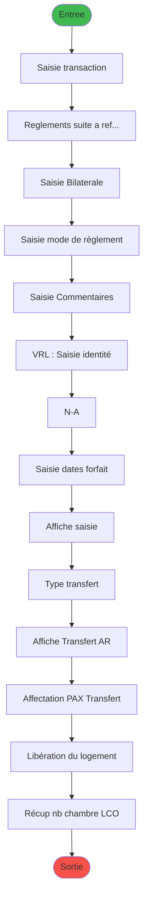
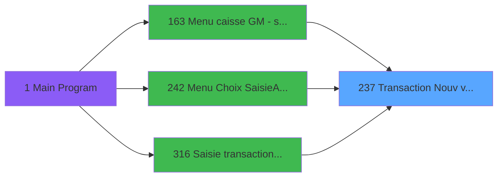
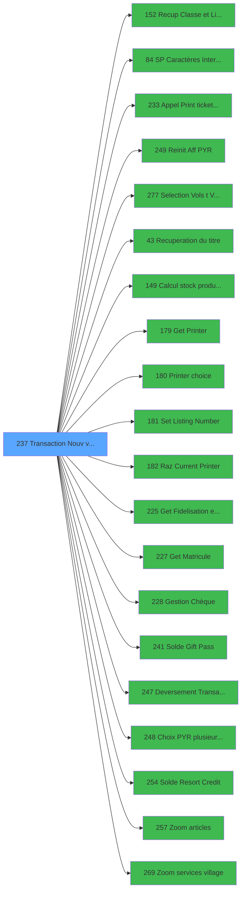

# ADH IDE 237 - Transaction Nouv vente avec GP

> **Analyse**: Phases 1-4 2026-01-28 23:48 -> 11:33 (11h45min) | Assemblage 18:02
> **Pipeline**: V7.0 Deep Analysis
> **Structure**: 4 onglets (Resume | Ecrans | Donnees | Connexions)

<!-- TAB:Resume -->

## 1. FICHE D'IDENTITE

| Attribut | Valeur |
|----------|--------|
| Projet | ADH |
| IDE Position | 237 |
| Nom Programme | Transaction Nouv vente avec GP |
| Fichier source | `Prg_237.xml` |
| Domaine metier | Ventes |
| Taches | 49 (14 ecrans visibles) |
| Tables modifiees | 9 |
| Programmes appeles | 20 |

## 2. DESCRIPTION FONCTIONNELLE

**Transaction Nouv vente avec GP** assure la gestion complete de ce processus, accessible depuis Menu caisse GM - scroll, Menu Choix Saisie/Annul vente, Saisie transaction Nouv vente.

Le flux de traitement s'organise en **10 blocs fonctionnels** :

- **Traitement** (18 taches) : traitements metier divers
- **Saisie** (7 taches) : ecrans de saisie utilisateur (formulaires, champs, donnees)
- **Calcul** (5 taches) : calculs de montants, stocks ou compteurs
- **Creation** (5 taches) : insertion d'enregistrements en base (mouvements, prestations)
- **Transfert** (4 taches) : transferts de donnees entre modules ou deversements
- **Reglement** (4 taches) : gestion des moyens de paiement et reglements
- **Initialisation** (3 taches) : reinitialisation d'etats et de variables de travail
- **Validation** (1 taches) : controles et verifications de coherence
- **Impression** (1 taches) : generation de tickets et documents
- **Consultation** (1 taches) : ecrans de recherche, selection et consultation

Le programme delegue des operations a **20 sous-programmes** couvrant :

- **Calcul de donnees** : Calcul stock produit WS
- **Configuration impression** : Set Listing Number
- **Gestion moyens paiement** : Gestion Chèque
- **Impression ticket/document** : Appel Print ticket vente PMS28, Get Printer, Printer choice (+1)
- **Recuperation donnees** : Recup Classe et Lib du MOP, Recuperation du titre, Get Fidelisation et Remise (+1)
- **Reinitialisation** : Reinit Aff PYR
- **Selection/consultation** : Selection Vols /t Ville à côté, Choix PYR (plusieurs chambres), Zoom articles (+1)
- **Transfert donnees** : Deversement Transaction
- **Validation saisie** :     SP Caractères Interdits
- **Verification solde** : Solde Gift Pass, Solde Resort Credit

**Donnees modifiees** : 9 tables en ecriture (reseau_cloture___rec, prestations, mvt_prestation___mpr, compte_gm________cgm, compteurs________cpt, tempo_ecran_police, stat_lieu_vente_date, Boo_ResultsRechercheHoraire, Table_1037).

**Logique metier** : 17 regles identifiees couvrant conditions metier, calculs avec pourcentages, positionnement dynamique d'UI, valeurs par defaut.

## 3. BLOCS FONCTIONNELS

### 3.1 Saisie (7 taches)

- **Saisie transaction** (T1, Modal, 1112x279)
- **Saisie Bilaterale** (T7, Type6, 326x249)
- **Saisie mode de règlement** (T8, Type6, 506x250)
- **Saisie Commentaires** (T10, Type6, 772x169)
- **VRL : Saisie identité** (T11, MDI, 699x157)
- **Saisie dates forfait** (T19, MDI, 528x121)
- **Affiche saisie** (T30, Modal, 427x124)
- **Sous-programmes**: Appel Print ticket vente PMS28 (IDE 233), Deversement Transaction (IDE 247)
- **Tables modifiees**: prestations, mvt_prestation___mpr, stat_lieu_vente_date
- **Regles metier**: 13 regles associees

### 3.2 Reglement (4 taches)

- **Reglements suite a refus TPE** (T2, Type6, 708x256)
- *Internes*: Verif reglement tpe (T5), Creation reglement (T28), Changement MOP multi paiement (T34)
- **Sous-programmes**: Recup Classe et Lib du MOP (IDE 152), Gestion Chèque (IDE 228)
- **Tables modifiees**: compteurs________cpt
- **Regles metier**: 4 regles associees

### 3.3 Validation (1 taches)

- *Internes*: verif reg restant (T3)
- **Sous-programmes**:     SP Caractères Interdits (IDE 84)
- **Regles metier**: 1 regles associees

### 3.4 Creation (5 taches)

- *Internes*: creation règlement (T4), Creation prestation (T22), Creation Tempo (T27), Creation (T29), Creation_heure_liberation (T47)
- **Tables modifiees**: mvt_prestation___mpr

### 3.5 Traitement (18 taches)

- **** (T18, Modal, 116x32)
- **Libération du logement** (T46, Type0, 123x149)
- **Récup nb chambre /LCO** (T49, Type0, 123x89)
- *Internes*: Dé-Affecition (T6), Test si cloture en cours (T12), Blocage cloture v1 (T13), Blocage cloture v1 (T14), Test reseau (T16), Forfait (T17), Effacement forfait (T20), Effacement mvt forfait (T21), Deblocage cloture v1 (T23), Deblocage cloture (T24), Gratuite ? (T25), garantie? (T31), Supprime enregs non affectés (T41), Affectation Auto (T44), MaJ Num Chèque (T45)
- **Sous-programmes**:     SP Caractères Interdits (IDE 84), Recuperation du titre (IDE 43), Set Listing Number (IDE 181), Get Fidelisation et Remise (IDE 225), Get Matricule (IDE 227), Gestion Chèque (IDE 228), Solde Gift Pass (IDE 241), Solde Resort Credit (IDE 254)

### 3.6 Initialisation (3 taches)

- *Internes*: RAZ 269 (T9), RAZ 269 (T32), RAZ LCO liberation (T48)
- **Sous-programmes**: Reinit Aff PYR (IDE 249)

### 3.7 Calcul (5 taches)

- *Internes*: Reaffichage infos compte (T15), calcul nombre carte (T35), Compte Enregs affectés (T37), Compte Enregs affectés (T42), Compte Enregs affectés (T43)
- **Sous-programmes**: Calcul stock produit WS (IDE 149), Solde Gift Pass (IDE 241), Solde Resort Credit (IDE 254)
- **Tables modifiees**: prestations, mvt_prestation___mpr, compteurs________cpt, stat_lieu_vente_date
- **Regles metier**: 1 regles associees

### 3.8 Consultation (1 taches)

- *Internes*: Recherche imputation/ssimput (T26)
- **Sous-programmes**: Recup Classe et Lib du MOP (IDE 152), Selection Vols /t Ville à côté (IDE 277), Recuperation du titre (IDE 43), Get Fidelisation et Remise (IDE 225), Get Matricule (IDE 227), Choix PYR (plusieurs chambres) (IDE 248), Zoom articles (IDE 257), Zoom services village (IDE 269)

### 3.9 Impression (1 taches)

- *Internes*: Increment Num. Ticket(VRL/VSL) (T33)
- **Sous-programmes**: Appel Print ticket vente PMS28 (IDE 233), Get Printer (IDE 179), Printer choice (IDE 180), Set Listing Number (IDE 181), Raz Current Printer (IDE 182)

### 3.10 Transfert (4 taches)

- **Type transfert** (T38, Type6, 722x292)
- **Affiche Transfert A/R** (T39, Type6, 681x205)
- **Affectation PAX / Transfert** (T40, Type0, 1056x281)
- *Internes*: Raz Affectation Transfert (T36)
- **Sous-programmes**: Deversement Transaction (IDE 247)

## 5. REGLES METIER

17 regles identifiees:

### Conditions metier (14)

- **[RM-001]** Determine le sens du trajet selon le service village (1=ALLER, 2=RETOUR, 3=A/R)
- **[RM-002]** Si V.RC utilisé [GA] est nul, choix conditionnel selon W0 imputation [W] (valeur 'VSL')
- **[RM-004]** Si VG7 OR VG35 OR VG87 alors 'P0 masque montant [C]'FORM sinon 'P0 devise locale [B]'FORM)
- **[RM-005]** Si W0 Motif de non enreg NA [CL] est FAUX, branche alternative
- **[RM-006]** Si W0 imputation [W] vaut 'VRL' alors 'Date consommation', sinon 'Date début séjour'
- **[RM-008]** Comportement conditionnel selon type d'imputation 'VRL'
- **[RM-010]** Comportement conditionnel selon type d'imputation 'TRF'
- **[RM-011]** Si W0 Chambre [CX]<>'' alors RTrim (W0 Nb Chambres [CW])&Fill (' ' sinon Len (RTrim (W0 Nb Chambres [CW]))-1)&RTrim (W0 Chambre [CX])&' '&W0 PYR Valide [CY],Trim(P0 Nom & prenom [K]))
- **[RM-012]** Si V.Total reglement ligne [FF] alors V.Id transaction PMS [FI] sinon VG18)
- **[RM-013]** Si V.ConfirmeUseGP? [FZ] alors 'V' sinon IF([AP]='O','C','D'))
- **[RM-014]** Si NOT(CHG_PRV_W0 nbre articles [GO]) alors 132.875 sinon 105.875)
- **[RM-015]** Si W0 imputation [W] vaut 'ANN' alors 'O', sinon 'N'
- **[RM-016]** Comportement conditionnel selon type d'imputation 'PYR'
- **[RM-017]** Si VG20>1 alors [AY] sinon 'G')

### Calculs (1)

- **[RM-007]** Calcul de pourcentage avec arrondi

### Positionnement UI (1)

- **[RM-009]** Position UI conditionnelle selon W0 imputation [W]

### Valeurs par defaut (1)

- **[RM-003]** Valeur par defaut si P0 masque montant [C] est vide

## 6. CONTEXTE

- **Appele par**: Menu caisse GM - scroll (IDE 163), Menu Choix Saisie/Annul vente (IDE 242), Saisie transaction Nouv vente (IDE 316)
- **Appelle**: 20 programmes | **Tables**: 30 (W:9 R:13 L:18) | **Taches**: 49 | **Expressions**: 305

<!-- TAB:Ecrans -->

## 8. ECRANS

### 8.1 Forms visibles (14 / 49)

| # | Tache | Nom | Type | Largeur | Hauteur |
|---|-------|-----|------|---------|---------|
| 1 | 1 | Saisie transaction | Modal | 1112 | 279 |
| 2 | 2 | Reglements suite a refus TPE | Type6 | 708 | 256 |
| 3 | 7 | Saisie Bilaterale | Type6 | 326 | 249 |
| 4 | 8 | Saisie mode de règlement | Type6 | 506 | 250 |
| 5 | 10 | Saisie Commentaires | Type6 | 772 | 169 |
| 6 | 11 | VRL : Saisie identité | MDI | 699 | 157 |
| 7 | 18 |  | Modal | 116 | 32 |
| 8 | 19 | Saisie dates forfait | MDI | 528 | 121 |
| 9 | 30 | Affiche saisie | Modal | 427 | 124 |
| 10 | 38 | Type transfert | Type6 | 722 | 292 |
| 11 | 39 | Affiche Transfert A/R | Type6 | 681 | 205 |
| 12 | 40 | Affectation PAX / Transfert | Type0 | 1056 | 281 |
| 13 | 46 | Libération du logement | Type0 | 123 | 149 |
| 14 | 49 | Récup nb chambre /LCO | Type0 | 123 | 89 |

### 8.2 Mockups Ecrans

```
+======================================================+
| Saisie transaction [Modal] 1112x279 - Tache 1        |
+------------------------------------------------------+
|  [Phase 2: controles reels]                          |
|                                                      |
|                                                      |
|                                                      |
|                                                      |
+======================================================+

+=================================+
| Reglements suite a refus TPE ... |
+---------------------------------+
|  [Phase 2: controles reels]     |
|                                 |
|                                 |
|                                 |
|                                 |
+=================================+

+============================+
| Saisie Bilaterale [Type6... |
+----------------------------+
|  [Phase 2: controles reels]|
|                            |
|                            |
|                            |
|                            |
+============================+

+============================+
| Saisie mode de règlement... |
+----------------------------+
|  [Phase 2: controles reels]|
|                            |
|                            |
|                            |
|                            |
+============================+

+=====================================+
| Saisie Commentaires [Type6] 772x1... |
+-------------------------------------+
|  [Phase 2: controles reels]         |
|                                     |
|                                     |
|                                     |
+=====================================+

+=================================+
| VRL : Saisie identité [MDI] 6... |
+---------------------------------+
|  [Phase 2: controles reels]     |
|                                 |
|                                 |
|                                 |
+=================================+

+============================+
|  [Modal] 116x32 - Tache 18 |
+----------------------------+
|  [Phase 2: controles reels]|
|                            |
|                            |
|                            |
+============================+

+============================+
| Saisie dates forfait [MD... |
+----------------------------+
|  [Phase 2: controles reels]|
|                            |
|                            |
|                            |
+============================+

+============================+
| Affiche saisie [Modal] 4... |
+----------------------------+
|  [Phase 2: controles reels]|
|                            |
|                            |
|                            |
+============================+

+==================================+
| Type transfert [Type6] 722x292... |
+----------------------------------+
|  [Phase 2: controles reels]      |
|                                  |
|                                  |
|                                  |
|                                  |
+==================================+

+================================+
| Affiche Transfert A/R [Type6... |
+--------------------------------+
|  [Phase 2: controles reels]    |
|                                |
|                                |
|                                |
+================================+

+===================================================+
| Affectation PAX / Transfert [Type0] 1056x281 - ... |
+---------------------------------------------------+
|  [Phase 2: controles reels]                       |
|                                                   |
|                                                   |
|                                                   |
|                                                   |
+===================================================+

+============================+
| Libération du logement [... |
+----------------------------+
|  [Phase 2: controles reels]|
|                            |
|                            |
|                            |
+============================+

+============================+
| Récup nb chambre /LCO [T... |
+----------------------------+
|  [Phase 2: controles reels]|
|                            |
|                            |
|                            |
+============================+

```

## 9. NAVIGATION

### 9.1 Enchainement des ecrans



### 9.2 Logique decisionnelle

```mermaid
flowchart TD
    START([Debut traitement])
    style START fill:#3fb950
    D1{Determine le sens du t...}
    style D1 fill:#58a6ff
    START --> D1
    A1[RM-001 Appliquer]
    D1 -->|OUI| A1
    D1 -->|NON| N1((.))
    A1 --> N1
    D2{Si V.RC utilisé GA est...}
    style D2 fill:#58a6ff
    N1 --> D2
    A2[RM-002 Appliquer]
    D2 -->|OUI| A2
    D2 -->|NON| N2((.))
    A2 --> N2
    D3{Valeur par defaut si P...}
    style D3 fill:#58a6ff
    N2 --> D3
    A3[RM-003 Appliquer]
    D3 -->|OUI| A3
    D3 -->|NON| N3((.))
    A3 --> N3
    D4{Si VG7 OR VG35 OR VG87...}
    style D4 fill:#58a6ff
    N3 --> D4
    A4[RM-004 Appliquer]
    D4 -->|OUI| A4
    D4 -->|NON| N4((.))
    A4 --> N4
    D5{Si W0 Motif de non enr...}
    style D5 fill:#58a6ff
    N4 --> D5
    A5[RM-005 Appliquer]
    D5 -->|OUI| A5
    D5 -->|NON| N5((.))
    A5 --> N5
    D6{Si W0 imputation W vau...}
    style D6 fill:#58a6ff
    N5 --> D6
    A6[RM-006 Appliquer]
    D6 -->|OUI| A6
    D6 -->|NON| N6((.))
    A6 --> N6
    D7{Calcul de pourcentage ...}
    style D7 fill:#58a6ff
    N6 --> D7
    A7[RM-007 Appliquer]
    D7 -->|OUI| A7
    D7 -->|NON| N7((.))
    A7 --> N7
    D8{Comportement condition...}
    style D8 fill:#58a6ff
    N7 --> D8
    A8[RM-008 Appliquer]
    D8 -->|OUI| A8
    D8 -->|NON| N8((.))
    A8 --> N8
    MORE[+ 9 autres regles]
    N8 --> MORE
    ENDOK([Fin traitement])
    style ENDOK fill:#f85149
    MORE --> ENDOK
```



**Legende:**

- **D1** (RM-001): Determine le sens du trajet selon le service village (1=ALLER, 2=RETOUR, 3=A/R)
- **D2** (RM-002): Si V.RC utilisé [GA] est nul, choix conditionnel selon W0 imputation [W] (valeur 'VSL')
- **D3** (RM-003): Valeur par defaut si P0 masque montant [C] est vide
- **D4** (RM-004): Si VG7 OR VG35 OR VG87 alors 'P0 masque montant [C]'FORM sinon 'P0 devise locale [B]'FORM)
- **D5** (RM-005): Si W0 Motif de non enreg NA [CL] est FAUX, branche alternative
- **D6** (RM-006): Si W0 imputation [W] vaut 'VRL' alors 'Date consommation', sinon 'Date début séjour'
- **D7** (RM-007): Calcul de pourcentage avec arrondi
- **D8** (RM-008): Comportement conditionnel selon type d'imputation 'VRL'

### 9.3 Structure hierarchique (49 taches)

- **237.1** Saisie transaction **[ECRAN]** (Modal) 1112x279 *[Saisie]*
- **237.2** Reglements suite a refus TPE **[ECRAN]** (Type6) 708x256 *[Reglement]*
- **237.3** verif reg restant   *[Validation]*
- **237.4** creation règlement   *[Creation]*
- **237.5** Verif reglement tpe   *[Reglement]*
- **237.6** Dé-Affecition   *[Traitement]*
- **237.7** Saisie Bilaterale **[ECRAN]** (Type6) 326x249 *[Saisie]*
- **237.8** Saisie mode de règlement **[ECRAN]** (Type6) 506x250 *[Saisie]*
- **237.9** RAZ 269  (MDI) *[Initialisation]*
- **237.10** Saisie Commentaires **[ECRAN]** (Type6) 772x169 *[Saisie]*
- **237.11** VRL : Saisie identité **[ECRAN]** (MDI) 699x157 *[Saisie]*
- **237.12** Test si cloture en cours  (MDI) *[Traitement]*
- **237.13** Blocage cloture v1  (MDI) *[Traitement]*
- **237.14** Blocage cloture v1  (MDI) *[Traitement]*
- **237.15** Reaffichage infos compte  (MDI) *[Calcul]*
- **237.16** Test reseau  (MDI) *[Traitement]*
- **237.17** Forfait  (MDI) *[Traitement]*
- **237.18** (sans nom) **[ECRAN]** (Modal) 116x32 *[Traitement]*
- **237.19** Saisie dates forfait **[ECRAN]** (MDI) 528x121 *[Saisie]*
- **237.20** Effacement forfait  (MDI) *[Traitement]*
- **237.21** Effacement mvt forfait  (MDI) *[Traitement]*
- **237.22** Creation prestation  (MDI) *[Creation]*
- **237.23** Deblocage cloture v1  (MDI) *[Traitement]*
- **237.24** Deblocage cloture  (MDI) *[Traitement]*
- **237.25** Gratuite ?  (MDI) *[Traitement]*
- **237.26** Recherche imputation/ssimput  (MDI) *[Consultation]*
- **237.27** Creation Tempo  (MDI) *[Creation]*
- **237.28** Creation reglement   *[Reglement]*
- **237.29** Creation   *[Creation]*
- **237.30** Affiche saisie **[ECRAN]** (Modal) 427x124 *[Saisie]*
- **237.31** garantie?  (MDI) *[Traitement]*
- **237.32** RAZ 269  (MDI) *[Initialisation]*
- **237.33** Increment Num. Ticket(VRL/VSL)   *[Impression]*
- **237.34** Changement MOP multi paiement   *[Reglement]*
- **237.35** calcul nombre carte   *[Calcul]*
- **237.36** Raz Affectation Transfert   *[Transfert]*
- **237.37** Compte Enregs affectés   *[Calcul]*
- **237.38** Type transfert **[ECRAN]** (Type6) 722x292 *[Transfert]*
- **237.39** Affiche Transfert A/R **[ECRAN]** (Type6) 681x205 *[Transfert]*
- **237.40** Affectation PAX / Transfert **[ECRAN]**  1056x281 *[Transfert]*
- **237.41** Supprime enregs non affectés   *[Traitement]*
- **237.42** Compte Enregs affectés   *[Calcul]*
- **237.43** Compte Enregs affectés   *[Calcul]*
- **237.44** Affectation Auto   *[Traitement]*
- **237.45** MaJ Num Chèque   *[Traitement]*
- **237.46** Libération du logement **[ECRAN]**  123x149 *[Traitement]*
- **237.47** Creation_heure_liberation   *[Creation]*
- **237.48** RAZ LCO liberation   *[Initialisation]*
- **237.49** Récup nb chambre /LCO **[ECRAN]**  123x89 *[Traitement]*

<!-- TAB:Donnees -->

## 10. TABLES

### 10.1 Tables utilisees (30)

| ID | Nom | Description | Type | R | W | L | Usages |
|----|-----|-------------|------|---|---|---|--------|
| 23 | reseau_cloture___rec | Donnees reseau/cloture | DB | R | **W** |   | 5 |
| 26 | comptes_speciaux_spc | Comptes GM (generaux) | DB |   |   | L | 1 |
| 30 | gm-recherche_____gmr | Index de recherche | DB | R |   | L | 3 |
| 32 | prestations | Prestations/services vendus | DB | R | **W** |   | 3 |
| 34 | hebergement______heb | Hebergement (chambres) | DB |   |   | L | 1 |
| 39 | depot_garantie___dga | Depots et garanties | DB | R |   |   | 1 |
| 46 | mvt_prestation___mpr | Prestations/services vendus | DB |   | **W** | L | 2 |
| 47 | compte_gm________cgm | Comptes GM (generaux) | DB |   | **W** |   | 2 |
| 50 | moyens_reglement_mor |  | DB | R |   |   | 3 |
| 67 | tables___________tab |  | DB |   |   | L | 1 |
| 68 | compteurs________cpt | Comptes GM (generaux) | DB |   | **W** |   | 1 |
| 70 | date_comptable___dat |  | DB |   |   | L | 1 |
| 77 | articles_________art |  | DB | R |   | L | 4 |
| 79 | gratuites________gra |  | DB | R |   |   | 1 |
| 89 | moyen_paiement___mop |  | DB | R |   | L | 8 |
| 96 | table_prestation_pre | Prestations/services vendus | DB |   |   | L | 1 |
| 103 | logement_client__loc |  | DB | R |   |   | 1 |
| 109 | table_utilisateurs |  | DB | R |   |   | 1 |
| 139 | moyens_reglement_mor |  | DB | R |   |   | 1 |
| 140 | moyen_paiement___mop |  | DB |   |   | L | 1 |
| 197 | articles_en_stock |  | DB |   |   | L | 1 |
| 372 | pv_budget |  | DB |   |   | L | 1 |
| 596 | tempo_ecran_police | Table temporaire ecran | TMP | R | **W** | L | 7 |
| 697 | droits_applications |  | DB |   |   | L | 1 |
| 728 | arc_cc_total |  | DB |   |   | L | 1 |
| 801 | moyens_reglement_complem |  | DB |   |   | L | 1 |
| 818 | Circuit supprime |  | DB |   |   | L | 1 |
| 847 | stat_lieu_vente_date | Statistiques point de vente | TMP |   | **W** | L | 13 |
| 899 | Boo_ResultsRechercheHoraire | Index de recherche | DB | R | **W** |   | 8 |
| 1037 | Table_1037 |  | MEM |   | **W** |   | 3 |

### 10.2 Colonnes par table

*[Phase 2] Analyse des colonnes lues (R) et modifiees (W) par table avec details depliables.*

## 11. VARIABLES

### 11.1 Variables principales (Top 20 par usage / 171)

| Cat | Lettre | Nom Variable | Type | Usages | Ref |
|-----|--------|--------------|------|--------|-----|
| W0 | **W** | W0 imputation | Numeric | 68x | `{0,23}` |
| Autre | **Q** | Bouton ABANDON | Alpha | 16x | `{0,17}` |
| W0 | **DP** | W0 forfait (O/N) | Alpha | 10x | `{0,120}` |
| V. | **GA** | V.RC utilisé | Logical | 10x | `{0,183}` |
| W0 | **CO** | W0 Titre | Alpha | 9x | `{0,93}` |
| W0 | **CL** | W0 Motif de non enreg NA | Numeric | 8x | `{0,90}` |
| W0 | **DO** | W0 fin tache | Alpha | 7x | `{0,119}` |
| W0 | **U** | W0 code article | Numeric | 6x | `{0,21}` |
| W0 | **CR** | W0 Num rue | Alpha | 6x | `{0,96}` |
| W0 | **CQ** | W0 Prenom | Alpha | 6x | `{0,95}` |
| W0 | **CP** | W0 Nom | Alpha | 6x | `{0,94}` |
| V. | **GE** | v.Flag exist Vte LCO | Logical | 6x | `{0,187}` |
| V. | **FZ** | V.ConfirmeUseGP? | Numeric | 5x | `{0,182}` |
| W0 | **R** | W0 FIN SAISIE OD | Logical | 5x | `{0,18}` |
| W0 | **EF** | W0 Total_GiftPass | Numeric | 5x | `{0,136}` |
| W0 | **DV** | W0 gratuite ? | Alpha | 5x | `{0,126}` |
| W0 | **DF** | W0 montant | Numeric | 4x | `{0,110}` |
| P0 | **G** | P0 date fin sejour | Date | 4x | `{0,7}` |
| W0 | **BD** | W0 nbre articles | Numeric | 4x | `{0,56}` |
| Autre | **GO** | CHG_PRV_W0 nbre articles | Numeric | 4x | `{0,197}` |

### 11.2 Toutes les variables (171)

<details>
<summary>Voir les 171 variables</summary>

| Cat | Lettre | Nom Variable | Type | Ref |
|-----|--------|--------------|------|-----|
| Autre | **P** | Bouton IDENTITE | Alpha | `{0,16}` |
| Autre | **Q** | Bouton ABANDON | Alpha | `{0,17}` |
| Autre | **S** | Bouton FIN SAISIE OD | Alpha | `{0,19}` |
| Autre | **DH** | Existe mode de paiement | Logical | `{0,112}` |
| Autre | **DJ** | WO Classe MOP | Alpha | `{0,114}` |
| Autre | **DK** | V0 memo-service | Alpha | `{0,115}` |
| Autre | **DL** | V0 memo-nom GM | Alpha | `{0,116}` |
| Autre | **DM** | V0 validation | Logical | `{0,117}` |
| Autre | **EN** | Bouton Ok | Alpha | `{0,144}` |
| Autre | **ES** | Nbre ecriture | Numeric | `{0,149}` |
| Autre | **FQ** | b.type de transfert | Alpha | `{0,173}` |
| Autre | **GK** | CHG_REASON_W0 libelle article | Numeric | `{0,193}` |
| Autre | **GL** | CHG_PRV_W0 libelle article | Alpha | `{0,194}` |
| Autre | **GM** | P.Toute ligne | Logical | `{0,195}` |
| Autre | **GN** | CHG_REASON_W0 nbre articles | Numeric | `{0,196}` |
| Autre | **GO** | CHG_PRV_W0 nbre articles | Numeric | `{0,197}` |
| P0 | **A** | P0 societe | Alpha | `{0,1}` |
| P0 | **B** | P0 devise locale | Alpha | `{0,2}` |
| P0 | **C** | P0 masque montant | Alpha | `{0,3}` |
| P0 | **D** | P0 solde compte | Numeric | `{0,4}` |
| P0 | **E** | P0 code GM | Numeric | `{0,5}` |
| P0 | **F** | P0 filiation | Numeric | `{0,6}` |
| P0 | **G** | P0 date fin sejour | Date | `{0,7}` |
| P0 | **H** | P0 etat compte | Alpha | `{0,8}` |
| P0 | **I** | P0 date solde | Date | `{0,9}` |
| P0 | **J** | P0 garanti O/N | Alpha | `{0,10}` |
| P0 | **K** | P0 Nom & prenom | Alpha | `{0,11}` |
| P0 | **L** | P0 UNI/BI | Alpha | `{0,12}` |
| P0 | **M** | P0.Date debut sejour | Date | `{0,13}` |
| P0 | **N** | P0.Valide ? | Numeric | `{0,14}` |
| P0 | **O** | P0.Nb decimales | Numeric | `{0,15}` |
| V. | **V** | v.SoldeGiftPass | Numeric | `{0,22}` |
| V. | **BI** | v Sens Transfert Global | Alpha | `{0,61}` |
| V. | **BJ** | v.Date activité VAE | Date | `{0,62}` |
| V. | **BK** | v.VAE pendant le séjour ? | Logical | `{0,63}` |
| V. | **BL** | v.Matin/Après midi | Unicode | `{0,64}` |
| V. | **ED** | v. titre | Alpha | `{0,134}` |
| V. | **EP** | V.VADA ? | Logical | `{0,146}` |
| V. | **EQ** | V.VADV ? | Logical | `{0,147}` |
| V. | **ER** | V.VAD ? | Logical | `{0,148}` |
| V. | **ET** | V.Reglement premier article | Alpha | `{0,150}` |
| V. | **EU** | V.Type premier article | Alpha | `{0,151}` |
| V. | **EV** | V.Premier article VSL NA ? | Logical | `{0,152}` |
| V. | **EW** | V.Article VSL NA ? | Logical | `{0,153}` |
| V. | **EX** | v.IncrémentTicket(VRL/VSL) OK | Logical | `{0,154}` |
| V. | **EY** | v.IncrémentTicket(VTE) OK | Logical | `{0,155}` |
| V. | **EZ** | v.NumeroTicket(VRL/VSL) | Numeric | `{0,156}` |
| V. | **FA** | v.NumeroTicket(VTE) | Numeric | `{0,157}` |
| V. | **FB** | v Réponse mode paiement | Numeric | `{0,158}` |
| V. | **FC** | V Nbre de Ligne Saisies | Numeric | `{0,159}` |
| V. | **FD** | v Nbre ligne de reglement Saisi | Numeric | `{0,160}` |
| V. | **FE** | V.Num ligne vente | Numeric | `{0,161}` |
| V. | **FF** | V.Total reglement ligne | Numeric | `{0,162}` |
| V. | **FG** | V.Multi reglement ligne | Logical | `{0,163}` |
| V. | **FH** | V.MOP TPE | Alpha | `{0,164}` |
| V. | **FI** | V.Id transaction PMS | Alpha | `{0,165}` |
| V. | **FJ** | V.Id transaction AXIS | Alpha | `{0,166}` |
| V. | **FK** | V.Num Autorisation | Alpha | `{0,167}` |
| V. | **FL** | V.Transaction TPE validee | Logical | `{0,168}` |
| V. | **FM** | V.Message erreur transac TPE | Alpha | `{0,169}` |
| V. | **FN** | V.Total carte | Numeric | `{0,170}` |
| V. | **FO** | V.Transaction ok | Logical | `{0,171}` |
| V. | **FP** | V.Nombre de carte | Numeric | `{0,172}` |
| V. | **FR** | v is the First time | Numeric | `{0,174}` |
| V. | **FS** | v.Montant-giftPass | Numeric | `{0,175}` |
| V. | **FT** | v.email GM pour VAD | Alpha | `{0,176}` |
| V. | **FU** | V.N°Ticket OD | Numeric | `{0,177}` |
| V. | **FV** | V.N°Ticket Autres Moyen Paie | Numeric | `{0,178}` |
| V. | **FW** | V.Num Cheque | Unicode | `{0,179}` |
| V. | **FX** | V.SoldeResortCredit | Numeric | `{0,180}` |
| V. | **FY** | V.Confirm Use Resort Credit | Numeric | `{0,181}` |
| V. | **FZ** | V.ConfirmeUseGP? | Numeric | `{0,182}` |
| V. | **GA** | V.RC utilisé | Logical | `{0,183}` |
| V. | **GB** | v.Token Id | Unicode | `{0,184}` |
| V. | **GC** | v.Transaction Id | Unicode | `{0,185}` |
| V. | **GD** | v.Nb chambres /LCO | Numeric | `{0,186}` |
| V. | **GE** | v.Flag exist Vte LCO | Logical | `{0,187}` |
| V. | **GF** | v.Flag abandon libération | Logical | `{0,188}` |
| V. | **GG** | v. pied stype? | Logical | `{0,189}` |
| V. | **GH** | v. pied type? | Logical | `{0,190}` |
| V. | **GI** | v. type a utiliser | Unicode | `{0,191}` |
| V. | **GJ** | v. stype a utiliser | Unicode | `{0,192}` |
| W0 | **R** | W0 FIN SAISIE OD | Logical | `{0,18}` |
| W0 | **T** | W0 Cloture en cours | Logical | `{0,20}` |
| W0 | **U** | W0 code article | Numeric | `{0,21}` |
| W0 | **W** | W0 imputation | Numeric | `{0,23}` |
| W0 | **X** | W0 sous-imput. | Numeric | `{0,24}` |
| W0 | **Y** | W0 date d'achat | Date | `{0,25}` |
| W0 | **Z** | W0 annulation | Alpha | `{0,26}` |
| W0 | **BA** | W0 service village | Alpha | `{0,53}` |
| W0 | **BB** | W0 libelle article | Alpha | `{0,54}` |
| W0 | **BC** | W0 article dernière minute | Logical | `{0,55}` |
| W0 | **BD** | W0 nbre articles | Numeric | `{0,56}` |
| W0 | **BE** | W0 prix unitaire | Numeric | `{0,57}` |
| W0 | **BF** | W0 Categorie de chambre | Alpha | `{0,58}` |
| W0 | **BG** | W0 Lieu sejour | Alpha | `{0,59}` |
| W0 | **BH** | W0 Code reduction | Alpha | `{0,60}` |
| W0 | **BM** | W0 Sens du transfert Aller | Alpha | `{0,65}` |
| W0 | **BN** | W0 Date du transfert Aller | Date | `{0,66}` |
| W0 | **BO** | W0 Heure du transfert Aller | Time | `{0,67}` |
| W0 | **BP** | W0 b.Date du transfert | Alpha | `{0,68}` |
| W0 | **BQ** | W0 Type d'endroit Aller | Alpha | `{0,69}` |
| W0 | **BR** | W0 Code Gare/Aéroport Aller | Alpha | `{0,70}` |
| W0 | **BS** | W0 Numéro du vol Aller | Alpha | `{0,71}` |
| W0 | **BT** | W0 Compagnie Aller | Alpha | `{0,72}` |
| W0 | **BU** | W0 Commentaire Aller | Alpha | `{0,73}` |
| W0 | **BV** | W0 Sens du transfert Retour | Alpha | `{0,74}` |
| W0 | **BW** | W0 Date du transfert Retour | Date | `{0,75}` |
| W0 | **BX** | W0 Heure du transfert Retour | Time | `{0,76}` |
| W0 | **BY** | W0 Type d'endroit Retour | Alpha | `{0,77}` |
| W0 | **BZ** | W0 Code Gare/Aéroport Retour | Alpha | `{0,78}` |
| W0 | **CA** | W0 Numéro du vol Retour | Alpha | `{0,79}` |
| W0 | **CB** | W0 Compagnie Retour | Alpha | `{0,80}` |
| W0 | **CC** | W0 b.Saisie PAX | Alpha | `{0,81}` |
| W0 | **CD** | W0 Nbre de PAX enregistré | Numeric | `{0,82}` |
| W0 | **CE** | W0 Commentaire Retour | Alpha | `{0,83}` |
| W0 | **CF** | W0 montant avant reduction | Numeric | `{0,84}` |
| W0 | **CG** | W0 Pourcentage reduction | Numeric | `{0,85}` |
| W0 | **CH** | W0 Remise Obligatoire | Numeric | `{0,86}` |
| W0 | **CI** | W0 Montant reduction | Numeric | `{0,87}` |
| W0 | **CJ** | W0.Date consommation | Date | `{0,88}` |
| W0 | **CK** | W0.Date fin sejour | Date | `{0,89}` |
| W0 | **CL** | W0 Motif de non enreg NA | Numeric | `{0,90}` |
| W0 | **CM** | W0 Commentaire | Alpha | `{0,91}` |
| W0 | **CN** | W0 Motif annulation | Alpha | `{0,92}` |
| W0 | **CO** | W0 Titre | Alpha | `{0,93}` |
| W0 | **CP** | W0 Nom | Alpha | `{0,94}` |
| W0 | **CQ** | W0 Prenom | Alpha | `{0,95}` |
| W0 | **CR** | W0 Num rue | Alpha | `{0,96}` |
| W0 | **CS** | W0 Nom de la rue | Alpha | `{0,97}` |
| W0 | **CT** | W0 Commune | Alpha | `{0,98}` |
| W0 | **CU** | W0 CP | Alpha | `{0,99}` |
| W0 | **CV** | W0 Ville | Alpha | `{0,100}` |
| W0 | **CW** | W0 Nb Chambres | Numeric | `{0,101}` |
| W0 | **CX** | W0 Chambre | Unicode | `{0,102}` |
| W0 | **CY** | W0 PYR Valide | Logical | `{0,103}` |
| W0 | **CZ** | W0 Lib Bouton Chambre | Unicode | `{0,104}` |
| W0 | **DA** | W0 Vendeur | Unicode | `{0,105}` |
| W0 | **DB** | W0 libelle supplem | Alpha | `{0,106}` |
| W0 | **DC** | W0 libelle supplem pour édition | Alpha | `{0,107}` |
| W0 | **DD** | W0 article trouve | Logical | `{0,108}` |
| W0 | **DE** | W0 Stock produit | Numeric | `{0,109}` |
| W0 | **DF** | W0 montant | Numeric | `{0,110}` |
| W0 | **DG** | W0 mode de paiement | Alpha | `{0,111}` |
| W0 | **DI** | W0 Libelle MOP | Alpha | `{0,113}` |
| W0 | **DN** | W0 reseau | Alpha | `{0,118}` |
| W0 | **DO** | W0 fin tache | Alpha | `{0,119}` |
| W0 | **DP** | W0 forfait (O/N) | Alpha | `{0,120}` |
| W0 | **DQ** | W0 effacement (O/N) | Alpha | `{0,121}` |
| W0 | **DR** | W0 forfait date(O/N) | Alpha | `{0,122}` |
| W0 | **DS** | W0 code forfait | Alpha | `{0,123}` |
| W0 | **DT** | W0 date debut | Date | `{0,124}` |
| W0 | **DU** | W0 date fin | Date | `{0,125}` |
| W0 | **DV** | W0 gratuite ? | Alpha | `{0,126}` |
| W0 | **DW** | W0 ret lien special | Numeric | `{0,127}` |
| W0 | **DX** | W0 Code Devise | Numeric | `{0,128}` |
| W0 | **DY** | W0 Retour Transmission TPE | Logical | `{0,129}` |
| W0 | **DZ** | W0 Forcer Transaction Manuelle | Logical | `{0,130}` |
| W0 | **EA** | W0 Message TPE | Alpha | `{0,131}` |
| W0 | **EB** | W0 Retour Lecture TPE | Logical | `{0,132}` |
| W0 | **EC** | W0 Fin Transaction TPE | Logical | `{0,133}` |
| W0 | **EE** | W0 Total_Vente | Numeric | `{0,135}` |
| W0 | **EF** | W0 Total_GiftPass | Numeric | `{0,136}` |
| W0 | **EG** | W0 Annulation OD active | Logical | `{0,137}` |
| W0 | **EH** | W0 Compte garanti | Logical | `{0,138}` |
| W0 | **EI** | W0 confirmation si non garanti | Numeric | `{0,139}` |
| W0 | **EJ** | W0 Abandon | Logical | `{0,140}` |
| W0 | **EK** | W0 validation | Logical | `{0,141}` |
| W0 | **EL** | W0 choix personne absente | Numeric | `{0,142}` |
| W0 | **EM** | W0 choix transac manuelle | Numeric | `{0,143}` |
| W0 | **EO** | W0 Lien Logement Lieu Séjour | Logical | `{0,145}` |

</details>

## 12. EXPRESSIONS

**305 / 305 expressions decodees (100%)**

### 12.1 Repartition par bloc

| Bloc fonctionnel | Expressions | Regles |
|-----------------|-------------|--------|
| Saisie | 26 | 4 |
| Reglement | 27 | 4 |
| Validation | 6 | 4 |
| Impression | 1 | 0 |
| Calcul | 2 | 4 |
| Consultation | 1 | 0 |
| Transfert | 4 | 0 |
| Autre | 238 | 10 |

### 12.2 Expressions cles par bloc

#### Saisie (26 expressions)

| Type | IDE | Expression | Regle |
|------|-----|------------|-------|
| CONDITION | 225 | `IF (NOT(CHG_PRV_W0 nbre articles [GO]),132.875,105.875)` | RM-014 |
| CALCULATION | 247 | `V.Transaction ok [FO]-1` | - |
| CALCULATION | 284 | `W0 libelle article [BB]='00/00/0000'DATE` | - |
| OTHER | 209 | `V Nbre de Ligne Saisies [FC]` | - |
| OTHER | 245 | `W0 Stock produit [DE]=1` | - |
| ... | | *+21 autres* | |

#### Reglement (27 expressions)

| Type | IDE | Expression | Regle |
|------|-----|------------|-------|
| CONDITION | 154 | `IF(V.Total reglement ligne [FF],V.Id transaction PMS [FI],VG18)` | RM-012 |
| CONDITION | 92 | `IF(VG7 OR VG35 OR VG87,'P0 masque montant [C]'FORM,'P0 devise locale [B]'FORM)` | RM-004 |
| CONDITION | 35 | `IF (P0 masque montant [C]='','15.2',P0 masque montant [C])` | RM-003 |
| CONDITION | 272 | `IF(W0 imputation [W]='PYR',NOT(W0 mode de paiement [DG]),'FALSE'LOG)` | RM-016 |
| CALCULATION | 246 | `V.Total carte [FN]+1` | - |
| ... | | *+22 autres* | |

#### Validation (6 expressions)

| Type | IDE | Expression | Regle |
|------|-----|------------|-------|
| CONDITION | 147 | `IF(W0 Chambre [CX]<>'',RTrim (W0 Nb Chambres [CW])&Fill (' ',Len (RTrim (W0 Nb Chambres [CW]))-1)&RTrim (W0 Chambre [CX])&' '&W0 PYR Valide [CY],Trim(P0 Nom & prenom [K]))` | RM-011 |
| CONSTANT | 203 | `'Des informations du transfert Retour ne sont pas saisies . Validation impossible '` | - |
| CONSTANT | 202 | `'Des informations du transfert Aller ne sont pas saisies . Validation impossible '` | - |
| OTHER | 194 | `[AV]<>W0 Remise Obligatoire [CH]` | - |
| OTHER | 23 | `V0 validation [DM] AND [AP]='N'` | - |
| ... | | *+1 autres* | |

#### Impression (1 expressions)

| Type | IDE | Expression | Regle |
|------|-----|------------|-------|
| OTHER | 219 | `V.Nombre de carte [FP] OR V.N°Ticket OD [FU]` | - |

#### Calcul (2 expressions)

| Type | IDE | Expression | Regle |
|------|-----|------------|-------|
| CONDITION | 114 | `IF(W0 Titre [CO]<>0 AND NOT(W0 Motif de non enreg NA [CL]),Fix(W0 Motif annulation [CN]*W0 Titre [CO]/100,11,P0.Nb decimales [O]),W0 Prenom [CQ])` | RM-007 |
| CALCULATION | 153 | `NOT W0 Motif de non enreg NA [CL] AND W0 Titre [CO]<>0 AND (W0 Prenom [CQ]<Fix(W0 Motif annulation [CN]*W0 Titre [CO]/100,11,P0.Nb decimales [O])-1 OR W0 Prenom [CQ]>Fix(W0 Motif annulation [CN]*W0 Titre [CO]/100,11,P0.Nb decimales [O])+1)` | - |

#### Consultation (1 expressions)

| Type | IDE | Expression | Regle |
|------|-----|------------|-------|
| STRING | 8 | `Trim (W0 choix transac manuelle [EM])` | - |

#### Transfert (4 expressions)

| Type | IDE | Expression | Regle |
|------|-----|------------|-------|
| CALCULATION | 204 | `W0 Code Gare/Aéroport ... [BR]='00/00/0000'DATE OR W0 Numéro du vol Aller [BS]='00:00:00'TIME OR W0 Commentaire Aller [BU]='' OR W0 Sens du transfert R... [BV]='' OR W0 Date du transfert R... [BW]='' OR W0 Heure du transfert ... [BX]=''` | - |
| OTHER | 289 | `NOT v Sens Transfert Global [BI]` | - |
| OTHER | 216 | `W0 b.Date du transfert [BP]` | - |
| OTHER | 214 | `W0 Heure du transfert ... [BO]` | - |

#### Autre (238 expressions)

| Type | IDE | Expression | Regle |
|------|-----|------------|-------|
| CONDITION | 290 | `IF(VG20>1,[AY],'G')` | RM-017 |
| CONDITION | 120 | `IF(W0 imputation [W]='VRL' OR W0 imputation [W]='VSL','Nb forfait',IF(W0 imputation [W]='TRF', 'Nb PAX','Nbre'))` | RM-008 |
| CONDITION | 2 | `IF(Trim(W0 service village [BA])='1','ALLER',IF(Trim(W0 service village [BA])='2','RETOUR',IF(Trim(W0 service village [BA])='3','ALLER/RETOUR','')))` | RM-001 |
| CONDITION | 94 | `IF(NOT W0 Motif de non enreg NA [CL],W0.Date fin sejour [CK],W0 Titre [CO])` | RM-005 |
| CONDITION | 5 | `IF(V.RC utilisé [GA]=0,IF(W0 imputation [W]='VSL',P0.Date debut sejour [M],Date()),W0 Num rue [CR])` | RM-002 |
| ... | | *+233 autres* | |

### 12.3 Toutes les expressions (305)

<details>
<summary>Voir les 305 expressions</summary>

#### CALCULATION (15)

| IDE | Expression Decodee |
|-----|-------------------|
| 15 | `[AW]*[AV]` |
| 16 | `([AW]*[AV])-W0 Prenom [CQ]` |
| 75 | `V.RC utilisé [GA]+1` |
| 117 | `W0 Prenom [CQ]/([AW]*[AV])*100` |
| 153 | `NOT W0 Motif de non enreg NA [CL] AND W0 Titre [CO]<>0 AND (W0 Prenom [CQ]<Fix(W0 Motif annulation [CN]*W0 Titre [CO]/100,11,P0.Nb decimales [O])-1 OR W0 Prenom [CQ]>Fix(W0 Motif annulation [CN]*W0 Titre [CO]/100,11,P0.Nb decimales [O])+1)` |
| 204 | `W0 Code Gare/Aéroport ... [BR]='00/00/0000'DATE OR W0 Numéro du vol Aller [BS]='00:00:00'TIME OR W0 Commentaire Aller [BU]='' OR W0 Sens du transfert R... [BV]='' OR W0 Date du transfert R... [BW]='' OR W0 Heure du transfert ... [BX]=''` |
| 205 | `W0 Numéro du vol Retour [CA]='00/00/0000'DATE OR W0 Compagnie Retour [CB]='00:00:00'TIME OR W0 b.Saisie PAX [CC]='' OR W0 Nbre de PAX enregistré [CD]='' OR W0 Commentaire Retour [CE]='' OR W0 montant avant reduc... [CF]=''` |
| 206 | `'00/00/0000'DATE` |
| 229 | `W0 Nom de la rue [CS]-W0 Num rue [CR]>45` |
| 234 | `W0 fin tache [DO]-[AG]` |
| 246 | `V.Total carte [FN]+1` |
| 247 | `V.Transaction ok [FO]-1` |
| 265 | `MlsTrans('Vous disposez d''un Resort Credit de')&' '&Trim(Str([HE],Trim(P0 masque montant [C])))&' '&Trim(P0 devise locale [B])&'. Voulez-vous l''utiliser ?'` |
| 284 | `W0 libelle article [BB]='00/00/0000'DATE` |
| 294 | `MlsTrans('Pas de chambre en-cours pour ce GM !')` |

#### CONDITION (31)

| IDE | Expression Decodee |
|-----|-------------------|
| 2 | `IF(Trim(W0 service village [BA])='1','ALLER',IF(Trim(W0 service village [BA])='2','RETOUR',IF(Trim(W0 service village [BA])='3','ALLER/RETOUR','')))` |
| 5 | `IF(V.RC utilisé [GA]=0,IF(W0 imputation [W]='VSL',P0.Date debut sejour [M],Date()),W0 Num rue [CR])` |
| 35 | `IF (P0 masque montant [C]='','15.2',P0 masque montant [C])` |
| 92 | `IF(VG7 OR VG35 OR VG87,'P0 masque montant [C]'FORM,'P0 devise locale [B]'FORM)` |
| 94 | `IF(NOT W0 Motif de non enreg NA [CL],W0.Date fin sejour [CK],W0 Titre [CO])` |
| 111 | `IF(W0 imputation [W]='VRL','Date consommation','Date début séjour')` |
| 114 | `IF(W0 Titre [CO]<>0 AND NOT(W0 Motif de non enreg NA [CL]),Fix(W0 Motif annulation [CN]*W0 Titre [CO]/100,11,P0.Nb decimales [O]),W0 Prenom [CQ])` |
| 119 | `IF(V.RC utilisé [GA]=0,IF(W0 imputation [W]='VSL',P0 date fin sejour [G],W0 Nom de la rue [CS]),W0 Nom de la rue [CS])` |
| 120 | `IF(W0 imputation [W]='VRL' OR W0 imputation [W]='VSL','Nb forfait',IF(W0 imputation [W]='TRF', 'Nb PAX','Nbre'))` |
| 125 | `IF(IN (W0 imputation [W],'VRL','VSL','TRF','PYR'),31.125,14.875)` |
| 126 | `IF(IN (W0 imputation [W],'VRL','VSL','TRF','PYR'),32.125,16.125)` |
| 127 | `IF(IN (W0 imputation [W],'VRL','VSL','TRF','PYR'),33.75,26.75)` |
| 128 | `IF(IN (W0 imputation [W],'VRL','VSL','TRF','PYR'),40.375,32)` |
| 129 | `IF(IN (W0 imputation [W],'VRL','VSL','TRF','PYR'),40.75,32.5)` |
| 130 | `IF(IN (W0 imputation [W],'VRL','VSL','TRF','PYR'),43.375,35.5)` |
| 131 | `IF(W0 imputation [W]='TRF',31.750,40.125)` |
| 132 | `IF(W0 imputation [W]='TRF',26.875,26.875)` |
| 133 | `IF(W0 imputation [W]='TRF',62.750,62.750)` |
| 134 | `IF(W0 imputation [W]='TRF',26.75,26.75)` |
| 135 | `IF(W0 imputation [W]='TRF',83.625,83.625)` |
| 136 | `IF(W0 imputation [W]='TRF',27,27)` |
| 137 | `IF(W0 imputation [W]='TRF',110.625,110.625)` |
| 147 | `IF(W0 Chambre [CX]<>'',RTrim (W0 Nb Chambres [CW])&Fill (' ',Len (RTrim (W0 Nb Chambres [CW]))-1)&RTrim (W0 Chambre [CX])&' '&W0 PYR Valide [CY],Trim(P0 Nom & prenom [K]))` |
| 154 | `IF(V.Total reglement ligne [FF],V.Id transaction PMS [FI],VG18)` |
| 162 | `IF(W0 imputation [W]='VRL','TRUE'LOG,V.RC utilisé [GA]=0)` |
| 167 | `IF(V.ConfirmeUseGP? [FZ],'V',IF([AP]='O','C','D'))` |
| 210 | `IF(V.ConfirmeUseGP? [FZ],P0 devise locale [B],VG30)` |
| 225 | `IF (NOT(CHG_PRV_W0 nbre articles [GO]),132.875,105.875)` |
| 236 | `IF(W0 imputation [W]='ANN','O','N')` |
| 272 | `IF(W0 imputation [W]='PYR',NOT(W0 mode de paiement [DG]),'FALSE'LOG)` |
| 290 | `IF(VG20>1,[AY],'G')` |

#### CONSTANT (28)

| IDE | Expression Decodee |
|-----|-------------------|
| 9 | `154` |
| 13 | `'F'` |
| 18 | `'N'` |
| 19 | `1` |
| 20 | `'CAISSE'` |
| 47 | `0` |
| 48 | `''` |
| 50 | `'A&bandonner'` |
| 63 | `30` |
| 68 | `'H'` |
| 71 | `'CASH'` |
| 72 | `'W'` |
| 76 | `'O'` |
| 139 | `''` |
| 149 | `'SANS'` |
| 192 | `'...'` |
| 193 | `'La quantité totale ne correspond pas au détail des PAX sélectionnés'` |
| 195 | `'2'` |
| 202 | `'Des informations du transfert Aller ne sont pas saisies . Validation impossible '` |
| 203 | `'Des informations du transfert Retour ne sont pas saisies . Validation impossible '` |
| 208 | `''` |
| 213 | `'H'` |
| 215 | `'PL'` |
| 217 | `'VADA'` |
| 218 | `'VADV'` |
| 233 | `0` |
| 240 | `'PYR'` |
| 266 | `'Voulez vous utiliser le Gift Pass ?'` |

#### DATE (9)

| IDE | Expression Decodee |
|-----|-------------------|
| 1 | `DStr(P0 date fin sejour [G],'DD/MM/YYYY')` |
| 4 | `Date ()` |
| 14 | `Date ()` |
| 32 | `P0 date fin sejour [G]=0 OR P0 date fin sejour [G]<Date ()` |
| 33 | `NOT (P0 date fin sejour [G]=0 OR P0 date fin sejour [G]<Date ())` |
| 67 | `Date ()` |
| 107 | `W0 imputation [W]='VSL' AND W0 Num rue [CR]-Date()>21 AND W0 Titre [CO]<>0` |
| 109 | `W0 imputation [W]='VSL' AND W0 Num rue [CR]-Date()>[HM] AND W0 Titre [CO]<>0` |
| 305 | `W0 imputation [W]='VRL' AND IF(Date()>BOM(Date()),W0 Num rue [CR]<BOM(Date()),BOM(Date()-1)>W0 Num rue [CR])` |

#### OTHER (201)

| IDE | Expression Decodee |
|-----|-------------------|
| 6 | `NOT VG38` |
| 7 | `VG2` |
| 10 | `P0 societe [A]` |
| 11 | `P0 code GM [E]` |
| 12 | `P0 filiation [F]` |
| 17 | `'FALSE'LOG` |
| 21 | `W0 code article [U]` |
| 22 | `[AW]>0 AND [AV]=0` |
| 23 | `V0 validation [DM] AND [AP]='N'` |
| 24 | `[AV]>W0 reseau [DN] AND NOT (Nbre ecriture [ES])` |
| 25 | `W0 fin tache [DO]=0 AND [AQ]<>'' AND W0 Titre [CO]<>100 AND W0 imputation [W]<>'VRL' AND W0 imputation [W]<>'VSL' AND NOT([HH])` |
| 26 | `W0 imputation [W]='VRL' OR W0 imputation [W]='VSL'` |
| 27 | `NOT(v.Flag abandon libération [GF])` |
| 28 | `[AW]>0 AND W0 Retour Transmission... [DY]='N'` |
| 29 | `([AW]=0) AND (ExpCalc('55'EXP))` |
| 30 | `([AW]=0) AND W0 imputation [W]<>'VRL' AND (ExpCalc('55'EXP))` |
| 31 | `W0 code article [U]>0 AND W0 ret lien special [DW]<>'R'` |
| 34 | `W0 code article [U]>0 AND W0 fin tache [DO]>0` |
| 36 | `W0 Retour Transmission... [DY]='O' AND W0 Message TPE [EA]='O'` |
| 37 | `W0 gratuite ? [DV] AND W0 Retour Transmission... [DY]='O' AND W0 Forcer Transaction ... [DZ]='O'` |
| 38 | `[AP]='N'` |
| 39 | `W0 gratuite ? [DV] AND W0 Retour Transmission... [DY]='O'` |
| 40 | `V.Reglement premier ar... [ET]` |
| 41 | `W0 FIN SAISIE OD [R]` |
| 42 | `W0 gratuite ? [DV]` |
| 43 | `[AP]='O' AND W0 gratuite ? [DV]` |
| 44 | `V.VADA ? [EP]` |
| 46 | `W0 Cloture en cours [T]` |
| 49 | `MlsTrans('Identité')` |
| 51 | `MlsTrans ('&Fin Transaction')` |
| 52 | `DbRecs ('{596,4}'DSOURCE,'')>0 AND ExpCalc('41'EXP)` |
| 53 | `DbRecs ('{596,4}'DSOURCE,'')>0` |
| 54 | `DbRecs ('{596,4}'DSOURCE,'')>0 AND [AR]=''` |
| 55 | `DbRecs ('{596,4}'DSOURCE,'')<6` |
| 56 | `'TRUE'LOG` |
| 57 | `'FALSE'LOG` |
| 58 | `W0 gratuite ? [DV] AND [AP]='O'` |
| 59 | `NOT (W0 FIN SAISIE OD [R])` |
| 60 | `V.VAD ? [ER]<>6` |
| 61 | `NOT (Nbre ecriture [ES]) AND DbRecs ('{596,4}'DSOURCE,'')=0 AND [AQ]&[AR]=''` |
| 62 | `NOT (V.VADV ? [EQ])` |
| 64 | `P0 societe [A]` |
| 65 | `P0 code GM [E]` |
| 66 | `P0 filiation [F]` |
| 70 | `GetParam ('MOPCMP')` |
| 73 | `W0 code article [U]` |
| 74 | `W0 forfait (O/N) [DP]=''` |
| 77 | `V.VADV ? [EQ]` |
| 78 | `NOT ExpCalc('77'EXP)` |
| 79 | `W0 forfait (O/N) [DP]='' AND LastClicked()<>'Bouton ABANDON'` |
| 80 | `NOT (W0 effacement (O/N) [DQ]) AND LastClicked()<>'Bouton ABANDON'` |
| 81 | `W0 forfait (O/N) [DP]=GetParam ('MOPCMP') AND NOT (V.VADV ? [EQ]) AND LastClicked()<>'Bouton ABANDON'` |
| 82 | `W0 Code Devise [DX]='F' OR Nbre ecriture [ES]` |
| 84 | `'FALSE'LOG` |
| 85 | `ExpCalc('55'EXP)` |
| 86 | `ExpCalc('55'EXP) AND NOT([HH])` |
| 87 | `ExpCalc('55'EXP) AND NOT v.Flag exist Vte LCO [GE]` |
| 88 | `(DbRecs ('{596,4}'DSOURCE,'')=0) AND (ExpCalc('55'EXP))` |
| 89 | `([AW]>0 AND W0 Retour Transmission... [DY]='N') AND (ExpCalc('55'EXP))` |
| 90 | `(W0 Retour Transmission... [DY]='N' AND (NOT(ExpCalc('285'EXP)) OR [HJ]>1 )) 
AND (ExpCalc('55'EXP))` |
| 91 | `V.Type premier article [EU]=6` |
| 93 | `[AZ]` |
| 95 | `NOT(W0 Motif de non enreg NA [CL]) OR W0 imputation [W]='PYR'` |
| 96 | `IN(W0 imputation [W],'VRL','VSL','PYR')` |
| 97 | `IN(W0 imputation [W],'VRL','VSL') AND [AF]<>'LCO'` |
| 98 | `IN(W0 imputation [W],'VRL','VSL')` |
| 99 | `IN(W0 imputation [W],'VRL','VSL','TRF')` |
| 100 | `W0 imputation [W]='VRL'` |
| 101 | `W0 imputation [W]='VSL' AND [AF]<>'LCO'` |
| 102 | `LastClicked()<>'Bouton ABANDON' AND DbRecs ('{596,4}'DSOURCE,'')<6` |
| 103 | `W0 imputation [W]='VSL' AND [AF]<>'LCO' AND DbRecs ('{596,4}'DSOURCE,'')<3 AND 
LastClicked()<>'Bouton ABANDON'` |
| 104 | `(W0 imputation [W]='VRL' OR W0 imputation [W]='VSL')AND [AF]<>'LCO' AND VG7 AND 
DbRecs ('{596,4}'DSOURCE,'')<3 AND 
LastClicked()<>'Bouton ABANDON'` |
| 105 | `W0 imputation [W]='VSL' AND W0 CP [CU]='' AND NOT v.Flag exist Vte LCO [GE] AND LastClicked()<>'Bouton ABANDON'` |
| 106 | `W0 Num rue [CR]=0` |
| 110 | `W0 code article [U]` |
| 112 | `(W0 Titre [CO]=100 OR W0 Motif de non enreg NA [CL]) AND W0 CP [CU]='' AND LastClicked()<>'Bouton ABANDON'` |
| 113 | `[AP]='O' AND IN (W0 imputation [W],'VRL','VSL','TRF')` |
| 115 | `W0 Motif de non enreg NA [CL]` |
| 116 | `W0 Motif de non enreg NA [CL] OR [AZ]='SANS'` |
| 118 | `W0 Ville [CV]='' AND [AP]='O'` |
| 121 | `W0 Nom de la rue [CS]=0` |
| 122 | `[AX]=''` |
| 123 | `W0 annulation [Z]=0 AND ExpCalc('55'EXP)` |
| 124 | `GetParam('CODELANGUE')` |
| 138 | `V.RC utilisé [GA]>0 AND [AR]<>'' AND VG7 AND ((IN(W0 imputation [W],'VRL','VSL','PYR') AND W0 imputation [W]<>v.Transaction Id [GC]) OR (IN(v.Transaction Id [GC],'VRL','VSL','PYR') AND W0 imputation [W]<>v.Transaction Id [GC]))` |
| 140 | `W0 Prenom [CQ]>W0 Motif annulation [CN]` |
| 141 | `P0.Valide ? [N]<>0 AND NOT(IN(W0 imputation [W],'VSL','VRL','PYR')) AND VG7 AND v.SoldeGiftPass [V]<>0` |
| 142 | `W0 imputation [W]` |
| 143 | `W0 Total_GiftPass [EF]=0 AND W0 imputation [W]='VRL' AND VG7 AND W0 Chambre [CX]='' AND V.RC utilisé [GA]=0` |
| 144 | `W0 Total_GiftPass [EF]=0 AND W0 imputation [W]='VRL' AND VG7 AND V.RC utilisé [GA]=0` |
| 145 | `W0 Total_GiftPass [EF]=0 AND W0 imputation [W]='VSL' AND VG7 AND W0 sous-imput. [X]>0` |
| 146 | `W0 imputation [W]='VRL' AND W0 Total_GiftPass [EF]=0` |
| 148 | `NOT IN(W0 imputation [W],'VRL','VSL','TRF', 'VAR')` |
| 150 | `[AW]=0` |
| 151 | `V.RC utilisé [GA]=0` |
| 152 | `[AA]='X'` |
| 155 | `(W0 imputation [W]='VRL'  OR W0 imputation [W]='VSL')  AND VG17 AND VG20>1` |
| 156 | `VG21` |
| 157 | `W0 imputation [W]='VRL' AND VG7 AND VG20>1 AND VG17 AND DbRecs ('{596,4}'DSOURCE,'')<3 AND LastClicked()<>'Bouton ABANDON'` |
| 158 | `[AY]=''` |
| 159 | `VG20>1` |
| 161 | `MlsTrans('Sans réduction')` |
| 163 | `VG23 AND VG24 AND [GU]>0 AND NOT [GS]` |
| 164 | `VG23 AND VG24 AND NOT [GS]` |
| 165 | `NOT ExpCalc('162'EXP)` |
| 166 | `W0 FIN SAISIE OD [R] AND VG23` |
| 168 | `[GS] AND Left(W0 forfait (O/N) [DP],3)<>'VAD'` |
| 172 | `NOT [GS]` |
| 174 | `VG7 AND v.Flag exist Vte LCO [GE] AND [AC]='' AND v.SoldeGiftPass [V]<>0` |
| 176 | `[AC]` |
| 177 | `VG7 AND v.Flag exist Vte LCO [GE]` |
| 178 | `([GU]<>0 AND VG24) OR V.ConfirmeUseGP? [FZ] AND [AP]='N'` |
| 179 | `VG23 AND VG24 AND [GW]>1` |
| 180 | `[GV]` |
| 181 | `ExpCalc('55'EXP) AND (W0 imputation [W]='VSL') AND NOT v.Flag exist Vte LCO [GE]` |
| 182 | `W0 fin tache [DO]<>0` |
| 183 | `P0 UNI/BI [L]='U'` |
| 184 | `P0 UNI/BI [L]<>'U'` |
| 185 | `NOT CHG_PRV_W0 nbre articles [GO]` |
| 186 | `CHG_PRV_W0 nbre articles [GO]` |
| 187 | `VG23 AND VG24` |
| 188 | `'FALSE'LOG` |
| 189 | `W0 imputation [W]='VSL' AND NOT v.Flag exist Vte LCO [GE] AND W0 sous-imput. [X]<>0 AND LastClicked()<>'Bouton ABANDON'` |
| 190 | `V.VADV ? [EQ] AND W0 imputation [W]<>'VSL'` |
| 191 | `NOT ExpCalc('189'EXP)` |
| 194 | `[AV]<>W0 Remise Obligatoire [CH]` |
| 196 | `W0 imputation [W]='TRF'  AND VG35` |
| 197 | `W0 imputation [W]='TRF'  AND VG35 AND LastClicked ()<>'Bouton ABANDON'` |
| 198 | `[GY]=0` |
| 199 | `[GY]=0 AND W0 imputation [W]='TRF' AND VG35` |
| 200 | `IN(W0 service village [BA],'1','3')` |
| 201 | `IN(W0 service village [BA],'2','3')` |
| 207 | `'00:00:00'TIME` |
| 209 | `V Nbre de Ligne Saisies [FC]` |
| 211 | `'TRUE'LOG` |
| 212 | `GetParam('CODELANGUE')` |
| 214 | `W0 Heure du transfert ... [BO]` |
| 216 | `W0 b.Date du transfert [BP]` |
| 219 | `V.Nombre de carte [FP] OR V.N°Ticket OD [FU]` |
| 220 | `(Left(v.Token Id [GB],3)='VAD' AND Left(W0 forfait (O/N) [DP],3)<>'VAD' AND Left(W0 forfait (O/N) [DP],3)<>'' OR Left(v.Token Id [GB],3)<>'VAD' AND Left(v.Token Id [GB],3)<>'' AND Left(W0 forfait (O/N) [DP],3)='VAD') AND LastClicked()<>'Bouton ABANDON'` |
| 221 | `W0 forfait (O/N) [DP]` |
| 222 | `(v.Token Id [GB]='VADA' AND W0 forfait (O/N) [DP]='VADV' OR v.Token Id [GB]='VADV' AND W0 forfait (O/N) [DP]='VADA') AND LastClicked()<>'Bouton ABANDON'` |
| 223 | `[AR]<>''` |
| 224 | `V.ConfirmeUseGP? [FZ] AND [AP]='O'` |
| 226 | `[HR]>1 AND [AV]=1 AND [HQ]=0` |
| 227 | `W0 imputation [W]='TRF' AND VG35` |
| 228 | `[AV]>1 AND W0 imputation [W]='TRF' AND VG35` |
| 230 | `(W0 Prenom [CQ]<>0 OR W0 Titre [CO]<>0) OR W0 Motif de non enreg NA [CL]` |
| 231 | `VG38 AND [AD] AND [AG]>0` |
| 232 | `[AG]>=W0 fin tache [DO]` |
| 235 | `W0 fin tache [DO]` |
| 237 | `VG38` |
| 238 | `W0 imputation [W]='ANN' AND W0 forfait (O/N) [DP]<>'OD'` |
| 239 | `[AP]='O'` |
| 241 | `W0 imputation [W]='PYR'` |
| 242 | `W0 Nom [CP]` |
| 244 | `W0 Nom [CP]>0 AND W0 Nom [CP]>W0 Titre [CO] AND W0 imputation [W]='PYR'` |
| 245 | `W0 Stock produit [DE]=1` |
| 248 | `W0 montant [DF]` |
| 250 | `W0 Stock produit [DE]>1` |
| 252 | `Existe mode de paiement [DH]` |
| 253 | `31.75` |
| 254 | `28.125` |
| 255 | `29.375` |
| 256 | `54.125` |
| 257 | `LastClicked()<>'Bouton ABANDON'` |
| 258 | `W0 mode de paiement [DG]` |
| 260 | `VG55 AND NOT(CHG_PRV_W0 nbre articles [GO]) AND W0 code forfait [DS]='$PAPER'` |
| 264 | `IN(W0 imputation [W],'VRL','VSL') AND VG54` |
| 267 | `VG38 AND [AG]>0 AND W0 Total_Vente [EE]<>'O' AND VG60 AND [HF]<>6 AND [AD]` |
| 268 | `[HE] > 0 AND VG63` |
| 269 | `[HE]` |
| 270 | `[HF] = 6` |
| 271 | `(W0 code article [U]>0 AND (W0 imputation [W]='VRL' OR W0 imputation [W]='VSL' )) OR (W0 code article [U]>0 AND W0 fin tache [DO]>0 AND W0 imputation [W]<>'VRL' AND W0 imputation [W]<>'VSL') AND [AQ]<>'' OR IF(W0 imputation [W]='PYR',W0 mode de paiement [DG],'TRUE'LOG)` |
| 273 | `VG63` |
| 274 | `NOT([HH])` |
| 275 | `NOT(W0 FIN SAISIE OD [R])` |
| 276 | `W0 FIN SAISIE OD [R]` |
| 277 | `v.Matin/Après midi [BL]` |
| 278 | `VG83 AND V.ConfirmeUseGP? [FZ]` |
| 279 | `[HA]=''` |
| 280 | `NOT ExpCalc('277'EXP)` |
| 281 | `W0 imputation [W]='VAE' AND VG87` |
| 282 | `NOT ExpCalc('280'EXP)` |
| 283 | `NOT ExpCalc('280'EXP) OR ExpCalc('285'EXP)` |
| 285 | `v.Date activité VAE [BJ]=''` |
| 286 | `VG36 AND W0 imputation [W]='VSL' AND [AF]='LCO'` |
| 287 | `VG36 AND [HK]` |
| 288 | `W0 libelle article [BB]` |
| 289 | `NOT v Sens Transfert Global [BI]` |
| 291 | `DbDel('{1037,4}'DSOURCE,'')` |
| 292 | `[HJ]>0` |
| 293 | `[HJ]` |
| 296 | `[AV]>[HJ]` |
| 297 | `[HL]` |
| 298 | `NOT [HL]` |
| 299 | `[AF]` |
| 301 | `V.RC utilisé [GA]=1` |
| 302 | `[IA]` |
| 303 | `[IB]` |
| 304 | `WO Classe MOP [DJ]` |

#### STRING (21)

| IDE | Expression Decodee |
|-----|-------------------|
| 3 | `MlsTrans ('Verifier que la transaction est bien pour')&' '&Trim (P0 Nom & prenom [K])` |
| 8 | `Trim (W0 choix transac manuelle [EM])` |
| 45 | `Trim (INIGet ('[MAGIC_LOGICAL_NAMES]club_editod'))='O' AND Trim (INIGet ('[MAGIC_LOGICAL_NAMES]club_formation'))<>'O'` |
| 69 | `CndRange(Trim(W0 imputation [W])<>'PYR',ASCIIChr (33))` |
| 83 | `MlsTrans (Trim (W0 forfait date(O/N) [DR]))` |
| 108 | `'La date début séjour doit être inferieure à ' & Trim(Str([HM],'2')) & ' jours par rapport à la date du jour'` |
| 160 | `'# '&Str(v. pied type? [GH],'10P0')` |
| 169 | `(W0 imputation [W]<>'VSL' AND [AR]<>'') AND (Trim(W0 forfait (O/N) [DP])='VADA' OR Trim(W0 forfait (O/N) [DP])='VADV') AND DbRecs ('{596,4}'DSOURCE,'')<3 AND LastClicked()<>'Bouton ABANDON'` |
| 170 | `(W0 Total_GiftPass [EF]<>0 AND V.Message erreur trans... [FM]<>'GO') AND W0 imputation [W]='VSL' AND [AR]<>'' AND (Trim(W0 forfait (O/N) [DP])='VADA' OR Trim(W0 forfait (O/N) [DP])='VADV') AND DbRecs ('{596,4}'DSOURCE,'')<3 AND LastClicked()<>'Bouton ABANDON'` |
| 171 | `MlsTrans('Transaction TPE : ')&Trim([GT])` |
| 173 | `NOT [GS] AND Trim([GT])<>''` |
| 175 | `W0 imputation [W]='VSL' AND Left(Trim(Str([AB],'10')),1)='5'` |
| 243 | `MlsTrans('La remise ne peut pas être inférieure à')&' '&Trim(Str(W0 Nom [CP],'3'))&' %'` |
| 249 | `Trim(W0 montant [DF])<>''` |
| 251 | `Trim(Str(W0 Stock produit [DE],'2'))&' aff.'` |
| 259 | `W0 imputation [W]='PYR' AND Trim(W0 montant [DF])<>''` |
| 261 | `ExpCalc('259'EXP) AND Trim([HD])=''` |
| 262 | `Trim(VG57)` |
| 263 | `ExpCalc('259'EXP) AND Trim([HD])<>''` |
| 295 | `MlsTrans('Il n''y a que ')&
Trim(Str([HJ],'3L'))&MlsTrans(' chambre(s) sur le compte du GM !')` |
| 300 | `NOT(Trim([IC])=Trim(W0 imputation [W]) AND Trim([ID])=Trim([AF])) AND V.RC utilisé [GA]>0 AND Trim([AR])<>'' AND VG108` |

</details>

<!-- TAB:Connexions -->

## 13. GRAPHE D'APPELS

### 13.1 Chaine depuis Main (Callers)

Main -> ... -> Menu caisse GM - scroll (IDE 163) -> **Transaction Nouv vente avec GP (IDE 237)**

Main -> ... -> Menu Choix Saisie/Annul vente (IDE 242) -> **Transaction Nouv vente avec GP (IDE 237)**

Main -> ... -> Saisie transaction Nouv vente (IDE 316) -> **Transaction Nouv vente avec GP (IDE 237)**



### 13.2 Callers

| IDE | Nom Programme | Nb Appels |
|-----|---------------|-----------|
| 163 | Menu caisse GM - scroll | 1 |
| 242 | Menu Choix Saisie/Annul vente | 1 |
| 316 | Saisie transaction Nouv vente | 1 |

### 13.3 Callees (programmes appeles)



### 13.4 Detail Callees avec contexte

| IDE | Nom Programme | Appels | Contexte |
|-----|---------------|--------|----------|
| 152 | Recup Classe et Lib du MOP | 4 | Recuperation donnees |
| 84 |     SP Caractères Interdits | 2 | Validation saisie |
| 233 | Appel Print ticket vente PMS28 | 2 | Impression ticket/document |
| 249 | Reinit Aff PYR | 2 | Reinitialisation |
| 277 | Selection Vols /t Ville à côté | 2 | Selection/consultation |
| 43 | Recuperation du titre | 1 | Recuperation donnees |
| 149 | Calcul stock produit WS | 1 | Calcul de donnees |
| 179 | Get Printer | 1 | Impression ticket/document |
| 180 | Printer choice | 1 | Impression ticket/document |
| 181 | Set Listing Number | 1 | Configuration impression |
| 182 | Raz Current Printer | 1 | Impression ticket/document |
| 225 | Get Fidelisation et Remise | 1 | Recuperation donnees |
| 227 | Get Matricule | 1 | Recuperation donnees |
| 228 | Gestion Chèque | 1 | Gestion moyens paiement |
| 241 | Solde Gift Pass | 1 | Verification solde |
| 247 | Deversement Transaction | 1 | Transfert donnees |
| 248 | Choix PYR (plusieurs chambres) | 1 | Selection/consultation |
| 254 | Solde Resort Credit | 1 | Verification solde |
| 257 | Zoom articles | 1 | Selection/consultation |
| 269 | Zoom services village | 1 | Selection/consultation |

## 14. RECOMMANDATIONS MIGRATION

### 14.1 Profil du programme

| Metrique | Valeur | Impact migration |
|----------|--------|-----------------|
| Lignes de logique | 1818 | Programme volumineux |
| Expressions | 305 | Beaucoup de logique conditionnelle |
| Tables WRITE | 9 | Fort impact donnees |
| Sous-programmes | 20 | Forte dependance - migrer les callees en priorite |
| Ecrans visibles | 14 | Interface complexe multi-ecrans |
| Code desactive | 0% (0 / 1818) | Code sain |
| Regles metier | 17 | Logique metier riche - documenter chaque regle |

**Estimation effort**: ~**53 jours** de developpement

### 14.2 Plan de migration par bloc

#### Saisie (7 taches: 7 ecrans, 0 traitements)

- Reproduire 7 ecran(s) de saisie: Saisie transaction, Saisie Bilaterale, Saisie mode de règlement, Saisie Commentaires, VRL : Saisie identité, Saisie dates forfait, Affiche saisie
- Implementer les validations cote client et serveur

#### Reglement (4 taches: 1 ecrans, 3 traitements)

- Logique multi-moyens de paiement a implementer
- Integration TPE si applicable
- 3 traitement(s) internes de reglement

#### Validation (1 taches: 0 ecrans, 1 traitements)

- Transformer les conditions en validators (FluentValidation ou equivalent)

#### Creation (5 taches: 0 ecrans, 5 traitements)

- Insertion de donnees via repository pattern

#### Traitement (18 taches: 3 ecrans, 15 traitements)

- Traitement standard a migrer

#### Initialisation (3 taches: 0 ecrans, 3 traitements)

- Reinitialisation dans le constructeur ou methode Init()

#### Calcul (5 taches: 0 ecrans, 5 traitements)

- Migrer la logique de calcul (stock, compteurs, montants)

#### Consultation (1 taches: 0 ecrans, 1 traitements)

- Ecrans de recherche/selection en modales ou composants

#### Impression (1 taches: 0 ecrans, 1 traitements)

- Remplacer par generation PDF/HTML
- Configurer le systeme d'impression

#### Transfert (4 taches: 3 ecrans, 1 traitements)

- Logique de deversement/transfert entre modules

### 14.3 Dependances critiques

| Dependance | Type | Appels | Impact |
|------------|------|--------|--------|
| reseau_cloture___rec | Table WRITE (Database) | 4x | Schema + repository |
| prestations | Table WRITE (Database) | 2x | Schema + repository |
| mvt_prestation___mpr | Table WRITE (Database) | 1x | Schema + repository |
| compte_gm________cgm | Table WRITE (Database) | 2x | Schema + repository |
| compteurs________cpt | Table WRITE (Database) | 1x | Schema + repository |
| tempo_ecran_police | Table WRITE (Temp) | 2x | Schema + repository |
| stat_lieu_vente_date | Table WRITE (Temp) | 3x | Schema + repository |
| Boo_ResultsRechercheHoraire | Table WRITE (Database) | 6x | Schema + repository |
| Table_1037 | Table WRITE (Memory) | 3x | Schema + repository |
| IDE 152 - Recup Classe et Lib du MOP | Sous-programme | 4x | **CRITIQUE** - Recuperation donnees |
| IDE 249 - Reinit Aff PYR | Sous-programme | 2x | Haute - Reinitialisation |
| IDE 277 - Selection Vols /t Ville à côté | Sous-programme | 2x | Haute - Selection/consultation |
| IDE 84 -     SP Caractères Interdits | Sous-programme | 2x | Haute - Validation saisie |
| IDE 233 - Appel Print ticket vente PMS28 | Sous-programme | 2x | Haute - Impression ticket/document |
| IDE 247 - Deversement Transaction | Sous-programme | 1x | Normale - Transfert donnees |
| IDE 241 - Solde Gift Pass | Sous-programme | 1x | Normale - Verification solde |
| IDE 228 - Gestion Chèque | Sous-programme | 1x | Normale - Gestion moyens paiement |
| IDE 248 - Choix PYR (plusieurs chambres) | Sous-programme | 1x | Normale - Selection/consultation |
| IDE 269 - Zoom services village | Sous-programme | 1x | Normale - Selection/consultation |

---
*Spec DETAILED generee par Pipeline V7.0 - 2026-01-29 18:02*
