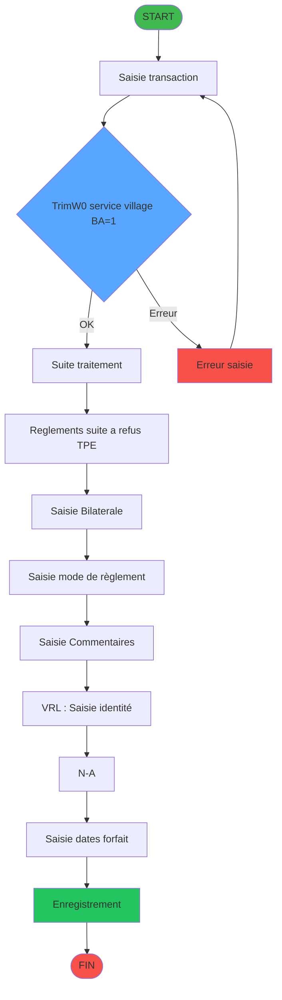
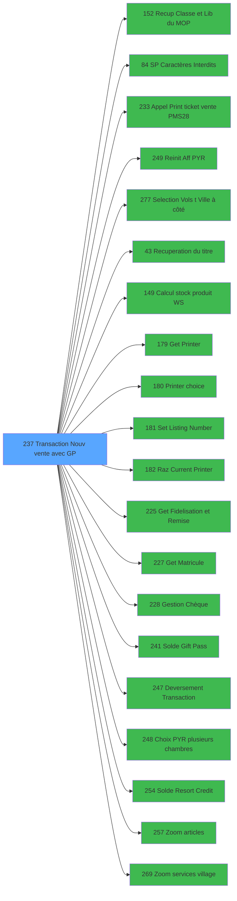

# ADH IDE 237 - Transaction Nouv vente avec GP

> **Analyse**: 2026-01-29 11:34
> **Pipeline**: V6.0 Deep Analysis
> **Niveau**: DETAILED (Migration)

<!-- TAB:Fonctionnel -->

## 1. IDENTIFICATION

| Attribut | Valeur |
|----------|--------|
| Projet | ADH |
| IDE Position | 237 |
| Nom Programme | Transaction Nouv vente avec GP |
| Statut Orphelin | NON_ORPHELIN |
| Raison | Appele par 3 programme(s): Menu caisse GM - scroll (IDE 163), Menu Choix Saisie/Annul vente (IDE 242), Saisie transaction Nouv vente (IDE 316) |
| Complexite | **HAUTE** (85/100) |
| Pipeline | V6.0 |

### Criteres Orphelin

| Critere | Resultat |
|---------|----------|
| Callers directs | OUI (3 callers) |
| Public Name | NON |
| Membre ECF | NON |

## 2. OBJECTIF METIER

**Transaction Nouv vente avec GP** - Programme comprenant 14 ecran(s) visible(s): Saisie transaction, Reglements suite a refus TPE, Saisie Bilaterale, Saisie mode de règlement, Saisie Commentaires, VRL : Saisie identité, , Saisie dates forfait, Affiche saisie, Type transfert, Affiche Transfert A/R, Affectation PAX / Transfert, Libération du logement, Récup nb chambre /LCO.

### Fonctionnalites principales

- **Saisie transaction** (Tache 1, Modal, 1112x279)
- **Reglements suite a refus TPE** (Tache 2, Type6, 708x256)
- **Saisie Bilaterale** (Tache 7, Type6, 326x249)
- **Saisie mode de règlement** (Tache 8, Type6, 506x250)
- **Saisie Commentaires** (Tache 10, Type6, 772x169)
- **VRL : Saisie identité** (Tache 11, MDI, 699x157)
- **Saisie dates forfait** (Tache 19, MDI, 528x121)
- **Affiche saisie** (Tache 30, Modal, 427x124)
- **Type transfert** (Tache 38, Type6, 722x292)
- **Affiche Transfert A/R** (Tache 39, Type6, 681x205)
- **Affectation PAX / Transfert** (Tache 40, Type0, 1056x281)
- **Libération du logement** (Tache 46, Type0, 123x149)
- **Récup nb chambre /LCO** (Tache 49, Type0, 123x89)

### Operations sur les donnees

#### Tables modifiees (WRITE) - 9 tables

- `reseau_cloture___rec` (cafil001_dat)
- `prestations` (cafil010_dat)
- `mvt_prestation___mpr` (cafil024_dat)
- `compte_gm________cgm` (cafil025_dat)
- `compteurs________cpt` (cafil046_dat)
- `tempo_ecran_police` (%club_user%tmp_ecrpolice_dat)
- `stat_lieu_vente_date` (%club_user%_stat_lieu_vente_date)
- `Boo_ResultsRechercheHoraire` (Boo_ResultsRechercheHoraire)
- `Table_1037` ()

#### Tables lues (READ) - 13 tables

- `reseau_cloture___rec` (cafil001_dat)
- `gm-recherche_____gmr` (cafil008_dat)
- `prestations` (cafil010_dat)
- `depot_garantie___dga` (cafil017_dat)
- `moyens_reglement_mor` (cafil028_dat)
- `articles_________art` (cafil055_dat)
- `gratuites________gra` (cafil057_dat)
- `moyen_paiement___mop` (cafil067_dat)
- `logement_client__loc` (cafil081_dat)
- `table_utilisateurs` (cafil087_dat)
- `moyens_reglement_mor` (cafil117_dat)
- `tempo_ecran_police` (%club_user%tmp_ecrpolice_dat)
- `Boo_ResultsRechercheHoraire` (Boo_ResultsRechercheHoraire)

#### Tables liees (LINK) - 18 tables

- `comptes_speciaux_spc` (cafil004_dat)
- `gm-recherche_____gmr` (cafil008_dat)
- `hebergement______heb` (cafil012_dat)
- `mvt_prestation___mpr` (cafil024_dat)
- `tables___________tab` (cafil045_dat)
- `date_comptable___dat` (cafil048_dat)
- `articles_________art` (cafil055_dat)
- `moyen_paiement___mop` (cafil067_dat)
- `table_prestation_pre` (cafil074_dat)
- `moyen_paiement___mop` (cafil118_dat)
- `articles_en_stock` (caisse_artstock)
- `pv_budget` (pv_budget_dat)
- `tempo_ecran_police` (%club_user%tmp_ecrpolice_dat)
- `droits_applications` (droits)
- `arc_cc_total` (arc_cctotal)
- `moyens_reglement_complem` (moyens_reglement_complem)
- `Circuit supprime` (zcircafil146)
- `stat_lieu_vente_date` (%club_user%_stat_lieu_vente_date)

### Regles metier (17 regles)

#### VALIDATION (17)

- **[RM-001]** `IF(Trim(W0 service village [BA])='1','ALLER',IF(Trim(W0 service village [BA])='2','RETOUR',IF(Trim(W0 service village [BA])='3','ALLER/RETOUR','')))`
  > Si Trim(W0 service village [BA])='1' alors 'ALLER' sinon IF(Trim(W0 service village [BA])='2','RETOUR',IF(Trim(W0 service village [BA])='3','ALLER/RETOUR','')))
- **[RM-002]** `IF(V.RC utilisé [GA]=0,IF(W0 imputation [W]='VSL',P0.Date debut sejour [M],Date()),W0 Num rue [CR])`
  > Si V.RC utilisé [GA]=0 alors IF(W0 imputation [W]='VSL' sinon P0.Date debut sejour [M],Date()),W0 Num rue [CR])
- **[RM-003]** `IF (P0 masque montant [C]='','15.2',P0 masque montant [C])`
  > Si P0 masque montant [C]='' alors '15.2' sinon P0 masque montant [C])
- **[RM-004]** `IF(VG7 OR VG35 OR VG87,'P0 masque montant [C]'FORM,'P0 devise locale [B]'FORM)`
  > Si VG7 OR VG35 OR VG87 alors 'P0 masque montant [C]'FORM sinon 'P0 devise locale [B]'FORM)
- **[RM-005]** `IF(NOT W0 Motif de non enreg NA [CL],W0.Date fin sejour [CK],W0 Titre [CO])`
  > Si NOT W0 Motif de non enreg NA [CL] alors W0.Date fin sejour [CK] sinon W0 Titre [CO])
- **[RM-006]** `IF(W0 imputation [W]='VRL','Date consommation','Date début séjour')`
  > Si W0 imputation [W]='VRL' alors 'Date consommation' sinon 'Date début séjour')
- **[RM-007]** `IF(W0 Titre [CO]<>0 AND NOT(W0 Motif de non enreg NA [CL]),Fix(W0 Motif annulation [CN]*W0 Titre [CO]/100,11,P0.Nb decimales [O]),W0 Prenom [CQ])`
  > Si W0 Titre [CO]<>0 AND NOT(W0 Motif de non enreg NA [CL]) alors Fix(W0 Motif annulation [CN]*W0 Titre [CO]/100 sinon 11,P0.Nb decimales [O]),W0 Prenom [CQ])
- **[RM-008]** `IF(W0 imputation [W]='VRL' OR W0 imputation [W]='VSL','Nb forfait',IF(W0 imputation [W]='TRF', 'Nb PAX','Nbre'))`
  > Si W0 imputation [W]='VRL' OR W0 imputation [W]='VSL' alors 'Nb forfait' sinon IF(W0 imputation [W]='TRF', 'Nb PAX','Nbre'))
- **[RM-009]** `IF(IN (W0 imputation [W],'VRL','VSL','TRF','PYR'),31.125,14.875)`
  > Si IN (W0 imputation [W] alors 'VRL' sinon 'VSL','TRF','PYR'),31.125,14.875)
- **[RM-010]** `IF(W0 imputation [W]='TRF',31.750,40.125)`
  > Si W0 imputation [W]='TRF' alors 31.750 sinon 40.125)
- **[RM-011]** `IF(W0 Chambre [CX]<>'',RTrim (W0 Nb Chambres [CW])&Fill (' ',Len (RTrim (W0 Nb Chambres [CW]))-1)&RTrim (W0 Chambre [CX])&' '&W0 PYR Valide [CY],Trim(P0 Nom & prenom [K]))`
  > Si W0 Chambre [CX]<>'' alors RTrim (W0 Nb Chambres [CW])&Fill (' ' sinon Len (RTrim (W0 Nb Chambres [CW]))-1)&RTrim (W0 Chambre [CX])&' '&W0 PYR Valide [CY],Trim(P0 Nom & prenom [K]))
- **[RM-012]** `IF(V.Total reglement ligne [FF],V.Id transaction PMS [FI],VG18)`
  > Si V.Total reglement ligne [FF] alors V.Id transaction PMS [FI] sinon VG18)
- **[RM-013]** `IF(V.ConfirmeUseGP? [FZ],'V',IF([AP]='O','C','D'))`
  > Si V.ConfirmeUseGP? [FZ] alors 'V' sinon IF([AP]='O','C','D'))
- **[RM-014]** `IF (NOT(CHG_PRV_W0 nbre articles [GO]),132.875,105.875)`
  > Si NOT(CHG_PRV_W0 nbre articles [GO]) alors 132.875 sinon 105.875)
- **[RM-015]** `IF(W0 imputation [W]='ANN','O','N')`
  > Si W0 imputation [W]='ANN' alors 'O' sinon 'N')
- **[RM-016]** `IF(W0 imputation [W]='PYR',NOT(W0 mode de paiement [DG]),'FALSE'LOG)`
  > Si W0 imputation [W]='PYR' alors NOT(W0 mode de paiement [DG]) sinon 'FALSE'LOG)
- **[RM-017]** `IF(VG20>1,[AY],'G')`
  > Si VG20>1 alors [AY] sinon 'G')

### Contexte d'utilisation

- **Appele depuis**: Menu caisse GM - scroll (IDE 163), Menu Choix Saisie/Annul vente (IDE 242), Saisie transaction Nouv vente (IDE 316)
- **Appelle**: Recup Classe et Lib du MOP (IDE 152),     SP Caractères Interdits (IDE 84), Appel Print ticket vente PMS28 (IDE 233), Reinit Aff PYR (IDE 249), Selection Vols /t Ville à côté (IDE 277), Recuperation du titre (IDE 43), Calcul stock produit WS (IDE 149), Get Printer (IDE 179), Printer choice (IDE 180), Set Listing Number (IDE 181), Raz Current Printer (IDE 182), Get Fidelisation et Remise (IDE 225), Get Matricule (IDE 227), Gestion Chèque (IDE 228), Solde Gift Pass (IDE 241), Deversement Transaction (IDE 247), Choix PYR (plusieurs chambres) (IDE 248), Solde Resort Credit (IDE 254), Zoom articles (IDE 257), Zoom services village (IDE 269)

<!-- TAB:Technique -->

## 3. MODELE DE DONNEES

### Tables (30 tables uniques)

| ID | Nom Logique | Nom Physique | R | W | L | Type | Occurrences |
|----|-------------|--------------|---|---|---|------|-------------|
| 23 | reseau_cloture___rec | cafil001_dat | R | W | - | Database | 5 |
| 26 | comptes_speciaux_spc | cafil004_dat | - | - | L | Database | 1 |
| 30 | gm-recherche_____gmr | cafil008_dat | R | - | L | Database | 3 |
| 32 | prestations | cafil010_dat | R | W | - | Database | 3 |
| 34 | hebergement______heb | cafil012_dat | - | - | L | Database | 1 |
| 39 | depot_garantie___dga | cafil017_dat | R | - | - | Database | 1 |
| 46 | mvt_prestation___mpr | cafil024_dat | - | W | L | Database | 2 |
| 47 | compte_gm________cgm | cafil025_dat | - | W | - | Database | 2 |
| 50 | moyens_reglement_mor | cafil028_dat | R | - | - | Database | 3 |
| 67 | tables___________tab | cafil045_dat | - | - | L | Database | 1 |
| 68 | compteurs________cpt | cafil046_dat | - | W | - | Database | 1 |
| 70 | date_comptable___dat | cafil048_dat | - | - | L | Database | 1 |
| 77 | articles_________art | cafil055_dat | R | - | L | Database | 4 |
| 79 | gratuites________gra | cafil057_dat | R | - | - | Database | 1 |
| 89 | moyen_paiement___mop | cafil067_dat | R | - | L | Database | 8 |
| 96 | table_prestation_pre | cafil074_dat | - | - | L | Database | 1 |
| 103 | logement_client__loc | cafil081_dat | R | - | - | Database | 1 |
| 109 | table_utilisateurs | cafil087_dat | R | - | - | Database | 1 |
| 139 | moyens_reglement_mor | cafil117_dat | R | - | - | Database | 1 |
| 140 | moyen_paiement___mop | cafil118_dat | - | - | L | Database | 1 |
| 197 | articles_en_stock | caisse_artstock | - | - | L | Database | 1 |
| 372 | pv_budget | pv_budget_dat | - | - | L | Database | 1 |
| 596 | tempo_ecran_police | %club_user%tmp_ecrpolice_dat | R | W | L | Temp | 7 |
| 697 | droits_applications | droits | - | - | L | Database | 1 |
| 728 | arc_cc_total | arc_cctotal | - | - | L | Database | 1 |
| 801 | moyens_reglement_complem | moyens_reglement_complem | - | - | L | Database | 1 |
| 818 | Circuit supprime | zcircafil146 | - | - | L | Database | 1 |
| 847 | stat_lieu_vente_date | %club_user%_stat_lieu_vente_date | - | W | L | Temp | 13 |
| 899 | Boo_ResultsRechercheHoraire | Boo_ResultsRechercheHoraire | R | W | - | Database | 8 |
| 1037 | Table_1037 |  | - | W | - | Memory | 3 |

## 4. VARIABLES ET PARAMETRES

### Variables Mapping (171 entrees)

| Cat | Ref Expression | Lettre | Nom Variable | Type |
|-----|----------------|--------|--------------|------|
| P0 | `{0,1}` | **A** | P0 societe | Alpha |
| P0 | `{0,2}` | **B** | P0 devise locale | Alpha |
| P0 | `{0,3}` | **C** | P0 masque montant | Alpha |
| P0 | `{0,4}` | **D** | P0 solde compte | Numeric |
| P0 | `{0,5}` | **E** | P0 code GM | Numeric |
| P0 | `{0,6}` | **F** | P0 filiation | Numeric |
| P0 | `{0,7}` | **G** | P0 date fin sejour | Date |
| P0 | `{0,8}` | **H** | P0 etat compte | Alpha |
| P0 | `{0,9}` | **I** | P0 date solde | Date |
| P0 | `{0,10}` | **J** | P0 garanti O/N | Alpha |
| P0 | `{0,11}` | **K** | P0 Nom & prenom | Alpha |
| P0 | `{0,12}` | **L** | P0 UNI/BI | Alpha |
| P0 | `{0,13}` | **M** | P0.Date debut sejour | Date |
| P0 | `{0,14}` | **N** | P0.Valide ? | Numeric |
| P0 | `{0,15}` | **O** | P0.Nb decimales | Numeric |
| W0 | `{0,18}` | **R** | W0 FIN SAISIE OD | Logical |
| W0 | `{0,20}` | **T** | W0 Cloture en cours | Logical |
| W0 | `{0,21}` | **U** | W0 code article | Numeric |
| W0 | `{0,23}` | **W** | W0 imputation | Numeric |
| W0 | `{0,24}` | **X** | W0 sous-imput. | Numeric |
| W0 | `{0,25}` | **Y** | W0 date d'achat | Date |
| W0 | `{0,26}` | **Z** | W0 annulation | Alpha |
| W0 | `{0,53}` | **BA** | W0 service village | Alpha |
| W0 | `{0,54}` | **BB** | W0 libelle article | Alpha |
| W0 | `{0,55}` | **BC** | W0 article dernière minute | Logical |
| W0 | `{0,56}` | **BD** | W0 nbre articles | Numeric |
| W0 | `{0,57}` | **BE** | W0 prix unitaire | Numeric |
| W0 | `{0,58}` | **BF** | W0 Categorie de chambre | Alpha |
| W0 | `{0,59}` | **BG** | W0 Lieu sejour | Alpha |
| W0 | `{0,60}` | **BH** | W0 Code reduction | Alpha |
| W0 | `{0,65}` | **BM** | W0 Sens du transfert Aller | Alpha |
| W0 | `{0,66}` | **BN** | W0 Date du transfert Aller | Date |
| W0 | `{0,67}` | **BO** | W0 Heure du transfert Aller | Time |
| W0 | `{0,68}` | **BP** | W0 b.Date du transfert | Alpha |
| W0 | `{0,69}` | **BQ** | W0 Type d'endroit Aller | Alpha |
| W0 | `{0,70}` | **BR** | W0 Code Gare/Aéroport Aller | Alpha |
| W0 | `{0,71}` | **BS** | W0 Numéro du vol Aller | Alpha |
| W0 | `{0,72}` | **BT** | W0 Compagnie Aller | Alpha |
| W0 | `{0,73}` | **BU** | W0 Commentaire Aller | Alpha |
| W0 | `{0,74}` | **BV** | W0 Sens du transfert Retour | Alpha |
| W0 | `{0,75}` | **BW** | W0 Date du transfert Retour | Date |
| W0 | `{0,76}` | **BX** | W0 Heure du transfert Retour | Time |
| W0 | `{0,77}` | **BY** | W0 Type d'endroit Retour | Alpha |
| W0 | `{0,78}` | **BZ** | W0 Code Gare/Aéroport Retour | Alpha |
| W0 | `{0,79}` | **CA** | W0 Numéro du vol Retour | Alpha |
| W0 | `{0,80}` | **CB** | W0 Compagnie Retour | Alpha |
| W0 | `{0,81}` | **CC** | W0 b.Saisie PAX | Alpha |
| W0 | `{0,82}` | **CD** | W0 Nbre de PAX enregistré | Numeric |
| W0 | `{0,83}` | **CE** | W0 Commentaire Retour | Alpha |
| W0 | `{0,84}` | **CF** | W0 montant avant reduction | Numeric |
| W0 | `{0,85}` | **CG** | W0 Pourcentage reduction | Numeric |
| W0 | `{0,86}` | **CH** | W0 Remise Obligatoire | Numeric |
| W0 | `{0,87}` | **CI** | W0 Montant reduction | Numeric |
| W0 | `{0,88}` | **CJ** | W0.Date consommation | Date |
| W0 | `{0,89}` | **CK** | W0.Date fin sejour | Date |
| W0 | `{0,90}` | **CL** | W0 Motif de non enreg NA | Numeric |
| W0 | `{0,91}` | **CM** | W0 Commentaire | Alpha |
| W0 | `{0,92}` | **CN** | W0 Motif annulation | Alpha |
| W0 | `{0,93}` | **CO** | W0 Titre | Alpha |
| W0 | `{0,94}` | **CP** | W0 Nom | Alpha |
| W0 | `{0,95}` | **CQ** | W0 Prenom | Alpha |
| W0 | `{0,96}` | **CR** | W0 Num rue | Alpha |
| W0 | `{0,97}` | **CS** | W0 Nom de la rue | Alpha |
| W0 | `{0,98}` | **CT** | W0 Commune | Alpha |
| W0 | `{0,99}` | **CU** | W0 CP | Alpha |
| W0 | `{0,100}` | **CV** | W0 Ville | Alpha |
| W0 | `{0,101}` | **CW** | W0 Nb Chambres | Numeric |
| W0 | `{0,102}` | **CX** | W0 Chambre | Unicode |
| W0 | `{0,103}` | **CY** | W0 PYR Valide | Logical |
| W0 | `{0,104}` | **CZ** | W0 Lib Bouton Chambre | Unicode |
| W0 | `{0,105}` | **DA** | W0 Vendeur | Unicode |
| W0 | `{0,106}` | **DB** | W0 libelle supplem | Alpha |
| W0 | `{0,107}` | **DC** | W0 libelle supplem pour édition | Alpha |
| W0 | `{0,108}` | **DD** | W0 article trouve | Logical |
| W0 | `{0,109}` | **DE** | W0 Stock produit | Numeric |
| W0 | `{0,110}` | **DF** | W0 montant | Numeric |
| W0 | `{0,111}` | **DG** | W0 mode de paiement | Alpha |
| W0 | `{0,113}` | **DI** | W0 Libelle MOP | Alpha |
| W0 | `{0,118}` | **DN** | W0 reseau | Alpha |
| W0 | `{0,119}` | **DO** | W0 fin tache | Alpha |
| W0 | `{0,120}` | **DP** | W0 forfait (O/N) | Alpha |
| W0 | `{0,121}` | **DQ** | W0 effacement (O/N) | Alpha |
| W0 | `{0,122}` | **DR** | W0 forfait date(O/N) | Alpha |
| W0 | `{0,123}` | **DS** | W0 code forfait | Alpha |
| W0 | `{0,124}` | **DT** | W0 date debut | Date |
| W0 | `{0,125}` | **DU** | W0 date fin | Date |
| W0 | `{0,126}` | **DV** | W0 gratuite ? | Alpha |
| W0 | `{0,127}` | **DW** | W0 ret lien special | Numeric |
| W0 | `{0,128}` | **DX** | W0 Code Devise | Numeric |
| W0 | `{0,129}` | **DY** | W0 Retour Transmission TPE | Logical |
| W0 | `{0,130}` | **DZ** | W0 Forcer Transaction Manuelle | Logical |
| W0 | `{0,131}` | **EA** | W0 Message TPE | Alpha |
| W0 | `{0,132}` | **EB** | W0 Retour Lecture TPE | Logical |
| W0 | `{0,133}` | **EC** | W0 Fin Transaction TPE | Logical |
| W0 | `{0,135}` | **EE** | W0 Total_Vente | Numeric |
| W0 | `{0,136}` | **EF** | W0 Total_GiftPass | Numeric |
| W0 | `{0,137}` | **EG** | W0 Annulation OD active | Logical |
| W0 | `{0,138}` | **EH** | W0 Compte garanti | Logical |
| W0 | `{0,139}` | **EI** | W0 confirmation si non garanti | Numeric |
| W0 | `{0,140}` | **EJ** | W0 Abandon | Logical |
| W0 | `{0,141}` | **EK** | W0 validation | Logical |
| W0 | `{0,142}` | **EL** | W0 choix personne absente | Numeric |
| W0 | `{0,143}` | **EM** | W0 choix transac manuelle | Numeric |
| W0 | `{0,145}` | **EO** | W0 Lien Logement Lieu Séjour | Logical |
| V. | `{0,22}` | **V** | v.SoldeGiftPass | Numeric |
| V. | `{0,61}` | **BI** | v Sens Transfert Global | Alpha |
| V. | `{0,62}` | **BJ** | v.Date activité VAE | Date |
| V. | `{0,63}` | **BK** | v.VAE pendant le séjour ? | Logical |
| V. | `{0,64}` | **BL** | v.Matin/Après midi | Unicode |
| V. | `{0,134}` | **ED** | v. titre | Alpha |
| V. | `{0,146}` | **EP** | V.VADA ? | Logical |
| V. | `{0,147}` | **EQ** | V.VADV ? | Logical |
| V. | `{0,148}` | **ER** | V.VAD ? | Logical |
| V. | `{0,150}` | **ET** | V.Reglement premier article | Alpha |
| V. | `{0,151}` | **EU** | V.Type premier article | Alpha |
| V. | `{0,152}` | **EV** | V.Premier article VSL NA ? | Logical |
| V. | `{0,153}` | **EW** | V.Article VSL NA ? | Logical |
| V. | `{0,154}` | **EX** | v.IncrémentTicket(VRL/VSL) OK | Logical |
| V. | `{0,155}` | **EY** | v.IncrémentTicket(VTE) OK | Logical |
| V. | `{0,156}` | **EZ** | v.NumeroTicket(VRL/VSL) | Numeric |
| V. | `{0,157}` | **FA** | v.NumeroTicket(VTE) | Numeric |
| V. | `{0,158}` | **FB** | v Réponse mode paiement | Numeric |
| V. | `{0,159}` | **FC** | V Nbre de Ligne Saisies | Numeric |
| V. | `{0,160}` | **FD** | v Nbre ligne de reglement Saisi | Numeric |
| V. | `{0,161}` | **FE** | V.Num ligne vente | Numeric |
| V. | `{0,162}` | **FF** | V.Total reglement ligne | Numeric |
| V. | `{0,163}` | **FG** | V.Multi reglement ligne | Logical |
| V. | `{0,164}` | **FH** | V.MOP TPE | Alpha |
| V. | `{0,165}` | **FI** | V.Id transaction PMS | Alpha |
| V. | `{0,166}` | **FJ** | V.Id transaction AXIS | Alpha |
| V. | `{0,167}` | **FK** | V.Num Autorisation | Alpha |
| V. | `{0,168}` | **FL** | V.Transaction TPE validee | Logical |
| V. | `{0,169}` | **FM** | V.Message erreur transac TPE | Alpha |
| V. | `{0,170}` | **FN** | V.Total carte | Numeric |
| V. | `{0,171}` | **FO** | V.Transaction ok | Logical |
| V. | `{0,172}` | **FP** | V.Nombre de carte | Numeric |
| V. | `{0,174}` | **FR** | v is the First time | Numeric |
| V. | `{0,175}` | **FS** | v.Montant-giftPass | Numeric |
| V. | `{0,176}` | **FT** | v.email GM pour VAD | Alpha |
| V. | `{0,177}` | **FU** | V.N°Ticket OD | Numeric |
| V. | `{0,178}` | **FV** | V.N°Ticket Autres Moyen Paie | Numeric |
| V. | `{0,179}` | **FW** | V.Num Cheque | Unicode |
| V. | `{0,180}` | **FX** | V.SoldeResortCredit | Numeric |
| V. | `{0,181}` | **FY** | V.Confirm Use Resort Credit | Numeric |
| V. | `{0,182}` | **FZ** | V.ConfirmeUseGP? | Numeric |
| V. | `{0,183}` | **GA** | V.RC utilisé | Logical |
| V. | `{0,184}` | **GB** | v.Token Id | Unicode |
| V. | `{0,185}` | **GC** | v.Transaction Id | Unicode |
| V. | `{0,186}` | **GD** | v.Nb chambres /LCO | Numeric |
| V. | `{0,187}` | **GE** | v.Flag exist Vte LCO | Logical |
| V. | `{0,188}` | **GF** | v.Flag abandon libération | Logical |
| V. | `{0,189}` | **GG** | v. pied stype? | Logical |
| V. | `{0,190}` | **GH** | v. pied type? | Logical |
| V. | `{0,191}` | **GI** | v. type a utiliser | Unicode |
| V. | `{0,192}` | **GJ** | v. stype a utiliser | Unicode |
| Autre | `{0,16}` | **P** | Bouton IDENTITE | Alpha |
| Autre | `{0,17}` | **Q** | Bouton ABANDON | Alpha |
| Autre | `{0,19}` | **S** | Bouton FIN SAISIE OD | Alpha |
| Autre | `{0,112}` | **DH** | Existe mode de paiement | Logical |
| Autre | `{0,114}` | **DJ** | WO Classe MOP | Alpha |
| Autre | `{0,115}` | **DK** | V0 memo-service | Alpha |
| Autre | `{0,116}` | **DL** | V0 memo-nom GM | Alpha |
| Autre | `{0,117}` | **DM** | V0 validation | Logical |
| Autre | `{0,144}` | **EN** | Bouton Ok | Alpha |
| Autre | `{0,149}` | **ES** | Nbre ecriture | Numeric |
| Autre | `{0,173}` | **FQ** | b.type de transfert | Alpha |
| Autre | `{0,193}` | **GK** | CHG_REASON_W0 libelle article | Numeric |
| Autre | `{0,194}` | **GL** | CHG_PRV_W0 libelle article | Alpha |
| Autre | `{0,195}` | **GM** | P.Toute ligne | Logical |
| Autre | `{0,196}` | **GN** | CHG_REASON_W0 nbre articles | Numeric |
| Autre | `{0,197}` | **GO** | CHG_PRV_W0 nbre articles | Numeric |

## 5. LOGIQUE METIER

### Algorigramme



### Expressions (305 / 305 - 100%)

#### CALCULATION (15 expressions)

| IDE | Expression Decodee |
|-----|-------------------|
| 15 | `[AW]*[AV]` |
| 16 | `([AW]*[AV])-W0 Prenom [CQ]` |
| 75 | `V.RC utilisé [GA]+1` |
| 117 | `W0 Prenom [CQ]/([AW]*[AV])*100` |
| 153 | `NOT W0 Motif de non enreg NA [CL] AND W0 Titre [CO]<>0 AND (W0 Prenom [CQ]<Fix(W0 Motif annulation [CN]*W0 Titre [CO]/100,11,P0.Nb decimales [O])-1 OR W0 Prenom [CQ]>Fix(W0 Motif annulation [CN]*W0 Titre [CO]/100,11,P0.Nb decimales [O])+1)` |
| 204 | `W0 Code Gare/Aéroport ... [BR]='00/00/0000'DATE OR W0 Numéro du vol Aller [BS]='00:00:00'TIME OR W0 Commentaire Aller [BU]='' OR W0 Sens du transfert R... [BV]='' OR W0 Date du transfert R... [BW]='' OR W0 Heure du transfert ... [BX]=''` |
| 205 | `W0 Numéro du vol Retour [CA]='00/00/0000'DATE OR W0 Compagnie Retour [CB]='00:00:00'TIME OR W0 b.Saisie PAX [CC]='' OR W0 Nbre de PAX enregistré [CD]='' OR W0 Commentaire Retour [CE]='' OR W0 montant avant reduc... [CF]=''` |
| 206 | `'00/00/0000'DATE` |
| 229 | `W0 Nom de la rue [CS]-W0 Num rue [CR]>45` |
| 234 | `W0 fin tache [DO]-[AG]` |
| 246 | `V.Total carte [FN]+1` |
| 247 | `V.Transaction ok [FO]-1` |
| 265 | `MlsTrans('Vous disposez d''un Resort Credit de')&' '&Trim(Str([HE],Trim(P0 masque montant [C])))&' '&Trim(P0 devise locale [B])&'. Voulez-vous l''utiliser ?'` |
| 284 | `W0 libelle article [BB]='00/00/0000'DATE` |
| 294 | `MlsTrans('Pas de chambre en-cours pour ce GM !')` |

#### CONDITION (31 expressions)

| IDE | Expression Decodee |
|-----|-------------------|
| 2 | `IF(Trim(W0 service village [BA])='1','ALLER',IF(Trim(W0 service village [BA])='2','RETOUR',IF(Trim(W0 service village [BA])='3','ALLER/RETOUR','')))` |
| 5 | `IF(V.RC utilisé [GA]=0,IF(W0 imputation [W]='VSL',P0.Date debut sejour [M],Date()),W0 Num rue [CR])` |
| 35 | `IF (P0 masque montant [C]='','15.2',P0 masque montant [C])` |
| 92 | `IF(VG7 OR VG35 OR VG87,'P0 masque montant [C]'FORM,'P0 devise locale [B]'FORM)` |
| 94 | `IF(NOT W0 Motif de non enreg NA [CL],W0.Date fin sejour [CK],W0 Titre [CO])` |
| 111 | `IF(W0 imputation [W]='VRL','Date consommation','Date début séjour')` |
| 114 | `IF(W0 Titre [CO]<>0 AND NOT(W0 Motif de non enreg NA [CL]),Fix(W0 Motif annulation [CN]*W0 Titre [CO]/100,11,P0.Nb decimales [O]),W0 Prenom [CQ])` |
| 119 | `IF(V.RC utilisé [GA]=0,IF(W0 imputation [W]='VSL',P0 date fin sejour [G],W0 Nom de la rue [CS]),W0 Nom de la rue [CS])` |
| 120 | `IF(W0 imputation [W]='VRL' OR W0 imputation [W]='VSL','Nb forfait',IF(W0 imputation [W]='TRF', 'Nb PAX','Nbre'))` |
| 125 | `IF(IN (W0 imputation [W],'VRL','VSL','TRF','PYR'),31.125,14.875)` |
| 126 | `IF(IN (W0 imputation [W],'VRL','VSL','TRF','PYR'),32.125,16.125)` |
| 127 | `IF(IN (W0 imputation [W],'VRL','VSL','TRF','PYR'),33.75,26.75)` |
| 128 | `IF(IN (W0 imputation [W],'VRL','VSL','TRF','PYR'),40.375,32)` |
| 129 | `IF(IN (W0 imputation [W],'VRL','VSL','TRF','PYR'),40.75,32.5)` |
| 130 | `IF(IN (W0 imputation [W],'VRL','VSL','TRF','PYR'),43.375,35.5)` |
| 131 | `IF(W0 imputation [W]='TRF',31.750,40.125)` |
| 132 | `IF(W0 imputation [W]='TRF',26.875,26.875)` |
| 133 | `IF(W0 imputation [W]='TRF',62.750,62.750)` |
| 134 | `IF(W0 imputation [W]='TRF',26.75,26.75)` |
| 135 | `IF(W0 imputation [W]='TRF',83.625,83.625)` |
| 136 | `IF(W0 imputation [W]='TRF',27,27)` |
| 137 | `IF(W0 imputation [W]='TRF',110.625,110.625)` |
| 147 | `IF(W0 Chambre [CX]<>'',RTrim (W0 Nb Chambres [CW])&Fill (' ',Len (RTrim (W0 Nb Chambres [CW]))-1)&RTrim (W0 Chambre [CX])&' '&W0 PYR Valide [CY],Trim(P0 Nom & prenom [K]))` |
| 154 | `IF(V.Total reglement ligne [FF],V.Id transaction PMS [FI],VG18)` |
| 162 | `IF(W0 imputation [W]='VRL','TRUE'LOG,V.RC utilisé [GA]=0)` |
| 167 | `IF(V.ConfirmeUseGP? [FZ],'V',IF([AP]='O','C','D'))` |
| 210 | `IF(V.ConfirmeUseGP? [FZ],P0 devise locale [B],VG30)` |
| 225 | `IF (NOT(CHG_PRV_W0 nbre articles [GO]),132.875,105.875)` |
| 236 | `IF(W0 imputation [W]='ANN','O','N')` |
| 272 | `IF(W0 imputation [W]='PYR',NOT(W0 mode de paiement [DG]),'FALSE'LOG)` |
| 290 | `IF(VG20>1,[AY],'G')` |

#### CONSTANT (28 expressions)

| IDE | Expression Decodee |
|-----|-------------------|
| 9 | `154` |
| 13 | `'F'` |
| 18 | `'N'` |
| 19 | `1` |
| 20 | `'CAISSE'` |
| 47 | `0` |
| 48 | `''` |
| 50 | `'A&bandonner'` |
| 63 | `30` |
| 68 | `'H'` |
| 71 | `'CASH'` |
| 72 | `'W'` |
| 76 | `'O'` |
| 139 | `''` |
| 149 | `'SANS'` |
| 192 | `'...'` |
| 193 | `'La quantité totale ne correspond pas au détail des PAX sélectionnés'` |
| 195 | `'2'` |
| 202 | `'Des informations du transfert Aller ne sont pas saisies . Validation impossible '` |
| 203 | `'Des informations du transfert Retour ne sont pas saisies . Validation impossible '` |
| 208 | `''` |
| 213 | `'H'` |
| 215 | `'PL'` |
| 217 | `'VADA'` |
| 218 | `'VADV'` |
| 233 | `0` |
| 240 | `'PYR'` |
| 266 | `'Voulez vous utiliser le Gift Pass ?'` |

#### DATE (9 expressions)

| IDE | Expression Decodee |
|-----|-------------------|
| 1 | `DStr(P0 date fin sejour [G],'DD/MM/YYYY')` |
| 4 | `Date ()` |
| 14 | `Date ()` |
| 32 | `P0 date fin sejour [G]=0 OR P0 date fin sejour [G]<Date ()` |
| 33 | `NOT (P0 date fin sejour [G]=0 OR P0 date fin sejour [G]<Date ())` |
| 67 | `Date ()` |
| 107 | `W0 imputation [W]='VSL' AND W0 Num rue [CR]-Date()>21 AND W0 Titre [CO]<>0` |
| 109 | `W0 imputation [W]='VSL' AND W0 Num rue [CR]-Date()>[HM] AND W0 Titre [CO]<>0` |
| 305 | `W0 imputation [W]='VRL' AND IF(Date()>BOM(Date()),W0 Num rue [CR]<BOM(Date()),BOM(Date()-1)>W0 Num rue [CR])` |

#### OTHER (201 expressions)

| IDE | Expression Decodee |
|-----|-------------------|
| 6 | `NOT VG38` |
| 7 | `VG2` |
| 10 | `P0 societe [A]` |
| 11 | `P0 code GM [E]` |
| 12 | `P0 filiation [F]` |
| 17 | `'FALSE'LOG` |
| 21 | `W0 code article [U]` |
| 22 | `[AW]>0 AND [AV]=0` |
| 23 | `V0 validation [DM] AND [AP]='N'` |
| 24 | `[AV]>W0 reseau [DN] AND NOT (Nbre ecriture [ES])` |
| 25 | `W0 fin tache [DO]=0 AND [AQ]<>'' AND W0 Titre [CO]<>100 AND W0 imputation [W]<>'VRL' AND W0 imputation [W]<>'VSL' AND NOT([HH])` |
| 26 | `W0 imputation [W]='VRL' OR W0 imputation [W]='VSL'` |
| 27 | `NOT(v.Flag abandon libération [GF])` |
| 28 | `[AW]>0 AND W0 Retour Transmission... [DY]='N'` |
| 29 | `([AW]=0) AND (ExpCalc('55'EXP))` |
| 30 | `([AW]=0) AND W0 imputation [W]<>'VRL' AND (ExpCalc('55'EXP))` |
| 31 | `W0 code article [U]>0 AND W0 ret lien special [DW]<>'R'` |
| 34 | `W0 code article [U]>0 AND W0 fin tache [DO]>0` |
| 36 | `W0 Retour Transmission... [DY]='O' AND W0 Message TPE [EA]='O'` |
| 37 | `W0 gratuite ? [DV] AND W0 Retour Transmission... [DY]='O' AND W0 Forcer Transaction ... [DZ]='O'` |
| 38 | `[AP]='N'` |
| 39 | `W0 gratuite ? [DV] AND W0 Retour Transmission... [DY]='O'` |
| 40 | `V.Reglement premier ar... [ET]` |
| 41 | `W0 FIN SAISIE OD [R]` |
| 42 | `W0 gratuite ? [DV]` |
| 43 | `[AP]='O' AND W0 gratuite ? [DV]` |
| 44 | `V.VADA ? [EP]` |
| 46 | `W0 Cloture en cours [T]` |
| 49 | `MlsTrans('Identité')` |
| 51 | `MlsTrans ('&Fin Transaction')` |
| 52 | `DbRecs ('{596,4}'DSOURCE,'')>0 AND ExpCalc('41'EXP)` |
| 53 | `DbRecs ('{596,4}'DSOURCE,'')>0` |
| 54 | `DbRecs ('{596,4}'DSOURCE,'')>0 AND [AR]=''` |
| 55 | `DbRecs ('{596,4}'DSOURCE,'')<6` |
| 56 | `'TRUE'LOG` |
| 57 | `'FALSE'LOG` |
| 58 | `W0 gratuite ? [DV] AND [AP]='O'` |
| 59 | `NOT (W0 FIN SAISIE OD [R])` |
| 60 | `V.VAD ? [ER]<>6` |
| 61 | `NOT (Nbre ecriture [ES]) AND DbRecs ('{596,4}'DSOURCE,'')=0 AND [AQ]&[AR]=''` |
| 62 | `NOT (V.VADV ? [EQ])` |
| 64 | `P0 societe [A]` |
| 65 | `P0 code GM [E]` |
| 66 | `P0 filiation [F]` |
| 70 | `GetParam ('MOPCMP')` |
| 73 | `W0 code article [U]` |
| 74 | `W0 forfait (O/N) [DP]=''` |
| 77 | `V.VADV ? [EQ]` |
| 78 | `NOT ExpCalc('77'EXP)` |
| 79 | `W0 forfait (O/N) [DP]='' AND LastClicked()<>'Bouton ABANDON'` |
| 80 | `NOT (W0 effacement (O/N) [DQ]) AND LastClicked()<>'Bouton ABANDON'` |
| 81 | `W0 forfait (O/N) [DP]=GetParam ('MOPCMP') AND NOT (V.VADV ? [EQ]) AND LastClicked()<>'Bouton ABANDON'` |
| 82 | `W0 Code Devise [DX]='F' OR Nbre ecriture [ES]` |
| 84 | `'FALSE'LOG` |
| 85 | `ExpCalc('55'EXP)` |
| 86 | `ExpCalc('55'EXP) AND NOT([HH])` |
| 87 | `ExpCalc('55'EXP) AND NOT v.Flag exist Vte LCO [GE]` |
| 88 | `(DbRecs ('{596,4}'DSOURCE,'')=0) AND (ExpCalc('55'EXP))` |
| 89 | `([AW]>0 AND W0 Retour Transmission... [DY]='N') AND (ExpCalc('55'EXP))` |
| 90 | `(W0 Retour Transmission... [DY]='N' AND (NOT(ExpCalc('285'EXP)) OR [HJ]>1 )) 
AND (ExpCalc('55'EXP))` |
| 91 | `V.Type premier article [EU]=6` |
| 93 | `[AZ]` |
| 95 | `NOT(W0 Motif de non enreg NA [CL]) OR W0 imputation [W]='PYR'` |
| 96 | `IN(W0 imputation [W],'VRL','VSL','PYR')` |
| 97 | `IN(W0 imputation [W],'VRL','VSL') AND [AF]<>'LCO'` |
| 98 | `IN(W0 imputation [W],'VRL','VSL')` |
| 99 | `IN(W0 imputation [W],'VRL','VSL','TRF')` |
| 100 | `W0 imputation [W]='VRL'` |
| 101 | `W0 imputation [W]='VSL' AND [AF]<>'LCO'` |
| 102 | `LastClicked()<>'Bouton ABANDON' AND DbRecs ('{596,4}'DSOURCE,'')<6` |
| 103 | `W0 imputation [W]='VSL' AND [AF]<>'LCO' AND DbRecs ('{596,4}'DSOURCE,'')<3 AND 
LastClicked()<>'Bouton ABANDON'` |
| 104 | `(W0 imputation [W]='VRL' OR W0 imputation [W]='VSL')AND [AF]<>'LCO' AND VG7 AND 
DbRecs ('{596,4}'DSOURCE,'')<3 AND 
LastClicked()<>'Bouton ABANDON'` |
| 105 | `W0 imputation [W]='VSL' AND W0 CP [CU]='' AND NOT v.Flag exist Vte LCO [GE] AND LastClicked()<>'Bouton ABANDON'` |
| 106 | `W0 Num rue [CR]=0` |
| 110 | `W0 code article [U]` |
| 112 | `(W0 Titre [CO]=100 OR W0 Motif de non enreg NA [CL]) AND W0 CP [CU]='' AND LastClicked()<>'Bouton ABANDON'` |
| 113 | `[AP]='O' AND IN (W0 imputation [W],'VRL','VSL','TRF')` |
| 115 | `W0 Motif de non enreg NA [CL]` |
| 116 | `W0 Motif de non enreg NA [CL] OR [AZ]='SANS'` |
| 118 | `W0 Ville [CV]='' AND [AP]='O'` |
| 121 | `W0 Nom de la rue [CS]=0` |
| 122 | `[AX]=''` |
| 123 | `W0 annulation [Z]=0 AND ExpCalc('55'EXP)` |
| 124 | `GetParam('CODELANGUE')` |
| 138 | `V.RC utilisé [GA]>0 AND [AR]<>'' AND VG7 AND ((IN(W0 imputation [W],'VRL','VSL','PYR') AND W0 imputation [W]<>v.Transaction Id [GC]) OR (IN(v.Transaction Id [GC],'VRL','VSL','PYR') AND W0 imputation [W]<>v.Transaction Id [GC]))` |
| 140 | `W0 Prenom [CQ]>W0 Motif annulation [CN]` |
| 141 | `P0.Valide ? [N]<>0 AND NOT(IN(W0 imputation [W],'VSL','VRL','PYR')) AND VG7 AND v.SoldeGiftPass [V]<>0` |
| 142 | `W0 imputation [W]` |
| 143 | `W0 Total_GiftPass [EF]=0 AND W0 imputation [W]='VRL' AND VG7 AND W0 Chambre [CX]='' AND V.RC utilisé [GA]=0` |
| 144 | `W0 Total_GiftPass [EF]=0 AND W0 imputation [W]='VRL' AND VG7 AND V.RC utilisé [GA]=0` |
| 145 | `W0 Total_GiftPass [EF]=0 AND W0 imputation [W]='VSL' AND VG7 AND W0 sous-imput. [X]>0` |
| 146 | `W0 imputation [W]='VRL' AND W0 Total_GiftPass [EF]=0` |
| 148 | `NOT IN(W0 imputation [W],'VRL','VSL','TRF', 'VAR')` |
| 150 | `[AW]=0` |
| 151 | `V.RC utilisé [GA]=0` |
| 152 | `[AA]='X'` |
| 155 | `(W0 imputation [W]='VRL'  OR W0 imputation [W]='VSL')  AND VG17 AND VG20>1` |
| 156 | `VG21` |
| 157 | `W0 imputation [W]='VRL' AND VG7 AND VG20>1 AND VG17 AND DbRecs ('{596,4}'DSOURCE,'')<3 AND LastClicked()<>'Bouton ABANDON'` |
| 158 | `[AY]=''` |
| 159 | `VG20>1` |
| 161 | `MlsTrans('Sans réduction')` |
| 163 | `VG23 AND VG24 AND [GU]>0 AND NOT [GS]` |
| 164 | `VG23 AND VG24 AND NOT [GS]` |
| 165 | `NOT ExpCalc('162'EXP)` |
| 166 | `W0 FIN SAISIE OD [R] AND VG23` |
| 168 | `[GS] AND Left(W0 forfait (O/N) [DP],3)<>'VAD'` |
| 172 | `NOT [GS]` |
| 174 | `VG7 AND v.Flag exist Vte LCO [GE] AND [AC]='' AND v.SoldeGiftPass [V]<>0` |
| 176 | `[AC]` |
| 177 | `VG7 AND v.Flag exist Vte LCO [GE]` |
| 178 | `([GU]<>0 AND VG24) OR V.ConfirmeUseGP? [FZ] AND [AP]='N'` |
| 179 | `VG23 AND VG24 AND [GW]>1` |
| 180 | `[GV]` |
| 181 | `ExpCalc('55'EXP) AND (W0 imputation [W]='VSL') AND NOT v.Flag exist Vte LCO [GE]` |
| 182 | `W0 fin tache [DO]<>0` |
| 183 | `P0 UNI/BI [L]='U'` |
| 184 | `P0 UNI/BI [L]<>'U'` |
| 185 | `NOT CHG_PRV_W0 nbre articles [GO]` |
| 186 | `CHG_PRV_W0 nbre articles [GO]` |
| 187 | `VG23 AND VG24` |
| 188 | `'FALSE'LOG` |
| 189 | `W0 imputation [W]='VSL' AND NOT v.Flag exist Vte LCO [GE] AND W0 sous-imput. [X]<>0 AND LastClicked()<>'Bouton ABANDON'` |
| 190 | `V.VADV ? [EQ] AND W0 imputation [W]<>'VSL'` |
| 191 | `NOT ExpCalc('189'EXP)` |
| 194 | `[AV]<>W0 Remise Obligatoire [CH]` |
| 196 | `W0 imputation [W]='TRF'  AND VG35` |
| 197 | `W0 imputation [W]='TRF'  AND VG35 AND LastClicked ()<>'Bouton ABANDON'` |
| 198 | `[GY]=0` |
| 199 | `[GY]=0 AND W0 imputation [W]='TRF' AND VG35` |
| 200 | `IN(W0 service village [BA],'1','3')` |
| 201 | `IN(W0 service village [BA],'2','3')` |
| 207 | `'00:00:00'TIME` |
| 209 | `V Nbre de Ligne Saisies [FC]` |
| 211 | `'TRUE'LOG` |
| 212 | `GetParam('CODELANGUE')` |
| 214 | `W0 Heure du transfert ... [BO]` |
| 216 | `W0 b.Date du transfert [BP]` |
| 219 | `V.Nombre de carte [FP] OR V.N°Ticket OD [FU]` |
| 220 | `(Left(v.Token Id [GB],3)='VAD' AND Left(W0 forfait (O/N) [DP],3)<>'VAD' AND Left(W0 forfait (O/N) [DP],3)<>'' OR Left(v.Token Id [GB],3)<>'VAD' AND Left(v.Token Id [GB],3)<>'' AND Left(W0 forfait (O/N) [DP],3)='VAD') AND LastClicked()<>'Bouton ABANDON'` |
| 221 | `W0 forfait (O/N) [DP]` |
| 222 | `(v.Token Id [GB]='VADA' AND W0 forfait (O/N) [DP]='VADV' OR v.Token Id [GB]='VADV' AND W0 forfait (O/N) [DP]='VADA') AND LastClicked()<>'Bouton ABANDON'` |
| 223 | `[AR]<>''` |
| 224 | `V.ConfirmeUseGP? [FZ] AND [AP]='O'` |
| 226 | `[HR]>1 AND [AV]=1 AND [HQ]=0` |
| 227 | `W0 imputation [W]='TRF' AND VG35` |
| 228 | `[AV]>1 AND W0 imputation [W]='TRF' AND VG35` |
| 230 | `(W0 Prenom [CQ]<>0 OR W0 Titre [CO]<>0) OR W0 Motif de non enreg NA [CL]` |
| 231 | `VG38 AND [AD] AND [AG]>0` |
| 232 | `[AG]>=W0 fin tache [DO]` |
| 235 | `W0 fin tache [DO]` |
| 237 | `VG38` |
| 238 | `W0 imputation [W]='ANN' AND W0 forfait (O/N) [DP]<>'OD'` |
| 239 | `[AP]='O'` |
| 241 | `W0 imputation [W]='PYR'` |
| 242 | `W0 Nom [CP]` |
| 244 | `W0 Nom [CP]>0 AND W0 Nom [CP]>W0 Titre [CO] AND W0 imputation [W]='PYR'` |
| 245 | `W0 Stock produit [DE]=1` |
| 248 | `W0 montant [DF]` |
| 250 | `W0 Stock produit [DE]>1` |
| 252 | `Existe mode de paiement [DH]` |
| 253 | `31.75` |
| 254 | `28.125` |
| 255 | `29.375` |
| 256 | `54.125` |
| 257 | `LastClicked()<>'Bouton ABANDON'` |
| 258 | `W0 mode de paiement [DG]` |
| 260 | `VG55 AND NOT(CHG_PRV_W0 nbre articles [GO]) AND W0 code forfait [DS]='$PAPER'` |
| 264 | `IN(W0 imputation [W],'VRL','VSL') AND VG54` |
| 267 | `VG38 AND [AG]>0 AND W0 Total_Vente [EE]<>'O' AND VG60 AND [HF]<>6 AND [AD]` |
| 268 | `[HE] > 0 AND VG63` |
| 269 | `[HE]` |
| 270 | `[HF] = 6` |
| 271 | `(W0 code article [U]>0 AND (W0 imputation [W]='VRL' OR W0 imputation [W]='VSL' )) OR (W0 code article [U]>0 AND W0 fin tache [DO]>0 AND W0 imputation [W]<>'VRL' AND W0 imputation [W]<>'VSL') AND [AQ]<>'' OR IF(W0 imputation [W]='PYR',W0 mode de paiement [DG],'TRUE'LOG)` |
| 273 | `VG63` |
| 274 | `NOT([HH])` |
| 275 | `NOT(W0 FIN SAISIE OD [R])` |
| 276 | `W0 FIN SAISIE OD [R]` |
| 277 | `v.Matin/Après midi [BL]` |
| 278 | `VG83 AND V.ConfirmeUseGP? [FZ]` |
| 279 | `[HA]=''` |
| 280 | `NOT ExpCalc('277'EXP)` |
| 281 | `W0 imputation [W]='VAE' AND VG87` |
| 282 | `NOT ExpCalc('280'EXP)` |
| 283 | `NOT ExpCalc('280'EXP) OR ExpCalc('285'EXP)` |
| 285 | `v.Date activité VAE [BJ]=''` |
| 286 | `VG36 AND W0 imputation [W]='VSL' AND [AF]='LCO'` |
| 287 | `VG36 AND [HK]` |
| 288 | `W0 libelle article [BB]` |
| 289 | `NOT v Sens Transfert Global [BI]` |
| 291 | `DbDel('{1037,4}'DSOURCE,'')` |
| 292 | `[HJ]>0` |
| 293 | `[HJ]` |
| 296 | `[AV]>[HJ]` |
| 297 | `[HL]` |
| 298 | `NOT [HL]` |
| 299 | `[AF]` |
| 301 | `V.RC utilisé [GA]=1` |
| 302 | `[IA]` |
| 303 | `[IB]` |
| 304 | `WO Classe MOP [DJ]` |

#### STRING (21 expressions)

| IDE | Expression Decodee |
|-----|-------------------|
| 3 | `MlsTrans ('Verifier que la transaction est bien pour')&' '&Trim (P0 Nom & prenom [K])` |
| 8 | `Trim (W0 choix transac manuelle [EM])` |
| 45 | `Trim (INIGet ('[MAGIC_LOGICAL_NAMES]club_editod'))='O' AND Trim (INIGet ('[MAGIC_LOGICAL_NAMES]club_formation'))<>'O'` |
| 69 | `CndRange(Trim(W0 imputation [W])<>'PYR',ASCIIChr (33))` |
| 83 | `MlsTrans (Trim (W0 forfait date(O/N) [DR]))` |
| 108 | `'La date début séjour doit être inferieure à ' & Trim(Str([HM],'2')) & ' jours par rapport à la date du jour'` |
| 160 | `'# '&Str(v. pied type? [GH],'10P0')` |
| 169 | `(W0 imputation [W]<>'VSL' AND [AR]<>'') AND (Trim(W0 forfait (O/N) [DP])='VADA' OR Trim(W0 forfait (O/N) [DP])='VADV') AND DbRecs ('{596,4}'DSOURCE,'')<3 AND LastClicked()<>'Bouton ABANDON'` |
| 170 | `(W0 Total_GiftPass [EF]<>0 AND V.Message erreur trans... [FM]<>'GO') AND W0 imputation [W]='VSL' AND [AR]<>'' AND (Trim(W0 forfait (O/N) [DP])='VADA' OR Trim(W0 forfait (O/N) [DP])='VADV') AND DbRecs ('{596,4}'DSOURCE,'')<3 AND LastClicked()<>'Bouton ABANDON'` |
| 171 | `MlsTrans('Transaction TPE : ')&Trim([GT])` |
| 173 | `NOT [GS] AND Trim([GT])<>''` |
| 175 | `W0 imputation [W]='VSL' AND Left(Trim(Str([AB],'10')),1)='5'` |
| 243 | `MlsTrans('La remise ne peut pas être inférieure à')&' '&Trim(Str(W0 Nom [CP],'3'))&' %'` |
| 249 | `Trim(W0 montant [DF])<>''` |
| 251 | `Trim(Str(W0 Stock produit [DE],'2'))&' aff.'` |
| 259 | `W0 imputation [W]='PYR' AND Trim(W0 montant [DF])<>''` |
| 261 | `ExpCalc('259'EXP) AND Trim([HD])=''` |
| 262 | `Trim(VG57)` |
| 263 | `ExpCalc('259'EXP) AND Trim([HD])<>''` |
| 295 | `MlsTrans('Il n''y a que ')&
Trim(Str([HJ],'3L'))&MlsTrans(' chambre(s) sur le compte du GM !')` |
| 300 | `NOT(Trim([IC])=Trim(W0 imputation [W]) AND Trim([ID])=Trim([AF])) AND V.RC utilisé [GA]>0 AND Trim([AR])<>'' AND VG108` |

## 6. INTERFACE UTILISATEUR

### Forms Visibles (14 / 49 total)

| Tache | Nom | Type | Dimensions |
|-------|-----|------|------------|
| 1 | Saisie transaction | Modal | 1112x279 |
| 2 | Reglements suite a refus TPE | Type6 | 708x256 |
| 7 | Saisie Bilaterale | Type6 | 326x249 |
| 8 | Saisie mode de règlement | Type6 | 506x250 |
| 10 | Saisie Commentaires | Type6 | 772x169 |
| 11 | VRL : Saisie identité | MDI | 699x157 |
| 18 |  | Modal | 116x32 |
| 19 | Saisie dates forfait | MDI | 528x121 |
| 30 | Affiche saisie | Modal | 427x124 |
| 38 | Type transfert | Type6 | 722x292 |
| 39 | Affiche Transfert A/R | Type6 | 681x205 |
| 40 | Affectation PAX / Transfert | Type0 | 1056x281 |
| 46 | Libération du logement | Type0 | 123x149 |
| 49 | Récup nb chambre /LCO | Type0 | 123x89 |

### Toutes les Forms (49)

| Tache | Nom | Type | Dimensions |
|-------|-----|------|------------|
| 1 | Saisie transaction | Modal | 1112x279 |
| 2 | Reglements suite a refus TPE | Type6 | 708x256 |
| 3 | verif reg restant | Type0 | - |
| 4 | creation règlement | Type0 | - |
| 5 | Verif reglement tpe | Type0 | - |
| 6 | Dé-Affecition | Type0 | - |
| 7 | Saisie Bilaterale | Type6 | 326x249 |
| 8 | Saisie mode de règlement | Type6 | 506x250 |
| 9 | RAZ 269 | MDI | - |
| 10 | Saisie Commentaires | Type6 | 772x169 |
| 11 | VRL : Saisie identité | MDI | 699x157 |
| 12 | Test si cloture en cours | MDI | - |
| 13 | Blocage cloture v1 | MDI | - |
| 14 | Blocage cloture v1 | MDI | - |
| 15 | Reaffichage infos compte | MDI | - |
| 16 | Test reseau | MDI | - |
| 17 | Forfait | MDI | - |
| 18 |  | Modal | 116x32 |
| 19 | Saisie dates forfait | MDI | 528x121 |
| 20 | Effacement forfait | MDI | - |
| 21 | Effacement mvt forfait | MDI | - |
| 22 | Creation prestation | MDI | - |
| 23 | Deblocage cloture v1 | MDI | - |
| 24 | Deblocage cloture | MDI | - |
| 25 | Gratuite ? | MDI | - |
| 26 | Recherche imputation/ssimput | MDI | - |
| 27 | Creation Tempo | MDI | - |
| 28 | Creation reglement | Type0 | - |
| 29 | Creation | Type0 | - |
| 30 | Affiche saisie | Modal | 427x124 |
| 31 | garantie? | MDI | - |
| 32 | RAZ 269 | MDI | - |
| 33 | Increment Num. Ticket(VRL/VSL) | Type0 | - |
| 34 | Changement MOP multi paiement | Type0 | - |
| 35 | calcul nombre carte | Type0 | - |
| 36 | Raz Affectation Transfert | Type0 | - |
| 37 | Compte Enregs affectés | Type0 | - |
| 38 | Type transfert | Type6 | 722x292 |
| 39 | Affiche Transfert A/R | Type6 | 681x205 |
| 40 | Affectation PAX / Transfert | Type0 | 1056x281 |
| 41 | Supprime enregs non affectés | Type0 | - |
| 42 | Compte Enregs affectés | Type0 | - |
| 43 | Compte Enregs affectés | Type0 | - |
| 44 | Affectation Auto | Type0 | - |
| 45 | MaJ Num Chèque | Type0 | - |
| 46 | Libération du logement | Type0 | 123x149 |
| 47 | Creation_heure_liberation | Type0 | - |
| 48 | RAZ LCO liberation | Type0 | - |
| 49 | Récup nb chambre /LCO | Type0 | 123x89 |

### Mockup

```
+----------------------------------------+
| Saisie transaction [Modal] 1112x279      |
+----------------------------------------+
| (contenu tache 1)                        |
+----------------------------------------+

+------------------------------------------------+
| Reglements suite a refus TPE [Type6] 708x256     |
+------------------------------------------------+
| (contenu tache 2)                                |
+------------------------------------------------+

+----------------------------------------+
| Saisie Bilaterale [Type6] 326x249        |
+----------------------------------------+
| (contenu tache 7)                        |
+----------------------------------------+

+--------------------------------------------+
| Saisie mode de règlement [Type6] 506x250     |
+--------------------------------------------+
| (contenu tache 8)                            |
+--------------------------------------------+

+----------------------------------------+
| Saisie Commentaires [Type6] 772x169      |
+----------------------------------------+
| (contenu tache 10)                       |
+----------------------------------------+

+----------------------------------------+
| VRL : Saisie identité [MDI] 699x157      |
+----------------------------------------+
| (contenu tache 11)                       |
+----------------------------------------+

+----------------------------------------+
|  [Modal] 116x32                          |
+----------------------------------------+
| (contenu tache 18)                       |
+----------------------------------------+

+----------------------------------------+
| Saisie dates forfait [MDI] 528x121       |
+----------------------------------------+
| (contenu tache 19)                       |
+----------------------------------------+

+----------------------------------------+
| Affiche saisie [Modal] 427x124           |
+----------------------------------------+
| (contenu tache 30)                       |
+----------------------------------------+

+----------------------------------------+
| Type transfert [Type6] 722x292           |
+----------------------------------------+
| (contenu tache 38)                       |
+----------------------------------------+

+-----------------------------------------+
| Affiche Transfert A/R [Type6] 681x205     |
+-----------------------------------------+
| (contenu tache 39)                        |
+-----------------------------------------+

+------------------------------------------------+
| Affectation PAX / Transfert [Type0] 1056x281     |
+------------------------------------------------+
| (contenu tache 40)                               |
+------------------------------------------------+

+------------------------------------------+
| Libération du logement [Type0] 123x149     |
+------------------------------------------+
| (contenu tache 46)                         |
+------------------------------------------+

+----------------------------------------+
| Récup nb chambre /LCO [Type0] 123x89     |
+----------------------------------------+
| (contenu tache 49)                       |
+----------------------------------------+

```

<!-- TAB:Cartographie -->

## 7. GRAPHE D'APPELS

### 7.1 Chaine depuis Main (Callers)

**Chemin**: Menu caisse GM - scroll (IDE 163) -> Menu Choix Saisie/Annul vente (IDE 242) -> Saisie transaction Nouv vente (IDE 316) -> Main Program (IDE 1) -> Transaction Nouv vente PMS-584 (IDE 0) -> Transaction Nouv vente PMS-721 (IDE 0) -> Transaction Nouv vente PMS-710 (IDE 0) -> Transaction Nouv vente avec GP (IDE 237)


### 7.2 Callers (Qui m'appelle)

| IDE | Nom Programme | Nb Appels |
|-----|---------------|-----------|
| 163 | Menu caisse GM - scroll | 1 |
| 242 | Menu Choix Saisie/Annul vente | 1 |
| 316 | Saisie transaction Nouv vente | 1 |

### 7.3 Callees (Qui j'appelle)



### 7.4 Callees Detail

| IDE | Nom Programme | Nb Appels |
|-----|---------------|-----------|
| 152 | Recup Classe et Lib du MOP | 4 |
| 84 |     SP Caractères Interdits | 2 |
| 233 | Appel Print ticket vente PMS28 | 2 |
| 249 | Reinit Aff PYR | 2 |
| 277 | Selection Vols /t Ville à côté | 2 |
| 43 | Recuperation du titre | 1 |
| 149 | Calcul stock produit WS | 1 |
| 179 | Get Printer | 1 |
| 180 | Printer choice | 1 |
| 181 | Set Listing Number | 1 |
| 182 | Raz Current Printer | 1 |
| 225 | Get Fidelisation et Remise | 1 |
| 227 | Get Matricule | 1 |
| 228 | Gestion Chèque | 1 |
| 241 | Solde Gift Pass | 1 |
| 247 | Deversement Transaction | 1 |
| 248 | Choix PYR (plusieurs chambres) | 1 |
| 254 | Solde Resort Credit | 1 |
| 257 | Zoom articles | 1 |
| 269 | Zoom services village | 1 |

## 8. STATISTIQUES

| Metrique | Valeur |
|----------|--------|
| Taches | 49 |
| Lignes Logic | 1818 |
| Lignes Desactivees | 0 |
| Expressions | 305 |
| Regles Metier | 17 |
| Tables (total unique) | 30 |
| Tables WRITE | 9 |
| Tables READ | 13 |
| Tables LINK | 18 |
| Callers | 3 |
| Callees | 20 |
| Forms (total) | 49 |
| Forms Visibles | 14 |
| Variables Mappees | 171 |
| **Ratio lignes actives** | **1818 / 1818 (100%)** |
| **Ratio lignes desactivees** | **0 / 1818 (0%)** |
| **Couverture expressions** | **100%** |

---

## 9. NOTES MIGRATION

### Complexite Estimee: **HAUTE** (85/100)

| Critere | Score | Detail |
|---------|-------|--------|
| Expressions: 305 | HAUTE | Expressions: 305 (HAUTE) |
| Taches: 49 | HAUTE | Taches: 49 (HAUTE) |
| Tables WRITE: 9 | HAUTE | Tables WRITE: 9 (HAUTE) |
| Callees: 20 | HAUTE | Callees: 20 (HAUTE) |
| Lignes desactivees: 0% | SAIN | Lignes desactivees: 0% (SAIN) |

### Points d'attention

- **Tables en ecriture**: reseau_cloture___rec, prestations, mvt_prestation___mpr, compte_gm________cgm, compteurs________cpt, tempo_ecran_police, stat_lieu_vente_date, Boo_ResultsRechercheHoraire, Table_1037
- **Dependances callees**: 20 programmes appeles
- **Expressions conditionnelles**: 31
- **Code desactive**: 0 lignes (0%)

### Recommandations Migration

1. **Decomposer** en sous-modules avant migration (programme complexe)
2. **Prioriser** la couverture des 17 regles metier par des tests
3. **Mapper** les 9 tables WRITE vers le schema cible
4. **Verifier** les 20 dependances callees

---
*Spec DETAILED generee par Pipeline V6.0 - 2026-01-29 11:34*
