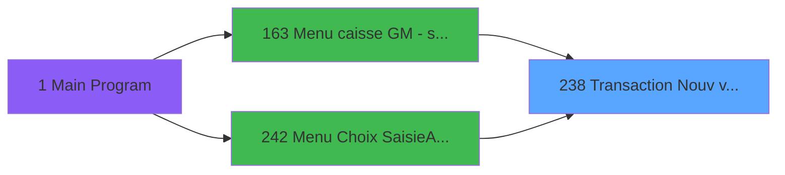
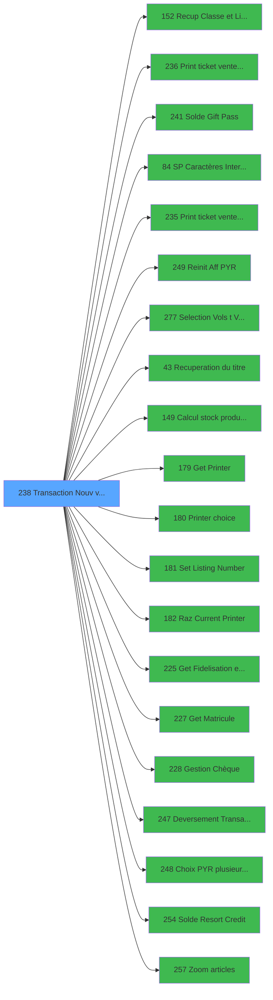

# ADH IDE 238 - Transaction Nouv vente PMS-584

> **Analyse**: Phases 1-4 2026-02-07 03:53 -> 03:54 (29s) | Assemblage 04:33
> **Pipeline**: V7.2 Enrichi
> **Structure**: 4 onglets (Resume | Ecrans | Donnees | Connexions)

<!-- TAB:Resume -->

## 1. FICHE D'IDENTITE

| Attribut | Valeur |
|----------|--------|
| Projet | ADH |
| IDE Position | 238 |
| Nom Programme | Transaction Nouv vente PMS-584 |
| Fichier source | `Prg_238.xml` |
| Dossier IDE | Ventes |
| Taches | 63 (12 ecrans visibles) |
| Tables modifiees | 11 |
| Programmes appeles | 20 |
| Complexite | **HAUTE** (score 85/100) |

## 2. DESCRIPTION FONCTIONNELLE

ADH IDE 238 est le programme de saisie transactionnelle principal pour les ventes au guichet de la caisse. Il capture l'intégralité du flux commercial : sélection articles/services, vérification soldes (Gift Pass, Resort Credit), calcul des totaux, puis gestion complète du paiement (choix moyen de règlement, TPE, chèques). Le programme valide les caractères saisis, calcule les stocks en temps réel, applique la fidelisation/remises, et gère les cas exceptionnels (refus TPE, articles non vendables).

Une fois la transaction acceptée, le programme orchestrate l'impression du ticket via une logique de file d'attente (Get Printer → Set Listing Number → Print ticket), supporte plusieurs formats (PMS-584 standard vs. LEX spécifique), et enregistre les écarts caisse par lieu de vente. Il interfacce avec le système Booker pour les vols/hébergements, gère les dépôts en monnaie (deversement), et met à jour les compteurs clés (cpt) nécessaires à la fermeture caisse.

La structure à 6 sous-tâches maîtrise les étapes critiques : initialisation de la transaction, validation des règlements avant refus TPE, vérification des soldes restants post-paiement, et déversement final des fonds. Les 11 tables modifiées couvrent l'historique ventes (prestations/mvt_prestation), les comptes mouvementés (compte_gm), les statistiques (stat_lieu_vente_date), et la cache locale (tempo_ecran_police).

## 3. BLOCS FONCTIONNELS

### 3.1 Saisie (9 taches)

L'operateur saisit les donnees de la transaction via 8 ecrans (Saisie transaction, Saisie Bilaterale, Saisie mode de règlement, Saisie Commentaires, VRL : Saisie identité, Saisie dates forfait, Affiche saisie, Affiche saisie).

---

#### <a id="t1"></a>T1 - Saisie transaction [ECRAN]

**Role** : Tache d'orchestration : point d'entree du programme (9 sous-taches). Coordonne l'enchainement des traitements.
**Ecran** : 1112 x 279 DLU (Modal) | [Voir mockup](#ecran-t1)

<details>
<summary>8 sous-taches directes</summary>

| Tache | Nom | Bloc |
|-------|-----|------|
| [T8](#t8) | Saisie Bilaterale **[ECRAN]** | Saisie |
| [T9](#t9) | Saisie mode de règlement **[ECRAN]** | Saisie |
| [T11](#t11) | Saisie Commentaires **[ECRAN]** | Saisie |
| [T12](#t12) | VRL : Saisie identité **[ECRAN]** | Saisie |
| [T20](#t20) | Saisie dates forfait **[ECRAN]** | Saisie |
| [T31](#t31) | Affiche saisie **[ECRAN]** | Saisie |
| [T54](#t54) | Affiche saisie **[ECRAN]** | Saisie |
| [T57](#t57) | Ligne vente | Saisie |

</details>
**Variables liees** : R (W0 FIN SAISIE OD), CD (W0 b.Saisie PAX), EA (W0 Forcer Transaction Manuelle), ED (W0 Fin Transaction TPE), FD (V Nbre de Ligne Saisies)
**Delegue a** : [ Print ticket vente PMS-584 (IDE 236)](ADH-IDE-236.md), [ Print ticket vente LEX (IDE 235)](ADH-IDE-235.md), [Deversement Transaction (IDE 247)](ADH-IDE-247.md)

---

#### <a id="t8"></a>T8 - Saisie Bilaterale [ECRAN]

**Role** : Saisie des donnees : Saisie Bilaterale.
**Ecran** : 326 x 249 DLU (Type6) | [Voir mockup](#ecran-t8)
**Variables liees** : R (W0 FIN SAISIE OD), CD (W0 b.Saisie PAX), FD (V Nbre de Ligne Saisies), S (Bouton FIN SAISIE OD)
**Delegue a** : [ Print ticket vente PMS-584 (IDE 236)](ADH-IDE-236.md), [ Print ticket vente LEX (IDE 235)](ADH-IDE-235.md), [Deversement Transaction (IDE 247)](ADH-IDE-247.md)

---

#### <a id="t9"></a>T9 - Saisie mode de règlement [ECRAN]

**Role** : Saisie des donnees : Saisie mode de règlement.
**Ecran** : 506 x 250 DLU (Type6) | [Voir mockup](#ecran-t9)
**Variables liees** : R (W0 FIN SAISIE OD), CD (W0 b.Saisie PAX), DH (W0 mode de paiement), FC (v Réponse mode paiement), FD (V Nbre de Ligne Saisies)
**Delegue a** : [ Print ticket vente PMS-584 (IDE 236)](ADH-IDE-236.md), [ Print ticket vente LEX (IDE 235)](ADH-IDE-235.md), [Deversement Transaction (IDE 247)](ADH-IDE-247.md)

---

#### <a id="t11"></a>T11 - Saisie Commentaires [ECRAN]

**Role** : Saisie des donnees : Saisie Commentaires.
**Ecran** : 772 x 169 DLU (Type6) | [Voir mockup](#ecran-t11)
**Variables liees** : R (W0 FIN SAISIE OD), CD (W0 b.Saisie PAX), FD (V Nbre de Ligne Saisies), S (Bouton FIN SAISIE OD)
**Delegue a** : [ Print ticket vente PMS-584 (IDE 236)](ADH-IDE-236.md), [ Print ticket vente LEX (IDE 235)](ADH-IDE-235.md), [Deversement Transaction (IDE 247)](ADH-IDE-247.md)

---

#### <a id="t12"></a>T12 - VRL : Saisie identité [ECRAN]

**Role** : Saisie des donnees : VRL : Saisie identité.
**Ecran** : 699 x 157 DLU (MDI) | [Voir mockup](#ecran-t12)
**Variables liees** : R (W0 FIN SAISIE OD), CD (W0 b.Saisie PAX), FD (V Nbre de Ligne Saisies), S (Bouton FIN SAISIE OD)
**Delegue a** : [ Print ticket vente PMS-584 (IDE 236)](ADH-IDE-236.md), [ Print ticket vente LEX (IDE 235)](ADH-IDE-235.md), [Deversement Transaction (IDE 247)](ADH-IDE-247.md)

---

#### <a id="t20"></a>T20 - Saisie dates forfait [ECRAN]

**Role** : Saisie des donnees : Saisie dates forfait.
**Ecran** : 528 x 121 DLU (MDI) | [Voir mockup](#ecran-t20)
**Variables liees** : R (W0 FIN SAISIE OD), CD (W0 b.Saisie PAX), DQ (W0 forfait (O/N)), DS (W0 forfait date(O/N)), DT (W0 code forfait)
**Delegue a** : [ Print ticket vente PMS-584 (IDE 236)](ADH-IDE-236.md), [ Print ticket vente LEX (IDE 235)](ADH-IDE-235.md), [Deversement Transaction (IDE 247)](ADH-IDE-247.md)

---

#### <a id="t31"></a>T31 - Affiche saisie [ECRAN]

**Role** : Saisie des donnees : Affiche saisie.
**Ecran** : 427 x 124 DLU (Modal) | [Voir mockup](#ecran-t31)
**Variables liees** : R (W0 FIN SAISIE OD), CD (W0 b.Saisie PAX), FD (V Nbre de Ligne Saisies), S (Bouton FIN SAISIE OD)
**Delegue a** : [ Print ticket vente PMS-584 (IDE 236)](ADH-IDE-236.md), [ Print ticket vente LEX (IDE 235)](ADH-IDE-235.md), [Deversement Transaction (IDE 247)](ADH-IDE-247.md)

---

#### <a id="t54"></a>T54 - Affiche saisie [ECRAN]

**Role** : Saisie des donnees : Affiche saisie.
**Ecran** : 427 x 124 DLU (Modal) | [Voir mockup](#ecran-t54)
**Variables liees** : R (W0 FIN SAISIE OD), CD (W0 b.Saisie PAX), FD (V Nbre de Ligne Saisies), S (Bouton FIN SAISIE OD)
**Delegue a** : [ Print ticket vente PMS-584 (IDE 236)](ADH-IDE-236.md), [ Print ticket vente LEX (IDE 235)](ADH-IDE-235.md), [Deversement Transaction (IDE 247)](ADH-IDE-247.md)

---

#### <a id="t57"></a>T57 - Ligne vente

**Role** : Saisie des donnees : Ligne vente.
**Variables liees** : HB (P.Toute ligne), HE (P.i.num ligne a modifier), HF (P.i.nr ligne a supprimer), EF (W0 Total_Vente), FD (V Nbre de Ligne Saisies)
**Delegue a** : [ Print ticket vente PMS-584 (IDE 236)](ADH-IDE-236.md), [ Print ticket vente LEX (IDE 235)](ADH-IDE-235.md), [Deversement Transaction (IDE 247)](ADH-IDE-247.md)


### 3.2 Initialisation (3 taches)

Reinitialisation d'etats et variables de travail.

---

#### <a id="t2"></a>T2 - RAZ LCO liberation

**Role** : Reinitialisation : RAZ LCO liberation.
**Delegue a** : [Reinit Aff PYR (IDE 249)](ADH-IDE-249.md)

---

#### <a id="t10"></a>T10 - RAZ 269

**Role** : Reinitialisation : RAZ 269.
**Delegue a** : [Reinit Aff PYR (IDE 249)](ADH-IDE-249.md)

---

#### <a id="t33"></a>T33 - RAZ 269

**Role** : Reinitialisation : RAZ 269.
**Delegue a** : [Reinit Aff PYR (IDE 249)](ADH-IDE-249.md)


### 3.3 Reglement (5 taches)

Gestion des moyens de paiement : 5 taches de reglement.

---

#### <a id="t3"></a>T3 - Reglements suite a refus TPE [ECRAN]

**Role** : Gestion du reglement : Reglements suite a refus TPE.
**Ecran** : 708 x 256 DLU (Type6) | [Voir mockup](#ecran-t3)
**Delegue a** : [Recup Classe et Lib du MOP (IDE 152)](ADH-IDE-152.md)

---

#### <a id="t6"></a>T6 - Verif reglement tpe

**Role** : Gestion du reglement : Verif reglement tpe.
**Variables liees** : EU (V.Reglement premier article), FE (v Nbre ligne de reglement Saisi), FG (V.Total reglement ligne), FH (V.Multi reglement ligne)
**Delegue a** : [Recup Classe et Lib du MOP (IDE 152)](ADH-IDE-152.md)

---

#### <a id="t29"></a>T29 - Creation reglement

**Role** : Gestion du reglement : Creation reglement.
**Variables liees** : EU (V.Reglement premier article), FE (v Nbre ligne de reglement Saisi), FG (V.Total reglement ligne), FH (V.Multi reglement ligne)
**Delegue a** : [Recup Classe et Lib du MOP (IDE 152)](ADH-IDE-152.md)

---

#### <a id="t35"></a>T35 - Changement MOP multi paiement

**Role** : Gestion du reglement : Changement MOP multi paiement.
**Variables liees** : DH (W0 mode de paiement), FC (v Réponse mode paiement), FH (V.Multi reglement ligne), GD (v.Existe paiement OD), GE (v.Existe paiement $CARD)
**Delegue a** : [Recup Classe et Lib du MOP (IDE 152)](ADH-IDE-152.md)

---

#### <a id="t50"></a>T50 - Vérif Mop Mobilité

**Role** : Traitement : Vérif Mop Mobilité.
**Variables liees** : GJ (v.Vérif Mop Mobilité)
**Delegue a** : [Recup Classe et Lib du MOP (IDE 152)](ADH-IDE-152.md)


### 3.4 Validation (1 tache)

Controles de coherence : 1 tache verifie les donnees et conditions.

---

#### <a id="t4"></a>T4 - verif reg restant

**Role** : Verification : verif reg restant.


### 3.5 Creation (7 taches)

Insertion de nouveaux enregistrements en base.

---

#### <a id="t5"></a>T5 - creation règlement

**Role** : Creation d'enregistrement : creation règlement.

---

#### <a id="t23"></a>T23 - Creation prestation

**Role** : Creation d'enregistrement : Creation prestation.

---

#### <a id="t28"></a>T28 - Creation Tempo

**Role** : Creation d'enregistrement : Creation Tempo.

---

#### <a id="t30"></a>T30 - Creation

**Role** : Creation d'enregistrement : Creation.

---

#### <a id="t53"></a>T53 - Creation_heure_liberation

**Role** : Creation d'enregistrement : Creation_heure_liberation.

---

#### <a id="t55"></a>T55 - Creation Tempo

**Role** : Creation d'enregistrement : Creation Tempo.

---

#### <a id="t62"></a>T62 - Creation prestation

**Role** : Creation d'enregistrement : Creation prestation.


### 3.6 Traitement (27 taches)

Traitements internes.

---

#### <a id="t7"></a>T7 - Dé-Affecition

**Role** : Traitement : Dé-Affecition.

---

#### <a id="t13"></a>T13 - Test si cloture en cours

**Role** : Verification : Test si cloture en cours.
**Variables liees** : T (W0 Cloture en cours), GQ (v.annuler imputation en cours?)

---

#### <a id="t14"></a>T14 - Blocage cloture v1

**Role** : Traitement : Blocage cloture v1.
**Variables liees** : T (W0 Cloture en cours)

---

#### <a id="t15"></a>T15 - Blocage cloture v1

**Role** : Traitement : Blocage cloture v1.
**Variables liees** : T (W0 Cloture en cours)

---

#### <a id="t17"></a>T17 - Test reseau

**Role** : Verification : Test reseau.
**Variables liees** : DO (W0 reseau)

---

#### <a id="t18"></a>T18 - Forfait

**Role** : Traitement : Forfait.
**Variables liees** : DQ (W0 forfait (O/N)), DS (W0 forfait date(O/N)), DT (W0 code forfait)

---

#### <a id="t19"></a>T19 - (sans nom) [ECRAN]

**Role** : Traitement interne.
**Ecran** : 116 x 32 DLU (Modal) | [Voir mockup](#ecran-t19)

---

#### <a id="t21"></a>T21 - Effacement forfait

**Role** : Traitement : Effacement forfait.
**Variables liees** : DQ (W0 forfait (O/N)), DR (W0 effacement (O/N)), DS (W0 forfait date(O/N)), DT (W0 code forfait)

---

#### <a id="t22"></a>T22 - Effacement mvt forfait

**Role** : Traitement : Effacement mvt forfait.
**Variables liees** : DQ (W0 forfait (O/N)), DR (W0 effacement (O/N)), DS (W0 forfait date(O/N)), DT (W0 code forfait)

---

#### <a id="t24"></a>T24 - Deblocage cloture v1

**Role** : Traitement : Deblocage cloture v1.
**Variables liees** : T (W0 Cloture en cours)

---

#### <a id="t25"></a>T25 - Deblocage cloture

**Role** : Traitement : Deblocage cloture.
**Variables liees** : T (W0 Cloture en cours)

---

#### <a id="t26"></a>T26 - Gratuite ?

**Role** : Traitement : Gratuite ?.
**Variables liees** : DW (W0 gratuite ?)

---

#### <a id="t32"></a>T32 - garantie?

**Role** : Traitement : garantie?.

---

#### <a id="t42"></a>T42 - Supprime enregs non affectés

**Role** : Traitement : Supprime enregs non affectés.
**Variables liees** : HF (P.i.nr ligne a supprimer)

---

#### <a id="t45"></a>T45 - Affectation Auto

**Role** : Traitement : Affectation Auto.
**Variables liees** : FL (V.Num Autorisation)

---

#### <a id="t46"></a>T46 - MaJ Num Chèque

**Role** : Traitement : MaJ Num Chèque.

---

#### <a id="t47"></a>T47 - Vérif. existe vte OD

**Role** : Traitement : Vérif. existe vte OD.
**Variables liees** : GD (v.Existe paiement OD), GE (v.Existe paiement $CARD), GV (v. pied stype existe?), GW (v. pied type existe?), DI (Existe mode de paiement)

---

#### <a id="t48"></a>T48 - Envoi mail garantie

**Role** : Traitement : Envoi mail garantie.
**Variables liees** : GF (v.Email client), GH (v.decline envoi mail)

---

#### <a id="t49"></a>T49 - Envoi mail garantie

**Role** : Traitement : Envoi mail garantie.
**Variables liees** : GF (v.Email client), GH (v.decline envoi mail)

---

#### <a id="t51"></a>T51 - Libération du logement [ECRAN]

**Role** : Traitement : Libération du logement.
**Ecran** : 123 x 151 DLU | [Voir mockup](#ecran-t51)
**Variables liees** : EP (W0 Lien Logement Lieu Séjour), GP (v.Flag abandon libération)

---

#### <a id="t52"></a>T52 - Récup nb chambre /LCO [ECRAN]

**Role** : Traitement : Récup nb chambre /LCO.
**Ecran** : 123 x 89 DLU | [Voir mockup](#ecran-t52)
**Variables liees** : BG (W0 Categorie de chambre), CX (W0 Nb Chambres), CY (W0 Chambre), DA (W0 Lib Bouton Chambre), GN (v.Nb chambres /LCO)

---

#### <a id="t56"></a>T56 - Suppression fich dépend.

**Role** : Traitement : Suppression fich dépend..
**Variables liees** : GI (v.Fichier ticket vente), GR (v.confirm suppression ligne)

---

#### <a id="t58"></a>T58 - Heure libération

**Role** : Traitement : Heure libération.
**Variables liees** : BP (W0 Heure du transfert Aller), BY (W0 Heure du transfert Retour), GM (v.Date/heure alpha), GP (v.Flag abandon libération)

---

#### <a id="t59"></a>T59 - Heure libération

**Role** : Traitement : Heure libération.
**Variables liees** : BP (W0 Heure du transfert Aller), BY (W0 Heure du transfert Retour), GM (v.Date/heure alpha), GP (v.Flag abandon libération)

---

#### <a id="t60"></a>T60 - Effacement forfait

**Role** : Traitement : Effacement forfait.
**Variables liees** : DQ (W0 forfait (O/N)), DR (W0 effacement (O/N)), DS (W0 forfait date(O/N)), DT (W0 code forfait)

---

#### <a id="t61"></a>T61 - Effacement mvt forfait

**Role** : Traitement : Effacement mvt forfait.
**Variables liees** : DQ (W0 forfait (O/N)), DR (W0 effacement (O/N)), DS (W0 forfait date(O/N)), DT (W0 code forfait)

---

#### <a id="t63"></a>T63 - Supprime enregs non affectés

**Role** : Traitement : Supprime enregs non affectés.
**Variables liees** : HF (P.i.nr ligne a supprimer)


### 3.7 Calcul (5 taches)

Calculs metier : montants, stocks, compteurs.

---

#### <a id="t16"></a>T16 - Reaffichage infos compte

**Role** : Reinitialisation : Reaffichage infos compte.
**Variables liees** : D (P0 solde compte), H (P0 etat compte), EI (W0 Compte garanti)
**Delegue a** : [Calcul stock produit WS (IDE 149)](ADH-IDE-149.md)

---

#### <a id="t36"></a>T36 - calcul nombre carte

**Role** : Calcul : calcul nombre carte.
**Variables liees** : FO (V.Total carte), FQ (V.Nombre de carte)
**Delegue a** : [Calcul stock produit WS (IDE 149)](ADH-IDE-149.md)

---

#### <a id="t38"></a>T38 - Compte Enregs affectés

**Role** : Traitement : Compte Enregs affectés.
**Variables liees** : D (P0 solde compte), H (P0 etat compte), EI (W0 Compte garanti)
**Delegue a** : [Calcul stock produit WS (IDE 149)](ADH-IDE-149.md)

---

#### <a id="t43"></a>T43 - Compte Enregs affectés

**Role** : Traitement : Compte Enregs affectés.
**Variables liees** : D (P0 solde compte), H (P0 etat compte), EI (W0 Compte garanti)
**Delegue a** : [Calcul stock produit WS (IDE 149)](ADH-IDE-149.md)

---

#### <a id="t44"></a>T44 - Compte Enregs affectés

**Role** : Traitement : Compte Enregs affectés.
**Variables liees** : D (P0 solde compte), H (P0 etat compte), EI (W0 Compte garanti)
**Delegue a** : [Calcul stock produit WS (IDE 149)](ADH-IDE-149.md)


### 3.8 Consultation (1 tache)

Ecrans de recherche et consultation.

---

#### <a id="t27"></a>T27 - Recherche imputation/ssimput

**Role** : Traitement : Recherche imputation/ssimput.
**Delegue a** : [Selection Vols /t Ville à côté (IDE 277)](ADH-IDE-277.md), [Choix PYR (plusieurs chambres) (IDE 248)](ADH-IDE-248.md), [Zoom articles (IDE 257)](ADH-IDE-257.md)


### 3.9 Impression (1 tache)

Generation des documents et tickets.

---

#### <a id="t34"></a>T34 - Increment Num. Ticket(VRL/VSL)

**Role** : Generation du document : Increment Num. Ticket(VRL/VSL).
**Variables liees** : EY (v.IncrémentTicket(VRL/VSL) OK), FA (v.NumeroTicket(VRL/VSL))
**Delegue a** : [Get Printer (IDE 179)](ADH-IDE-179.md), [Printer choice (IDE 180)](ADH-IDE-180.md), [Raz Current Printer (IDE 182)](ADH-IDE-182.md)


### 3.10 Transfert (4 taches)

Transfert de donnees entre modules.

---

#### <a id="t37"></a>T37 - Raz Affectation Transfert

**Role** : Reinitialisation : Raz Affectation Transfert.
**Variables liees** : BN (W0 Sens du transfert Aller), BO (W0 Date du transfert Aller), BP (W0 Heure du transfert Aller), BQ (W0 b.Date du transfert), BW (W0 Sens du transfert Retour)

---

#### <a id="t39"></a>T39 - Type transfert [ECRAN]

**Role** : Transfert de donnees : Type transfert.
**Ecran** : 722 x 292 DLU (Type6) | [Voir mockup](#ecran-t39)
**Variables liees** : BN (W0 Sens du transfert Aller), BO (W0 Date du transfert Aller), BP (W0 Heure du transfert Aller), BQ (W0 b.Date du transfert), BR (W0 Type d'endroit Aller)

---

#### <a id="t40"></a>T40 - Affiche Transfert A/R [ECRAN]

**Role** : Reinitialisation : Affiche Transfert A/R.
**Ecran** : 681 x 205 DLU (Type6) | [Voir mockup](#ecran-t40)
**Variables liees** : BN (W0 Sens du transfert Aller), BO (W0 Date du transfert Aller), BP (W0 Heure du transfert Aller), BQ (W0 b.Date du transfert), BW (W0 Sens du transfert Retour)

---

#### <a id="t41"></a>T41 - Affectation PAX / Transfert [ECRAN]

**Role** : Transfert de donnees : Affectation PAX / Transfert.
**Ecran** : 1056 x 281 DLU | [Voir mockup](#ecran-t41)
**Variables liees** : BN (W0 Sens du transfert Aller), BO (W0 Date du transfert Aller), BP (W0 Heure du transfert Aller), BQ (W0 b.Date du transfert), BW (W0 Sens du transfert Retour)


## 5. REGLES METIER

19 regles identifiees:

### Saisie (8 regles)

#### <a id="rm-RM-001"></a>[RM-001] Determine le sens du trajet selon le service village (1=ALLER, 2=RETOUR, 3=A/R)

| Element | Detail |
|---------|--------|
| **Condition** | `Trim(W0 service village [BB])='1'` |
| **Si vrai** | 'ALLER' |
| **Si faux** | IF(Trim(W0 service village [BB])='2','RETOUR',IF(Trim(W0 service village [BB])='3','ALLER/RETOUR',''))) |
| **Variables** | BB (W0 service village) |
| **Expression source** | Expression 2 : `IF(Trim(W0 service village [BB])='1','ALLER',IF(Trim(W0 serv` |
| **Exemple** | Si Trim(W0 service village [BB])='1' → 'ALLER' |
| **Impact** | Bloc Saisie |

#### <a id="rm-RM-002"></a>[RM-002] Si v.Token Id [GB] est nul, choix conditionnel selon v.SoldeGiftPass [W] (valeur 'VSL')

| Element | Detail |
|---------|--------|
| **Condition** | `v.Token Id [GB]=0` |
| **Si vrai** | IF(v.SoldeGiftPass [W]='VSL' |
| **Si faux** | P0.Date debut sejour [M],Date()),W0 Num rue [CS]) |
| **Variables** | M (P0.Date debut sejour), CS (W0 Num rue), W (v.SoldeGiftPass), GB (v.Token Id) |
| **Expression source** | Expression 5 : `IF(v.Token Id [GB]=0,IF(v.SoldeGiftPass [W]='VSL',P0.Date de` |
| **Exemple** | Si v.Token Id [GB]=0 → IF(v.SoldeGiftPass [W]='VSL'. Sinon → P0.Date debut sejour [M],Date()),W0 Num rue [CS]) |
| **Impact** | Bloc Saisie |

#### <a id="rm-RM-006"></a>[RM-006] Si W0 Motif de non enreg NA [CM] est FAUX, branche alternative

| Element | Detail |
|---------|--------|
| **Condition** | `NOT W0 Motif de non enreg NA [CM]` |
| **Si vrai** | W0.Date fin sejour [CL] |
| **Si faux** | W0 Titre [CP]) |
| **Variables** | CL (W0.Date fin sejour), CM (W0 Motif de non enreg NA), CP (W0 Titre) |
| **Expression source** | Expression 95 : `IF(NOT W0 Motif de non enreg NA [CM],W0.Date fin sejour [CL]` |
| **Exemple** | Si NOT W0 Motif de non enreg NA [CM] → W0.Date fin sejour [CL]. Sinon → W0 Titre [CP]) |
| **Impact** | Bloc Saisie |

#### <a id="rm-RM-008"></a>[RM-008] Calcul de pourcentage avec arrondi

| Element | Detail |
|---------|--------|
| **Condition** | `W0 Titre [CP]<>0 AND NOT(W0 Motif de non enreg NA [CM])` |
| **Si vrai** | Fix(W0 Motif annulation [CO]*W0 Titre [CP]/100 |
| **Si faux** | 11,P0.Nb decimales [O]),W0 Prenom [CR]) |
| **Variables** | O (P0.Nb decimales), CM (W0 Motif de non enreg NA), CO (W0 Motif annulation), CP (W0 Titre), CR (W0 Prenom) |
| **Expression source** | Expression 116 : `IF(W0 Titre [CP]<>0 AND NOT(W0 Motif de non enreg NA [CM]),F` |
| **Exemple** | Si W0 Titre [CP]<>0 AND NOT(W0 Motif de non enreg NA [CM]) → Fix(W0 Motif annulation [CO]*W0 Titre [CP]/100. Sinon → 11,P0.Nb decimales [O]),W0 Prenom [CR]) |
| **Impact** | Bloc Saisie |

#### <a id="rm-RM-009"></a>[RM-009] Si v.Token Id [GB]=0 AND W0 Nom de la rue [CT]=0 alors IF(v.SoldeGiftPass [W]='VSL' sinon P0 date fin sejour [G],W0 Nom de la rue [CT]),W0 Nom de la rue [CT])

| Element | Detail |
|---------|--------|
| **Condition** | `v.Token Id [GB]=0 AND W0 Nom de la rue [CT]=0` |
| **Si vrai** | IF(v.SoldeGiftPass [W]='VSL' |
| **Si faux** | P0 date fin sejour [G],W0 Nom de la rue [CT]),W0 Nom de la rue [CT]) |
| **Variables** | G (P0 date fin sejour), CQ (W0 Nom), CT (W0 Nom de la rue), W (v.SoldeGiftPass), GB (v.Token Id) |
| **Expression source** | Expression 121 : `IF(v.Token Id [GB]=0 AND W0 Nom de la rue [CT]=0,IF(v.SoldeG` |
| **Exemple** | Si v.Token Id [GB]=0 AND W0 Nom de la rue [CT]=0 → IF(v.SoldeGiftPass [W]='VSL' |
| **Impact** | Bloc Saisie |

#### <a id="rm-RM-012"></a>[RM-012] Traitement si W0 Chambre [CY] est renseigne

| Element | Detail |
|---------|--------|
| **Condition** | `W0 Chambre [CY]<>''` |
| **Si vrai** | RTrim (W0 Nb Chambres [CX])&Fill (' ' |
| **Si faux** | Len (RTrim (W0 Nb Chambres [CX]))-1)&RTrim (W0 Chambre [CY])&' '&W0 PYR Valide [CZ],Trim(P0 Nom & prenom [K])) |
| **Variables** | K (P0 Nom & prenom), CX (W0 Nb Chambres), CY (W0 Chambre), CZ (W0 PYR Valide) |
| **Expression source** | Expression 149 : `IF(W0 Chambre [CY]<>'',RTrim (W0 Nb Chambres [CX])&Fill (' '` |
| **Exemple** | Si W0 Chambre [CY]<>'' → RTrim (W0 Nb Chambres [CX])&Fill (' ' |
| **Impact** | Bloc Saisie |

#### <a id="rm-RM-013"></a>[RM-013] Si V.Total reglement ligne [FG] alors V.Id transaction PMS [FJ] sinon VG18)

| Element | Detail |
|---------|--------|
| **Condition** | `V.Total reglement ligne [FG]` |
| **Si vrai** | V.Id transaction PMS [FJ] |
| **Si faux** | VG18) |
| **Variables** | FG (V.Total reglement ligne), FJ (V.Id transaction PMS) |
| **Expression source** | Expression 156 : `IF(V.Total reglement ligne [FG],V.Id transaction PMS [FJ],VG` |
| **Exemple** | Si V.Total reglement ligne [FG] → V.Id transaction PMS [FJ]. Sinon → VG18) |
| **Impact** | [T57 - Ligne vente](#t57) |

#### <a id="rm-RM-017"></a>[RM-017] Condition toujours fausse (flag inactif)

| Element | Detail |
|---------|--------|
| **Condition** | `v.SoldeGiftPass [W]='PYR'` |
| **Si vrai** | NOT(W0 mode de paiement [DH]) |
| **Si faux** | 'FALSE'LOG) |
| **Variables** | DH (W0 mode de paiement), W (v.SoldeGiftPass) |
| **Expression source** | Expression 274 : `IF(v.SoldeGiftPass [W]='PYR',NOT(W0 mode de paiement [DH]),'` |
| **Exemple** | Si v.SoldeGiftPass [W]='PYR' → NOT(W0 mode de paiement [DH]). Sinon → 'FALSE'LOG) |
| **Impact** | Bloc Saisie |

### Reglement (2 regles)

#### <a id="rm-RM-003"></a>[RM-003] Valeur par defaut si P0 masque montant [C] est vide

| Element | Detail |
|---------|--------|
| **Condition** | `P0 masque montant [C]=''` |
| **Si vrai** | '15.2' |
| **Si faux** | P0 masque montant [C]) |
| **Variables** | C (P0 masque montant) |
| **Expression source** | Expression 35 : `IF (P0 masque montant [C]='','15.2',P0 masque montant [C])` |
| **Exemple** | Si P0 masque montant [C]='' → '15.2'. Sinon → P0 masque montant [C]) |
| **Impact** | Bloc Reglement |

#### <a id="rm-RM-005"></a>[RM-005] Si NOT(VG89) alors IF(VG7 OR VG35 OR VG87 sinon 'P0 masque montant [C]'FORM,'P0 devise locale [B]'FORM),IF(VG7 OR VG35 OR VG87,'P0 code GM [E]'FORM,'P0 solde compte [D]'FORM))

| Element | Detail |
|---------|--------|
| **Condition** | `NOT(VG89)` |
| **Si vrai** | IF(VG7 OR VG35 OR VG87 |
| **Si faux** | 'P0 masque montant [C]'FORM,'P0 devise locale [B]'FORM),IF(VG7 OR VG35 OR VG87,'P0 code GM [E]'FORM,'P0 solde compte [D]'FORM)) |
| **Variables** | B (P0 devise locale), C (P0 masque montant), D (P0 solde compte), E (P0 code GM) |
| **Expression source** | Expression 93 : `IF(NOT(VG89),IF(VG7 OR VG35 OR VG87,'P0 masque montant [C]'F` |
| **Exemple** | Si NOT(VG89) → IF(VG7 OR VG35 OR VG87 |
| **Impact** | [T38 - Compte Enregs affectés](#t38) |

### Autres (9 regles)

#### <a id="rm-RM-004"></a>[RM-004] Si VG80 AND VG82 vaut 'TB' alors 'M', sinon 'W'

| Element | Detail |
|---------|--------|
| **Condition** | `VG80 AND VG82='TB'` |
| **Si vrai** | 'M' |
| **Si faux** | 'W') |
| **Expression source** | Expression 73 : `IF(VG80 AND VG82='TB','M','W')` |
| **Exemple** | Si VG80 AND VG82='TB' → 'M'. Sinon → 'W') |

#### <a id="rm-RM-007"></a>[RM-007] Si v.SoldeGiftPass [W] vaut 'VRL' alors 'Date consommation', sinon 'Date début séjour'

| Element | Detail |
|---------|--------|
| **Condition** | `v.SoldeGiftPass [W]='VRL'` |
| **Si vrai** | 'Date consommation' |
| **Si faux** | 'Date début séjour') |
| **Variables** | W (v.SoldeGiftPass) |
| **Expression source** | Expression 113 : `IF(v.SoldeGiftPass [W]='VRL','Date consommation','Date début` |
| **Exemple** | Si v.SoldeGiftPass [W]='VRL' → 'Date consommation'. Sinon → 'Date début séjour') |

#### <a id="rm-RM-010"></a>[RM-010] Position UI conditionnelle selon v.SoldeGiftPass [W]

| Element | Detail |
|---------|--------|
| **Condition** | `IN (v.SoldeGiftPass [W]` |
| **Si vrai** | 'VRL' |
| **Si faux** | 'VSL','TRF','PYR'),31.125,14.875) |
| **Variables** | W (v.SoldeGiftPass) |
| **Expression source** | Expression 127 : `IF(IN (v.SoldeGiftPass [W],'VRL','VSL','TRF','PYR'),31.125,1` |
| **Exemple** | Si IN (v.SoldeGiftPass [W] → 'VRL'. Sinon → 'VSL','TRF','PYR'),31.125,14.875) |

#### <a id="rm-RM-011"></a>[RM-011] Si v.SoldeGiftPass [W]='TRF' alors 31.750 sinon 40.125)

| Element | Detail |
|---------|--------|
| **Condition** | `v.SoldeGiftPass [W]='TRF'` |
| **Si vrai** | 31.750 |
| **Si faux** | 40.125) |
| **Variables** | W (v.SoldeGiftPass) |
| **Expression source** | Expression 133 : `IF(v.SoldeGiftPass [W]='TRF',31.750,40.125)` |
| **Exemple** | Si v.SoldeGiftPass [W]='TRF' → 31.750. Sinon → 40.125) |

#### <a id="rm-RM-014"></a>[RM-014] Si V.RC utilisé [GA] alors 'V' sinon IF([AQ]='O','C','D'))

| Element | Detail |
|---------|--------|
| **Condition** | `V.RC utilisé [GA]` |
| **Si vrai** | 'V' |
| **Si faux** | IF([AQ]='O','C','D')) |
| **Variables** | GA (V.RC utilisé) |
| **Expression source** | Expression 169 : `IF(V.RC utilisé [GA],'V',IF([AQ]='O','C','D'))` |
| **Exemple** | Si V.RC utilisé [GA] → 'V'. Sinon → IF([AQ]='O','C','D')) |

#### <a id="rm-RM-015"></a>[RM-015] Si NOT(v.Flag abandon libération [GP]) alors 132.875 sinon 105.875)

| Element | Detail |
|---------|--------|
| **Condition** | `NOT(v.Flag abandon libération [GP])` |
| **Si vrai** | 132.875 |
| **Si faux** | 105.875) |
| **Variables** | GP (v.Flag abandon libération) |
| **Expression source** | Expression 227 : `IF (NOT(v.Flag abandon libération [GP]),132.875,105.875)` |
| **Exemple** | Si NOT(v.Flag abandon libération [GP]) → 132.875. Sinon → 105.875) |
| **Impact** | [T51 - Libération du logement](#t51) |

#### <a id="rm-RM-016"></a>[RM-016] Si v.SoldeGiftPass [W] vaut 'ANN' alors 'O', sinon 'N'

| Element | Detail |
|---------|--------|
| **Condition** | `v.SoldeGiftPass [W]='ANN'` |
| **Si vrai** | 'O' |
| **Si faux** | 'N') |
| **Variables** | W (v.SoldeGiftPass) |
| **Expression source** | Expression 238 : `IF(v.SoldeGiftPass [W]='ANN','O','N')` |
| **Exemple** | Si v.SoldeGiftPass [W]='ANN' → 'O'. Sinon → 'N') |

#### <a id="rm-RM-018"></a>[RM-018] Si [HK] alors 'S' sinon IF([HL],'E',''))

| Element | Detail |
|---------|--------|
| **Condition** | `[HK]` |
| **Si vrai** | 'S' |
| **Si faux** | IF([HL],'E','')) |
| **Expression source** | Expression 288 : `IF([HK],'S',IF([HL],'E',''))` |
| **Exemple** | Si [HK] → 'S'. Sinon → IF([HL],'E','')) |

#### <a id="rm-RM-019"></a>[RM-019] Si VG20>1 alors [AZ] sinon 'G')

| Element | Detail |
|---------|--------|
| **Condition** | `VG20>1` |
| **Si vrai** | [AZ] |
| **Si faux** | 'G') |
| **Expression source** | Expression 320 : `IF(VG20>1,[AZ],'G')` |
| **Exemple** | Si VG20>1 → [AZ]. Sinon → 'G') |

## 6. CONTEXTE

- **Appele par**: [Menu caisse GM - scroll (IDE 163)](ADH-IDE-163.md), [Menu Choix Saisie/Annul vente (IDE 242)](ADH-IDE-242.md)
- **Appelle**: 20 programmes | **Tables**: 34 (W:11 R:14 L:20) | **Taches**: 63 | **Expressions**: 350

<!-- TAB:Ecrans -->

## 8. ECRANS

### 8.1 Forms visibles (12 / 63)

| # | Position | Tache | Nom | Type | Largeur | Hauteur | Bloc |
|---|----------|-------|-----|------|---------|---------|------|
| 1 | 238 | T1 | Saisie transaction | Modal | 1112 | 279 | Saisie |
| 2 | 238.2 | T3 | Reglements suite a refus TPE | Type6 | 708 | 256 | Reglement |
| 3 | 238.4 | T8 | Saisie Bilaterale | Type6 | 326 | 249 | Saisie |
| 4 | 238.5 | T9 | Saisie mode de règlement | Type6 | 506 | 250 | Saisie |
| 5 | 238.7 | T11 | Saisie Commentaires | Type6 | 772 | 169 | Saisie |
| 6 | 238.8 | T12 | VRL : Saisie identité | MDI | 699 | 157 | Saisie |
| 7 | 238.13.1 | T20 | Saisie dates forfait | MDI | 528 | 121 | Saisie |
| 8 | 238.22 | T31 | Affiche saisie | Modal | 427 | 124 | Saisie |
| 9 | 238.30 | T39 | Type transfert | Type6 | 722 | 292 | Transfert |
| 10 | 238.30.1 | T40 | Affiche Transfert A/R | Type6 | 681 | 205 | Transfert |
| 11 | 238.31 | T41 | Affectation PAX / Transfert | Type0 | 1056 | 281 | Transfert |
| 12 | 238.38 | T51 | Libération du logement | Type0 | 123 | 151 | Traitement |

### 8.2 Mockups Ecrans

---

#### <a id="ecran-t1"></a>238 - Saisie transaction
**Tache** : [T1](#t1) | **Type** : Modal | **Dimensions** : 1112 x 279 DLU
**Bloc** : Saisie | **Titre IDE** : Saisie transaction

<!-- FORM-DATA:
{
    "width":  1112,
    "vFactor":  8,
    "type":  "Modal",
    "hFactor":  8,
    "controls":  [
                     {
                         "x":  2,
                         "type":  "label",
                         "var":  "",
                         "y":  2,
                         "w":  1039,
                         "fmt":  "",
                         "name":  "",
                         "h":  17,
                         "color":  "",
                         "text":  "",
                         "parent":  null
                     },
                     {
                         "x":  226,
                         "type":  "label",
                         "var":  "",
                         "y":  21,
                         "w":  886,
                         "fmt":  "",
                         "name":  "",
                         "h":  230,
                         "color":  "",
                         "text":  "",
                         "parent":  null
                     },
                     {
                         "x":  252,
                         "type":  "label",
                         "var":  "",
                         "y":  35,
                         "w":  133,
                         "fmt":  "",
                         "name":  "",
                         "h":  10,
                         "color":  "195",
                         "text":  "Date d\u0027achat",
                         "parent":  null
                     },
                     {
                         "x":  769,
                         "type":  "label",
                         "var":  "",
                         "y":  35,
                         "w":  135,
                         "fmt":  "",
                         "name":  "",
                         "h":  11,
                         "color":  "120",
                         "text":  "Annulation ?",
                         "parent":  null
                     },
                     {
                         "x":  3,
                         "type":  "label",
                         "var":  "",
                         "y":  244,
                         "w":  265,
                         "fmt":  "",
                         "name":  "",
                         "h":  8,
                         "color":  "143",
                         "text":  "Clôture en cours",
                         "parent":  null
                     },
                     {
                         "x":  0,
                         "type":  "label",
                         "var":  "",
                         "y":  254,
                         "w":  1042,
                         "fmt":  "",
                         "name":  "",
                         "h":  24,
                         "color":  "",
                         "text":  "",
                         "parent":  null
                     },
                     {
                         "x":  242,
                         "type":  "label",
                         "var":  "",
                         "y":  47,
                         "w":  865,
                         "fmt":  "",
                         "name":  "",
                         "h":  201,
                         "color":  "195",
                         "text":  "Article",
                         "parent":  null
                     },
                     {
                         "x":  256,
                         "type":  "line",
                         "var":  "",
                         "y":  181,
                         "w":  746,
                         "fmt":  "",
                         "name":  "",
                         "h":  0,
                         "color":  "",
                         "text":  "",
                         "parent":  13
                     },
                     {
                         "x":  253,
                         "type":  "label",
                         "var":  "",
                         "y":  184,
                         "w":  58,
                         "fmt":  "",
                         "name":  "",
                         "h":  9,
                         "color":  "",
                         "text":  "Service",
                         "parent":  13
                     },
                     {
                         "x":  322,
                         "type":  "label",
                         "var":  "",
                         "y":  184,
                         "w":  146,
                         "fmt":  "",
                         "name":  "",
                         "h":  9,
                         "color":  "",
                         "text":  "Article",
                         "parent":  13
                     },
                     {
                         "x":  478,
                         "type":  "label",
                         "var":  "",
                         "y":  184,
                         "w":  146,
                         "fmt":  "",
                         "name":  "",
                         "h":  9,
                         "color":  "",
                         "text":  "Libellé",
                         "parent":  13
                     },
                     {
                         "x":  669,
                         "type":  "label",
                         "var":  "",
                         "y":  184,
                         "w":  48,
                         "fmt":  "",
                         "name":  "",
                         "h":  9,
                         "color":  "",
                         "text":  "Nbre",
                         "parent":  13
                     },
                     {
                         "x":  760,
                         "type":  "label",
                         "var":  "",
                         "y":  184,
                         "w":  182,
                         "fmt":  "",
                         "name":  "",
                         "h":  9,
                         "color":  "",
                         "text":  "Montant",
                         "parent":  13
                     },
                     {
                         "x":  728,
                         "type":  "label",
                         "var":  "",
                         "y":  193,
                         "w":  19,
                         "fmt":  "",
                         "name":  "",
                         "h":  8,
                         "color":  "7",
                         "text":  "X",
                         "parent":  13
                     },
                     {
                         "x":  478,
                         "type":  "label",
                         "var":  "",
                         "y":  219,
                         "w":  182,
                         "fmt":  "",
                         "name":  "",
                         "h":  10,
                         "color":  "",
                         "text":  "Règlement",
                         "parent":  13
                     },
                     {
                         "x":  957,
                         "type":  "edit",
                         "var":  "",
                         "y":  193,
                         "w":  48,
                         "fmt":  "",
                         "name":  "",
                         "h":  10,
                         "color":  "7",
                         "text":  "",
                         "parent":  13
                     },
                     {
                         "x":  631,
                         "type":  "button",
                         "var":  "",
                         "y":  257,
                         "w":  168,
                         "fmt":  "",
                         "name":  "Bouton DETAIL",
                         "h":  18,
                         "color":  "",
                         "text":  "",
                         "parent":  null
                     },
                     {
                         "x":  215,
                         "type":  "button",
                         "var":  "",
                         "y":  257,
                         "w":  168,
                         "fmt":  "",
                         "name":  "Bouton ABANDON",
                         "h":  18,
                         "color":  "",
                         "text":  "",
                         "parent":  null
                     },
                     {
                         "x":  841,
                         "type":  "button",
                         "var":  "",
                         "y":  257,
                         "w":  192,
                         "fmt":  "",
                         "name":  "Bouton FIN SAISIE OD",
                         "h":  18,
                         "color":  "",
                         "text":  "",
                         "parent":  11
                     },
                     {
                         "x":  396,
                         "type":  "edit",
                         "var":  "",
                         "y":  35,
                         "w":  126,
                         "fmt":  "##/##/####Z",
                         "name":  "",
                         "h":  10,
                         "color":  "6",
                         "text":  "",
                         "parent":  null
                     },
                     {
                         "x":  908,
                         "type":  "combobox",
                         "var":  "",
                         "y":  35,
                         "w":  110,
                         "fmt":  "",
                         "name":  "W0 annulation",
                         "h":  12,
                         "color":  "110",
                         "text":  "",
                         "parent":  4
                     },
                     {
                         "x":  253,
                         "type":  "edit",
                         "var":  "",
                         "y":  193,
                         "w":  59,
                         "fmt":  "U4A",
                         "name":  "W0 service village",
                         "h":  10,
                         "color":  "6",
                         "text":  "",
                         "parent":  13
                     },
                     {
                         "x":  322,
                         "type":  "edit",
                         "var":  "",
                         "y":  193,
                         "w":  149,
                         "fmt":  "",
                         "name":  "W0 libelle article",
                         "h":  10,
                         "color":  "6",
                         "text":  "",
                         "parent":  13
                     },
                     {
                         "x":  478,
                         "type":  "edit",
                         "var":  "",
                         "y":  193,
                         "w":  182,
                         "fmt":  "",
                         "name":  "W0 libelle supplem",
                         "h":  10,
                         "color":  "6",
                         "text":  "",
                         "parent":  13
                     },
                     {
                         "x":  669,
                         "type":  "edit",
                         "var":  "",
                         "y":  193,
                         "w":  48,
                         "fmt":  "",
                         "name":  "W0 nbre articles",
                         "h":  10,
                         "color":  "6",
                         "text":  "",
                         "parent":  13
                     },
                     {
                         "x":  760,
                         "type":  "edit",
                         "var":  "",
                         "y":  193,
                         "w":  182,
                         "fmt":  "15",
                         "name":  "",
                         "h":  10,
                         "color":  "6",
                         "text":  "",
                         "parent":  13
                     },
                     {
                         "x":  760,
                         "type":  "edit",
                         "var":  "",
                         "y":  205,
                         "w":  182,
                         "fmt":  "15",
                         "name":  "W0 montant",
                         "h":  10,
                         "color":  "6",
                         "text":  "",
                         "parent":  13
                     },
                     {
                         "x":  669,
                         "type":  "edit",
                         "var":  "",
                         "y":  219,
                         "w":  80,
                         "fmt":  "U5",
                         "name":  "W0 mode de paiement",
                         "h":  10,
                         "color":  "6",
                         "text":  "",
                         "parent":  13
                     },
                     {
                         "x":  7,
                         "type":  "button",
                         "var":  "",
                         "y":  257,
                         "w":  168,
                         "fmt":  "\u0026Ok",
                         "name":  "Bouton Ok",
                         "h":  18,
                         "color":  "",
                         "text":  "",
                         "parent":  null
                     },
                     {
                         "x":  8,
                         "type":  "edit",
                         "var":  "",
                         "y":  6,
                         "w":  267,
                         "fmt":  "20",
                         "name":  "",
                         "h":  8,
                         "color":  "",
                         "text":  "",
                         "parent":  1
                     },
                     {
                         "x":  833,
                         "type":  "edit",
                         "var":  "",
                         "y":  6,
                         "w":  203,
                         "fmt":  "WWW DD MMM YYYYT",
                         "name":  "",
                         "h":  8,
                         "color":  "",
                         "text":  "",
                         "parent":  1
                     },
                     {
                         "x":  235,
                         "type":  "edit",
                         "var":  "",
                         "y":  23,
                         "w":  792,
                         "fmt":  "60",
                         "name":  "",
                         "h":  10,
                         "color":  "143",
                         "text":  "",
                         "parent":  null
                     },
                     {
                         "x":  24,
                         "type":  "image",
                         "var":  "",
                         "y":  77,
                         "w":  182,
                         "fmt":  "",
                         "name":  "",
                         "h":  92,
                         "color":  "",
                         "text":  "",
                         "parent":  null
                     },
                     {
                         "x":  760,
                         "type":  "edit",
                         "var":  "",
                         "y":  219,
                         "w":  182,
                         "fmt":  "20",
                         "name":  "",
                         "h":  10,
                         "color":  "6",
                         "text":  "",
                         "parent":  13
                     },
                     {
                         "x":  423,
                         "type":  "button",
                         "var":  "",
                         "y":  257,
                         "w":  168,
                         "fmt":  "Printer",
                         "name":  "",
                         "h":  18,
                         "color":  "",
                         "text":  "",
                         "parent":  null
                     }
                 ],
    "taskId":  "238",
    "height":  279
}
-->

<details>
<summary><strong>Champs : 14 champs</strong></summary>

| Pos (x,y) | Nom | Variable | Type |
|-----------|-----|----------|------|
| 957,193 | (sans nom) | - | edit |
| 396,35 | ##/##/####Z | - | edit |
| 908,35 | W0 annulation | - | combobox |
| 253,193 | W0 service village | - | edit |
| 322,193 | W0 libelle article | - | edit |
| 478,193 | W0 libelle supplem | - | edit |
| 669,193 | W0 nbre articles | - | edit |
| 760,193 | 15 | - | edit |
| 760,205 | W0 montant | - | edit |
| 669,219 | W0 mode de paiement | - | edit |
| 8,6 | 20 | - | edit |
| 833,6 | WWW DD MMM YYYYT | - | edit |
| 235,23 | 60 | - | edit |
| 760,219 | 20 | - | edit |

</details>

<details>
<summary><strong>Boutons : 5 boutons</strong></summary>

| Bouton | Pos (x,y) | Action |
|--------|-----------|--------|
| DETAIL | 631,257 | Affiche les details |
| ABANDON | 215,257 | Annule et retour au menu |
| FIN SAISIE OD | 841,257 | Termine la saisie en cours Ouvre la saisie |
| Ok | 7,257 | Valide la saisie et enregistre |
| Printer | 423,257 | Appel [ Print ticket vente PMS-584 (IDE 236)](ADH-IDE-236.md) |

</details>

---

#### <a id="ecran-t3"></a>238.2 - Reglements suite a refus TPE
**Tache** : [T3](#t3) | **Type** : Type6 | **Dimensions** : 708 x 256 DLU
**Bloc** : Reglement | **Titre IDE** : Reglements suite a refus TPE

<!-- FORM-DATA:
{
    "width":  708,
    "vFactor":  8,
    "type":  "Type6",
    "hFactor":  4,
    "controls":  [
                     {
                         "x":  2,
                         "type":  "label",
                         "var":  "",
                         "y":  2,
                         "w":  701,
                         "fmt":  "",
                         "name":  "",
                         "h":  17,
                         "color":  "",
                         "text":  "",
                         "parent":  null
                     },
                     {
                         "x":  193,
                         "type":  "label",
                         "var":  "",
                         "y":  22,
                         "w":  322,
                         "fmt":  "",
                         "name":  "",
                         "h":  15,
                         "color":  "42",
                         "text":  "Saisie des moyens règlements suite à refus TPE",
                         "parent":  null
                     },
                     {
                         "x":  2,
                         "type":  "label",
                         "var":  "",
                         "y":  227,
                         "w":  701,
                         "fmt":  "",
                         "name":  "",
                         "h":  23,
                         "color":  "",
                         "text":  "",
                         "parent":  null
                     },
                     {
                         "x":  27,
                         "type":  "table",
                         "var":  "",
                         "name":  "",
                         "titleH":  12,
                         "color":  "",
                         "w":  435,
                         "y":  45,
                         "fmt":  "",
                         "parent":  null,
                         "text":  "",
                         "rowH":  15,
                         "h":  186,
                         "cols":  [
                                      {
                                          "title":  "N° ligne vente",
                                          "layer":  1,
                                          "w":  70
                                      },
                                      {
                                          "title":  "Article",
                                          "layer":  2,
                                          "w":  68
                                      },
                                      {
                                          "title":  "Mode paiement",
                                          "layer":  3,
                                          "w":  186
                                      },
                                      {
                                          "title":  "Montant",
                                          "layer":  4,
                                          "w":  92
                                      }
                                  ],
                         "rows":  4
                     },
                     {
                         "x":  475,
                         "type":  "label",
                         "var":  "",
                         "y":  45,
                         "w":  196,
                         "fmt":  "",
                         "name":  "",
                         "h":  64,
                         "color":  "195",
                         "text":  "Ligne de vente",
                         "parent":  null
                     },
                     {
                         "x":  485,
                         "type":  "label",
                         "var":  "",
                         "y":  61,
                         "w":  64,
                         "fmt":  "",
                         "name":  "",
                         "h":  12,
                         "color":  "",
                         "text":  "Montant",
                         "parent":  16
                     },
                     {
                         "x":  485,
                         "type":  "label",
                         "var":  "",
                         "y":  83,
                         "w":  64,
                         "fmt":  "",
                         "name":  "",
                         "h":  12,
                         "color":  "",
                         "text":  "Total règlement",
                         "parent":  16
                     },
                     {
                         "x":  9,
                         "type":  "edit",
                         "var":  "",
                         "y":  6,
                         "w":  101,
                         "fmt":  "20",
                         "name":  "VG.USER",
                         "h":  8,
                         "color":  "",
                         "text":  "",
                         "parent":  1
                     },
                     {
                         "x":  556,
                         "type":  "edit",
                         "var":  "",
                         "y":  6,
                         "w":  141,
                         "fmt":  "WWW DD MMM YYYYT",
                         "name":  "",
                         "h":  8,
                         "color":  "",
                         "text":  "",
                         "parent":  1
                     },
                     {
                         "x":  32,
                         "type":  "edit",
                         "var":  "",
                         "y":  60,
                         "w":  60,
                         "fmt":  "",
                         "name":  "Num_ligne_vente",
                         "h":  12,
                         "color":  "110",
                         "text":  "",
                         "parent":  6
                     },
                     {
                         "x":  102,
                         "type":  "edit",
                         "var":  "",
                         "y":  60,
                         "w":  62,
                         "fmt":  "",
                         "name":  "sod_libelle_article",
                         "h":  12,
                         "color":  "110",
                         "text":  "",
                         "parent":  6
                     },
                     {
                         "x":  170,
                         "type":  "edit",
                         "var":  "",
                         "y":  60,
                         "w":  56,
                         "fmt":  "",
                         "name":  "Mode_paiement",
                         "h":  12,
                         "color":  "110",
                         "text":  "",
                         "parent":  6
                     },
                     {
                         "x":  233,
                         "type":  "edit",
                         "var":  "",
                         "y":  60,
                         "w":  115,
                         "fmt":  "",
                         "name":  "mop_libelle",
                         "h":  12,
                         "color":  "110",
                         "text":  "",
                         "parent":  6
                     },
                     {
                         "x":  356,
                         "type":  "edit",
                         "var":  "",
                         "y":  60,
                         "w":  85,
                         "fmt":  "N12.3",
                         "name":  "Montant_0001",
                         "h":  12,
                         "color":  "110",
                         "text":  "",
                         "parent":  6
                     },
                     {
                         "x":  545,
                         "type":  "edit",
                         "var":  "",
                         "y":  61,
                         "w":  90,
                         "fmt":  "12.3Z",
                         "name":  "Montant",
                         "h":  12,
                         "color":  "2",
                         "text":  "",
                         "parent":  16
                     },
                     {
                         "x":  545,
                         "type":  "edit",
                         "var":  "",
                         "y":  83,
                         "w":  90,
                         "fmt":  "12.3Z",
                         "name":  "sod_montant_0001",
                         "h":  12,
                         "color":  "2",
                         "text":  "",
                         "parent":  16
                     },
                     {
                         "x":  437,
                         "type":  "button",
                         "var":  "",
                         "y":  232,
                         "w":  83,
                         "fmt":  "A\u0026bandonner",
                         "name":  "b.Abandonner",
                         "h":  14,
                         "color":  "",
                         "text":  "",
                         "parent":  null
                     },
                     {
                         "x":  525,
                         "type":  "button",
                         "var":  "",
                         "y":  232,
                         "w":  83,
                         "fmt":  "\u0026Ajout paiement",
                         "name":  "b.Ajout paiement",
                         "h":  14,
                         "color":  "",
                         "text":  "",
                         "parent":  null
                     },
                     {
                         "x":  613,
                         "type":  "button",
                         "var":  "",
                         "y":  232,
                         "w":  83,
                         "fmt":  "\u0026Valider",
                         "name":  "b.Valider",
                         "h":  14,
                         "color":  "",
                         "text":  "",
                         "parent":  null
                     }
                 ],
    "taskId":  "238.2",
    "height":  256
}
-->

<details>
<summary><strong>Champs : 9 champs</strong></summary>

| Pos (x,y) | Nom | Variable | Type |
|-----------|-----|----------|------|
| 9,6 | VG.USER | - | edit |
| 556,6 | WWW DD MMM YYYYT | - | edit |
| 32,60 | Num_ligne_vente | - | edit |
| 102,60 | sod_libelle_article | - | edit |
| 170,60 | Mode_paiement | - | edit |
| 233,60 | mop_libelle | - | edit |
| 356,60 | Montant_0001 | - | edit |
| 545,61 | Montant | - | edit |
| 545,83 | sod_montant_0001 | - | edit |

</details>

<details>
<summary><strong>Boutons : 3 boutons</strong></summary>

| Bouton | Pos (x,y) | Action |
|--------|-----------|--------|
| Abandonner | 437,232 | Annule et retour au menu |
| Ajout paiement | 525,232 | Ajoute un element |
| Valider | 613,232 | Valide la saisie et enregistre |

</details>

---

#### <a id="ecran-t8"></a>238.4 - Saisie Bilaterale
**Tache** : [T8](#t8) | **Type** : Type6 | **Dimensions** : 326 x 249 DLU
**Bloc** : Saisie | **Titre IDE** : Saisie Bilaterale

<!-- FORM-DATA:
{
    "width":  326,
    "vFactor":  8,
    "type":  "Type6",
    "hFactor":  4,
    "controls":  [
                     {
                         "x":  2,
                         "type":  "label",
                         "var":  "",
                         "y":  2,
                         "w":  319,
                         "fmt":  "",
                         "name":  "",
                         "h":  17,
                         "color":  "",
                         "text":  "",
                         "parent":  null
                     },
                     {
                         "x":  69,
                         "type":  "label",
                         "var":  "",
                         "y":  22,
                         "w":  194,
                         "fmt":  "",
                         "name":  "",
                         "h":  15,
                         "color":  "42",
                         "text":  "Saisie des moyens règlements",
                         "parent":  null
                     },
                     {
                         "x":  2,
                         "type":  "label",
                         "var":  "",
                         "y":  205,
                         "w":  319,
                         "fmt":  "",
                         "name":  "",
                         "h":  17,
                         "color":  "",
                         "text":  "",
                         "parent":  null
                     },
                     {
                         "x":  130,
                         "type":  "label",
                         "var":  "",
                         "y":  209,
                         "w":  72,
                         "fmt":  "",
                         "name":  "",
                         "h":  10,
                         "color":  "",
                         "text":  "Montant cumulé",
                         "parent":  5
                     },
                     {
                         "x":  6,
                         "type":  "table",
                         "var":  "",
                         "name":  "",
                         "titleH":  12,
                         "color":  "",
                         "w":  317,
                         "y":  40,
                         "fmt":  "",
                         "parent":  null,
                         "text":  "",
                         "rowH":  13,
                         "h":  159,
                         "cols":  [
                                      {
                                          "title":  "Moyen de paiement",
                                          "layer":  1,
                                          "w":  84
                                      },
                                      {
                                          "title":  "Libellé",
                                          "layer":  2,
                                          "w":  122
                                      },
                                      {
                                          "title":  "Montant",
                                          "layer":  3,
                                          "w":  92
                                      }
                                  ],
                         "rows":  3
                     },
                     {
                         "x":  9,
                         "type":  "edit",
                         "var":  "",
                         "y":  6,
                         "w":  101,
                         "fmt":  "20",
                         "name":  "VG.USER",
                         "h":  8,
                         "color":  "",
                         "text":  "",
                         "parent":  1
                     },
                     {
                         "x":  170,
                         "type":  "edit",
                         "var":  "",
                         "y":  6,
                         "w":  141,
                         "fmt":  "WWW DD MMM YYYYT",
                         "name":  "",
                         "h":  8,
                         "color":  "",
                         "text":  "",
                         "parent":  1
                     },
                     {
                         "x":  10,
                         "type":  "edit",
                         "var":  "",
                         "y":  55,
                         "w":  34,
                         "fmt":  "",
                         "name":  "mor_mop",
                         "h":  10,
                         "color":  "6",
                         "text":  "",
                         "parent":  8
                     },
                     {
                         "x":  94,
                         "type":  "edit",
                         "var":  "",
                         "y":  55,
                         "w":  112,
                         "fmt":  "",
                         "name":  "mop_libelle",
                         "h":  10,
                         "color":  "6",
                         "text":  "",
                         "parent":  8
                     },
                     {
                         "x":  217,
                         "type":  "edit",
                         "var":  "",
                         "y":  55,
                         "w":  85,
                         "fmt":  "12.3A",
                         "name":  "Montant",
                         "h":  10,
                         "color":  "6",
                         "text":  "",
                         "parent":  8
                     },
                     {
                         "x":  217,
                         "type":  "edit",
                         "var":  "",
                         "y":  209,
                         "w":  85,
                         "fmt":  "N12.3",
                         "name":  "v Montant cumulé saisie",
                         "h":  10,
                         "color":  "",
                         "text":  "",
                         "parent":  5
                     },
                     {
                         "x":  179,
                         "type":  "button",
                         "var":  "",
                         "y":  231,
                         "w":  68,
                         "fmt":  "\u0026Abandonner",
                         "name":  "b.abandonner",
                         "h":  14,
                         "color":  "",
                         "text":  "",
                         "parent":  null
                     },
                     {
                         "x":  255,
                         "type":  "button",
                         "var":  "",
                         "y":  231,
                         "w":  60,
                         "fmt":  "\u0026Valider",
                         "name":  "b.Valider",
                         "h":  14,
                         "color":  "",
                         "text":  "",
                         "parent":  null
                     }
                 ],
    "taskId":  "238.4",
    "height":  249
}
-->

<details>
<summary><strong>Champs : 6 champs</strong></summary>

| Pos (x,y) | Nom | Variable | Type |
|-----------|-----|----------|------|
| 9,6 | VG.USER | - | edit |
| 170,6 | WWW DD MMM YYYYT | - | edit |
| 10,55 | mor_mop | - | edit |
| 94,55 | mop_libelle | - | edit |
| 217,55 | Montant | - | edit |
| 217,209 | v Montant cumulé saisie | - | edit |

</details>

<details>
<summary><strong>Boutons : 2 boutons</strong></summary>

| Bouton | Pos (x,y) | Action |
|--------|-----------|--------|
| Abandonner | 179,231 | Annule et retour au menu |
| Valider | 255,231 | Valide la saisie et enregistre |

</details>

---

#### <a id="ecran-t9"></a>238.5 - Saisie mode de règlement
**Tache** : [T9](#t9) | **Type** : Type6 | **Dimensions** : 506 x 250 DLU
**Bloc** : Saisie | **Titre IDE** : Saisie mode de règlement

<!-- FORM-DATA:
{
    "width":  506,
    "vFactor":  8,
    "type":  "Type6",
    "hFactor":  4,
    "controls":  [
                     {
                         "x":  2,
                         "type":  "label",
                         "var":  "",
                         "y":  2,
                         "w":  503,
                         "fmt":  "",
                         "name":  "",
                         "h":  17,
                         "color":  "",
                         "text":  "",
                         "parent":  null
                     },
                     {
                         "x":  144,
                         "type":  "label",
                         "var":  "",
                         "y":  23,
                         "w":  218,
                         "fmt":  "",
                         "name":  "",
                         "h":  15,
                         "color":  "42",
                         "text":  "Saisie des moyens de règlement",
                         "parent":  null
                     },
                     {
                         "x":  2,
                         "type":  "label",
                         "var":  "",
                         "y":  202,
                         "w":  503,
                         "fmt":  "",
                         "name":  "",
                         "h":  17,
                         "color":  "",
                         "text":  "",
                         "parent":  null
                     },
                     {
                         "x":  95,
                         "type":  "label",
                         "var":  "",
                         "y":  205,
                         "w":  82,
                         "fmt":  "",
                         "name":  "",
                         "h":  10,
                         "color":  "",
                         "text":  "Montants cumulés",
                         "parent":  5
                     },
                     {
                         "x":  7,
                         "type":  "table",
                         "var":  "",
                         "name":  "",
                         "titleH":  12,
                         "color":  "",
                         "w":  494,
                         "y":  45,
                         "fmt":  "",
                         "parent":  null,
                         "text":  "",
                         "rowH":  13,
                         "h":  152,
                         "cols":  [
                                      {
                                          "title":  "Moyen de paiement",
                                          "layer":  1,
                                          "w":  84
                                      },
                                      {
                                          "title":  "Libellé",
                                          "layer":  2,
                                          "w":  122
                                      },
                                      {
                                          "title":  "Montant",
                                          "layer":  3,
                                          "w":  94
                                      },
                                      {
                                          "title":  "Numéro de chèque",
                                          "layer":  4,
                                          "w":  178
                                      }
                                  ],
                         "rows":  4
                     },
                     {
                         "x":  7,
                         "type":  "edit",
                         "var":  "",
                         "y":  6,
                         "w":  101,
                         "fmt":  "20",
                         "name":  "VG.USER",
                         "h":  8,
                         "color":  "",
                         "text":  "",
                         "parent":  1
                     },
                     {
                         "x":  360,
                         "type":  "edit",
                         "var":  "",
                         "y":  7,
                         "w":  141,
                         "fmt":  "WWW DD MMM YYYYT",
                         "name":  "",
                         "h":  8,
                         "color":  "",
                         "text":  "",
                         "parent":  1
                     },
                     {
                         "x":  11,
                         "type":  "edit",
                         "var":  "",
                         "y":  60,
                         "w":  34,
                         "fmt":  "",
                         "name":  "mor_mop",
                         "h":  10,
                         "color":  "6",
                         "text":  "",
                         "parent":  8
                     },
                     {
                         "x":  95,
                         "type":  "edit",
                         "var":  "",
                         "y":  60,
                         "w":  115,
                         "fmt":  "",
                         "name":  "mop_libelle",
                         "h":  10,
                         "color":  "6",
                         "text":  "",
                         "parent":  8
                     },
                     {
                         "x":  217,
                         "type":  "edit",
                         "var":  "",
                         "y":  60,
                         "w":  85,
                         "fmt":  "12.3A",
                         "name":  "Montant",
                         "h":  10,
                         "color":  "6",
                         "text":  "",
                         "parent":  8
                     },
                     {
                         "x":  311,
                         "type":  "edit",
                         "var":  "",
                         "y":  60,
                         "w":  171,
                         "fmt":  "",
                         "name":  "numero_cheque",
                         "h":  10,
                         "color":  "6",
                         "text":  "",
                         "parent":  8
                     },
                     {
                         "x":  217,
                         "type":  "edit",
                         "var":  "",
                         "y":  205,
                         "w":  85,
                         "fmt":  "N12.3",
                         "name":  "V.Montant cumule saisi",
                         "h":  10,
                         "color":  "",
                         "text":  "",
                         "parent":  5
                     },
                     {
                         "x":  330,
                         "type":  "button",
                         "var":  "",
                         "y":  232,
                         "w":  83,
                         "fmt":  "\u0026\\Abandonner",
                         "name":  "b.Abandonner",
                         "h":  14,
                         "color":  "",
                         "text":  "",
                         "parent":  null
                     },
                     {
                         "x":  418,
                         "type":  "button",
                         "var":  "",
                         "y":  232,
                         "w":  83,
                         "fmt":  "\u0026Valider",
                         "name":  "b.Valider",
                         "h":  14,
                         "color":  "",
                         "text":  "",
                         "parent":  null
                     }
                 ],
    "taskId":  "238.5",
    "height":  250
}
-->

<details>
<summary><strong>Champs : 7 champs</strong></summary>

| Pos (x,y) | Nom | Variable | Type |
|-----------|-----|----------|------|
| 7,6 | VG.USER | - | edit |
| 360,7 | WWW DD MMM YYYYT | - | edit |
| 11,60 | mor_mop | - | edit |
| 95,60 | mop_libelle | - | edit |
| 217,60 | Montant | - | edit |
| 311,60 | numero_cheque | - | edit |
| 217,205 | V.Montant cumule saisi | - | edit |

</details>

<details>
<summary><strong>Boutons : 2 boutons</strong></summary>

| Bouton | Pos (x,y) | Action |
|--------|-----------|--------|
| \Abandonner | 330,232 | Annule et retour au menu |
| Valider | 418,232 | Valide la saisie et enregistre |

</details>

---

#### <a id="ecran-t11"></a>238.7 - Saisie Commentaires
**Tache** : [T11](#t11) | **Type** : Type6 | **Dimensions** : 772 x 169 DLU
**Bloc** : Saisie | **Titre IDE** : Saisie Commentaires

<!-- FORM-DATA:
{
    "width":  772,
    "vFactor":  8,
    "type":  "Type6",
    "hFactor":  4,
    "controls":  [
                     {
                         "x":  2,
                         "type":  "label",
                         "var":  "",
                         "y":  1,
                         "w":  766,
                         "fmt":  "",
                         "name":  "",
                         "h":  17,
                         "color":  "",
                         "text":  "",
                         "parent":  null
                     },
                     {
                         "x":  238,
                         "type":  "label",
                         "var":  "",
                         "y":  25,
                         "w":  296,
                         "fmt":  "",
                         "name":  "",
                         "h":  15,
                         "color":  "42",
                         "text":  "Saisie commentaires VSL NA Carte de crédit",
                         "parent":  null
                     },
                     {
                         "x":  2,
                         "type":  "label",
                         "var":  "",
                         "y":  141,
                         "w":  766,
                         "fmt":  "",
                         "name":  "",
                         "h":  24,
                         "color":  "",
                         "text":  "",
                         "parent":  null
                     },
                     {
                         "x":  4,
                         "type":  "table",
                         "var":  "",
                         "name":  "",
                         "titleH":  12,
                         "color":  "",
                         "w":  760,
                         "y":  49,
                         "fmt":  "",
                         "parent":  null,
                         "text":  "",
                         "rowH":  24,
                         "h":  105,
                         "cols":  [
                                      {
                                          "title":  "Service",
                                          "layer":  1,
                                          "w":  68
                                      },
                                      {
                                          "title":  "Libellé article",
                                          "layer":  2,
                                          "w":  77
                                      },
                                      {
                                          "title":  "Quantité",
                                          "layer":  3,
                                          "w":  52
                                      },
                                      {
                                          "title":  "Montant",
                                          "layer":  4,
                                          "w":  95
                                      },
                                      {
                                          "title":  "Date début séjour",
                                          "layer":  5,
                                          "w":  72
                                      },
                                      {
                                          "title":  "Date fin séjour",
                                          "layer":  6,
                                          "w":  74
                                      },
                                      {
                                          "title":  "Commentaire",
                                          "layer":  7,
                                          "w":  305
                                      }
                                  ],
                         "rows":  7
                     },
                     {
                         "x":  9,
                         "type":  "edit",
                         "var":  "",
                         "y":  6,
                         "w":  101,
                         "fmt":  "20",
                         "name":  "VG.USER",
                         "h":  8,
                         "color":  "",
                         "text":  "",
                         "parent":  1
                     },
                     {
                         "x":  618,
                         "type":  "edit",
                         "var":  "",
                         "y":  6,
                         "w":  141,
                         "fmt":  "WWW DD MMM YYYYT",
                         "name":  "",
                         "h":  8,
                         "color":  "",
                         "text":  "",
                         "parent":  1
                     },
                     {
                         "x":  8,
                         "type":  "edit",
                         "var":  "",
                         "y":  65,
                         "w":  62,
                         "fmt":  "",
                         "name":  "sod_code_article",
                         "h":  8,
                         "color":  "110",
                         "text":  "",
                         "parent":  6
                     },
                     {
                         "x":  77,
                         "type":  "edit",
                         "var":  "",
                         "y":  65,
                         "w":  70,
                         "fmt":  "",
                         "name":  "sod_libelle_article",
                         "h":  10,
                         "color":  "110",
                         "text":  "",
                         "parent":  6
                     },
                     {
                         "x":  152,
                         "type":  "edit",
                         "var":  "",
                         "y":  65,
                         "w":  46,
                         "fmt":  "3Z",
                         "name":  "sod_quantite",
                         "h":  10,
                         "color":  "110",
                         "text":  "",
                         "parent":  6
                     },
                     {
                         "x":  206,
                         "type":  "edit",
                         "var":  "",
                         "y":  65,
                         "w":  85,
                         "fmt":  "N## ### ### ###.###Z",
                         "name":  "Montant",
                         "h":  10,
                         "color":  "110",
                         "text":  "",
                         "parent":  6
                     },
                     {
                         "x":  300,
                         "type":  "edit",
                         "var":  "",
                         "y":  65,
                         "w":  61,
                         "fmt":  "##/##/####Z",
                         "name":  "sod_date_conso ou deb sejour",
                         "h":  10,
                         "color":  "110",
                         "text":  "",
                         "parent":  6
                     },
                     {
                         "x":  374,
                         "type":  "edit",
                         "var":  "",
                         "y":  65,
                         "w":  61,
                         "fmt":  "##/##/####Z",
                         "name":  "sod_date_fin_sejour",
                         "h":  10,
                         "color":  "110",
                         "text":  "",
                         "parent":  6
                     },
                     {
                         "x":  446,
                         "type":  "edit",
                         "var":  "",
                         "y":  65,
                         "w":  300,
                         "fmt":  "",
                         "name":  "sod_commentaire",
                         "h":  21,
                         "color":  "110",
                         "text":  "",
                         "parent":  6
                     },
                     {
                         "x":  344,
                         "type":  "button",
                         "var":  "",
                         "y":  145,
                         "w":  84,
                         "fmt":  "\u0026Valider",
                         "name":  "b.Valider",
                         "h":  18,
                         "color":  "",
                         "text":  "",
                         "parent":  null
                     }
                 ],
    "taskId":  "238.7",
    "height":  169
}
-->

<details>
<summary><strong>Champs : 9 champs</strong></summary>

| Pos (x,y) | Nom | Variable | Type |
|-----------|-----|----------|------|
| 9,6 | VG.USER | - | edit |
| 618,6 | WWW DD MMM YYYYT | - | edit |
| 8,65 | sod_code_article | - | edit |
| 77,65 | sod_libelle_article | - | edit |
| 152,65 | sod_quantite | - | edit |
| 206,65 | Montant | - | edit |
| 300,65 | sod_date_conso ou deb sejour | - | edit |
| 374,65 | sod_date_fin_sejour | - | edit |
| 446,65 | sod_commentaire | - | edit |

</details>

<details>
<summary><strong>Boutons : 1 boutons</strong></summary>

| Bouton | Pos (x,y) | Action |
|--------|-----------|--------|
| Valider | 344,145 | Valide la saisie et enregistre |

</details>

---

#### <a id="ecran-t12"></a>238.8 - VRL : Saisie identité
**Tache** : [T12](#t12) | **Type** : MDI | **Dimensions** : 699 x 157 DLU
**Bloc** : Saisie | **Titre IDE** : VRL : Saisie identité

<!-- FORM-DATA:
{
    "width":  699,
    "vFactor":  8,
    "type":  "MDI",
    "hFactor":  8,
    "controls":  [
                     {
                         "x":  2,
                         "type":  "label",
                         "var":  "",
                         "y":  2,
                         "w":  689,
                         "fmt":  "",
                         "name":  "",
                         "h":  17,
                         "color":  "",
                         "text":  "",
                         "parent":  null
                     },
                     {
                         "x":  21,
                         "type":  "label",
                         "var":  "",
                         "y":  26,
                         "w":  656,
                         "fmt":  "",
                         "name":  "",
                         "h":  95,
                         "color":  "",
                         "text":  "",
                         "parent":  null
                     },
                     {
                         "x":  2,
                         "type":  "label",
                         "var":  "",
                         "y":  130,
                         "w":  689,
                         "fmt":  "",
                         "name":  "",
                         "h":  24,
                         "color":  "",
                         "text":  "",
                         "parent":  null
                     },
                     {
                         "x":  29,
                         "type":  "label",
                         "var":  "",
                         "y":  26,
                         "w":  639,
                         "fmt":  "",
                         "name":  "",
                         "h":  91,
                         "color":  "195",
                         "text":  "Identite",
                         "parent":  4
                     },
                     {
                         "x":  46,
                         "type":  "label",
                         "var":  "",
                         "y":  37,
                         "w":  101,
                         "fmt":  "",
                         "name":  "",
                         "h":  10,
                         "color":  "",
                         "text":  "Titre",
                         "parent":  6
                     },
                     {
                         "x":  46,
                         "type":  "label",
                         "var":  "",
                         "y":  50,
                         "w":  101,
                         "fmt":  "",
                         "name":  "",
                         "h":  10,
                         "color":  "",
                         "text":  "Nom",
                         "parent":  6
                     },
                     {
                         "x":  46,
                         "type":  "label",
                         "var":  "",
                         "y":  63,
                         "w":  101,
                         "fmt":  "",
                         "name":  "",
                         "h":  10,
                         "color":  "",
                         "text":  "Prénom",
                         "parent":  6
                     },
                     {
                         "x":  46,
                         "type":  "label",
                         "var":  "",
                         "y":  76,
                         "w":  101,
                         "fmt":  "",
                         "name":  "",
                         "h":  10,
                         "color":  "",
                         "text":  "Adresse",
                         "parent":  6
                     },
                     {
                         "x":  475,
                         "type":  "edit",
                         "var":  "",
                         "y":  6,
                         "w":  203,
                         "fmt":  "WWW DD MMM YYYYT",
                         "name":  "",
                         "h":  8,
                         "color":  "",
                         "text":  "",
                         "parent":  1
                     },
                     {
                         "x":  8,
                         "type":  "edit",
                         "var":  "",
                         "y":  7,
                         "w":  267,
                         "fmt":  "20",
                         "name":  "",
                         "h":  8,
                         "color":  "",
                         "text":  "",
                         "parent":  1
                     },
                     {
                         "x":  154,
                         "type":  "combobox",
                         "var":  "",
                         "y":  35,
                         "w":  112,
                         "fmt":  "",
                         "name":  "W2 Titre",
                         "h":  12,
                         "color":  "",
                         "text":  "",
                         "parent":  6
                     },
                     {
                         "x":  154,
                         "type":  "edit",
                         "var":  "",
                         "y":  50,
                         "w":  342,
                         "fmt":  "",
                         "name":  "W2 Nom",
                         "h":  10,
                         "color":  "6",
                         "text":  "",
                         "parent":  6
                     },
                     {
                         "x":  154,
                         "type":  "edit",
                         "var":  "",
                         "y":  63,
                         "w":  342,
                         "fmt":  "",
                         "name":  "W2 Prenom",
                         "h":  10,
                         "color":  "6",
                         "text":  "",
                         "parent":  6
                     },
                     {
                         "x":  154,
                         "type":  "edit",
                         "var":  "",
                         "y":  76,
                         "w":  118,
                         "fmt":  "",
                         "name":  "W2 Num rue",
                         "h":  10,
                         "color":  "6",
                         "text":  "",
                         "parent":  6
                     },
                     {
                         "x":  277,
                         "type":  "edit",
                         "var":  "",
                         "y":  76,
                         "w":  342,
                         "fmt":  "",
                         "name":  "W2 Nom rue",
                         "h":  10,
                         "color":  "6",
                         "text":  "",
                         "parent":  6
                     },
                     {
                         "x":  154,
                         "type":  "edit",
                         "var":  "",
                         "y":  89,
                         "w":  464,
                         "fmt":  "",
                         "name":  "W2 Commune",
                         "h":  10,
                         "color":  "6",
                         "text":  "",
                         "parent":  6
                     },
                     {
                         "x":  154,
                         "type":  "edit",
                         "var":  "",
                         "y":  102,
                         "w":  118,
                         "fmt":  "",
                         "name":  "W2 CP",
                         "h":  10,
                         "color":  "6",
                         "text":  "",
                         "parent":  6
                     },
                     {
                         "x":  277,
                         "type":  "edit",
                         "var":  "",
                         "y":  102,
                         "w":  342,
                         "fmt":  "",
                         "name":  "W2 Nom rue",
                         "h":  10,
                         "color":  "6",
                         "text":  "",
                         "parent":  6
                     },
                     {
                         "x":  10,
                         "type":  "button",
                         "var":  "",
                         "y":  133,
                         "w":  141,
                         "fmt":  "\u0026Ok",
                         "name":  "",
                         "h":  18,
                         "color":  "",
                         "text":  "",
                         "parent":  null
                     },
                     {
                         "x":  160,
                         "type":  "button",
                         "var":  "",
                         "y":  133,
                         "w":  141,
                         "fmt":  "A\u0026bandonner",
                         "name":  "",
                         "h":  18,
                         "color":  "",
                         "text":  "",
                         "parent":  null
                     }
                 ],
    "taskId":  "238.8",
    "height":  157
}
-->

<details>
<summary><strong>Champs : 10 champs</strong></summary>

| Pos (x,y) | Nom | Variable | Type |
|-----------|-----|----------|------|
| 475,6 | WWW DD MMM YYYYT | - | edit |
| 8,7 | 20 | - | edit |
| 154,35 | W2 Titre | - | combobox |
| 154,50 | W2 Nom | - | edit |
| 154,63 | W2 Prenom | - | edit |
| 154,76 | W2 Num rue | - | edit |
| 277,76 | W2 Nom rue | - | edit |
| 154,89 | W2 Commune | - | edit |
| 154,102 | W2 CP | - | edit |
| 277,102 | W2 Nom rue | - | edit |

</details>

<details>
<summary><strong>Boutons : 2 boutons</strong></summary>

| Bouton | Pos (x,y) | Action |
|--------|-----------|--------|
| Ok | 10,133 | Valide la saisie et enregistre |
| Abandonner | 160,133 | Annule et retour au menu |

</details>

---

#### <a id="ecran-t20"></a>238.13.1 - Saisie dates forfait
**Tache** : [T20](#t20) | **Type** : MDI | **Dimensions** : 528 x 121 DLU
**Bloc** : Saisie | **Titre IDE** : Saisie dates forfait

<!-- FORM-DATA:
{
    "width":  528,
    "vFactor":  8,
    "type":  "MDI",
    "hFactor":  8,
    "controls":  [
                     {
                         "x":  2,
                         "type":  "label",
                         "var":  "",
                         "y":  2,
                         "w":  524,
                         "fmt":  "",
                         "name":  "",
                         "h":  17,
                         "color":  "",
                         "text":  "",
                         "parent":  null
                     },
                     {
                         "x":  83,
                         "type":  "label",
                         "var":  "",
                         "y":  25,
                         "w":  363,
                         "fmt":  "",
                         "name":  "",
                         "h":  66,
                         "color":  "",
                         "text":  "",
                         "parent":  null
                     },
                     {
                         "x":  2,
                         "type":  "label",
                         "var":  "",
                         "y":  97,
                         "w":  525,
                         "fmt":  "",
                         "name":  "",
                         "h":  24,
                         "color":  "",
                         "text":  "",
                         "parent":  null
                     },
                     {
                         "x":  113,
                         "type":  "label",
                         "var":  "",
                         "y":  32,
                         "w":  303,
                         "fmt":  "",
                         "name":  "",
                         "h":  49,
                         "color":  "195",
                         "text":  "Forfait",
                         "parent":  4
                     },
                     {
                         "x":  171,
                         "type":  "label",
                         "var":  "",
                         "y":  46,
                         "w":  27,
                         "fmt":  "",
                         "name":  "",
                         "h":  8,
                         "color":  "",
                         "text":  "du",
                         "parent":  6
                     },
                     {
                         "x":  171,
                         "type":  "label",
                         "var":  "",
                         "y":  62,
                         "w":  27,
                         "fmt":  "",
                         "name":  "",
                         "h":  8,
                         "color":  "",
                         "text":  "au",
                         "parent":  6
                     },
                     {
                         "x":  232,
                         "type":  "edit",
                         "var":  "",
                         "y":  44,
                         "w":  126,
                         "fmt":  "DD/MM/YYYYZ",
                         "name":  "",
                         "h":  10,
                         "color":  "6",
                         "text":  "",
                         "parent":  6
                     },
                     {
                         "x":  232,
                         "type":  "edit",
                         "var":  "",
                         "y":  60,
                         "w":  126,
                         "fmt":  "DD/MM/YYYYZ",
                         "name":  "",
                         "h":  10,
                         "color":  "6",
                         "text":  "",
                         "parent":  6
                     },
                     {
                         "x":  10,
                         "type":  "button",
                         "var":  "",
                         "y":  100,
                         "w":  141,
                         "fmt":  "\u0026Ok",
                         "name":  "",
                         "h":  18,
                         "color":  "",
                         "text":  "",
                         "parent":  null
                     },
                     {
                         "x":  8,
                         "type":  "edit",
                         "var":  "",
                         "y":  7,
                         "w":  267,
                         "fmt":  "20",
                         "name":  "",
                         "h":  8,
                         "color":  "",
                         "text":  "",
                         "parent":  1
                     },
                     {
                         "x":  160,
                         "type":  "button",
                         "var":  "",
                         "y":  100,
                         "w":  141,
                         "fmt":  "A\u0026bandonner",
                         "name":  "",
                         "h":  18,
                         "color":  "",
                         "text":  "",
                         "parent":  null
                     },
                     {
                         "x":  316,
                         "type":  "edit",
                         "var":  "",
                         "y":  6,
                         "w":  203,
                         "fmt":  "WWW DD MMM YYYYT",
                         "name":  "",
                         "h":  8,
                         "color":  "",
                         "text":  "",
                         "parent":  1
                     }
                 ],
    "taskId":  "238.13.1",
    "height":  121
}
-->

<details>
<summary><strong>Champs : 4 champs</strong></summary>

| Pos (x,y) | Nom | Variable | Type |
|-----------|-----|----------|------|
| 232,44 | DD/MM/YYYYZ | - | edit |
| 232,60 | DD/MM/YYYYZ | - | edit |
| 8,7 | 20 | - | edit |
| 316,6 | WWW DD MMM YYYYT | - | edit |

</details>

<details>
<summary><strong>Boutons : 2 boutons</strong></summary>

| Bouton | Pos (x,y) | Action |
|--------|-----------|--------|
| Ok | 10,100 | Valide la saisie et enregistre |
| Abandonner | 160,100 | Annule et retour au menu |

</details>

---

#### <a id="ecran-t31"></a>238.22 - Affiche saisie
**Tache** : [T31](#t31) | **Type** : Modal | **Dimensions** : 427 x 124 DLU
**Bloc** : Saisie | **Titre IDE** : Affiche saisie

<!-- FORM-DATA:
{
    "width":  427,
    "vFactor":  8,
    "type":  "Modal",
    "hFactor":  4,
    "controls":  [
                     {
                         "x":  0,
                         "type":  "label",
                         "var":  "",
                         "y":  0,
                         "w":  426,
                         "fmt":  "",
                         "name":  "",
                         "h":  120,
                         "color":  "142",
                         "text":  "",
                         "parent":  null
                     },
                     {
                         "x":  6,
                         "type":  "label",
                         "var":  "",
                         "y":  102,
                         "w":  62,
                         "fmt":  "",
                         "name":  "",
                         "h":  12,
                         "color":  "",
                         "text":  "Solde Gift Pass",
                         "parent":  null
                     },
                     {
                         "x":  184,
                         "type":  "label",
                         "var":  "",
                         "y":  102,
                         "w":  28,
                         "fmt":  "",
                         "name":  "",
                         "h":  12,
                         "color":  "",
                         "text":  "Total",
                         "parent":  null
                     },
                     {
                         "x":  2,
                         "type":  "table",
                         "var":  "",
                         "name":  "",
                         "titleH":  12,
                         "color":  "110",
                         "w":  421,
                         "y":  4,
                         "fmt":  "",
                         "parent":  null,
                         "text":  "",
                         "rowH":  16,
                         "h":  104,
                         "cols":  [
                                      {
                                          "title":  "Service",
                                          "layer":  1,
                                          "w":  33
                                      },
                                      {
                                          "title":  "Article",
                                          "layer":  2,
                                          "w":  78
                                      },
                                      {
                                          "title":  "Qté",
                                          "layer":  3,
                                          "w":  26
                                      },
                                      {
                                          "title":  "Prix Unitaire",
                                          "layer":  4,
                                          "w":  74
                                      },
                                      {
                                          "title":  "Montant",
                                          "layer":  5,
                                          "w":  78
                                      },
                                      {
                                          "title":  "Gift Pass",
                                          "layer":  6,
                                          "w":  72
                                      },
                                      {
                                          "title":  "Paiement",
                                          "layer":  7,
                                          "w":  40
                                      }
                                  ],
                         "rows":  7
                     },
                     {
                         "x":  6,
                         "type":  "edit",
                         "var":  "",
                         "y":  22,
                         "w":  30,
                         "fmt":  "",
                         "name":  "SOD Service",
                         "h":  8,
                         "color":  "110",
                         "text":  "",
                         "parent":  7
                     },
                     {
                         "x":  40,
                         "type":  "edit",
                         "var":  "",
                         "y":  22,
                         "w":  70,
                         "fmt":  "",
                         "name":  "",
                         "h":  8,
                         "color":  "110",
                         "text":  "",
                         "parent":  7
                     },
                     {
                         "x":  120,
                         "type":  "edit",
                         "var":  "",
                         "y":  22,
                         "w":  18,
                         "fmt":  "3Z",
                         "name":  "",
                         "h":  8,
                         "color":  "110",
                         "text":  "",
                         "parent":  7
                     },
                     {
                         "x":  144,
                         "type":  "edit",
                         "var":  "",
                         "y":  22,
                         "w":  68,
                         "fmt":  "## ### ### ###.###Z",
                         "name":  "",
                         "h":  8,
                         "color":  "110",
                         "text":  "",
                         "parent":  7
                     },
                     {
                         "x":  222,
                         "type":  "edit",
                         "var":  "",
                         "y":  22,
                         "w":  68,
                         "fmt":  "4",
                         "name":  "",
                         "h":  8,
                         "color":  "110",
                         "text":  "",
                         "parent":  7
                     },
                     {
                         "x":  214,
                         "type":  "edit",
                         "var":  "",
                         "y":  102,
                         "w":  76,
                         "fmt":  "4",
                         "name":  "",
                         "h":  12,
                         "color":  "6",
                         "text":  "",
                         "parent":  null
                     },
                     {
                         "x":  368,
                         "type":  "edit",
                         "var":  "",
                         "y":  22,
                         "w":  34,
                         "fmt":  "30",
                         "name":  "sod_mode_paiement",
                         "h":  10,
                         "color":  "110",
                         "text":  "",
                         "parent":  7
                     },
                     {
                         "x":  298,
                         "type":  "edit",
                         "var":  "",
                         "y":  22,
                         "w":  64,
                         "fmt":  "N## ### ### ###.###Z",
                         "name":  "sod_montant_gift_pass",
                         "h":  10,
                         "color":  "110",
                         "text":  "",
                         "parent":  7
                     },
                     {
                         "x":  295,
                         "type":  "edit",
                         "var":  "",
                         "y":  102,
                         "w":  64,
                         "fmt":  "## ### ### ###.###Z",
                         "name":  "W0 Total_Vente",
                         "h":  12,
                         "color":  "6",
                         "text":  "",
                         "parent":  null
                     },
                     {
                         "x":  70,
                         "type":  "edit",
                         "var":  "",
                         "y":  102,
                         "w":  70,
                         "fmt":  "",
                         "name":  "v.SoldeGiftPass",
                         "h":  12,
                         "color":  "",
                         "text":  "",
                         "parent":  null
                     }
                 ],
    "taskId":  "238.22",
    "height":  124
}
-->

<details>
<summary><strong>Champs : 10 champs</strong></summary>

| Pos (x,y) | Nom | Variable | Type |
|-----------|-----|----------|------|
| 6,22 | SOD Service | - | edit |
| 40,22 | (sans nom) | - | edit |
| 120,22 | 3Z | - | edit |
| 144,22 | ## ### ### ###.###Z | - | edit |
| 222,22 | 4 | - | edit |
| 214,102 | 4 | - | edit |
| 368,22 | sod_mode_paiement | - | edit |
| 298,22 | sod_montant_gift_pass | - | edit |
| 295,102 | W0 Total_Vente | - | edit |
| 70,102 | v.SoldeGiftPass | - | edit |

</details>

---

#### <a id="ecran-t39"></a>238.30 - Type transfert
**Tache** : [T39](#t39) | **Type** : Type6 | **Dimensions** : 722 x 292 DLU
**Bloc** : Transfert | **Titre IDE** : Type transfert

<!-- FORM-DATA:
{
    "width":  722,
    "vFactor":  8,
    "type":  "Type6",
    "hFactor":  8,
    "controls":  [
                     {
                         "x":  32,
                         "type":  "label",
                         "var":  "",
                         "y":  8,
                         "w":  74,
                         "fmt":  "",
                         "name":  "",
                         "h":  9,
                         "color":  "195",
                         "text":  "Service",
                         "parent":  null
                     },
                     {
                         "x":  136,
                         "type":  "label",
                         "var":  "",
                         "y":  8,
                         "w":  146,
                         "fmt":  "",
                         "name":  "",
                         "h":  9,
                         "color":  "195",
                         "text":  "Article",
                         "parent":  null
                     },
                     {
                         "x":  350,
                         "type":  "label",
                         "var":  "",
                         "y":  8,
                         "w":  104,
                         "fmt":  "",
                         "name":  "",
                         "h":  11,
                         "color":  "195",
                         "text":  "Nb  PAX",
                         "parent":  null
                     },
                     {
                         "x":  16,
                         "type":  "label",
                         "var":  "",
                         "y":  36,
                         "w":  694,
                         "fmt":  "",
                         "name":  "",
                         "h":  32,
                         "color":  "195",
                         "text":  "Sélection transfert",
                         "parent":  null
                     },
                     {
                         "x":  161,
                         "type":  "label",
                         "var":  "",
                         "y":  50,
                         "w":  134,
                         "fmt":  "",
                         "name":  "",
                         "h":  9,
                         "color":  "",
                         "text":  "Type de transfert",
                         "parent":  8
                     },
                     {
                         "x":  458,
                         "type":  "button",
                         "var":  "",
                         "y":  13,
                         "w":  250,
                         "fmt":  "Affectation \u0026PAX\t",
                         "name":  "W0 b.Saisie PAX",
                         "h":  18,
                         "color":  "",
                         "text":  "",
                         "parent":  null
                     },
                     {
                         "x":  32,
                         "type":  "edit",
                         "var":  "",
                         "y":  20,
                         "w":  74,
                         "fmt":  "U4A",
                         "name":  "W0 service village",
                         "h":  10,
                         "color":  "6",
                         "text":  "",
                         "parent":  null
                     },
                     {
                         "x":  136,
                         "type":  "edit",
                         "var":  "",
                         "y":  20,
                         "w":  205,
                         "fmt":  "30",
                         "name":  "W0 libelle article",
                         "h":  10,
                         "color":  "6",
                         "text":  "",
                         "parent":  null
                     },
                     {
                         "x":  350,
                         "type":  "edit",
                         "var":  "",
                         "y":  20,
                         "w":  82,
                         "fmt":  "4",
                         "name":  "v Nbre PAX",
                         "h":  10,
                         "color":  "6",
                         "text":  "",
                         "parent":  null
                     },
                     {
                         "x":  325,
                         "type":  "combobox",
                         "var":  "",
                         "y":  49,
                         "w":  178,
                         "fmt":  "",
                         "name":  "P Type transfert Global",
                         "h":  12,
                         "color":  "",
                         "text":  "1,2,3",
                         "parent":  8
                     },
                     {
                         "x":  18,
                         "type":  "subform",
                         "var":  "",
                         "y":  70,
                         "w":  694,
                         "fmt":  "",
                         "name":  "Transfert",
                         "h":  220,
                         "color":  "",
                         "text":  "",
                         "parent":  null
                     }
                 ],
    "taskId":  "238.30",
    "height":  292
}
-->

<details>
<summary><strong>Champs : 4 champs</strong></summary>

| Pos (x,y) | Nom | Variable | Type |
|-----------|-----|----------|------|
| 32,20 | W0 service village | - | edit |
| 136,20 | W0 libelle article | - | edit |
| 350,20 | v Nbre PAX | - | edit |
| 325,49 | P Type transfert Global | - | combobox |

</details>

<details>
<summary><strong>Boutons : 1 boutons</strong></summary>

| Bouton | Pos (x,y) | Action |
|--------|-----------|--------|
| Affectation PAX	 | 458,13 | Ouvre la saisie |

</details>

---

#### <a id="ecran-t40"></a>238.30.1 - Affiche Transfert A/R
**Tache** : [T40](#t40) | **Type** : Type6 | **Dimensions** : 681 x 205 DLU
**Bloc** : Transfert | **Titre IDE** : Affiche Transfert A/R

<!-- FORM-DATA:
{
    "width":  681,
    "vFactor":  8,
    "type":  "Type6",
    "hFactor":  8,
    "controls":  [
                     {
                         "x":  0,
                         "type":  "label",
                         "var":  "",
                         "y":  0,
                         "w":  680,
                         "fmt":  "",
                         "name":  "",
                         "h":  90,
                         "color":  "195",
                         "text":  "Transfert Aller",
                         "parent":  null
                     },
                     {
                         "x":  14,
                         "type":  "label",
                         "var":  "",
                         "y":  19,
                         "w":  136,
                         "fmt":  "",
                         "name":  "",
                         "h":  10,
                         "color":  "",
                         "text":  "Date transfert",
                         "parent":  1
                     },
                     {
                         "x":  342,
                         "type":  "label",
                         "var":  "",
                         "y":  19,
                         "w":  156,
                         "fmt":  "",
                         "name":  "",
                         "h":  10,
                         "color":  "",
                         "text":  "Code Aeroport/Gare",
                         "parent":  1
                     },
                     {
                         "x":  14,
                         "type":  "label",
                         "var":  "",
                         "y":  35,
                         "w":  136,
                         "fmt":  "",
                         "name":  "",
                         "h":  9,
                         "color":  "",
                         "text":  "Heure transfert",
                         "parent":  1
                     },
                     {
                         "x":  342,
                         "type":  "label",
                         "var":  "",
                         "y":  35,
                         "w":  156,
                         "fmt":  "",
                         "name":  "",
                         "h":  9,
                         "color":  "",
                         "text":  "Num Vol/Train",
                         "parent":  1
                     },
                     {
                         "x":  14,
                         "type":  "label",
                         "var":  "",
                         "y":  52,
                         "w":  136,
                         "fmt":  "",
                         "name":  "",
                         "h":  10,
                         "color":  "",
                         "text":  "Type Endroit",
                         "parent":  1
                     },
                     {
                         "x":  342,
                         "type":  "label",
                         "var":  "",
                         "y":  52,
                         "w":  156,
                         "fmt":  "",
                         "name":  "",
                         "h":  10,
                         "color":  "",
                         "text":  "Compagnie",
                         "parent":  1
                     },
                     {
                         "x":  14,
                         "type":  "label",
                         "var":  "",
                         "y":  71,
                         "w":  136,
                         "fmt":  "",
                         "name":  "",
                         "h":  10,
                         "color":  "195",
                         "text":  "Commentaire",
                         "parent":  1
                     },
                     {
                         "x":  0,
                         "type":  "label",
                         "var":  "",
                         "y":  93,
                         "w":  680,
                         "fmt":  "",
                         "name":  "",
                         "h":  90,
                         "color":  "195",
                         "text":  "Transfert Retour",
                         "parent":  null
                     },
                     {
                         "x":  14,
                         "type":  "label",
                         "var":  "",
                         "y":  112,
                         "w":  136,
                         "fmt":  "",
                         "name":  "",
                         "h":  9,
                         "color":  "",
                         "text":  "Date transfert",
                         "parent":  19
                     },
                     {
                         "x":  342,
                         "type":  "label",
                         "var":  "",
                         "y":  112,
                         "w":  156,
                         "fmt":  "",
                         "name":  "",
                         "h":  9,
                         "color":  "",
                         "text":  "Code Aeroport/Gare",
                         "parent":  19
                     },
                     {
                         "x":  14,
                         "type":  "label",
                         "var":  "",
                         "y":  128,
                         "w":  136,
                         "fmt":  "",
                         "name":  "",
                         "h":  9,
                         "color":  "",
                         "text":  "Heure transfert",
                         "parent":  19
                     },
                     {
                         "x":  342,
                         "type":  "label",
                         "var":  "",
                         "y":  128,
                         "w":  156,
                         "fmt":  "",
                         "name":  "",
                         "h":  9,
                         "color":  "",
                         "text":  "Num Vol/Train",
                         "parent":  19
                     },
                     {
                         "x":  14,
                         "type":  "label",
                         "var":  "",
                         "y":  145,
                         "w":  136,
                         "fmt":  "",
                         "name":  "",
                         "h":  10,
                         "color":  "",
                         "text":  "Type Endroit",
                         "parent":  19
                     },
                     {
                         "x":  342,
                         "type":  "label",
                         "var":  "",
                         "y":  145,
                         "w":  156,
                         "fmt":  "",
                         "name":  "",
                         "h":  10,
                         "color":  "",
                         "text":  "Compagnie",
                         "parent":  19
                     },
                     {
                         "x":  14,
                         "type":  "label",
                         "var":  "",
                         "y":  164,
                         "w":  136,
                         "fmt":  "",
                         "name":  "",
                         "h":  10,
                         "color":  "195",
                         "text":  "Commentaire",
                         "parent":  19
                     },
                     {
                         "x":  156,
                         "type":  "edit",
                         "var":  "",
                         "y":  19,
                         "w":  122,
                         "fmt":  "",
                         "name":  "Date transfert",
                         "h":  10,
                         "color":  "6",
                         "text":  "",
                         "parent":  1
                     },
                     {
                         "x":  286,
                         "type":  "button",
                         "var":  "",
                         "y":  19,
                         "w":  38,
                         "fmt":  "...",
                         "name":  "",
                         "h":  10,
                         "color":  "",
                         "text":  "",
                         "parent":  null
                     },
                     {
                         "x":  504,
                         "type":  "edit",
                         "var":  "",
                         "y":  19,
                         "w":  74,
                         "fmt":  "",
                         "name":  "Code Aeroport/Gare",
                         "h":  10,
                         "color":  "6",
                         "text":  "",
                         "parent":  1
                     },
                     {
                         "x":  583,
                         "type":  "button",
                         "var":  "",
                         "y":  19,
                         "w":  38,
                         "fmt":  "...",
                         "name":  "",
                         "h":  10,
                         "color":  "",
                         "text":  "",
                         "parent":  1
                     },
                     {
                         "x":  156,
                         "type":  "edit",
                         "var":  "",
                         "y":  35,
                         "w":  122,
                         "fmt":  "HH:MM",
                         "name":  "Heure transfert",
                         "h":  10,
                         "color":  "6",
                         "text":  "",
                         "parent":  1
                     },
                     {
                         "x":  504,
                         "type":  "edit",
                         "var":  "",
                         "y":  35,
                         "w":  118,
                         "fmt":  "",
                         "name":  "Num Vol/Train",
                         "h":  10,
                         "color":  "6",
                         "text":  "",
                         "parent":  1
                     },
                     {
                         "x":  629,
                         "type":  "button",
                         "var":  "",
                         "y":  35,
                         "w":  38,
                         "fmt":  "...",
                         "name":  "",
                         "h":  10,
                         "color":  "",
                         "text":  "",
                         "parent":  1
                     },
                     {
                         "x":  156,
                         "type":  "combobox",
                         "var":  "",
                         "y":  52,
                         "w":  161,
                         "fmt":  "",
                         "name":  "Type Endroit Aller",
                         "h":  12,
                         "color":  "",
                         "text":  "TR,PL,TE,AU",
                         "parent":  1
                     },
                     {
                         "x":  504,
                         "type":  "edit",
                         "var":  "",
                         "y":  52,
                         "w":  108,
                         "fmt":  "",
                         "name":  "Compagnie",
                         "h":  10,
                         "color":  "6",
                         "text":  "",
                         "parent":  1
                     },
                     {
                         "x":  156,
                         "type":  "edit",
                         "var":  "",
                         "y":  71,
                         "w":  342,
                         "fmt":  "",
                         "name":  "Commentaire Aller",
                         "h":  10,
                         "color":  "6",
                         "text":  "",
                         "parent":  1
                     },
                     {
                         "x":  155,
                         "type":  "edit",
                         "var":  "",
                         "y":  112,
                         "w":  122,
                         "fmt":  "",
                         "name":  "Date transfert Retour",
                         "h":  10,
                         "color":  "6",
                         "text":  "",
                         "parent":  19
                     },
                     {
                         "x":  280,
                         "type":  "button",
                         "var":  "",
                         "y":  112,
                         "w":  38,
                         "fmt":  "...",
                         "name":  "",
                         "h":  10,
                         "color":  "",
                         "text":  "",
                         "parent":  null
                     },
                     {
                         "x":  502,
                         "type":  "edit",
                         "var":  "",
                         "y":  112,
                         "w":  74,
                         "fmt":  "",
                         "name":  "Code Aeroport/Gare Retour",
                         "h":  10,
                         "color":  "6",
                         "text":  "",
                         "parent":  19
                     },
                     {
                         "x":  583,
                         "type":  "button",
                         "var":  "",
                         "y":  112,
                         "w":  38,
                         "fmt":  "...",
                         "name":  "",
                         "h":  10,
                         "color":  "",
                         "text":  "",
                         "parent":  19
                     },
                     {
                         "x":  155,
                         "type":  "edit",
                         "var":  "",
                         "y":  128,
                         "w":  122,
                         "fmt":  "HH:MM",
                         "name":  "Heure transfert Retour",
                         "h":  10,
                         "color":  "6",
                         "text":  "",
                         "parent":  19
                     },
                     {
                         "x":  504,
                         "type":  "edit",
                         "var":  "",
                         "y":  128,
                         "w":  118,
                         "fmt":  "",
                         "name":  "Num Vol/Train Retour_0001",
                         "h":  10,
                         "color":  "6",
                         "text":  "",
                         "parent":  19
                     },
                     {
                         "x":  629,
                         "type":  "button",
                         "var":  "",
                         "y":  128,
                         "w":  38,
                         "fmt":  "...",
                         "name":  "",
                         "h":  10,
                         "color":  "",
                         "text":  "",
                         "parent":  19
                     },
                     {
                         "x":  155,
                         "type":  "combobox",
                         "var":  "",
                         "y":  145,
                         "w":  161,
                         "fmt":  "",
                         "name":  "",
                         "h":  12,
                         "color":  "",
                         "text":  "TR,PL,TE,AU",
                         "parent":  19
                     },
                     {
                         "x":  504,
                         "type":  "edit",
                         "var":  "",
                         "y":  145,
                         "w":  108,
                         "fmt":  "",
                         "name":  "Compagnie Retour_0001",
                         "h":  10,
                         "color":  "6",
                         "text":  "",
                         "parent":  19
                     },
                     {
                         "x":  155,
                         "type":  "edit",
                         "var":  "",
                         "y":  164,
                         "w":  342,
                         "fmt":  "",
                         "name":  "Commentaire Retour_0001",
                         "h":  10,
                         "color":  "6",
                         "text":  "",
                         "parent":  19
                     },
                     {
                         "x":  3,
                         "type":  "button",
                         "var":  "",
                         "y":  187,
                         "w":  168,
                         "fmt":  "10",
                         "name":  "b Exit",
                         "h":  18,
                         "color":  "",
                         "text":  "",
                         "parent":  null
                     },
                     {
                         "x":  496,
                         "type":  "button",
                         "var":  "",
                         "y":  187,
                         "w":  184,
                         "fmt":  "15",
                         "name":  "b.Abandon",
                         "h":  18,
                         "color":  "",
                         "text":  "",
                         "parent":  null
                     }
                 ],
    "taskId":  "238.30.1",
    "height":  205
}
-->

<details>
<summary><strong>Champs : 14 champs</strong></summary>

| Pos (x,y) | Nom | Variable | Type |
|-----------|-----|----------|------|
| 156,19 | Date transfert | - | edit |
| 504,19 | Code Aeroport/Gare | - | edit |
| 156,35 | Heure transfert | - | edit |
| 504,35 | Num Vol/Train | - | edit |
| 156,52 | Type Endroit Aller | - | combobox |
| 504,52 | Compagnie | - | edit |
| 156,71 | Commentaire Aller | - | edit |
| 155,112 | Date transfert Retour | - | edit |
| 502,112 | Code Aeroport/Gare Retour | - | edit |
| 155,128 | Heure transfert Retour | - | edit |
| 504,128 | Num Vol/Train Retour_0001 | - | edit |
| 155,145 | TR,PL,TE,AU | - | combobox |
| 504,145 | Compagnie Retour_0001 | - | edit |
| 155,164 | Commentaire Retour_0001 | - | edit |

</details>

<details>
<summary><strong>Boutons : 8 boutons</strong></summary>

| Bouton | Pos (x,y) | Action |
|--------|-----------|--------|
| ... | 286,19 | Bouton fonctionnel |
| ... | 583,19 | Bouton fonctionnel |
| ... | 629,35 | Bouton fonctionnel |
| ... | 280,112 | Bouton fonctionnel |
| ... | 583,112 | Bouton fonctionnel |
| ... | 629,128 | Bouton fonctionnel |
| 10 | 3,187 | Bouton fonctionnel |
| 15 | 496,187 | Bouton fonctionnel |

</details>

---

#### <a id="ecran-t41"></a>238.31 - Affectation PAX / Transfert
**Tache** : [T41](#t41) | **Type** : Type0 | **Dimensions** : 1056 x 281 DLU
**Bloc** : Transfert | **Titre IDE** : Affectation PAX / Transfert

<!-- FORM-DATA:
{
    "width":  1056,
    "vFactor":  8,
    "type":  "Type0",
    "hFactor":  8,
    "controls":  [
                     {
                         "x":  8,
                         "type":  "label",
                         "var":  "",
                         "y":  1,
                         "w":  1039,
                         "fmt":  "",
                         "name":  "",
                         "h":  17,
                         "color":  "",
                         "text":  "",
                         "parent":  null
                     },
                     {
                         "x":  22,
                         "type":  "label",
                         "var":  "",
                         "y":  24,
                         "w":  160,
                         "fmt":  "",
                         "name":  "",
                         "h":  9,
                         "color":  "",
                         "text":  "Recherche Nom",
                         "parent":  null
                     },
                     {
                         "x":  10,
                         "type":  "table",
                         "var":  "",
                         "name":  "",
                         "titleH":  12,
                         "color":  "",
                         "w":  1038,
                         "y":  45,
                         "fmt":  "",
                         "parent":  null,
                         "text":  "",
                         "rowH":  13,
                         "h":  218,
                         "cols":  [
                                      {
                                          "title":  "Choix ",
                                          "layer":  1,
                                          "w":  71
                                      },
                                      {
                                          "title":  "Code GM",
                                          "layer":  2,
                                          "w":  103
                                      },
                                      {
                                          "title":  "Filiation",
                                          "layer":  3,
                                          "w":  63
                                      },
                                      {
                                          "title":  "Nom",
                                          "layer":  4,
                                          "w":  354
                                      },
                                      {
                                          "title":  "Prénom",
                                          "layer":  5,
                                          "w":  138
                                      },
                                      {
                                          "title":  "Début séjour",
                                          "layer":  6,
                                          "w":  141
                                      },
                                      {
                                          "title":  "Fin séjour",
                                          "layer":  7,
                                          "w":  134
                                      }
                                  ],
                         "rows":  7
                     },
                     {
                         "x":  15,
                         "type":  "edit",
                         "var":  "",
                         "y":  5,
                         "w":  256,
                         "fmt":  "20",
                         "name":  "VG.USER",
                         "h":  8,
                         "color":  "",
                         "text":  "",
                         "parent":  1
                     },
                     {
                         "x":  801,
                         "type":  "edit",
                         "var":  "",
                         "y":  5,
                         "w":  231,
                         "fmt":  "WWW DD MMM YYYYT",
                         "name":  "",
                         "h":  8,
                         "color":  "",
                         "text":  "",
                         "parent":  1
                     },
                     {
                         "x":  187,
                         "type":  "edit",
                         "var":  "",
                         "y":  24,
                         "w":  342,
                         "fmt":  "U30",
                         "name":  "W1 V Nom recherche",
                         "h":  10,
                         "color":  "6",
                         "text":  "",
                         "parent":  null
                     },
                     {
                         "x":  550,
                         "type":  "checkbox",
                         "var":  "",
                         "y":  24,
                         "w":  215,
                         "fmt":  "",
                         "name":  "W1 Afficher cochés",
                         "h":  12,
                         "color":  "",
                         "text":  "Cochés uniquement",
                         "parent":  null
                     },
                     {
                         "x":  779,
                         "type":  "checkbox",
                         "var":  "",
                         "y":  24,
                         "w":  253,
                         "fmt":  "",
                         "name":  "W1 Afficher filiation",
                         "h":  12,
                         "color":  "",
                         "text":  "Filiation uniquement",
                         "parent":  null
                     },
                     {
                         "x":  30,
                         "type":  "checkbox",
                         "var":  "",
                         "y":  60,
                         "w":  27,
                         "fmt":  "",
                         "name":  "aftr_affacter",
                         "h":  9,
                         "color":  "6",
                         "text":  "",
                         "parent":  8
                     },
                     {
                         "x":  98,
                         "type":  "edit",
                         "var":  "",
                         "y":  61,
                         "w":  77,
                         "fmt":  "########P0Z",
                         "name":  "gmr_code_gm",
                         "h":  8,
                         "color":  "6",
                         "text":  "",
                         "parent":  8
                     },
                     {
                         "x":  197,
                         "type":  "edit",
                         "var":  "",
                         "y":  61,
                         "w":  29,
                         "fmt":  "3LZ",
                         "name":  "gmr_filiation_villag",
                         "h":  8,
                         "color":  "6",
                         "text":  "",
                         "parent":  8
                     },
                     {
                         "x":  261,
                         "type":  "edit",
                         "var":  "",
                         "y":  61,
                         "w":  336,
                         "fmt":  "",
                         "name":  "gmr_nom__30_",
                         "h":  8,
                         "color":  "6",
                         "text":  "",
                         "parent":  8
                     },
                     {
                         "x":  614,
                         "type":  "edit",
                         "var":  "",
                         "y":  61,
                         "w":  112,
                         "fmt":  "",
                         "name":  "gmr_prenom__8_",
                         "h":  8,
                         "color":  "6",
                         "text":  "",
                         "parent":  8
                     },
                     {
                         "x":  746,
                         "type":  "edit",
                         "var":  "",
                         "y":  61,
                         "w":  115,
                         "fmt":  "DD/MM/YYYYZ",
                         "name":  "gmr_debut_sejour",
                         "h":  8,
                         "color":  "6",
                         "text":  "",
                         "parent":  8
                     },
                     {
                         "x":  886,
                         "type":  "edit",
                         "var":  "",
                         "y":  61,
                         "w":  115,
                         "fmt":  "DD/MM/YYYYZ",
                         "name":  "gmr_fin_sejour",
                         "h":  8,
                         "color":  "6",
                         "text":  "",
                         "parent":  8
                     },
                     {
                         "x":  16,
                         "type":  "button",
                         "var":  "",
                         "y":  260,
                         "w":  192,
                         "fmt":  "\u0026Quitter",
                         "name":  "W1 B.Exit",
                         "h":  18,
                         "color":  "",
                         "text":  "",
                         "parent":  null
                     },
                     {
                         "x":  852,
                         "type":  "button",
                         "var":  "",
                         "y":  260,
                         "w":  192,
                         "fmt":  "Tout décocher",
                         "name":  "W1 B.Tout décocher",
                         "h":  18,
                         "color":  "",
                         "text":  "",
                         "parent":  null
                     }
                 ],
    "taskId":  "238.31",
    "height":  281
}
-->

<details>
<summary><strong>Champs : 12 champs</strong></summary>

| Pos (x,y) | Nom | Variable | Type |
|-----------|-----|----------|------|
| 15,5 | VG.USER | - | edit |
| 801,5 | WWW DD MMM YYYYT | - | edit |
| 187,24 | W1 V Nom recherche | - | edit |
| 550,24 | W1 Afficher cochés | - | checkbox |
| 779,24 | W1 Afficher filiation | - | checkbox |
| 30,60 | aftr_affacter | - | checkbox |
| 98,61 | gmr_code_gm | - | edit |
| 197,61 | gmr_filiation_villag | - | edit |
| 261,61 | gmr_nom__30_ | - | edit |
| 614,61 | gmr_prenom__8_ | - | edit |
| 746,61 | gmr_debut_sejour | - | edit |
| 886,61 | gmr_fin_sejour | - | edit |

</details>

<details>
<summary><strong>Boutons : 2 boutons</strong></summary>

| Bouton | Pos (x,y) | Action |
|--------|-----------|--------|
| Quitter | 16,260 | Quitte le programme |
| Tout décocher | 852,260 | Bouton fonctionnel |

</details>

---

#### <a id="ecran-t51"></a>238.38 - Libération du logement
**Tache** : [T51](#t51) | **Type** : Type0 | **Dimensions** : 123 x 151 DLU
**Bloc** : Traitement | **Titre IDE** : Libération du logement

<!-- FORM-DATA:
{
    "width":  123,
    "vFactor":  8,
    "type":  "Type0",
    "hFactor":  4,
    "controls":  [
                     {
                         "x":  0,
                         "type":  "table",
                         "var":  "",
                         "name":  "",
                         "titleH":  12,
                         "color":  "110",
                         "w":  119,
                         "y":  1,
                         "fmt":  "",
                         "parent":  null,
                         "text":  "",
                         "rowH":  13,
                         "h":  120,
                         "cols":  [
                                      {
                                          "title":  "Logement",
                                          "layer":  1,
                                          "w":  55
                                      },
                                      {
                                          "title":  "Libération",
                                          "layer":  2,
                                          "w":  45
                                      }
                                  ],
                         "rows":  2
                     },
                     {
                         "x":  6,
                         "type":  "edit",
                         "var":  "",
                         "y":  16,
                         "w":  43,
                         "fmt":  "",
                         "name":  "heb_nom_logement",
                         "h":  10,
                         "color":  "110",
                         "text":  "",
                         "parent":  1
                     },
                     {
                         "x":  57,
                         "type":  "edit",
                         "var":  "",
                         "y":  16,
                         "w":  42,
                         "fmt":  "HH:MMZ A",
                         "name":  "heure_liberation",
                         "h":  10,
                         "color":  "111",
                         "text":  "",
                         "parent":  1
                     },
                     {
                         "x":  1,
                         "type":  "button",
                         "var":  "",
                         "y":  119,
                         "w":  120,
                         "fmt":  "Abandon",
                         "name":  "",
                         "h":  16,
                         "color":  "",
                         "text":  "",
                         "parent":  null
                     },
                     {
                         "x":  0,
                         "type":  "button",
                         "var":  "",
                         "y":  135,
                         "w":  120,
                         "fmt":  "Valider",
                         "name":  "",
                         "h":  16,
                         "color":  "",
                         "text":  "",
                         "parent":  null
                     }
                 ],
    "taskId":  "238.38",
    "height":  151
}
-->

<details>
<summary><strong>Champs : 2 champs</strong></summary>

| Pos (x,y) | Nom | Variable | Type |
|-----------|-----|----------|------|
| 6,16 | heb_nom_logement | - | edit |
| 57,16 | heure_liberation | - | edit |

</details>

<details>
<summary><strong>Boutons : 2 boutons</strong></summary>

| Bouton | Pos (x,y) | Action |
|--------|-----------|--------|
| Abandon | 1,119 | Annule et retour au menu |
| Valider | 0,135 | Valide la saisie et enregistre |

</details>

## 9. NAVIGATION

### 9.1 Enchainement des ecrans

```mermaid
flowchart TD
    START([Entree])
    style START fill:#3fb950
    VF1[T1 Saisie transaction]
    style VF1 fill:#58a6ff
    VF3[T3 Reglements suite a ...]
    style VF3 fill:#58a6ff
    VF8[T8 Saisie Bilaterale]
    style VF8 fill:#58a6ff
    VF9[T9 Saisie mode de règl...]
    style VF9 fill:#58a6ff
    VF11[T11 Saisie Commentaires]
    style VF11 fill:#58a6ff
    VF12[T12 VRL : Saisie identité]
    style VF12 fill:#58a6ff
    VF20[T20 Saisie dates forfait]
    style VF20 fill:#58a6ff
    VF31[T31 Affiche saisie]
    style VF31 fill:#58a6ff
    VF39[T39 Type transfert]
    style VF39 fill:#58a6ff
    VF40[T40 Affiche Transfert AR]
    style VF40 fill:#58a6ff
    VF41[T41 Affectation PAX Tr...]
    style VF41 fill:#58a6ff
    VF51[T51 Libération du loge...]
    style VF51 fill:#58a6ff
    EXT152[IDE 152 Recup Classe e...]
    style EXT152 fill:#3fb950
    EXT236[IDE 236 Print ticket v...]
    style EXT236 fill:#3fb950
    EXT241[IDE 241 Solde Gift Pass]
    style EXT241 fill:#3fb950
    EXT84[IDE 84 SP Caractères I...]
    style EXT84 fill:#3fb950
    EXT235[IDE 235 Print ticket v...]
    style EXT235 fill:#3fb950
    EXT249[IDE 249 Reinit Aff PYR]
    style EXT249 fill:#3fb950
    EXT277[IDE 277 Selection Vols...]
    style EXT277 fill:#3fb950
    EXT43[IDE 43 Recuperation du...]
    style EXT43 fill:#3fb950
    EXT149[IDE 149 Calcul stock p...]
    style EXT149 fill:#3fb950
    EXT179[IDE 179 Get Printer]
    style EXT179 fill:#3fb950
    EXT180[IDE 180 Printer choice]
    style EXT180 fill:#3fb950
    EXT181[IDE 181 Set Listing Nu...]
    style EXT181 fill:#3fb950
    EXT182[IDE 182 Raz Current Pr...]
    style EXT182 fill:#3fb950
    EXT225[IDE 225 Get Fidelisati...]
    style EXT225 fill:#3fb950
    EXT227[IDE 227 Get Matricule]
    style EXT227 fill:#3fb950
    EXT228[IDE 228 Gestion Chèque]
    style EXT228 fill:#3fb950
    EXT247[IDE 247 Deversement Tr...]
    style EXT247 fill:#3fb950
    EXT248[IDE 248 Choix PYR plus...]
    style EXT248 fill:#3fb950
    EXT254[IDE 254 Solde Resort C...]
    style EXT254 fill:#3fb950
    EXT257[IDE 257 Zoom articles]
    style EXT257 fill:#3fb950
    FIN([Sortie])
    style FIN fill:#f85149
    START --> VF1
    VF1 -->|Recuperation donnees| EXT152
    VF1 -->|Impression ticket/document| EXT236
    VF1 -->|Verification solde| EXT241
    VF1 -->|Validation saisie| EXT84
    VF1 -->|Impression ticket/document| EXT235
    VF1 -->|Reinitialisation| EXT249
    VF1 -->|Selection/consultation| EXT277
    VF1 -->|Recuperation donnees| EXT43
    EXT257 --> FIN
```



**Detail par enchainement :**

| Depuis | Action | Vers | Retour |
|--------|--------|------|--------|
| Saisie transaction | Recuperation donnees | [Recup Classe et Lib du MOP (IDE 152)](ADH-IDE-152.md) | Retour ecran |
| Saisie transaction | Impression ticket/document | [ Print ticket vente PMS-584 (IDE 236)](ADH-IDE-236.md) | Retour ecran |
| Saisie transaction | Verification solde | [Solde Gift Pass (IDE 241)](ADH-IDE-241.md) | Retour ecran |
| Saisie transaction | Validation saisie | [    SP Caractères Interdits (IDE 84)](ADH-IDE-84.md) | Retour ecran |
| Saisie transaction | Impression ticket/document | [ Print ticket vente LEX (IDE 235)](ADH-IDE-235.md) | Retour ecran |
| Saisie transaction | Reinitialisation | [Reinit Aff PYR (IDE 249)](ADH-IDE-249.md) | Retour ecran |
| Saisie transaction | Selection/consultation | [Selection Vols /t Ville à côté (IDE 277)](ADH-IDE-277.md) | Retour ecran |
| Saisie transaction | Recuperation donnees | [Recuperation du titre (IDE 43)](ADH-IDE-43.md) | Retour ecran |
| Saisie transaction | Calcul de donnees | [Calcul stock produit WS (IDE 149)](ADH-IDE-149.md) | Retour ecran |
| Saisie transaction | Impression ticket/document | [Get Printer (IDE 179)](ADH-IDE-179.md) | Retour ecran |
| Saisie transaction | Impression ticket/document | [Printer choice (IDE 180)](ADH-IDE-180.md) | Retour ecran |
| Saisie transaction | Configuration impression | [Set Listing Number (IDE 181)](ADH-IDE-181.md) | Retour ecran |
| Saisie transaction | Impression ticket/document | [Raz Current Printer (IDE 182)](ADH-IDE-182.md) | Retour ecran |
| Saisie transaction | Recuperation donnees | [Get Fidelisation et Remise (IDE 225)](ADH-IDE-225.md) | Retour ecran |
| Saisie transaction | Recuperation donnees | [Get Matricule (IDE 227)](ADH-IDE-227.md) | Retour ecran |
| Saisie transaction | Gestion moyens paiement | [Gestion Chèque (IDE 228)](ADH-IDE-228.md) | Retour ecran |
| Saisie transaction | Transfert donnees | [Deversement Transaction (IDE 247)](ADH-IDE-247.md) | Retour ecran |
| Saisie transaction | Selection/consultation | [Choix PYR (plusieurs chambres) (IDE 248)](ADH-IDE-248.md) | Retour ecran |
| Saisie transaction | Verification solde | [Solde Resort Credit (IDE 254)](ADH-IDE-254.md) | Retour ecran |
| Saisie transaction | Selection/consultation | [Zoom articles (IDE 257)](ADH-IDE-257.md) | Retour ecran |

### 9.3 Structure hierarchique (63 taches)

| Position | Tache | Type | Dimensions | Bloc |
|----------|-------|------|------------|------|
| **238.1** | [**Saisie transaction** (T1)](#t1) [mockup](#ecran-t1) | Modal | 1112x279 | Saisie |
| 238.1.1 | [Saisie Bilaterale (T8)](#t8) [mockup](#ecran-t8) | Type6 | 326x249 | |
| 238.1.2 | [Saisie mode de règlement (T9)](#t9) [mockup](#ecran-t9) | Type6 | 506x250 | |
| 238.1.3 | [Saisie Commentaires (T11)](#t11) [mockup](#ecran-t11) | Type6 | 772x169 | |
| 238.1.4 | [VRL : Saisie identité (T12)](#t12) [mockup](#ecran-t12) | MDI | 699x157 | |
| 238.1.5 | [Saisie dates forfait (T20)](#t20) [mockup](#ecran-t20) | MDI | 528x121 | |
| 238.1.6 | [Affiche saisie (T31)](#t31) [mockup](#ecran-t31) | Modal | 427x124 | |
| 238.1.7 | [Affiche saisie (T54)](#t54) [mockup](#ecran-t54) | Modal | 427x124 | |
| 238.1.8 | [Ligne vente (T57)](#t57) | - | - | |
| **238.2** | [**RAZ LCO liberation** (T2)](#t2) | - | - | Initialisation |
| 238.2.1 | [RAZ 269 (T10)](#t10) | MDI | - | |
| 238.2.2 | [RAZ 269 (T33)](#t33) | MDI | - | |
| **238.3** | [**Reglements suite a refus TPE** (T3)](#t3) [mockup](#ecran-t3) | Type6 | 708x256 | Reglement |
| 238.3.1 | [Verif reglement tpe (T6)](#t6) | - | - | |
| 238.3.2 | [Creation reglement (T29)](#t29) | - | - | |
| 238.3.3 | [Changement MOP multi paiement (T35)](#t35) | - | - | |
| 238.3.4 | [Vérif Mop Mobilité (T50)](#t50) | - | - | |
| **238.4** | [**verif reg restant** (T4)](#t4) | - | - | Validation |
| **238.5** | [**creation règlement** (T5)](#t5) | - | - | Creation |
| 238.5.1 | [Creation prestation (T23)](#t23) | MDI | - | |
| 238.5.2 | [Creation Tempo (T28)](#t28) | MDI | - | |
| 238.5.3 | [Creation (T30)](#t30) | - | - | |
| 238.5.4 | [Creation_heure_liberation (T53)](#t53) | - | - | |
| 238.5.5 | [Creation Tempo (T55)](#t55) | MDI | - | |
| 238.5.6 | [Creation prestation (T62)](#t62) | MDI | - | |
| **238.6** | [**Dé-Affecition** (T7)](#t7) | - | - | Traitement |
| 238.6.1 | [Test si cloture en cours (T13)](#t13) | MDI | - | |
| 238.6.2 | [Blocage cloture v1 (T14)](#t14) | MDI | - | |
| 238.6.3 | [Blocage cloture v1 (T15)](#t15) | MDI | - | |
| 238.6.4 | [Test reseau (T17)](#t17) | MDI | - | |
| 238.6.5 | [Forfait (T18)](#t18) | MDI | - | |
| 238.6.6 | [(sans nom) (T19)](#t19) [mockup](#ecran-t19) | Modal | 116x32 | |
| 238.6.7 | [Effacement forfait (T21)](#t21) | MDI | - | |
| 238.6.8 | [Effacement mvt forfait (T22)](#t22) | MDI | - | |
| 238.6.9 | [Deblocage cloture v1 (T24)](#t24) | MDI | - | |
| 238.6.10 | [Deblocage cloture (T25)](#t25) | MDI | - | |
| 238.6.11 | [Gratuite ? (T26)](#t26) | MDI | - | |
| 238.6.12 | [garantie? (T32)](#t32) | MDI | - | |
| 238.6.13 | [Supprime enregs non affectés (T42)](#t42) | - | - | |
| 238.6.14 | [Affectation Auto (T45)](#t45) | - | - | |
| 238.6.15 | [MaJ Num Chèque (T46)](#t46) | - | - | |
| 238.6.16 | [Vérif. existe vte OD (T47)](#t47) | - | - | |
| 238.6.17 | [Envoi mail garantie (T48)](#t48) | - | - | |
| 238.6.18 | [Envoi mail garantie (T49)](#t49) | - | - | |
| 238.6.19 | [Libération du logement (T51)](#t51) [mockup](#ecran-t51) | - | 123x151 | |
| 238.6.20 | [Récup nb chambre /LCO (T52)](#t52) [mockup](#ecran-t52) | - | 123x89 | |
| 238.6.21 | [Suppression fich dépend. (T56)](#t56) | - | - | |
| 238.6.22 | [Heure libération (T58)](#t58) | - | - | |
| 238.6.23 | [Heure libération (T59)](#t59) | - | - | |
| 238.6.24 | [Effacement forfait (T60)](#t60) | MDI | - | |
| 238.6.25 | [Effacement mvt forfait (T61)](#t61) | MDI | - | |
| 238.6.26 | [Supprime enregs non affectés (T63)](#t63) | - | - | |
| **238.7** | [**Reaffichage infos compte** (T16)](#t16) | MDI | - | Calcul |
| 238.7.1 | [calcul nombre carte (T36)](#t36) | - | - | |
| 238.7.2 | [Compte Enregs affectés (T38)](#t38) | - | - | |
| 238.7.3 | [Compte Enregs affectés (T43)](#t43) | - | - | |
| 238.7.4 | [Compte Enregs affectés (T44)](#t44) | - | - | |
| **238.8** | [**Recherche imputation/ssimput** (T27)](#t27) | MDI | - | Consultation |
| **238.9** | [**Increment Num. Ticket(VRL/VSL)** (T34)](#t34) | - | - | Impression |
| **238.10** | [**Raz Affectation Transfert** (T37)](#t37) | - | - | Transfert |
| 238.10.1 | [Type transfert (T39)](#t39) [mockup](#ecran-t39) | Type6 | 722x292 | |
| 238.10.2 | [Affiche Transfert A/R (T40)](#t40) [mockup](#ecran-t40) | Type6 | 681x205 | |
| 238.10.3 | [Affectation PAX / Transfert (T41)](#t41) [mockup](#ecran-t41) | - | 1056x281 | |

### 9.4 Algorigramme

```mermaid
flowchart TD
    START([START])
    INIT[Init controles]
    START --> INIT
    B1[Saisie (9t)]
    INIT --> B1
    B2[Initialisation (3t)]
    B1 --> B2
    B3[Reglement (5t)]
    B2 --> B3
    B4[Validation (1t)]
    B3 --> B4
    B5[Creation (7t)]
    B4 --> B5
    B6[Traitement (27t)]
    B5 --> B6
    B7[Calcul (5t)]
    B6 --> B7
    B8[Consultation (1t)]
    B7 --> B8
    B9[Impression (1t)]
    B8 --> B9
    B10[Transfert (4t)]
    B9 --> B10
    DECISION{v.SoldeGiftPass}
    B10 --> DECISION
    DECISION -->|OUI| PROCESS
    DECISION -->|NON| ENDKO
    PROCESS[Traitement]
    ENDKO([END KO])
    WRITE[MAJ 11 tables]
    PROCESS --> WRITE
    ENDOK([END OK])
    WRITE --> ENDOK

    style START fill:#3fb950,color:#000
    style ENDOK fill:#3fb950,color:#000
    style ENDKO fill:#f85149,color:#fff
    style DECISION fill:#58a6ff,color:#000
    style WRITE fill:#ffeb3b,color:#000
```

> **Legende**: Vert = START/END OK | Rouge = END KO | Bleu = Decisions
> *Algorigramme genere depuis les expressions CONDITION. Utiliser `/algorigramme` pour une synthese metier detaillee.*

<!-- TAB:Donnees -->

## 10. TABLES

### Tables utilisees (34)

| ID | Nom | Description | Type | R | W | L | Usages |
|----|-----|-------------|------|---|---|---|--------|
| 596 | tempo_ecran_police | Table temporaire ecran | TMP | R | **W** | L | 11 |
| 899 | Boo_ResultsRechercheHoraire | Index de recherche | DB | R | **W** |   | 9 |
| 32 | prestations | Prestations/services vendus | DB | R | **W** |   | 5 |
| 23 | reseau_cloture___rec | Donnees reseau/cloture | DB | R | **W** |   | 5 |
| 847 | stat_lieu_vente_date | Statistiques point de vente | TMP |   | **W** | L | 14 |
| 46 | mvt_prestation___mpr | Prestations/services vendus | DB |   | **W** | L | 3 |
| 1037 | Table_1037 |  | MEM |   | **W** |   | 4 |
| 47 | compte_gm________cgm | Comptes GM (generaux) | DB |   | **W** |   | 2 |
| 945 | Table_945 |  | MEM |   | **W** |   | 1 |
| 911 | log_booker |  | DB |   | **W** |   | 1 |
| 68 | compteurs________cpt | Comptes GM (generaux) | DB |   | **W** |   | 1 |
| 89 | moyen_paiement___mop |  | DB | R |   | L | 10 |
| 77 | articles_________art | Articles et stock | DB | R |   | L | 5 |
| 30 | gm-recherche_____gmr | Index de recherche | DB | R |   | L | 3 |
| 96 | table_prestation_pre | Prestations/services vendus | DB | R |   | L | 2 |
| 50 | moyens_reglement_mor | Reglements / paiements | DB | R |   |   | 4 |
| 139 | moyens_reglement_mor | Reglements / paiements | DB | R |   |   | 1 |
| 79 | gratuites________gra |  | DB | R |   |   | 1 |
| 39 | depot_garantie___dga | Depots et garanties | DB | R |   |   | 1 |
| 109 | table_utilisateurs |  | DB | R |   |   | 1 |
| 103 | logement_client__loc |  | DB | R |   |   | 1 |
| 197 | articles_en_stock | Articles et stock | DB |   |   | L | 2 |
| 67 | tables___________tab |  | DB |   |   | L | 1 |
| 910 | classification_memory |  | DB |   |   | L | 1 |
| 70 | date_comptable___dat |  | DB |   |   | L | 1 |
| 818 | Circuit supprime |  | DB |   |   | L | 1 |
| 34 | hebergement______heb | Hebergement (chambres) | DB |   |   | L | 1 |
| 140 | moyen_paiement___mop |  | DB |   |   | L | 1 |
| 372 | pv_budget |  | DB |   |   | L | 1 |
| 26 | comptes_speciaux_spc | Comptes GM (generaux) | DB |   |   | L | 1 |
| 108 | code_logement____clo |  | DB |   |   | L | 1 |
| 697 | droits_applications | Droits operateur | DB |   |   | L | 1 |
| 801 | moyens_reglement_complem | Reglements / paiements | DB |   |   | L | 1 |
| 728 | arc_cc_total |  | DB |   |   | L | 1 |

### Colonnes par table (23 / 21 tables avec colonnes identifiees)

<details>
<summary>Table 596 - tempo_ecran_police (R/**W**/L) - 11 usages</summary>

| Lettre | Variable | Acces | Type |
|--------|----------|-------|------|
| A | P.i.lib_article locate | W | Alpha |
| B | DETAIL | W | Alpha |
| C | QUITTER | W | Alpha |
| D | SUPPRIMER | W | Alpha |
| E | v.bouton modif | W | Alpha |
| F | v.bouton supprime | W | Alpha |

</details>

<details>
<summary>Table 899 - Boo_ResultsRechercheHoraire (R/**W**) - 9 usages</summary>

| Lettre | Variable | Acces | Type |
|--------|----------|-------|------|
| A | P.i.tout | W | Logical |
| B | v Concatenation | W | Alpha |
| C | W1 Afficher cochés | W | Logical |
| D | W1 Afficher filiation | W | Logical |
| E | W1 B.Exit | W | Alpha |
| F | W1 B.Tout décocher | W | Alpha |
| G | W1 Nbre de Pax Enregistrés | W | Numeric |
| H | W1 Names of non filiated ppl | W | Alpha |
| I | CHG_REASON_W1 V Nom recherche | W | Numeric |
| J | CHG_PRV_W1 V Nom recherche | W | Alpha |
| K | CHG_REASON_W1 Afficher cochés | W | Numeric |
| L | CHG_PRV_W1 Afficher cochés | W | Logical |
| M | CHG_REASON_W1 Afficher filiati | W | Numeric |
| N | CHG_PRV_W1 Afficher filiation | W | Logical |
| O | v. response | W | Numeric |

</details>

<details>
<summary>Table 32 - prestations (R/**W**) - 5 usages</summary>

| Lettre | Variable | Acces | Type |
|--------|----------|-------|------|
| A | W1 ret.lien forfait | W | Numeric |
| B | W1 ret.lien PRE annu | W | Numeric |
| C | W1 ret.lien MPR | W | Numeric |
| D | W1 ret.lien PRE sais | W | Numeric |

</details>

<details>
<summary>Table 23 - reseau_cloture___rec (R/**W**) - 5 usages</summary>

| Lettre | Variable | Acces | Type |
|--------|----------|-------|------|
| A | W1 fin tache | W | Alpha |
| B | W1 cloture en cours | W | Numeric |

</details>

<details>
<summary>Table 847 - stat_lieu_vente_date (**W**/L) - 14 usages</summary>

| Lettre | Variable | Acces | Type |
|--------|----------|-------|------|
| A | P.Ligne | W | Numeric |
| B | p.Mont-GiftPass | W | Numeric |
| C | V.Existe ligne reglement multi? | W | Logical |

</details>

<details>
<summary>Table 46 - mvt_prestation___mpr (**W**/L) - 3 usages</summary>

*Table utilisee uniquement en Link ou aucune colonne Real identifiee dans le DataView.*

</details>

<details>
<summary>Table 1037 - Table_1037 (**W**) - 4 usages</summary>

| Lettre | Variable | Acces | Type |
|--------|----------|-------|------|
| A | P.O Abandon | W | Logical |
| B | heb_nom_logement | W | Unicode |
| C | v.Nb chambres saisies | W | Numeric |
| D | CHG_REASON_Heure_liberation | W | Numeric |
| E | CHG_PRV_Heure_liberation | W | Time |

</details>

<details>
<summary>Table 47 - compte_gm________cgm (**W**) - 2 usages</summary>

| Lettre | Variable | Acces | Type |
|--------|----------|-------|------|
| D | P0 solde compte | W | Numeric |
| EI | W0 Compte garanti | W | Logical |
| H | P0 etat compte | W | Alpha |

</details>

<details>
<summary>Table 945 - Table_945 (**W**) - 1 usages</summary>

| Lettre | Variable | Acces | Type |
|--------|----------|-------|------|
| A | P.i.N° Ticket | W | Numeric |
| B | P.i.Flag signature | W | Logical |
| C | v.Lien ticket vente | W | Logical |

</details>

<details>
<summary>Table 911 - log_booker (**W**) - 1 usages</summary>

| Lettre | Variable | Acces | Type |
|--------|----------|-------|------|
| A | P.I..Num Ticket | W | Numeric |
| B | v.Lien Depot garantie | W | Logical |
| C | v.Fichier envoi mail | W | Alpha |

</details>

<details>
<summary>Table 68 - compteurs________cpt (**W**) - 1 usages</summary>

*Table utilisee uniquement en Link ou aucune colonne Real identifiee dans le DataView.*

</details>

<details>
<summary>Table 89 - moyen_paiement___mop (R/L) - 10 usages</summary>

| Lettre | Variable | Acces | Type |
|--------|----------|-------|------|
| A | P.Toute ligne | R | Logical |
| B | V.Confirmation Gift Pass ? | R | Numeric |

</details>

<details>
<summary>Table 77 - articles_________art (R/L) - 5 usages</summary>

| Lettre | Variable | Acces | Type |
|--------|----------|-------|------|
| BE | W0 nbre articles | R | Numeric |
| HC | CHG_REASON_W0 nbre articles | R | Numeric |
| HD | CHG_PRV_W0 nbre articles | R | Numeric |

</details>

<details>
<summary>Table 30 - gm-recherche_____gmr (R/L) - 3 usages</summary>

*Table utilisee uniquement en Link ou aucune colonne Real identifiee dans le DataView.*

</details>

<details>
<summary>Table 96 - table_prestation_pre (R/L) - 2 usages</summary>

*Table utilisee uniquement en Link ou aucune colonne Real identifiee dans le DataView.*

</details>

<details>
<summary>Table 50 - moyens_reglement_mor (R) - 4 usages</summary>

| Lettre | Variable | Acces | Type |
|--------|----------|-------|------|
| A | V.Existe MOP ? | R | Logical |
| B | V.Existe MOP ligne ? | R | Logical |
| C | V.Existe new VSL NA ? | R | Logical |
| D | V.Article VSL NA ? | R | Logical |
| E | V.Plus de reglement ? | R | Logical |
| F | V.Ecart montant ? | R | Logical |
| G | V.Ecart num ligne | R | Numeric |

</details>

<details>
<summary>Table 139 - moyens_reglement_mor (R) - 1 usages</summary>

| Lettre | Variable | Acces | Type |
|--------|----------|-------|------|
| A | v Montant cumulé saisie | R | Numeric |
| B | b.abandonner | R | Alpha |
| C | b.Valider | R | Alpha |

</details>

<details>
<summary>Table 79 - gratuites________gra (R) - 1 usages</summary>

*Table utilisee uniquement en Link ou aucune colonne Real identifiee dans le DataView.*

</details>

<details>
<summary>Table 39 - depot_garantie___dga (R) - 1 usages</summary>

| Lettre | Variable | Acces | Type |
|--------|----------|-------|------|
| A | V garantie trouvee | R | Logical |
| B | v.Lien Depot garantie | R | Logical |

</details>

<details>
<summary>Table 109 - table_utilisateurs (R) - 1 usages</summary>

| Lettre | Variable | Acces | Type |
|--------|----------|-------|------|
| A | W2 Titre | R | Alpha |
| B | W2 Nom | R | Alpha |
| C | W2 Prenom | R | Alpha |
| D | W2 Num rue | R | Alpha |
| E | W2 Nom rue | R | Alpha |
| F | W2 Commune | R | Alpha |
| G | W2 CP | R | Alpha |
| H | W2 Ville | R | Alpha |
| I | Bouton Ok | R | Alpha |
| J | V.Chaine OK | R | Alpha |

</details>

<details>
<summary>Table 103 - logement_client__loc (R) - 1 usages</summary>

| Lettre | Variable | Acces | Type |
|--------|----------|-------|------|
| A | P0 societe | R | Alpha |
| B | P0 devise locale | R | Alpha |
| C | P0 masque montant | R | Alpha |
| D | P0 solde compte | R | Numeric |
| E | P0 code GM | R | Numeric |
| F | P0 filiation | R | Numeric |
| G | P0 date fin sejour | R | Date |
| H | P0 etat compte | R | Alpha |
| I | P0 date solde | R | Date |
| J | P0 garanti O/N | R | Alpha |
| K | P0 Nom & prenom | R | Alpha |
| L | P0 UNI/BI | R | Alpha |
| M | P0.Date debut sejour | R | Date |
| N | P0.Valide ? | R | Numeric |
| O | P0.Nb decimales | R | Numeric |
| P | Bouton IDENTITE | R | Alpha |
| Q | Bouton ABANDON | R | Alpha |
| R | W0 FIN SAISIE OD | R | Logical |
| S | Bouton FIN SAISIE OD | R | Alpha |
| T | W0 Cloture en cours | R | Logical |
| U | W0 code article | R | Numeric |
| V | v.retour lien sous_type article | R | Alpha |
| W | v.SoldeGiftPass | R | Numeric |
| X | W0 imputation | R | Numeric |
| Y | W0 sous-imput. | R | Numeric |
| Z | W0 date d'achat | R | Date |
| BA | W0 annulation | R | Alpha |
| BB | W0 service village | R | Alpha |
| BC | W0 libelle article | R | Alpha |
| BD | W0 article dernière minute | R | Logical |
| BE | W0 nbre articles | R | Numeric |
| BF | W0 prix unitaire | R | Numeric |
| BG | W0 Categorie de chambre | R | Alpha |
| BH | W0 Lieu sejour | R | Alpha |
| BI | W0 Code reduction | R | Alpha |
| BJ | v Sens Transfert Global | R | Alpha |
| BK | v.Date activité VAE | R | Date |
| BL | v.VAE pendant le séjour ? | R | Logical |
| BM | v.Matin/Après midi | R | Unicode |
| BN | W0 Sens du transfert Aller | R | Alpha |
| BO | W0 Date du transfert Aller | R | Date |
| BP | W0 Heure du transfert Aller | R | Time |
| BQ | W0 b.Date du transfert | R | Alpha |
| BR | W0 Type d'endroit Aller | R | Alpha |
| BS | W0 Code Gare/Aéroport Aller | R | Alpha |
| BT | W0 Numéro du vol Aller | R | Alpha |
| BU | W0 Compagnie Aller | R | Alpha |
| BV | W0 Commentaire Aller | R | Alpha |
| BW | W0 Sens du transfert Retour | R | Alpha |
| BX | W0 Date du transfert Retour | R | Date |
| BY | W0 Heure du transfert Retour | R | Time |
| BZ | W0 Type d'endroit Retour | R | Alpha |
| CA | W0 Code Gare/Aéroport Retour | R | Alpha |
| CB | W0 Numéro du vol Retour | R | Alpha |
| CC | W0 Compagnie Retour | R | Alpha |
| CD | W0 b.Saisie PAX | R | Alpha |
| CE | W0 Nbre de PAX enregistré | R | Numeric |
| CF | W0 Commentaire Retour | R | Alpha |
| CG | W0 montant avant reduction | R | Numeric |
| CH | W0 Pourcentage reduction | R | Numeric |
| CI | W0 Remise Obligatoire | R | Numeric |
| CJ | W0 Montant reduction | R | Numeric |
| CK | W0.Date consommation | R | Date |
| CL | W0.Date fin sejour | R | Date |
| CM | W0 Motif de non enreg NA | R | Numeric |
| CN | W0 Commentaire | R | Alpha |
| CO | W0 Motif annulation | R | Alpha |
| CP | W0 Titre | R | Alpha |
| CQ | W0 Nom | R | Alpha |
| CR | W0 Prenom | R | Alpha |
| CS | W0 Num rue | R | Alpha |
| CT | W0 Nom de la rue | R | Alpha |
| CU | W0 Commune | R | Alpha |
| CV | W0 CP | R | Alpha |
| CW | W0 Ville | R | Alpha |
| CX | W0 Nb Chambres | R | Numeric |
| CY | W0 Chambre | R | Unicode |
| CZ | W0 PYR Valide | R | Logical |
| DA | W0 Lib Bouton Chambre | R | Unicode |
| DB | W0 Vendeur | R | Unicode |
| DC | W0 libelle supplem | R | Alpha |
| DD | W0 libelle supplem pour édition | R | Alpha |
| DE | W0 article trouve | R | Logical |
| DF | W0 Stock produit | R | Numeric |
| DG | W0 montant | R | Numeric |
| DH | W0 mode de paiement | R | Alpha |
| DI | Existe mode de paiement | R | Logical |
| DJ | W0 Libelle MOP | R | Alpha |
| DK | WO Classe MOP | R | Alpha |
| DL | V0 memo-service | R | Alpha |
| DM | V0 memo-nom GM | R | Alpha |
| DN | V0 validation | R | Logical |
| DO | W0 reseau | R | Alpha |
| DP | W0 fin tache | R | Alpha |
| DQ | W0 forfait (O/N) | R | Alpha |
| DR | W0 effacement (O/N) | R | Alpha |
| DS | W0 forfait date(O/N) | R | Alpha |
| DT | W0 code forfait | R | Alpha |
| DU | W0 date debut | R | Date |
| DV | W0 date fin | R | Date |
| DW | W0 gratuite ? | R | Alpha |
| DX | W0 ret lien special | R | Numeric |
| DY | W0 Code Devise | R | Numeric |
| DZ | W0 Retour Transmission TPE | R | Logical |
| EA | W0 Forcer Transaction Manuelle | R | Logical |
| EB | W0 Message TPE | R | Alpha |
| EC | W0 Retour Lecture TPE | R | Logical |
| ED | W0 Fin Transaction TPE | R | Logical |
| EE | v. titre | R | Alpha |
| EF | W0 Total_Vente | R | Numeric |
| EG | W0 Total_GiftPass | R | Numeric |
| EH | W0 Annulation OD active | R | Logical |
| EI | W0 Compte garanti | R | Logical |
| EJ | W0 confirmation si non garanti | R | Numeric |
| EK | W0 Abandon | R | Logical |
| EL | W0 validation | R | Logical |
| EM | W0 choix personne absente | R | Numeric |
| EN | W0 choix transac manuelle | R | Numeric |
| EO | Bouton Ok | R | Alpha |
| EP | W0 Lien Logement Lieu Séjour | R | Logical |
| EQ | V.VADA ? | R | Logical |
| ER | V.VADV ? | R | Logical |
| ES | V.VAD ? | R | Logical |
| ET | Nbre ecriture | R | Numeric |
| EU | V.Reglement premier article | R | Alpha |
| EV | V.Type premier article | R | Alpha |
| EW | V.Premier article VSL NA ? | R | Logical |
| EX | V.Article VSL NA ? | R | Logical |
| EY | v.IncrémentTicket(VRL/VSL) OK | R | Logical |
| EZ | v.IncrémentTicket(VTE) OK | R | Logical |
| FA | v.NumeroTicket(VRL/VSL) | R | Numeric |
| FB | v.NumeroTicket(VTE) | R | Numeric |
| FC | v Réponse mode paiement | R | Numeric |
| FD | V Nbre de Ligne Saisies | R | Numeric |
| FE | v Nbre ligne de reglement Saisi | R | Numeric |
| FF | V.Num ligne vente | R | Numeric |
| FG | V.Total reglement ligne | R | Numeric |
| FH | V.Multi reglement ligne | R | Logical |
| FI | V.MOP TPE | R | Alpha |
| FJ | V.Id transaction PMS | R | Alpha |
| FK | V.Id transaction AXIS | R | Alpha |
| FL | V.Num Autorisation | R | Alpha |
| FM | V.Transaction TPE validee | R | Logical |
| FN | V.Message erreur transac TPE | R | Alpha |
| FO | V.Total carte | R | Numeric |
| FP | V.Transaction ok | R | Logical |
| FQ | V.Nombre de carte | R | Numeric |
| FR | b.type de transfert | R | Alpha |
| FS | v is the First time | R | Numeric |
| FT | v.Montant-giftPass | R | Numeric |
| FU | V.N°Ticket OD | R | Numeric |
| FV | V.N°Ticket Autres Moyen Paie | R | Numeric |
| FW | V.Num Cheque | R | Unicode |
| FX | V.SoldeResortCredit | R | Numeric |
| FY | V.Confirm Use Resort Credit | R | Numeric |
| FZ | V.ConfirmeUseGP? | R | Numeric |
| GA | V.RC utilisé | R | Logical |
| GB | v.Token Id | R | Unicode |
| GC | v.Transaction Id | R | Unicode |
| GD | v.Existe paiement OD | R | Logical |
| GE | v.Existe paiement $CARD | R | Logical |
| GF | v.Email client | R | Alpha |
| GG | v.Stroke signature | R | Alpha |
| GH | v.decline envoi mail | R | Logical |
| GI | v.Fichier ticket vente | R | Alpha |
| GJ | v.Vérif Mop Mobilité | R | Logical |
| GK | v.Flag validation signature | R | Logical |
| GL | v.Flag vente avec signature | R | Logical |
| GM | v.Date/heure alpha | R | Alpha |
| GN | v.Nb chambres /LCO | R | Numeric |
| GO | v.Flag exist Vte LCO | R | Logical |
| GP | v.Flag abandon libération | R | Logical |
| GQ | v.annuler imputation en cours? | R | Numeric |
| GR | v.confirm suppression ligne | R | Numeric |
| GS | v.bouton detail TRF | R | Alpha |
| GT | v.bouton detail PAX | R | Alpha |
| GU | v.code article a mod | R | Numeric |
| GV | v. pied stype existe? | R | Logical |
| GW | v. pied type existe? | R | Logical |
| GX | v. type a utiliser | R | Unicode |
| GY | v. stype a utiliser | R | Unicode |
| GZ | CHG_REASON_W0 libelle article | R | Numeric |
| HA | CHG_PRV_W0 libelle article | R | Alpha |
| HB | P.Toute ligne | R | Logical |
| HC | CHG_REASON_W0 nbre articles | R | Numeric |
| HD | CHG_PRV_W0 nbre articles | R | Numeric |
| HE | P.i.num ligne a modifier | R | Numeric |
| HF | P.i.nr ligne a supprimer | R | Numeric |

</details>

## 11. VARIABLES

### 11.1 Parametres entrants (18)

Variables recues du programme appelant ([Menu caisse GM - scroll (IDE 163)](ADH-IDE-163.md)).

| Lettre | Nom | Type | Usage dans |
|--------|-----|------|-----------|
| A | P0 societe | Alpha | 2x parametre entrant |
| B | P0 devise locale | Alpha | 3x parametre entrant |
| C | P0 masque montant | Alpha | 3x parametre entrant |
| D | P0 solde compte | Numeric | [T16](#t16), [T38](#t38), [T43](#t43) |
| E | P0 code GM | Numeric | 4x parametre entrant |
| F | P0 filiation | Numeric | 3x parametre entrant |
| G | P0 date fin sejour | Date | [T20](#t20) |
| H | P0 etat compte | Alpha | - |
| I | P0 date solde | Date | - |
| J | P0 garanti O/N | Alpha | - |
| K | P0 Nom & prenom | Alpha | 2x parametre entrant |
| L | P0 UNI/BI | Alpha | 2x parametre entrant |
| M | P0.Date debut sejour | Date | 1x parametre entrant |
| N | P0.Valide ? | Numeric | 1x parametre entrant |
| O | P0.Nb decimales | Numeric | 2x parametre entrant |
| HB | P.Toute ligne | Logical | - |
| HE | P.i.num ligne a modifier | Numeric | [T57](#t57) |
| HF | P.i.nr ligne a supprimer | Numeric | [T57](#t57) |

### 11.2 Variables de session (66)

Variables persistantes pendant toute la session.

| Lettre | Nom | Type | Usage dans |
|--------|-----|------|-----------|
| V | v.retour lien sous_type article | Alpha | - |
| W | v.SoldeGiftPass | Numeric | 71x session |
| BJ | v Sens Transfert Global | Alpha | [T37](#t37), [T39](#t39), [T40](#t40) |
| BK | v.Date activité VAE | Date | 1x session |
| BL | v.VAE pendant le séjour ? | Logical | - |
| BM | v.Matin/Après midi | Unicode | 1x session |
| EE | v. titre | Alpha | - |
| EQ | V.VADA ? | Logical | 1x session |
| ER | V.VADV ? | Logical | 4x session |
| ES | V.VAD ? | Logical | 1x session |
| EU | V.Reglement premier article | Alpha | - |
| EV | V.Type premier article | Alpha | 1x session |
| EW | V.Premier article VSL NA ? | Logical | - |
| EX | V.Article VSL NA ? | Logical | - |
| EY | v.IncrémentTicket(VRL/VSL) OK | Logical | - |
| EZ | v.IncrémentTicket(VTE) OK | Logical | - |
| FA | v.NumeroTicket(VRL/VSL) | Numeric | - |
| FB | v.NumeroTicket(VTE) | Numeric | - |
| FC | v Réponse mode paiement | Numeric | - |
| FD | V Nbre de Ligne Saisies | Numeric | [T57](#t57) |
| FE | v Nbre ligne de reglement Saisi | Numeric | - |
| FF | V.Num ligne vente | Numeric | - |
| FG | V.Total reglement ligne | Numeric | [T3](#t3), [T6](#t6), [T29](#t29) |
| FH | V.Multi reglement ligne | Logical | - |
| FI | V.MOP TPE | Alpha | - |
| FJ | V.Id transaction PMS | Alpha | [T1](#t1) |
| FK | V.Id transaction AXIS | Alpha | - |
| FL | V.Num Autorisation | Alpha | - |
| FM | V.Transaction TPE validee | Logical | - |
| FN | V.Message erreur transac TPE | Alpha | - |
| FO | V.Total carte | Numeric | [T36](#t36) |
| FP | V.Transaction ok | Logical | 1x session |
| FQ | V.Nombre de carte | Numeric | [T36](#t36) |
| FS | v is the First time | Numeric | - |
| FT | v.Montant-giftPass | Numeric | - |
| FU | V.N°Ticket OD | Numeric | - |
| FV | V.N°Ticket Autres Moyen Paie | Numeric | - |
| FW | V.Num Cheque | Unicode | - |
| FX | V.SoldeResortCredit | Numeric | - |
| FY | V.Confirm Use Resort Credit | Numeric | - |
| FZ | V.ConfirmeUseGP? | Numeric | - |
| GA | V.RC utilisé | Logical | 6x session |
| GB | v.Token Id | Unicode | 10x session |
| GC | v.Transaction Id | Unicode | 2x session |
| GD | v.Existe paiement OD | Logical | [T35](#t35) |
| GE | v.Existe paiement $CARD | Logical | - |
| GF | v.Email client | Alpha | 6x session |
| GG | v.Stroke signature | Alpha | 1x session |
| GH | v.decline envoi mail | Logical | - |
| GI | v.Fichier ticket vente | Alpha | [T34](#t34), [T57](#t57) |
| GJ | v.Vérif Mop Mobilité | Logical | - |
| GK | v.Flag validation signature | Logical | - |
| GL | v.Flag vente avec signature | Logical | - |
| GM | v.Date/heure alpha | Alpha | - |
| GN | v.Nb chambres /LCO | Numeric | - |
| GO | v.Flag exist Vte LCO | Logical | - |
| GP | v.Flag abandon libération | Logical | [T51](#t51), [T58](#t58), [T59](#t59) |
| GQ | v.annuler imputation en cours? | Numeric | - |
| GR | v.confirm suppression ligne | Numeric | - |
| GS | v.bouton detail TRF | Alpha | - |
| GT | v.bouton detail PAX | Alpha | - |
| GU | v.code article a mod | Numeric | 5x session |
| GV | v. pied stype existe? | Logical | 2x session |
| GW | v. pied type existe? | Logical | [T39](#t39) |
| GX | v. type a utiliser | Unicode | [T39](#t39) |
| GY | v. stype a utiliser | Unicode | 1x session |

### 11.3 Variables de travail (89)

Variables internes au programme.

| Lettre | Nom | Type | Usage dans |
|--------|-----|------|-----------|
| R | W0 FIN SAISIE OD | Logical | [T1](#t1), [T8](#t8), [T9](#t9) |
| T | W0 Cloture en cours | Logical | [T13](#t13), [T14](#t14), [T15](#t15) |
| U | W0 code article | Numeric | 6x calcul interne |
| X | W0 imputation | Numeric | [T27](#t27) |
| Y | W0 sous-imput. | Numeric | - |
| Z | W0 date d'achat | Date | [T20](#t20) |
| BA | W0 annulation | Alpha | 2x calcul interne |
| BB | W0 service village | Alpha | 4x calcul interne |
| BC | W0 libelle article | Alpha | 2x calcul interne |
| BD | W0 article dernière minute | Logical | - |
| BE | W0 nbre articles | Numeric | - |
| BF | W0 prix unitaire | Numeric | - |
| BG | W0 Categorie de chambre | Alpha | - |
| BH | W0 Lieu sejour | Alpha | - |
| BI | W0 Code reduction | Alpha | - |
| BN | W0 Sens du transfert Aller | Alpha | - |
| BO | W0 Date du transfert Aller | Date | - |
| BP | W0 Heure du transfert Aller | Time | - |
| BQ | W0 b.Date du transfert | Alpha | [T37](#t37), [T39](#t39), [T40](#t40) |
| BR | W0 Type d'endroit Aller | Alpha | - |
| BS | W0 Code Gare/Aéroport Aller | Alpha | - |
| BT | W0 Numéro du vol Aller | Alpha | 1x calcul interne |
| BU | W0 Compagnie Aller | Alpha | - |
| BV | W0 Commentaire Aller | Alpha | [T11](#t11) |
| BW | W0 Sens du transfert Retour | Alpha | - |
| BX | W0 Date du transfert Retour | Date | - |
| BY | W0 Heure du transfert Retour | Time | - |
| BZ | W0 Type d'endroit Retour | Alpha | - |
| CA | W0 Code Gare/Aéroport Retour | Alpha | - |
| CB | W0 Numéro du vol Retour | Alpha | 1x calcul interne |
| CC | W0 Compagnie Retour | Alpha | 1x calcul interne |
| CD | W0 b.Saisie PAX | Alpha | 1x calcul interne |
| CE | W0 Nbre de PAX enregistré | Numeric | 1x calcul interne |
| CF | W0 Commentaire Retour | Alpha | [T11](#t11) |
| CG | W0 montant avant reduction | Numeric | - |
| CH | W0 Pourcentage reduction | Numeric | - |
| CI | W0 Remise Obligatoire | Numeric | 1x calcul interne |
| CJ | W0 Montant reduction | Numeric | - |
| CK | W0.Date consommation | Date | - |
| CL | W0.Date fin sejour | Date | 1x calcul interne |
| CM | W0 Motif de non enreg NA | Numeric | [T38](#t38), [T42](#t42), [T43](#t43) |
| CN | W0 Commentaire | Alpha | [T11](#t11) |
| CO | W0 Motif annulation | Alpha | 3x calcul interne |
| CP | W0 Titre | Alpha | 9x calcul interne |
| CQ | W0 Nom | Alpha | 6x calcul interne |
| CR | W0 Prenom | Alpha | 6x calcul interne |
| CS | W0 Num rue | Alpha | 6x calcul interne |
| CT | W0 Nom de la rue | Alpha | 3x calcul interne |
| CU | W0 Commune | Alpha | - |
| CV | W0 CP | Alpha | 2x calcul interne |
| CW | W0 Ville | Alpha | 1x calcul interne |
| CX | W0 Nb Chambres | Numeric | 1x calcul interne |
| CY | W0 Chambre | Unicode | [T52](#t52) |
| CZ | W0 PYR Valide | Logical | 1x calcul interne |
| DA | W0 Lib Bouton Chambre | Unicode | - |
| DB | W0 Vendeur | Unicode | - |
| DC | W0 libelle supplem | Alpha | - |
| DD | W0 libelle supplem pour édition | Alpha | - |
| DE | W0 article trouve | Logical | - |
| DF | W0 Stock produit | Numeric | 3x calcul interne |
| DG | W0 montant | Numeric | 4x calcul interne |
| DH | W0 mode de paiement | Alpha | [T9](#t9), [T35](#t35) |
| DJ | W0 Libelle MOP | Alpha | - |
| DO | W0 reseau | Alpha | [T17](#t17) |
| DP | W0 fin tache | Alpha | 7x calcul interne |
| DQ | W0 forfait (O/N) | Alpha | [T18](#t18), [T20](#t20), [T21](#t21) |
| DR | W0 effacement (O/N) | Alpha | [T21](#t21), [T22](#t22), [T60](#t60) |
| DS | W0 forfait date(O/N) | Alpha | [T18](#t18), [T20](#t20), [T21](#t21) |
| DT | W0 code forfait | Alpha | [T18](#t18), [T20](#t20), [T21](#t21) |
| DU | W0 date debut | Date | - |
| DV | W0 date fin | Date | - |
| DW | W0 gratuite ? | Alpha | [T26](#t26) |
| DX | W0 ret lien special | Numeric | 1x calcul interne |
| DY | W0 Code Devise | Numeric | 2x calcul interne |
| DZ | W0 Retour Transmission TPE | Logical | - |
| EA | W0 Forcer Transaction Manuelle | Logical | - |
| EB | W0 Message TPE | Alpha | 1x calcul interne |
| EC | W0 Retour Lecture TPE | Logical | - |
| ED | W0 Fin Transaction TPE | Logical | - |
| EF | W0 Total_Vente | Numeric | 1x calcul interne |
| EG | W0 Total_GiftPass | Numeric | 5x calcul interne |
| EH | W0 Annulation OD active | Logical | - |
| EI | W0 Compte garanti | Logical | - |
| EJ | W0 confirmation si non garanti | Numeric | - |
| EK | W0 Abandon | Logical | - |
| EL | W0 validation | Logical | - |
| EM | W0 choix personne absente | Numeric | - |
| EN | W0 choix transac manuelle | Numeric | [T1](#t1) |
| EP | W0 Lien Logement Lieu Séjour | Logical | - |

### 11.4 Autres (15)

Variables diverses.

| Lettre | Nom | Type | Usage dans |
|--------|-----|------|-----------|
| P | Bouton IDENTITE | Alpha | - |
| Q | Bouton ABANDON | Alpha | 18x refs |
| S | Bouton FIN SAISIE OD | Alpha | - |
| DI | Existe mode de paiement | Logical | [T9](#t9), [T35](#t35), [T47](#t47) |
| DK | WO Classe MOP | Alpha | 1x refs |
| DL | V0 memo-service | Alpha | - |
| DM | V0 memo-nom GM | Alpha | - |
| DN | V0 validation | Logical | 1x refs |
| EO | Bouton Ok | Alpha | - |
| ET | Nbre ecriture | Numeric | 3x refs |
| FR | b.type de transfert | Alpha | - |
| GZ | CHG_REASON_W0 libelle article | Numeric | - |
| HA | CHG_PRV_W0 libelle article | Alpha | - |
| HC | CHG_REASON_W0 nbre articles | Numeric | - |
| HD | CHG_PRV_W0 nbre articles | Numeric | - |

<details>
<summary>Toutes les 188 variables (liste complete)</summary>

| Cat | Lettre | Nom Variable | Type |
|-----|--------|--------------|------|
| P0 | **A** | P0 societe | Alpha |
| P0 | **B** | P0 devise locale | Alpha |
| P0 | **C** | P0 masque montant | Alpha |
| P0 | **D** | P0 solde compte | Numeric |
| P0 | **E** | P0 code GM | Numeric |
| P0 | **F** | P0 filiation | Numeric |
| P0 | **G** | P0 date fin sejour | Date |
| P0 | **H** | P0 etat compte | Alpha |
| P0 | **I** | P0 date solde | Date |
| P0 | **J** | P0 garanti O/N | Alpha |
| P0 | **K** | P0 Nom & prenom | Alpha |
| P0 | **L** | P0 UNI/BI | Alpha |
| P0 | **M** | P0.Date debut sejour | Date |
| P0 | **N** | P0.Valide ? | Numeric |
| P0 | **O** | P0.Nb decimales | Numeric |
| P0 | **HB** | P.Toute ligne | Logical |
| P0 | **HE** | P.i.num ligne a modifier | Numeric |
| P0 | **HF** | P.i.nr ligne a supprimer | Numeric |
| W0 | **R** | W0 FIN SAISIE OD | Logical |
| W0 | **T** | W0 Cloture en cours | Logical |
| W0 | **U** | W0 code article | Numeric |
| W0 | **X** | W0 imputation | Numeric |
| W0 | **Y** | W0 sous-imput. | Numeric |
| W0 | **Z** | W0 date d'achat | Date |
| W0 | **BA** | W0 annulation | Alpha |
| W0 | **BB** | W0 service village | Alpha |
| W0 | **BC** | W0 libelle article | Alpha |
| W0 | **BD** | W0 article dernière minute | Logical |
| W0 | **BE** | W0 nbre articles | Numeric |
| W0 | **BF** | W0 prix unitaire | Numeric |
| W0 | **BG** | W0 Categorie de chambre | Alpha |
| W0 | **BH** | W0 Lieu sejour | Alpha |
| W0 | **BI** | W0 Code reduction | Alpha |
| W0 | **BN** | W0 Sens du transfert Aller | Alpha |
| W0 | **BO** | W0 Date du transfert Aller | Date |
| W0 | **BP** | W0 Heure du transfert Aller | Time |
| W0 | **BQ** | W0 b.Date du transfert | Alpha |
| W0 | **BR** | W0 Type d'endroit Aller | Alpha |
| W0 | **BS** | W0 Code Gare/Aéroport Aller | Alpha |
| W0 | **BT** | W0 Numéro du vol Aller | Alpha |
| W0 | **BU** | W0 Compagnie Aller | Alpha |
| W0 | **BV** | W0 Commentaire Aller | Alpha |
| W0 | **BW** | W0 Sens du transfert Retour | Alpha |
| W0 | **BX** | W0 Date du transfert Retour | Date |
| W0 | **BY** | W0 Heure du transfert Retour | Time |
| W0 | **BZ** | W0 Type d'endroit Retour | Alpha |
| W0 | **CA** | W0 Code Gare/Aéroport Retour | Alpha |
| W0 | **CB** | W0 Numéro du vol Retour | Alpha |
| W0 | **CC** | W0 Compagnie Retour | Alpha |
| W0 | **CD** | W0 b.Saisie PAX | Alpha |
| W0 | **CE** | W0 Nbre de PAX enregistré | Numeric |
| W0 | **CF** | W0 Commentaire Retour | Alpha |
| W0 | **CG** | W0 montant avant reduction | Numeric |
| W0 | **CH** | W0 Pourcentage reduction | Numeric |
| W0 | **CI** | W0 Remise Obligatoire | Numeric |
| W0 | **CJ** | W0 Montant reduction | Numeric |
| W0 | **CK** | W0.Date consommation | Date |
| W0 | **CL** | W0.Date fin sejour | Date |
| W0 | **CM** | W0 Motif de non enreg NA | Numeric |
| W0 | **CN** | W0 Commentaire | Alpha |
| W0 | **CO** | W0 Motif annulation | Alpha |
| W0 | **CP** | W0 Titre | Alpha |
| W0 | **CQ** | W0 Nom | Alpha |
| W0 | **CR** | W0 Prenom | Alpha |
| W0 | **CS** | W0 Num rue | Alpha |
| W0 | **CT** | W0 Nom de la rue | Alpha |
| W0 | **CU** | W0 Commune | Alpha |
| W0 | **CV** | W0 CP | Alpha |
| W0 | **CW** | W0 Ville | Alpha |
| W0 | **CX** | W0 Nb Chambres | Numeric |
| W0 | **CY** | W0 Chambre | Unicode |
| W0 | **CZ** | W0 PYR Valide | Logical |
| W0 | **DA** | W0 Lib Bouton Chambre | Unicode |
| W0 | **DB** | W0 Vendeur | Unicode |
| W0 | **DC** | W0 libelle supplem | Alpha |
| W0 | **DD** | W0 libelle supplem pour édition | Alpha |
| W0 | **DE** | W0 article trouve | Logical |
| W0 | **DF** | W0 Stock produit | Numeric |
| W0 | **DG** | W0 montant | Numeric |
| W0 | **DH** | W0 mode de paiement | Alpha |
| W0 | **DJ** | W0 Libelle MOP | Alpha |
| W0 | **DO** | W0 reseau | Alpha |
| W0 | **DP** | W0 fin tache | Alpha |
| W0 | **DQ** | W0 forfait (O/N) | Alpha |
| W0 | **DR** | W0 effacement (O/N) | Alpha |
| W0 | **DS** | W0 forfait date(O/N) | Alpha |
| W0 | **DT** | W0 code forfait | Alpha |
| W0 | **DU** | W0 date debut | Date |
| W0 | **DV** | W0 date fin | Date |
| W0 | **DW** | W0 gratuite ? | Alpha |
| W0 | **DX** | W0 ret lien special | Numeric |
| W0 | **DY** | W0 Code Devise | Numeric |
| W0 | **DZ** | W0 Retour Transmission TPE | Logical |
| W0 | **EA** | W0 Forcer Transaction Manuelle | Logical |
| W0 | **EB** | W0 Message TPE | Alpha |
| W0 | **EC** | W0 Retour Lecture TPE | Logical |
| W0 | **ED** | W0 Fin Transaction TPE | Logical |
| W0 | **EF** | W0 Total_Vente | Numeric |
| W0 | **EG** | W0 Total_GiftPass | Numeric |
| W0 | **EH** | W0 Annulation OD active | Logical |
| W0 | **EI** | W0 Compte garanti | Logical |
| W0 | **EJ** | W0 confirmation si non garanti | Numeric |
| W0 | **EK** | W0 Abandon | Logical |
| W0 | **EL** | W0 validation | Logical |
| W0 | **EM** | W0 choix personne absente | Numeric |
| W0 | **EN** | W0 choix transac manuelle | Numeric |
| W0 | **EP** | W0 Lien Logement Lieu Séjour | Logical |
| V. | **V** | v.retour lien sous_type article | Alpha |
| V. | **W** | v.SoldeGiftPass | Numeric |
| V. | **BJ** | v Sens Transfert Global | Alpha |
| V. | **BK** | v.Date activité VAE | Date |
| V. | **BL** | v.VAE pendant le séjour ? | Logical |
| V. | **BM** | v.Matin/Après midi | Unicode |
| V. | **EE** | v. titre | Alpha |
| V. | **EQ** | V.VADA ? | Logical |
| V. | **ER** | V.VADV ? | Logical |
| V. | **ES** | V.VAD ? | Logical |
| V. | **EU** | V.Reglement premier article | Alpha |
| V. | **EV** | V.Type premier article | Alpha |
| V. | **EW** | V.Premier article VSL NA ? | Logical |
| V. | **EX** | V.Article VSL NA ? | Logical |
| V. | **EY** | v.IncrémentTicket(VRL/VSL) OK | Logical |
| V. | **EZ** | v.IncrémentTicket(VTE) OK | Logical |
| V. | **FA** | v.NumeroTicket(VRL/VSL) | Numeric |
| V. | **FB** | v.NumeroTicket(VTE) | Numeric |
| V. | **FC** | v Réponse mode paiement | Numeric |
| V. | **FD** | V Nbre de Ligne Saisies | Numeric |
| V. | **FE** | v Nbre ligne de reglement Saisi | Numeric |
| V. | **FF** | V.Num ligne vente | Numeric |
| V. | **FG** | V.Total reglement ligne | Numeric |
| V. | **FH** | V.Multi reglement ligne | Logical |
| V. | **FI** | V.MOP TPE | Alpha |
| V. | **FJ** | V.Id transaction PMS | Alpha |
| V. | **FK** | V.Id transaction AXIS | Alpha |
| V. | **FL** | V.Num Autorisation | Alpha |
| V. | **FM** | V.Transaction TPE validee | Logical |
| V. | **FN** | V.Message erreur transac TPE | Alpha |
| V. | **FO** | V.Total carte | Numeric |
| V. | **FP** | V.Transaction ok | Logical |
| V. | **FQ** | V.Nombre de carte | Numeric |
| V. | **FS** | v is the First time | Numeric |
| V. | **FT** | v.Montant-giftPass | Numeric |
| V. | **FU** | V.N°Ticket OD | Numeric |
| V. | **FV** | V.N°Ticket Autres Moyen Paie | Numeric |
| V. | **FW** | V.Num Cheque | Unicode |
| V. | **FX** | V.SoldeResortCredit | Numeric |
| V. | **FY** | V.Confirm Use Resort Credit | Numeric |
| V. | **FZ** | V.ConfirmeUseGP? | Numeric |
| V. | **GA** | V.RC utilisé | Logical |
| V. | **GB** | v.Token Id | Unicode |
| V. | **GC** | v.Transaction Id | Unicode |
| V. | **GD** | v.Existe paiement OD | Logical |
| V. | **GE** | v.Existe paiement $CARD | Logical |
| V. | **GF** | v.Email client | Alpha |
| V. | **GG** | v.Stroke signature | Alpha |
| V. | **GH** | v.decline envoi mail | Logical |
| V. | **GI** | v.Fichier ticket vente | Alpha |
| V. | **GJ** | v.Vérif Mop Mobilité | Logical |
| V. | **GK** | v.Flag validation signature | Logical |
| V. | **GL** | v.Flag vente avec signature | Logical |
| V. | **GM** | v.Date/heure alpha | Alpha |
| V. | **GN** | v.Nb chambres /LCO | Numeric |
| V. | **GO** | v.Flag exist Vte LCO | Logical |
| V. | **GP** | v.Flag abandon libération | Logical |
| V. | **GQ** | v.annuler imputation en cours? | Numeric |
| V. | **GR** | v.confirm suppression ligne | Numeric |
| V. | **GS** | v.bouton detail TRF | Alpha |
| V. | **GT** | v.bouton detail PAX | Alpha |
| V. | **GU** | v.code article a mod | Numeric |
| V. | **GV** | v. pied stype existe? | Logical |
| V. | **GW** | v. pied type existe? | Logical |
| V. | **GX** | v. type a utiliser | Unicode |
| V. | **GY** | v. stype a utiliser | Unicode |
| Autre | **P** | Bouton IDENTITE | Alpha |
| Autre | **Q** | Bouton ABANDON | Alpha |
| Autre | **S** | Bouton FIN SAISIE OD | Alpha |
| Autre | **DI** | Existe mode de paiement | Logical |
| Autre | **DK** | WO Classe MOP | Alpha |
| Autre | **DL** | V0 memo-service | Alpha |
| Autre | **DM** | V0 memo-nom GM | Alpha |
| Autre | **DN** | V0 validation | Logical |
| Autre | **EO** | Bouton Ok | Alpha |
| Autre | **ET** | Nbre ecriture | Numeric |
| Autre | **FR** | b.type de transfert | Alpha |
| Autre | **GZ** | CHG_REASON_W0 libelle article | Numeric |
| Autre | **HA** | CHG_PRV_W0 libelle article | Alpha |
| Autre | **HC** | CHG_REASON_W0 nbre articles | Numeric |
| Autre | **HD** | CHG_PRV_W0 nbre articles | Numeric |

</details>

## 12. EXPRESSIONS

**350 / 350 expressions decodees (100%)**

### 12.1 Repartition par type

| Type | Expressions | Regles |
|------|-------------|--------|
| CALCULATION | 11 | 0 |
| NEGATION | 25 | 0 |
| CONDITION | 169 | 18 |
| FORMAT | 9 | 0 |
| CAST_LOGIQUE | 10 | 5 |
| CONSTANTE | 31 | 0 |
| DATE | 3 | 0 |
| REFERENCE_VG | 5 | 0 |
| OTHER | 82 | 0 |
| CONCATENATION | 1 | 0 |
| STRING | 4 | 0 |

### 12.2 Expressions cles par type

#### CALCULATION (11 expressions)

| Type | IDE | Expression | Regle |
|------|-----|------------|-------|
| CALCULATION | 249 | `V.Transaction ok [FP]-1` | - |
| CALCULATION | 248 | `V.Total carte [FO]+1` | - |
| CALCULATION | 323 | `MlsTrans('Pas de chambre en-cours pour ce GM !')` | - |
| CALCULATION | 343 | `MlsTrans('Voulez-vous supprimer la ligne de transaction ?')` | - |
| CALCULATION | 341 | `MlsTrans('Voulez-vous annuler la ligne de transaction en cours ?')` | - |
| ... | | *+6 autres* | |

#### NEGATION (25 expressions)

| Type | IDE | Expression | Regle |
|------|-----|------------|-------|
| NEGATION | 298 | `NOT [HO] AND (VG82='TB' OR VG81)` | - |
| NEGATION | 301 | `NOT ExpCalc('296'EXP)` | - |
| NEGATION | 305 | `NOT [HO]` | - |
| NEGATION | 285 | `NOT ExpCalc('283'EXP)` | - |
| NEGATION | 292 | `NOT [HQ] AND LastClicked()<>'Bouton ABANDON'` | - |
| ... | | *+20 autres* | |

#### CONDITION (169 expressions)

| Type | IDE | Expression | Regle |
|------|-----|------------|-------|
| CONDITION | 320 | `IF(VG20>1,[AZ],'G')` | [RM-019](#rm-RM-019) |
| CONDITION | 133 | `IF(v.SoldeGiftPass [W]='TRF',31.750,40.125)` | [RM-011](#rm-RM-011) |
| CONDITION | 127 | `IF(IN (v.SoldeGiftPass [W],'VRL','VSL','TRF','PYR'),31.125,14.875)` | [RM-010](#rm-RM-010) |
| CONDITION | 116 | `IF(W0 Titre [CP]<>0 AND NOT(W0 Motif de non enreg NA [CM]),Fix(W0 Motif annulation [CO]*W0 Titre [CP]/100,11,P0.Nb decimales [O]),W0 Prenom [CR])` | [RM-008](#rm-RM-008) |
| CONDITION | 121 | `IF(v.Token Id [GB]=0 AND W0 Nom de la rue [CT]=0,IF(v.SoldeGiftPass [W]='VSL',P0 date fin sejour [G],W0 Nom de la rue [CT]),W0 Nom de la rue [CT])` | [RM-009](#rm-RM-009) |
| ... | | *+164 autres* | |

#### FORMAT (9 expressions)

| Type | IDE | Expression | Regle |
|------|-----|------------|-------|
| FORMAT | 245 | `MlsTrans('La remise ne peut pas être inférieure à')&' '&Trim(Str(W0 Nom [CQ],'3'))&' %'` | - |
| FORMAT | 177 | `v.SoldeGiftPass [W]='VSL' AND Left(Trim(Str([AB],'10')),1)='5'` | - |
| FORMAT | 326 | `MlsTrans('Il n''y a que ')&
Trim(Str([HU],'3L'))&MlsTrans(' chambre(s) sur le compte du GM !')` | - |
| FORMAT | 253 | `Trim(Str(W0 Stock produit [DF],'2'))&' aff.'` | - |
| FORMAT | 162 | `'# '&Str(v.Fichier ticket vente [GI],'10P0')` | - |
| ... | | *+4 autres* | |

#### CAST_LOGIQUE (10 expressions)

| Type | IDE | Expression | Regle |
|------|-----|------------|-------|
| CAST_LOGIQUE | 274 | `IF(v.SoldeGiftPass [W]='PYR',NOT(W0 mode de paiement [DH]),'FALSE'LOG)` | [RM-017](#rm-RM-017) |
| CAST_LOGIQUE | 213 | `'TRUE'LOG` | - |
| CAST_LOGIQUE | 190 | `'FALSE'LOG` | - |
| CAST_LOGIQUE | 333 | `'TRUE'LOG` | - |
| CAST_LOGIQUE | 273 | `(W0 code article [U]>0 AND (v.SoldeGiftPass [W]='VRL' OR v.SoldeGiftPass [W]='VSL' )) OR (W0 code article [U]>0 AND W0 fin tache [DP]>0 AND v.SoldeGiftPass [W]<>'VRL' AND v.SoldeGiftPass [W]<>'VSL') AND [AR]<>'' OR IF(v.SoldeGiftPass [W]='PYR',W0 mode de paiement [DH],'TRUE'LOG)` | - |
| ... | | *+5 autres* | |

#### CONSTANTE (31 expressions)

| Type | IDE | Expression | Regle |
|------|-----|------------|-------|
| CONSTANTE | 215 | `'H'` | - |
| CONSTANTE | 217 | `'PL'` | - |
| CONSTANTE | 219 | `'VADA'` | - |
| CONSTANTE | 210 | `''` | - |
| CONSTANTE | 197 | `'2'` | - |
| ... | | *+26 autres* | |

#### DATE (3 expressions)

| Type | IDE | Expression | Regle |
|------|-----|------------|-------|
| DATE | 68 | `Date ()` | - |
| DATE | 14 | `Date ()` | - |
| DATE | 4 | `Date ()` | - |

#### REFERENCE_VG (5 expressions)

| Type | IDE | Expression | Regle |
|------|-----|------------|-------|
| REFERENCE_VG | 275 | `VG63` | - |
| REFERENCE_VG | 280 | `VG80` | - |
| REFERENCE_VG | 239 | `VG38` | - |
| REFERENCE_VG | 7 | `VG2` | - |
| REFERENCE_VG | 158 | `VG21` | - |

#### OTHER (82 expressions)

| Type | IDE | Expression | Regle |
|------|-----|------------|-------|
| OTHER | 260 | `W0 mode de paiement [DH]` | - |
| OTHER | 266 | `IN(v.SoldeGiftPass [W],'VRL','VSL') AND VG54` | - |
| OTHER | 258 | `54.125` | - |
| OTHER | 256 | `28.125` | - |
| OTHER | 257 | `29.375` | - |
| ... | | *+77 autres* | |

#### CONCATENATION (1 expressions)

| Type | IDE | Expression | Regle |
|------|-----|------------|-------|
| CONCATENATION | 3 | `MlsTrans ('Verifier que la transaction est bien pour')&' '&Trim (P0 Nom & prenom [K])` | - |

#### STRING (4 expressions)

| Type | IDE | Expression | Regle |
|------|-----|------------|-------|
| STRING | 173 | `MlsTrans('Transaction TPE : ')&Trim(v. pied stype existe? [GV])` | - |
| STRING | 264 | `Trim(VG57)` | - |
| STRING | 8 | `Trim (W0 choix transac manuelle [EN])` | - |
| STRING | 84 | `MlsTrans (Trim (W0 forfait date(O/N) [DS]))` | - |

### 12.3 Toutes les expressions (350)

<details>
<summary>Voir les 350 expressions</summary>

#### CALCULATION (11)

| IDE | Expression Decodee |
|-----|-------------------|
| 15 | `[AX]*[AW]` |
| 16 | `([AX]*[AW])-W0 Prenom [CR]` |
| 76 | `v.Token Id [GB]+1` |
| 119 | `W0 Prenom [CR]/([AX]*[AW])*100` |
| 208 | `'00/00/0000'DATE` |
| 236 | `W0 fin tache [DP]-[AH]` |
| 248 | `V.Total carte [FO]+1` |
| 249 | `V.Transaction ok [FP]-1` |
| 323 | `MlsTrans('Pas de chambre en-cours pour ce GM !')` |
| 341 | `MlsTrans('Voulez-vous annuler la ligne de transaction en cours ?')` |
| 343 | `MlsTrans('Voulez-vous supprimer la ligne de transaction ?')` |

#### NEGATION (25)

| IDE | Expression Decodee |
|-----|-------------------|
| 155 | `NOT W0 Motif de non enreg NA [CM] AND W0 Titre [CP]<>0 AND (W0 Prenom [CR]<Fix(W0 Motif annulation [CO]*W0 Titre [CP]/100,11,P0.Nb decimales [O])-1 OR W0 Prenom [CR]>Fix(W0 Motif annulation [CO]*W0 Titre [CP]/100,11,P0.Nb decimales [O])+1)` |
| 33 | `NOT (P0 date fin sejour [G]=0 OR P0 date fin sejour [G]<Date ())` |
| 6 | `NOT VG38` |
| 60 | `NOT (W0 FIN SAISIE OD [R])` |
| 62 | `NOT (Nbre ecriture [ET]) AND DbRecs ('{596,4}'DSOURCE,'')=0 AND [AR]&[AS]=''` |
| 63 | `NOT (V.VADV ? [ER])` |
| 79 | `NOT ExpCalc('78'EXP)` |
| 81 | `NOT (W0 effacement (O/N) [DR]) AND LastClicked()<>'Bouton ABANDON'` |
| 150 | `NOT IN(v.SoldeGiftPass [W],'VRL','VSL','TRF', 'VAE')` |
| 167 | `NOT ExpCalc('164'EXP)` |
| 174 | `NOT v.code article a mod [GU]` |
| 187 | `NOT v.Flag abandon libération [GP]` |
| 193 | `NOT ExpCalc('191'EXP)` |
| 285 | `NOT ExpCalc('283'EXP)` |
| 292 | `NOT [HQ] AND LastClicked()<>'Bouton ABANDON'` |
| 294 | `NOT VG3 AND FileExist([HP])` |
| 298 | `NOT [HO] AND (VG82='TB' OR VG81)` |
| 301 | `NOT ExpCalc('296'EXP)` |
| 305 | `NOT [HO]` |
| 313 | `NOT (ExpCalc('310'EXP)) OR ExpCalc('315'EXP)` |
| 319 | `NOT v Sens Transfert Global [BJ]` |
| 328 | `NOT [HW]` |
| 329 | `NOT VG89` |
| 175 | `NOT v.code article a mod [GU] AND Trim(v. pied stype existe? [GV])<>''` |
| 306 | `NOT [HS] AND (Val([HN],'##')>0 AND FileExist(ExpCalc('282'EXP)))` |

#### CONDITION (169)

| IDE | Expression Decodee |
|-----|-------------------|
| 206 | `W0 Code Gare/Aéroport ... [BS]='00/00/0000'DATE OR W0 Numéro du vol Aller [BT]='00:00:00'TIME OR W0 Commentaire Aller [BV]='' OR W0 Sens du transfert R... [BW]='' OR W0 Date du transfert R... [BX]='' OR W0 Heure du transfert ... [BY]=''` |
| 207 | `W0 Numéro du vol Retour [CB]='00/00/0000'DATE OR W0 Compagnie Retour [CC]='00:00:00'TIME OR W0 b.Saisie PAX [CD]='' OR W0 Nbre de PAX enregistré [CE]='' OR W0 Commentaire Retour [CF]='' OR W0 montant avant reduc... [CG]=''` |
| 231 | `W0 Nom de la rue [CT]-W0 Num rue [CS]>45` |
| 314 | `W0 libelle article [BC]='00/00/0000'DATE` |
| 2 | `IF(Trim(W0 service village [BB])='1','ALLER',IF(Trim(W0 service village [BB])='2','RETOUR',IF(Trim(W0 service village [BB])='3','ALLER/RETOUR','')))` |
| 5 | `IF(v.Token Id [GB]=0,IF(v.SoldeGiftPass [W]='VSL',P0.Date debut sejour [M],Date()),W0 Num rue [CS])` |
| 35 | `IF (P0 masque montant [C]='','15.2',P0 masque montant [C])` |
| 73 | `IF(VG80 AND VG82='TB','M','W')` |
| 93 | `IF(NOT(VG89),IF(VG7 OR VG35 OR VG87,'P0 masque montant [C]'FORM,'P0 devise locale [B]'FORM),IF(VG7 OR VG35 OR VG87,'P0 code GM [E]'FORM,'P0 solde compte [D]'FORM))` |
| 95 | `IF(NOT W0 Motif de non enreg NA [CM],W0.Date fin sejour [CL],W0 Titre [CP])` |
| 113 | `IF(v.SoldeGiftPass [W]='VRL','Date consommation','Date début séjour')` |
| 116 | `IF(W0 Titre [CP]<>0 AND NOT(W0 Motif de non enreg NA [CM]),Fix(W0 Motif annulation [CO]*W0 Titre [CP]/100,11,P0.Nb decimales [O]),W0 Prenom [CR])` |
| 121 | `IF(v.Token Id [GB]=0 AND W0 Nom de la rue [CT]=0,IF(v.SoldeGiftPass [W]='VSL',P0 date fin sejour [G],W0 Nom de la rue [CT]),W0 Nom de la rue [CT])` |
| 122 | `IF(v.SoldeGiftPass [W]='VRL' OR v.SoldeGiftPass [W]='VSL',
IF([AF]<>'LCO','Nb forfait','Nb chambre'),
IF(v.SoldeGiftPass [W]='TRF', 'Nb PAX','Nbre'))` |
| 127 | `IF(IN (v.SoldeGiftPass [W],'VRL','VSL','TRF','PYR'),31.125,14.875)` |
| 128 | `IF(IN (v.SoldeGiftPass [W],'VRL','VSL','TRF','PYR'),32.125,16.125)` |
| 129 | `IF(IN (v.SoldeGiftPass [W],'VRL','VSL','TRF','PYR'),33.75,26.75)` |
| 130 | `IF(IN (v.SoldeGiftPass [W],'VRL','VSL','TRF','PYR'),40.375,32)` |
| 131 | `IF(IN (v.SoldeGiftPass [W],'VRL','VSL','TRF','PYR'),40.75,32.5)` |
| 132 | `IF(IN (v.SoldeGiftPass [W],'VRL','VSL','TRF','PYR'),43.375,35.5)` |
| 133 | `IF(v.SoldeGiftPass [W]='TRF',31.750,40.125)` |
| 134 | `IF(v.SoldeGiftPass [W]='TRF',26.875,26.875)` |
| 135 | `IF(v.SoldeGiftPass [W]='TRF',62.750,62.750)` |
| 136 | `IF(v.SoldeGiftPass [W]='TRF',26.75,26.75)` |
| 137 | `IF(v.SoldeGiftPass [W]='TRF',83.625,83.625)` |
| 138 | `IF(v.SoldeGiftPass [W]='TRF',27,27)` |
| 139 | `IF(v.SoldeGiftPass [W]='TRF',110.625,110.625)` |
| 149 | `IF(W0 Chambre [CY]<>'',RTrim (W0 Nb Chambres [CX])&Fill (' ',Len (RTrim (W0 Nb Chambres [CX]))-1)&RTrim (W0 Chambre [CY])&' '&W0 PYR Valide [CZ],Trim(P0 Nom & prenom [K]))` |
| 156 | `IF(V.Total reglement ligne [FG],V.Id transaction PMS [FJ],VG18)` |
| 169 | `IF(V.RC utilisé [GA],'V',IF([AQ]='O','C','D'))` |
| 212 | `IF(V.RC utilisé [GA],P0 devise locale [B],VG30)` |
| 227 | `IF (NOT(v.Flag abandon libération [GP]),132.875,105.875)` |
| 238 | `IF(v.SoldeGiftPass [W]='ANN','O','N')` |
| 283 | `IF([HK],Translate('%TempDir%')&Str(P0 code GM [E],'8P0')&
'_'&Str(P0 filiation [F],'3P0')&'_' &Trim([HT])&'.gif','')` |
| 288 | `IF([HK],'S',IF([HL],'E',''))` |
| 320 | `IF(VG20>1,[AZ],'G')` |
| 32 | `P0 date fin sejour [G]=0 OR P0 date fin sejour [G]<Date ()` |
| 109 | `v.SoldeGiftPass [W]='VSL' AND W0 Num rue [CS]-Date()>21 AND W0 Titre [CP]<>0` |
| 111 | `v.SoldeGiftPass [W]='VSL' AND W0 Num rue [CS]-Date()>[HX] AND W0 Titre [CP]<>0` |
| 350 | `v.SoldeGiftPass [W]='VRL' AND IF(Date()>BOM(Date()),W0 Num rue [CS]<BOM(Date()),BOM(Date()-1)>W0 Num rue [CS])` |
| 22 | `[AX]>0 AND [AW]=0` |
| 23 | `V0 validation [DN] AND [AQ]='N'` |
| 24 | `[AW]>W0 reseau [DO] AND NOT (Nbre ecriture [ET])` |
| 25 | `W0 fin tache [DP]=0 AND [AR]<>'' AND W0 Titre [CP]<>100 AND v.SoldeGiftPass [W]<>'VRL' AND v.SoldeGiftPass [W]<>'VSL' AND NOT([HI])` |
| 26 | `v.SoldeGiftPass [W]='VRL' OR v.SoldeGiftPass [W]='VSL'` |
| 28 | `[AX]>0 AND W0 Retour Transmission... [DZ]='N'` |
| 29 | `([AX]=0) AND (ExpCalc('55'EXP))` |
| 30 | `([AX]=0) AND v.SoldeGiftPass [W]<>'VRL' AND (ExpCalc('55'EXP))` |
| 31 | `W0 code article [U]>0 AND W0 ret lien special [DX]<>'R'` |
| 34 | `W0 code article [U]>0 AND W0 fin tache [DP]>0` |
| 36 | `W0 Retour Transmission... [DZ]='O' AND W0 Message TPE [EB]='O'` |
| 37 | `W0 gratuite ? [DW] AND W0 Retour Transmission... [DZ]='O' AND W0 Forcer Transaction ... [EA]='O'` |
| 38 | `[AQ]='N'` |
| 39 | `W0 gratuite ? [DW] AND W0 Retour Transmission... [DZ]='O'` |
| 43 | `[AQ]='O' AND W0 gratuite ? [DW]` |
| 52 | `DbRecs ('{596,4}'DSOURCE,'')>0 AND ExpCalc('41'EXP) AND ([HR] OR VG82<>'TB')` |
| 53 | `DbRecs ('{596,4}'DSOURCE,'')>0` |
| 54 | `DbRecs ('{596,4}'DSOURCE,'')>0 AND [AS]=''` |
| 55 | `DbRecs ('{596,4}'DSOURCE,'')<6` |
| 56 | `DbRecs ('{596,4}'DSOURCE,'')<6 AND LastClicked()<>'BOUTON_MODIF_LIGNE' AND LastClicked()<>'BOUTON_SUPRIM_LIGNE'` |
| 59 | `W0 gratuite ? [DW] AND [AQ]='O'` |
| 61 | `V.VAD ? [ES]<>6` |
| 75 | `W0 forfait (O/N) [DQ]=''` |
| 80 | `W0 forfait (O/N) [DQ]='' AND LastClicked()<>'Bouton ABANDON'` |
| 82 | `W0 forfait (O/N) [DQ]=GetParam ('MOPCMP') AND NOT (V.VADV ? [ER]) AND LastClicked()<>'Bouton ABANDON'` |
| 83 | `W0 Code Devise [DY]='F' OR Nbre ecriture [ET]` |
| 89 | `(DbRecs ('{596,4}'DSOURCE,'')=0) AND (ExpCalc('55'EXP))` |
| 90 | `([AX]>0 AND W0 Retour Transmission... [DZ]='N') AND (ExpCalc('55'EXP))` |
| 91 | `(W0 Retour Transmission... [DZ]='N' AND (NOT(ExpCalc('315'EXP)) OR [HU]>1 )) 
AND (ExpCalc('55'EXP))` |
| 92 | `V.Type premier article [EV]=6` |
| 96 | `NOT(W0 Motif de non enreg NA [CM]) OR v.SoldeGiftPass [W]='PYR'` |
| 98 | `IN(v.SoldeGiftPass [W],'VRL','VSL') AND [AF]<>'LCO'` |
| 101 | `v.SoldeGiftPass [W]='VRL'` |
| 102 | `v.SoldeGiftPass [W]='VSL' AND [AF]<>'LCO'` |
| 103 | `LastClicked()<>'Bouton ABANDON' AND DbRecs ('{596,4}'DSOURCE,'')<6 AND LastClicked()<>'BOUTON_MODIF_LIGNE' AND LastClicked()<>'BOUTON_SUPRIM_LIGNE'` |
| 104 | `v.SoldeGiftPass [W]='VSL' AND [AF]<>'LCO' AND
DbRecs ('{596,4}'DSOURCE,'')<3 AND 
LastClicked()<>'Bouton ABANDON' AND LastClicked()<> 'BOUTON_MODIF_LIGNE' AND LastClicked()<> 'BOUTON_SUPRIM_LIGNE'` |
| 105 | `(v.SoldeGiftPass [W]='VRL' OR v.SoldeGiftPass [W]='VSL') AND VG7 AND DbRecs ('{596,4}'DSOURCE,'')<3 AND LastClicked()<>'Bouton ABANDON' AND LastClicked()<>'BOUTON_MODIF_LIGNE' AND LastClicked()<>'BOUTON_SUPRIM_LIGNE'` |
| 106 | `(v.SoldeGiftPass [W]='VRL' OR v.SoldeGiftPass [W]='VSL') AND [AF]<>'LCO' AND
VG7 AND DbRecs ('{596,4}'DSOURCE,'')<3 AND 
LastClicked()<>'Bouton ABANDON' AND LastClicked()<>'BOUTON_MODIF_LIGNE' AND LastClicked()<>'BOUTON_SUPRIM_LIGNE'` |
| 107 | `v.SoldeGiftPass [W]='VSL' AND W0 CP [CV]='' AND NOT v.Email client [GF] AND LastClicked()<>'Bouton ABANDON'` |
| 108 | `W0 Num rue [CS]=0` |
| 114 | `(W0 Titre [CP]=100 OR W0 Motif de non enreg NA [CM]) AND W0 CP [CV]='' AND LastClicked()<>'Bouton ABANDON'` |
| 115 | `[AQ]='O' AND IN (v.SoldeGiftPass [W],'VRL','VSL','TRF')` |
| 118 | `W0 Motif de non enreg NA [CM] OR W0 annulation [BA]='SANS'` |
| 120 | `W0 Ville [CW]='' AND [AQ]='O'` |
| 123 | `W0 Nom de la rue [CT]=0` |
| 124 | `[AY]=''` |
| 125 | `W0 date d'achat [Z]=0 AND ExpCalc('55'EXP)` |
| 140 | `v.Token Id [GB]>0 AND [AS]<>'' AND VG7 AND ((IN(v.SoldeGiftPass [W],'VRL','VSL','PYR') AND v.SoldeGiftPass [W]<>v.Existe paiement OD [GD]) OR (IN(v.Existe paiement OD [GD],'VRL','VSL','PYR') AND v.SoldeGiftPass [W]<>v.Existe paiement OD [GD]))` |
| 142 | `W0 Prenom [CR]>W0 Motif annulation [CO]` |
| 143 | `P0.Valide ? [N]<>0 AND NOT(IN(v.SoldeGiftPass [W],'VSL','VRL','PYR')) AND VG7 AND v.retour lien sous_typ... [V]<>0` |
| 145 | `W0 Total_GiftPass [EG]=0 AND v.SoldeGiftPass [W]='VRL' AND VG7 AND W0 Chambre [CY]='' AND v.Token Id [GB]=0` |
| 146 | `W0 Total_GiftPass [EG]=0 AND v.SoldeGiftPass [W]='VRL' AND VG7 AND v.Token Id [GB]=0` |
| 147 | `W0 Total_GiftPass [EG]=0 AND v.SoldeGiftPass [W]='VSL' AND VG7 AND W0 imputation [X]>0` |
| 148 | `v.SoldeGiftPass [W]='VRL' AND W0 Total_GiftPass [EG]=0` |
| 152 | `[AX]=0` |
| 153 | `v.Token Id [GB]=0` |
| 154 | `[AA]='X'` |
| 157 | `(v.SoldeGiftPass [W]='VRL'  OR v.SoldeGiftPass [W]='VSL')  AND VG17 AND VG20>1` |
| 159 | `v.SoldeGiftPass [W]='VRL' AND VG7 AND VG20>1 AND VG17 AND 
DbRecs ('{596,4}'DSOURCE,'')<3 AND 
LastClicked()<>'Bouton ABANDON' AND LastClicked()<>'BOUTON_MODIF_LIGNE' AND LastClicked()<>'BOUTON_SUPRIM_LIGNE'` |
| 160 | `[AZ]=''` |
| 161 | `VG20>1` |
| 165 | `VG23 AND VG24 AND v. pied type existe? [GW]>0 AND NOT v.code article a mod [GU]` |
| 170 | `v.code article a mod [GU] AND Left(W0 forfait (O/N) [DQ],3)<>'VAD'` |
| 176 | `VG7 AND v.Email client [GF] AND [AC]='' AND v.retour lien sous_typ... [V]<>0` |
| 180 | `(v. pied type existe? [GW]<>0 AND VG24) OR V.RC utilisé [GA] AND [AQ]='N'` |
| 181 | `VG23 AND VG24 AND v. stype a utiliser [GY]>1` |
| 183 | `ExpCalc('55'EXP) AND (v.SoldeGiftPass [W]='VSL') AND NOT v.Email client [GF]` |
| 184 | `W0 fin tache [DP]<>0` |
| 185 | `P0 UNI/BI [L]='U'` |
| 186 | `P0 UNI/BI [L]<>'U'` |
| 191 | `v.SoldeGiftPass [W]='VSL' AND NOT v.Email client [GF] AND W0 imputation [X]<>0 AND LastClicked()<>'Bouton ABANDON'` |
| 192 | `V.VADV ? [ER] AND v.SoldeGiftPass [W]<>'VSL'` |
| 196 | `[AW]<>W0 Remise Obligatoire [CI]` |
| 198 | `v.SoldeGiftPass [W]='TRF'  AND VG35` |
| 199 | `v.SoldeGiftPass [W]='TRF'  AND VG35 AND LastClicked ()<>'Bouton ABANDON'` |
| 200 | `CHG_PRV_W0 libelle art... [HA]=0` |
| 201 | `CHG_PRV_W0 libelle art... [HA]=0 AND v.SoldeGiftPass [W]='TRF' AND VG35` |
| 222 | `(Left(v.Transaction Id [GC],3)='VAD' AND Left(W0 forfait (O/N) [DQ],3)<>'VAD' AND Left(W0 forfait (O/N) [DQ],3)<>'' OR Left(v.Transaction Id [GC],3)<>'VAD' AND Left(v.Transaction Id [GC],3)<>'' AND Left(W0 forfait (O/N) [DQ],3)='VAD') AND LastClicked()<>'Bouton ABANDON'` |
| 224 | `(v.Transaction Id [GC]='VADA' AND W0 forfait (O/N) [DQ]='VADV' OR v.Transaction Id [GC]='VADV' AND W0 forfait (O/N) [DQ]='VADA') AND LastClicked()<>'Bouton ABANDON'` |
| 225 | `[AS]<>''` |
| 226 | `V.RC utilisé [GA] AND [AQ]='O'` |
| 228 | `[IH]>1 AND [AW]=1 AND [IG]=0` |
| 229 | `v.SoldeGiftPass [W]='TRF' AND VG35` |
| 230 | `[AW]>1 AND v.SoldeGiftPass [W]='TRF' AND VG35` |
| 232 | `(W0 Prenom [CR]<>0 OR W0 Titre [CP]<>0) OR W0 Motif de non enreg NA [CM]` |
| 233 | `VG38 AND [AD] AND [AH]>0` |
| 234 | `[AH]>=W0 fin tache [DP]` |
| 240 | `v.SoldeGiftPass [W]='ANN' AND W0 forfait (O/N) [DQ]<>'OD'` |
| 241 | `[AQ]='O'` |
| 243 | `v.SoldeGiftPass [W]='PYR'` |
| 246 | `W0 Nom [CQ]>0 AND W0 Nom [CQ]>W0 Titre [CP] AND v.SoldeGiftPass [W]='PYR'` |
| 247 | `W0 Stock produit [DF]=1` |
| 252 | `W0 Stock produit [DF]>1` |
| 259 | `LastClicked()<>'Bouton ABANDON' AND LastClicked()<>'BOUTON_MODIF_LIGNE' AND LastClicked()<>'BOUTON_SUPRIM_LIGNE'` |
| 262 | `VG55 AND NOT(v.Flag abandon libération [GP]) AND W0 code forfait [DT]='$PAPER'` |
| 269 | `VG38 AND [AH]>0 AND W0 Total_Vente [EF]<>'O' AND VG60 AND [HG]<>6 AND [AD]` |
| 270 | `P.i.nr ligne a supprimer [HF] > 0 AND VG63` |
| 272 | `[HG] = 6` |
| 281 | `VG82='TB'` |
| 290 | `DbRecs('{596,4}'DSOURCE,'')>0` |
| 291 | `VG82='TB' AND VG80` |
| 295 | `W0 Code Devise [DY]='F' AND (NOT VG82<>'TB' OR [HR])` |
| 296 | `VG82='TB'` |
| 297 | `VG82='TB' OR VG81` |
| 299 | `VG82<>'TB' AND  VG81` |
| 300 | `VG82<>'TB'` |
| 310 | `[HM]=''` |
| 311 | `VG87 AND v.SoldeGiftPass [W]='VAE'` |
| 312 | `VG87 AND v.SoldeGiftPass [W]='VAE' AND LastClicked()<>'BOUTON_MODIF_LIGNE' AND LastClicked()<>'BOUTON_SUPRIM_LIGNE'` |
| 315 | `v.Date activité VAE [BK]=''` |
| 322 | `[HU]>0` |
| 327 | `[AW]>[HU]` |
| 331 | `[AR]=''` |
| 332 | `[AS]=''` |
| 334 | `LastClicked()<>'BOUTON_MODIF_LIGNE'` |
| 342 | `[HY]=6` |
| 344 | `[HZ]=6` |
| 348 | `v.Token Id [GB]=1` |
| 45 | `Trim (INIGet ('[MAGIC_LOGICAL_NAMES]club_editod'))='O' AND Trim (INIGet ('[MAGIC_LOGICAL_NAMES]club_formation'))<>'O'` |
| 70 | `CndRange(Trim(v.SoldeGiftPass [W])<>'PYR',ASCIIChr (33))` |
| 171 | `(v.SoldeGiftPass [W]<>'VSL' AND [AS]<>'') AND (Trim(W0 forfait (O/N) [DQ])='VADA' OR Trim(W0 forfait (O/N) [DQ])='VADV') AND DbRecs ('{596,4}'DSOURCE,'')<3 AND LastClicked()<>'Bouton ABANDON'` |
| 172 | `(W0 Total_GiftPass [EG]<>0 AND V.Message erreur trans... [FN]<>'GO') AND v.SoldeGiftPass [W]='VSL' AND [AS]<>'' AND (Trim(W0 forfait (O/N) [DQ])='VADA' OR Trim(W0 forfait (O/N) [DQ])='VADV') AND DbRecs ('{596,4}'DSOURCE,'')<3 AND LastClicked()<>'Bouton ABANDON'` |
| 251 | `Trim(W0 montant [DG])<>''` |
| 261 | `v.SoldeGiftPass [W]='PYR' AND Trim(W0 montant [DG])<>''` |
| 263 | `ExpCalc('261'EXP) AND Trim(P.i.num ligne a modifier [HE])=''` |
| 265 | `ExpCalc('261'EXP) AND Trim(P.i.num ligne a modifier [HE])<>''` |
| 284 | `NOT([HK]) OR (Val([HN],'##')>0 AND FileExist(ExpCalc('282'EXP)))` |
| 316 | `VG36 AND Trim(v.SoldeGiftPass [W])='VSL' AND Trim([AF])='LCO'` |
| 347 | `NOT(Trim(v.SoldeGiftPass [W])=Trim([IT]) AND Trim([AF])=Trim([IU])) AND v.Token Id [GB]>0 AND Trim([AS])<>'' AND VG108` |

#### FORMAT (9)

| IDE | Expression Decodee |
|-----|-------------------|
| 267 | `MlsTrans('Vous disposez d''un Resort Credit de')&' '&Trim(Str(P.i.nr ligne a supprimer [HF],Trim(P0 masque montant [C])))&' '&Trim(P0 devise locale [B])&'. Voulez-vous l''utiliser ?'` |
| 1 | `DStr(P0 date fin sejour [G],'DD/MM/YYYY')` |
| 307 | `DStr(Date(),'YYMMDD')&TStr(Time(),'HHMMSS')` |
| 110 | `'La date début séjour doit être inferieure à ' & Trim(Str([HX],'2')) & ' jours par rapport à la date du jour'` |
| 162 | `'# '&Str(v.Fichier ticket vente [GI],'10P0')` |
| 177 | `v.SoldeGiftPass [W]='VSL' AND Left(Trim(Str([AB],'10')),1)='5'` |
| 245 | `MlsTrans('La remise ne peut pas être inférieure à')&' '&Trim(Str(W0 Nom [CQ],'3'))&' %'` |
| 253 | `Trim(Str(W0 Stock produit [DF],'2'))&' aff.'` |
| 326 | `MlsTrans('Il n''y a que ')&
Trim(Str([HU],'3L'))&MlsTrans(' chambre(s) sur le compte du GM !')` |

#### CAST_LOGIQUE (10)

| IDE | Expression Decodee |
|-----|-------------------|
| 164 | `IF(v.SoldeGiftPass [W]='VRL','TRUE'LOG,v.Token Id [GB]=0)` |
| 274 | `IF(v.SoldeGiftPass [W]='PYR',NOT(W0 mode de paiement [DH]),'FALSE'LOG)` |
| 17 | `'FALSE'LOG` |
| 57 | `'TRUE'LOG` |
| 58 | `'FALSE'LOG` |
| 85 | `'FALSE'LOG` |
| 190 | `'FALSE'LOG` |
| 213 | `'TRUE'LOG` |
| 273 | `(W0 code article [U]>0 AND (v.SoldeGiftPass [W]='VRL' OR v.SoldeGiftPass [W]='VSL' )) OR (W0 code article [U]>0 AND W0 fin tache [DP]>0 AND v.SoldeGiftPass [W]<>'VRL' AND v.SoldeGiftPass [W]<>'VSL') AND [AR]<>'' OR IF(v.SoldeGiftPass [W]='PYR',W0 mode de paiement [DH],'TRUE'LOG)` |
| 333 | `'TRUE'LOG` |

#### CONSTANTE (31)

| IDE | Expression Decodee |
|-----|-------------------|
| 9 | `154` |
| 13 | `'F'` |
| 18 | `'N'` |
| 19 | `1` |
| 20 | `'CAISSE'` |
| 47 | `0` |
| 48 | `''` |
| 50 | `'A&bandonner'` |
| 64 | `30` |
| 69 | `'H'` |
| 72 | `'CASH'` |
| 77 | `'O'` |
| 141 | `''` |
| 151 | `'SANS'` |
| 194 | `'...'` |
| 195 | `'La quantité totale ne correspond pas au détail des PAX sélectionnés'` |
| 197 | `'2'` |
| 204 | `'Des informations du transfert Aller ne sont pas saisies . Validation impossible '` |
| 205 | `'Des informations du transfert Retour ne sont pas saisies . Validation impossible '` |
| 210 | `''` |
| 215 | `'H'` |
| 217 | `'PL'` |
| 219 | `'VADA'` |
| 220 | `'VADV'` |
| 235 | `0` |
| 242 | `'PYR'` |
| 268 | `'Voulez vous utiliser le Gift Pass ?'` |
| 302 | `'E'` |
| 309 | `'V'` |
| 335 | `'M'` |
| 336 | `'S'` |

#### DATE (3)

| IDE | Expression Decodee |
|-----|-------------------|
| 4 | `Date ()` |
| 14 | `Date ()` |
| 68 | `Date ()` |

#### REFERENCE_VG (5)

| IDE | Expression Decodee |
|-----|-------------------|
| 7 | `VG2` |
| 158 | `VG21` |
| 239 | `VG38` |
| 275 | `VG63` |
| 280 | `VG80` |

#### OTHER (82)

| IDE | Expression Decodee |
|-----|-------------------|
| 10 | `P0 societe [A]` |
| 11 | `P0 code GM [E]` |
| 12 | `P0 filiation [F]` |
| 21 | `W0 code article [U]` |
| 27 | `NOT(v.Stroke signature [GG])` |
| 40 | `V.Reglement premier ar... [EU]` |
| 41 | `W0 FIN SAISIE OD [R]` |
| 42 | `W0 gratuite ? [DW]` |
| 44 | `V.VADA ? [EQ]` |
| 46 | `W0 Cloture en cours [T]` |
| 49 | `MlsTrans('Identité')` |
| 51 | `MlsTrans ('&Fin Transaction')` |
| 65 | `P0 societe [A]` |
| 66 | `P0 code GM [E]` |
| 67 | `P0 filiation [F]` |
| 71 | `GetParam ('MOPCMP')` |
| 74 | `W0 code article [U]` |
| 78 | `V.VADV ? [ER]` |
| 86 | `ExpCalc('55'EXP)` |
| 87 | `ExpCalc('55'EXP) AND NOT([HI])` |
| 88 | `ExpCalc('55'EXP) AND NOT v.Email client [GF]` |
| 94 | `W0 annulation [BA]` |
| 97 | `IN(v.SoldeGiftPass [W],'VRL','VSL','PYR')` |
| 99 | `IN(v.SoldeGiftPass [W],'VRL','VSL')` |
| 100 | `IN(v.SoldeGiftPass [W],'VRL','VSL','TRF')` |
| 112 | `W0 code article [U]` |
| 117 | `W0 Motif de non enreg NA [CM]` |
| 126 | `GetParam('CODELANGUE')` |
| 144 | `v.SoldeGiftPass [W]` |
| 163 | `MlsTrans('Sans réduction')` |
| 166 | `VG23 AND VG24 AND NOT v.code article a mod [GU]` |
| 168 | `W0 FIN SAISIE OD [R] AND VG23` |
| 178 | `[AC]` |
| 179 | `VG7 AND v.Email client [GF]` |
| 182 | `v. type a utiliser [GX]` |
| 188 | `v.Flag abandon libération [GP]` |
| 189 | `VG23 AND VG24` |
| 202 | `IN(W0 service village [BB],'1','3')` |
| 203 | `IN(W0 service village [BB],'2','3')` |
| 209 | `'00:00:00'TIME` |
| 211 | `V Nbre de Ligne Saisies [FD]` |
| 214 | `GetParam('CODELANGUE')` |
| 216 | `W0 Heure du transfert ... [BP]` |
| 218 | `W0 b.Date du transfert [BQ]` |
| 221 | `V.Nombre de carte [FQ] OR V.N°Ticket Autres Moye... [FV]` |
| 223 | `W0 forfait (O/N) [DQ]` |
| 237 | `W0 fin tache [DP]` |
| 244 | `W0 Nom [CQ]` |
| 250 | `W0 montant [DG]` |
| 254 | `Existe mode de paiement [DI]` |
| 255 | `31.75` |
| 256 | `28.125` |
| 257 | `29.375` |
| 258 | `54.125` |
| 260 | `W0 mode de paiement [DH]` |
| 266 | `IN(v.SoldeGiftPass [W],'VRL','VSL') AND VG54` |
| 271 | `P.i.nr ligne a supprimer [HF]` |
| 276 | `NOT([HI])` |
| 277 | `NOT(W0 FIN SAISIE OD [R])` |
| 278 | `W0 FIN SAISIE OD [R]` |
| 279 | `v.Matin/Après midi [BM]` |
| 282 | `[HK] OR [HL]` |
| 286 | `FileDelete(ExpCalc('282'EXP))` |
| 287 | `FileExist(ExpCalc('282'EXP))` |
| 289 | `[HK]` |
| 293 | `FileDelete([HP])` |
| 303 | `VG81 AND (NOT VG83 OR NOT V.RC utilisé [GA])` |
| 304 | `FileExist([HP]) AND [HL]` |
| 308 | `VG83 AND V.RC utilisé [GA]` |
| 317 | `VG36 AND [HV]` |
| 318 | `W0 libelle article [BC]` |
| 321 | `[HU]` |
| 324 | `DbDel('{1037,4}'DSOURCE,'')` |
| 325 | `[HW]` |
| 330 | `[AS]` |
| 337 | `[II]` |
| 338 | `[IJ]` |
| 339 | `CtrlGoto('W0 service village',0,0)` |
| 340 | `MlsTrans('Pour pouvoir modifier ou supprimer une de ligne de vente, il faut d''abord annuler l''imputation en cours')` |
| 345 | `v.SoldeGiftPass [W]` |
| 346 | `[AF]` |
| 349 | `WO Classe MOP [DK]` |

#### CONCATENATION (1)

| IDE | Expression Decodee |
|-----|-------------------|
| 3 | `MlsTrans ('Verifier que la transaction est bien pour')&' '&Trim (P0 Nom & prenom [K])` |

#### STRING (4)

| IDE | Expression Decodee |
|-----|-------------------|
| 8 | `Trim (W0 choix transac manuelle [EN])` |
| 84 | `MlsTrans (Trim (W0 forfait date(O/N) [DS]))` |
| 173 | `MlsTrans('Transaction TPE : ')&Trim(v. pied stype existe? [GV])` |
| 264 | `Trim(VG57)` |

</details>

<!-- TAB:Connexions -->

## 13. GRAPHE D'APPELS

### 13.1 Chaine depuis Main (Callers)

Main -> ... -> [Menu caisse GM - scroll (IDE 163)](ADH-IDE-163.md) -> **Transaction Nouv vente PMS-584 (IDE 238)**

Main -> ... -> [Menu Choix Saisie/Annul vente (IDE 242)](ADH-IDE-242.md) -> **Transaction Nouv vente PMS-584 (IDE 238)**



### 13.2 Callers

| IDE | Nom Programme | Nb Appels |
|-----|---------------|-----------|
| [163](ADH-IDE-163.md) | Menu caisse GM - scroll | 1 |
| [242](ADH-IDE-242.md) | Menu Choix Saisie/Annul vente | 1 |

### 13.3 Callees (programmes appeles)



### 13.4 Detail Callees avec contexte

| IDE | Nom Programme | Appels | Contexte |
|-----|---------------|--------|----------|
| [152](ADH-IDE-152.md) | Recup Classe et Lib du MOP | 4 | Recuperation donnees |
| [236](ADH-IDE-236.md) |  Print ticket vente PMS-584 | 4 | Impression ticket/document |
| [241](ADH-IDE-241.md) | Solde Gift Pass | 3 | Verification solde |
| [84](ADH-IDE-84.md) |     SP Caractères Interdits | 2 | Validation saisie |
| [235](ADH-IDE-235.md) |  Print ticket vente LEX | 2 | Impression ticket/document |
| [249](ADH-IDE-249.md) | Reinit Aff PYR | 2 | Reinitialisation |
| [277](ADH-IDE-277.md) | Selection Vols /t Ville à côté | 2 | Selection/consultation |
| [43](ADH-IDE-43.md) | Recuperation du titre | 1 | Recuperation donnees |
| [149](ADH-IDE-149.md) | Calcul stock produit WS | 1 | Calcul de donnees |
| [179](ADH-IDE-179.md) | Get Printer | 1 | Impression ticket/document |
| [180](ADH-IDE-180.md) | Printer choice | 1 | Impression ticket/document |
| [181](ADH-IDE-181.md) | Set Listing Number | 1 | Configuration impression |
| [182](ADH-IDE-182.md) | Raz Current Printer | 1 | Impression ticket/document |
| [225](ADH-IDE-225.md) | Get Fidelisation et Remise | 1 | Recuperation donnees |
| [227](ADH-IDE-227.md) | Get Matricule | 1 | Recuperation donnees |
| [228](ADH-IDE-228.md) | Gestion Chèque | 1 | Gestion moyens paiement |
| [247](ADH-IDE-247.md) | Deversement Transaction | 1 | Transfert donnees |
| [248](ADH-IDE-248.md) | Choix PYR (plusieurs chambres) | 1 | Selection/consultation |
| [254](ADH-IDE-254.md) | Solde Resort Credit | 1 | Verification solde |
| [257](ADH-IDE-257.md) | Zoom articles | 1 | Selection/consultation |

## 14. RECOMMANDATIONS MIGRATION

### 14.1 Profil du programme

| Metrique | Valeur | Impact migration |
|----------|--------|-----------------|
| Lignes de logique | 2324 | Programme volumineux |
| Expressions | 350 | Beaucoup de logique conditionnelle |
| Tables WRITE | 11 | Fort impact donnees |
| Sous-programmes | 20 | Forte dependance |
| Ecrans visibles | 12 | Interface complexe multi-ecrans |
| Code desactive | 0.9% (20 / 2324) | Code sain |
| Regles metier | 19 | Logique metier riche |

### 14.2 Plan de migration par bloc

#### Saisie (9 taches: 8 ecrans, 1 traitement)

- **Strategie** : Formulaire React/Blazor avec validation Zod/FluentValidation.
- Reproduire 8 ecrans : Saisie transaction, Saisie Bilaterale, Saisie mode de règlement, Saisie Commentaires, VRL : Saisie identité, Saisie dates forfait, Affiche saisie, Affiche saisie
- Validation temps reel cote client + serveur

#### Initialisation (3 taches: 0 ecran, 3 traitements)

- **Strategie** : Constructeur/methode `InitAsync()` dans l'orchestrateur.

#### Reglement (5 taches: 1 ecran, 4 traitements)

- **Strategie** : Service `IReglementService` avec pattern Strategy par mode de paiement.
- Integration TPE si applicable

#### Validation (1 tache: 0 ecran, 1 traitement)

- **Strategie** : FluentValidation avec validators specifiques.
- Chaque tache de validation -> un validator injectable

#### Creation (7 taches: 0 ecran, 7 traitements)

- **Strategie** : Repository pattern avec Entity Framework Core.
- Insertion via `IRepository<T>.CreateAsync()`

#### Traitement (27 taches: 3 ecrans, 24 traitements)

- **Strategie** : Orchestrateur avec 3 ecrans (Razor/React) et 24 traitements backend (services).
- Les ecrans deviennent des composants UI, les traitements invisibles deviennent des services injectables.
- 20 sous-programme(s) a migrer ou a reutiliser depuis les services existants.
- Decomposer les taches en services unitaires testables.

#### Calcul (5 taches: 0 ecran, 5 traitements)

- **Strategie** : Services de calcul purs (Domain Services).
- Migrer la logique de calcul (stock, compteurs, montants)

#### Consultation (1 tache: 0 ecran, 1 traitement)

- **Strategie** : Composants de recherche/selection en modales.

#### Impression (1 tache: 0 ecran, 1 traitement)

- **Strategie** : Templates HTML -> PDF via wkhtmltopdf ou Puppeteer.
- `PrintService` injectable avec choix imprimante

#### Transfert (4 taches: 3 ecrans, 1 traitement)

- **Strategie** : Service `ITransfertService` avec logique de deversement.

### 14.3 Dependances critiques

| Dependance | Type | Appels | Impact |
|------------|------|--------|--------|
| reseau_cloture___rec | Table WRITE (Database) | 4x | Schema + repository |
| prestations | Table WRITE (Database) | 4x | Schema + repository |
| mvt_prestation___mpr | Table WRITE (Database) | 2x | Schema + repository |
| compte_gm________cgm | Table WRITE (Database) | 2x | Schema + repository |
| compteurs________cpt | Table WRITE (Database) | 1x | Schema + repository |
| tempo_ecran_police | Table WRITE (Temp) | 4x | Schema + repository |
| stat_lieu_vente_date | Table WRITE (Temp) | 4x | Schema + repository |
| Boo_ResultsRechercheHoraire | Table WRITE (Database) | 7x | Schema + repository |
| log_booker | Table WRITE (Database) | 1x | Schema + repository |
| Table_945 | Table WRITE (Memory) | 1x | Schema + repository |
| Table_1037 | Table WRITE (Memory) | 4x | Schema + repository |
| [ Print ticket vente PMS-584 (IDE 236)](ADH-IDE-236.md) | Sous-programme | 4x | **CRITIQUE** - Impression ticket/document |
| [Recup Classe et Lib du MOP (IDE 152)](ADH-IDE-152.md) | Sous-programme | 4x | **CRITIQUE** - Recuperation donnees |
| [Solde Gift Pass (IDE 241)](ADH-IDE-241.md) | Sous-programme | 3x | **CRITIQUE** - Verification solde |
| [Reinit Aff PYR (IDE 249)](ADH-IDE-249.md) | Sous-programme | 2x | Haute - Reinitialisation |
| [Selection Vols /t Ville à côté (IDE 277)](ADH-IDE-277.md) | Sous-programme | 2x | Haute - Selection/consultation |
| [    SP Caractères Interdits (IDE 84)](ADH-IDE-84.md) | Sous-programme | 2x | Haute - Validation saisie |
| [ Print ticket vente LEX (IDE 235)](ADH-IDE-235.md) | Sous-programme | 2x | Haute - Impression ticket/document |
| [Deversement Transaction (IDE 247)](ADH-IDE-247.md) | Sous-programme | 1x | Normale - Transfert donnees |
| [Gestion Chèque (IDE 228)](ADH-IDE-228.md) | Sous-programme | 1x | Normale - Gestion moyens paiement |
| [Get Matricule (IDE 227)](ADH-IDE-227.md) | Sous-programme | 1x | Normale - Recuperation donnees |

---
*Spec DETAILED generee par Pipeline V7.2 - 2026-02-08 04:34*
