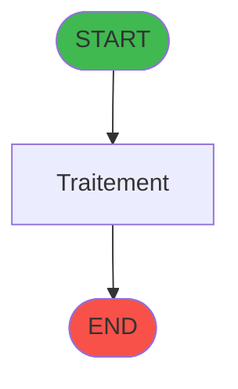
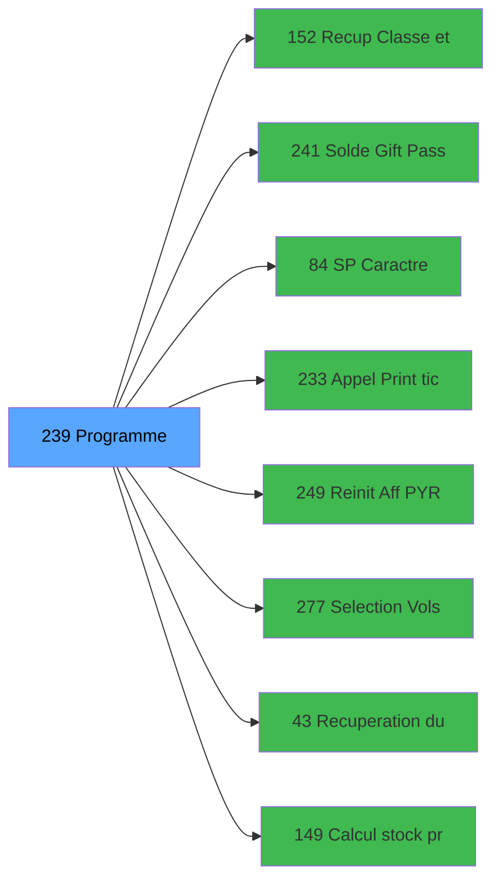

# ADH IDE 239 - Transaction Nouv vente PMS-721

> **Version spec**: 3.5
> **Analyse**: 2026-01-27 17:57
> **Source**: `Prg_XXX.xml`

---

<!-- TAB:Fonctionnel -->

## SPECIFICATION FONCTIONNELLE

### 1.1 Objectif metier

| Element | Description |
|---------|-------------|
| **Qui** | Operateur |
| **Quoi** | Transaction Nouv vente PMS-721
 |
| **Pourquoi** | A documenter |
| **Declencheur** | A identifier |

### 1.2 Regles metier

| Code | Regle | Condition |
|------|-------|-----------|
| RM-001 | A documenter | - |

### 1.3 Flux utilisateur

1. Demarrage programme
2. Traitement principal
3. Fin programme

### 1.4 Cas d'erreur

| Erreur | Comportement |
|--------|--------------|
| - | A documenter |

---

<!-- TAB:Technique -->

## SPECIFICATION TECHNIQUE

### 2.1 Identification

| Attribut | Valeur |
|----------|--------|
| **Format IDE** | ADH IDE 239 |
| **Description** | Transaction Nouv vente PMS-721
 |
| **Module** | ADH |

### 2.2 Tables

| # | Nom physique | Acces | Usage |
|---|--------------|-------|-------|
| #23 | `Table_23` | R | 1x |
| #23 | `Table_23` | **W** | 4x |
| #26 | `Table_26` | LINK | 1x |
| #30 | `Table_30` | LINK | 2x |
| #30 | `Table_30` | R | 1x |
| #32 | `Table_32` | R | 1x |
| #32 | `Table_32` | **W** | 4x |
| #34 | `Table_34` | LINK | 1x |
| #39 | `Table_39` | R | 1x |
| #46 | `Table_46` | LINK | 1x |
| #46 | `Table_46` | **W** | 2x |
| #47 | `Table_47` | **W** | 2x |
| #50 | `Table_50` | R | 3x |
| #67 | `Table_67` | LINK | 1x |
| #68 | `Table_68` | **W** | 1x |
| #70 | `Table_70` | LINK | 1x |
| #77 | `Table_77` | LINK | 2x |
| #77 | `Table_77` | R | 3x |
| #79 | `Table_79` | R | 1x |
| #89 | `Table_89` | LINK | 5x |
| #89 | `Table_89` | R | 4x |
| #96 | `Table_96` | LINK | 1x |
| #96 | `Table_96` | R | 1x |
| #103 | `Table_103` | R | 1x |
| #108 | `Table_108` | LINK | 1x |
| #109 | `Table_109` | R | 1x |
| #139 | `Table_139` | R | 1x |
| #140 | `Table_140` | LINK | 1x |
| #197 | `Table_197` | LINK | 2x |
| #372 | `Table_372` | LINK | 1x |
| #596 | `Table_596` | LINK | 5x |
| #596 | `Table_596` | R | 2x |
| #596 | `Table_596` | **W** | 3x |
| #697 | `Table_697` | LINK | 1x |
| #728 | `Table_728` | LINK | 1x |
| #801 | `Table_801` | LINK | 1x |
| #818 | `Table_818` | LINK | 1x |
| #847 | `Table_847` | LINK | 10x |
| #847 | `Table_847` | **W** | 4x |
| #899 | `Table_899` | R | 2x |
| #899 | `Table_899` | **W** | 7x |
| #1037 | `Table_1037` | **W** | 4x |
### 2.3 Parametres d'entree

### 2.4 Algorigramme

### 2.5 Expressions cles

### 2.6 Variables importantes

### 2.7 Statistiques

---

<!-- TAB:Cartographie -->

## CARTOGRAPHIE APPLICATIVE

### 3.1 Chaine d'appels depuis Main

### 3.2 Callers directs

| IDE | Programme | Nb appels |
|-----|-----------|-----------|
| 163 | Menu caisse GM - scroll | 1 |
| 242 | Menu Choix Saisie/Annul vente | 1 |
### 3.3 Callees

| Niv | IDE | Programme | Nb appels |
|-----|-----|-----------|-----------|
| 1 | 152 | Recup Classe et Lib du MOP | 4 |
| 1 | 241 | Solde Gift Pass | 3 |
| 1 | 84 |     SP Caractères Interdits | 2 |
| 1 | 233 | Appel Print ticket vente PMS28 | 2 |
| 1 | 249 | Reinit Aff PYR | 2 |
| 1 | 277 | Selection Vols /t Ville à côté | 2 |
| 1 | 43 | Recuperation du titre | 1 |
| 1 | 149 | Calcul stock produit WS | 1 |
| 1 | 179 | Get Printer | 1 |
| 1 | 180 | Printer choice | 1 |
| 1 | 181 | Set Listing Number | 1 |
| 1 | 182 | Raz Current Printer | 1 |
| 1 | 225 | Get Fidelisation et Remise | 1 |
| 1 | 227 | Get Matricule | 1 |
| 1 | 228 | Gestion Chèque | 1 |
| 1 | 247 | Deversement Transaction | 1 |
| 1 | 248 | Choix PYR (plusieurs chambres) | 1 |
| 1 | 254 | Solde Resort Credit | 1 |
| 1 | 257 | Zoom articles | 1 |
| 1 | 269 | Zoom services village | 1 |
### 3.4 Verification orphelin

| Critere | Resultat |
|---------|----------|
| Callers actifs | A verifier |
| **Conclusion** | A analyser |

---

## HISTORIQUE

| Date | Action | Auteur |
|------|--------|--------|
| 2026-01-27 19:50 | **DATA POPULATED** - Tables, Callgraph (329 expr) | Script |
| 2026-01-27 17:57 | **Upgrade V3.5** - TAB markers, Mermaid | Claude |

---

*Specification V3.5 - Format avec TAB markers et Mermaid*
