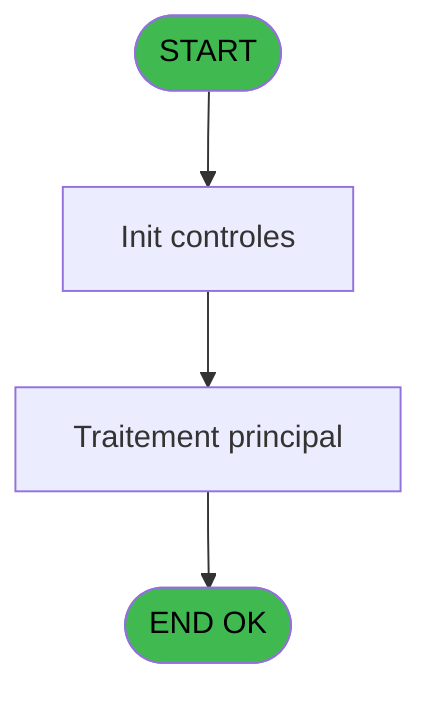
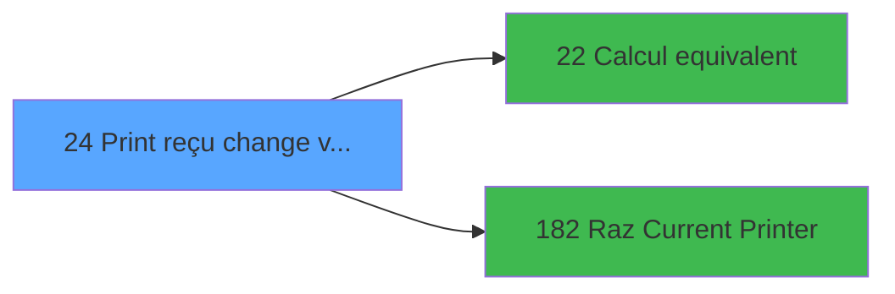

# ADH IDE 24 - Print reçu change vente

> **Analyse**: Phases 1-4 2026-02-07 03:41 -> 01:22 (21h40min) | Assemblage 01:22
> **Pipeline**: V7.2 Enrichi
> **Structure**: 4 onglets (Resume | Ecrans | Donnees | Connexions)

<!-- TAB:Resume -->

## 1. FICHE D'IDENTITE

| Attribut | Valeur |
|----------|--------|
| Projet | ADH |
| IDE Position | 24 |
| Nom Programme | Print reçu change vente |
| Fichier source | `Prg_24.xml` |
| Dossier IDE | Ventes |
| Taches | 14 (1 ecrans visibles) |
| Tables modifiees | 0 |
| Programmes appeles | 2 |
| Complexite | **BASSE** (score 12/100) |

## 2. DESCRIPTION FONCTIONNELLE

### 1.1 Objectif metier

**Print reçu change vente** est le **programme d'impression des recus pour les operations de vente de devises** qui **genere les tickets de confirmation pour les clients ayant vendu leurs devises etrangeres**.

**Objectif metier** : Ce programme produit le recu imprime remis au client lorsqu'il vend ses devises etrangeres au bureau de change du village (operation inverse de l'achat). Typiquement utilise en fin de sejour quand le client souhaite reconvertir ses devises non utilisees. Le ticket affiche le numero d'operation, le mode de paiement, le taux applique, le montant de la devise vendue et l'equivalent recu en devise locale. Le programme gere l'impression multi-imprimantes et le multilinguisme comme son pendant "Print reçu change achat".

**Print reçu change vente** assure la gestion complete de ce processus, accessible depuis [Change GM (IDE 25)](ADH-IDE-25.md), [Versement/Retrait (IDE 174)](ADH-IDE-174.md).

Le flux de traitement s'organise en **2 blocs fonctionnels** :

- **Traitement** (8 taches) : traitements metier divers
- **Impression** (6 taches) : generation de tickets et documents

**Logique metier** : 1 regles identifiees couvrant conditions metier.

Detail : phases du traitement

#### Phase 1 : Traitement (8 taches)

- **24** - Veuillez patienter ... **[[ECRAN]](#ecran-t1)**
- **24.1.1** - Impression reçu change **[[ECRAN]](#ecran-t3)**
- **24.1.2** - Impression reçu change **[[ECRAN]](#ecran-t4)**
- **24.2.1** - Impression reçu change **[[ECRAN]](#ecran-t6)**
- **24.2.2** - Impression reçu change **[[ECRAN]](#ecran-t7)**
- **24.4.1** - Impression reçu change **[[ECRAN]](#ecran-t11)**
- **24.5.1** - Impression reçu change **[[ECRAN]](#ecran-t13)**
- **24.6** - Impression reçu change **[[ECRAN]](#ecran-t16)**

#### Phase 2 : Impression (6 taches)

- **24.1** - Printer 1 **[[ECRAN]](#ecran-t2)**
- **24.2** - Printer 4 **[[ECRAN]](#ecran-t5)**
- **24.3** - Printer 5 **[[ECRAN]](#ecran-t8)**
- **24.3.1** - Impression reçu change ticket **[[ECRAN]](#ecran-t9)**
- **24.4** - Printer 8 **[[ECRAN]](#ecran-t10)**
- **24.5** - Printer 9 **[[ECRAN]](#ecran-t12)**

Delegue a : [Raz Current Printer (IDE 182)](ADH-IDE-182.md)

## 3. BLOCS FONCTIONNELS

### 3.1 Traitement (8 taches)

Traitements internes.

---

#### 24 - Veuillez patienter ... [[ECRAN]](#ecran-t1)

**Role** : Tache d'orchestration : point d'entree du programme (8 sous-taches). Coordonne l'enchainement des traitements.
**Ecran** : 424 x 56 DLU (MDI) | [Voir mockup](#ecran-t1)

7 sous-taches directes

| Tache | Nom | Bloc |
|-------|-----|------|
| [24.1.1](#t3) | Impression reçu change **[[ECRAN]](#ecran-t3)** | Traitement |
| [24.1.2](#t4) | Impression reçu change **[[ECRAN]](#ecran-t4)** | Traitement |
| [24.2.1](#t6) | Impression reçu change **[[ECRAN]](#ecran-t6)** | Traitement |
| [24.2.2](#t7) | Impression reçu change **[[ECRAN]](#ecran-t7)** | Traitement |
| [24.4.1](#t11) | Impression reçu change **[[ECRAN]](#ecran-t11)** | Traitement |
| [24.5.1](#t13) | Impression reçu change **[[ECRAN]](#ecran-t13)** | Traitement |
| [24.6](#t16) | Impression reçu change **[[ECRAN]](#ecran-t16)** | Traitement |

---

#### 24.1.1 - Impression reçu change [[ECRAN]](#ecran-t3)

**Role** : Generation du document : Impression reçu change.
**Ecran** : 1058 x 791 DLU (MDI) | [Voir mockup](#ecran-t3)

---

#### 24.1.2 - Impression reçu change [[ECRAN]](#ecran-t4)

**Role** : Generation du document : Impression reçu change.
**Ecran** : 1058 x 791 DLU (MDI) | [Voir mockup](#ecran-t4)

---

#### 24.2.1 - Impression reçu change [[ECRAN]](#ecran-t6)

**Role** : Generation du document : Impression reçu change.
**Ecran** : 1058 x 791 DLU (MDI) | [Voir mockup](#ecran-t6)

---

#### 24.2.2 - Impression reçu change [[ECRAN]](#ecran-t7)

**Role** : Generation du document : Impression reçu change.
**Ecran** : 1058 x 791 DLU (MDI) | [Voir mockup](#ecran-t7)

---

#### 24.4.1 - Impression reçu change [[ECRAN]](#ecran-t11)

**Role** : Generation du document : Impression reçu change.
**Ecran** : 1058 x 791 DLU (MDI) | [Voir mockup](#ecran-t11)

---

#### 24.5.1 - Impression reçu change [[ECRAN]](#ecran-t13)

**Role** : Generation du document : Impression reçu change.
**Ecran** : 1058 x 791 DLU (MDI) | [Voir mockup](#ecran-t13)

---

#### 24.6 - Impression reçu change [[ECRAN]](#ecran-t16)

**Role** : Generation du document : Impression reçu change.
**Ecran** : 1058 x 791 DLU (MDI) | [Voir mockup](#ecran-t16)

### 3.2 Impression (6 taches)

Generation des documents et tickets.

---

#### 24.1 - Printer 1 [[ECRAN]](#ecran-t2)

**Role** : Generation du document : Printer 1.
**Ecran** : 1058 x 791 DLU (MDI) | [Voir mockup](#ecran-t2)
**Delegue a** : [Raz Current Printer (IDE 182)](ADH-IDE-182.md)

---

#### 24.2 - Printer 4 [[ECRAN]](#ecran-t5)

**Role** : Generation du document : Printer 4.
**Ecran** : 1058 x 791 DLU (MDI) | [Voir mockup](#ecran-t5)
**Delegue a** : [Raz Current Printer (IDE 182)](ADH-IDE-182.md)

---

#### 24.3 - Printer 5 [[ECRAN]](#ecran-t8)

**Role** : Generation du document : Printer 5.
**Ecran** : 357 x 103 DLU (MDI) | [Voir mockup](#ecran-t8)
**Delegue a** : [Raz Current Printer (IDE 182)](ADH-IDE-182.md)

---

#### 24.3.1 - Impression reçu change ticket [[ECRAN]](#ecran-t9)

**Role** : Generation du document : Impression reçu change ticket.
**Ecran** : 357 x 103 DLU (MDI) | [Voir mockup](#ecran-t9)
**Variables liees** : EY (PI.N° Ticket)
**Delegue a** : [Raz Current Printer (IDE 182)](ADH-IDE-182.md)

---

#### 24.4 - Printer 8 [[ECRAN]](#ecran-t10)

**Role** : Generation du document : Printer 8.
**Ecran** : 1058 x 791 DLU (MDI) | [Voir mockup](#ecran-t10)
**Delegue a** : [Raz Current Printer (IDE 182)](ADH-IDE-182.md)

---

#### 24.5 - Printer 9 [[ECRAN]](#ecran-t12)

**Role** : Generation du document : Printer 9.
**Ecran** : 1058 x 791 DLU (MDI) | [Voir mockup](#ecran-t12)
**Delegue a** : [Raz Current Printer (IDE 182)](ADH-IDE-182.md)

## 5. REGLES METIER

6 regles identifiees:

### Impression (5 regles)

#### [RM-001] Verification que l'imprimante courante est la n1

| Element | Detail |
|---------|--------|
| **Condition** | `GetParam ('CURRENTPRINTERNUM')=1` |
| **Si vrai** | Action si CURRENTPRINTERNUM = 1 |
| **Expression source** | Expression 3 : `GetParam ('CURRENTPRINTERNUM')=1` |
| **Exemple** | Si GetParam ('CURRENTPRINTERNUM')=1 → Action si CURRENTPRINTERNUM = 1 |
| **Impact** | [24.1 - Printer 1](#t2) |

#### [RM-002] Verification que l'imprimante courante est la n4

| Element | Detail |
|---------|--------|
| **Condition** | `GetParam ('CURRENTPRINTERNUM')=4` |
| **Si vrai** | Action si CURRENTPRINTERNUM = 4 |
| **Expression source** | Expression 4 : `GetParam ('CURRENTPRINTERNUM')=4` |
| **Exemple** | Si GetParam ('CURRENTPRINTERNUM')=4 → Action si CURRENTPRINTERNUM = 4 |
| **Impact** | [24.1 - Printer 1](#t2) |

#### [RM-003] Verification que l'imprimante courante est la n5

| Element | Detail |
|---------|--------|
| **Condition** | `GetParam ('CURRENTPRINTERNUM')=5` |
| **Si vrai** | Action si CURRENTPRINTERNUM = 5 |
| **Expression source** | Expression 5 : `GetParam ('CURRENTPRINTERNUM')=5` |
| **Exemple** | Si GetParam ('CURRENTPRINTERNUM')=5 → Action si CURRENTPRINTERNUM = 5 |
| **Impact** | [24.1 - Printer 1](#t2) |

#### [RM-004] Verification que l'imprimante courante est la n8

| Element | Detail |
|---------|--------|
| **Condition** | `GetParam ('CURRENTPRINTERNUM')=8` |
| **Si vrai** | Action si CURRENTPRINTERNUM = 8 |
| **Expression source** | Expression 6 : `GetParam ('CURRENTPRINTERNUM')=8` |
| **Exemple** | Si GetParam ('CURRENTPRINTERNUM')=8 → Action si CURRENTPRINTERNUM = 8 |
| **Impact** | [24.1 - Printer 1](#t2) |

#### [RM-005] Verification que l'imprimante courante est la n9

| Element | Detail |
|---------|--------|
| **Condition** | `GetParam ('CURRENTPRINTERNUM')=9` |
| **Si vrai** | Action si CURRENTPRINTERNUM = 9 |
| **Expression source** | Expression 7 : `GetParam ('CURRENTPRINTERNUM')=9` |
| **Exemple** | Si GetParam ('CURRENTPRINTERNUM')=9 → Action si CURRENTPRINTERNUM = 9 |
| **Impact** | [24.1 - Printer 1](#t2) |

### Autres (1 regles)

#### [RM-006] Si [BB]='010' alors 'Opération N°' sinon 'Transaction N°')

| Element | Detail |
|---------|--------|
| **Condition** | `[BB]='010'` |
| **Si vrai** | 'Opération N°' |
| **Si faux** | 'Transaction N°') |
| **Expression source** | Expression 13 : `IF ([BB]='010','Opération N°','Transaction N°')` |
| **Exemple** | Si [BB]='010' → 'Opération N°'. Sinon → 'Transaction N°') |

## 6. CONTEXTE

- **Appele par**: [Change GM (IDE 25)](ADH-IDE-25.md), [Versement/Retrait (IDE 174)](ADH-IDE-174.md)
- **Appelle**: 2 programmes | **Tables**: 5 (W:0 R:3 L:3) | **Taches**: 14 | **Expressions**: 22

<!-- TAB:Ecrans -->

## 8. ECRANS

### 8.1 Forms visibles (1 / 14)

| # | Position | Tache | Nom | Type | Largeur | Hauteur | Bloc |
|---|----------|-------|-----|------|---------|---------|------|
| 1 | 24 | 24 | Veuillez patienter ... | MDI | 424 | 56 | Traitement |

### 8.2 Mockups Ecrans

---

#### 24 - Veuillez patienter ...
**Tache** : [24](#t1) | **Type** : MDI | **Dimensions** : 424 x 56 DLU
**Bloc** : Traitement | **Titre IDE** : Veuillez patienter ...

<!-- FORM-DATA:
{
    "width":  424,
    "vFactor":  8,
    "type":  "MDI",
    "hFactor":  8,
    "controls":  [
                     {
                         "x":  0,
                         "type":  "label",
                         "var":  "",
                         "y":  0,
                         "w":  423,
                         "fmt":  "",
                         "name":  "",
                         "h":  29,
                         "color":  "",
                         "text":  "",
                         "parent":  null
                     },
                     {
                         "x":  120,
                         "type":  "label",
                         "var":  "",
                         "y":  10,
                         "w":  221,
                         "fmt":  "",
                         "name":  "",
                         "h":  8,
                         "color":  "7",
                         "text":  "Impression en cours ...",
                         "parent":  null
                     },
                     {
                         "x":  1,
                         "type":  "label",
                         "var":  "",
                         "y":  29,
                         "w":  423,
                         "fmt":  "",
                         "name":  "",
                         "h":  27,
                         "color":  "",
                         "text":  "",
                         "parent":  null
                     },
                     {
                         "x":  73,
                         "type":  "label",
                         "var":  "",
                         "y":  38,
                         "w":  290,
                         "fmt":  "",
                         "name":  "",
                         "h":  8,
                         "color":  "",
                         "text":  "Edition du reçu change vente",
                         "parent":  null
                     },
                     {
                         "x":  4,
                         "type":  "image",
                         "var":  "",
                         "y":  2,
                         "w":  72,
                         "fmt":  "",
                         "name":  "",
                         "h":  25,
                         "color":  "",
                         "text":  "",
                         "parent":  null
                     }
                 ],
    "taskId":  "24",
    "height":  56
}
-->

## 9. NAVIGATION

Ecran unique: **Veuillez patienter ...**

### 9.3 Structure hierarchique (14 taches)

| Position | Tache | Type | Dimensions | Bloc |
|----------|-------|------|------------|------|
| **24.1** | [**Veuillez patienter ...** (24)](#t1) [mockup](#ecran-t1) | MDI | 424x56 | Traitement |
| 24.1.1 | [Impression reçu change (24.1.1)](#t3) [mockup](#ecran-t3) | MDI | 1058x791 | |
| 24.1.2 | [Impression reçu change (24.1.2)](#t4) [mockup](#ecran-t4) | MDI | 1058x791 | |
| 24.1.3 | [Impression reçu change (24.2.1)](#t6) [mockup](#ecran-t6) | MDI | 1058x791 | |
| 24.1.4 | [Impression reçu change (24.2.2)](#t7) [mockup](#ecran-t7) | MDI | 1058x791 | |
| 24.1.5 | [Impression reçu change (24.4.1)](#t11) [mockup](#ecran-t11) | MDI | 1058x791 | |
| 24.1.6 | [Impression reçu change (24.5.1)](#t13) [mockup](#ecran-t13) | MDI | 1058x791 | |
| 24.1.7 | [Impression reçu change (24.6)](#t16) [mockup](#ecran-t16) | MDI | 1058x791 | |
| **24.2** | [**Printer 1** (24.1)](#t2) [mockup](#ecran-t2) | MDI | 1058x791 | Impression |
| 24.2.1 | [Printer 4 (24.2)](#t5) [mockup](#ecran-t5) | MDI | 1058x791 | |
| 24.2.2 | [Printer 5 (24.3)](#t8) [mockup](#ecran-t8) | MDI | 357x103 | |
| 24.2.3 | [Impression reçu change ticket (24.3.1)](#t9) [mockup](#ecran-t9) | MDI | 357x103 | |
| 24.2.4 | [Printer 8 (24.4)](#t10) [mockup](#ecran-t10) | MDI | 1058x791 | |
| 24.2.5 | [Printer 9 (24.5)](#t12) [mockup](#ecran-t12) | MDI | 1058x791 | |

### 9.4 Algorigramme

> **Legende**: Vert = START/END OK | Rouge = END KO | Bleu = Decisions
> *Algorigramme auto-genere. Utiliser `/algorigramme` pour une synthese metier detaillee.*

<!-- TAB:Donnees -->

## 10. TABLES

### Tables utilisees (5)

| ID | Nom | Description | Type | R | W | L | Usages |
|----|-----|-------------|------|---|---|---|--------|
| 147 | change_vente_____chg | Donnees de ventes | DB | R |   | L | 8 |
| 30 | gm-recherche_____gmr | Index de recherche | DB | R |   |   | 7 |
| 31 | gm-complet_______gmc |  | DB | R |   |   | 1 |
| 368 | pms_village |  | DB |   |   | L | 1 |
| 34 | hebergement______heb | Hebergement (chambres) | DB |   |   | L | 1 |

### Colonnes par table (4 / 3 tables avec colonnes identifiees)

Table 147 - change_vente_____chg (R/L) - 8 usages

| Lettre | Variable | Acces | Type |
|--------|----------|-------|------|
| FH | v. Vente de devise (Libelle) | R | Alpha |

Table 30 - gm-recherche_____gmr (R) - 7 usages

| Lettre | Variable | Acces | Type |
|--------|----------|-------|------|
| A | W1 config imp | R | Alpha |
| B | W1 equivalant | R | Numeric |
| C | W1 normal | R | Alpha |
| D | W1 condense | R | Alpha |
| E | W1 detecteur | R | Alpha |
| F | W1 inhibe Panel | R | Alpha |
| G | W1 massicot | R | Alpha |
| H | W1 selection feuille | R | Alpha |
| I | W1 selection rouleau | R | Alpha |
| J | W1 ejection feuille | R | Alpha |
| K | W1 equivalent | R | Numeric |

Table 31 - gm-complet_______gmc (R) - 1 usages

| Lettre | Variable | Acces | Type |
|--------|----------|-------|------|
| A | P0 societe | R | Alpha |
| B | P0 n° adherent | R | Numeric |
| C | P0 filiation | R | Numeric |
| D | P0 date | R | Date |
| E | P0 heure | R | Time |
| F | P0 devise locale | R | Alpha |
| G | P0 nb decimale | R | Numeric |
| H | P0 masque montant | R | Alpha |
| I | P0 nom village | R | Alpha |
| J | P0 telephone | R | Alpha |
| K | P0 fax | R | Alpha |
| L | PI.N° Ticket | R | Numeric |
| M | Pi.id_transaction | R | Unicode |
| N | Pi.id_acceptation | R | Unicode |
| O | W0 en-tête ? | R | Alpha |
| P | W0 fin tâche | R | Alpha |
| Q | v. Operation (Libelle) | R | Alpha |
| R | v. Mode paiement (Libelle) | R | Alpha |
| S | v. Taux (Libelle) | R | Alpha |
| T | v. Montant Devise Local Libelle | R | Alpha |
| U | v. Vente de devise (Libelle) | R | Alpha |
| V | v.Message (Libelle) | R | Alpha |
| W | v. Paiement (Libelle) | R | Alpha |
| X | v. Devise (Libelle) | R | Alpha |
| Y | v.Existe ligne? | R | Logical |
| Z | v.Montant Product | R | Numeric |
| BA | v.Nombre de copies | R | Numeric |

## 11. VARIABLES

### 11.1 Parametres entrants (14)

Variables recues du programme appelant ([Change GM (IDE 25)](ADH-IDE-25.md)).

| Lettre | Nom | Type | Usage dans |
|--------|-----|------|-----------|
| EN | P0 societe | Alpha | 1x parametre entrant |
| EO | P0 n° adherent | Numeric | 1x parametre entrant |
| EP | P0 filiation | Numeric | 1x parametre entrant |
| EQ | P0 date | Date | - |
| ER | P0 heure | Time | - |
| ES | P0 devise locale | Alpha | - |
| ET | P0 nb decimale | Numeric | - |
| EU | P0 masque montant | Alpha | - |
| EV | P0 nom village | Alpha | - |
| EW | P0 telephone | Alpha | - |
| EX | P0 fax | Alpha | - |
| EY | PI.N° Ticket | Numeric | - |
| EZ | Pi.id_transaction | Unicode | - |
| FA | Pi.id_acceptation | Unicode | - |

### 11.2 Variables de session (11)

Variables persistantes pendant toute la session.

| Lettre | Nom | Type | Usage dans |
|--------|-----|------|-----------|
| FD | v. Operation (Libelle) | Alpha | - |
| FE | v. Mode paiement (Libelle) | Alpha | - |
| FF | v. Taux (Libelle) | Alpha | - |
| FG | v. Montant Devise Local Libelle | Alpha | - |
| FH | v. Vente de devise (Libelle) | Alpha | - |
| FI | v.Message (Libelle) | Alpha | - |
| FJ | v. Paiement (Libelle) | Alpha | - |
| FK | v. Devise (Libelle) | Alpha | - |
| FL | v.Existe ligne? | Logical | - |
| FM | v.Montant Product | Numeric | - |
| FN | v.Nombre de copies | Numeric | - |

### 11.3 Variables de travail (2)

Variables internes au programme.

| Lettre | Nom | Type | Usage dans |
|--------|-----|------|-----------|
| FB | W0 en-tête ? | Alpha | - |
| FC | W0 fin tâche | Alpha | - |

Toutes les 27 variables (liste complete)

| Cat | Lettre | Nom Variable | Type |
|-----|--------|--------------|------|
| P0 | **EN** | P0 societe | Alpha |
| P0 | **EO** | P0 n° adherent | Numeric |
| P0 | **EP** | P0 filiation | Numeric |
| P0 | **EQ** | P0 date | Date |
| P0 | **ER** | P0 heure | Time |
| P0 | **ES** | P0 devise locale | Alpha |
| P0 | **ET** | P0 nb decimale | Numeric |
| P0 | **EU** | P0 masque montant | Alpha |
| P0 | **EV** | P0 nom village | Alpha |
| P0 | **EW** | P0 telephone | Alpha |
| P0 | **EX** | P0 fax | Alpha |
| P0 | **EY** | PI.N° Ticket | Numeric |
| P0 | **EZ** | Pi.id_transaction | Unicode |
| P0 | **FA** | Pi.id_acceptation | Unicode |
| W0 | **FB** | W0 en-tête ? | Alpha |
| W0 | **FC** | W0 fin tâche | Alpha |
| V. | **FD** | v. Operation (Libelle) | Alpha |
| V. | **FE** | v. Mode paiement (Libelle) | Alpha |
| V. | **FF** | v. Taux (Libelle) | Alpha |
| V. | **FG** | v. Montant Devise Local Libelle | Alpha |
| V. | **FH** | v. Vente de devise (Libelle) | Alpha |
| V. | **FI** | v.Message (Libelle) | Alpha |
| V. | **FJ** | v. Paiement (Libelle) | Alpha |
| V. | **FK** | v. Devise (Libelle) | Alpha |
| V. | **FL** | v.Existe ligne? | Logical |
| V. | **FM** | v.Montant Product | Numeric |
| V. | **FN** | v.Nombre de copies | Numeric |

## 12. EXPRESSIONS

**22 / 22 expressions decodees (100%)**

### 12.1 Repartition par type

| Type | Expressions | Regles |
|------|-------------|--------|
| CONDITION | 13 | 6 |
| CONSTANTE | 2 | 0 |
| OTHER | 6 | 0 |
| CAST_LOGIQUE | 1 | 0 |

### 12.2 Expressions cles par type

#### CONDITION (13 expressions)

| Type | IDE | Expression | Regle |
|------|-----|------------|-------|
| CONDITION | 6 | `GetParam ('CURRENTPRINTERNUM')=8` | [RM-004](#rm-RM-004) |
| CONDITION | 7 | `GetParam ('CURRENTPRINTERNUM')=9` | [RM-005](#rm-RM-005) |
| CONDITION | 13 | `IF ([BB]='010','Opération N°','Transaction N°')` | [RM-006](#rm-RM-006) |
| CONDITION | 3 | `GetParam ('CURRENTPRINTERNUM')=1` | [RM-001](#rm-RM-001) |
| CONDITION | 4 | `GetParam ('CURRENTPRINTERNUM')=4` | [RM-002](#rm-RM-002) |
| ... | | *+8 autres* | |

#### CONSTANTE (2 expressions)

| Type | IDE | Expression | Regle |
|------|-----|------------|-------|
| CONSTANTE | 12 | `'Z'` | - |
| CONSTANTE | 11 | `'A'` | - |

#### OTHER (6 expressions)

| Type | IDE | Expression | Regle |
|------|-----|------------|-------|
| OTHER | 9 | `P0 n° adherent [B]` | - |
| OTHER | 10 | `P0 filiation [C]` | - |
| OTHER | 22 | `GetParam ('NUMBERCOPIES')` | - |
| OTHER | 1 | `SetCrsr (2)` | - |
| OTHER | 2 | `SetCrsr (1)` | - |
| ... | | *+1 autres* | |

#### CAST_LOGIQUE (1 expressions)

| Type | IDE | Expression | Regle |
|------|-----|------------|-------|
| CAST_LOGIQUE | 21 | `'TRUE'LOG` | - |

### 12.3 Toutes les expressions (22)

Voir les 22 expressions

#### CONDITION (13)

| IDE | Expression Decodee |
|-----|-------------------|
| 3 | `GetParam ('CURRENTPRINTERNUM')=1` |
| 4 | `GetParam ('CURRENTPRINTERNUM')=4` |
| 5 | `GetParam ('CURRENTPRINTERNUM')=5` |
| 6 | `GetParam ('CURRENTPRINTERNUM')=8` |
| 7 | `GetParam ('CURRENTPRINTERNUM')=9` |
| 13 | `IF ([BB]='010','Opération N°','Transaction N°')` |
| 14 | `IF ([BB]='010','Mode de paiement','Payment method')` |
| 15 | `IF ([BB]='010','Taux','Rate')` |
| 16 | `IF ([BB]='010','Montant devise locale','Amount local currency')` |
| 17 | `IF ([BB]='010','VENTE DE DEVISES','CURRENCY SALES')` |
| 18 | `IF ([BB]='010','Merci de votre visite','Thank you for your visit')` |
| 19 | `IF ([BB]='010','Paiement','Payment')` |
| 20 | `IF ([BB]='010','Devise','Currency')` |

#### CONSTANTE (2)

| IDE | Expression Decodee |
|-----|-------------------|
| 11 | `'A'` |
| 12 | `'Z'` |

#### OTHER (6)

| IDE | Expression Decodee |
|-----|-------------------|
| 1 | `SetCrsr (2)` |
| 2 | `SetCrsr (1)` |
| 8 | `P0 societe [A]` |
| 9 | `P0 n° adherent [B]` |
| 10 | `P0 filiation [C]` |
| 22 | `GetParam ('NUMBERCOPIES')` |

#### CAST_LOGIQUE (1)

| IDE | Expression Decodee |
|-----|-------------------|
| 21 | `'TRUE'LOG` |

<!-- TAB:Connexions -->

## 13. GRAPHE D'APPELS

### 13.1 Chaine depuis Main (Callers)

Main -> ... -> [Change GM (IDE 25)](ADH-IDE-25.md) -> **Print reçu change vente (IDE 24)**

Main -> ... -> [Versement/Retrait (IDE 174)](ADH-IDE-174.md) -> **Print reçu change vente (IDE 24)**

### 13.2 Callers

| IDE | Nom Programme | Nb Appels |
|-----|---------------|-----------|
| [25](ADH-IDE-25.md) | Change GM | 1 |
| [174](ADH-IDE-174.md) | Versement/Retrait | 1 |

### 13.3 Callees (programmes appeles)

### 13.4 Detail Callees avec contexte

| IDE | Nom Programme | Appels | Contexte |
|-----|---------------|--------|----------|
| [22](ADH-IDE-22.md) | Calcul equivalent | 7 | Calcul de donnees |
| [182](ADH-IDE-182.md) | Raz Current Printer | 1 | Impression ticket/document |

## 14. RECOMMANDATIONS MIGRATION

### 14.1 Profil du programme

| Metrique | Valeur | Impact migration |
|----------|--------|-----------------|
| Lignes de logique | 417 | Taille moyenne |
| Expressions | 22 | Peu de logique |
| Tables WRITE | 0 | Impact faible |
| Sous-programmes | 2 | Peu de dependances |
| Ecrans visibles | 1 | Ecran unique ou traitement batch |
| Code desactive | 0% (0 / 417) | Code sain |
| Regles metier | 6 | Quelques regles a preserver |

### 14.2 Plan de migration par bloc

#### Traitement (8 taches: 8 ecrans, 0 traitement)

- **Strategie** : 8 composant(s) UI (Razor/React) avec formulaires et validation.
- 2 sous-programme(s) a migrer ou a reutiliser depuis les services existants.
- Decomposer les taches en services unitaires testables.

#### Impression (6 taches: 6 ecrans, 0 traitement)

- **Strategie** : Templates HTML -> PDF via wkhtmltopdf ou Puppeteer.
- `PrintService` injectable avec choix imprimante

### 14.3 Dependances critiques

| Dependance | Type | Appels | Impact |
|------------|------|--------|--------|
| [Calcul equivalent (IDE 22)](ADH-IDE-22.md) | Sous-programme | 7x | **CRITIQUE** - Calcul de donnees |
| [Raz Current Printer (IDE 182)](ADH-IDE-182.md) | Sous-programme | 1x | Normale - Impression ticket/document |

---
*Spec DETAILED generee par Pipeline V7.2 - 2026-02-08 01:22*
