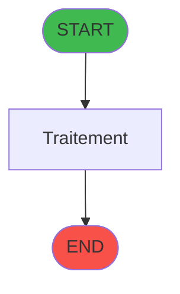
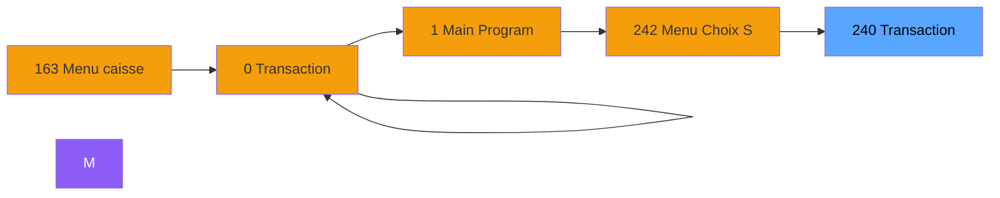
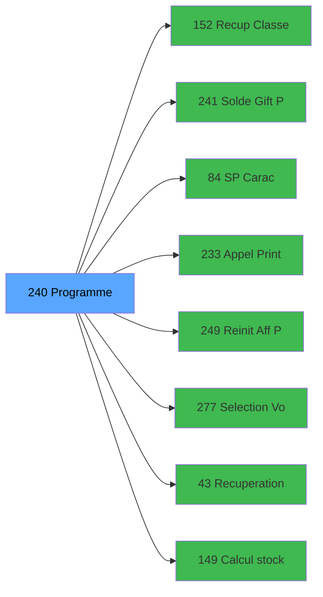

# ADH IDE 240 - Transaction Nouv vente PMS-710

> **Version spec**: 3.5
> **Analyse**: 2026-01-27 17:57
> **Source**: `Prg_XXX.xml`

---

<!-- TAB:Fonctionnel -->

## SPECIFICATION FONCTIONNELLE

### 1.1 Objectif metier

| Element | Description |
|---------|-------------|
| **Qui** | Operateur |
| **Quoi** | Transaction Nouv vente PMS-710
 |
| **Pourquoi** | A documenter |
| **Declencheur** | A identifier |

### 1.2 Regles metier

| Code | Regle | Condition |
|------|-------|-----------|
| RM-001 | A documenter | - |

### 1.3 Flux utilisateur

1. Demarrage programme
2. Traitement principal
3. Fin programme

### 1.4 Cas d'erreur

| Erreur | Comportement |
|--------|--------------|
| - | A documenter |

---

<!-- TAB:Technique -->

## SPECIFICATION TECHNIQUE

### 2.1 Identification

| Attribut | Valeur |
|----------|--------|
| **Format IDE** | ADH IDE 240 |
| **Description** | Transaction Nouv vente PMS-710
 |
| **Module** | ADH |

### 2.2 Tables

| # | Nom logique | Nom physique | Acces | Usage |
|---|-------------|--------------|-------|-------|
| 23 | reseau_cloture___rec | `cafil001_dat` | R | 1x |
| 23 | reseau_cloture___rec | `cafil001_dat` | **W** | 4x |
| 26 | comptes_speciaux_spc | `cafil004_dat` | L | 1x |
| 30 | gm-recherche_____gmr | `cafil008_dat` | L | 2x |
| 30 | gm-recherche_____gmr | `cafil008_dat` | R | 1x |
| 32 | prestations | `cafil010_dat` | R | 1x |
| 32 | prestations | `cafil010_dat` | **W** | 4x |
| 34 | hebergement______heb | `cafil012_dat` | L | 1x |
| 39 | depot_garantie___dga | `cafil017_dat` | R | 1x |
| 46 | mvt_prestation___mpr | `cafil024_dat` | L | 1x |
| 46 | mvt_prestation___mpr | `cafil024_dat` | **W** | 2x |
| 47 | compte_gm________cgm | `cafil025_dat` | **W** | 2x |
| 50 | moyens_reglement_mor | `cafil028_dat` | R | 3x |
| 67 | tables___________tab | `cafil045_dat` | L | 1x |
| 68 | compteurs________cpt | `cafil046_dat` | **W** | 1x |
| 70 | date_comptable___dat | `cafil048_dat` | L | 1x |
| 77 | articles_________art | `cafil055_dat` | L | 2x |
| 77 | articles_________art | `cafil055_dat` | R | 3x |
| 79 | gratuites________gra | `cafil057_dat` | R | 1x |
| 89 | moyen_paiement___mop | `cafil067_dat` | L | 5x |
| 89 | moyen_paiement___mop | `cafil067_dat` | R | 4x |
| 96 | table_prestation_pre | `cafil074_dat` | L | 1x |
| 96 | table_prestation_pre | `cafil074_dat` | R | 1x |
| 103 | logement_client__loc | `cafil081_dat` | R | 1x |
| 108 | code_logement____clo | `cafil086_dat` | L | 1x |
| 109 | table_utilisateurs | `cafil087_dat` | R | 1x |
| 139 | moyens_reglement_mor | `cafil117_dat` | R | 1x |
| 140 | moyen_paiement___mop | `cafil118_dat` | L | 1x |
| 197 | articles_en_stock | `caisse_artstock` | L | 2x |
| 372 | pv_budget | `pv_budget_dat` | L | 1x |
| 596 | tempo_ecran_police | `%club_user%tmp_ecrpolice_dat` | L | 5x |
| 596 | tempo_ecran_police | `%club_user%tmp_ecrpolice_dat` | R | 2x |
| 596 | tempo_ecran_police | `%club_user%tmp_ecrpolice_dat` | **W** | 3x |
| 697 | droits_applications | `droits` | L | 1x |
| 728 | arc_cc_total | `arc_cctotal` | L | 1x |
| 801 | moyens_reglement_complem | `moyens_reglement_complem` | L | 1x |
| 818 | Circuit supprime | `zcircafil146` | L | 1x |
| 847 | stat_lieu_vente_date | `%club_user%_stat_lieu_vente_date` | L | 10x |
| 847 | stat_lieu_vente_date | `%club_user%_stat_lieu_vente_date` | **W** | 6x |
| 899 | Boo_ResultsRechercheHoraire | `Boo_ResultsRechercheHoraire` | R | 2x |
| 899 | Boo_ResultsRechercheHoraire | `Boo_ResultsRechercheHoraire` | **W** | 7x |
| 1037 | Table_1037 | - | **W** | 4x |
| 1047 | Table_1047 | - | **W** | 2x |
### 2.3 Parametres d'entree

| Variable | Nom | Type | Picture |
|----------|-----|------|---------|
| - | Aucun parametre | - | - |
### 2.4 Algorigramme

### 2.5 Expressions cles

| IDE | Expression | Commentaire |
|-----|------------|-------------|
| 1 | `DStr({0,7},'DD/MM/YYYY')` | - |
| 2 | `IF(Trim({0,54})='1','ALLER',IF(Trim({0,54})='2'...` | - |
| 3 | `MlsTrans ('Verifier que la transaction est bien...` | - |
| 4 | `Date ()` | - |
| 5 | `IF({0,184}=0,IF({0,23}='VSL',{0,13},Date()),{0,...` | - |
| 6 | `NOT {32768,38}` | - |
| 7 | `{32768,2}` | - |
| 8 | `Trim ({0,144})` | - |
| 9 | `154` | - |
| 10 | `{0,1}` | - |
| 11 | `{0,5}` | - |
| 12 | `{0,6}` | - |
| 13 | `'F'` | - |
| 14 | `Date ()` | - |
| 15 | `{0,50}*{0,49}` | - |
| 16 | `({0,50}*{0,49})-{0,96}` | - |
| 17 | `'FALSE'LOG` | - |
| 18 | `'N'` | - |
| 19 | `1` | - |
| 20 | `'CAISSE'` | - |

> **Total**: 353 expressions (affichees: 20)
### 2.6 Variables importantes

### 2.7 Statistiques

| Metrique | Valeur |
|----------|--------|
| **Taches** | 64 |
| **Lignes logique** | 2315 |
| **Lignes desactivees** | 0 |
---

<!-- TAB:Cartographie -->

## CARTOGRAPHIE APPLICATIVE

### 3.1 Chaine d'appels depuis Main

### 3.2 Callers directs

| IDE | Programme | Nb appels |
|-----|-----------|-----------|
| 0 | Transaction Nouv vente PMS-584 | 1 |
| 0 | Transaction Nouv vente PMS-710 | 1 |
| 0 | Transaction Nouv vente PMS-721 | 1 |
| 163 | Menu caisse GM - scroll | 1 |
| 242 | Menu Choix Saisie/Annul vente | 1 |
### 3.3 Callees

| Niv | IDE | Programme | Nb appels |
|-----|-----|-----------|-----------|
| 1 | 152 | Recup Classe et Lib du MOP | 4 |
| 1 | 241 | Solde Gift Pass | 3 |
| 1 | 84 |     SP Caractères Interdits | 2 |
| 1 | 233 | Appel Print ticket vente PMS28 | 2 |
| 1 | 249 | Reinit Aff PYR | 2 |
| 1 | 277 | Selection Vols /t Ville à côté | 2 |
| 1 | 43 | Recuperation du titre | 1 |
| 1 | 149 | Calcul stock produit WS | 1 |
| 1 | 162 | Selection filiations | 1 |
| 1 | 179 | Get Printer | 1 |
| 1 | 180 | Printer choice | 1 |
| 1 | 181 | Set Listing Number | 1 |
| 1 | 182 | Raz Current Printer | 1 |
| 1 | 225 | Get Fidelisation et Remise | 1 |
| 1 | 227 | Get Matricule | 1 |
| 1 | 228 | Gestion Chèque | 1 |
| 1 | 247 | Deversement Transaction | 1 |
| 1 | 248 | Choix PYR (plusieurs chambres) | 1 |
| 1 | 254 | Solde Resort Credit | 1 |
| 1 | 257 | Zoom articles | 1 |
### 3.4 Verification orphelin

| Critere | Resultat |
|---------|----------|
| Callers actifs | A verifier |
| **Conclusion** | A analyser |

---

## HISTORIQUE

| Date | Action | Auteur |
|------|--------|--------|
| 2026-01-27 20:24 | **DATA V2** - Tables reelles, Expressions, Stats, CallChain | Script |
| 2026-01-27 19:50 | **DATA POPULATED** - Tables, Callgraph (353 expr) | Script |
| 2026-01-27 17:57 | **Upgrade V3.5** - TAB markers, Mermaid | Claude |

---

*Specification V3.5 - Format avec TAB markers et Mermaid*
