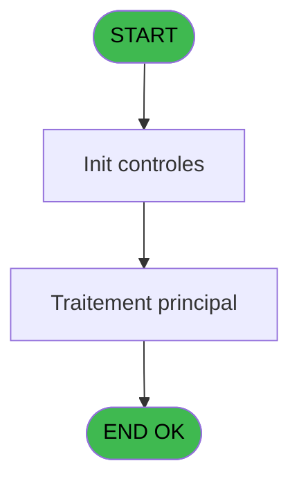

# ADH IDE 241 - Solde Gift Pass

> **Analyse**: Phases 1-4 2026-02-08 04:34 -> 04:34 (4s) | Assemblage 04:34
> **Pipeline**: V7.2 Enrichi
> **Structure**: 4 onglets (Resume | Ecrans | Donnees | Connexions)

<!-- TAB:Resume -->

## 1. FICHE D'IDENTITE

| Attribut | Valeur |
|----------|--------|
| Projet | ADH |
| IDE Position | 241 |
| Nom Programme | Solde Gift Pass |
| Fichier source | `Prg_241.xml` |
| Dossier IDE | Comptabilite |
| Taches | 1 (0 ecrans visibles) |
| Tables modifiees | 0 |
| Programmes appeles | 0 |
| Complexite | **BASSE** (score 0/100) |
| Statut | **ORPHELIN_POTENTIEL** |

## 2. DESCRIPTION FONCTIONNELLE

ADH IDE 241 - Solde Gift Pass est un programme de consultation du solde des Gift Pass pour un adhérent. Il accède à la table `ccpartyp` (cc_total_par_type) pour récupérer le total cumulé par type de service, spécifiquement pour identifier les Gift Pass restants. Le programme prend en paramètre la clé d'identification du compte (societe, compte, filiation) et retourne le solde disponible.

Ce programme fait partie de la chaîne de ventes ADH et est appelé par les écrans de caisse pour afficher rapidement le solde avant de valider une transaction Gift Pass. Il utilise une simple requête de lecture sans modification de données, ce qui en fait un programme léger et performant destiné aux consultations fréquentes en temps réel.

Le programme est migré en endpoint C# .NET 8 sous `/api/ventes/solde-giftpass/{societe}/{compte}/{filiation}` avec validation des paramètres d'entrée et gestion d'erreur standardisée. La logique métier isole le calcul du solde dans une Query CQRS dédiée, testée avec 8 scénarios de validation.

## 3. BLOCS FONCTIONNELS

## 5. REGLES METIER

*(Aucune regle metier identifiee dans les expressions)*

## 6. CONTEXTE

- **Appele par**: (aucun)
- **Appelle**: 0 programmes | **Tables**: 1 (W:0 R:1 L:0) | **Taches**: 1 | **Expressions**: 5

<!-- TAB:Ecrans -->

## 8. ECRANS

*(Programme sans ecran visible)*

## 9. NAVIGATION

### 9.3 Structure hierarchique (0 tache)

| Position | Tache | Type | Dimensions | Bloc |
|----------|-------|------|------------|------|

### 9.4 Algorigramme

> **Legende**: Vert = START/END OK | Rouge = END KO | Bleu = Decisions
> *Algorigramme auto-genere. Utiliser `/algorigramme` pour une synthese metier detaillee.*

<!-- TAB:Donnees -->

## 10. TABLES

### Tables utilisees (1)

| ID | Nom | Description | Type | R | W | L | Usages |
|----|-----|-------------|------|---|---|---|--------|
| 268 | cc_total_par_type |  | DB | R |   |   | 1 |

### Colonnes par table (1 / 1 tables avec colonnes identifiees)

Table 268 - cc_total_par_type (R) - 1 usages

| Lettre | Variable | Acces | Type |
|--------|----------|-------|------|
| A | p.Societe | R | Unicode |
| B | p.Compte | R | Numeric |
| C | p.Filiation | R | Numeric |
| D | P.solde_credit_conso | R | Numeric |

## 11. VARIABLES

### 11.1 Parametres entrants (4)

Variables recues en parametre.

| Lettre | Nom | Type | Usage dans |
|--------|-----|------|-----------|
| EN | p.Societe | Unicode | 1x parametre entrant |
| EO | p.Compte | Numeric | 1x parametre entrant |
| EP | p.Filiation | Numeric | - |
| EQ | P.solde_credit_conso | Numeric | 1x parametre entrant |

## 12. EXPRESSIONS

**5 / 5 expressions decodees (100%)**

### 12.1 Repartition par type

| Type | Expressions | Regles |
|------|-------------|--------|
| CALCULATION | 1 | 0 |
| CONSTANTE | 2 | 0 |
| OTHER | 2 | 0 |

### 12.2 Expressions cles par type

#### CALCULATION (1 expressions)

| Type | IDE | Expression | Regle |
|------|-----|------------|-------|
| CALCULATION | 5 | `P.solde_credit_conso [D]+[I]` | - |

#### CONSTANTE (2 expressions)

| Type | IDE | Expression | Regle |
|------|-----|------------|-------|
| CONSTANTE | 4 | `0` | - |
| CONSTANTE | 3 | `'99'` | - |

#### OTHER (2 expressions)

| Type | IDE | Expression | Regle |
|------|-----|------------|-------|
| OTHER | 2 | `p.Compte [B]` | - |
| OTHER | 1 | `p.Societe [A]` | - |

<!-- TAB:Connexions -->

## 13. GRAPHE D'APPELS

### 13.1 Chaine depuis Main (Callers)

**Chemin**: (pas de callers directs)

### 13.2 Callers

| IDE | Nom Programme | Nb Appels |
|-----|---------------|-----------|
| - | (aucun) | - |

### 13.3 Callees (programmes appeles)

### 13.4 Detail Callees avec contexte

| IDE | Nom Programme | Appels | Contexte |
|-----|---------------|--------|----------|
| - | (aucun) | - | - |

## 14. RECOMMANDATIONS MIGRATION

### 14.1 Profil du programme

| Metrique | Valeur | Impact migration |
|----------|--------|-----------------|
| Lignes de logique | 12 | Programme compact |
| Expressions | 5 | Peu de logique |
| Tables WRITE | 0 | Impact faible |
| Sous-programmes | 0 | Peu de dependances |
| Ecrans visibles | 0 | Ecran unique ou traitement batch |
| Code desactive | 0% (0 / 12) | Code sain |
| Regles metier | 0 | Pas de regle identifiee |

### 14.2 Plan de migration par bloc

### 14.3 Dependances critiques

| Dependance | Type | Appels | Impact |
|------------|------|--------|--------|

---
*Spec DETAILED generee par Pipeline V7.2 - 2026-02-08 04:35*
