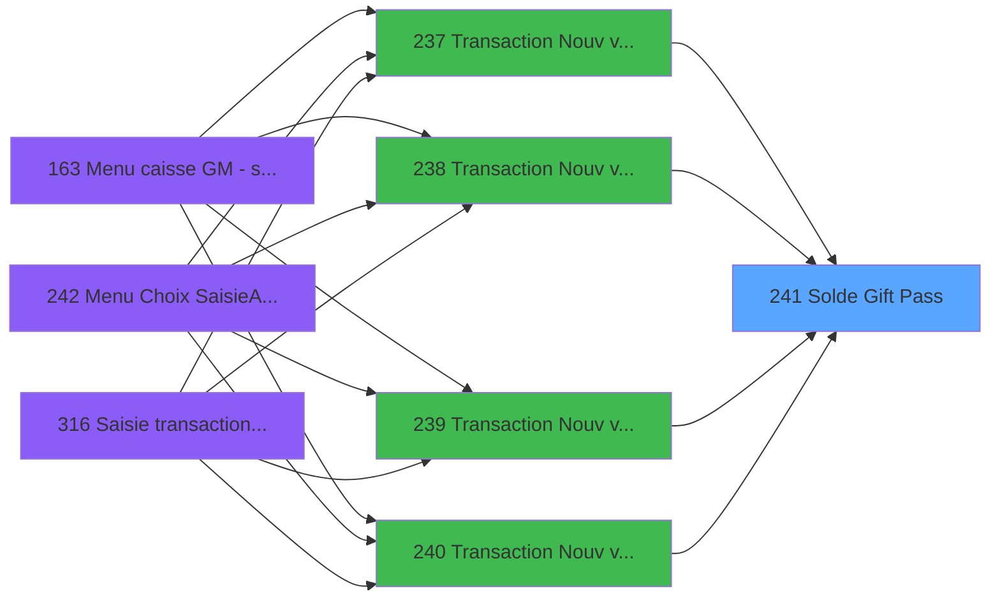

# ADH IDE 241 - Solde Gift Pass

> **Analyse**: Phases 1-4 2026-01-30 09:42 -> 09:43 (8s) | Assemblage 09:43
> **Pipeline**: V7.2 Enrichi
> **Structure**: 4 onglets (Resume | Ecrans | Donnees | Connexions)

<!-- TAB:Resume -->

## 1. FICHE D'IDENTITE

| Attribut | Valeur |
|----------|--------|
| Projet | ADH |
| IDE Position | 241 |
| Nom Programme | Solde Gift Pass |
| Fichier source | `Prg_241.xml` |
| Domaine metier | Comptabilite |
| Taches | 1 (0 ecrans visibles) |
| Tables modifiees | 0 |
| Programmes appeles | 0 |

## 2. DESCRIPTION FONCTIONNELLE

**Solde Gift Pass** assure la gestion complete de ce processus, accessible depuis [Transaction Nouv vente PMS-584 (IDE 238)](ADH-IDE-238.md), [Transaction Nouv vente PMS-721 (IDE 239)](ADH-IDE-239.md), [Transaction Nouv vente PMS-710 (IDE 240)](ADH-IDE-240.md), [Transaction Nouv vente avec GP (IDE 237)](ADH-IDE-237.md).

Le flux de traitement s'organise en **1 blocs fonctionnels** :

- **Traitement** (1 tache) : traitements metier divers

## 3. BLOCS FONCTIONNELS

### 3.1 Traitement (1 tache)

Traitements internes.

---

#### T1 - Solde Gift Pass

**Role** : Traitement interne.

## 5. REGLES METIER

*(Aucune regle metier identifiee)*

## 6. CONTEXTE

- **Appele par**: [Transaction Nouv vente PMS-584 (IDE 238)](ADH-IDE-238.md), [Transaction Nouv vente PMS-721 (IDE 239)](ADH-IDE-239.md), [Transaction Nouv vente PMS-710 (IDE 240)](ADH-IDE-240.md), [Transaction Nouv vente avec GP (IDE 237)](ADH-IDE-237.md)
- **Appelle**: 0 programmes | **Tables**: 1 (W:0 R:1 L:0) | **Taches**: 1 | **Expressions**: 5

<!-- TAB:Ecrans -->

## 8. ECRANS

*(Programme sans ecran visible)*

## 9. NAVIGATION

### 9.3 Structure hierarchique (1 tache)

- **241.1** [Solde Gift Pass (T1)](#t1)   *[Traitement]*

<!-- TAB:Donnees -->

## 10. TABLES

### Tables utilisees (1)

| ID | Nom | Description | Type | R | W | L | Usages |
|----|-----|-------------|------|---|---|---|--------|
| 268 | cc_total_par_type |  | DB | R |   |   | 1 |

### Colonnes par table

Table 268 - cc_total_par_type (R) - 1 usages

*Colonnes accessibles via outils MCP (`magic_get_line`)*

## 11. VARIABLES

### 11.1 Autres (4)

Variables diverses.

| Lettre | Nom | Type | Usage dans |
|--------|-----|------|-----------|
| A | p.Societe | Unicode | 1x refs |
| B | p.Compte | Numeric | 1x refs |
| C | p.Filiation | Numeric | - |
| D | P.solde_credit_conso | Numeric | 1x refs |

## 12. EXPRESSIONS

**5 / 5 expressions decodees (100%)**

### 12.1 Repartition par type

| Type | Expressions | Regles |
|------|-------------|--------|
| CALCULATION | 1 | 0 |
| CONSTANTE | 2 | 0 |
| OTHER | 2 | 0 |

### 12.2 Expressions cles par type

#### CALCULATION (1 expressions)

| Type | IDE | Expression | Regle |
|------|-----|------------|-------|
| CALCULATION | 5 | `P.solde_credit_conso [D]+[I]` | - |

#### CONSTANTE (2 expressions)

| Type | IDE | Expression | Regle |
|------|-----|------------|-------|
| CONSTANTE | 4 | `0` | - |
| CONSTANTE | 3 | `'99'` | - |

#### OTHER (2 expressions)

| Type | IDE | Expression | Regle |
|------|-----|------------|-------|
| OTHER | 2 | `p.Compte [B]` | - |
| OTHER | 1 | `p.Societe [A]` | - |

<!-- TAB:Connexions -->

## 13. GRAPHE D'APPELS

### 13.1 Chaine depuis Main (Callers)

Main -> ... -> [Transaction Nouv vente PMS-584 (IDE 238)](ADH-IDE-238.md) -> **Solde Gift Pass (IDE 241)**

Main -> ... -> [Transaction Nouv vente PMS-721 (IDE 239)](ADH-IDE-239.md) -> **Solde Gift Pass (IDE 241)**

Main -> ... -> [Transaction Nouv vente PMS-710 (IDE 240)](ADH-IDE-240.md) -> **Solde Gift Pass (IDE 241)**

Main -> ... -> [Transaction Nouv vente avec GP (IDE 237)](ADH-IDE-237.md) -> **Solde Gift Pass (IDE 241)**

### 13.2 Callers

| IDE | Nom Programme | Nb Appels |
|-----|---------------|-----------|
| [238](ADH-IDE-238.md) | Transaction Nouv vente PMS-584 | 3 |
| [239](ADH-IDE-239.md) | Transaction Nouv vente PMS-721 | 3 |
| [240](ADH-IDE-240.md) | Transaction Nouv vente PMS-710 | 3 |
| [237](ADH-IDE-237.md) | Transaction Nouv vente avec GP | 1 |

### 13.3 Callees (programmes appeles)

### 13.4 Detail Callees avec contexte

| IDE | Nom Programme | Appels | Contexte |
|-----|---------------|--------|----------|
| - | (aucun) | - | - |

## 14. RECOMMANDATIONS MIGRATION

### 14.1 Profil du programme

| Metrique | Valeur | Impact migration |
|----------|--------|-----------------|
| Lignes de logique | 12 | Programme compact |
| Expressions | 5 | Peu de logique |
| Tables WRITE | 0 | Impact faible |
| Sous-programmes | 0 | Peu de dependances |
| Ecrans visibles | 0 | Ecran unique ou traitement batch |
| Code desactive | 0% (0 / 12) | Code sain |
| Regles metier | 0 | Pas de regle identifiee |

### 14.2 Plan de migration par bloc

#### Traitement (1 tache: 0 ecran, 1 traitement)

- Traitement standard a migrer

### 14.3 Dependances critiques

| Dependance | Type | Appels | Impact |
|------------|------|--------|--------|

---
*Spec DETAILED generee par Pipeline V7.2 - 2026-01-30 09:43*
