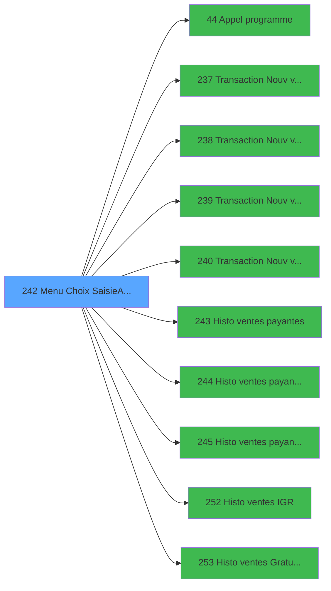

# ADH IDE 242 - Menu Choix Saisie/Annul vente

> **Analyse**: Phases 1-4 2026-02-07 03:54 -> 03:54 (34s) | Assemblage 04:35
> **Pipeline**: V7.2 Enrichi
> **Structure**: 4 onglets (Resume | Ecrans | Donnees | Connexions)

<!-- TAB:Resume -->

## 1. FICHE D'IDENTITE

| Attribut | Valeur |
|----------|--------|
| Projet | ADH |
| IDE Position | 242 |
| Nom Programme | Menu Choix Saisie/Annul vente |
| Fichier source | `Prg_242.xml` |
| Dossier IDE | Ventes |
| Taches | 3 (1 ecrans visibles) |
| Tables modifiees | 1 |
| Programmes appeles | 10 |
| Complexite | **BASSE** (score 17/100) |

## 2. DESCRIPTION FONCTIONNELLE

# ADH IDE 242 - Menu Choix Saisie/Annul vente

**Rôle fonctionnel :** Programme de menu interactif permettant à l'utilisateur de choisir entre saisie d'une nouvelle vente ou annulation d'une vente existante. C'est un point de bifurcation critique dans le workflow de gestion des ventes qui s'exécute après l'ouverture de la caisse.

**Architecture technique :** Programme appelé depuis le Menu caisse GM (IDE 163) avec 3 points d'entrée supplémentaires pour les transactions PMS spécifiques (584, 710, 721). Contient 2 tâches principales : la saisie/annulation vente et la vérification de l'existence de ventes gratuites ou IGR. Modifie la table `comptable_gratuite` pour tracker les opérations de gratification. Propose 10 branches d'appel vers des variantes de ventes (Gift Pass, PMS-584/710/721, historiques payants/IGR/gratuits).

**Impact aval :** Agit comme un dispatcher qui canalise l'utilisateur vers l'un des 8 programmes de transaction spécialisés selon le type de vente choisi. Les historiques de ventes (IDE 243-245, 252-253) permettent l'annulation de transactions antérieures. Cette architecture décentralisée distribue la complexité métier sur des modules spécialisés plutôt que de la centraliser dans un monolithe.

## 3. BLOCS FONCTIONNELS

### 3.1 Saisie (2 taches)

L'operateur saisit les donnees de la transaction via 1 ecran (Saisie/Annulation vente).

---

#### <a id="t1"></a>T1 - Saisie/Annulation vente [ECRAN]

**Role** : Saisie des donnees : Saisie/Annulation vente.
**Ecran** : 600 x 143 DLU (MDI) | [Voir mockup](#ecran-t1)
**Delegue a** : [Transaction Nouv vente avec GP (IDE 237)](ADH-IDE-237.md), [Transaction Nouv vente PMS-584 (IDE 238)](ADH-IDE-238.md), [Transaction Nouv vente PMS-721 (IDE 239)](ADH-IDE-239.md)

---

#### <a id="t2"></a>T2 - Existe vente gratuite ou IGR ?

**Role** : Saisie des donnees : Existe vente gratuite ou IGR ?.
**Variables liees** : S (V.Existe IGR ?), T (V.Existe Gratuité ?)
**Delegue a** : [Transaction Nouv vente avec GP (IDE 237)](ADH-IDE-237.md), [Transaction Nouv vente PMS-584 (IDE 238)](ADH-IDE-238.md), [Transaction Nouv vente PMS-721 (IDE 239)](ADH-IDE-239.md)


### 3.2 Traitement (1 tache)

Traitements internes.

---

#### <a id="t3"></a>T3 - (sans nom)

**Role** : Traitement interne.
**Delegue a** : [Appel programme (IDE 44)](ADH-IDE-44.md)


## 5. REGLES METIER

1 regles identifiees:

### Saisie (1 regles)

#### <a id="rm-RM-001"></a>[RM-001] Traitement si Trim(VG115) est renseigne

| Element | Detail |
|---------|--------|
| **Condition** | `Trim(VG115)<>''` |
| **Si vrai** | Trim(VG115)&'/' |
| **Si faux** | '')&'VENTE' |
| **Expression source** | Expression 25 : `IF(Trim(VG115)<>'',Trim(VG115)&'|','')&'VENTE'` |
| **Exemple** | Si Trim(VG115)<>'' → Trim(VG115)&'/'. Sinon → '')&'VENTE' |
| **Impact** | Bloc Saisie |

## 6. CONTEXTE

- **Appele par**: [Menu caisse GM - scroll (IDE 163)](ADH-IDE-163.md), [Transaction Nouv vente PMS-584 (IDE 0)](ADH-IDE-0.md), [Transaction Nouv vente PMS-710 (IDE 0)](ADH-IDE-0.md), [Transaction Nouv vente PMS-721 (IDE 0)](ADH-IDE-0.md)
- **Appelle**: 10 programmes | **Tables**: 4 (W:1 R:1 L:3) | **Taches**: 3 | **Expressions**: 29

<!-- TAB:Ecrans -->

## 8. ECRANS

### 8.1 Forms visibles (1 / 3)

| # | Position | Tache | Nom | Type | Largeur | Hauteur | Bloc |
|---|----------|-------|-----|------|---------|---------|------|
| 1 | 242 | T1 | Saisie/Annulation vente | MDI | 600 | 143 | Saisie |

### 8.2 Mockups Ecrans

---

#### <a id="ecran-t1"></a>242 - Saisie/Annulation vente
**Tache** : [T1](#t1) | **Type** : MDI | **Dimensions** : 600 x 143 DLU
**Bloc** : Saisie | **Titre IDE** : Saisie/Annulation vente

<!-- FORM-DATA:
{
    "width":  600,
    "vFactor":  8,
    "type":  "MDI",
    "hFactor":  8,
    "controls":  [
                     {
                         "x":  1,
                         "type":  "label",
                         "var":  "",
                         "y":  2,
                         "w":  591,
                         "fmt":  "",
                         "name":  "",
                         "h":  18,
                         "color":  "",
                         "text":  "",
                         "parent":  null
                     },
                     {
                         "x":  51,
                         "type":  "label",
                         "var":  "",
                         "y":  32,
                         "w":  499,
                         "fmt":  "",
                         "name":  "",
                         "h":  77,
                         "color":  "",
                         "text":  "",
                         "parent":  null
                     },
                     {
                         "x":  51,
                         "type":  "label",
                         "var":  "",
                         "y":  32,
                         "w":  499,
                         "fmt":  "",
                         "name":  "",
                         "h":  77,
                         "color":  "",
                         "text":  "",
                         "parent":  null
                     },
                     {
                         "x":  182,
                         "type":  "label",
                         "var":  "",
                         "y":  42,
                         "w":  329,
                         "fmt":  "",
                         "name":  "",
                         "h":  48,
                         "color":  "",
                         "text":  "",
                         "parent":  null
                     },
                     {
                         "x":  186,
                         "type":  "label",
                         "var":  "",
                         "y":  43,
                         "w":  50,
                         "fmt":  "",
                         "name":  "",
                         "h":  45,
                         "color":  "",
                         "text":  "",
                         "parent":  null
                     },
                     {
                         "x":  244,
                         "type":  "label",
                         "var":  "",
                         "y":  47,
                         "w":  259,
                         "fmt":  "",
                         "name":  "",
                         "h":  9,
                         "color":  "142",
                         "text":  "Ventes",
                         "parent":  null
                     },
                     {
                         "x":  244,
                         "type":  "label",
                         "var":  "",
                         "y":  56,
                         "w":  259,
                         "fmt":  "",
                         "name":  "",
                         "h":  10,
                         "color":  "142",
                         "text":  "Historique des ventes",
                         "parent":  null
                     },
                     {
                         "x":  244,
                         "type":  "label",
                         "var":  "",
                         "y":  66,
                         "w":  259,
                         "fmt":  "",
                         "name":  "",
                         "h":  10,
                         "color":  "142",
                         "text":  "Annulation des IGR",
                         "parent":  null
                     },
                     {
                         "x":  244,
                         "type":  "label",
                         "var":  "",
                         "y":  76,
                         "w":  259,
                         "fmt":  "",
                         "name":  "",
                         "h":  10,
                         "color":  "142",
                         "text":  "Annulation des Gratuités",
                         "parent":  null
                     },
                     {
                         "x":  346,
                         "type":  "label",
                         "var":  "",
                         "y":  96,
                         "w":  123,
                         "fmt":  "",
                         "name":  "",
                         "h":  10,
                         "color":  "",
                         "text":  "Votre choix",
                         "parent":  null
                     },
                     {
                         "x":  1,
                         "type":  "label",
                         "var":  "",
                         "y":  118,
                         "w":  591,
                         "fmt":  "",
                         "name":  "",
                         "h":  24,
                         "color":  "",
                         "text":  "",
                         "parent":  null
                     },
                     {
                         "x":  485,
                         "type":  "edit",
                         "var":  "",
                         "y":  96,
                         "w":  26,
                         "fmt":  "UA",
                         "name":  "W0 choix action",
                         "h":  10,
                         "color":  "6",
                         "text":  "",
                         "parent":  null
                     },
                     {
                         "x":  15,
                         "type":  "edit",
                         "var":  "",
                         "y":  6,
                         "w":  267,
                         "fmt":  "20",
                         "name":  "",
                         "h":  8,
                         "color":  "",
                         "text":  "",
                         "parent":  1
                     },
                     {
                         "x":  307,
                         "type":  "edit",
                         "var":  "",
                         "y":  6,
                         "w":  268,
                         "fmt":  "WWW DD MMM YYYYT",
                         "name":  "",
                         "h":  8,
                         "color":  "",
                         "text":  "",
                         "parent":  1
                     },
                     {
                         "x":  75,
                         "type":  "image",
                         "var":  "",
                         "y":  43,
                         "w":  88,
                         "fmt":  "",
                         "name":  "",
                         "h":  45,
                         "color":  "",
                         "text":  "",
                         "parent":  null
                     },
                     {
                         "x":  204,
                         "type":  "button",
                         "var":  "",
                         "y":  47,
                         "w":  26,
                         "fmt":  "1",
                         "name":  "1",
                         "h":  9,
                         "color":  "",
                         "text":  "",
                         "parent":  null
                     },
                     {
                         "x":  204,
                         "type":  "button",
                         "var":  "",
                         "y":  56,
                         "w":  26,
                         "fmt":  "2",
                         "name":  "2",
                         "h":  10,
                         "color":  "",
                         "text":  "",
                         "parent":  null
                     },
                     {
                         "x":  9,
                         "type":  "button",
                         "var":  "",
                         "y":  121,
                         "w":  154,
                         "fmt":  "\u0026Quitter",
                         "name":  "",
                         "h":  18,
                         "color":  "",
                         "text":  "",
                         "parent":  15
                     },
                     {
                         "x":  204,
                         "type":  "button",
                         "var":  "",
                         "y":  66,
                         "w":  26,
                         "fmt":  "3",
                         "name":  "3",
                         "h":  10,
                         "color":  "",
                         "text":  "",
                         "parent":  null
                     },
                     {
                         "x":  204,
                         "type":  "button",
                         "var":  "",
                         "y":  76,
                         "w":  26,
                         "fmt":  "4",
                         "name":  "4",
                         "h":  10,
                         "color":  "",
                         "text":  "",
                         "parent":  null
                     }
                 ],
    "taskId":  "242",
    "height":  143
}
-->

<details>
<summary><strong>Champs : 3 champs</strong></summary>

| Pos (x,y) | Nom | Variable | Type |
|-----------|-----|----------|------|
| 485,96 | W0 choix action | - | edit |
| 15,6 | 20 | - | edit |
| 307,6 | WWW DD MMM YYYYT | - | edit |

</details>

<details>
<summary><strong>Boutons : 5 boutons</strong></summary>

| Bouton | Pos (x,y) | Action |
|--------|-----------|--------|
| 1 | 204,47 | Bouton fonctionnel |
| 2 | 204,56 | Bouton fonctionnel |
| Quitter | 9,121 | Quitte le programme |
| 3 | 204,66 | Bouton fonctionnel |
| 4 | 204,76 | Bouton fonctionnel |

</details>

## 9. NAVIGATION

Ecran unique: **Saisie/Annulation vente**

### 9.3 Structure hierarchique (3 taches)

| Position | Tache | Type | Dimensions | Bloc |
|----------|-------|------|------------|------|
| **242.1** | [**Saisie/Annulation vente** (T1)](#t1) [mockup](#ecran-t1) | MDI | 600x143 | Saisie |
| 242.1.1 | [Existe vente gratuite ou IGR ? (T2)](#t2) | - | - | |
| **242.2** | [**(sans nom)** (T3)](#t3) | - | - | Traitement |

### 9.4 Algorigramme

```mermaid
flowchart TD
    START([START])
    INIT[Init controles]
    START --> INIT
    B1[Saisie (2t)]
    INIT --> B1
    B2[Traitement (1t)]
    B1 --> B2
    WRITE[MAJ 1 tables]
    B2 --> WRITE
    ENDOK([END OK])
    WRITE --> ENDOK

    style START fill:#3fb950,color:#000
    style ENDOK fill:#3fb950,color:#000
    style WRITE fill:#ffeb3b,color:#000
```

> **Legende**: Vert = START/END OK | Rouge = END KO | Bleu = Decisions
> *Algorigramme genere depuis les expressions CONDITION. Utiliser `/algorigramme` pour une synthese metier detaillee.*

<!-- TAB:Donnees -->

## 10. TABLES

### Tables utilisees (4)

| ID | Nom | Description | Type | R | W | L | Usages |
|----|-----|-------------|------|---|---|---|--------|
| 38 | comptable_gratuite |  | DB | R | **W** |   | 2 |
| 264 | vente_gratuite | Donnees de ventes | DB |   |   | L | 1 |
| 400 | pv_cust_rentals |  | DB |   |   | L | 1 |
| 804 | valeur_credit_bar_defaut |  | DB |   |   | L | 1 |

### Colonnes par table (2 / 1 tables avec colonnes identifiees)

<details>
<summary>Table 38 - comptable_gratuite (R/**W**) - 2 usages</summary>

| Lettre | Variable | Acces | Type |
|--------|----------|-------|------|
| A | v.Existe IGR ? | W | Logical |
| B | v.Existe Vente GRATUITE ? | W | Logical |
| C | v.Existe Comptable Gratuite | W | Logical |

</details>

## 11. VARIABLES

### 11.1 Parametres entrants (16)

Variables recues du programme appelant ([Menu caisse GM - scroll (IDE 163)](ADH-IDE-163.md)).

| Lettre | Nom | Type | Usage dans |
|--------|-----|------|-----------|
| A | P.Societe | Alpha | - |
| B | P.Devise locale | Alpha | - |
| C | P.Masque montant | Alpha | - |
| D | P.Solde compte | Numeric | - |
| E | P.Code GM | Numeric | - |
| F | P.Filiation | Numeric | - |
| G | P.Date fin sejour | Date | - |
| H | P.Etat compte | Alpha | - |
| I | P.Date solde | Date | - |
| J | P.Garanti O/N | Alpha | - |
| K | P.Nom & prénom | Alpha | - |
| L | P.UNI/BI | Alpha | - |
| M | P.Date debut sejour | Date | - |
| N | P.Valide ? | Numeric | - |
| O | P.Nb decimales | Numeric | - |
| P | P.Mode consultation | Logical | 1x parametre entrant |

### 11.2 Variables de session (4)

Variables persistantes pendant toute la session.

| Lettre | Nom | Type | Usage dans |
|--------|-----|------|-----------|
| R | v.fin | Logical | 1x session |
| S | V.Existe IGR ? | Logical | 1x session |
| T | V.Existe Gratuité ? | Logical | 1x session |
| U | V.Session ouverte ? | Logical | 1x session |

### 11.3 Variables de travail (1)

Variables internes au programme.

| Lettre | Nom | Type | Usage dans |
|--------|-----|------|-----------|
| Q | W0 choix action | Alpha | 5x calcul interne |

<details>
<summary>Toutes les 21 variables (liste complete)</summary>

| Cat | Lettre | Nom Variable | Type |
|-----|--------|--------------|------|
| P0 | **A** | P.Societe | Alpha |
| P0 | **B** | P.Devise locale | Alpha |
| P0 | **C** | P.Masque montant | Alpha |
| P0 | **D** | P.Solde compte | Numeric |
| P0 | **E** | P.Code GM | Numeric |
| P0 | **F** | P.Filiation | Numeric |
| P0 | **G** | P.Date fin sejour | Date |
| P0 | **H** | P.Etat compte | Alpha |
| P0 | **I** | P.Date solde | Date |
| P0 | **J** | P.Garanti O/N | Alpha |
| P0 | **K** | P.Nom & prénom | Alpha |
| P0 | **L** | P.UNI/BI | Alpha |
| P0 | **M** | P.Date debut sejour | Date |
| P0 | **N** | P.Valide ? | Numeric |
| P0 | **O** | P.Nb decimales | Numeric |
| P0 | **P** | P.Mode consultation | Logical |
| W0 | **Q** | W0 choix action | Alpha |
| V. | **R** | v.fin | Logical |
| V. | **S** | V.Existe IGR ? | Logical |
| V. | **T** | V.Existe Gratuité ? | Logical |
| V. | **U** | V.Session ouverte ? | Logical |

</details>

## 12. EXPRESSIONS

**29 / 29 expressions decodees (100%)**

### 12.1 Repartition par type

| Type | Expressions | Regles |
|------|-------------|--------|
| CALCULATION | 1 | 0 |
| CONDITION | 10 | 5 |
| CONSTANTE | 1 | 0 |
| DATE | 1 | 0 |
| REFERENCE_VG | 1 | 0 |
| OTHER | 10 | 0 |
| CAST_LOGIQUE | 1 | 0 |
| NEGATION | 4 | 0 |

### 12.2 Expressions cles par type

#### CALCULATION (1 expressions)

| Type | IDE | Expression | Regle |
|------|-----|------------|-------|
| CALCULATION | 23 | `CallProg('{323,-1}'PROG)` | - |

#### CONDITION (10 expressions)

| Type | IDE | Expression | Regle |
|------|-----|------------|-------|
| CONDITION | 25 | `IF(Trim(VG115)<>'',Trim(VG115)&'\|','')&'VENTE'` | [RM-001](#rm-RM-001) |
| CONDITION | 10 | `W0 choix action [Q]='4'` | - |
| CONDITION | 9 | `W0 choix action [Q]='3'` | - |
| CONDITION | 26 | `VG111 AND VG112<>0` | - |
| CONDITION | 12 | `W0 choix action [Q]='3' OR W0 choix action [Q]='4'` | - |
| ... | | *+5 autres* | |

#### CONSTANTE (1 expressions)

| Type | IDE | Expression | Regle |
|------|-----|------------|-------|
| CONSTANTE | 3 | `''` | - |

#### DATE (1 expressions)

| Type | IDE | Expression | Regle |
|------|-----|------------|-------|
| DATE | 1 | `Date ()` | - |

#### REFERENCE_VG (1 expressions)

| Type | IDE | Expression | Regle |
|------|-----|------------|-------|
| REFERENCE_VG | 2 | `VG2` | - |

#### OTHER (10 expressions)

| Type | IDE | Expression | Regle |
|------|-----|------------|-------|
| OTHER | 18 | `VG83 AND NOT VG85` | - |
| OTHER | 17 | `NOT(VG83) AND NOT(VG85)` | - |
| OTHER | 21 | `VG89 AND NOT VG93` | - |
| OTHER | 24 | `NOT(V.Session ouverte ? [U]) AND NOT(VG3)` | - |
| OTHER | 22 | `VG89 AND VG93` | - |
| ... | | *+5 autres* | |

#### CAST_LOGIQUE (1 expressions)

| Type | IDE | Expression | Regle |
|------|-----|------------|-------|
| CAST_LOGIQUE | 6 | `'TRUE'LOG` | - |

#### NEGATION (4 expressions)

| Type | IDE | Expression | Regle |
|------|-----|------------|-------|
| NEGATION | 19 | `NOT VG85 OR VG3` | - |
| NEGATION | 20 | `NOT VG89` | - |
| NEGATION | 15 | `NOT P.Mode consultation [P]` | - |
| NEGATION | 16 | `NOT VG81` | - |

### 12.3 Toutes les expressions (29)

<details>
<summary>Voir les 29 expressions</summary>

#### CALCULATION (1)

| IDE | Expression Decodee |
|-----|-------------------|
| 23 | `CallProg('{323,-1}'PROG)` |

#### CONDITION (10)

| IDE | Expression Decodee |
|-----|-------------------|
| 25 | `IF(Trim(VG115)<>'',Trim(VG115)&'\|','')&'VENTE'` |
| 27 | `IF(Trim(VG115)<>'',Trim(VG115)&'\|','')&'HISTORIQUE DES VENTES'` |
| 28 | `IF(Trim(VG115)<>'',Trim(VG115)&'\|','')&'HISTORIQUE DES IGR'` |
| 29 | `IF(Trim(VG115)<>'',Trim(VG115)&'\|','')&'HISTORIQUE DES GRATUITES'` |
| 4 | `W0 choix action [Q]='1'` |
| 7 | `W0 choix action [Q]='2'` |
| 9 | `W0 choix action [Q]='3'` |
| 10 | `W0 choix action [Q]='4'` |
| 12 | `W0 choix action [Q]='3' OR W0 choix action [Q]='4'` |
| 26 | `VG111 AND VG112<>0` |

#### CONSTANTE (1)

| IDE | Expression Decodee |
|-----|-------------------|
| 3 | `''` |

#### DATE (1)

| IDE | Expression Decodee |
|-----|-------------------|
| 1 | `Date ()` |

#### REFERENCE_VG (1)

| IDE | Expression Decodee |
|-----|-------------------|
| 2 | `VG2` |

#### OTHER (10)

| IDE | Expression Decodee |
|-----|-------------------|
| 5 | `v.fin [R]` |
| 8 | `DbDel('{933,4}'DSOURCE,'')` |
| 11 | `VG3 OR VG47` |
| 13 | `(VG3 OR VG47) AND V.Existe IGR ? [S]` |
| 14 | `(VG3 OR VG47) AND V.Existe Gratuité ? [T]` |
| 17 | `NOT(VG83) AND NOT(VG85)` |
| 18 | `VG83 AND NOT VG85` |
| 21 | `VG89 AND NOT VG93` |
| 22 | `VG89 AND VG93` |
| 24 | `NOT(V.Session ouverte ? [U]) AND NOT(VG3)` |

#### CAST_LOGIQUE (1)

| IDE | Expression Decodee |
|-----|-------------------|
| 6 | `'TRUE'LOG` |

#### NEGATION (4)

| IDE | Expression Decodee |
|-----|-------------------|
| 15 | `NOT P.Mode consultation [P]` |
| 16 | `NOT VG81` |
| 19 | `NOT VG85 OR VG3` |
| 20 | `NOT VG89` |

</details>

<!-- TAB:Connexions -->

## 13. GRAPHE D'APPELS

### 13.1 Chaine depuis Main (Callers)

Main -> ... -> [Menu caisse GM - scroll (IDE 163)](ADH-IDE-163.md) -> **Menu Choix Saisie/Annul vente (IDE 242)**

Main -> ... -> [Transaction Nouv vente PMS-584 (IDE 0)](ADH-IDE-0.md) -> **Menu Choix Saisie/Annul vente (IDE 242)**

Main -> ... -> [Transaction Nouv vente PMS-710 (IDE 0)](ADH-IDE-0.md) -> **Menu Choix Saisie/Annul vente (IDE 242)**

Main -> ... -> [Transaction Nouv vente PMS-721 (IDE 0)](ADH-IDE-0.md) -> **Menu Choix Saisie/Annul vente (IDE 242)**


### 13.2 Callers

| IDE | Nom Programme | Nb Appels |
|-----|---------------|-----------|
| [163](ADH-IDE-163.md) | Menu caisse GM - scroll | 2 |
| [0](ADH-IDE-0.md) | Transaction Nouv vente PMS-584 | 1 |
| [0](ADH-IDE-0.md) | Transaction Nouv vente PMS-710 | 1 |
| [0](ADH-IDE-0.md) | Transaction Nouv vente PMS-721 | 1 |

### 13.3 Callees (programmes appeles)



### 13.4 Detail Callees avec contexte

| IDE | Nom Programme | Appels | Contexte |
|-----|---------------|--------|----------|
| [44](ADH-IDE-44.md) | Appel programme | 1 | Sous-programme |
| [237](ADH-IDE-237.md) | Transaction Nouv vente avec GP | 1 | Sous-programme |
| [238](ADH-IDE-238.md) | Transaction Nouv vente PMS-584 | 1 | Sous-programme |
| [239](ADH-IDE-239.md) | Transaction Nouv vente PMS-721 | 1 | Sous-programme |
| [240](ADH-IDE-240.md) | Transaction Nouv vente PMS-710 | 1 | Sous-programme |
| [243](ADH-IDE-243.md) | Histo ventes payantes | 1 | Historique/consultation |
| [244](ADH-IDE-244.md) | Histo ventes payantes /PMS-605 | 1 | Historique/consultation |
| [245](ADH-IDE-245.md) | Histo ventes payantes /PMS-623 | 1 | Historique/consultation |
| [252](ADH-IDE-252.md) | Histo ventes IGR | 1 | Historique/consultation |
| [253](ADH-IDE-253.md) | Histo ventes Gratuités | 1 | Historique/consultation |

## 14. RECOMMANDATIONS MIGRATION

### 14.1 Profil du programme

| Metrique | Valeur | Impact migration |
|----------|--------|-----------------|
| Lignes de logique | 133 | Programme compact |
| Expressions | 29 | Peu de logique |
| Tables WRITE | 1 | Impact faible |
| Sous-programmes | 10 | Dependances moderees |
| Ecrans visibles | 1 | Ecran unique ou traitement batch |
| Code desactive | 4.5% (6 / 133) | Code sain |
| Regles metier | 1 | Quelques regles a preserver |

### 14.2 Plan de migration par bloc

#### Saisie (2 taches: 1 ecran, 1 traitement)

- **Strategie** : Formulaire React/Blazor avec validation Zod/FluentValidation.
- Reproduire 1 ecran : Saisie/Annulation vente
- Validation temps reel cote client + serveur

#### Traitement (1 tache: 0 ecran, 1 traitement)

- **Strategie** : 1 service(s) backend injectable(s) (Domain Services).
- 10 sous-programme(s) a migrer ou a reutiliser depuis les services existants.
- Decomposer les taches en services unitaires testables.

### 14.3 Dependances critiques

| Dependance | Type | Appels | Impact |
|------------|------|--------|--------|
| comptable_gratuite | Table WRITE (Database) | 1x | Schema + repository |
| [Histo ventes payantes /PMS-605 (IDE 244)](ADH-IDE-244.md) | Sous-programme | 1x | Normale - Historique/consultation |
| [Histo ventes payantes (IDE 243)](ADH-IDE-243.md) | Sous-programme | 1x | Normale - Historique/consultation |
| [Histo ventes payantes /PMS-623 (IDE 245)](ADH-IDE-245.md) | Sous-programme | 1x | Normale - Historique/consultation |
| [Histo ventes Gratuités (IDE 253)](ADH-IDE-253.md) | Sous-programme | 1x | Normale - Historique/consultation |
| [Histo ventes IGR (IDE 252)](ADH-IDE-252.md) | Sous-programme | 1x | Normale - Historique/consultation |
| [Transaction Nouv vente avec GP (IDE 237)](ADH-IDE-237.md) | Sous-programme | 1x | Normale - Sous-programme |
| [Appel programme (IDE 44)](ADH-IDE-44.md) | Sous-programme | 1x | Normale - Sous-programme |
| [Transaction Nouv vente PMS-584 (IDE 238)](ADH-IDE-238.md) | Sous-programme | 1x | Normale - Sous-programme |
| [Transaction Nouv vente PMS-710 (IDE 240)](ADH-IDE-240.md) | Sous-programme | 1x | Normale - Sous-programme |
| [Transaction Nouv vente PMS-721 (IDE 239)](ADH-IDE-239.md) | Sous-programme | 1x | Normale - Sous-programme |

---
*Spec DETAILED generee par Pipeline V7.2 - 2026-02-08 04:35*
