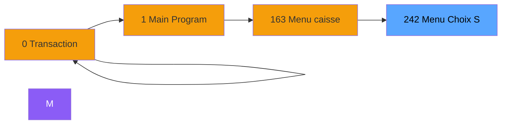
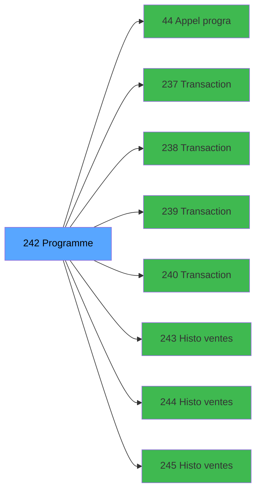

# ADH IDE 242 - Menu Choix Saisie/Annul vente

> **Version spec**: 3.5
> **Analyse**: 2026-01-27 17:57
> **Source**: `Prg_XXX.xml`

---

<!-- TAB:Fonctionnel -->

## SPECIFICATION FONCTIONNELLE

### 1.1 Objectif metier

| Element | Description |
|---------|-------------|
| **Qui** | Operateur |
| **Quoi** | Menu Choix Saisie/Annul vente
 |
| **Pourquoi** | A documenter |
| **Declencheur** | A identifier |

### 1.2 Regles metier

| Code | Regle | Condition |
|------|-------|-----------|
| RM-001 | A documenter | - |

### 1.3 Flux utilisateur

1. Demarrage programme
2. Traitement principal
3. Fin programme

### 1.4 Cas d'erreur

| Erreur | Comportement |
|--------|--------------|
| - | A documenter |

---

<!-- TAB:Technique -->

## SPECIFICATION TECHNIQUE

### 2.1 Identification

| Attribut | Valeur |
|----------|--------|
| **Format IDE** | ADH IDE 242 |
| **Description** | Menu Choix Saisie/Annul vente
 |
| **Module** | ADH |

### 2.2 Tables

| # | Nom logique | Nom physique | Acces | Usage |
|---|-------------|--------------|-------|-------|
| 38 | comptable_gratuite | `cafil016_dat` | R | 1x |
| 38 | comptable_gratuite | `cafil016_dat` | **W** | 1x |
| 264 | vente_gratuite | `caisse_vente_gratuite` | L | 1x |
| 400 | pv_cust_rentals | `pv_rentals_dat` | L | 1x |
| 804 | valeur_credit_bar_defaut | `valeur_credit_bar_defaut` | L | 1x |
### 2.3 Parametres d'entree

| Variable | Nom | Type | Picture |
|----------|-----|------|---------|
| - | Aucun parametre | - | - |
### 2.4 Algorigramme

### 2.5 Expressions cles

| IDE | Expression | Commentaire |
|-----|------------|-------------|
| 1 | `Date ()` | - |
| 2 | `{32768,2}` | - |
| 3 | `''` | - |
| 4 | `{0,17}='1'` | - |
| 5 | `{0,18}` | - |
| 6 | `'TRUE'LOG` | - |
| 7 | `{0,17}='2'` | - |
| 8 | `DbDel('{933,4}'DSOURCE,'')` | - |
| 9 | `{0,17}='3'` | - |
| 10 | `{0,17}='4'` | - |
| 11 | `{32768,3} OR {32768,47}` | - |
| 12 | `{0,17}='3' OR {0,17}='4'` | - |
| 13 | `({32768,3} OR {32768,47}) AND {0,19}` | - |
| 14 | `({32768,3} OR {32768,47}) AND {0,20}` | - |
| 15 | `NOT {0,16}` | - |
| 16 | `NOT {32768,81}` | - |
| 17 | `NOT({32768,83}) AND NOT({32768,85})` | - |
| 18 | `{32768,83} AND NOT {32768,85}` | - |
| 19 | `NOT {32768,85} OR {32768,3}` | - |
| 20 | `NOT {32768,89}` | - |

> **Total**: 29 expressions (affichees: 20)
### 2.6 Variables importantes

### 2.7 Statistiques

| Metrique | Valeur |
|----------|--------|
| **Taches** | 3 |
| **Lignes logique** | 133 |
| **Lignes desactivees** | 0 |
---

<!-- TAB:Cartographie -->

## CARTOGRAPHIE APPLICATIVE

### 3.1 Chaine d'appels depuis Main

### 3.2 Callers directs

| IDE | Programme | Nb appels |
|-----|-----------|-----------|
| 163 | Menu caisse GM - scroll | 2 |
| 0 | Transaction Nouv vente PMS-584 | 1 |
| 0 | Transaction Nouv vente PMS-710 | 1 |
| 0 | Transaction Nouv vente PMS-721 | 1 |
### 3.3 Callees

| Niv | IDE | Programme | Nb appels |
|-----|-----|-----------|-----------|
| 1 | 44 | Appel programme | 1 |
| 1 | 237 | Transaction Nouv vente avec GP | 1 |
| 1 | 238 | Transaction Nouv vente PMS-584 | 1 |
| 1 | 239 | Transaction Nouv vente PMS-721 | 1 |
| 1 | 240 | Transaction Nouv vente PMS-710 | 1 |
| 1 | 243 | Histo ventes payantes | 1 |
| 1 | 244 | Histo ventes payantes /PMS-605 | 1 |
| 1 | 245 | Histo ventes payantes /PMS-623 | 1 |
| 1 | 252 | Histo ventes IGR | 1 |
| 1 | 253 | Histo ventes Gratuités | 1 |
### 3.4 Verification orphelin

| Critere | Resultat |
|---------|----------|
| Callers actifs | A verifier |
| **Conclusion** | A analyser |

---

## HISTORIQUE

| Date | Action | Auteur |
|------|--------|--------|
| 2026-01-27 20:24 | **DATA V2** - Tables reelles, Expressions, Stats, CallChain | Script |
| 2026-01-27 19:50 | **DATA POPULATED** - Tables, Callgraph (29 expr) | Script |
| 2026-01-27 17:57 | **Upgrade V3.5** - TAB markers, Mermaid | Claude |

---

*Specification V3.5 - Format avec TAB markers et Mermaid*
