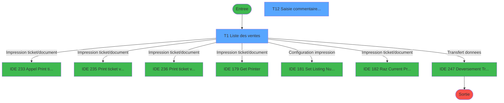
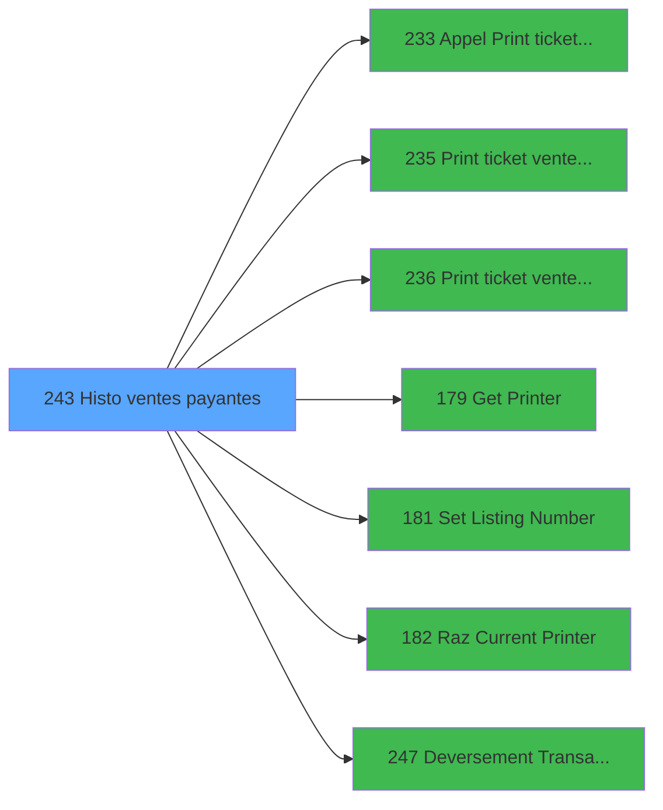

# ADH IDE 243 - Histo ventes payantes

> **Analyse**: Phases 1-4 2026-02-07 03:54 -> 03:54 (34s) | Assemblage 04:35
> **Pipeline**: V7.2 Enrichi
> **Structure**: 4 onglets (Resume | Ecrans | Donnees | Connexions)

<!-- TAB:Resume -->

## 1. FICHE D'IDENTITE

| Attribut | Valeur |
|----------|--------|
| Projet | ADH |
| IDE Position | 243 |
| Nom Programme | Histo ventes payantes |
| Fichier source | `Prg_243.xml` |
| Dossier IDE | Ventes |
| Taches | 22 (2 ecrans visibles) |
| Tables modifiees | 4 |
| Programmes appeles | 7 |
| Complexite | **MOYENNE** (score 46/100) |

## 2. DESCRIPTION FONCTIONNELLE

ADH IDE 243 - Histo ventes payantes gère l'historique des transactions de vente dans le système de caisse. Ce programme est appelé lors de la création de nouvelles ventes (PMS-584, PMS-710, PMS-721) et depuis le menu de saisie/annulation (IDE 242). Il centralise l'enregistrement et le suivi des opérations commerciales payantes.

Le programme orchestre l'impression des tickets de vente via trois variantes (PMS28, LEX, PMS-584) et gère les ressources d'impression (Get Printer, Set Listing Number, Raz Current Printer). Il effectue également le déversement des transactions (IDE 247) pour synchroniser les données de caisse vers le serveur ou une base centrale.

La logique métier inclut un mécanisme de déblocage/blocage de clôture (6 tâches) avec test réseau et vérification d'état de clôture en cours. Les tables modifiées (reseau_cloture, compte_gm, log_booker) indiquent une interaction forte avec l'état de la clôture de caisse et la synchronisation Booker. Ce programme est donc critique pour l'intégrité des transactions et l'audit comptable de la caisse.

## 3. BLOCS FONCTIONNELS

### 3.1 Saisie (2 taches)

L'operateur saisit les donnees de la transaction via 2 ecrans (Liste des  ventes, Saisie commentaire annulation).

---

#### <a id="t1"></a>T1 - Liste des  ventes [ECRAN]

**Role** : Saisie des donnees : Liste des  ventes.
**Ecran** : 1802 x 274 DLU | [Voir mockup](#ecran-t1)
**Delegue a** : [Appel Print ticket vente PMS28 (IDE 233)](ADH-IDE-233.md), [ Print ticket vente LEX (IDE 235)](ADH-IDE-235.md), [ Print ticket vente PMS-584 (IDE 236)](ADH-IDE-236.md)

---

#### <a id="t12"></a>T12 - Saisie commentaire annulation [ECRAN]

**Role** : Saisie des donnees : Saisie commentaire annulation.
**Ecran** : 909 x 92 DLU (MDI) | [Voir mockup](#ecran-t12)
**Variables liees** : CP (V.N°Ticket Annulation), BG (id_annulation), BH (annulation), BI (Commentaire_Annulation), BN (V0.Motif annulation)
**Delegue a** : [Appel Print ticket vente PMS28 (IDE 233)](ADH-IDE-233.md), [ Print ticket vente LEX (IDE 235)](ADH-IDE-235.md), [ Print ticket vente PMS-584 (IDE 236)](ADH-IDE-236.md)


### 3.2 Traitement (12 taches)

Traitements internes.

---

#### <a id="t2"></a>T2 - Deblocage cloture v1

**Role** : Traitement : Deblocage cloture v1.
**Variables liees** : CE (V0.Cloture en cours)

---

#### <a id="t3"></a>T3 - Deblocage cloture v1

**Role** : Traitement : Deblocage cloture v1.
**Variables liees** : CE (V0.Cloture en cours)

---

#### <a id="t4"></a>T4 - Test reseau

**Role** : Verification : Test reseau.
**Variables liees** : CH (V0.Reseau)

---

#### <a id="t5"></a>T5 - Test si cloture en cours

**Role** : Verification : Test si cloture en cours.
**Variables liees** : CE (V0.Cloture en cours)

---

#### <a id="t6"></a>T6 - Blocage cloture v1

**Role** : Traitement : Blocage cloture v1.
**Variables liees** : CE (V0.Cloture en cours)

---

#### <a id="t7"></a>T7 - Blocage cloture v1

**Role** : Traitement : Blocage cloture v1.
**Variables liees** : CE (V0.Cloture en cours)

---

#### <a id="t9"></a>T9 - Gratuite ?  * Non Utilisée *

**Role** : Traitement : Gratuite ?  * Non Utilisée *.
**Variables liees** : BY (V0.Gratuite)

---

#### <a id="t13"></a>T13 - Maj tempo

**Role** : Traitement : Maj tempo.

---

#### <a id="t14"></a>T14 - Maj tempo

**Role** : Traitement : Maj tempo.

---

#### <a id="t15"></a>T15 - test

**Role** : Verification : test.

---

#### <a id="t16"></a>T16 - Maj tempo [ECRAN]

**Role** : Traitement : Maj tempo.
**Ecran** : 526 x 0 DLU | [Voir mockup](#ecran-t16)

---

#### <a id="t19"></a>T19 - Envoi mail garantie

**Role** : Traitement : Envoi mail garantie.
**Variables liees** : CR (v.Envoi ticket email), CS (v.Adresse Mail), CW (v.Flag envoi mail)


### 3.3 Calcul (1 tache)

Calculs metier : montants, stocks, compteurs.

---

#### <a id="t8"></a>T8 - Reaffichage infos compte

**Role** : Reinitialisation : Reaffichage infos compte.
**Variables liees** : D (P.Solde compte), G (P.Etat compte), CJ (V0.Chaine compte special)


### 3.4 Consultation (1 tache)

Ecrans de recherche et consultation.

---

#### <a id="t10"></a>T10 - Recherche imputation/ssimput

**Role** : Traitement : Recherche imputation/ssimput.


### 3.5 Validation (3 taches)

Controles de coherence : 3 taches verifient les donnees et conditions.

---

#### <a id="t11"></a>T11 - Verif

**Role** : Verification : Verif.

---

#### <a id="t17"></a>T17 - Verif

**Role** : Verification : Verif.

---

#### <a id="t18"></a>T18 - Verif ligne selectionnee

**Role** : Verification : Verif ligne selectionnee.
**Variables liees** : CM (V0.Exist ligne à annuler ?), CN (V0.Existe ligne selectionnee ?)


### 3.6 Impression (1 tache)

Generation des documents et tickets.

---

#### <a id="t20"></a>T20 - Vérif Ticket mobilité

**Role** : Generation du document : Vérif Ticket mobilité.
**Variables liees** : CP (V.N°Ticket Annulation), CR (v.Envoi ticket email), CX (v.Flag Vte en mobilité), CY (V.Numéro de ticket à rééditer), BP (L.Retour_Ticket)
**Delegue a** : [Get Printer (IDE 179)](ADH-IDE-179.md), [Raz Current Printer (IDE 182)](ADH-IDE-182.md)


### 3.7 Creation (2 taches)

Insertion de nouveaux enregistrements en base.

---

#### <a id="t39"></a>T39 - Creation affectation trf

**Role** : Creation d'enregistrement : Creation affectation trf.

---

#### <a id="t42"></a>T42 - Creation affectation trf

**Role** : Creation d'enregistrement : Creation affectation trf.


## 5. REGLES METIER

9 regles identifiees:

### Impression (1 regles)

#### <a id="rm-RM-005"></a>[RM-005] Si L.Retour_Ticket [BP] alors 'V' sinon 'C')

| Element | Detail |
|---------|--------|
| **Condition** | `L.Retour_Ticket [BP]` |
| **Si vrai** | 'V' |
| **Si faux** | 'C') |
| **Variables** | BP (L.Retour_Ticket) |
| **Expression source** | Expression 36 : `IF(L.Retour_Ticket [BP],'V','C')` |
| **Exemple** | Si L.Retour_Ticket [BP] → 'V'. Sinon → 'C') |
| **Impact** | Bloc Impression |

### Autres (8 regles)

#### <a id="rm-RM-001"></a>[RM-001] Valeur par defaut si P.Masque montant [C] est vide

| Element | Detail |
|---------|--------|
| **Condition** | `P.Masque montant [C]=''` |
| **Si vrai** | 'N15.2Z' |
| **Si faux** | P.Masque montant [C]) |
| **Variables** | C (P.Masque montant), Z (montant) |
| **Expression source** | Expression 7 : `IF (P.Masque montant [C]='','N15.2Z',P.Masque montant [C])` |
| **Exemple** | Si P.Masque montant [C]='' → 'N15.2Z'. Sinon → P.Masque montant [C]) |

#### <a id="rm-RM-002"></a>[RM-002] Si [AG]<>0 OR [AH]='A' alors 36 sinon 110)

| Element | Detail |
|---------|--------|
| **Condition** | `[AG]<>0 OR [AH]='A'` |
| **Si vrai** | 36 |
| **Si faux** | 110) |
| **Expression source** | Expression 10 : `IF([AG]<>0 OR [AH]='A',36,110)` |
| **Exemple** | Si [AG]<>0 OR [AH]='A' → 36. Sinon → 110) |

#### <a id="rm-RM-003"></a>[RM-003] Traitement si [AH]='A',MlsTrans ('Annulation'),IF([AG] est non nul

| Element | Detail |
|---------|--------|
| **Condition** | `[AH]='A'` |
| **Si vrai** | MlsTrans ('Annulation') |
| **Si faux** | IF([AG]<>0,MlsTrans ('Annulée'),'')) |
| **Variables** | BH (annulation) |
| **Expression source** | Expression 11 : `IF([AH]='A',MlsTrans ('Annulation'),IF([AG]<>0,MlsTrans ('An` |
| **Exemple** | Si [AH]='A' → MlsTrans ('Annulation'). Sinon → IF([AG]<>0,MlsTrans ('Annulée'),'')) |

#### <a id="rm-RM-004"></a>[RM-004] Si paiement [U]='OD' alors 'OD' sinon '')

| Element | Detail |
|---------|--------|
| **Condition** | `paiement [U]='OD'` |
| **Si vrai** | 'OD' |
| **Si faux** | '') |
| **Variables** | U (paiement) |
| **Expression source** | Expression 16 : `IF(paiement [U]='OD','OD','')` |
| **Exemple** | Si paiement [U]='OD' → 'OD'. Sinon → '') |

#### <a id="rm-RM-006"></a>[RM-006] Traitement si Trim(V0.Dossier AXIS [CA]) est renseigne

| Element | Detail |
|---------|--------|
| **Condition** | `Trim(V0.Dossier AXIS [CA])<>''` |
| **Si vrai** | Trim(V0.Dossier AXIS [CA]) |
| **Si faux** | Trim(P.Nom et prenom [J])) |
| **Variables** | J (P.Nom et prenom), CA (V0.Dossier AXIS) |
| **Expression source** | Expression 46 : `IF(Trim(V0.Dossier AXIS [CA])<>'',Trim(V0.Dossier AXIS [CA])` |
| **Exemple** | Si Trim(V0.Dossier AXIS [CA])<>'' → Trim(V0.Dossier AXIS [CA]). Sinon → Trim(P.Nom et prenom [J])) |

#### <a id="rm-RM-007"></a>[RM-007] Traitement si V0.Code devise [CG] est non nul

| Element | Detail |
|---------|--------|
| **Condition** | `V0.Code devise [CG]<>0` |
| **Si vrai** | V0.Code devise [CG] |
| **Si faux** | gmc_nom_complet [BB]) |
| **Variables** | BB (gmc_nom_complet), CG (V0.Code devise) |
| **Expression source** | Expression 55 : `IF(V0.Code devise [CG]<>0,V0.Code devise [CG],gmc_nom_comple` |
| **Exemple** | Si V0.Code devise [CG]<>0 → V0.Code devise [CG]. Sinon → gmc_nom_complet [BB]) |

#### <a id="rm-RM-008"></a>[RM-008] Si VG93 alors 'cte_num_souscription' sinon '''''')

| Element | Detail |
|---------|--------|
| **Condition** | `VG93` |
| **Si vrai** | 'cte_num_souscription' |
| **Si faux** | '''''') |
| **Variables** | BK (num_souscription) |
| **Expression source** | Expression 70 : `IF (VG93,'cte_num_souscription','''''')` |
| **Exemple** | Si VG93 → 'cte_num_souscription'. Sinon → '''''') |

#### <a id="rm-RM-009"></a>[RM-009] Si [AZ] alors gmc_nom_complet [BB] sinon IF(id_annulation [BG],Commentaire_Annulation [BI],0))

| Element | Detail |
|---------|--------|
| **Condition** | `[AZ]` |
| **Si vrai** | gmc_nom_complet [BB] |
| **Si faux** | IF(id_annulation [BG],Commentaire_Annulation [BI],0)) |
| **Variables** | O (id), BB (gmc_nom_complet), BG (id_annulation), BH (annulation), BI (Commentaire_Annulation) |
| **Expression source** | Expression 72 : `IF([AZ],gmc_nom_complet [BB],IF(id_annulation [BG],Commentai` |
| **Exemple** | Si [AZ] → gmc_nom_complet [BB]. Sinon → IF(id_annulation [BG],Commentaire_Annulation [BI],0)) |

## 6. CONTEXTE

- **Appele par**: [Transaction Nouv vente PMS-584 (IDE 0)](ADH-IDE-0.md), [Transaction Nouv vente PMS-710 (IDE 0)](ADH-IDE-0.md), [Transaction Nouv vente PMS-721 (IDE 0)](ADH-IDE-0.md), [Menu Choix Saisie/Annul vente (IDE 242)](ADH-IDE-242.md)
- **Appelle**: 7 programmes | **Tables**: 25 (W:4 R:8 L:16) | **Taches**: 22 | **Expressions**: 72

<!-- TAB:Ecrans -->

## 8. ECRANS

### 8.1 Forms visibles (2 / 22)

| # | Position | Tache | Nom | Type | Largeur | Hauteur | Bloc |
|---|----------|-------|-----|------|---------|---------|------|
| 1 | 243 | T1 | Liste des  ventes | Type0 | 1802 | 274 | Saisie |
| 2 | 243.8 | T12 | Saisie commentaire annulation | MDI | 909 | 92 | Saisie |

### 8.2 Mockups Ecrans

---

#### <a id="ecran-t1"></a>243 - Liste des  ventes
**Tache** : [T1](#t1) | **Type** : Type0 | **Dimensions** : 1802 x 274 DLU
**Bloc** : Saisie | **Titre IDE** : Liste des  ventes

<!-- FORM-DATA:
{
    "width":  1802,
    "vFactor":  8,
    "type":  "Type0",
    "hFactor":  8,
    "controls":  [
                     {
                         "x":  8,
                         "type":  "label",
                         "var":  "",
                         "y":  2,
                         "w":  1781,
                         "fmt":  "",
                         "name":  "",
                         "h":  19,
                         "color":  "",
                         "text":  "",
                         "parent":  null
                     },
                     {
                         "x":  10,
                         "type":  "label",
                         "var":  "",
                         "y":  243,
                         "w":  1781,
                         "fmt":  "",
                         "name":  "",
                         "h":  24,
                         "color":  "",
                         "text":  "",
                         "parent":  null
                     },
                     {
                         "x":  210,
                         "type":  "label",
                         "var":  "",
                         "y":  251,
                         "w":  88,
                         "fmt":  "",
                         "name":  "",
                         "h":  9,
                         "color":  "",
                         "text":  "Ticket N°",
                         "parent":  null
                     },
                     {
                         "x":  15,
                         "type":  "table",
                         "var":  "",
                         "name":  "",
                         "titleH":  12,
                         "color":  "110",
                         "w":  1773,
                         "y":  24,
                         "fmt":  "",
                         "parent":  null,
                         "text":  "",
                         "rowH":  13,
                         "h":  210,
                         "cols":  [
                                      {
                                          "title":  "Date",
                                          "layer":  1,
                                          "w":  106
                                      },
                                      {
                                          "title":  "Heure",
                                          "layer":  2,
                                          "w":  84
                                      },
                                      {
                                          "title":  "Compte ",
                                          "layer":  3,
                                          "w":  93
                                      },
                                      {
                                          "title":  "Fil.",
                                          "layer":  4,
                                          "w":  44
                                      },
                                      {
                                          "title":  "Client",
                                          "layer":  5,
                                          "w":  207
                                      },
                                      {
                                          "title":  "Imputation",
                                          "layer":  6,
                                          "w":  124
                                      },
                                      {
                                          "title":  "Ss Imp.",
                                          "layer":  7,
                                          "w":  74
                                      },
                                      {
                                          "title":  "Service",
                                          "layer":  8,
                                          "w":  68
                                      },
                                      {
                                          "title":  "Libellé",
                                          "layer":  9,
                                          "w":  147
                                      },
                                      {
                                          "title":  "Libellé sup.",
                                          "layer":  10,
                                          "w":  157
                                      },
                                      {
                                          "title":  "Paiement",
                                          "layer":  11,
                                          "w":  85
                                      },
                                      {
                                          "title":  "Montant",
                                          "layer":  12,
                                          "w":  141
                                      },
                                      {
                                          "title":  "Mt. Gift Pass",
                                          "layer":  13,
                                          "w":  141
                                      },
                                      {
                                          "title":  "Annulation",
                                          "layer":  14,
                                          "w":  120
                                      },
                                      {
                                          "title":  "Num Souscription",
                                          "layer":  15,
                                          "w":  148
                                      }
                                  ],
                         "rows":  15
                     },
                     {
                         "x":  18,
                         "type":  "edit",
                         "var":  "",
                         "y":  8,
                         "w":  267,
                         "fmt":  "20",
                         "name":  "",
                         "h":  8,
                         "color":  "",
                         "text":  "",
                         "parent":  null
                     },
                     {
                         "x":  1575,
                         "type":  "edit",
                         "var":  "",
                         "y":  8,
                         "w":  203,
                         "fmt":  "WWW DD MMM YYYYT",
                         "name":  "",
                         "h":  8,
                         "color":  "",
                         "text":  "",
                         "parent":  null
                     },
                     {
                         "x":  20,
                         "type":  "edit",
                         "var":  "",
                         "y":  40,
                         "w":  96,
                         "fmt":  "##/##/####Z",
                         "name":  "date",
                         "h":  8,
                         "color":  "110",
                         "text":  "",
                         "parent":  7
                     },
                     {
                         "x":  128,
                         "type":  "edit",
                         "var":  "",
                         "y":  39,
                         "w":  75,
                         "fmt":  "HH:MM:SSZ",
                         "name":  "heure",
                         "h":  10,
                         "color":  "110",
                         "text":  "",
                         "parent":  7
                     },
                     {
                         "x":  211,
                         "type":  "edit",
                         "var":  "",
                         "y":  39,
                         "w":  83,
                         "fmt":  "",
                         "name":  "CPTE",
                         "h":  10,
                         "color":  "110",
                         "text":  "",
                         "parent":  7
                     },
                     {
                         "x":  285,
                         "type":  "edit",
                         "var":  "",
                         "y":  39,
                         "w":  51,
                         "fmt":  "",
                         "name":  "libelle",
                         "h":  10,
                         "color":  "110",
                         "text":  "",
                         "parent":  7
                     },
                     {
                         "x":  348,
                         "type":  "edit",
                         "var":  "",
                         "y":  39,
                         "w":  196,
                         "fmt":  "60",
                         "name":  "",
                         "h":  10,
                         "color":  "110",
                         "text":  "",
                         "parent":  7
                     },
                     {
                         "x":  557,
                         "type":  "edit",
                         "var":  "",
                         "y":  39,
                         "w":  115,
                         "fmt":  "10Z",
                         "name":  "imputation",
                         "h":  10,
                         "color":  "110",
                         "text":  "",
                         "parent":  7
                     },
                     {
                         "x":  683,
                         "type":  "edit",
                         "var":  "",
                         "y":  39,
                         "w":  59,
                         "fmt":  "",
                         "name":  "sousimp",
                         "h":  10,
                         "color":  "110",
                         "text":  "",
                         "parent":  7
                     },
                     {
                         "x":  756,
                         "type":  "edit",
                         "var":  "",
                         "y":  39,
                         "w":  51,
                         "fmt":  "",
                         "name":  "service",
                         "h":  10,
                         "color":  "110",
                         "text":  "",
                         "parent":  7
                     },
                     {
                         "x":  822,
                         "type":  "edit",
                         "var":  "",
                         "y":  39,
                         "w":  135,
                         "fmt":  "",
                         "name":  "libelle_0001",
                         "h":  10,
                         "color":  "110",
                         "text":  "",
                         "parent":  7
                     },
                     {
                         "x":  971,
                         "type":  "edit",
                         "var":  "",
                         "y":  39,
                         "w":  145,
                         "fmt":  "",
                         "name":  "libellesup",
                         "h":  10,
                         "color":  "110",
                         "text":  "",
                         "parent":  7
                     },
                     {
                         "x":  1129,
                         "type":  "edit",
                         "var":  "",
                         "y":  39,
                         "w":  73,
                         "fmt":  "",
                         "name":  "paiement",
                         "h":  10,
                         "color":  "110",
                         "text":  "",
                         "parent":  7
                     },
                     {
                         "x":  1210,
                         "type":  "edit",
                         "var":  "",
                         "y":  39,
                         "w":  131,
                         "fmt":  "N15.2",
                         "name":  "montant",
                         "h":  10,
                         "color":  "110",
                         "text":  "",
                         "parent":  7
                     },
                     {
                         "x":  1351,
                         "type":  "edit",
                         "var":  "",
                         "y":  39,
                         "w":  131,
                         "fmt":  "N9.3",
                         "name":  "montant_GiftPass",
                         "h":  10,
                         "color":  "110",
                         "text":  "",
                         "parent":  7
                     },
                     {
                         "x":  1494,
                         "type":  "edit",
                         "var":  "",
                         "y":  39,
                         "w":  106,
                         "fmt":  "30",
                         "name":  "annulation",
                         "h":  10,
                         "color":  "110",
                         "text":  "",
                         "parent":  7
                     },
                     {
                         "x":  1518,
                         "type":  "checkbox",
                         "var":  "",
                         "y":  39,
                         "w":  24,
                         "fmt":  "",
                         "name":  "Flag select",
                         "h":  9,
                         "color":  "110",
                         "text":  "",
                         "parent":  7
                     },
                     {
                         "x":  1612,
                         "type":  "edit",
                         "var":  "",
                         "y":  39,
                         "w":  142,
                         "fmt":  "",
                         "name":  "num_souscription",
                         "h":  10,
                         "color":  "110",
                         "text":  "",
                         "parent":  7
                     },
                     {
                         "x":  26,
                         "type":  "button",
                         "var":  "",
                         "y":  246,
                         "w":  168,
                         "fmt":  "\u0026Duplicata",
                         "name":  "RE_TICKET",
                         "h":  18,
                         "color":  "",
                         "text":  "",
                         "parent":  null
                     },
                     {
                         "x":  1425,
                         "type":  "button",
                         "var":  "",
                         "y":  246,
                         "w":  168,
                         "fmt":  "\u0026Quitter",
                         "name":  "",
                         "h":  18,
                         "color":  "",
                         "text":  "",
                         "parent":  null
                     },
                     {
                         "x":  1610,
                         "type":  "button",
                         "var":  "",
                         "y":  246,
                         "w":  168,
                         "fmt":  "\u0026Annuler vente",
                         "name":  "",
                         "h":  18,
                         "color":  "",
                         "text":  "",
                         "parent":  null
                     },
                     {
                         "x":  298,
                         "type":  "edit",
                         "var":  "",
                         "y":  251,
                         "w":  126,
                         "fmt":  "9C",
                         "name":  "rti_num_ticket",
                         "h":  10,
                         "color":  "",
                         "text":  "",
                         "parent":  null
                     }
                 ],
    "taskId":  "243",
    "height":  274
}
-->

<details>
<summary><strong>Champs : 19 champs</strong></summary>

| Pos (x,y) | Nom | Variable | Type |
|-----------|-----|----------|------|
| 18,8 | 20 | - | edit |
| 1575,8 | WWW DD MMM YYYYT | - | edit |
| 20,40 | date | - | edit |
| 128,39 | heure | - | edit |
| 211,39 | CPTE | - | edit |
| 285,39 | libelle | - | edit |
| 348,39 | 60 | - | edit |
| 557,39 | imputation | - | edit |
| 683,39 | sousimp | - | edit |
| 756,39 | service | - | edit |
| 822,39 | libelle_0001 | - | edit |
| 971,39 | libellesup | - | edit |
| 1129,39 | paiement | - | edit |
| 1210,39 | montant | - | edit |
| 1351,39 | montant_GiftPass | - | edit |
| 1494,39 | annulation | - | edit |
| 1518,39 | Flag select | - | checkbox |
| 1612,39 | num_souscription | - | edit |
| 298,251 | rti_num_ticket | - | edit |

</details>

<details>
<summary><strong>Boutons : 3 boutons</strong></summary>

| Bouton | Pos (x,y) | Action |
|--------|-----------|--------|
| Duplicata | 26,246 | Bouton fonctionnel |
| Quitter | 1425,246 | Quitte le programme |
| Annuler vente | 1610,246 | Annule et retour au menu |

</details>

---

#### <a id="ecran-t12"></a>243.8 - Saisie commentaire annulation
**Tache** : [T12](#t12) | **Type** : MDI | **Dimensions** : 909 x 92 DLU
**Bloc** : Saisie | **Titre IDE** : Saisie commentaire annulation

<!-- FORM-DATA:
{
    "width":  909,
    "vFactor":  8,
    "type":  "MDI",
    "hFactor":  8,
    "controls":  [
                     {
                         "x":  0,
                         "type":  "label",
                         "var":  "",
                         "y":  0,
                         "w":  900,
                         "fmt":  "",
                         "name":  "",
                         "h":  18,
                         "color":  "",
                         "text":  "",
                         "parent":  null
                     },
                     {
                         "x":  158,
                         "type":  "label",
                         "var":  "",
                         "y":  28,
                         "w":  55,
                         "fmt":  "",
                         "name":  "",
                         "h":  8,
                         "color":  "4",
                         "text":  "Motif",
                         "parent":  null
                     },
                     {
                         "x":  0,
                         "type":  "label",
                         "var":  "",
                         "y":  68,
                         "w":  900,
                         "fmt":  "",
                         "name":  "",
                         "h":  24,
                         "color":  "",
                         "text":  "",
                         "parent":  null
                     },
                     {
                         "x":  231,
                         "type":  "edit",
                         "var":  "",
                         "y":  27,
                         "w":  662,
                         "fmt":  "200",
                         "name":  "v.date Min",
                         "h":  28,
                         "color":  "6",
                         "text":  "",
                         "parent":  null
                     },
                     {
                         "x":  6,
                         "type":  "button",
                         "var":  "",
                         "y":  72,
                         "w":  154,
                         "fmt":  "\u0026Ok",
                         "name":  "Bouton Ok",
                         "h":  18,
                         "color":  "",
                         "text":  "",
                         "parent":  7
                     },
                     {
                         "x":  7,
                         "type":  "edit",
                         "var":  "",
                         "y":  4,
                         "w":  267,
                         "fmt":  "20",
                         "name":  "",
                         "h":  8,
                         "color":  "",
                         "text":  "",
                         "parent":  1
                     },
                     {
                         "x":  632,
                         "type":  "edit",
                         "var":  "",
                         "y":  4,
                         "w":  256,
                         "fmt":  "WWW DD MMM YYYYT",
                         "name":  "",
                         "h":  8,
                         "color":  "",
                         "text":  "",
                         "parent":  1
                     },
                     {
                         "x":  7,
                         "type":  "image",
                         "var":  "",
                         "y":  21,
                         "w":  128,
                         "fmt":  "",
                         "name":  "",
                         "h":  45,
                         "color":  "4",
                         "text":  "",
                         "parent":  null
                     },
                     {
                         "x":  173,
                         "type":  "button",
                         "var":  "",
                         "y":  72,
                         "w":  154,
                         "fmt":  "A\u0026bandonner",
                         "name":  "",
                         "h":  18,
                         "color":  "",
                         "text":  "",
                         "parent":  null
                     }
                 ],
    "taskId":  "243.8",
    "height":  92
}
-->

<details>
<summary><strong>Champs : 3 champs</strong></summary>

| Pos (x,y) | Nom | Variable | Type |
|-----------|-----|----------|------|
| 231,27 | v.date Min | - | edit |
| 7,4 | 20 | - | edit |
| 632,4 | WWW DD MMM YYYYT | - | edit |

</details>

<details>
<summary><strong>Boutons : 2 boutons</strong></summary>

| Bouton | Pos (x,y) | Action |
|--------|-----------|--------|
| Ok | 6,72 | Valide la saisie et enregistre |
| Abandonner | 173,72 | Annule et retour au menu |

</details>

## 9. NAVIGATION

### 9.1 Enchainement des ecrans



**Detail par enchainement :**

| Depuis | Action | Vers | Retour |
|--------|--------|------|--------|
| Liste des  ventes | Impression ticket/document | [Appel Print ticket vente PMS28 (IDE 233)](ADH-IDE-233.md) | Retour ecran |
| Liste des  ventes | Impression ticket/document | [ Print ticket vente LEX (IDE 235)](ADH-IDE-235.md) | Retour ecran |
| Liste des  ventes | Impression ticket/document | [ Print ticket vente PMS-584 (IDE 236)](ADH-IDE-236.md) | Retour ecran |
| Liste des  ventes | Impression ticket/document | [Get Printer (IDE 179)](ADH-IDE-179.md) | Retour ecran |
| Liste des  ventes | Configuration impression | [Set Listing Number (IDE 181)](ADH-IDE-181.md) | Retour ecran |
| Liste des  ventes | Impression ticket/document | [Raz Current Printer (IDE 182)](ADH-IDE-182.md) | Retour ecran |
| Liste des  ventes | Transfert donnees | [Deversement Transaction (IDE 247)](ADH-IDE-247.md) | Retour ecran |

### 9.3 Structure hierarchique (22 taches)

| Position | Tache | Type | Dimensions | Bloc |
|----------|-------|------|------------|------|
| **243.1** | [**Liste des  ventes** (T1)](#t1) [mockup](#ecran-t1) | - | 1802x274 | Saisie |
| 243.1.1 | [Saisie commentaire annulation (T12)](#t12) [mockup](#ecran-t12) | MDI | 909x92 | |
| **243.2** | [**Deblocage cloture v1** (T2)](#t2) | MDI | - | Traitement |
| 243.2.1 | [Deblocage cloture v1 (T3)](#t3) | MDI | - | |
| 243.2.2 | [Test reseau (T4)](#t4) | MDI | - | |
| 243.2.3 | [Test si cloture en cours (T5)](#t5) | MDI | - | |
| 243.2.4 | [Blocage cloture v1 (T6)](#t6) | MDI | - | |
| 243.2.5 | [Blocage cloture v1 (T7)](#t7) | MDI | - | |
| 243.2.6 | [Gratuite ?  * Non Utilisée * (T9)](#t9) | MDI | - | |
| 243.2.7 | [Maj tempo (T13)](#t13) | - | - | |
| 243.2.8 | [Maj tempo (T14)](#t14) | - | - | |
| 243.2.9 | [test (T15)](#t15) | - | - | |
| 243.2.10 | [Maj tempo (T16)](#t16) [mockup](#ecran-t16) | - | 526x0 | |
| 243.2.11 | [Envoi mail garantie (T19)](#t19) | - | - | |
| **243.3** | [**Reaffichage infos compte** (T8)](#t8) | MDI | - | Calcul |
| **243.4** | [**Recherche imputation/ssimput** (T10)](#t10) | MDI | - | Consultation |
| **243.5** | [**Verif** (T11)](#t11) | - | - | Validation |
| 243.5.1 | [Verif (T17)](#t17) | - | - | |
| 243.5.2 | [Verif ligne selectionnee (T18)](#t18) | - | - | |
| **243.6** | [**Vérif Ticket mobilité** (T20)](#t20) | - | - | Impression |
| **243.7** | [**Creation affectation trf** (T39)](#t39) | - | - | Creation |
| 243.7.1 | [Creation affectation trf (T42)](#t42) | - | - | |

### 9.4 Algorigramme

```mermaid
flowchart TD
    START([START])
    INIT[Init controles]
    START --> INIT
    B1[Saisie (2t)]
    INIT --> B1
    B2[Traitement (12t)]
    B1 --> B2
    B3[Calcul (1t)]
    B2 --> B3
    B4[Consultation (1t)]
    B3 --> B4
    B5[Validation (3t)]
    B4 --> B5
    B6[Impression (1t)]
    B5 --> B6
    B7[Creation (2t)]
    B6 --> B7
    DECISION{L.Retour_Ticket}
    B7 --> DECISION
    DECISION -->|OUI| PROCESS
    DECISION -->|NON| ENDKO
    PROCESS[Traitement]
    ENDKO([END KO])
    WRITE[MAJ 4 tables]
    PROCESS --> WRITE
    ENDOK([END OK])
    WRITE --> ENDOK

    style START fill:#3fb950,color:#000
    style ENDOK fill:#3fb950,color:#000
    style ENDKO fill:#f85149,color:#fff
    style DECISION fill:#58a6ff,color:#000
    style WRITE fill:#ffeb3b,color:#000
```

> **Legende**: Vert = START/END OK | Rouge = END KO | Bleu = Decisions
> *Algorigramme genere depuis les expressions CONDITION. Utiliser `/algorigramme` pour une synthese metier detaillee.*

<!-- TAB:Donnees -->

## 10. TABLES

### Tables utilisees (25)

| ID | Nom | Description | Type | R | W | L | Usages |
|----|-----|-------------|------|---|---|---|--------|
| 23 | reseau_cloture___rec | Donnees reseau/cloture | DB | R | **W** |   | 5 |
| 899 | Boo_ResultsRechercheHoraire | Index de recherche | DB |   | **W** |   | 2 |
| 47 | compte_gm________cgm | Comptes GM (generaux) | DB |   | **W** |   | 2 |
| 911 | log_booker |  | DB |   | **W** |   | 1 |
| 933 | taxe_add_vente | Donnees de ventes | DB | R |   | L | 6 |
| 945 | Table_945 |  | MEM | R |   | L | 4 |
| 34 | hebergement______heb | Hebergement (chambres) | DB | R |   |   | 3 |
| 30 | gm-recherche_____gmr | Index de recherche | DB | R |   |   | 1 |
| 79 | gratuites________gra |  | DB | R |   |   | 1 |
| 285 | email |  | DB | R |   |   | 1 |
| 70 | date_comptable___dat |  | DB | R |   |   | 1 |
| 804 | valeur_credit_bar_defaut |  | DB |   |   | L | 3 |
| 40 | comptable________cte |  | DB |   |   | L | 3 |
| 89 | moyen_paiement___mop |  | DB |   |   | L | 3 |
| 197 | articles_en_stock | Articles et stock | DB |   |   | L | 3 |
| 473 | comptage_caisse | Sessions de caisse | TMP |   |   | L | 3 |
| 847 | stat_lieu_vente_date | Statistiques point de vente | TMP |   |   | L | 3 |
| 263 | vente | Donnees de ventes | DB |   |   | L | 3 |
| 596 | tempo_ecran_police | Table temporaire ecran | TMP |   |   | L | 3 |
| 400 | pv_cust_rentals |  | DB |   |   | L | 2 |
| 728 | arc_cc_total |  | DB |   |   | L | 1 |
| 910 | classification_memory |  | DB |   |   | L | 1 |
| 1069 | Table_1069 |  | MEM |   |   | L | 1 |
| 77 | articles_________art | Articles et stock | DB |   |   | L | 1 |
| 67 | tables___________tab |  | DB |   |   | L | 1 |

### Colonnes par table (14 / 11 tables avec colonnes identifiees)

<details>
<summary>Table 23 - reseau_cloture___rec (R/**W**) - 5 usages</summary>

| Lettre | Variable | Acces | Type |
|--------|----------|-------|------|
| A | W1 fin tache | W | Alpha |
| B | W1 cloture en cours | W | Numeric |

</details>

<details>
<summary>Table 899 - Boo_ResultsRechercheHoraire (**W**) - 2 usages</summary>

*Table utilisee uniquement en Link ou aucune colonne Real identifiee dans le DataView.*

</details>

<details>
<summary>Table 47 - compte_gm________cgm (**W**) - 2 usages</summary>

| Lettre | Variable | Acces | Type |
|--------|----------|-------|------|
| CJ | V0.Chaine compte special | W | Alpha |
| D | P.Solde compte | W | Numeric |
| G | P.Etat compte | W | Alpha |

</details>

<details>
<summary>Table 911 - log_booker (**W**) - 1 usages</summary>

| Lettre | Variable | Acces | Type |
|--------|----------|-------|------|
| A | Lien Depot garantie | W | Logical |
| B | v.Fichier envoi mail | W | Alpha |
| C | Lien ticket | W | Logical |

</details>

<details>
<summary>Table 933 - taxe_add_vente (R/L) - 6 usages</summary>

| Lettre | Variable | Acces | Type |
|--------|----------|-------|------|
| B | L.Retour_Vente | R | Logical |
| BA | v.Retour vente_assurance | R | Logical |
| D | L.Retour_Vente | R | Logical |
| N | v.Date operation vente | R | Date |
| O | v.Heure operation vente | R | Time |
| R | V1.Date operation vente | R | Date |
| S | V1.Heure operation vente | R | Time |
| W | v. retour vente_vrl_vsl | R | Logical |
| X | v. retour vente_vrl_vsl | R | Logical |

</details>

<details>
<summary>Table 945 - Table_945 (R/L) - 4 usages</summary>

| Lettre | Variable | Acces | Type |
|--------|----------|-------|------|
| BA | e.Ligne dans table saisieOD? | R | Logical |

</details>

<details>
<summary>Table 34 - hebergement______heb (R) - 3 usages</summary>

| Lettre | Variable | Acces | Type |
|--------|----------|-------|------|
| A | L.RetourOD | R | Logical |
| B | L.Retour_Vente | R | Logical |
| C | v.Ref article | R | Numeric |
| D | v.Compte | R | Numeric |
| E | v.Filiation | R | Numeric |
| F | v.Service | R | Alpha |
| G | v.Libelle art | R | Alpha |
| H | v.Libelle supplement | R | Alpha |
| I | v.Qte | R | Numeric |
| J | v.Montant annul | R | Numeric |
| K | v.Montant_Remise | R | Numeric |
| L | v.Imputation | R | Numeric |
| M | v.Sous imputation | R | Numeric |
| N | v.Date operation vente | R | Date |
| O | v.Heure operation vente | R | Time |
| P | v.Type Article | R | Unicode |
| Q | v.Sous Type article | R | Unicode |
| R | v.Montant Gift Pass | R | Numeric |
| S | v.Type Credit | R | Unicode |
| T | v.Flag Application | R | Unicode |
| U | v.Chrono | R | Numeric |
| V | v.Moyen Paiement | R | Unicode |
| W | v. retour vente_vrl_vsl | R | Logical |
| X | v.retour article en stock | R | Logical |
| Y | v.Transfert aller ? | R | Logical |
| Z | v.Transfert retour ? | R | Logical |
| BA | v. new package_id_out | R | Numeric |
| BB | v. new package_id_out | R | Numeric |

</details>

<details>
<summary>Table 30 - gm-recherche_____gmr (R) - 1 usages</summary>

*Table utilisee uniquement en Link ou aucune colonne Real identifiee dans le DataView.*

</details>

<details>
<summary>Table 79 - gratuites________gra (R) - 1 usages</summary>

*Table utilisee uniquement en Link ou aucune colonne Real identifiee dans le DataView.*

</details>

<details>
<summary>Table 285 - email (R) - 1 usages</summary>

| Lettre | Variable | Acces | Type |
|--------|----------|-------|------|
| A | Lien ticket | R | Logical |
| B | Lien email | R | Logical |

</details>

<details>
<summary>Table 70 - date_comptable___dat (R) - 1 usages</summary>

| Lettre | Variable | Acces | Type |
|--------|----------|-------|------|
| BL | V0.Date | R | Date |
| F | P.Date fin sejour | R | Date |
| H | P.Date solde | R | Date |
| L | P.Date debut sejour | R | Date |
| N | v.Date operation vente | R | Date |
| P | date | R | Alpha |
| R | V1.Date operation vente | R | Date |

</details>

## 11. VARIABLES

### 11.1 Parametres entrants (14)

Variables recues du programme appelant ([Transaction Nouv vente PMS-584 (IDE 0)](ADH-IDE-0.md)).

| Lettre | Nom | Type | Usage dans |
|--------|-----|------|-----------|
| A | P.Societe | Alpha | 1x parametre entrant |
| B | P.Devise locale | Alpha | 1x parametre entrant |
| C | P.Masque montant | Alpha | 1x parametre entrant |
| D | P.Solde compte | Numeric | - |
| E | P.Code GM | Numeric | - |
| F | P.Date fin sejour | Date | - |
| G | P.Etat compte | Alpha | - |
| H | P.Date solde | Date | - |
| I | P.Garanti O/N | Alpha | - |
| J | P.Nom et prenom | Alpha | 1x parametre entrant |
| K | P.UNI/BI | Alpha | - |
| L | P.Date debut sejour | Date | - |
| M | P.Valide ? | Numeric | - |
| N | P.Nb decimales | Numeric | - |

### 11.2 Variables de session (10)

Variables persistantes pendant toute la session.

| Lettre | Nom | Type | Usage dans |
|--------|-----|------|-----------|
| CP | V.N°Ticket Annulation | Numeric | - |
| CQ | v.Token.Id | Unicode | - |
| CR | v.Envoi ticket email | Numeric | - |
| CS | v.Adresse Mail | Unicode | [T19](#t19) |
| CT | v.Existe paiement OD | Logical | - |
| CU | v.Existe paiement non OD | Logical | - |
| CV | v.Fichier Duplicata | Alpha | - |
| CW | v.Flag envoi mail | Logical | - |
| CX | v.Flag Vte en mobilité | Logical | - |
| CY | V.Numéro de ticket à rééditer | Numeric | - |

### 11.3 Autres (53)

Variables diverses.

| Lettre | Nom | Type | Usage dans |
|--------|-----|------|-----------|
| O | id | Numeric | 3x refs |
| P | date | Alpha | 6x refs |
| Q | heure | Alpha | 3x refs |
| R | imputation | Numeric | - |
| S | sousimp | Numeric | - |
| T | service | Unicode | - |
| U | paiement | Unicode | 3x refs |
| V | CPTE | Numeric | - |
| W | FIL | Numeric | 2x refs |
| X | libelle | Unicode | - |
| Y | libellesup | Unicode | - |
| Z | montant | Numeric | 1x refs |
| BA | id_transaction | Unicode | - |
| BB | gmc_nom_complet | Unicode | 3x refs |
| BC | gmc_prenom_complet | Unicode | - |
| BD | article | Numeric | - |
| BE | GiftPass | Logical | - |
| BF | montant_GiftPass | Numeric | - |
| BG | id_annulation | Numeric | 1x refs |
| BH | annulation | Alpha | [T12](#t12) |
| BI | Commentaire_Annulation | Unicode | 2x refs |
| BJ | flag_application | Alpha | - |
| BK | num_souscription | Alpha | 3x refs |
| BL | V0.Date | Date | 2x refs |
| BM | V0.Heure | Time | 2x refs |
| BN | V0.Motif annulation | Alpha | [T12](#t12) |
| BO | V0.Confirmer annulation | Numeric | [T12](#t12) |
| BP | L.Retour_Ticket | Logical | 5x refs |
| BQ | L.Retour_Ticket-(VAD/VSL/VRL) | Logical | - |
| BR | V0.Erreur ? | Logical | - |
| BS | V0.Nb type article | Numeric | - |
| BT | V0.Nb mode paiement | Numeric | - |
| BU | V0.Transaction Validee TPE | Logical | - |
| BV | V0.Message erreur | Alpha | - |
| BW | V0.VAD ? | Logical | 1x refs |
| BX | V0.Montant carte | Numeric | - |
| BY | V0.Gratuite | Alpha | - |
| BZ | V0.Dossier PMS | Alpha | - |
| CA | V0.Dossier AXIS | Alpha | 1x refs |
| CB | Vo.Num Autorisation | Alpha | - |
| CC | V0.Transaction_Id | Alpha | - |
| CD | V0.Deversement OK | Logical | 1x refs |
| CE | V0.Cloture en cours | Logical | [T5](#t5) |
| CF | V0.Fin de tache ? | Alpha | - |
| CG | V0.Code devise | Numeric | 1x refs |
| CH | V0.Reseau | Alpha | - |
| CI | V0.N° ticket VRL/VSL | Alpha | [T20](#t20) |
| CJ | V0.Chaine compte special | Alpha | - |
| CK | V0.Chambre | Alpha | - |
| CL | V0.Mode paiement | Alpha | - |
| CM | V0.Exist ligne à annuler ? | Logical | - |
| CN | V0.Existe ligne selectionnee ? | Logical | - |
| CO | V0.Qte | Numeric | 1x refs |

<details>
<summary>Toutes les 77 variables (liste complete)</summary>

| Cat | Lettre | Nom Variable | Type |
|-----|--------|--------------|------|
| P0 | **A** | P.Societe | Alpha |
| P0 | **B** | P.Devise locale | Alpha |
| P0 | **C** | P.Masque montant | Alpha |
| P0 | **D** | P.Solde compte | Numeric |
| P0 | **E** | P.Code GM | Numeric |
| P0 | **F** | P.Date fin sejour | Date |
| P0 | **G** | P.Etat compte | Alpha |
| P0 | **H** | P.Date solde | Date |
| P0 | **I** | P.Garanti O/N | Alpha |
| P0 | **J** | P.Nom et prenom | Alpha |
| P0 | **K** | P.UNI/BI | Alpha |
| P0 | **L** | P.Date debut sejour | Date |
| P0 | **M** | P.Valide ? | Numeric |
| P0 | **N** | P.Nb decimales | Numeric |
| V. | **CP** | V.N°Ticket Annulation | Numeric |
| V. | **CQ** | v.Token.Id | Unicode |
| V. | **CR** | v.Envoi ticket email | Numeric |
| V. | **CS** | v.Adresse Mail | Unicode |
| V. | **CT** | v.Existe paiement OD | Logical |
| V. | **CU** | v.Existe paiement non OD | Logical |
| V. | **CV** | v.Fichier Duplicata | Alpha |
| V. | **CW** | v.Flag envoi mail | Logical |
| V. | **CX** | v.Flag Vte en mobilité | Logical |
| V. | **CY** | V.Numéro de ticket à rééditer | Numeric |
| Autre | **O** | id | Numeric |
| Autre | **P** | date | Alpha |
| Autre | **Q** | heure | Alpha |
| Autre | **R** | imputation | Numeric |
| Autre | **S** | sousimp | Numeric |
| Autre | **T** | service | Unicode |
| Autre | **U** | paiement | Unicode |
| Autre | **V** | CPTE | Numeric |
| Autre | **W** | FIL | Numeric |
| Autre | **X** | libelle | Unicode |
| Autre | **Y** | libellesup | Unicode |
| Autre | **Z** | montant | Numeric |
| Autre | **BA** | id_transaction | Unicode |
| Autre | **BB** | gmc_nom_complet | Unicode |
| Autre | **BC** | gmc_prenom_complet | Unicode |
| Autre | **BD** | article | Numeric |
| Autre | **BE** | GiftPass | Logical |
| Autre | **BF** | montant_GiftPass | Numeric |
| Autre | **BG** | id_annulation | Numeric |
| Autre | **BH** | annulation | Alpha |
| Autre | **BI** | Commentaire_Annulation | Unicode |
| Autre | **BJ** | flag_application | Alpha |
| Autre | **BK** | num_souscription | Alpha |
| Autre | **BL** | V0.Date | Date |
| Autre | **BM** | V0.Heure | Time |
| Autre | **BN** | V0.Motif annulation | Alpha |
| Autre | **BO** | V0.Confirmer annulation | Numeric |
| Autre | **BP** | L.Retour_Ticket | Logical |
| Autre | **BQ** | L.Retour_Ticket-(VAD/VSL/VRL) | Logical |
| Autre | **BR** | V0.Erreur ? | Logical |
| Autre | **BS** | V0.Nb type article | Numeric |
| Autre | **BT** | V0.Nb mode paiement | Numeric |
| Autre | **BU** | V0.Transaction Validee TPE | Logical |
| Autre | **BV** | V0.Message erreur | Alpha |
| Autre | **BW** | V0.VAD ? | Logical |
| Autre | **BX** | V0.Montant carte | Numeric |
| Autre | **BY** | V0.Gratuite | Alpha |
| Autre | **BZ** | V0.Dossier PMS | Alpha |
| Autre | **CA** | V0.Dossier AXIS | Alpha |
| Autre | **CB** | Vo.Num Autorisation | Alpha |
| Autre | **CC** | V0.Transaction_Id | Alpha |
| Autre | **CD** | V0.Deversement OK | Logical |
| Autre | **CE** | V0.Cloture en cours | Logical |
| Autre | **CF** | V0.Fin de tache ? | Alpha |
| Autre | **CG** | V0.Code devise | Numeric |
| Autre | **CH** | V0.Reseau | Alpha |
| Autre | **CI** | V0.N° ticket VRL/VSL | Alpha |
| Autre | **CJ** | V0.Chaine compte special | Alpha |
| Autre | **CK** | V0.Chambre | Alpha |
| Autre | **CL** | V0.Mode paiement | Alpha |
| Autre | **CM** | V0.Exist ligne à annuler ? | Logical |
| Autre | **CN** | V0.Existe ligne selectionnee ? | Logical |
| Autre | **CO** | V0.Qte | Numeric |

</details>

## 12. EXPRESSIONS

**72 / 72 expressions decodees (100%)**

### 12.1 Repartition par type

| Type | Expressions | Regles |
|------|-------------|--------|
| CONDITION | 27 | 9 |
| CAST_LOGIQUE | 4 | 0 |
| CONSTANTE | 3 | 0 |
| DATE | 4 | 0 |
| OTHER | 14 | 0 |
| REFERENCE_VG | 6 | 0 |
| NEGATION | 8 | 0 |
| STRING | 5 | 0 |
| CONCATENATION | 1 | 0 |

### 12.2 Expressions cles par type

#### CONDITION (27 expressions)

| Type | IDE | Expression | Regle |
|------|-----|------------|-------|
| CONDITION | 55 | `IF(V0.Code devise [CG]<>0,V0.Code devise [CG],gmc_nom_complet [BB])` | [RM-007](#rm-RM-007) |
| CONDITION | 46 | `IF(Trim(V0.Dossier AXIS [CA])<>'',Trim(V0.Dossier AXIS [CA]),Trim(P.Nom et prenom [J]))` | [RM-006](#rm-RM-006) |
| CONDITION | 72 | `IF([AZ],gmc_nom_complet [BB],IF(id_annulation [BG],Commentaire_Annulation [BI],0))` | [RM-009](#rm-RM-009) |
| CONDITION | 70 | `IF (VG93,'cte_num_souscription','''''')` | [RM-008](#rm-RM-008) |
| CONDITION | 36 | `IF(L.Retour_Ticket [BP],'V','C')` | [RM-005](#rm-RM-005) |
| ... | | *+22 autres* | |

#### CAST_LOGIQUE (4 expressions)

| Type | IDE | Expression | Regle |
|------|-----|------------|-------|
| CAST_LOGIQUE | 48 | `'TRUE'LOG` | - |
| CAST_LOGIQUE | 52 | `'FALSE'LOG` | - |
| CAST_LOGIQUE | 42 | `IF([AH]='A','TRUE'LOG,'FALSE'LOG)` | - |
| CAST_LOGIQUE | 41 | `'TRUE'LOG` | - |

#### CONSTANTE (3 expressions)

| Type | IDE | Expression | Regle |
|------|-----|------------|-------|
| CONSTANTE | 60 | `'E'` | - |
| CONSTANTE | 33 | `30` | - |
| CONSTANTE | 32 | `'O'` | - |

#### DATE (4 expressions)

| Type | IDE | Expression | Regle |
|------|-----|------------|-------|
| DATE | 47 | `Date()` | - |
| DATE | 64 | `DVal(date [P],'YYYYMMDD')` | - |
| DATE | 3 | `Date()` | - |
| DATE | 4 | `DVal(date [P],'YYYYMMDD')` | - |

#### OTHER (14 expressions)

| Type | IDE | Expression | Regle |
|------|-----|------------|-------|
| OTHER | 40 | `L.Retour_Ticket [BP]` | - |
| OTHER | 31 | `V0.Transaction Validee... [BU]` | - |
| OTHER | 30 | `P.Societe [A]` | - |
| OTHER | 44 | `DbDel ('{847,4}'DSOURCE,'')` | - |
| OTHER | 54 | `CndRange(VG52,'VEN')` | - |
| ... | | *+9 autres* | |

#### REFERENCE_VG (6 expressions)

| Type | IDE | Expression | Regle |
|------|-----|------------|-------|
| REFERENCE_VG | 58 | `VG78` | - |
| REFERENCE_VG | 63 | `VG81` | - |
| REFERENCE_VG | 69 | `VG93` | - |
| REFERENCE_VG | 2 | `VG2` | - |
| REFERENCE_VG | 39 | `VG23` | - |
| ... | | *+1 autres* | |

#### NEGATION (8 expressions)

| Type | IDE | Expression | Regle |
|------|-----|------------|-------|
| NEGATION | 61 | `NOT V0.Qte [CO]` | - |
| NEGATION | 57 | `NOT VG78` | - |
| NEGATION | 51 | `NOT V0.Motif annulation [BN] AND Trim(V0.Confirmer annulation [BO])=''` | - |
| NEGATION | 62 | `NOT VG81` | - |
| NEGATION | 29 | `NOT V0.Motif annulation [BN]` | - |
| ... | | *+3 autres* | |

#### STRING (5 expressions)

| Type | IDE | Expression | Regle |
|------|-----|------------|-------|
| STRING | 67 | `FileDelete(Trim(V0.Exist ligne à annul... [CM]))` | - |
| STRING | 68 | `FileExist(Trim(V0.Exist ligne à annul... [CM])) AND NOT VG3` | - |
| STRING | 56 | `Trim([AI])` | - |
| STRING | 5 | `TVal(heure [Q],'HHMMSS')` | - |
| STRING | 27 | `Trim(V0.Confirmer annulation [BO])` | - |

#### CONCATENATION (1 expressions)

| Type | IDE | Expression | Regle |
|------|-----|------------|-------|
| CONCATENATION | 6 | `Trim([AC])&' '&Trim([AB])` | - |

### 12.3 Toutes les expressions (72)

<details>
<summary>Voir les 72 expressions</summary>

#### CONDITION (27)

| IDE | Expression Decodee |
|-----|-------------------|
| 7 | `IF (P.Masque montant [C]='','N15.2Z',P.Masque montant [C])` |
| 10 | `IF([AG]<>0 OR [AH]='A',36,110)` |
| 11 | `IF([AH]='A',MlsTrans ('Annulation'),IF([AG]<>0,MlsTrans ('Annulée'),''))` |
| 16 | `IF(paiement [U]='OD','OD','')` |
| 36 | `IF(L.Retour_Ticket [BP],'V','C')` |
| 37 | `IF(L.Retour_Ticket [BP],P.Devise locale [B],VG30)` |
| 46 | `IF(Trim(V0.Dossier AXIS [CA])<>'',Trim(V0.Dossier AXIS [CA]),Trim(P.Nom et prenom [J]))` |
| 55 | `IF(V0.Code devise [CG]<>0,V0.Code devise [CG],gmc_nom_complet [BB])` |
| 70 | `IF (VG93,'cte_num_souscription','''''')` |
| 71 | `IF (VG93,'ven_num_souscription','''''')` |
| 72 | `IF([AZ],gmc_nom_complet [BB],IF(id_annulation [BG],Commentaire_Annulation [BI],0))` |
| 9 | `[AG]=0 AND [AH]<>'A'` |
| 12 | `gmc_nom_complet [BB]<>0 OR Commentaire_Annulation [BI]<>0` |
| 14 | `[AO]=6` |
| 20 | `V0.Heure [BM]>1` |
| 21 | `V0.Date [BL]>1` |
| 22 | `V0.Heure [BM]=1` |
| 23 | `V0.Date [BL]=1` |
| 25 | `VG24 AND L.Retour_Ticket-(VAD/V... [BQ]<>0 AND NOT L.Retour_Ticket [BP]` |
| 34 | `V0.VAD ? [BW]='F'` |
| 43 | `DbRecs ('{596,4}'DSOURCE,'')>0` |
| 59 | `V0.N° ticket VRL/VSL [CI]<>6` |
| 65 | `v.Adresse Mail [CS]<>0` |
| 66 | `paiement [U]='OD'` |
| 13 | `Trim([AN])<>''` |
| 15 | `Trim([AN])=''` |
| 35 | `(Trim([AA])='' OR [AA]=NULL()) AND L.Retour_Ticket-(VAD/V... [BQ]<>0` |

#### CAST_LOGIQUE (4)

| IDE | Expression Decodee |
|-----|-------------------|
| 42 | `IF([AH]='A','TRUE'LOG,'FALSE'LOG)` |
| 41 | `'TRUE'LOG` |
| 48 | `'TRUE'LOG` |
| 52 | `'FALSE'LOG` |

#### CONSTANTE (3)

| IDE | Expression Decodee |
|-----|-------------------|
| 32 | `'O'` |
| 33 | `30` |
| 60 | `'E'` |

#### DATE (4)

| IDE | Expression Decodee |
|-----|-------------------|
| 3 | `Date()` |
| 4 | `DVal(date [P],'YYYYMMDD')` |
| 47 | `Date()` |
| 64 | `DVal(date [P],'YYYYMMDD')` |

#### OTHER (14)

| IDE | Expression Decodee |
|-----|-------------------|
| 1 | `MlsTrans('Liste des ventes du compte')` |
| 8 | `[AD]` |
| 17 | `id [O]` |
| 18 | `paiement [U]` |
| 19 | `[AQ]` |
| 24 | `DbDel('{596,4}'DSOURCE,'')` |
| 26 | `DbDel('{847,4}'DSOURCE,'')` |
| 30 | `P.Societe [A]` |
| 31 | `V0.Transaction Validee... [BU]` |
| 40 | `L.Retour_Ticket [BP]` |
| 44 | `DbDel ('{847,4}'DSOURCE,'')` |
| 45 | `DbDel ('{596,4}'DSOURCE,'')` |
| 49 | `V0.Deversement OK [CD]` |
| 54 | `CndRange(VG52,'VEN')` |

#### REFERENCE_VG (6)

| IDE | Expression Decodee |
|-----|-------------------|
| 2 | `VG2` |
| 39 | `VG23` |
| 53 | `VG38` |
| 58 | `VG78` |
| 63 | `VG81` |
| 69 | `VG93` |

#### NEGATION (8)

| IDE | Expression Decodee |
|-----|-------------------|
| 28 | `NOT V0.Motif annulation [BN] AND V0.Confirmer annulation [BO]<>''` |
| 29 | `NOT V0.Motif annulation [BN]` |
| 38 | `NOT num_souscription [BK]` |
| 50 | `NOT V0.Cloture en cours [CE]` |
| 57 | `NOT VG78` |
| 61 | `NOT V0.Qte [CO]` |
| 62 | `NOT VG81` |
| 51 | `NOT V0.Motif annulation [BN] AND Trim(V0.Confirmer annulation [BO])=''` |

#### STRING (5)

| IDE | Expression Decodee |
|-----|-------------------|
| 5 | `TVal(heure [Q],'HHMMSS')` |
| 27 | `Trim(V0.Confirmer annulation [BO])` |
| 56 | `Trim([AI])` |
| 67 | `FileDelete(Trim(V0.Exist ligne à annul... [CM]))` |
| 68 | `FileExist(Trim(V0.Exist ligne à annul... [CM])) AND NOT VG3` |

#### CONCATENATION (1)

| IDE | Expression Decodee |
|-----|-------------------|
| 6 | `Trim([AC])&' '&Trim([AB])` |

</details>

<!-- TAB:Connexions -->

## 13. GRAPHE D'APPELS

### 13.1 Chaine depuis Main (Callers)

Main -> ... -> [Transaction Nouv vente PMS-584 (IDE 0)](ADH-IDE-0.md) -> **Histo ventes payantes (IDE 243)**

Main -> ... -> [Transaction Nouv vente PMS-710 (IDE 0)](ADH-IDE-0.md) -> **Histo ventes payantes (IDE 243)**

Main -> ... -> [Transaction Nouv vente PMS-721 (IDE 0)](ADH-IDE-0.md) -> **Histo ventes payantes (IDE 243)**

Main -> ... -> [Menu Choix Saisie/Annul vente (IDE 242)](ADH-IDE-242.md) -> **Histo ventes payantes (IDE 243)**


### 13.2 Callers

| IDE | Nom Programme | Nb Appels |
|-----|---------------|-----------|
| [0](ADH-IDE-0.md) | Transaction Nouv vente PMS-584 | 1 |
| [0](ADH-IDE-0.md) | Transaction Nouv vente PMS-710 | 1 |
| [0](ADH-IDE-0.md) | Transaction Nouv vente PMS-721 | 1 |
| [242](ADH-IDE-242.md) | Menu Choix Saisie/Annul vente | 1 |

### 13.3 Callees (programmes appeles)



### 13.4 Detail Callees avec contexte

| IDE | Nom Programme | Appels | Contexte |
|-----|---------------|--------|----------|
| [233](ADH-IDE-233.md) | Appel Print ticket vente PMS28 | 2 | Impression ticket/document |
| [235](ADH-IDE-235.md) |  Print ticket vente LEX | 2 | Impression ticket/document |
| [236](ADH-IDE-236.md) |  Print ticket vente PMS-584 | 2 | Impression ticket/document |
| [179](ADH-IDE-179.md) | Get Printer | 1 | Impression ticket/document |
| [181](ADH-IDE-181.md) | Set Listing Number | 1 | Configuration impression |
| [182](ADH-IDE-182.md) | Raz Current Printer | 1 | Impression ticket/document |
| [247](ADH-IDE-247.md) | Deversement Transaction | 1 | Transfert donnees |

## 14. RECOMMANDATIONS MIGRATION

### 14.1 Profil du programme

| Metrique | Valeur | Impact migration |
|----------|--------|-----------------|
| Lignes de logique | 1528 | Programme volumineux |
| Expressions | 72 | Logique moderee |
| Tables WRITE | 4 | Impact modere |
| Sous-programmes | 7 | Dependances moderees |
| Ecrans visibles | 2 | Quelques ecrans |
| Code desactive | 0.5% (7 / 1528) | Code sain |
| Regles metier | 9 | Quelques regles a preserver |

### 14.2 Plan de migration par bloc

#### Saisie (2 taches: 2 ecrans, 0 traitement)

- **Strategie** : Formulaire React/Blazor avec validation Zod/FluentValidation.
- Reproduire 2 ecrans : Liste des  ventes, Saisie commentaire annulation
- Validation temps reel cote client + serveur

#### Traitement (12 taches: 1 ecran, 11 traitements)

- **Strategie** : Orchestrateur avec 1 ecrans (Razor/React) et 11 traitements backend (services).
- Les ecrans deviennent des composants UI, les traitements invisibles deviennent des services injectables.
- 7 sous-programme(s) a migrer ou a reutiliser depuis les services existants.
- Decomposer les taches en services unitaires testables.

#### Calcul (1 tache: 0 ecran, 1 traitement)

- **Strategie** : Services de calcul purs (Domain Services).
- Migrer la logique de calcul (stock, compteurs, montants)

#### Consultation (1 tache: 0 ecran, 1 traitement)

- **Strategie** : Composants de recherche/selection en modales.

#### Validation (3 taches: 0 ecran, 3 traitements)

- **Strategie** : FluentValidation avec validators specifiques.
- Chaque tache de validation -> un validator injectable

#### Impression (1 tache: 0 ecran, 1 traitement)

- **Strategie** : Templates HTML -> PDF via wkhtmltopdf ou Puppeteer.
- `PrintService` injectable avec choix imprimante

#### Creation (2 taches: 0 ecran, 2 traitements)

- **Strategie** : Repository pattern avec Entity Framework Core.
- Insertion via `IRepository<T>.CreateAsync()`

### 14.3 Dependances critiques

| Dependance | Type | Appels | Impact |
|------------|------|--------|--------|
| reseau_cloture___rec | Table WRITE (Database) | 4x | Schema + repository |
| compte_gm________cgm | Table WRITE (Database) | 2x | Schema + repository |
| Boo_ResultsRechercheHoraire | Table WRITE (Database) | 2x | Schema + repository |
| log_booker | Table WRITE (Database) | 1x | Schema + repository |
| [ Print ticket vente PMS-584 (IDE 236)](ADH-IDE-236.md) | Sous-programme | 2x | Haute - Impression ticket/document |
| [ Print ticket vente LEX (IDE 235)](ADH-IDE-235.md) | Sous-programme | 2x | Haute - Impression ticket/document |
| [Appel Print ticket vente PMS28 (IDE 233)](ADH-IDE-233.md) | Sous-programme | 2x | Haute - Impression ticket/document |
| [Raz Current Printer (IDE 182)](ADH-IDE-182.md) | Sous-programme | 1x | Normale - Impression ticket/document |
| [Deversement Transaction (IDE 247)](ADH-IDE-247.md) | Sous-programme | 1x | Normale - Transfert donnees |
| [Get Printer (IDE 179)](ADH-IDE-179.md) | Sous-programme | 1x | Normale - Impression ticket/document |
| [Set Listing Number (IDE 181)](ADH-IDE-181.md) | Sous-programme | 1x | Normale - Configuration impression |

---
*Spec DETAILED generee par Pipeline V7.2 - 2026-02-08 04:36*
