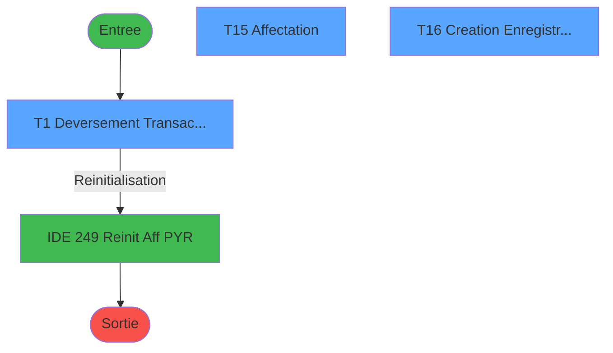
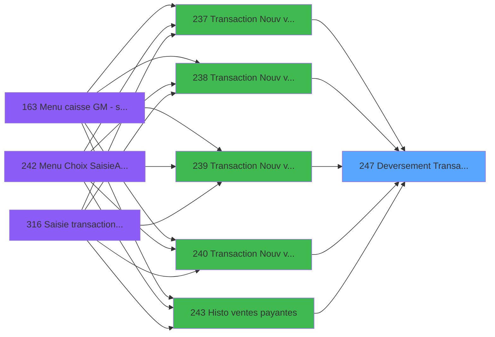

# ADH IDE 247 - Deversement Transaction

> **Analyse**: Phases 1-4 2026-01-30 09:43 -> 09:43 (8s) | Assemblage 09:43
> **Pipeline**: V7.2 Enrichi
> **Structure**: 4 onglets (Resume | Ecrans | Donnees | Connexions)

<!-- TAB:Resume -->

## 1. FICHE D'IDENTITE

| Attribut | Valeur |
|----------|--------|
| Projet | ADH |
| IDE Position | 247 |
| Nom Programme | Deversement Transaction |
| Fichier source | `Prg_247.xml` |
| Domaine metier | Ventes |
| Taches | 25 (3 ecrans visibles) |
| Tables modifiees | 11 |
| Programmes appeles | 1 |

## 2. DESCRIPTION FONCTIONNELLE

**Deversement Transaction** assure la gestion complete de ce processus, accessible depuis [Histo ventes payantes /PMS-623 (IDE 245)](ADH-IDE-245.md), [Transaction Nouv vente avec GP (IDE 237)](ADH-IDE-237.md), [Transaction Nouv vente PMS-584 (IDE 238)](ADH-IDE-238.md), [Transaction Nouv vente PMS-721 (IDE 239)](ADH-IDE-239.md), [Transaction Nouv vente PMS-710 (IDE 240)](ADH-IDE-240.md), [Histo ventes payantes (IDE 243)](ADH-IDE-243.md), [Histo ventes payantes /PMS-605 (IDE 244)](ADH-IDE-244.md), [Histo ventes Gratuités (IDE 253)](ADH-IDE-253.md), [Ventes Gratuites (IDE 305)](ADH-IDE-305.md), [Saisie transaction 154  N.U (IDE 307)](ADH-IDE-307.md), [Saisie transaction Nouv vente (IDE 310)](ADH-IDE-310.md), [Historique des ventes - Gratui (IDE 312)](ADH-IDE-312.md), [Ventes Gratuites (IDE 315)](ADH-IDE-315.md), [Historique des ventes P247 (IDE 318)](ADH-IDE-318.md), [Annulation Ventes Gratuites (IDE 319)](ADH-IDE-319.md).

Le flux de traitement s'organise en **5 blocs fonctionnels** :

- **Traitement** (10 taches) : traitements metier divers
- **Creation** (9 taches) : insertion d'enregistrements en base (mouvements, prestations)
- **Saisie** (4 taches) : ecrans de saisie utilisateur (formulaires, champs, donnees)
- **Transfert** (1 tache) : transferts de donnees entre modules ou deversements
- **Impression** (1 tache) : generation de tickets et documents

**Donnees modifiees** : 11 tables en ecriture (hebergement______heb, comptable_gratuite, compte_gm________cgm, compteurs________cpt, vente, vente_gratuite, comptage_caisse, valeur_credit_bar_defaut, Boo_ResultsRechercheHoraire, Table_1033, Table_1069).

**Logique metier** : 3 regles identifiees couvrant conditions metier.

Detail : phases du traitement

#### Phase 1 : Saisie (4 taches)

- **T1** - Deversement Transaction **[ECRAN]**
- **T11** - Vente VRL VSL
- **T12** - Compte ligne vente
- **T24** - create vente_assurance

#### Phase 2 : Creation (9 taches)

- **T2** - Creation d'un O.D
- **T3** - Creation d'un O.D
- **T4** - Creation d'un O.D
- **T5** - Creation d'un O.D
- **T7** - Creation d'un O.D
- **T8** - Creation d'un O.D
- **T9** - Creation d'un O.D
- **T14** - Creation d'un O.D
- **T16** - Creation Enregistrement Transf **[ECRAN]**

#### Phase 3 : Traitement (10 taches)

- **T6** - Maj Service
- **T10** - Maj Service
- **T15** - Affectation **[ECRAN]**
- **T17** - Maj hebergement Z
- **T19** - Màj compléments biking
- **T20** - Màj compléments biking
- **T21** - Maj LCO liberation
- **T22** - Maj heure liberation
- **T23** - check mail
- **T25** - (sans nom)

#### Phase 4 : Impression (1 tache)

- **T13** - Increment Num. Ticket(VRL/VSL)

#### Phase 5 : Transfert (1 tache)

- **T18** - Raz Affectation Transfert

#### Tables impactees

| Table | Operations | Role metier |
|-------|-----------|-------------|
| vente | R/**W**/L (5 usages) | Donnees de ventes |
| vente_gratuite | **W**/L (4 usages) | Donnees de ventes |
| hebergement______heb | **W**/L (3 usages) | Hebergement (chambres) |
| comptable_gratuite | **W**/L (3 usages) |  |
| Table_1033 | **W** (2 usages) |  |
| compte_gm________cgm | **W** (2 usages) | Comptes GM (generaux) |
| Boo_ResultsRechercheHoraire | R/**W** (2 usages) | Index de recherche |
| Table_1069 | **W** (1 usages) |  |
| comptage_caisse | **W** (1 usages) | Sessions de caisse |
| valeur_credit_bar_defaut | **W** (1 usages) |  |
| compteurs________cpt | **W** (1 usages) | Comptes GM (generaux) |

## 3. BLOCS FONCTIONNELS

### 3.1 Saisie (4 taches)

L'operateur saisit les donnees de la transaction via 1 ecran (Deversement Transaction).

---

#### T1 - Deversement Transaction [ECRAN]

**Role** : Ecran de saisie pour la transaction.
**Ecran** : 646 x 548 DLU (MDI) | [Voir mockup](#ecran-t1)

---

#### T11 - Vente VRL VSL

**Role** : Ecran de saisie pour la transaction.

---

#### T12 - Compte ligne vente

**Role** : Ecran de saisie pour la transaction.

---

#### T24 - create vente_assurance

**Role** : Ecran de saisie pour la transaction.

### 3.2 Creation (9 taches)

Insertion de nouveaux enregistrements en base.

---

#### T2 - Creation d'un O.D

**Role** : Insertion de donnees en base.

---

#### T3 - Creation d'un O.D

**Role** : Insertion de donnees en base.

---

#### T4 - Creation d'un O.D

**Role** : Insertion de donnees en base.

---

#### T5 - Creation d'un O.D

**Role** : Insertion de donnees en base.

---

#### T7 - Creation d'un O.D

**Role** : Insertion de donnees en base.

---

#### T8 - Creation d'un O.D

**Role** : Insertion de donnees en base.

---

#### T9 - Creation d'un O.D

**Role** : Insertion de donnees en base.

---

#### T14 - Creation d'un O.D

**Role** : Insertion de donnees en base.

---

#### T16 - Creation Enregistrement Transf [ECRAN]

**Role** : Insertion de donnees en base.
**Ecran** : 672 x 58 DLU | [Voir mockup](#ecran-t16)

### 3.3 Traitement (10 taches)

Traitements internes.

---

#### T6 - Maj Service

**Role** : Traitement interne.

---

#### T10 - Maj Service

**Role** : Traitement interne.

---

#### T15 - Affectation [ECRAN]

**Role** : Traitement interne.
**Ecran** : 584 x 253 DLU | [Voir mockup](#ecran-t15)

---

#### T17 - Maj hebergement Z

**Role** : Traitement interne.

---

#### T19 - Màj compléments biking

**Role** : Traitement interne.

---

#### T20 - Màj compléments biking

**Role** : Traitement interne.

---

#### T21 - Maj LCO liberation

**Role** : Traitement interne.

---

#### T22 - Maj heure liberation

**Role** : Traitement interne.

---

#### T23 - check mail

**Role** : Traitement interne.

---

#### T25 - (sans nom)

**Role** : Traitement interne.

### 3.4 Impression (1 tache)

Generation des documents et tickets.

---

#### T13 - Increment Num. Ticket(VRL/VSL)

**Role** : Generation de ticket ou document.

### 3.5 Transfert (1 tache)

Transfert de donnees entre modules.

---

#### T18 - Raz Affectation Transfert

**Role** : Transfert de donnees vers un autre module.

## 5. REGLES METIER

3 regles identifiees:

### Autres (3 regles)

#### [RM-001] Si Trim([AA])='OD' alors 'OD' sinon '')

| Element | Detail |
|---------|--------|
| **Condition** | `IF(Trim([AA])='OD','OD','')` |
| **Action** | Si Trim([AA])='OD' alors 'OD' sinon '') |

#### [RM-002] Si p.Annulation [B]='O' alors [EG]+(ABS([AZ])) sinon [EG]-(ABS([AZ])))

| Element | Detail |
|---------|--------|
| **Condition** | `IF(p.Annulation [B]='O',[EG]+(ABS([AZ])),[EG]-(ABS([AZ])))` |
| **Action** | Si p.Annulation [B]='O' alors [EG]+(ABS([AZ])) sinon [EG]-(ABS([AZ]))) |
| **Variables** | B (p.Annulation) |

#### [RM-003] Si [CN] alors [CQ] sinon v0.Date Encaissement [BC])

| Element | Detail |
|---------|--------|
| **Condition** | `IF([CN],[CQ],v0.Date Encaissement [BC])` |
| **Action** | Si [CN] alors [CQ] sinon v0.Date Encaissement [BC]) |
| **Variables** | BC (v0.Date Encaissement) |

## 6. CONTEXTE

- **Appele par**: [Histo ventes payantes /PMS-623 (IDE 245)](ADH-IDE-245.md), [Transaction Nouv vente avec GP (IDE 237)](ADH-IDE-237.md), [Transaction Nouv vente PMS-584 (IDE 238)](ADH-IDE-238.md), [Transaction Nouv vente PMS-721 (IDE 239)](ADH-IDE-239.md), [Transaction Nouv vente PMS-710 (IDE 240)](ADH-IDE-240.md), [Histo ventes payantes (IDE 243)](ADH-IDE-243.md), [Histo ventes payantes /PMS-605 (IDE 244)](ADH-IDE-244.md), [Histo ventes Gratuités (IDE 253)](ADH-IDE-253.md), [Ventes Gratuites (IDE 305)](ADH-IDE-305.md), [Saisie transaction 154  N.U (IDE 307)](ADH-IDE-307.md), [Saisie transaction Nouv vente (IDE 310)](ADH-IDE-310.md), [Historique des ventes - Gratui (IDE 312)](ADH-IDE-312.md), [Ventes Gratuites (IDE 315)](ADH-IDE-315.md), [Historique des ventes P247 (IDE 318)](ADH-IDE-318.md), [Annulation Ventes Gratuites (IDE 319)](ADH-IDE-319.md)
- **Appelle**: 1 programmes | **Tables**: 30 (W:11 R:6 L:21) | **Taches**: 25 | **Expressions**: 69

<!-- TAB:Ecrans -->

## 8. ECRANS

### 8.1 Forms visibles (3 / 25)

| # | Position | Tache | Nom | Type | Largeur | Hauteur | Bloc |
|---|----------|-------|-----|------|---------|---------|------|
| 1 | 247.1 | T1 | Deversement Transaction | MDI | 646 | 548 | Saisie |
| 2 | 247.2 | T15 | Affectation | Type0 | 584 | 253 | Traitement |
| 3 | 247.3 | T16 | Creation Enregistrement Transf | Type0 | 672 | 58 | Creation |

### 8.2 Mockups Ecrans

---

#### 247.1 - Deversement Transaction
**Tache** : [T1](#t1) | **Type** : MDI | **Dimensions** : 646 x 548 DLU
**Bloc** : Saisie | **Titre IDE** : Deversement Transaction

<!-- FORM-DATA:
{
    "width":  646,
    "controls":  [

                 ],
    "type":  "MDI",
    "height":  548,
    "taskId":  1
}
-->

---

#### 247.2 - Affectation
**Tache** : [T15](#t15) | **Type** : Type0 | **Dimensions** : 584 x 253 DLU
**Bloc** : Traitement | **Titre IDE** : Affectation

<!-- FORM-DATA:
{
    "width":  584,
    "controls":  [

                 ],
    "type":  "Type0",
    "height":  253,
    "taskId":  15
}
-->

---

#### 247.3 - Creation Enregistrement Transf
**Tache** : [T16](#t16) | **Type** : Type0 | **Dimensions** : 672 x 58 DLU
**Bloc** : Creation | **Titre IDE** : Creation Enregistrement Transf

<!-- FORM-DATA:
{
    "width":  672,
    "controls":  [

                 ],
    "type":  "Type0",
    "height":  58,
    "taskId":  16
}
-->

## 9. NAVIGATION

### 9.1 Enchainement des ecrans

**Detail par enchainement :**

| Depuis | Action | Vers | Retour |
|--------|--------|------|--------|
| Deversement Transaction | Reinitialisation | [Reinit Aff PYR (IDE 249)](ADH-IDE-249.md) | Retour ecran |

### 9.3 Structure hierarchique (25 taches)

- **247.1** [Deversement Transaction (T1)](#t1) **[ECRAN]** (MDI) 646x548 -> [mockup](#ecran-t1) *[Saisie]*
  - **247.1.1** [Vente VRL VSL (T11)](#t11)  
  - **247.1.2** [Compte ligne vente (T12)](#t12)  
  - **247.1.3** [create vente_assurance (T24)](#t24)  
- **247.2** [Creation d'un O.D (T2)](#t2)  (MDI) *[Creation]*
  - **247.2.1** [Creation d'un O.D (T3)](#t3)  (MDI)
  - **247.2.2** [Creation d'un O.D (T4)](#t4)  (MDI)
  - **247.2.3** [Creation d'un O.D (T5)](#t5)  (MDI)
  - **247.2.4** [Creation d'un O.D (T7)](#t7)  (MDI)
  - **247.2.5** [Creation d'un O.D (T8)](#t8)  (MDI)
  - **247.2.6** [Creation d'un O.D (T9)](#t9)  (MDI)
  - **247.2.7** [Creation d'un O.D (T14)](#t14)  (MDI)
  - **247.2.8** [Creation Enregistrement Transf (T16)](#t16) **[ECRAN]**  672x58 -> [mockup](#ecran-t16)
- **247.3** [Maj Service (T6)](#t6)   *[Traitement]*
  - **247.3.1** [Maj Service (T10)](#t10)  
  - **247.3.2** [Affectation (T15)](#t15) **[ECRAN]**  584x253 -> [mockup](#ecran-t15)
  - **247.3.3** [Maj hebergement Z (T17)](#t17)  
  - **247.3.4** [Màj compléments biking (T19)](#t19)  
  - **247.3.5** [Màj compléments biking (T20)](#t20)  
  - **247.3.6** [Maj LCO liberation (T21)](#t21)  
  - **247.3.7** [Maj heure liberation (T22)](#t22)  
  - **247.3.8** [check mail (T23)](#t23)  
  - **247.3.9** [(sans nom) (T25)](#t25)  
- **247.4** [Increment Num. Ticket(VRL/VSL) (T13)](#t13)   *[Impression]*
- **247.5** [Raz Affectation Transfert (T18)](#t18)   *[Transfert]*

<!-- TAB:Donnees -->

## 10. TABLES

### Tables utilisees (30)

| ID | Nom | Description | Type | R | W | L | Usages |
|----|-----|-------------|------|---|---|---|--------|
| 26 | comptes_speciaux_spc | Comptes GM (generaux) | DB | R |   |   | 1 |
| 30 | gm-recherche_____gmr | Index de recherche | DB |   |   | L | 1 |
| 31 | gm-complet_______gmc |  | DB |   |   | L | 1 |
| 34 | hebergement______heb | Hebergement (chambres) | DB |   | **W** | L | 3 |
| 38 | comptable_gratuite |  | DB |   | **W** | L | 3 |
| 40 | comptable________cte |  | DB |   |   | L | 3 |
| 47 | compte_gm________cgm | Comptes GM (generaux) | DB |   | **W** |   | 2 |
| 65 | comptes_recette__cre | Comptes GM (generaux) | DB | R |   | L | 7 |
| 67 | tables___________tab |  | DB |   |   | L | 2 |
| 68 | compteurs________cpt | Comptes GM (generaux) | DB |   | **W** |   | 1 |
| 77 | articles_________art | Articles et stock | DB |   |   | L | 4 |
| 89 | moyen_paiement___mop |  | DB |   |   | L | 3 |
| 113 | tables_village |  | DB |   |   | L | 1 |
| 263 | vente | Donnees de ventes | DB | R | **W** | L | 5 |
| 264 | vente_gratuite | Donnees de ventes | DB |   | **W** | L | 4 |
| 268 | cc_total_par_type |  | DB |   |   | L | 1 |
| 271 | cc_total |  | DB |   |   | L | 1 |
| 382 | pv_discount_reasons |  | DB |   |   | L | 1 |
| 473 | comptage_caisse | Sessions de caisse | TMP |   | **W** |   | 1 |
| 596 | tempo_ecran_police | Table temporaire ecran | TMP |   |   | L | 2 |
| 804 | valeur_credit_bar_defaut |  | DB |   | **W** |   | 1 |
| 839 | ##_pv_compta_dat |  | DB |   |   | L | 1 |
| 847 | stat_lieu_vente_date | Statistiques point de vente | TMP | R |   | L | 7 |
| 899 | Boo_ResultsRechercheHoraire | Index de recherche | DB | R | **W** |   | 2 |
| 933 | taxe_add_vente | Donnees de ventes | DB |   |   | L | 1 |
| 945 | Table_945 |  | MEM |   |   | L | 2 |
| 980 | Table_980 |  | MEM |   |   | L | 1 |
| 1033 | Table_1033 |  | MEM |   | **W** |   | 2 |
| 1037 | Table_1037 |  | MEM | R |   |   | 1 |
| 1069 | Table_1069 |  | MEM |   | **W** |   | 1 |

### Colonnes par table

Table 26 - comptes_speciaux_spc (R) - 1 usages

*Colonnes accessibles via outils MCP (`magic_get_line`)*

Table 34 - hebergement______heb (**W**/L) - 3 usages

*Colonnes accessibles via outils MCP (`magic_get_line`)*

Table 38 - comptable_gratuite (**W**/L) - 3 usages

*Colonnes accessibles via outils MCP (`magic_get_line`)*

Table 47 - compte_gm________cgm (**W**) - 2 usages

| Lettre | Variable | Acces | Type | Utilisee |
|--------|----------|-------|------|----------|
| C | pi.Compte | W | Numeric | **OUI** |
| D | p.Solde Du Compte | W | Numeric | **OUI** |
| S | V.Est un compte special ? | W | Logical | **OUI** |

Table 65 - comptes_recette__cre (R/L) - 7 usages

*Colonnes accessibles via outils MCP (`magic_get_line`)*

Table 68 - compteurs________cpt (**W**) - 1 usages

*Colonnes accessibles via outils MCP (`magic_get_line`)*

Table 263 - vente (R/**W**/L) - 5 usages

| Lettre | Variable | Acces | Type | Utilisee |
|--------|----------|-------|------|----------|
| A | Retour Vente gratuite | W | Logical | **OUI** |
| A | i.OD/VENTE | W | Unicode | **OUI** |
| A | i.OD/VENTE | W | Unicode | **OUI** |
| BB | v.0.ID_Ligne_Vente_263 | W | Numeric | **OUI** |
| BE | v.ligne de vente ass 0 soucis? | W | Logical | **OUI** |

Table 264 - vente_gratuite (**W**/L) - 4 usages

*Colonnes accessibles via outils MCP (`magic_get_line`)*

Table 473 - comptage_caisse (**W**) - 1 usages

*Colonnes accessibles via outils MCP (`magic_get_line`)*

Table 804 - valeur_credit_bar_defaut (**W**) - 1 usages

*Colonnes accessibles via outils MCP (`magic_get_line`)*

Table 847 - stat_lieu_vente_date (R/L) - 7 usages

*Colonnes accessibles via outils MCP (`magic_get_line`)*

Table 899 - Boo_ResultsRechercheHoraire (R/**W**) - 2 usages

*Colonnes accessibles via outils MCP (`magic_get_line`)*

Table 1033 - Table_1033 (**W**) - 2 usages

| Lettre | Variable | Acces | Type | Utilisee |
|--------|----------|-------|------|----------|
| A | P. table_vente | W | Unicode | **OUI** |
| B | P. id_table_vente | W | Numeric | **OUI** |
| C | p.Date Comptable | W | Date | **OUI** |

Table 1037 - Table_1037 (R) - 1 usages

*Colonnes accessibles via outils MCP (`magic_get_line`)*

Table 1069 - Table_1069 (**W**) - 1 usages

*Colonnes accessibles via outils MCP (`magic_get_line`)*

## 11. VARIABLES

### 11.1 Variables de session (14)

Variables persistantes pendant toute la session.

| Lettre | Nom | Type | Usage dans |
|--------|-----|------|-----------|
| P | v.Lien Article | Logical | 1x refs |
| Q | v.Type article | Unicode | 1x refs |
| R | v.adresse-mail-0-soucis | Unicode | 1x refs |
| S | V.Est un compte special ? | Logical | - |
| T | v Lien Mutli paiement | Logical | - |
| U | V.montant remise | Numeric | - |
| V | V.Nb reglement | Numeric | - |
| W | V.id ligne annulation | Numeric | 1x refs |
| X | v.retour lien LCO | Logical | - |
| BA | v.0.ID_Ligne_OD_40 | Numeric | - |
| BB | v.0.ID_Ligne_Vente_263 | Numeric | - |
| BE | v.ligne de vente ass 0 soucis? | Logical | - |
| BF | v. envoyer à galaxy | Logical | - |
| BG | v. no_order_galaxy | Unicode | 12x refs |

### 11.2 Autres (19)

Variables diverses.

| Lettre | Nom | Type | Usage dans |
|--------|-----|------|-----------|
| A | p.Gratuite *NON Utilisé* | Alpha | - |
| B | p.Annulation | Alpha | 7x refs |
| C | p.Date Comptable | Date | - |
| D | p.Solde Du Compte | Numeric | - |
| E | p.Transaction TPE validee | Logical | - |
| F | P.i.Id dossier PMS | Alpha | - |
| G | P.i.Id dossier AXIS | Alpha | - |
| H | Pi.Num Autorisation | Alpha | - |
| I | P.o.Deversement OK | Logical | - |
| J | P.i.Room | Unicode | - |
| K | P.i.Operateur | Unicode | - |
| L | Po.N° Ticket OD | Numeric | - |
| M | Po.N° Ticket Autres MoyPaie | Numeric | - |
| N | P.i.Token Id | Unicode | 1x refs |
| O | P.i.Transaction Id | Unicode | 2x refs |
| Y | v0.NoTicket OD | Numeric | - |
| Z | v0.NoTicket autre reg | Numeric | - |
| BC | v0.Date Encaissement | Date | 5x refs |
| BD | v0.Heure Encaissement | Time | - |

Toutes les 33 variables (liste complete)

| Cat | Lettre | Nom Variable | Type |
|-----|--------|--------------|------|
| V. | **P** | v.Lien Article | Logical |
| V. | **Q** | v.Type article | Unicode |
| V. | **R** | v.adresse-mail-0-soucis | Unicode |
| V. | **S** | V.Est un compte special ? | Logical |
| V. | **T** | v Lien Mutli paiement | Logical |
| V. | **U** | V.montant remise | Numeric |
| V. | **V** | V.Nb reglement | Numeric |
| V. | **W** | V.id ligne annulation | Numeric |
| V. | **X** | v.retour lien LCO | Logical |
| V. | **BA** | v.0.ID_Ligne_OD_40 | Numeric |
| V. | **BB** | v.0.ID_Ligne_Vente_263 | Numeric |
| V. | **BE** | v.ligne de vente ass 0 soucis? | Logical |
| V. | **BF** | v. envoyer à galaxy | Logical |
| V. | **BG** | v. no_order_galaxy | Unicode |
| Autre | **A** | p.Gratuite *NON Utilisé* | Alpha |
| Autre | **B** | p.Annulation | Alpha |
| Autre | **C** | p.Date Comptable | Date |
| Autre | **D** | p.Solde Du Compte | Numeric |
| Autre | **E** | p.Transaction TPE validee | Logical |
| Autre | **F** | P.i.Id dossier PMS | Alpha |
| Autre | **G** | P.i.Id dossier AXIS | Alpha |
| Autre | **H** | Pi.Num Autorisation | Alpha |
| Autre | **I** | P.o.Deversement OK | Logical |
| Autre | **J** | P.i.Room | Unicode |
| Autre | **K** | P.i.Operateur | Unicode |
| Autre | **L** | Po.N° Ticket OD | Numeric |
| Autre | **M** | Po.N° Ticket Autres MoyPaie | Numeric |
| Autre | **N** | P.i.Token Id | Unicode |
| Autre | **O** | P.i.Transaction Id | Unicode |
| Autre | **Y** | v0.NoTicket OD | Numeric |
| Autre | **Z** | v0.NoTicket autre reg | Numeric |
| Autre | **BC** | v0.Date Encaissement | Date |
| Autre | **BD** | v0.Heure Encaissement | Time |

## 12. EXPRESSIONS

**69 / 69 expressions decodees (100%)**

### 12.1 Repartition par type

| Type | Expressions | Regles |
|------|-------------|--------|
| CALCULATION | 1 | 0 |
| CONDITION | 22 | 3 |
| CONSTANTE | 8 | 0 |
| DATE | 1 | 0 |
| OTHER | 28 | 0 |
| CAST_LOGIQUE | 2 | 0 |
| NEGATION | 4 | 0 |
| REFERENCE_VG | 2 | 0 |
| FORMAT | 1 | 0 |

### 12.2 Expressions cles par type

#### CALCULATION (1 expressions)

| Type | IDE | Expression | Regle |
|------|-----|------------|-------|
| CALCULATION | 35 | `[EU]-[AZ]` | - |

#### CONDITION (22 expressions)

| Type | IDE | Expression | Regle |
|------|-----|------------|-------|
| CONDITION | 51 | `IF([CN],[CQ],v0.Date Encaissement [BC])` | [RM-003](#rm-RM-003) |
| CONDITION | 19 | `IF(Trim([AA])='OD','OD','')` | [RM-001](#rm-RM-001) |
| CONDITION | 25 | `IF(p.Annulation [B]='O',[EG]+(ABS([AZ])),[EG]-(ABS([AZ])))` | [RM-002](#rm-RM-002) |
| CONDITION | 2 | `(NOT (v. no_order_galaxy [BG]) OR (Trim(v0.Date Encaissement [BC])='PYR' AND [AG]=0)) AND [AA]<>'OD'` | - |
| CONDITION | 1 | `[AA]='OD' AND NOT [AW] AND (NOT v. no_order_galaxy [BG] OR Trim(v0.Date Encaissement [BC])='PYR' AND [AG]=0)` | - |
| ... | | *+17 autres* | |

#### CONSTANTE (8 expressions)

| Type | IDE | Expression | Regle |
|------|-----|------------|-------|
| CONSTANTE | 60 | `'ADH'` | - |
| CONSTANTE | 49 | `'LCO'` | - |
| CONSTANTE | 62 | `'V'` | - |
| CONSTANTE | 61 | `'O'` | - |
| CONSTANTE | 12 | `'A'` | - |
| ... | | *+3 autres* | |

#### DATE (1 expressions)

| Type | IDE | Expression | Regle |
|------|-----|------------|-------|
| DATE | 27 | `Date()` | - |

#### OTHER (28 expressions)

| Type | IDE | Expression | Regle |
|------|-----|------------|-------|
| OTHER | 50 | `VG36 AND [EV]` | - |
| OTHER | 52 | `[FE]` | - |
| OTHER | 57 | `[FB]` | - |
| OTHER | 48 | `[CT]` | - |
| OTHER | 39 | `[BK]` | - |
| ... | | *+23 autres* | |

#### CAST_LOGIQUE (2 expressions)

| Type | IDE | Expression | Regle |
|------|-----|------------|-------|
| CAST_LOGIQUE | 54 | `'FALSE'LOG` | - |
| CAST_LOGIQUE | 17 | `'TRUE'LOG` | - |

#### NEGATION (4 expressions)

| Type | IDE | Expression | Regle |
|------|-----|------------|-------|
| NEGATION | 37 | `NOT VG78` | - |
| NEGATION | 41 | `NOT ExpCalc('40'EXP)` | - |
| NEGATION | 23 | `NOT (v. no_order_galaxy [BG]) OR [AA]='OD' AND NOT [AW] AND NOT (v. no_order_galaxy [BG])` | - |
| NEGATION | 32 | `NOT v. no_order_galaxy [BG]` | - |

#### REFERENCE_VG (2 expressions)

| Type | IDE | Expression | Regle |
|------|-----|------------|-------|
| REFERENCE_VG | 59 | `VG93` | - |
| REFERENCE_VG | 38 | `VG78` | - |

#### FORMAT (1 expressions)

| Type | IDE | Expression | Regle |
|------|-----|------------|-------|
| FORMAT | 69 | `'O'&Trim(Str([FD],'8'))` | - |

### 12.3 Toutes les expressions (69)

Voir les 69 expressions

#### CALCULATION (1)

| IDE | Expression Decodee |
|-----|-------------------|
| 35 | `[EU]-[AZ]` |

#### CONDITION (22)

| IDE | Expression Decodee |
|-----|-------------------|
| 40 | `VG87 AND [CH]<>'00/00/0000'DATE` |
| 19 | `IF(Trim([AA])='OD','OD','')` |
| 25 | `IF(p.Annulation [B]='O',[EG]+(ABS([AZ])),[EG]-(ABS([AZ])))` |
| 26 | `IF(p.Annulation [B]='O',[EK]+(ABS([AZ])),[EK]-(ABS([AZ])))` |
| 51 | `IF([CN],[CQ],v0.Date Encaissement [BC])` |
| 4 | `[AA]='OD' AND NOT [AW] AND v. no_order_galaxy [BG]` |
| 7 | `[CT]='VSL'` |
| 14 | `V.id ligne annulation [W]<>0 OR [AZ]<>0 OR v0.Date Encaissement [BC]='PYR'` |
| 29 | `[AY] AND NOT(v. no_order_galaxy [BG]) AND [BH]='GP'` |
| 34 | `[AY] AND NOT(v. no_order_galaxy [BG]) AND [BH]='RC'` |
| 46 | `[FE]<>0` |
| 47 | `[FF]<>0` |
| 53 | `[DJ]='' AND [FI]` |
| 55 | `[CQ]='INS' AND VG93` |
| 56 | `[DJ]<>''` |
| 1 | `[AA]='OD' AND NOT [AW] AND (NOT v. no_order_galaxy [BG] OR Trim(v0.Date Encaissement [BC])='PYR' AND [AG]=0)` |
| 2 | `(NOT (v. no_order_galaxy [BG]) OR (Trim(v0.Date Encaissement [BC])='PYR' AND [AG]=0)) AND [AA]<>'OD'` |
| 18 | `Trim([AA])='OD' AND p.Annulation [B]='O' AND NOT v. no_order_galaxy [BG]` |
| 22 | `Trim([AA])<>'OD' AND p.Annulation [B]='O' AND NOT v. no_order_galaxy [BG]` |
| 30 | `Trim([AA])='OD' AND p.Annulation [B]='O' AND v. no_order_galaxy [BG]` |
| 31 | `Trim([AA])<>'OD' AND p.Annulation [B]='O' AND v. no_order_galaxy [BG]` |
| 36 | `Trim(v0.Date Encaissement [BC])='PYR' AND p.Annulation [B]='O'` |

#### CONSTANTE (8)

| IDE | Expression Decodee |
|-----|-------------------|
| 6 | `'99'` |
| 12 | `'A'` |
| 42 | `'O'` |
| 44 | `'V'` |
| 49 | `'LCO'` |
| 60 | `'ADH'` |
| 61 | `'O'` |
| 62 | `'V'` |

#### DATE (1)

| IDE | Expression Decodee |
|-----|-------------------|
| 27 | `Date()` |

#### OTHER (28)

| IDE | Expression Decodee |
|-----|-------------------|
| 3 | `v. no_order_galaxy [BG]` |
| 5 | `v.adresse-mail-0-soucis [R]` |
| 8 | `P.i.Token Id [N]` |
| 9 | `P.i.Transaction Id [O]` |
| 10 | `v.Lien Article [P]` |
| 11 | `[AC]` |
| 13 | `VG7 AND IN ( [CT] ,'VRL','VSL')` |
| 15 | `P.i.Transaction Id [O]` |
| 16 | `[AA]` |
| 20 | `[DU]` |
| 21 | `[DW]` |
| 24 | `[AV]` |
| 28 | `Time()` |
| 33 | `v.Type article [Q]` |
| 39 | `[BK]` |
| 43 | `[FE]` |
| 45 | `[FF]` |
| 48 | `[CT]` |
| 50 | `VG36 AND [EV]` |
| 52 | `[FE]` |
| 57 | `[FB]` |
| 58 | `[DJ]` |
| 63 | `[FE]` |
| 64 | `[FF]` |
| 65 | `[FJ]` |
| 66 | `[FK]` |
| 67 | `VG93 AND [FI]` |
| 68 | `VG117 AND [FO]` |

#### CAST_LOGIQUE (2)

| IDE | Expression Decodee |
|-----|-------------------|
| 17 | `'TRUE'LOG` |
| 54 | `'FALSE'LOG` |

#### NEGATION (4)

| IDE | Expression Decodee |
|-----|-------------------|
| 23 | `NOT (v. no_order_galaxy [BG]) OR [AA]='OD' AND NOT [AW] AND NOT (v. no_order_galaxy [BG])` |
| 32 | `NOT v. no_order_galaxy [BG]` |
| 37 | `NOT VG78` |
| 41 | `NOT ExpCalc('40'EXP)` |

#### REFERENCE_VG (2)

| IDE | Expression Decodee |
|-----|-------------------|
| 38 | `VG78` |
| 59 | `VG93` |

#### FORMAT (1)

| IDE | Expression Decodee |
|-----|-------------------|
| 69 | `'O'&Trim(Str([FD],'8'))` |

<!-- TAB:Connexions -->

## 13. GRAPHE D'APPELS

### 13.1 Chaine depuis Main (Callers)

Main -> ... -> [Histo ventes payantes /PMS-623 (IDE 245)](ADH-IDE-245.md) -> **Deversement Transaction (IDE 247)**

Main -> ... -> [Transaction Nouv vente avec GP (IDE 237)](ADH-IDE-237.md) -> **Deversement Transaction (IDE 247)**

Main -> ... -> [Transaction Nouv vente PMS-584 (IDE 238)](ADH-IDE-238.md) -> **Deversement Transaction (IDE 247)**

Main -> ... -> [Transaction Nouv vente PMS-721 (IDE 239)](ADH-IDE-239.md) -> **Deversement Transaction (IDE 247)**

Main -> ... -> [Transaction Nouv vente PMS-710 (IDE 240)](ADH-IDE-240.md) -> **Deversement Transaction (IDE 247)**

Main -> ... -> [Histo ventes payantes (IDE 243)](ADH-IDE-243.md) -> **Deversement Transaction (IDE 247)**

Main -> ... -> [Histo ventes payantes /PMS-605 (IDE 244)](ADH-IDE-244.md) -> **Deversement Transaction (IDE 247)**

Main -> ... -> [Histo ventes Gratuités (IDE 253)](ADH-IDE-253.md) -> **Deversement Transaction (IDE 247)**

Main -> ... -> [Ventes Gratuites (IDE 305)](ADH-IDE-305.md) -> **Deversement Transaction (IDE 247)**

Main -> ... -> [Saisie transaction 154  N.U (IDE 307)](ADH-IDE-307.md) -> **Deversement Transaction (IDE 247)**

Main -> ... -> [Saisie transaction Nouv vente (IDE 310)](ADH-IDE-310.md) -> **Deversement Transaction (IDE 247)**

Main -> ... -> [Historique des ventes - Gratui (IDE 312)](ADH-IDE-312.md) -> **Deversement Transaction (IDE 247)**

Main -> ... -> [Ventes Gratuites (IDE 315)](ADH-IDE-315.md) -> **Deversement Transaction (IDE 247)**

Main -> ... -> [Historique des ventes P247 (IDE 318)](ADH-IDE-318.md) -> **Deversement Transaction (IDE 247)**

Main -> ... -> [Annulation Ventes Gratuites (IDE 319)](ADH-IDE-319.md) -> **Deversement Transaction (IDE 247)**

### 13.2 Callers

| IDE | Nom Programme | Nb Appels |
|-----|---------------|-----------|
| [245](ADH-IDE-245.md) | Histo ventes payantes /PMS-623 | 2 |
| [237](ADH-IDE-237.md) | Transaction Nouv vente avec GP | 1 |
| [238](ADH-IDE-238.md) | Transaction Nouv vente PMS-584 | 1 |
| [239](ADH-IDE-239.md) | Transaction Nouv vente PMS-721 | 1 |
| [240](ADH-IDE-240.md) | Transaction Nouv vente PMS-710 | 1 |
| [243](ADH-IDE-243.md) | Histo ventes payantes | 1 |
| [244](ADH-IDE-244.md) | Histo ventes payantes /PMS-605 | 1 |
| [253](ADH-IDE-253.md) | Histo ventes Gratuités | 1 |
| [305](ADH-IDE-305.md) | Ventes Gratuites | 1 |
| [307](ADH-IDE-307.md) | Saisie transaction 154  N.U | 1 |
| [310](ADH-IDE-310.md) | Saisie transaction Nouv vente | 1 |
| [312](ADH-IDE-312.md) | Historique des ventes - Gratui | 1 |
| [315](ADH-IDE-315.md) | Ventes Gratuites | 1 |
| [318](ADH-IDE-318.md) | Historique des ventes P247 | 1 |
| [319](ADH-IDE-319.md) | Annulation Ventes Gratuites | 1 |

### 13.3 Callees (programmes appeles)

### 13.4 Detail Callees avec contexte

| IDE | Nom Programme | Appels | Contexte |
|-----|---------------|--------|----------|
| [249](ADH-IDE-249.md) | Reinit Aff PYR | 1 | Reinitialisation |

## 14. RECOMMANDATIONS MIGRATION

### 14.1 Profil du programme

| Metrique | Valeur | Impact migration |
|----------|--------|-----------------|
| Lignes de logique | 1467 | Programme volumineux |
| Expressions | 69 | Logique moderee |
| Tables WRITE | 11 | Fort impact donnees |
| Sous-programmes | 1 | Peu de dependances |
| Ecrans visibles | 3 | Quelques ecrans |
| Code desactive | 0% (0 / 1467) | Code sain |
| Regles metier | 3 | Quelques regles a preserver |

### 14.2 Plan de migration par bloc

#### Saisie (4 taches: 1 ecran, 3 traitements)

- **Strategie** : Formulaire React/Blazor avec validation Zod/FluentValidation.
- Reproduire 1 ecran : Deversement Transaction
- Validation temps reel cote client + serveur

#### Creation (9 taches: 1 ecran, 8 traitements)

- **Strategie** : Repository pattern avec Entity Framework Core.
- Insertion via `IRepository<T>.CreateAsync()`

#### Traitement (10 taches: 1 ecran, 9 traitements)

- Traitement standard a migrer

#### Impression (1 tache: 0 ecran, 1 traitement)

- **Strategie** : Templates HTML -> PDF via wkhtmltopdf ou Puppeteer.
- `PrintService` injectable avec choix imprimante

#### Transfert (1 tache: 0 ecran, 1 traitement)

- **Strategie** : Service `ITransfertService` avec logique de deversement.

### 14.3 Dependances critiques

| Dependance | Type | Appels | Impact |
|------------|------|--------|--------|
| hebergement______heb | Table WRITE (Database) | 2x | Schema + repository |
| comptable_gratuite | Table WRITE (Database) | 2x | Schema + repository |
| compte_gm________cgm | Table WRITE (Database) | 2x | Schema + repository |
| compteurs________cpt | Table WRITE (Database) | 1x | Schema + repository |
| vente | Table WRITE (Database) | 1x | Schema + repository |
| vente_gratuite | Table WRITE (Database) | 1x | Schema + repository |
| comptage_caisse | Table WRITE (Temp) | 1x | Schema + repository |
| valeur_credit_bar_defaut | Table WRITE (Database) | 1x | Schema + repository |
| Boo_ResultsRechercheHoraire | Table WRITE (Database) | 1x | Schema + repository |
| Table_1033 | Table WRITE (Memory) | 2x | Schema + repository |
| Table_1069 | Table WRITE (Memory) | 1x | Schema + repository |
| [Reinit Aff PYR (IDE 249)](ADH-IDE-249.md) | Sous-programme | 1x | Normale - Reinitialisation |

---
*Spec DETAILED generee par Pipeline V7.2 - 2026-01-30 09:43*
