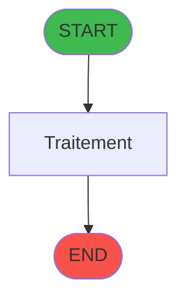
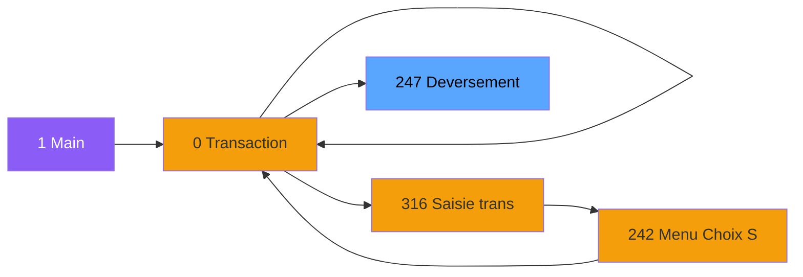

# ADH IDE 247 - Deversement Transaction

> **Version spec**: 3.5
> **Analyse**: 2026-01-27 17:57
> **Source**: `Prg_XXX.xml`

---

<!-- TAB:Fonctionnel -->

## SPECIFICATION FONCTIONNELLE

### 1.1 Objectif metier

| Element | Description |
|---------|-------------|
| **Qui** | Operateur |
| **Quoi** | Deversement Transaction
 |
| **Pourquoi** | A documenter |
| **Declencheur** | A identifier |

### 1.2 Regles metier

| Code | Regle | Condition |
|------|-------|-----------|
| RM-001 | A documenter | - |

### 1.3 Flux utilisateur

1. Demarrage programme
2. Traitement principal
3. Fin programme

### 1.4 Cas d'erreur

| Erreur | Comportement |
|--------|--------------|
| - | A documenter |

---

<!-- TAB:Technique -->

## SPECIFICATION TECHNIQUE

### 2.1 Identification

| Attribut | Valeur |
|----------|--------|
| **Format IDE** | ADH IDE 247 |
| **Description** | Deversement Transaction
 |
| **Module** | ADH |

### 2.2 Tables

| # | Nom logique | Nom physique | Acces | Usage |
|---|-------------|--------------|-------|-------|
| 26 | comptes_speciaux_spc | `cafil004_dat` | R | 1x |
| 30 | gm-recherche_____gmr | `cafil008_dat` | L | 1x |
| 31 | gm-complet_______gmc | `cafil009_dat` | L | 1x |
| 34 | hebergement______heb | `cafil012_dat` | L | 1x |
| 34 | hebergement______heb | `cafil012_dat` | **W** | 2x |
| 38 | comptable_gratuite | `cafil016_dat` | L | 1x |
| 38 | comptable_gratuite | `cafil016_dat` | **W** | 2x |
| 40 | comptable________cte | `cafil018_dat` | L | 3x |
| 47 | compte_gm________cgm | `cafil025_dat` | **W** | 2x |
| 65 | comptes_recette__cre | `cafil043_dat` | L | 3x |
| 65 | comptes_recette__cre | `cafil043_dat` | R | 4x |
| 67 | tables___________tab | `cafil045_dat` | L | 2x |
| 68 | compteurs________cpt | `cafil046_dat` | **W** | 1x |
| 77 | articles_________art | `cafil055_dat` | L | 4x |
| 89 | moyen_paiement___mop | `cafil067_dat` | L | 3x |
| 113 | tables_village | `cafil091_dat` | L | 1x |
| 263 | vente | `caisse_vente` | L | 3x |
| 263 | vente | `caisse_vente` | R | 1x |
| 263 | vente | `caisse_vente` | **W** | 1x |
| 264 | vente_gratuite | `caisse_vente_gratuite` | L | 3x |
| 264 | vente_gratuite | `caisse_vente_gratuite` | **W** | 1x |
| 268 | cc_total_par_type | `ccpartyp` | L | 1x |
| 271 | cc_total | `cctotal` | L | 1x |
| 382 | pv_discount_reasons | `pv_discountlist_dat` | L | 1x |
| 473 | comptage_caisse | `%club_user%_caisse_compcais` | **W** | 1x |
| 596 | tempo_ecran_police | `%club_user%tmp_ecrpolice_dat` | L | 2x |
| 804 | valeur_credit_bar_defaut | `valeur_credit_bar_defaut` | **W** | 1x |
| 839 | ##_pv_compta_dat | `##%club_user%_%term%_pv_account` | L | 1x |
| 847 | stat_lieu_vente_date | `%club_user%_stat_lieu_vente_date` | L | 6x |
| 847 | stat_lieu_vente_date | `%club_user%_stat_lieu_vente_date` | R | 1x |
| 899 | Boo_ResultsRechercheHoraire | `Boo_ResultsRechercheHoraire` | R | 1x |
| 899 | Boo_ResultsRechercheHoraire | `Boo_ResultsRechercheHoraire` | **W** | 1x |
| 933 | taxe_add_vente | `taxe_add_vente` | L | 1x |
| 945 | Table_945 | - | L | 2x |
| 980 | Table_980 | - | L | 1x |
| 1033 | Table_1033 | - | **W** | 2x |
| 1037 | Table_1037 | - | R | 1x |
| 1069 | Table_1069 | - | **W** | 1x |
### 2.3 Parametres d'entree

| Variable | Nom | Type | Picture |
|----------|-----|------|---------|
| - | Aucun parametre | - | - |
### 2.4 Algorigramme

### 2.5 Expressions cles

| IDE | Expression | Commentaire |
|-----|------------|-------------|
| 1 | `{0,27}='OD' AND NOT {0,49} AND (NOT {0,59} OR T...` | - |
| 2 | `(NOT ({0,59}) OR (Trim({0,55})='PYR' AND {0,33}...` | - |
| 3 | `{0,59}` | - |
| 4 | `{0,27}='OD' AND NOT {0,49} AND {0,59}` | - |
| 5 | `{0,18}` | - |
| 6 | `'99'` | - |
| 7 | `{0,98}='VSL'` | - |
| 8 | `{0,14}` | - |
| 9 | `{0,15}` | - |
| 10 | `{0,16}` | - |
| 11 | `{0,29}` | - |
| 12 | `'A'` | - |
| 13 | `{32768,7} AND IN ( {0,98} ,'VRL','VSL')` | - |
| 14 | `{0,23}<>0 OR {0,52}<>0 OR {0,55}='PYR'` | - |
| 15 | `{0,15}` | - |
| 16 | `{0,27}` | - |
| 17 | `'TRUE'LOG` | - |
| 18 | `Trim({0,27})='OD' AND {0,2}='O' AND NOT {0,59}` | - |
| 19 | `IF(Trim({0,27})='OD','OD','')` | - |
| 20 | `{0,125}` | - |

> **Total**: 69 expressions (affichees: 20)
### 2.6 Variables importantes

### 2.7 Statistiques

| Metrique | Valeur |
|----------|--------|
| **Taches** | 25 |
| **Lignes logique** | 1467 |
| **Lignes desactivees** | 0 |
---

<!-- TAB:Cartographie -->

## CARTOGRAPHIE APPLICATIVE

### 3.1 Chaine d'appels depuis Main

### 3.2 Callers directs

| IDE | Programme | Nb appels |
|-----|-----------|-----------|
| 245 | Histo ventes payantes /PMS-623 | 2 |
| 237 | Transaction Nouv vente avec GP | 1 |
| 238 | Transaction Nouv vente PMS-584 | 1 |
| 239 | Transaction Nouv vente PMS-721 | 1 |
| 240 | Transaction Nouv vente PMS-710 | 1 |
| 243 | Histo ventes payantes | 1 |
| 244 | Histo ventes payantes /PMS-605 | 1 |
| 253 | Histo ventes Gratuités | 1 |
| 305 | Ventes Gratuites | 1 |
| 307 | Saisie transaction 154  N.U | 1 |
| 310 | Saisie transaction Nouv vente | 1 |
| 312 | Historique des ventes - Gratui | 1 |
| 315 | Ventes Gratuites | 1 |
| 318 | Historique des ventes P247 | 1 |
| 319 | Annulation Ventes Gratuites | 1 |
### 3.3 Callees

| Niv | IDE | Programme | Nb appels |
|-----|-----|-----------|-----------|
| 1 | 249 | Reinit Aff PYR | 1 |
### 3.4 Verification orphelin

| Critere | Resultat |
|---------|----------|
| Callers actifs | A verifier |
| **Conclusion** | A analyser |

---

## HISTORIQUE

| Date | Action | Auteur |
|------|--------|--------|
| 2026-01-27 20:24 | **DATA V2** - Tables reelles, Expressions, Stats, CallChain | Script |
| 2026-01-27 19:50 | **DATA POPULATED** - Tables, Callgraph (69 expr) | Script |
| 2026-01-27 17:57 | **Upgrade V3.5** - TAB markers, Mermaid | Claude |

---

*Specification V3.5 - Format avec TAB markers et Mermaid*
