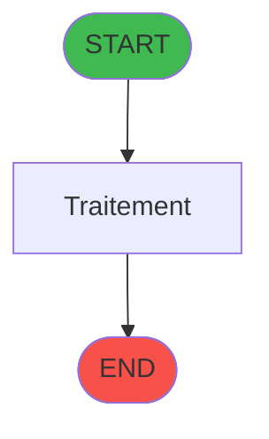
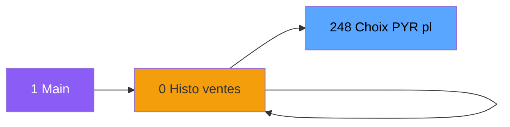
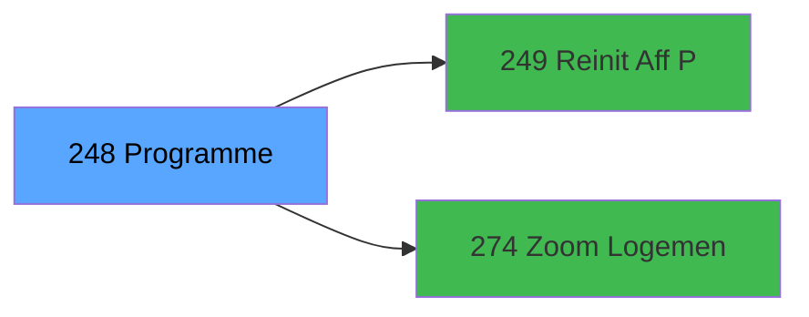

# ADH IDE 248 - Choix PYR (plusieurs chambres)

> **Version spec**: 3.5
> **Analyse**: 2026-01-27 17:57
> **Source**: `Prg_XXX.xml`

---

<!-- TAB:Fonctionnel -->

## SPECIFICATION FONCTIONNELLE

### 1.1 Objectif metier

| Element | Description |
|---------|-------------|
| **Qui** | Operateur |
| **Quoi** | Choix PYR (plusieurs chambres)
 |
| **Pourquoi** | A documenter |
| **Declencheur** | A identifier |

### 1.2 Regles metier

| Code | Regle | Condition |
|------|-------|-----------|
| RM-001 | A documenter | - |

### 1.3 Flux utilisateur

1. Demarrage programme
2. Traitement principal
3. Fin programme

### 1.4 Cas d'erreur

| Erreur | Comportement |
|--------|--------------|
| - | A documenter |

---

<!-- TAB:Technique -->

## SPECIFICATION TECHNIQUE

### 2.1 Identification

| Attribut | Valeur |
|----------|--------|
| **Format IDE** | ADH IDE 248 |
| **Description** | Choix PYR (plusieurs chambres)
 |
| **Module** | ADH |

### 2.2 Tables

| # | Nom logique | Nom physique | Acces | Usage |
|---|-------------|--------------|-------|-------|
| 30 | gm-recherche_____gmr | `cafil008_dat` | R | 1x |
| 34 | hebergement______heb | `cafil012_dat` | R | 1x |
| 34 | hebergement______heb | `cafil012_dat` | **W** | 1x |
| 36 | client_gm | `cafil014_dat` | L | 1x |
### 2.3 Parametres d'entree

| Variable | Nom | Type | Picture |
|----------|-----|------|---------|
| - | Aucun parametre | - | - |
### 2.4 Algorigramme

### 2.5 Expressions cles

| IDE | Expression | Commentaire |
|-----|------------|-------------|
| 1 | `DVal({0,7},'YYYYMMDD')` | - |
| 2 | `DVal({0,8},'YYYYMMDD')` | - |
| 3 | `DVal({0,7},'YYYYMMDD')+1` | - |
| 4 | `DVal({0,8},'YYYYMMDD')-1` | - |
| 5 | `Date()` | - |
| 6 | `Range(InStr({0,10},'+'),2,Len(Trim({0,10}))-1) ...` | - |
| 7 | `Trim({0,14})=''` | - |
| 8 | `Trim({0,9})&','&Trim({0,13})` | - |
| 9 | `{0,12} AND Trim({0,14})=''` | - |
| 10 | `{0,12} AND LastClicked()='heb_nom_logement'` | - |
| 11 | `'FALSE'LOG` | - |
| 12 | `''` | - |
| 13 | `NOT({0,12}) OR NOT(Range(InStr({0,10},'+'),2,Le...` | - |
| 14 | `Trim({0,15})` | - |
| 15 | `Trim({0,15})<>''` | - |
| 16 | `Trim(Str({0,16},'2'))&' '&MlsTrans('chambres af...` | - |
| 17 | `{0,3}<>{0,16}` | - |
| 18 | `'TRUE'LOG` | - |
| 19 | `NOT({0,4})` | - |

> **Total**: 19 expressions (affichees: 19)
### 2.6 Variables importantes

### 2.7 Statistiques

| Metrique | Valeur |
|----------|--------|
| **Taches** | 6 |
| **Lignes logique** | 102 |
| **Lignes desactivees** | 0 |
---

<!-- TAB:Cartographie -->

## CARTOGRAPHIE APPLICATIVE

### 3.1 Chaine d'appels depuis Main

### 3.2 Callers directs

| IDE | Programme | Nb appels |
|-----|-----------|-----------|
| 0 | Appel Print ticket vente PMS28 | 1 |
| 237 | Transaction Nouv vente avec GP | 1 |
| 238 | Transaction Nouv vente PMS-584 | 1 |
| 239 | Transaction Nouv vente PMS-721 | 1 |
| 240 | Transaction Nouv vente PMS-710 | 1 |
| 250 | Lancement Choix Chambre | 1 |
| 316 | Saisie transaction Nouv vente | 1 |
### 3.3 Callees

| Niv | IDE | Programme | Nb appels |
|-----|-----|-----------|-----------|
| 1 | 249 | Reinit Aff PYR | 2 |
| 1 | 274 | Zoom Logements | 2 |
### 3.4 Verification orphelin

| Critere | Resultat |
|---------|----------|
| Callers actifs | A verifier |
| **Conclusion** | A analyser |

---

## HISTORIQUE

| Date | Action | Auteur |
|------|--------|--------|
| 2026-01-27 20:24 | **DATA V2** - Tables reelles, Expressions, Stats, CallChain | Script |
| 2026-01-27 19:50 | **DATA POPULATED** - Tables, Callgraph (19 expr) | Script |
| 2026-01-27 17:57 | **Upgrade V3.5** - TAB markers, Mermaid | Claude |

---

*Specification V3.5 - Format avec TAB markers et Mermaid*
