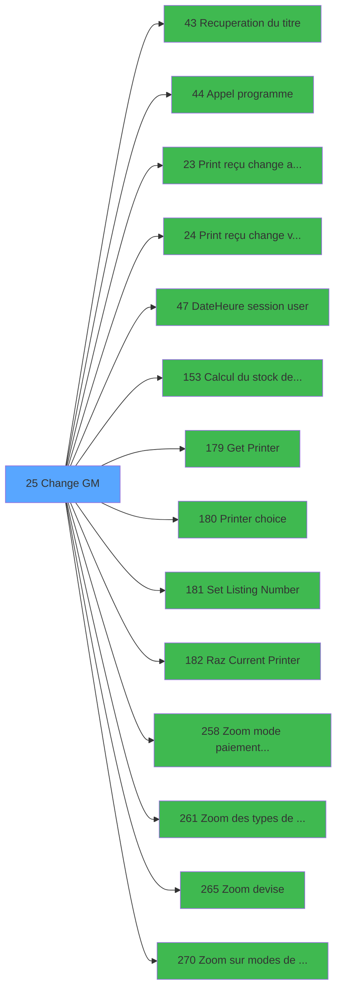

# ADH IDE 25 - Change GM

> **Analyse**: Phases 1-4 2026-02-07 03:40 -> 03:41 (27s) | Assemblage 13:03
> **Pipeline**: V7.2 Enrichi
> **Structure**: 4 onglets (Resume | Ecrans | Donnees | Connexions)

<!-- TAB:Resume -->

## 1. FICHE D'IDENTITE

| Attribut | Valeur |
|----------|--------|
| Projet | ADH |
| IDE Position | 25 |
| Nom Programme | Change GM |
| Fichier source | `Prg_25.xml` |
| Dossier IDE | Change |
| Taches | 23 (5 ecrans visibles) |
| Tables modifiees | 7 |
| Programmes appeles | 14 |
| Complexite | **MOYENNE** (score 48/100) |

## 2. DESCRIPTION FONCTIONNELLE

### 1.1 Objectif metier

**Change GM** est le **programme principal de gestion des operations de change** qui **permet aux caissiers d'effectuer des achats et ventes de devises pour les clients GM**.

**Objectif metier** : Ce programme est le coeur du bureau de change du village Club Med. Il permet de realiser les operations d'achat de devises (le client achete des devises etrangeres) et de vente de devises (le client vend ses devises etrangeres). L'ecran principal affiche les scrolls des operations de vente et d'achat, permet la saisie des nouvelles transactions avec selection de devise, mode de paiement et taux, calcule les equivalents, gere le stock de devises en caisse, verrouille les operations pendant la cloture, et declenche l'impression des recus. Le programme impacte 7 tables critiques dont les tables de change, compteurs et sessions de caisse.

**Change GM** assure la gestion complete de ce processus, accessible depuis [Menu caisse GM - scroll (IDE 163)](ADH-IDE-163.md).

Le flux de traitement s'organise en **6 blocs fonctionnels** :

- **Traitement** (8 taches) : traitements metier divers
- **Creation** (5 taches) : insertion d'enregistrements en base (mouvements, prestations)
- **Calcul** (4 taches) : calculs de montants, stocks ou compteurs
- **Consultation** (3 taches) : ecrans de recherche, selection et consultation
- **Saisie** (2 taches) : ecrans de saisie utilisateur (formulaires, champs, donnees)
- **Impression** (1 tache) : generation de tickets et documents

**Donnees modifiees** : 7 tables en ecriture (reseau_cloture___rec, change___________chg, compte_gm________cgm, compteurs________cpt, change_vente_____chg, comptage_caisse_devise, Table_945).

<details>
<summary>Detail : phases du traitement</summary>

#### Phase 1 : Traitement (8 taches)

- **25** - Change GM **[[ECRAN]](#ecran-t1)**
- **25.2** - Scroll Change achat **[[ECRAN]](#ecran-t3)**
- **25.5** - Test si cloture en cours
- **25.5.1** - Blocage cloture v1
- **25.5.2** - Blocage cloture v1
- **25.6** - Test reseau
- **25.8** - Deblocage cloture v1
- **25.9** - Deblocage cloture v1

Delegue a : [Recuperation du titre (IDE 43)](ADH-IDE-43.md), [Appel programme (IDE 44)](ADH-IDE-44.md), [Date/Heure session user (IDE 47)](ADH-IDE-47.md), [Set Listing Number (IDE 181)](ADH-IDE-181.md)

#### Phase 2 : Saisie (2 taches)

- **25.1** - Scroll Change vente **[[ECRAN]](#ecran-t2)**
- **25.3** - Change vente **[[ECRAN]](#ecran-t4)**

Delegue a : [Print reçu change vente (IDE 24)](ADH-IDE-24.md)

#### Phase 3 : Consultation (3 taches)

- **25.3.1** - Affichage annulation **[[ECRAN]](#ecran-t5)**
- **25.3.2** - Affichage annulation **[[ECRAN]](#ecran-t6)**
- **25.3.7** - Zoom des devises **[[ECRAN]](#ecran-t12)**

Delegue a : [Recuperation du titre (IDE 43)](ADH-IDE-43.md), [Zoom mode paiement change GM (IDE 258)](ADH-IDE-258.md), [Zoom des types de taux (IDE 261)](ADH-IDE-261.md), [Zoom devise (IDE 265)](ADH-IDE-265.md), [Zoom sur modes de paiement a/v (IDE 270)](ADH-IDE-270.md)

#### Phase 4 : Creation (5 taches)

- **25.3.3** - Creation change
- **25.3.3.1** - Creation change
- **25.3.4** - Creation change
- **25.3.5** - Creation change
- **25.3.6** - Creation change

#### Phase 5 : Calcul (4 taches)

- **25.3.8** - Recup compteur
- **25.3.9** - Calcul Flag
- **25.4** - OCA  Menu solde d'un compte **[[ECRAN]](#ecran-t16)**
- **25.7** - Reaffichage infos compte

Delegue a : [Calcul du stock devise (IDE 153)](ADH-IDE-153.md)

#### Phase 6 : Impression (1 tache)

- **25.3.10** - Ecriture ds reedition_ Ticket

Delegue a : [Print reçu change achat (IDE 23)](ADH-IDE-23.md), [Print reçu change vente (IDE 24)](ADH-IDE-24.md), [Get Printer (IDE 179)](ADH-IDE-179.md), [Printer choice (IDE 180)](ADH-IDE-180.md), [Set Listing Number (IDE 181)](ADH-IDE-181.md), [Raz Current Printer (IDE 182)](ADH-IDE-182.md)

#### Tables impactees

| Table | Operations | Role metier |
|-------|-----------|-------------|
| reseau_cloture___rec | R/**W** (5 usages) | Donnees reseau/cloture |
| change_vente_____chg | **W**/L (4 usages) | Donnees de ventes |
| change___________chg | R/**W**/L (4 usages) |  |
| comptage_caisse_devise | R/**W** (3 usages) | Sessions de caisse |
| compte_gm________cgm | **W** (2 usages) | Comptes GM (generaux) |
| compteurs________cpt | **W** (1 usages) | Comptes GM (generaux) |
| Table_945 | **W** (1 usages) |  |

</details>

## 3. BLOCS FONCTIONNELS

### 3.1 Traitement (8 taches)

Traitements internes.

---

#### <a id="t1"></a>T1 - Change GM [ECRAN]

**Role** : Tache d'orchestration : point d'entree du programme (8 sous-taches). Coordonne l'enchainement des traitements.
**Ecran** : 204 x 50 DLU (MDI) | [Voir mockup](#ecran-t1)

<details>
<summary>7 sous-taches directes</summary>

| Tache | Nom | Bloc |
|-------|-----|------|
| [T3](#t3) | Scroll Change achat **[ECRAN]** | Traitement |
| [T17](#t17) | Test si cloture en cours | Traitement |
| [T18](#t18) | Blocage cloture v1 | Traitement |
| [T19](#t19) | Blocage cloture v1 | Traitement |
| [T20](#t20) | Test reseau | Traitement |
| [T22](#t22) | Deblocage cloture v1 | Traitement |
| [T23](#t23) | Deblocage cloture v1 | Traitement |

</details>
**Variables liees** : S (W0 n° de change), BB (Btn Creer Change)
**Delegue a** : [Recuperation du titre (IDE 43)](ADH-IDE-43.md), [Appel programme (IDE 44)](ADH-IDE-44.md), [Date/Heure session user (IDE 47)](ADH-IDE-47.md)

---

#### <a id="t3"></a>T3 - Scroll Change achat [ECRAN]

**Role** : Traitement : Scroll Change achat.
**Ecran** : 1101 x 219 DLU (MDI) | [Voir mockup](#ecran-t3)
**Variables liees** : S (W0 n° de change), BB (Btn Creer Change)
**Delegue a** : [Recuperation du titre (IDE 43)](ADH-IDE-43.md), [Appel programme (IDE 44)](ADH-IDE-44.md), [Date/Heure session user (IDE 47)](ADH-IDE-47.md)

---

#### <a id="t17"></a>T17 - Test si cloture en cours

**Role** : Verification : Test si cloture en cours.
**Delegue a** : [Recuperation du titre (IDE 43)](ADH-IDE-43.md), [Appel programme (IDE 44)](ADH-IDE-44.md), [Date/Heure session user (IDE 47)](ADH-IDE-47.md)

---

#### <a id="t18"></a>T18 - Blocage cloture v1

**Role** : Traitement : Blocage cloture v1.
**Delegue a** : [Recuperation du titre (IDE 43)](ADH-IDE-43.md), [Appel programme (IDE 44)](ADH-IDE-44.md), [Date/Heure session user (IDE 47)](ADH-IDE-47.md)

---

#### <a id="t19"></a>T19 - Blocage cloture v1

**Role** : Traitement : Blocage cloture v1.
**Delegue a** : [Recuperation du titre (IDE 43)](ADH-IDE-43.md), [Appel programme (IDE 44)](ADH-IDE-44.md), [Date/Heure session user (IDE 47)](ADH-IDE-47.md)

---

#### <a id="t20"></a>T20 - Test reseau

**Role** : Verification : Test reseau.
**Variables liees** : X (W0 reseau)
**Delegue a** : [Recuperation du titre (IDE 43)](ADH-IDE-43.md), [Appel programme (IDE 44)](ADH-IDE-44.md), [Date/Heure session user (IDE 47)](ADH-IDE-47.md)

---

#### <a id="t22"></a>T22 - Deblocage cloture v1

**Role** : Traitement : Deblocage cloture v1.
**Delegue a** : [Recuperation du titre (IDE 43)](ADH-IDE-43.md), [Appel programme (IDE 44)](ADH-IDE-44.md), [Date/Heure session user (IDE 47)](ADH-IDE-47.md)

---

#### <a id="t23"></a>T23 - Deblocage cloture v1

**Role** : Traitement : Deblocage cloture v1.
**Delegue a** : [Recuperation du titre (IDE 43)](ADH-IDE-43.md), [Appel programme (IDE 44)](ADH-IDE-44.md), [Date/Heure session user (IDE 47)](ADH-IDE-47.md)


### 3.2 Saisie (2 taches)

L'operateur saisit les donnees de la transaction via 2 ecrans (Scroll Change vente, Change vente).

---

#### <a id="t2"></a>T2 - Scroll Change vente [ECRAN]

**Role** : Saisie des donnees : Scroll Change vente.
**Ecran** : 1101 x 218 DLU (MDI) | [Voir mockup](#ecran-t2)
**Variables liees** : S (W0 n° de change), BB (Btn Creer Change)
**Delegue a** : [Print reçu change vente (IDE 24)](ADH-IDE-24.md)

---

#### <a id="t4"></a>T4 - Change vente [ECRAN]

**Role** : Saisie des donnees : Change vente.
**Ecran** : 1106 x 90 DLU (MDI) | [Voir mockup](#ecran-t4)
**Variables liees** : S (W0 n° de change), BB (Btn Creer Change)
**Delegue a** : [Print reçu change vente (IDE 24)](ADH-IDE-24.md)


### 3.3 Consultation (3 taches)

Ecrans de recherche et consultation.

---

#### <a id="t5"></a>T5 - Affichage annulation [ECRAN]

**Role** : Reinitialisation : Affichage annulation.
**Ecran** : 312 x 64 DLU (Modal) | [Voir mockup](#ecran-t5)
**Delegue a** : [Zoom des types de taux (IDE 261)](ADH-IDE-261.md), [Zoom devise (IDE 265)](ADH-IDE-265.md)

---

#### <a id="t6"></a>T6 - Affichage annulation [ECRAN]

**Role** : Reinitialisation : Affichage annulation.
**Ecran** : 312 x 64 DLU (Modal) | [Voir mockup](#ecran-t6)
**Delegue a** : [Zoom des types de taux (IDE 261)](ADH-IDE-261.md), [Zoom devise (IDE 265)](ADH-IDE-265.md)

---

#### <a id="t12"></a>T12 - Zoom des devises [ECRAN]

**Role** : Selection par l'operateur : Zoom des devises.
**Ecran** : 366 x 154 DLU (MDI) | [Voir mockup](#ecran-t12)
**Delegue a** : [Zoom des types de taux (IDE 261)](ADH-IDE-261.md), [Zoom devise (IDE 265)](ADH-IDE-265.md)


### 3.4 Creation (5 taches)

Insertion de nouveaux enregistrements en base.

---

#### <a id="t7"></a>T7 - Creation change

**Role** : Creation d'enregistrement : Creation change.
**Variables liees** : S (W0 n° de change), BB (Btn Creer Change)

---

#### <a id="t8"></a>T8 - Creation change

**Role** : Creation d'enregistrement : Creation change.
**Variables liees** : S (W0 n° de change), BB (Btn Creer Change)

---

#### <a id="t9"></a>T9 - Creation change

**Role** : Creation d'enregistrement : Creation change.
**Variables liees** : S (W0 n° de change), BB (Btn Creer Change)

---

#### <a id="t10"></a>T10 - Creation change

**Role** : Creation d'enregistrement : Creation change.
**Variables liees** : S (W0 n° de change), BB (Btn Creer Change)

---

#### <a id="t11"></a>T11 - Creation change

**Role** : Creation d'enregistrement : Creation change.
**Variables liees** : S (W0 n° de change), BB (Btn Creer Change)


### 3.5 Calcul (4 taches)

Calculs metier : montants, stocks, compteurs.

---

#### <a id="t13"></a>T13 - Recup compteur

**Role** : Calcul : Recup compteur.
**Delegue a** : [Calcul du stock devise (IDE 153)](ADH-IDE-153.md)

---

#### <a id="t14"></a>T14 - Calcul Flag

**Role** : Calcul : Calcul Flag.
**Delegue a** : [Calcul du stock devise (IDE 153)](ADH-IDE-153.md)

---

#### <a id="t16"></a>T16 - OCA  Menu solde d'un compte [ECRAN]

**Role** : Consultation/chargement : OCA  Menu solde d'un compte.
**Ecran** : 608 x 159 DLU (MDI) | [Voir mockup](#ecran-t16)
**Variables liees** : I (> solde compte), J (> etat compte), K (> date solde)
**Delegue a** : [Calcul du stock devise (IDE 153)](ADH-IDE-153.md)

---

#### <a id="t21"></a>T21 - Reaffichage infos compte

**Role** : Reinitialisation : Reaffichage infos compte.
**Variables liees** : I (> solde compte), J (> etat compte)
**Delegue a** : [Calcul du stock devise (IDE 153)](ADH-IDE-153.md)


### 3.6 Impression (1 tache)

Generation des documents et tickets.

---

#### <a id="t15"></a>T15 - Ecriture ds reedition_ Ticket

**Role** : Generation du document : Ecriture ds reedition_ Ticket.
**Delegue a** : [Print reçu change achat (IDE 23)](ADH-IDE-23.md), [Get Printer (IDE 179)](ADH-IDE-179.md), [Printer choice (IDE 180)](ADH-IDE-180.md)


## 5. REGLES METIER

*(Programme d'impression - logique technique sans conditions metier)*

## 6. CONTEXTE

- **Appele par**: [Menu caisse GM - scroll (IDE 163)](ADH-IDE-163.md)
- **Appelle**: 14 programmes | **Tables**: 14 (W:7 R:7 L:7) | **Taches**: 23 | **Expressions**: 24

<!-- TAB:Ecrans -->

## 8. ECRANS

### 8.1 Forms visibles (5 / 23)

| # | Position | Tache | Nom | Type | Largeur | Hauteur | Bloc |
|---|----------|-------|-----|------|---------|---------|------|
| 1 | 25.1 | T2 | Scroll Change vente | MDI | 1101 | 218 | Saisie |
| 2 | 25.2 | T3 | Scroll Change achat | MDI | 1101 | 219 | Traitement |
| 3 | 25.3 | T4 | Change vente | MDI | 1106 | 90 | Saisie |
| 4 | 25.3.7 | T12 | Zoom des devises | MDI | 366 | 154 | Consultation |
| 5 | 25.4 | T16 | OCA  Menu solde d'un compte | MDI | 608 | 159 | Calcul |

### 8.2 Mockups Ecrans

---

#### <a id="ecran-t2"></a>25.1 - Scroll Change vente
**Tache** : [T2](#t2) | **Type** : MDI | **Dimensions** : 1101 x 218 DLU
**Bloc** : Saisie | **Titre IDE** : Scroll Change vente

<!-- FORM-DATA:
{
    "width":  1101,
    "vFactor":  8,
    "type":  "MDI",
    "hFactor":  8,
    "controls":  [
                     {
                         "x":  0,
                         "type":  "label",
                         "var":  "",
                         "y":  2,
                         "w":  1100,
                         "fmt":  "",
                         "name":  "",
                         "h":  21,
                         "color":  "",
                         "text":  "",
                         "parent":  null
                     },
                     {
                         "x":  0,
                         "type":  "label",
                         "var":  "",
                         "y":  193,
                         "w":  1100,
                         "fmt":  "",
                         "name":  "",
                         "h":  25,
                         "color":  "",
                         "text":  "",
                         "parent":  null
                     },
                     {
                         "x":  62,
                         "type":  "table",
                         "var":  "",
                         "name":  "",
                         "titleH":  12,
                         "color":  "110",
                         "w":  977,
                         "y":  33,
                         "fmt":  "",
                         "parent":  null,
                         "text":  "",
                         "rowH":  12,
                         "h":  89,
                         "cols":  [
                                      {
                                          "title":  "Nom",
                                          "layer":  1,
                                          "w":  240
                                      },
                                      {
                                          "title":  "Date opération",
                                          "layer":  2,
                                          "w":  133
                                      },
                                      {
                                          "title":  "Mode paiement",
                                          "layer":  3,
                                          "w":  132
                                      },
                                      {
                                          "title":  "Quantité",
                                          "layer":  4,
                                          "w":  143
                                      },
                                      {
                                          "title":  "Code devise",
                                          "layer":  5,
                                          "w":  108
                                      },
                                      {
                                          "title":  "Etat",
                                          "layer":  6,
                                          "w":  187
                                      }
                                  ],
                         "rows":  6
                     },
                     {
                         "x":  416,
                         "type":  "label",
                         "var":  "",
                         "y":  128,
                         "w":  269,
                         "fmt":  "",
                         "name":  "",
                         "h":  56,
                         "color":  "",
                         "text":  "",
                         "parent":  null
                     },
                     {
                         "x":  450,
                         "type":  "label",
                         "var":  "",
                         "y":  134,
                         "w":  199,
                         "fmt":  "",
                         "name":  "",
                         "h":  29,
                         "color":  "",
                         "text":  "",
                         "parent":  19
                     },
                     {
                         "x":  453,
                         "type":  "label",
                         "var":  "",
                         "y":  135,
                         "w":  38,
                         "fmt":  "",
                         "name":  "",
                         "h":  27,
                         "color":  "",
                         "text":  "",
                         "parent":  19
                     },
                     {
                         "x":  503,
                         "type":  "label",
                         "var":  "",
                         "y":  139,
                         "w":  101,
                         "fmt":  "",
                         "name":  "",
                         "h":  8,
                         "color":  "7",
                         "text":  "Change",
                         "parent":  19
                     },
                     {
                         "x":  503,
                         "type":  "label",
                         "var":  "",
                         "y":  151,
                         "w":  128,
                         "fmt":  "",
                         "name":  "",
                         "h":  8,
                         "color":  "7",
                         "text":  "Annulation",
                         "parent":  19
                     },
                     {
                         "x":  463,
                         "type":  "label",
                         "var":  "",
                         "y":  169,
                         "w":  120,
                         "fmt":  "",
                         "name":  "",
                         "h":  9,
                         "color":  "",
                         "text":  "Votre choix",
                         "parent":  19
                     },
                     {
                         "x":  760,
                         "type":  "label",
                         "var":  "",
                         "y":  128,
                         "w":  269,
                         "fmt":  "",
                         "name":  "",
                         "h":  22,
                         "color":  "",
                         "text":  "",
                         "parent":  null
                     },
                     {
                         "x":  779,
                         "type":  "label",
                         "var":  "",
                         "y":  135,
                         "w":  83,
                         "fmt":  "",
                         "name":  "",
                         "h":  8,
                         "color":  "7",
                         "text":  "Operateur",
                         "parent":  26
                     },
                     {
                         "x":  309,
                         "type":  "edit",
                         "var":  "",
                         "y":  48,
                         "w":  120,
                         "fmt":  "DD/MM/YYYYZ",
                         "name":  "",
                         "h":  8,
                         "color":  "110",
                         "text":  "",
                         "parent":  6
                     },
                     {
                         "x":  725,
                         "type":  "edit",
                         "var":  "",
                         "y":  48,
                         "w":  59,
                         "fmt":  "",
                         "name":  "",
                         "h":  8,
                         "color":  "110",
                         "text":  "",
                         "parent":  6
                     },
                     {
                         "x":  443,
                         "type":  "edit",
                         "var":  "",
                         "y":  48,
                         "w":  53,
                         "fmt":  "",
                         "name":  "",
                         "h":  8,
                         "color":  "110",
                         "text":  "",
                         "parent":  6
                     },
                     {
                         "x":  574,
                         "type":  "edit",
                         "var":  "",
                         "y":  48,
                         "w":  131,
                         "fmt":  "###########Z",
                         "name":  "",
                         "h":  8,
                         "color":  "110",
                         "text":  "",
                         "parent":  6
                     },
                     {
                         "x":  910,
                         "type":  "edit",
                         "var":  "",
                         "y":  135,
                         "w":  101,
                         "fmt":  "",
                         "name":  "",
                         "h":  9,
                         "color":  "7",
                         "text":  "",
                         "parent":  26
                     },
                     {
                         "x":  590,
                         "type":  "edit",
                         "var":  "",
                         "y":  168,
                         "w":  26,
                         "fmt":  "UA",
                         "name":  "W1 choix action",
                         "h":  10,
                         "color":  "6",
                         "text":  "",
                         "parent":  19
                     },
                     {
                         "x":  7,
                         "type":  "edit",
                         "var":  "",
                         "y":  9,
                         "w":  267,
                         "fmt":  "20",
                         "name":  "",
                         "h":  8,
                         "color":  "",
                         "text":  "",
                         "parent":  1
                     },
                     {
                         "x":  888,
                         "type":  "edit",
                         "var":  "",
                         "y":  9,
                         "w":  203,
                         "fmt":  "WWW DD MMM YYYYT",
                         "name":  "",
                         "h":  8,
                         "color":  "",
                         "text":  "",
                         "parent":  1
                     },
                     {
                         "x":  67,
                         "type":  "edit",
                         "var":  "",
                         "y":  48,
                         "w":  232,
                         "fmt":  "20",
                         "name":  "",
                         "h":  8,
                         "color":  "110",
                         "text":  "",
                         "parent":  6
                     },
                     {
                         "x":  830,
                         "type":  "edit",
                         "var":  "",
                         "y":  48,
                         "w":  165,
                         "fmt":  "14",
                         "name":  "",
                         "h":  8,
                         "color":  "110",
                         "text":  "",
                         "parent":  6
                     },
                     {
                         "x":  124,
                         "type":  "image",
                         "var":  "",
                         "y":  125,
                         "w":  144,
                         "fmt":  "",
                         "name":  "",
                         "h":  62,
                         "color":  "",
                         "text":  "",
                         "parent":  null
                     },
                     {
                         "x":  457,
                         "type":  "button",
                         "var":  "",
                         "y":  138,
                         "w":  27,
                         "fmt":  "C",
                         "name":  "C",
                         "h":  9,
                         "color":  "",
                         "text":  "",
                         "parent":  null
                     },
                     {
                         "x":  457,
                         "type":  "button",
                         "var":  "",
                         "y":  150,
                         "w":  27,
                         "fmt":  "A",
                         "name":  "A",
                         "h":  9,
                         "color":  "",
                         "text":  "",
                         "parent":  null
                     },
                     {
                         "x":  9,
                         "type":  "button",
                         "var":  "",
                         "y":  197,
                         "w":  175,
                         "fmt":  "\u0026Quitter",
                         "name":  "",
                         "h":  18,
                         "color":  "",
                         "text":  "",
                         "parent":  5
                     }
                 ],
    "taskId":  "25.1",
    "height":  218
}
-->

<details>
<summary><strong>Champs : 10 champs</strong></summary>

| Pos (x,y) | Nom | Variable | Type |
|-----------|-----|----------|------|
| 309,48 | DD/MM/YYYYZ | - | edit |
| 725,48 | (sans nom) | - | edit |
| 443,48 | (sans nom) | - | edit |
| 574,48 | ###########Z | - | edit |
| 910,135 | (sans nom) | - | edit |
| 590,168 | W1 choix action | - | edit |
| 7,9 | 20 | - | edit |
| 888,9 | WWW DD MMM YYYYT | - | edit |
| 67,48 | 20 | - | edit |
| 830,48 | 14 | - | edit |

</details>

<details>
<summary><strong>Boutons : 3 boutons</strong></summary>

| Bouton | Pos (x,y) | Action |
|--------|-----------|--------|
| C | 457,138 | Bouton fonctionnel |
| A | 457,150 | Bouton fonctionnel |
| Quitter | 9,197 | Quitte le programme |

</details>

---

#### <a id="ecran-t3"></a>25.2 - Scroll Change achat
**Tache** : [T3](#t3) | **Type** : MDI | **Dimensions** : 1101 x 219 DLU
**Bloc** : Traitement | **Titre IDE** : Scroll Change achat

<!-- FORM-DATA:
{
    "width":  1101,
    "vFactor":  8,
    "type":  "MDI",
    "hFactor":  8,
    "controls":  [
                     {
                         "x":  0,
                         "type":  "label",
                         "var":  "",
                         "y":  2,
                         "w":  1100,
                         "fmt":  "",
                         "name":  "",
                         "h":  21,
                         "color":  "",
                         "text":  "",
                         "parent":  null
                     },
                     {
                         "x":  792,
                         "type":  "label",
                         "var":  "",
                         "y":  125,
                         "w":  255,
                         "fmt":  "",
                         "name":  "",
                         "h":  15,
                         "color":  "",
                         "text":  "",
                         "parent":  null
                     },
                     {
                         "x":  794,
                         "type":  "label",
                         "var":  "",
                         "y":  126,
                         "w":  250,
                         "fmt":  "",
                         "name":  "",
                         "h":  13,
                         "color":  "",
                         "text":  "",
                         "parent":  null
                     },
                     {
                         "x":  441,
                         "type":  "label",
                         "var":  "",
                         "y":  128,
                         "w":  292,
                         "fmt":  "",
                         "name":  "",
                         "h":  54,
                         "color":  "",
                         "text":  "",
                         "parent":  null
                     },
                     {
                         "x":  804,
                         "type":  "label",
                         "var":  "",
                         "y":  128,
                         "w":  83,
                         "fmt":  "",
                         "name":  "",
                         "h":  8,
                         "color":  "7",
                         "text":  "Opérateur",
                         "parent":  null
                     },
                     {
                         "x":  444,
                         "type":  "label",
                         "var":  "",
                         "y":  129,
                         "w":  287,
                         "fmt":  "",
                         "name":  "",
                         "h":  52,
                         "color":  "",
                         "text":  "",
                         "parent":  null
                     },
                     {
                         "x":  498,
                         "type":  "label",
                         "var":  "",
                         "y":  135,
                         "w":  181,
                         "fmt":  "",
                         "name":  "",
                         "h":  28,
                         "color":  "",
                         "text":  "",
                         "parent":  null
                     },
                     {
                         "x":  501,
                         "type":  "label",
                         "var":  "",
                         "y":  136,
                         "w":  38,
                         "fmt":  "",
                         "name":  "",
                         "h":  26,
                         "color":  "",
                         "text":  "",
                         "parent":  null
                     },
                     {
                         "x":  546,
                         "type":  "label",
                         "var":  "",
                         "y":  138,
                         "w":  117,
                         "fmt":  "",
                         "name":  "",
                         "h":  8,
                         "color":  "7",
                         "text":  "Change",
                         "parent":  null
                     },
                     {
                         "x":  546,
                         "type":  "label",
                         "var":  "",
                         "y":  150,
                         "w":  117,
                         "fmt":  "",
                         "name":  "",
                         "h":  8,
                         "color":  "7",
                         "text":  "Annulation",
                         "parent":  null
                     },
                     {
                         "x":  511,
                         "type":  "label",
                         "var":  "",
                         "y":  168,
                         "w":  120,
                         "fmt":  "",
                         "name":  "",
                         "h":  9,
                         "color":  "",
                         "text":  "Votre choix",
                         "parent":  null
                     },
                     {
                         "x":  0,
                         "type":  "label",
                         "var":  "",
                         "y":  193,
                         "w":  1100,
                         "fmt":  "",
                         "name":  "",
                         "h":  25,
                         "color":  "",
                         "text":  "",
                         "parent":  null
                     },
                     {
                         "x":  30,
                         "type":  "table",
                         "var":  "",
                         "name":  "",
                         "titleH":  12,
                         "color":  "110",
                         "w":  1045,
                         "y":  33,
                         "fmt":  "",
                         "parent":  null,
                         "text":  "",
                         "rowH":  13,
                         "h":  89,
                         "cols":  [
                                      {
                                          "title":  "Nom",
                                          "layer":  1,
                                          "w":  240
                                      },
                                      {
                                          "title":  "Date opération",
                                          "layer":  2,
                                          "w":  151
                                      },
                                      {
                                          "title":  "Montant",
                                          "layer":  3,
                                          "w":  164
                                      },
                                      {
                                          "title":  "Devise",
                                          "layer":  4,
                                          "w":  117
                                      },
                                      {
                                          "title":  "Mode Paiement",
                                          "layer":  5,
                                          "w":  146
                                      },
                                      {
                                          "title":  "Etat",
                                          "layer":  6,
                                          "w":  195
                                      }
                                  ],
                         "rows":  6
                     },
                     {
                         "x":  277,
                         "type":  "edit",
                         "var":  "",
                         "y":  48,
                         "w":  120,
                         "fmt":  "DD/MM/YYYYZ",
                         "name":  "",
                         "h":  8,
                         "color":  "110",
                         "text":  "",
                         "parent":  18
                     },
                     {
                         "x":  618,
                         "type":  "edit",
                         "var":  "",
                         "y":  48,
                         "w":  42,
                         "fmt":  "",
                         "name":  "",
                         "h":  8,
                         "color":  "110",
                         "text":  "",
                         "parent":  18
                     },
                     {
                         "x":  741,
                         "type":  "edit",
                         "var":  "",
                         "y":  48,
                         "w":  53,
                         "fmt":  "",
                         "name":  "",
                         "h":  8,
                         "color":  "110",
                         "text":  "",
                         "parent":  18
                     },
                     {
                         "x":  429,
                         "type":  "edit",
                         "var":  "",
                         "y":  48,
                         "w":  142,
                         "fmt":  "",
                         "name":  "",
                         "h":  8,
                         "color":  "110",
                         "text":  "",
                         "parent":  18
                     },
                     {
                         "x":  935,
                         "type":  "edit",
                         "var":  "",
                         "y":  128,
                         "w":  101,
                         "fmt":  "",
                         "name":  "",
                         "h":  9,
                         "color":  "7",
                         "text":  "",
                         "parent":  null
                     },
                     {
                         "x":  643,
                         "type":  "edit",
                         "var":  "",
                         "y":  167,
                         "w":  26,
                         "fmt":  "UA",
                         "name":  "W1 choix action",
                         "h":  10,
                         "color":  "6",
                         "text":  "",
                         "parent":  null
                     },
                     {
                         "x":  7,
                         "type":  "edit",
                         "var":  "",
                         "y":  8,
                         "w":  267,
                         "fmt":  "20",
                         "name":  "",
                         "h":  8,
                         "color":  "",
                         "text":  "",
                         "parent":  null
                     },
                     {
                         "x":  888,
                         "type":  "edit",
                         "var":  "",
                         "y":  8,
                         "w":  203,
                         "fmt":  "WWW DD MMM YYYYT",
                         "name":  "",
                         "h":  8,
                         "color":  "",
                         "text":  "",
                         "parent":  null
                     },
                     {
                         "x":  36,
                         "type":  "edit",
                         "var":  "",
                         "y":  48,
                         "w":  232,
                         "fmt":  "20",
                         "name":  "",
                         "h":  8,
                         "color":  "110",
                         "text":  "",
                         "parent":  18
                     },
                     {
                         "x":  860,
                         "type":  "edit",
                         "var":  "",
                         "y":  48,
                         "w":  176,
                         "fmt":  "15",
                         "name":  "",
                         "h":  8,
                         "color":  "110",
                         "text":  "",
                         "parent":  18
                     },
                     {
                         "x":  163,
                         "type":  "image",
                         "var":  "",
                         "y":  126,
                         "w":  144,
                         "fmt":  "",
                         "name":  "",
                         "h":  62,
                         "color":  "",
                         "text":  "",
                         "parent":  null
                     },
                     {
                         "x":  505,
                         "type":  "button",
                         "var":  "",
                         "y":  138,
                         "w":  27,
                         "fmt":  "C",
                         "name":  "C",
                         "h":  9,
                         "color":  "",
                         "text":  "",
                         "parent":  null
                     },
                     {
                         "x":  505,
                         "type":  "button",
                         "var":  "",
                         "y":  150,
                         "w":  27,
                         "fmt":  "A",
                         "name":  "A",
                         "h":  9,
                         "color":  "",
                         "text":  "",
                         "parent":  null
                     },
                     {
                         "x":  9,
                         "type":  "button",
                         "var":  "",
                         "y":  197,
                         "w":  175,
                         "fmt":  "\u0026Quitter",
                         "name":  "",
                         "h":  18,
                         "color":  "",
                         "text":  "",
                         "parent":  17
                     }
                 ],
    "taskId":  "25.2",
    "height":  219
}
-->

<details>
<summary><strong>Champs : 10 champs</strong></summary>

| Pos (x,y) | Nom | Variable | Type |
|-----------|-----|----------|------|
| 277,48 | DD/MM/YYYYZ | - | edit |
| 618,48 | (sans nom) | - | edit |
| 741,48 | (sans nom) | - | edit |
| 429,48 | (sans nom) | - | edit |
| 935,128 | (sans nom) | - | edit |
| 643,167 | W1 choix action | - | edit |
| 7,8 | 20 | - | edit |
| 888,8 | WWW DD MMM YYYYT | - | edit |
| 36,48 | 20 | - | edit |
| 860,48 | 15 | - | edit |

</details>

<details>
<summary><strong>Boutons : 3 boutons</strong></summary>

| Bouton | Pos (x,y) | Action |
|--------|-----------|--------|
| C | 505,138 | Bouton fonctionnel |
| A | 505,150 | Bouton fonctionnel |
| Quitter | 9,197 | Quitte le programme |

</details>

---

#### <a id="ecran-t4"></a>25.3 - Change vente
**Tache** : [T4](#t4) | **Type** : MDI | **Dimensions** : 1106 x 90 DLU
**Bloc** : Saisie | **Titre IDE** : Change vente

<!-- FORM-DATA:
{
    "width":  1106,
    "vFactor":  8,
    "type":  "MDI",
    "hFactor":  8,
    "controls":  [
                     {
                         "x":  1,
                         "type":  "label",
                         "var":  "",
                         "y":  0,
                         "w":  1102,
                         "fmt":  "",
                         "name":  "",
                         "h":  59,
                         "color":  "",
                         "text":  "",
                         "parent":  null
                     },
                     {
                         "x":  20,
                         "type":  "label",
                         "var":  "",
                         "y":  13,
                         "w":  61,
                         "fmt":  "",
                         "name":  "",
                         "h":  8,
                         "color":  "",
                         "text":  "Devise",
                         "parent":  null
                     },
                     {
                         "x":  98,
                         "type":  "label",
                         "var":  "",
                         "y":  13,
                         "w":  54,
                         "fmt":  "",
                         "name":  "",
                         "h":  8,
                         "color":  "",
                         "text":  "MOP",
                         "parent":  null
                     },
                     {
                         "x":  236,
                         "type":  "label",
                         "var":  "",
                         "y":  13,
                         "w":  216,
                         "fmt":  "",
                         "name":  "",
                         "h":  8,
                         "color":  "",
                         "text":  "Type de taux",
                         "parent":  null
                     },
                     {
                         "x":  521,
                         "type":  "label",
                         "var":  "",
                         "y":  13,
                         "w":  46,
                         "fmt":  "",
                         "name":  "",
                         "h":  8,
                         "color":  "",
                         "text":  "Taux",
                         "parent":  null
                     },
                     {
                         "x":  624,
                         "type":  "label",
                         "var":  "",
                         "y":  13,
                         "w":  171,
                         "fmt":  "",
                         "name":  "",
                         "h":  8,
                         "color":  "",
                         "text":  "Quantité",
                         "parent":  null
                     },
                     {
                         "x":  858,
                         "type":  "label",
                         "var":  "",
                         "y":  13,
                         "w":  128,
                         "fmt":  "",
                         "name":  "",
                         "h":  8,
                         "color":  "",
                         "text":  "Equivalent",
                         "parent":  null
                     },
                     {
                         "x":  1,
                         "type":  "label",
                         "var":  "",
                         "y":  64,
                         "w":  1102,
                         "fmt":  "",
                         "name":  "",
                         "h":  24,
                         "color":  "",
                         "text":  "",
                         "parent":  null
                     },
                     {
                         "x":  26,
                         "type":  "edit",
                         "var":  "",
                         "y":  30,
                         "w":  48,
                         "fmt":  "",
                         "name":  "W1 devise",
                         "h":  10,
                         "color":  "6",
                         "text":  "",
                         "parent":  null
                     },
                     {
                         "x":  127,
                         "type":  "edit",
                         "var":  "",
                         "y":  30,
                         "w":  59,
                         "fmt":  "",
                         "name":  "W1 mode de paiement",
                         "h":  10,
                         "color":  "6",
                         "text":  "",
                         "parent":  null
                     },
                     {
                         "x":  236,
                         "type":  "edit",
                         "var":  "",
                         "y":  30,
                         "w":  37,
                         "fmt":  "#2Z",
                         "name":  "W1 type de taux",
                         "h":  10,
                         "color":  "6",
                         "text":  "",
                         "parent":  null
                     },
                     {
                         "x":  277,
                         "type":  "edit",
                         "var":  "",
                         "y":  31,
                         "w":  176,
                         "fmt":  "",
                         "name":  "",
                         "h":  8,
                         "color":  "7",
                         "text":  "",
                         "parent":  null
                     },
                     {
                         "x":  467,
                         "type":  "edit",
                         "var":  "",
                         "y":  31,
                         "w":  157,
                         "fmt":  "### ### ###.#####",
                         "name":  "",
                         "h":  9,
                         "color":  "",
                         "text":  "",
                         "parent":  null
                     },
                     {
                         "x":  634,
                         "type":  "edit",
                         "var":  "",
                         "y":  31,
                         "w":  142,
                         "fmt":  "",
                         "name":  "W1 equivalent",
                         "h":  9,
                         "color":  "110",
                         "text":  "",
                         "parent":  null
                     },
                     {
                         "x":  855,
                         "type":  "edit",
                         "var":  "",
                         "y":  31,
                         "w":  142,
                         "fmt":  "## ### ### ###.###Z",
                         "name":  "W1 quantite",
                         "h":  9,
                         "color":  "110",
                         "text":  "",
                         "parent":  null
                     },
                     {
                         "x":  8,
                         "type":  "button",
                         "var":  "",
                         "y":  67,
                         "w":  154,
                         "fmt":  "\u0026Ok",
                         "name":  "Btn Valider",
                         "h":  18,
                         "color":  "",
                         "text":  "",
                         "parent":  null
                     },
                     {
                         "x":  154,
                         "type":  "edit",
                         "var":  "",
                         "y":  13,
                         "w":  64,
                         "fmt":  "5",
                         "name":  "",
                         "h":  8,
                         "color":  "",
                         "text":  "",
                         "parent":  null
                     },
                     {
                         "x":  785,
                         "type":  "edit",
                         "var":  "",
                         "y":  31,
                         "w":  45,
                         "fmt":  "3",
                         "name":  "",
                         "h":  9,
                         "color":  "7",
                         "text":  "",
                         "parent":  null
                     },
                     {
                         "x":  1006,
                         "type":  "edit",
                         "var":  "",
                         "y":  31,
                         "w":  45,
                         "fmt":  "3",
                         "name":  "",
                         "h":  8,
                         "color":  "7",
                         "text":  "",
                         "parent":  null
                     },
                     {
                         "x":  169,
                         "type":  "button",
                         "var":  "",
                         "y":  67,
                         "w":  154,
                         "fmt":  "A\u0026bandonner",
                         "name":  "",
                         "h":  18,
                         "color":  "",
                         "text":  "",
                         "parent":  null
                     },
                     {
                         "x":  330,
                         "type":  "button",
                         "var":  "",
                         "y":  67,
                         "w":  168,
                         "fmt":  "Printer",
                         "name":  "",
                         "h":  18,
                         "color":  "",
                         "text":  "",
                         "parent":  null
                     }
                 ],
    "taskId":  "25.3",
    "height":  90
}
-->

<details>
<summary><strong>Champs : 10 champs</strong></summary>

| Pos (x,y) | Nom | Variable | Type |
|-----------|-----|----------|------|
| 26,30 | W1 devise | - | edit |
| 127,30 | W1 mode de paiement | - | edit |
| 236,30 | W1 type de taux | - | edit |
| 277,31 | (sans nom) | - | edit |
| 467,31 | ### ### ###.##### | - | edit |
| 634,31 | W1 equivalent | - | edit |
| 855,31 | W1 quantite | - | edit |
| 154,13 | 5 | - | edit |
| 785,31 | 3 | - | edit |
| 1006,31 | 3 | - | edit |

</details>

<details>
<summary><strong>Boutons : 3 boutons</strong></summary>

| Bouton | Pos (x,y) | Action |
|--------|-----------|--------|
| Ok | 8,67 | Valide la saisie et enregistre |
| Abandonner | 169,67 | Annule et retour au menu |
| Printer | 330,67 | Appel [Print reçu change achat (IDE 23)](ADH-IDE-23.md) |

</details>

---

#### <a id="ecran-t12"></a>25.3.7 - Zoom des devises
**Tache** : [T12](#t12) | **Type** : MDI | **Dimensions** : 366 x 154 DLU
**Bloc** : Consultation | **Titre IDE** : Zoom des devises

<!-- FORM-DATA:
{
    "width":  366,
    "vFactor":  8,
    "type":  "MDI",
    "hFactor":  8,
    "controls":  [
                     {
                         "x":  0,
                         "type":  "label",
                         "var":  "",
                         "y":  133,
                         "w":  363,
                         "fmt":  "",
                         "name":  "",
                         "h":  19,
                         "color":  "",
                         "text":  "",
                         "parent":  null
                     },
                     {
                         "x":  30,
                         "type":  "table",
                         "var":  "",
                         "name":  "",
                         "titleH":  12,
                         "color":  "196",
                         "w":  310,
                         "y":  7,
                         "fmt":  "",
                         "parent":  null,
                         "text":  "",
                         "rowH":  14,
                         "h":  102,
                         "cols":  [
                                      {
                                          "title":  "Code",
                                          "layer":  1,
                                          "w":  115
                                      },
                                      {
                                          "title":  "Devise",
                                          "layer":  2,
                                          "w":  155
                                      }
                                  ],
                         "rows":  2
                     },
                     {
                         "x":  51,
                         "type":  "edit",
                         "var":  "",
                         "y":  23,
                         "w":  75,
                         "fmt":  "",
                         "name":  "",
                         "h":  8,
                         "color":  "196",
                         "text":  "",
                         "parent":  3
                     },
                     {
                         "x":  152,
                         "type":  "edit",
                         "var":  "",
                         "y":  23,
                         "w":  142,
                         "fmt":  "12",
                         "name":  "",
                         "h":  8,
                         "color":  "196",
                         "text":  "",
                         "parent":  3
                     },
                     {
                         "x":  205,
                         "type":  "button",
                         "var":  "",
                         "y":  136,
                         "w":  144,
                         "fmt":  "\u0026Quitter",
                         "name":  "",
                         "h":  14,
                         "color":  "",
                         "text":  "",
                         "parent":  null
                     },
                     {
                         "x":  14,
                         "type":  "button",
                         "var":  "",
                         "y":  136,
                         "w":  144,
                         "fmt":  "\u0026Selectionner",
                         "name":  "",
                         "h":  14,
                         "color":  "",
                         "text":  "",
                         "parent":  null
                     },
                     {
                         "x":  152,
                         "type":  "image",
                         "var":  "",
                         "y":  109,
                         "w":  58,
                         "fmt":  "",
                         "name":  "",
                         "h":  18,
                         "color":  "",
                         "text":  "",
                         "parent":  null
                     }
                 ],
    "taskId":  "25.3.7",
    "height":  154
}
-->

<details>
<summary><strong>Champs : 2 champs</strong></summary>

| Pos (x,y) | Nom | Variable | Type |
|-----------|-----|----------|------|
| 51,23 | (sans nom) | - | edit |
| 152,23 | 12 | - | edit |

</details>

<details>
<summary><strong>Boutons : 2 boutons</strong></summary>

| Bouton | Pos (x,y) | Action |
|--------|-----------|--------|
| Quitter | 205,136 | Quitte le programme |
| Selectionner | 14,136 | Ouvre la selection |

</details>

---

#### <a id="ecran-t16"></a>25.4 - OCA  Menu solde d'un compte
**Tache** : [T16](#t16) | **Type** : MDI | **Dimensions** : 608 x 159 DLU
**Bloc** : Calcul | **Titre IDE** : OCA  Menu solde d'un compte

<!-- FORM-DATA:
{
    "width":  608,
    "vFactor":  8,
    "type":  "MDI",
    "hFactor":  8,
    "controls":  [
                     {
                         "x":  0,
                         "type":  "label",
                         "var":  "",
                         "y":  3,
                         "w":  608,
                         "fmt":  "",
                         "name":  "",
                         "h":  18,
                         "color":  "",
                         "text":  "",
                         "parent":  null
                     },
                     {
                         "x":  46,
                         "type":  "label",
                         "var":  "",
                         "y":  38,
                         "w":  517,
                         "fmt":  "",
                         "name":  "",
                         "h":  82,
                         "color":  "",
                         "text":  "",
                         "parent":  null
                     },
                     {
                         "x":  50,
                         "type":  "label",
                         "var":  "",
                         "y":  39,
                         "w":  510,
                         "fmt":  "",
                         "name":  "",
                         "h":  80,
                         "color":  "",
                         "text":  "",
                         "parent":  null
                     },
                     {
                         "x":  242,
                         "type":  "label",
                         "var":  "",
                         "y":  52,
                         "w":  285,
                         "fmt":  "",
                         "name":  "",
                         "h":  42,
                         "color":  "",
                         "text":  "",
                         "parent":  null
                     },
                     {
                         "x":  243,
                         "type":  "label",
                         "var":  "",
                         "y":  53,
                         "w":  50,
                         "fmt":  "",
                         "name":  "",
                         "h":  40,
                         "color":  "",
                         "text":  "",
                         "parent":  null
                     },
                     {
                         "x":  301,
                         "type":  "label",
                         "var":  "",
                         "y":  60,
                         "w":  178,
                         "fmt":  "",
                         "name":  "",
                         "h":  8,
                         "color":  "7",
                         "text":  "Achat de devises",
                         "parent":  null
                     },
                     {
                         "x":  301,
                         "type":  "label",
                         "var":  "",
                         "y":  76,
                         "w":  178,
                         "fmt":  "",
                         "name":  "",
                         "h":  8,
                         "color":  "7",
                         "text":  "Vente de devises",
                         "parent":  null
                     },
                     {
                         "x":  305,
                         "type":  "label",
                         "var":  "",
                         "y":  102,
                         "w":  120,
                         "fmt":  "",
                         "name":  "",
                         "h":  9,
                         "color":  "",
                         "text":  "Votre choix",
                         "parent":  null
                     },
                     {
                         "x":  0,
                         "type":  "label",
                         "var":  "",
                         "y":  135,
                         "w":  607,
                         "fmt":  "",
                         "name":  "",
                         "h":  24,
                         "color":  "",
                         "text":  "",
                         "parent":  null
                     },
                     {
                         "x":  426,
                         "type":  "edit",
                         "var":  "",
                         "y":  102,
                         "w":  26,
                         "fmt":  "UA",
                         "name":  "W0 choix action",
                         "h":  10,
                         "color":  "6",
                         "text":  "",
                         "parent":  null
                     },
                     {
                         "x":  7,
                         "type":  "edit",
                         "var":  "",
                         "y":  8,
                         "w":  267,
                         "fmt":  "20",
                         "name":  "",
                         "h":  8,
                         "color":  "",
                         "text":  "",
                         "parent":  null
                     },
                     {
                         "x":  385,
                         "type":  "edit",
                         "var":  "",
                         "y":  8,
                         "w":  216,
                         "fmt":  "WWW  DD MMM YYYYT",
                         "name":  "",
                         "h":  8,
                         "color":  "",
                         "text":  "",
                         "parent":  null
                     },
                     {
                         "x":  65,
                         "type":  "image",
                         "var":  "",
                         "y":  56,
                         "w":  163,
                         "fmt":  "",
                         "name":  "",
                         "h":  44,
                         "color":  "",
                         "text":  "",
                         "parent":  null
                     },
                     {
                         "x":  254,
                         "type":  "button",
                         "var":  "",
                         "y":  59,
                         "w":  26,
                         "fmt":  "1",
                         "name":  "1",
                         "h":  9,
                         "color":  "",
                         "text":  "",
                         "parent":  null
                     },
                     {
                         "x":  254,
                         "type":  "button",
                         "var":  "",
                         "y":  75,
                         "w":  26,
                         "fmt":  "2",
                         "name":  "2",
                         "h":  9,
                         "color":  "",
                         "text":  "",
                         "parent":  null
                     },
                     {
                         "x":  5,
                         "type":  "button",
                         "var":  "",
                         "y":  138,
                         "w":  154,
                         "fmt":  "\u0026Quitter",
                         "name":  "",
                         "h":  18,
                         "color":  "",
                         "text":  "",
                         "parent":  13
                     }
                 ],
    "taskId":  "25.4",
    "height":  159
}
-->

<details>
<summary><strong>Champs : 3 champs</strong></summary>

| Pos (x,y) | Nom | Variable | Type |
|-----------|-----|----------|------|
| 426,102 | W0 choix action | - | edit |
| 7,8 | 20 | - | edit |
| 385,8 | WWW  DD MMM YYYYT | - | edit |

</details>

<details>
<summary><strong>Boutons : 3 boutons</strong></summary>

| Bouton | Pos (x,y) | Action |
|--------|-----------|--------|
| 1 | 254,59 | Bouton fonctionnel |
| 2 | 254,75 | Bouton fonctionnel |
| Quitter | 5,138 | Quitte le programme |

</details>

## 9. NAVIGATION

### 9.1 Enchainement des ecrans

```mermaid
flowchart TD
    START([Entree])
    style START fill:#3fb950
    VF2[T2 Scroll Change vente]
    style VF2 fill:#58a6ff
    VF3[T3 Scroll Change achat]
    style VF3 fill:#58a6ff
    VF4[T4 Change vente]
    style VF4 fill:#58a6ff
    VF12[T12 Zoom des devises]
    style VF12 fill:#58a6ff
    VF16[T16 OCA Menu solde dun...]
    style VF16 fill:#58a6ff
    EXT43[IDE 43 Recuperation du...]
    style EXT43 fill:#3fb950
    EXT44[IDE 44 Appel programme]
    style EXT44 fill:#3fb950
    EXT23[IDE 23 Print reçu chan...]
    style EXT23 fill:#3fb950
    EXT24[IDE 24 Print reçu chan...]
    style EXT24 fill:#3fb950
    EXT47[IDE 47 DateHeure sessi...]
    style EXT47 fill:#3fb950
    EXT153[IDE 153 Calcul du stoc...]
    style EXT153 fill:#3fb950
    EXT179[IDE 179 Get Printer]
    style EXT179 fill:#3fb950
    EXT180[IDE 180 Printer choice]
    style EXT180 fill:#3fb950
    EXT181[IDE 181 Set Listing Nu...]
    style EXT181 fill:#3fb950
    EXT182[IDE 182 Raz Current Pr...]
    style EXT182 fill:#3fb950
    EXT258[IDE 258 Zoom mode paie...]
    style EXT258 fill:#3fb950
    EXT261[IDE 261 Zoom des types...]
    style EXT261 fill:#3fb950
    EXT265[IDE 265 Zoom devise]
    style EXT265 fill:#3fb950
    EXT270[IDE 270 Zoom sur modes...]
    style EXT270 fill:#3fb950
    FIN([Sortie])
    style FIN fill:#f85149
    START --> VF2
    VF2 -->|Recuperation donnees| EXT43
    VF2 -->|Sous-programme| EXT44
    VF2 -->|Impression ticket/document| EXT23
    VF2 -->|Impression ticket/document| EXT24
    VF2 -->|Gestion session| EXT47
    VF2 -->|Calcul de donnees| EXT153
    VF2 -->|Impression ticket/document| EXT179
    VF2 -->|Impression ticket/document| EXT180
    EXT270 --> FIN
```



**Detail par enchainement :**

| Depuis | Action | Vers | Retour |
|--------|--------|------|--------|
| Scroll Change vente | Recuperation donnees | [Recuperation du titre (IDE 43)](ADH-IDE-43.md) | Retour ecran |
| Scroll Change vente | Sous-programme | [Appel programme (IDE 44)](ADH-IDE-44.md) | Retour ecran |
| Scroll Change vente | Impression ticket/document | [Print reçu change achat (IDE 23)](ADH-IDE-23.md) | Retour ecran |
| Scroll Change vente | Impression ticket/document | [Print reçu change vente (IDE 24)](ADH-IDE-24.md) | Retour ecran |
| Scroll Change vente | Gestion session | [Date/Heure session user (IDE 47)](ADH-IDE-47.md) | Retour ecran |
| Scroll Change vente | Calcul de donnees | [Calcul du stock devise (IDE 153)](ADH-IDE-153.md) | Retour ecran |
| Scroll Change vente | Impression ticket/document | [Get Printer (IDE 179)](ADH-IDE-179.md) | Retour ecran |
| Scroll Change vente | Impression ticket/document | [Printer choice (IDE 180)](ADH-IDE-180.md) | Retour ecran |
| Scroll Change vente | Configuration impression | [Set Listing Number (IDE 181)](ADH-IDE-181.md) | Retour ecran |
| Scroll Change vente | Impression ticket/document | [Raz Current Printer (IDE 182)](ADH-IDE-182.md) | Retour ecran |
| Scroll Change vente | Selection/consultation | [Zoom mode paiement change GM (IDE 258)](ADH-IDE-258.md) | Retour ecran |
| Scroll Change vente | Selection/consultation | [Zoom des types de taux (IDE 261)](ADH-IDE-261.md) | Retour ecran |
| Scroll Change vente | Selection/consultation | [Zoom devise (IDE 265)](ADH-IDE-265.md) | Retour ecran |
| Scroll Change vente | Selection/consultation | [Zoom sur modes de paiement a/v (IDE 270)](ADH-IDE-270.md) | Retour ecran |

### 9.3 Structure hierarchique (23 taches)

| Position | Tache | Type | Dimensions | Bloc |
|----------|-------|------|------------|------|
| **25.1** | [**Change GM** (T1)](#t1) [mockup](#ecran-t1) | MDI | 204x50 | Traitement |
| 25.1.1 | [Scroll Change achat (T3)](#t3) [mockup](#ecran-t3) | MDI | 1101x219 | |
| 25.1.2 | [Test si cloture en cours (T17)](#t17) | MDI | - | |
| 25.1.3 | [Blocage cloture v1 (T18)](#t18) | MDI | - | |
| 25.1.4 | [Blocage cloture v1 (T19)](#t19) | MDI | - | |
| 25.1.5 | [Test reseau (T20)](#t20) | MDI | - | |
| 25.1.6 | [Deblocage cloture v1 (T22)](#t22) | MDI | - | |
| 25.1.7 | [Deblocage cloture v1 (T23)](#t23) | MDI | - | |
| **25.2** | [**Scroll Change vente** (T2)](#t2) [mockup](#ecran-t2) | MDI | 1101x218 | Saisie |
| 25.2.1 | [Change vente (T4)](#t4) [mockup](#ecran-t4) | MDI | 1106x90 | |
| **25.3** | [**Affichage annulation** (T5)](#t5) [mockup](#ecran-t5) | Modal | 312x64 | Consultation |
| 25.3.1 | [Affichage annulation (T6)](#t6) [mockup](#ecran-t6) | Modal | 312x64 | |
| 25.3.2 | [Zoom des devises (T12)](#t12) [mockup](#ecran-t12) | MDI | 366x154 | |
| **25.4** | [**Creation change** (T7)](#t7) | MDI | - | Creation |
| 25.4.1 | [Creation change (T8)](#t8) | MDI | - | |
| 25.4.2 | [Creation change (T9)](#t9) | MDI | - | |
| 25.4.3 | [Creation change (T10)](#t10) | MDI | - | |
| 25.4.4 | [Creation change (T11)](#t11) | MDI | - | |
| **25.5** | [**Recup compteur** (T13)](#t13) | MDI | - | Calcul |
| 25.5.1 | [Calcul Flag (T14)](#t14) | MDI | - | |
| 25.5.2 | [OCA  Menu solde d'un compte (T16)](#t16) [mockup](#ecran-t16) | MDI | 608x159 | |
| 25.5.3 | [Reaffichage infos compte (T21)](#t21) | MDI | - | |
| **25.6** | [**Ecriture ds reedition_ Ticket** (T15)](#t15) | - | - | Impression |

### 9.4 Algorigramme

```mermaid
flowchart TD
    START([START])
    B1[Traitement (8t)]
    START --> B1
    B2[Saisie (2t)]
    B1 --> B2
    B3[Consultation (3t)]
    B2 --> B3
    B4[Creation (5t)]
    B3 --> B4
    B5[Calcul (4t)]
    B4 --> B5
    B6[Impression (1t)]
    B5 --> B6
    WRITE[MAJ 7 tables]
    B6 --> WRITE
    ENDOK([END])
    WRITE --> ENDOK
    style START fill:#3fb950,color:#000
    style ENDOK fill:#3fb950,color:#000
    style WRITE fill:#ffeb3b,color:#000
```

> *Algorigramme simplifie base sur les blocs fonctionnels. Utiliser `/algorigramme` pour une synthese metier detaillee.*

<!-- TAB:Donnees -->

## 10. TABLES

### Tables utilisees (14)

| ID | Nom | Description | Type | R | W | L | Usages |
|----|-----|-------------|------|---|---|---|--------|
| 44 | change___________chg |  | DB | R | **W** | L | 4 |
| 23 | reseau_cloture___rec | Donnees reseau/cloture | DB | R | **W** |   | 5 |
| 474 | comptage_caisse_devise | Sessions de caisse | TMP | R | **W** |   | 3 |
| 147 | change_vente_____chg | Donnees de ventes | DB |   | **W** | L | 4 |
| 47 | compte_gm________cgm | Comptes GM (generaux) | DB |   | **W** |   | 2 |
| 945 | Table_945 |  | MEM |   | **W** |   | 1 |
| 68 | compteurs________cpt | Comptes GM (generaux) | DB |   | **W** |   | 1 |
| 30 | gm-recherche_____gmr | Index de recherche | DB | R |   | L | 2 |
| 50 | moyens_reglement_mor | Reglements / paiements | DB | R |   | L | 2 |
| 141 | devises__________dev | Devises / taux de change | DB | R |   |   | 1 |
| 35 | personnel_go______go |  | DB | R |   |   | 1 |
| 139 | moyens_reglement_mor | Reglements / paiements | DB |   |   | L | 3 |
| 70 | date_comptable___dat |  | DB |   |   | L | 1 |
| 124 | type_taux_change | Devises / taux de change | DB |   |   | L | 1 |

### Colonnes par table (13 / 11 tables avec colonnes identifiees)

<details>
<summary>Table 44 - change___________chg (R/**W**/L) - 4 usages</summary>

| Lettre | Variable | Acces | Type |
|--------|----------|-------|------|
| A | W1 choix action | W | Alpha |
| B | W1 fin tâche | W | Alpha |
| C | W1 ret lien MOP Uni | W | Numeric |
| D | W1 ret lien MOP bi | W | Numeric |

</details>

<details>
<summary>Table 23 - reseau_cloture___rec (R/**W**) - 5 usages</summary>

| Lettre | Variable | Acces | Type |
|--------|----------|-------|------|
| A | W1 fin tache | W | Alpha |
| B | W1 cloture en cours | W | Numeric |

</details>

<details>
<summary>Table 474 - comptage_caisse_devise (R/**W**) - 3 usages</summary>

| Lettre | Variable | Acces | Type |
|--------|----------|-------|------|
| A | W1 devise | W | Alpha |
| D | >devise locale | W | Alpha |
| G | W1 qte maxi devise | W | Numeric |
| P | > Nouvelle caisse | W | Alpha |

</details>

<details>
<summary>Table 147 - change_vente_____chg (**W**/L) - 4 usages</summary>

| Lettre | Variable | Acces | Type |
|--------|----------|-------|------|
| BB | Btn Creer Change | W | Alpha |
| D | mor taux de change | W | Numeric |
| E | W1 taux de change | W | Numeric |
| J | W1 n° change | W | Numeric |
| S | W0 n° de change | W | Numeric |

</details>

<details>
<summary>Table 47 - compte_gm________cgm (**W**) - 2 usages</summary>

| Lettre | Variable | Acces | Type |
|--------|----------|-------|------|
| I | > solde compte | W | Numeric |
| J | > etat compte | W | Alpha |

</details>

<details>
<summary>Table 945 - Table_945 (**W**) - 1 usages</summary>

| Lettre | Variable | Acces | Type |
|--------|----------|-------|------|
| R | W0 date comptable | W | Date |

</details>

<details>
<summary>Table 68 - compteurs________cpt (**W**) - 1 usages</summary>

*Table utilisee uniquement en Link ou aucune colonne Real identifiee dans le DataView.*

</details>

<details>
<summary>Table 30 - gm-recherche_____gmr (R/L) - 2 usages</summary>

| Lettre | Variable | Acces | Type |
|--------|----------|-------|------|
| A | W1 choix action | R | Alpha |
| B | W1 fin tâche | R | Alpha |
| C | W1 ret lien MOP | R | Numeric |
| D | v. titre | R | Alpha |

</details>

<details>
<summary>Table 50 - moyens_reglement_mor (R/L) - 2 usages</summary>

| Lettre | Variable | Acces | Type |
|--------|----------|-------|------|
| A | W1 devise | R | Alpha |
| B | W1 mode de paiement | R | Alpha |
| C | W1 type de taux | R | Numeric |
| D | mor taux de change | R | Numeric |
| E | W1 taux de change | R | Numeric |
| F | W1 equivalent | R | Numeric |
| G | W1 qte maxi devise | R | Numeric |
| H | W1 quantite | R | Numeric |
| I | W1 validation | R | Alpha |
| J | W1 n° change | R | Numeric |
| K | W1 retour lien-MOP uni | R | Numeric |
| L | W1 retour lien-MOP bi | R | Numeric |
| M | W1 ret lien TypeTaux | R | Numeric |
| N | Btn Valider | R | Alpha |
| O | W1. Ok imprime ? | R | Logical |
| P | V.N°de Ticket | R | Numeric |

</details>

<details>
<summary>Table 141 - devises__________dev (R) - 1 usages</summary>

| Lettre | Variable | Acces | Type |
|--------|----------|-------|------|
| A | bouton quitter | R | Alpha |
| B | bouton selectionner | R | Alpha |
| C | v. titre | R | Alpha |

</details>

<details>
<summary>Table 35 - personnel_go______go (R) - 1 usages</summary>

| Lettre | Variable | Acces | Type |
|--------|----------|-------|------|
| A | > societe | R | Alpha |
| B | > code GM | R | Numeric |
| C | > filiation | R | Numeric |
| D | >devise locale | R | Alpha |
| E | >nb decimale | R | Numeric |
| F | >masque mtt | R | Alpha |
| G | > code retour | R | Alpha |
| H | > nom village | R | Alpha |
| I | > solde compte | R | Numeric |
| J | > etat compte | R | Alpha |
| K | > date solde | R | Date |
| L | > garanti O/N | R | Alpha |
| M | > telephone | R | Alpha |
| N | > fax | R | Alpha |
| O | > Uni/Bi | R | Alpha |
| P | > Nouvelle caisse | R | Alpha |
| Q | V0 choix action | R | Alpha |
| R | W0 date comptable | R | Date |
| S | W0 n° de change | R | Numeric |
| T | W0 date operation | R | Date |
| U | W0 heure operation | R | Time |
| V | W0 pas d'enreg | R | Alpha |
| W | W0 user | R | Alpha |
| X | W0 reseau | R | Alpha |
| Y | V.Code retour go ? | R | Logical |
| Z | Btn Quitter | R | Alpha |
| BA | Btn Annuler | R | Alpha |
| BB | Btn Creer Change | R | Alpha |
| BC | V. titre | R | Alpha |
| BD | V Date/Heure session | R | Numeric |
| BE | V.Type operation | R | Alpha |

</details>

## 11. VARIABLES

### 11.1 Variables de session (4)

Variables persistantes pendant toute la session.

| Lettre | Nom | Type | Usage dans |
|--------|-----|------|-----------|
| Y | V.Code retour go ? | Logical | - |
| BC | V. titre | Alpha | - |
| BD | V Date/Heure session | Numeric | - |
| BE | V.Type operation | Alpha | - |

### 11.2 Variables de travail (7)

Variables internes au programme.

| Lettre | Nom | Type | Usage dans |
|--------|-----|------|-----------|
| R | W0 date comptable | Date | - |
| S | W0 n° de change | Numeric | - |
| T | W0 date operation | Date | - |
| U | W0 heure operation | Time | - |
| V | W0 pas d'enreg | Alpha | - |
| W | W0 user | Alpha | - |
| X | W0 reseau | Alpha | [T20](#t20) |

### 11.3 Autres (20)

Variables diverses.

| Lettre | Nom | Type | Usage dans |
|--------|-----|------|-----------|
| A | > societe | Alpha | 2x refs |
| B | > code GM | Numeric | 1x refs |
| C | > filiation | Numeric | 1x refs |
| D | >devise locale | Alpha | - |
| E | >nb decimale | Numeric | - |
| F | >masque mtt | Alpha | - |
| G | > code retour | Alpha | - |
| H | > nom village | Alpha | - |
| I | > solde compte | Numeric | - |
| J | > etat compte | Alpha | - |
| K | > date solde | Date | - |
| L | > garanti O/N | Alpha | - |
| M | > telephone | Alpha | - |
| N | > fax | Alpha | - |
| O | > Uni/Bi | Alpha | 2x refs |
| P | > Nouvelle caisse | Alpha | - |
| Q | V0 choix action | Alpha | 2x refs |
| Z | Btn Quitter | Alpha | 1x refs |
| BA | Btn Annuler | Alpha | - |
| BB | Btn Creer Change | Alpha | - |

<details>
<summary>Toutes les 31 variables (liste complete)</summary>

| Cat | Lettre | Nom Variable | Type |
|-----|--------|--------------|------|
| W0 | **R** | W0 date comptable | Date |
| W0 | **S** | W0 n° de change | Numeric |
| W0 | **T** | W0 date operation | Date |
| W0 | **U** | W0 heure operation | Time |
| W0 | **V** | W0 pas d'enreg | Alpha |
| W0 | **W** | W0 user | Alpha |
| W0 | **X** | W0 reseau | Alpha |
| V. | **Y** | V.Code retour go ? | Logical |
| V. | **BC** | V. titre | Alpha |
| V. | **BD** | V Date/Heure session | Numeric |
| V. | **BE** | V.Type operation | Alpha |
| Autre | **A** | > societe | Alpha |
| Autre | **B** | > code GM | Numeric |
| Autre | **C** | > filiation | Numeric |
| Autre | **D** | >devise locale | Alpha |
| Autre | **E** | >nb decimale | Numeric |
| Autre | **F** | >masque mtt | Alpha |
| Autre | **G** | > code retour | Alpha |
| Autre | **H** | > nom village | Alpha |
| Autre | **I** | > solde compte | Numeric |
| Autre | **J** | > etat compte | Alpha |
| Autre | **K** | > date solde | Date |
| Autre | **L** | > garanti O/N | Alpha |
| Autre | **M** | > telephone | Alpha |
| Autre | **N** | > fax | Alpha |
| Autre | **O** | > Uni/Bi | Alpha |
| Autre | **P** | > Nouvelle caisse | Alpha |
| Autre | **Q** | V0 choix action | Alpha |
| Autre | **Z** | Btn Quitter | Alpha |
| Autre | **BA** | Btn Annuler | Alpha |
| Autre | **BB** | Btn Creer Change | Alpha |

</details>

## 12. EXPRESSIONS

**24 / 24 expressions decodees (100%)**

### 12.1 Repartition par type

| Type | Expressions | Regles |
|------|-------------|--------|
| CONSTANTE | 7 | 0 |
| CONDITION | 12 | 0 |
| OTHER | 1 | 0 |
| REFERENCE_VG | 2 | 0 |
| NEGATION | 1 | 0 |
| STRING | 1 | 0 |

### 12.2 Expressions cles par type

#### CONSTANTE (7 expressions)

| Type | IDE | Expression | Regle |
|------|-----|------------|-------|
| CONSTANTE | 7 | `'&Creer change'` | - |
| CONSTANTE | 15 | `'A'` | - |
| CONSTANTE | 17 | `'F'` | - |
| CONSTANTE | 6 | `'&Annuler'` | - |
| CONSTANTE | 2 | `'C'` | - |
| ... | | *+2 autres* | |

#### CONDITION (12 expressions)

| Type | IDE | Expression | Regle |
|------|-----|------------|-------|
| CONDITION | 19 | `> code GM [B]` | - |
| CONDITION | 18 | `[AJ]=''` | - |
| CONDITION | 16 | `> Uni/Bi [O]<>'B'` | - |
| CONDITION | 22 | `[AJ]='V'` | - |
| CONDITION | 21 | `[AJ]='A'` | - |
| ... | | *+7 autres* | |

#### OTHER (1 expressions)

| Type | IDE | Expression | Regle |
|------|-----|------------|-------|
| OTHER | 11 | `Btn Quitter [Z]` | - |

#### REFERENCE_VG (2 expressions)

| Type | IDE | Expression | Regle |
|------|-----|------------|-------|
| REFERENCE_VG | 24 | `VG78` | - |
| REFERENCE_VG | 12 | `VG1` | - |

#### NEGATION (1 expressions)

| Type | IDE | Expression | Regle |
|------|-----|------------|-------|
| NEGATION | 23 | `NOT VG78` | - |

#### STRING (1 expressions)

| Type | IDE | Expression | Regle |
|------|-----|------------|-------|
| STRING | 3 | `Trim ([AH])` | - |

### 12.3 Toutes les expressions (24)

<details>
<summary>Voir les 24 expressions</summary>

#### CONSTANTE (7)

| IDE | Expression Decodee |
|-----|-------------------|
| 2 | `'C'` |
| 4 | `55` |
| 5 | `'&Quitter'` |
| 6 | `'&Annuler'` |
| 7 | `'&Creer change'` |
| 15 | `'A'` |
| 17 | `'F'` |

#### CONDITION (12)

| IDE | Expression Decodee |
|-----|-------------------|
| 1 | `> societe [A]=''` |
| 8 | `> societe [A]` |
| 9 | `V0 choix action [Q]<>'F'` |
| 10 | `V0 choix action [Q]='F'` |
| 13 | `W0 reseau [X]<>'R'` |
| 14 | `> Uni/Bi [O]='B'` |
| 16 | `> Uni/Bi [O]<>'B'` |
| 18 | `[AJ]=''` |
| 19 | `> code GM [B]` |
| 20 | `> filiation [C]` |
| 21 | `[AJ]='A'` |
| 22 | `[AJ]='V'` |

#### OTHER (1)

| IDE | Expression Decodee |
|-----|-------------------|
| 11 | `Btn Quitter [Z]` |

#### REFERENCE_VG (2)

| IDE | Expression Decodee |
|-----|-------------------|
| 12 | `VG1` |
| 24 | `VG78` |

#### NEGATION (1)

| IDE | Expression Decodee |
|-----|-------------------|
| 23 | `NOT VG78` |

#### STRING (1)

| IDE | Expression Decodee |
|-----|-------------------|
| 3 | `Trim ([AH])` |

</details>

<!-- TAB:Connexions -->

## 13. GRAPHE D'APPELS

### 13.1 Chaine depuis Main (Callers)

Main -> ... -> [Menu caisse GM - scroll (IDE 163)](ADH-IDE-163.md) -> **Change GM (IDE 25)**


### 13.2 Callers

| IDE | Nom Programme | Nb Appels |
|-----|---------------|-----------|
| [163](ADH-IDE-163.md) | Menu caisse GM - scroll | 1 |

### 13.3 Callees (programmes appeles)



### 13.4 Detail Callees avec contexte

| IDE | Nom Programme | Appels | Contexte |
|-----|---------------|--------|----------|
| [43](ADH-IDE-43.md) | Recuperation du titre | 4 | Recuperation donnees |
| [44](ADH-IDE-44.md) | Appel programme | 3 | Sous-programme |
| [23](ADH-IDE-23.md) | Print reçu change achat | 1 | Impression ticket/document |
| [24](ADH-IDE-24.md) | Print reçu change vente | 1 | Impression ticket/document |
| [47](ADH-IDE-47.md) | Date/Heure session user | 1 | Gestion session |
| [153](ADH-IDE-153.md) | Calcul du stock devise | 1 | Calcul de donnees |
| [179](ADH-IDE-179.md) | Get Printer | 1 | Impression ticket/document |
| [180](ADH-IDE-180.md) | Printer choice | 1 | Impression ticket/document |
| [181](ADH-IDE-181.md) | Set Listing Number | 1 | Configuration impression |
| [182](ADH-IDE-182.md) | Raz Current Printer | 1 | Impression ticket/document |
| [258](ADH-IDE-258.md) | Zoom mode paiement change GM | 1 | Selection/consultation |
| [261](ADH-IDE-261.md) | Zoom des types de taux | 1 | Selection/consultation |
| [265](ADH-IDE-265.md) | Zoom devise | 1 | Selection/consultation |
| [270](ADH-IDE-270.md) | Zoom sur modes de paiement a/v | 1 | Selection/consultation |

## 14. RECOMMANDATIONS MIGRATION

### 14.1 Profil du programme

| Metrique | Valeur | Impact migration |
|----------|--------|-----------------|
| Lignes de logique | 642 | Programme volumineux |
| Expressions | 24 | Peu de logique |
| Tables WRITE | 7 | Fort impact donnees |
| Sous-programmes | 14 | Forte dependance |
| Ecrans visibles | 5 | Quelques ecrans |
| Code desactive | 0% (0 / 642) | Code sain |
| Regles metier | 0 | Pas de regle identifiee |

### 14.2 Plan de migration par bloc

#### Traitement (8 taches: 2 ecrans, 6 traitements)

- **Strategie** : Orchestrateur avec 2 ecrans (Razor/React) et 6 traitements backend (services).
- Les ecrans deviennent des composants UI, les traitements invisibles deviennent des services injectables.
- 14 sous-programme(s) a migrer ou a reutiliser depuis les services existants.
- Decomposer les taches en services unitaires testables.

#### Saisie (2 taches: 2 ecrans, 0 traitement)

- **Strategie** : Formulaire React/Blazor avec validation Zod/FluentValidation.
- Reproduire 2 ecrans : Scroll Change vente, Change vente
- Validation temps reel cote client + serveur

#### Consultation (3 taches: 3 ecrans, 0 traitement)

- **Strategie** : Composants de recherche/selection en modales.
- 3 ecrans : Affichage annulation, Affichage annulation, Zoom des devises

#### Creation (5 taches: 0 ecran, 5 traitements)

- **Strategie** : Repository pattern avec Entity Framework Core.
- Insertion via `IRepository<T>.CreateAsync()`

#### Calcul (4 taches: 1 ecran, 3 traitements)

- **Strategie** : Services de calcul purs (Domain Services).
- Migrer la logique de calcul (stock, compteurs, montants)

#### Impression (1 tache: 0 ecran, 1 traitement)

- **Strategie** : Templates HTML -> PDF via wkhtmltopdf ou Puppeteer.
- `PrintService` injectable avec choix imprimante

### 14.3 Dependances critiques

| Dependance | Type | Appels | Impact |
|------------|------|--------|--------|
| reseau_cloture___rec | Table WRITE (Database) | 4x | Schema + repository |
| change___________chg | Table WRITE (Database) | 2x | Schema + repository |
| compte_gm________cgm | Table WRITE (Database) | 2x | Schema + repository |
| compteurs________cpt | Table WRITE (Database) | 1x | Schema + repository |
| change_vente_____chg | Table WRITE (Database) | 2x | Schema + repository |
| comptage_caisse_devise | Table WRITE (Temp) | 1x | Schema + repository |
| Table_945 | Table WRITE (Memory) | 1x | Schema + repository |
| [Recuperation du titre (IDE 43)](ADH-IDE-43.md) | Sous-programme | 4x | **CRITIQUE** - Recuperation donnees |
| [Appel programme (IDE 44)](ADH-IDE-44.md) | Sous-programme | 3x | **CRITIQUE** - Sous-programme |
| [Zoom mode paiement change GM (IDE 258)](ADH-IDE-258.md) | Sous-programme | 1x | Normale - Selection/consultation |
| [Raz Current Printer (IDE 182)](ADH-IDE-182.md) | Sous-programme | 1x | Normale - Impression ticket/document |
| [Set Listing Number (IDE 181)](ADH-IDE-181.md) | Sous-programme | 1x | Normale - Configuration impression |
| [Zoom sur modes de paiement a/v (IDE 270)](ADH-IDE-270.md) | Sous-programme | 1x | Normale - Selection/consultation |
| [Zoom devise (IDE 265)](ADH-IDE-265.md) | Sous-programme | 1x | Normale - Selection/consultation |
| [Zoom des types de taux (IDE 261)](ADH-IDE-261.md) | Sous-programme | 1x | Normale - Selection/consultation |
| [Date/Heure session user (IDE 47)](ADH-IDE-47.md) | Sous-programme | 1x | Normale - Gestion session |
| [Print reçu change vente (IDE 24)](ADH-IDE-24.md) | Sous-programme | 1x | Normale - Impression ticket/document |

---
*Spec DETAILED generee par Pipeline V7.2 - 2026-02-07 13:03*
