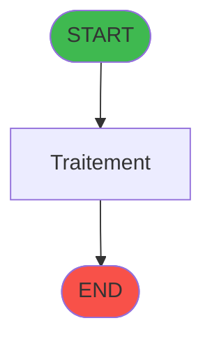
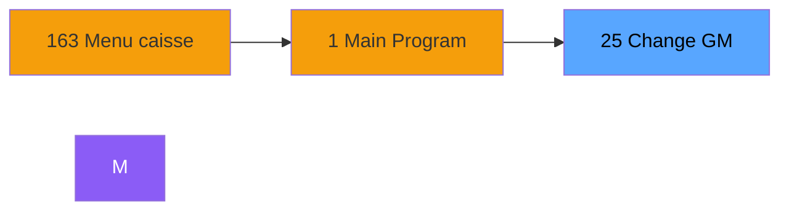
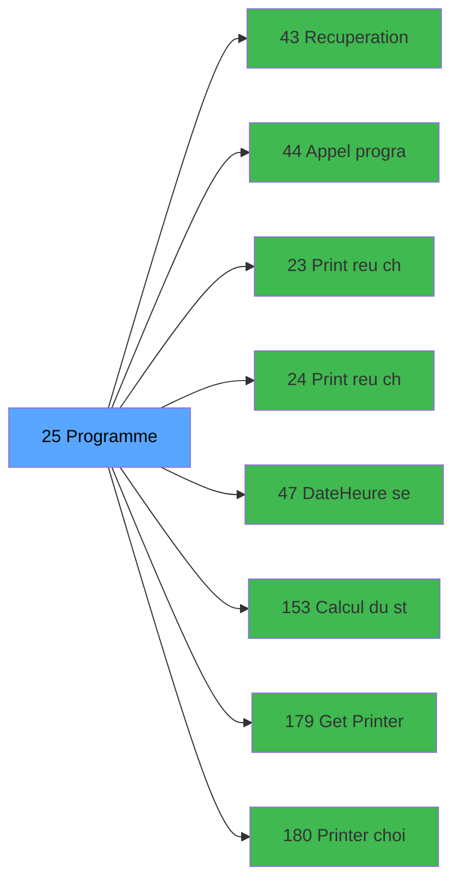

# ADH IDE 25 - Change GM

> **Version spec**: 3.5
> **Analyse**: 2026-01-27 17:56
> **Source**: `Prg_XXX.xml`

---

<!-- TAB:Fonctionnel -->

## SPECIFICATION FONCTIONNELLE

### 1.1 Objectif metier

| Element | Description |
|---------|-------------|
| **Qui** | Operateur |
| **Quoi** | Change GM
 |
| **Pourquoi** | A documenter |
| **Declencheur** | A identifier |

### 1.2 Regles metier

| Code | Regle | Condition |
|------|-------|-----------|
| RM-001 | A documenter | - |

### 1.3 Flux utilisateur

1. Demarrage programme
2. Traitement principal
3. Fin programme

### 1.4 Cas d'erreur

| Erreur | Comportement |
|--------|--------------|
| - | A documenter |

---

<!-- TAB:Technique -->

## SPECIFICATION TECHNIQUE

### 2.1 Identification

| Attribut | Valeur |
|----------|--------|
| **Format IDE** | ADH IDE 25 |
| **Description** | Change GM
 |
| **Module** | ADH |

### 2.2 Tables

| # | Nom logique | Nom physique | Acces | Usage |
|---|-------------|--------------|-------|-------|
| 23 | reseau_cloture___rec | `cafil001_dat` | R | 1x |
| 23 | reseau_cloture___rec | `cafil001_dat` | **W** | 4x |
| 30 | gm-recherche_____gmr | `cafil008_dat` | L | 1x |
| 30 | gm-recherche_____gmr | `cafil008_dat` | R | 1x |
| 35 | personnel_go______go | `cafil013_dat` | R | 1x |
| 44 | change___________chg | `cafil022_dat` | L | 1x |
| 44 | change___________chg | `cafil022_dat` | R | 1x |
| 44 | change___________chg | `cafil022_dat` | **W** | 2x |
| 47 | compte_gm________cgm | `cafil025_dat` | **W** | 2x |
| 50 | moyens_reglement_mor | `cafil028_dat` | L | 1x |
| 50 | moyens_reglement_mor | `cafil028_dat` | R | 1x |
| 68 | compteurs________cpt | `cafil046_dat` | **W** | 1x |
| 70 | date_comptable___dat | `cafil048_dat` | L | 1x |
| 124 | type_taux_change | `cafil102_dat` | L | 1x |
| 139 | moyens_reglement_mor | `cafil117_dat` | L | 3x |
| 141 | devises__________dev | `cafil119_dat` | R | 1x |
| 147 | change_vente_____chg | `cafil125_dat` | L | 2x |
| 147 | change_vente_____chg | `cafil125_dat` | **W** | 2x |
| 474 | comptage_caisse_devise | `%club_user%_caisse_compcais_devise` | R | 2x |
| 474 | comptage_caisse_devise | `%club_user%_caisse_compcais_devise` | **W** | 1x |
| 945 | Table_945 | - | **W** | 1x |
### 2.3 Parametres d'entree

| Variable | Nom | Type | Picture |
|----------|-----|------|---------|
| - | Aucun parametre | - | - |
### 2.4 Algorigramme

### 2.5 Expressions cles

| IDE | Expression | Commentaire |
|-----|------------|-------------|
| 1 | `{0,1}=''` | - |
| 2 | `'C'` | - |
| 3 | `Trim ({0,34})` | - |
| 4 | `55` | - |
| 5 | `'&Quitter'` | - |
| 6 | `'&Annuler'` | - |
| 7 | `'&Creer change'` | - |
| 8 | `{0,1}` | - |
| 9 | `{0,17}<>'F'` | - |
| 10 | `{0,17}='F'` | - |
| 11 | `{0,26}` | - |
| 12 | `{32768,1}` | - |
| 13 | `{0,24}<>'R'` | - |
| 14 | `{0,15}='B'` | - |
| 15 | `'A'` | - |
| 16 | `{0,15}<>'B'` | - |
| 17 | `'F'` | - |
| 18 | `{0,36}=''` | - |
| 19 | `{0,2}` | - |
| 20 | `{0,3}` | - |

> **Total**: 24 expressions (affichees: 20)
### 2.6 Variables importantes

### 2.7 Statistiques

| Metrique | Valeur |
|----------|--------|
| **Taches** | 23 |
| **Lignes logique** | 642 |
| **Lignes desactivees** | 0 |
---

<!-- TAB:Cartographie -->

## CARTOGRAPHIE APPLICATIVE

### 3.1 Chaine d'appels depuis Main

### 3.2 Callers directs

| IDE | Programme | Nb appels |
|-----|-----------|-----------|
| 163 | Menu caisse GM - scroll | 1 |
### 3.3 Callees

| Niv | IDE | Programme | Nb appels |
|-----|-----|-----------|-----------|
| 1 | 43 | Recuperation du titre | 4 |
| 1 | 44 | Appel programme | 3 |
| 1 | 23 | Print reçu change achat | 1 |
| 1 | 24 | Print reçu change vente | 1 |
| 1 | 47 | Date/Heure session user | 1 |
| 1 | 153 | Calcul du stock devise | 1 |
| 1 | 179 | Get Printer | 1 |
| 1 | 180 | Printer choice | 1 |
| 1 | 181 | Set Listing Number | 1 |
| 1 | 182 | Raz Current Printer | 1 |
| 1 | 258 | Zoom mode paiement change GM | 1 |
| 1 | 261 | Zoom des types de taux | 1 |
| 1 | 265 | Zoom devise | 1 |
| 1 | 270 | Zoom sur modes de paiement a/v | 1 |
### 3.4 Verification orphelin

| Critere | Resultat |
|---------|----------|
| Callers actifs | A verifier |
| **Conclusion** | A analyser |

---

## HISTORIQUE

| Date | Action | Auteur |
|------|--------|--------|
| 2026-01-27 20:18 | **DATA V2** - Tables reelles, Expressions, Stats, CallChain | Script |
| 2026-01-27 19:44 | **DATA POPULATED** - Tables, Callgraph (24 expr) | Script |
| 2026-01-27 17:56 | **Upgrade V3.5** - TAB markers, Mermaid | Claude |

---

*Specification V3.5 - Format avec TAB markers et Mermaid*
