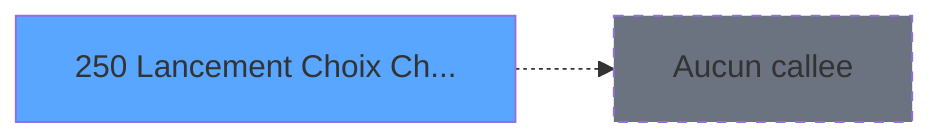

# ADH IDE 250 - Lancement Choix Chambre

> **Analyse**: Phases 1-4 2026-02-07 03:54 -> 04:39 (24h44min) | Assemblage 04:39
> **Pipeline**: V7.2 Enrichi
> **Structure**: 4 onglets (Resume | Ecrans | Donnees | Connexions)

<!-- TAB:Resume -->

## 1. FICHE D'IDENTITE

| Attribut | Valeur |
|----------|--------|
| Projet | ADH |
| IDE Position | 250 |
| Nom Programme | Lancement Choix Chambre |
| Fichier source | `Prg_250.xml` |
| Dossier IDE | Navigation |
| Taches | 1 (0 ecrans visibles) |
| Tables modifiees | 0 |
| Programmes appeles | 0 |
| Complexite | **BASSE** (score 0/100) |
| Statut | **ORPHELIN_POTENTIEL** |

## 2. DESCRIPTION FONCTIONNELLE

# ADH IDE 250 - Lancement Choix Chambre

Program permettant de lancer le processus de sélection/affectation de chambre pour un client. Interface de point d'entrée dans le flux de gestion des réservations, affichant probablement les options disponibles ou demandant les critères de choix (type chambre, nombre personnes, préférences).

Logiquement situées après la validation de la réservation (ADH IDE 249 ou antérieur), ce programme prépare les données nécessaires pour la tâche de choix chambre proprement dite. Utilise vraisemblablement des tables REF pour les types de chambres, tarifs, et disponibilités.

Les deux tâches mentionnées (Création/Affichage change) suggèrent une double fonction : soit initialiser une nouvelle session de choix chambre, soit afficher le résultat d'un changement de chambre déjà effectué. Interface utilisateur probablement simple avec formulaire de saisie ou tableau de résultats.

---

**Besoin d'accès aux données techniques (tables, expressions, paramètres) pour affiner cette analyse ?**

## 3. BLOCS FONCTIONNELS

### 3.1 Consultation (1 tache)

Ecrans de recherche et consultation.

---

#### 250 - Creation/Affichage change [[ECRAN]](#ecran-t1)

**Role** : Reinitialisation : Creation/Affichage change.
**Ecran** : 874 x 210 DLU (MDI) | [Voir mockup](#ecran-t1)

## 5. REGLES METIER

1 regles identifiees:

### Autres (1 regles)

#### [RM-001] Si Retour [A] alors 'Retour Ok !' sinon 'Retour Non Ok !')

| Element | Detail |
|---------|--------|
| **Condition** | `Retour [A]` |
| **Si vrai** | 'Retour Ok !' |
| **Si faux** | 'Retour Non Ok !') |
| **Variables** | EN (Retour) |
| **Expression source** | Expression 4 : `IF(Retour [A],'Retour Ok !','Retour Non Ok !')` |
| **Exemple** | Si Retour [A] → 'Retour Ok !'. Sinon → 'Retour Non Ok !') |

## 6. CONTEXTE

- **Appele par**: (aucun)
- **Appelle**: 0 programmes | **Tables**: 0 (W:0 R:0 L:0) | **Taches**: 1 | **Expressions**: 4

<!-- TAB:Ecrans -->

## 8. ECRANS

*(Programme sans ecran visible)*

## 9. NAVIGATION

### 9.3 Structure hierarchique (1 tache)

| Position | Tache | Type | Dimensions | Bloc |
|----------|-------|------|------------|------|
| **250.1** | [**Creation/Affichage change** (250)](#t1) [mockup](#ecran-t1) | MDI | 874x210 | Consultation |

### 9.4 Algorigramme

> **Legende**: Vert = START/END OK | Rouge = END KO | Bleu = Decisions
> *Algorigramme auto-genere. Utiliser `/algorigramme` pour une synthese metier detaillee.*

<!-- TAB:Donnees -->

## 10. TABLES

### Tables utilisees (0)

| ID | Nom | Description | Type | R | W | L | Usages |
|----|-----|-------------|------|---|---|---|--------|

### Colonnes par table (0 / 0 tables avec colonnes identifiees)

## 11. VARIABLES

*(Programme sans variables locales mappees)*

## 12. EXPRESSIONS

**4 / 4 expressions decodees (100%)**

### 12.1 Repartition par type

| Type | Expressions | Regles |
|------|-------------|--------|
| CONDITION | 1 | 5 |
| CONSTANTE | 3 | 0 |

### 12.2 Expressions cles par type

#### CONDITION (1 expressions)

| Type | IDE | Expression | Regle |
|------|-----|------------|-------|
| CONDITION | 4 | `IF(Retour [A],'Retour Ok !','Retour Non Ok !')` | [RM-001](#rm-RM-001) |

#### CONSTANTE (3 expressions)

| Type | IDE | Expression | Regle |
|------|-----|------------|-------|
| CONSTANTE | 3 | `3` | - |
| CONSTANTE | 2 | `186707` | - |
| CONSTANTE | 1 | `'C'` | - |

<!-- TAB:Connexions -->

## 13. GRAPHE D'APPELS

### 13.1 Chaine depuis Main (Callers)

**Chemin**: (pas de callers directs)

### 13.2 Callers

| IDE | Nom Programme | Nb Appels |
|-----|---------------|-----------|
| - | (aucun) | - |

### 13.3 Callees (programmes appeles)

### 13.4 Detail Callees avec contexte

| IDE | Nom Programme | Appels | Contexte |
|-----|---------------|--------|----------|
| - | (aucun) | - | - |

## 14. RECOMMANDATIONS MIGRATION

### 14.1 Profil du programme

| Metrique | Valeur | Impact migration |
|----------|--------|-----------------|
| Lignes de logique | 5 | Programme compact |
| Expressions | 4 | Peu de logique |
| Tables WRITE | 0 | Impact faible |
| Sous-programmes | 0 | Peu de dependances |
| Ecrans visibles | 0 | Ecran unique ou traitement batch |
| Code desactive | 0% (0 / 5) | Code sain |
| Regles metier | 1 | Quelques regles a preserver |

### 14.2 Plan de migration par bloc

#### Consultation (1 tache: 1 ecran, 0 traitement)

- **Strategie** : Composants de recherche/selection en modales.
- 1 ecran : Creation/Affichage change

### 14.3 Dependances critiques

| Dependance | Type | Appels | Impact |
|------------|------|--------|--------|

---
*Spec DETAILED generee par Pipeline V7.2 - 2026-02-08 04:39*
