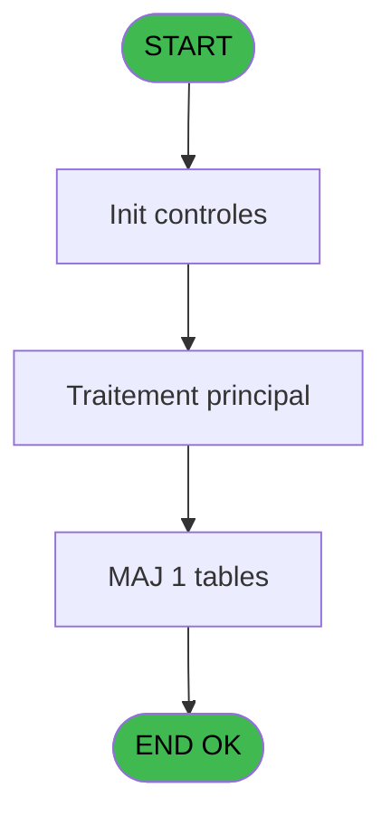

# ADH IDE 251 - Creation pied Ticket

> **Analyse**: Phases 1-4 2026-02-08 04:39 -> 04:39 (4s) | Assemblage 04:39
> **Pipeline**: V7.2 Enrichi
> **Structure**: 4 onglets (Resume | Ecrans | Donnees | Connexions)

<!-- TAB:Resume -->

## 1. FICHE D'IDENTITE

| Attribut | Valeur |
|----------|--------|
| Projet | ADH |
| IDE Position | 251 |
| Nom Programme | Creation pied Ticket |
| Fichier source | `Prg_251.xml` |
| Dossier IDE | Impression |
| Taches | 1 (0 ecrans visibles) |
| Tables modifiees | 1 |
| Programmes appeles | 0 |
| Complexite | **BASSE** (score 7/100) |
| Statut | **ORPHELIN_POTENTIEL** |

## 2. DESCRIPTION FONCTIONNELLE

**ADH IDE 251 - Création pied Ticket** génère le footer du ticket de caisse (impression) en enrichissant les données avec les informations de terminal TPE (Terminal de Paiement Électronique). Le programme enregistre une trace dans la table `log_maj_tpe` pour assurer la traçabilité des opérations de paiement effectuées à la caisse.

Comportement de base : accepte les données du ticket en cours, ajoute les informations spécifiques TPE (numéro terminal, date/heure d'opération, signature si nécessaire) et écrit un enregistrement de log pour audit. Aucun paramètre d'entrée, une seule table manipulée en écriture.

⚠️ **Alerte migration** : Le programme est actuellement orphelin (aucun appelant détecté). À vérifier si c'est intentionnel ou si un lien dynamique `ProgIdx('nom')` le sollicite. Logique simple et isolée, facilement migrée en utilitaire standalone une fois l'usage clarifiée.

## 3. BLOCS FONCTIONNELS

## 5. REGLES METIER

*(Aucune regle metier identifiee dans les expressions)*

## 6. CONTEXTE

- **Appele par**: (aucun)
- **Appelle**: 0 programmes | **Tables**: 1 (W:1 R:0 L:0) | **Taches**: 1 | **Expressions**: 13

<!-- TAB:Ecrans -->

## 8. ECRANS

*(Programme sans ecran visible)*

## 9. NAVIGATION

### 9.3 Structure hierarchique (0 tache)

| Position | Tache | Type | Dimensions | Bloc |
|----------|-------|------|------------|------|

### 9.4 Algorigramme

> **Legende**: Vert = START/END OK | Rouge = END KO | Bleu = Decisions
> *Algorigramme auto-genere. Utiliser `/algorigramme` pour une synthese metier detaillee.*

<!-- TAB:Donnees -->

## 10. TABLES

### Tables utilisees (1)

| ID | Nom | Description | Type | R | W | L | Usages |
|----|-----|-------------|------|---|---|---|--------|
| 867 | log_maj_tpe |  | DB |   | **W** |   | 1 |

### Colonnes par table (1 / 1 tables avec colonnes identifiees)

Table 867 - log_maj_tpe (**W**) - 1 usages

| Lettre | Variable | Acces | Type |
|--------|----------|-------|------|
| A | P.Societe | W | Alpha |
| B | P.Compte_Gm | W | Numeric |
| C | P.filiation | W | Numeric |
| D | P.Taux | W | Numeric |
| E | P.Montant Ht | W | Numeric |
| F | P.Montant Tva | W | Numeric |
| G | P.Montant Ttc | W | Numeric |

## 11. VARIABLES

### 11.1 Parametres entrants (7)

Variables recues en parametre.

| Lettre | Nom | Type | Usage dans |
|--------|-----|------|-----------|
| EN | P.Societe | Alpha | - |
| EO | P.Compte_Gm | Numeric | 1x parametre entrant |
| EP | P.filiation | Numeric | - |
| EQ | P.Taux | Numeric | 1x parametre entrant |
| ER | P.Montant Ht | Numeric | 2x parametre entrant |
| ES | P.Montant Tva | Numeric | 2x parametre entrant |
| ET | P.Montant Ttc | Numeric | 2x parametre entrant |

## 12. EXPRESSIONS

**13 / 13 expressions decodees (100%)**

### 12.1 Repartition par type

| Type | Expressions | Regles |
|------|-------------|--------|
| CALCULATION | 6 | 0 |
| CONSTANTE | 4 | 0 |
| OTHER | 2 | 0 |
| STRING | 1 | 0 |

### 12.2 Expressions cles par type

#### CALCULATION (6 expressions)

| Type | IDE | Expression | Regle |
|------|-----|------------|-------|
| CALCULATION | 7 | `[W]+P.Montant Ht [E]` | - |
| CALCULATION | 8 | `[X]+P.Montant Tva [F]` | - |
| CALCULATION | 9 | `[Y]+P.Montant Ttc [G]` | - |
| CALCULATION | 3 | `[N]+P.Montant Ht [E]` | - |
| CALCULATION | 4 | `[O]+P.Montant Tva [F]` | - |
| ... | | *+1 autres* | |

#### CONSTANTE (4 expressions)

| Type | IDE | Expression | Regle |
|------|-----|------------|-------|
| CONSTANTE | 11 | `'TICK'` | - |
| CONSTANTE | 13 | `0` | - |
| CONSTANTE | 6 | `999` | - |
| CONSTANTE | 10 | `'C'` | - |

#### OTHER (2 expressions)

| Type | IDE | Expression | Regle |
|------|-----|------------|-------|
| OTHER | 12 | `P.Compte_Gm [B]` | - |
| OTHER | 2 | `P.Taux [D]` | - |

#### STRING (1 expressions)

| Type | IDE | Expression | Regle |
|------|-----|------------|-------|
| STRING | 1 | `Val(Fill ('9',10),'10')` | - |

<!-- TAB:Connexions -->

## 13. GRAPHE D'APPELS

### 13.1 Chaine depuis Main (Callers)

**Chemin**: (pas de callers directs)

### 13.2 Callers

| IDE | Nom Programme | Nb Appels |
|-----|---------------|-----------|
| - | (aucun) | - |

### 13.3 Callees (programmes appeles)

### 13.4 Detail Callees avec contexte

| IDE | Nom Programme | Appels | Contexte |
|-----|---------------|--------|----------|
| - | (aucun) | - | - |

## 14. RECOMMANDATIONS MIGRATION

### 14.1 Profil du programme

| Metrique | Valeur | Impact migration |
|----------|--------|-----------------|
| Lignes de logique | 50 | Programme compact |
| Expressions | 13 | Peu de logique |
| Tables WRITE | 1 | Impact faible |
| Sous-programmes | 0 | Peu de dependances |
| Ecrans visibles | 0 | Ecran unique ou traitement batch |
| Code desactive | 0% (0 / 50) | Code sain |
| Regles metier | 0 | Pas de regle identifiee |

### 14.2 Plan de migration par bloc

### 14.3 Dependances critiques

| Dependance | Type | Appels | Impact |
|------------|------|--------|--------|
| log_maj_tpe | Table WRITE (Database) | 1x | Schema + repository |

---
*Spec DETAILED generee par Pipeline V7.2 - 2026-02-08 04:40*
