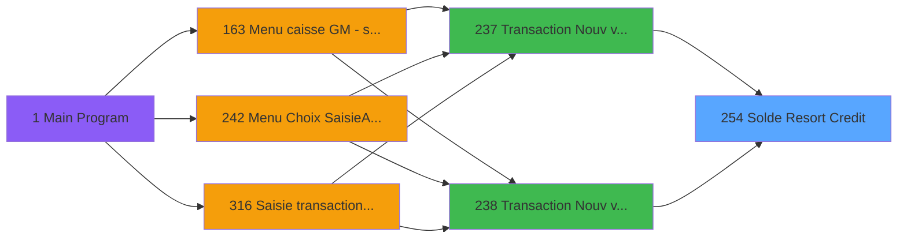

# ADH IDE 254 - Solde Resort Credit

> **Analyse**: Phases 1-4 2026-01-30 09:43 -> 09:43 (8s) | Assemblage 09:43
> **Pipeline**: V7.2 Enrichi
> **Structure**: 4 onglets (Resume | Ecrans | Donnees | Connexions)

<!-- TAB:Resume -->

## 1. FICHE D'IDENTITE

| Attribut | Valeur |
|----------|--------|
| Projet | ADH |
| IDE Position | 254 |
| Nom Programme | Solde Resort Credit |
| Fichier source | `Prg_254.xml` |
| Domaine metier | Comptabilite |
| Taches | 1 (1 ecrans visibles) |
| Tables modifiees | 0 |
| Programmes appeles | 0 |

## 2. DESCRIPTION FONCTIONNELLE

**Solde Resort Credit** assure la gestion complete de ce processus, accessible depuis [Transaction Nouv vente PMS-584 (IDE 0)](ADH-IDE-0.md), [Transaction Nouv vente PMS-710 (IDE 0)](ADH-IDE-0.md), [Transaction Nouv vente PMS-721 (IDE 0)](ADH-IDE-0.md), [Transaction Nouv vente avec GP (IDE 237)](ADH-IDE-237.md), [Transaction Nouv vente PMS-584 (IDE 238)](ADH-IDE-238.md), [Transaction Nouv vente PMS-721 (IDE 239)](ADH-IDE-239.md), [Transaction Nouv vente PMS-710 (IDE 240)](ADH-IDE-240.md).

Le flux de traitement s'organise en **1 blocs fonctionnels** :

- **Traitement** (1 tache) : traitements metier divers

**Logique metier** : 1 regles identifiees couvrant conditions metier.

## 3. BLOCS FONCTIONNELS

### 3.1 Traitement (1 tache)

Traitements internes.

---

#### T1 - Veuillez patienter... [ECRAN]

**Role** : Traitement interne.
**Ecran** : 422 x 56 DLU (MDI) | [Voir mockup](#ecran-t1)

## 5. REGLES METIER

1 regles identifiees:

### Autres (1 regles)

#### [RM-001] Si [J]>[K] alors [J]-[K] sinon 0)

| Element | Detail |
|---------|--------|
| **Condition** | `IF([J]>[K],[J]-[K],0)` |
| **Action** | Si [J]>[K] alors [J]-[K] sinon 0) |

## 6. CONTEXTE

- **Appele par**: [Transaction Nouv vente PMS-584 (IDE 0)](ADH-IDE-0.md), [Transaction Nouv vente PMS-710 (IDE 0)](ADH-IDE-0.md), [Transaction Nouv vente PMS-721 (IDE 0)](ADH-IDE-0.md), [Transaction Nouv vente avec GP (IDE 237)](ADH-IDE-237.md), [Transaction Nouv vente PMS-584 (IDE 238)](ADH-IDE-238.md), [Transaction Nouv vente PMS-721 (IDE 239)](ADH-IDE-239.md), [Transaction Nouv vente PMS-710 (IDE 240)](ADH-IDE-240.md)
- **Appelle**: 0 programmes | **Tables**: 1 (W:0 R:1 L:0) | **Taches**: 1 | **Expressions**: 7

<!-- TAB:Ecrans -->

## 8. ECRANS

### 8.1 Forms visibles (1 / 1)

| # | Position | Tache | Nom | Type | Largeur | Hauteur | Bloc |
|---|----------|-------|-----|------|---------|---------|------|
| 1 | 254.1 | T1 | Veuillez patienter... | MDI | 422 | 56 | Traitement |

### 8.2 Mockups Ecrans

---

#### 254.1 - Veuillez patienter...
**Tache** : [T1](#t1) | **Type** : MDI | **Dimensions** : 422 x 56 DLU
**Bloc** : Traitement | **Titre IDE** : Veuillez patienter...

<!-- FORM-DATA:
{
    "width":  422,
    "controls":  [
                     {
                         "w":  130,
                         "readonly":  true,
                         "y":  13,
                         "type":  "edit",
                         "x":  10,
                         "label":  "P0 societe",
                         "h":  20,
                         "var":  "A"
                     },
                     {
                         "w":  130,
                         "readonly":  true,
                         "y":  13,
                         "type":  "edit",
                         "x":  150,
                         "label":  "P0 compte",
                         "h":  20,
                         "var":  "B"
                     },
                     {
                         "w":  130,
                         "readonly":  true,
                         "y":  13,
                         "type":  "edit",
                         "x":  290,
                         "label":  "P0 filiation",
                         "h":  20,
                         "var":  "C"
                     },
                     {
                         "w":  130,
                         "readonly":  true,
                         "y":  13,
                         "type":  "edit",
                         "x":  430,
                         "label":  "P0 service",
                         "h":  20,
                         "var":  "D"
                     },
                     {
                         "w":  130,
                         "readonly":  true,
                         "y":  13,
                         "type":  "edit",
                         "x":  570,
                         "label":  "P0 solde resort credit",
                         "h":  20,
                         "var":  "E"
                     }
                 ],
    "type":  "MDI",
    "height":  56,
    "taskId":  1
}
-->

**Champs :**

| Variable | Nom | Type | Saisie |
|----------|-----|------|--------|
| A | P0 societe | Alpha | Lecture |
| B | P0 compte | Numeric | Lecture |
| C | P0 filiation | Numeric | Lecture |
| D | P0 service | Unicode | Lecture |
| E | P0 solde resort credit | Numeric | Lecture |

## 9. NAVIGATION

Ecran unique: **Veuillez patienter...**

### 9.3 Structure hierarchique (1 tache)

- **254.1** [Veuillez patienter... (T1)](#t1) **[ECRAN]** (MDI) 422x56 -> [mockup](#ecran-t1) *[Traitement]*

<!-- TAB:Donnees -->

## 10. TABLES

### Tables utilisees (1)

| ID | Nom | Description | Type | R | W | L | Usages |
|----|-----|-------------|------|---|---|---|--------|
| 980 | Table_980 |  | MEM | R |   |   | 1 |

### Colonnes par table

Table 980 - Table_980 (R) - 1 usages

*Colonnes accessibles via outils MCP (`magic_get_line`)*

## 11. VARIABLES

### 11.1 Parametres entrants (5)

Variables recues du programme appelant ([Transaction Nouv vente PMS-584 (IDE 0)](ADH-IDE-0.md)).

| Lettre | Nom | Type | Usage dans |
|--------|-----|------|-----------|
| A | P0 societe | Alpha | 1x refs |
| B | P0 compte | Numeric | 1x refs |
| C | P0 filiation | Numeric | 1x refs |
| D | P0 service | Unicode | 1x refs |
| E | P0 solde resort credit | Numeric | - |

## 12. EXPRESSIONS

**7 / 7 expressions decodees (100%)**

### 12.1 Repartition par type

| Type | Expressions | Regles |
|------|-------------|--------|
| CONDITION | 1 | 5 |
| OTHER | 6 | 0 |

### 12.2 Expressions cles par type

#### CONDITION (1 expressions)

| Type | IDE | Expression | Regle |
|------|-----|------------|-------|
| CONDITION | 7 | `IF([J]>[K],[J]-[K],0)` | [RM-001](#rm-RM-001) |

#### OTHER (6 expressions)

| Type | IDE | Expression | Regle |
|------|-----|------------|-------|
| OTHER | 4 | `P0 compte [B]` | - |
| OTHER | 5 | `P0 filiation [C]` | - |
| OTHER | 6 | `P0 service [D]` | - |
| OTHER | 1 | `SetCrsr (1)` | - |
| OTHER | 2 | `SetCrsr (2)` | - |
| ... | | *+1 autres* | |

<!-- TAB:Connexions -->

## 13. GRAPHE D'APPELS

### 13.1 Chaine depuis Main (Callers)

Main -> ... -> [Transaction Nouv vente PMS-584 (IDE 0)](ADH-IDE-0.md) -> **Solde Resort Credit (IDE 254)**

Main -> ... -> [Transaction Nouv vente PMS-710 (IDE 0)](ADH-IDE-0.md) -> **Solde Resort Credit (IDE 254)**

Main -> ... -> [Transaction Nouv vente PMS-721 (IDE 0)](ADH-IDE-0.md) -> **Solde Resort Credit (IDE 254)**

Main -> ... -> [Transaction Nouv vente avec GP (IDE 237)](ADH-IDE-237.md) -> **Solde Resort Credit (IDE 254)**

Main -> ... -> [Transaction Nouv vente PMS-584 (IDE 238)](ADH-IDE-238.md) -> **Solde Resort Credit (IDE 254)**

Main -> ... -> [Transaction Nouv vente PMS-721 (IDE 239)](ADH-IDE-239.md) -> **Solde Resort Credit (IDE 254)**

Main -> ... -> [Transaction Nouv vente PMS-710 (IDE 240)](ADH-IDE-240.md) -> **Solde Resort Credit (IDE 254)**

### 13.2 Callers

| IDE | Nom Programme | Nb Appels |
|-----|---------------|-----------|
| [0](ADH-IDE-0.md) | Transaction Nouv vente PMS-584 | 1 |
| [0](ADH-IDE-0.md) | Transaction Nouv vente PMS-710 | 1 |
| [0](ADH-IDE-0.md) | Transaction Nouv vente PMS-721 | 1 |
| [237](ADH-IDE-237.md) | Transaction Nouv vente avec GP | 1 |
| [238](ADH-IDE-238.md) | Transaction Nouv vente PMS-584 | 1 |
| [239](ADH-IDE-239.md) | Transaction Nouv vente PMS-721 | 1 |
| [240](ADH-IDE-240.md) | Transaction Nouv vente PMS-710 | 1 |

### 13.3 Callees (programmes appeles)

### 13.4 Detail Callees avec contexte

| IDE | Nom Programme | Appels | Contexte |
|-----|---------------|--------|----------|
| - | (aucun) | - | - |

## 14. RECOMMANDATIONS MIGRATION

### 14.1 Profil du programme

| Metrique | Valeur | Impact migration |
|----------|--------|-----------------|
| Lignes de logique | 18 | Programme compact |
| Expressions | 7 | Peu de logique |
| Tables WRITE | 0 | Impact faible |
| Sous-programmes | 0 | Peu de dependances |
| Ecrans visibles | 1 | Ecran unique ou traitement batch |
| Code desactive | 0% (0 / 18) | Code sain |
| Regles metier | 1 | Quelques regles a preserver |

### 14.2 Plan de migration par bloc

#### Traitement (1 tache: 1 ecran, 0 traitement)

- Traitement standard a migrer

### 14.3 Dependances critiques

| Dependance | Type | Appels | Impact |
|------------|------|--------|--------|

---
*Spec DETAILED generee par Pipeline V7.2 - 2026-01-30 09:43*
