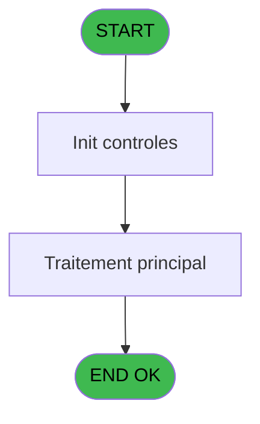
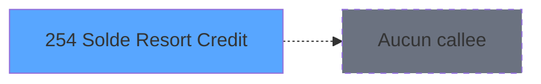

# ADH IDE 254 - Solde Resort Credit

> **Analyse**: Phases 1-4 2026-02-08 04:41 -> 04:41 (4s) | Assemblage 04:41
> **Pipeline**: V7.2 Enrichi
> **Structure**: 4 onglets (Resume | Ecrans | Donnees | Connexions)

<!-- TAB:Resume -->

## 1. FICHE D'IDENTITE

| Attribut | Valeur |
|----------|--------|
| Projet | ADH |
| IDE Position | 254 |
| Nom Programme | Solde Resort Credit |
| Fichier source | `Prg_254.xml` |
| Dossier IDE | Comptabilite |
| Taches | 1 (0 ecrans visibles) |
| Tables modifiees | 0 |
| Programmes appeles | 0 |
| Complexite | **BASSE** (score 0/100) |
| Statut | **ORPHELIN_POTENTIEL** |

## 2. DESCRIPTION FONCTIONNELLE

ADH IDE 254 - Solde Resort Credit calcule le solde disponible en Resort Credit pour un compte membre. Le programme lit la table de gestion des Resort Credits (crédits de séjour) et compare le montant attribué au montant déjà utilisé. La logique retourne le solde restant ou zéro si le crédit est entièrement consommé.

Ce programme est appelé dans le flux de ventes (ADH IDE 250) pour afficher les informations de solde au client avant une transaction. Il s'inscrit dans l'écosystème des programmes de consultation de solde (ADH IDE 192 SOLDE_COMPTE, ADH IDE 237 solde Gift Pass) et utilise des tables de référence partagées pour identifier les services associés au Resort Credit.

Le calcul suit une logique simple : `IF(attribué > utilisé, attribué - utilisé, 0)`. Les paramètres d'entrée incluent la clé de compte (sociétés, compte, filiation) et optionnellement le numéro de service pour filtrer les crédits par type de prestation.

## 3. BLOCS FONCTIONNELS

## 5. REGLES METIER

1 regles identifiees:

### Autres (1 regles)

#### [RM-001] Si [J]>[K] alors [J]-[K] sinon 0)

| Element | Detail |
|---------|--------|
| **Condition** | `[J]>[K]` |
| **Si vrai** | [J]-[K] |
| **Si faux** | 0) |
| **Expression source** | Expression 7 : `IF([J]>[K],[J]-[K],0)` |
| **Exemple** | Si [J]>[K] → [J]-[K]. Sinon → 0) |

## 6. CONTEXTE

- **Appele par**: (aucun)
- **Appelle**: 0 programmes | **Tables**: 1 (W:0 R:1 L:0) | **Taches**: 1 | **Expressions**: 7

<!-- TAB:Ecrans -->

## 8. ECRANS

*(Programme sans ecran visible)*

## 9. NAVIGATION

### 9.3 Structure hierarchique (0 tache)

| Position | Tache | Type | Dimensions | Bloc |
|----------|-------|------|------------|------|

### 9.4 Algorigramme

> **Legende**: Vert = START/END OK | Rouge = END KO | Bleu = Decisions
> *Algorigramme auto-genere. Utiliser `/algorigramme` pour une synthese metier detaillee.*

<!-- TAB:Donnees -->

## 10. TABLES

### Tables utilisees (1)

| ID | Nom | Description | Type | R | W | L | Usages |
|----|-----|-------------|------|---|---|---|--------|
| 980 | Table_980 |  | MEM | R |   |   | 1 |

### Colonnes par table (1 / 1 tables avec colonnes identifiees)

Table 980 - Table_980 (R) - 1 usages

| Lettre | Variable | Acces | Type |
|--------|----------|-------|------|
| A | P0 societe | R | Alpha |
| B | P0 compte | R | Numeric |
| C | P0 filiation | R | Numeric |
| D | P0 service | R | Unicode |
| E | P0 solde resort credit | R | Numeric |

## 11. VARIABLES

### 11.1 Parametres entrants (5)

Variables recues en parametre.

| Lettre | Nom | Type | Usage dans |
|--------|-----|------|-----------|
| EN | P0 societe | Alpha | 1x parametre entrant |
| EO | P0 compte | Numeric | 1x parametre entrant |
| EP | P0 filiation | Numeric | 1x parametre entrant |
| EQ | P0 service | Unicode | 1x parametre entrant |
| ER | P0 solde resort credit | Numeric | - |

## 12. EXPRESSIONS

**7 / 7 expressions decodees (100%)**

### 12.1 Repartition par type

| Type | Expressions | Regles |
|------|-------------|--------|
| CONDITION | 1 | 5 |
| OTHER | 6 | 0 |

### 12.2 Expressions cles par type

#### CONDITION (1 expressions)

| Type | IDE | Expression | Regle |
|------|-----|------------|-------|
| CONDITION | 7 | `IF([J]>[K],[J]-[K],0)` | [RM-001](#rm-RM-001) |

#### OTHER (6 expressions)

| Type | IDE | Expression | Regle |
|------|-----|------------|-------|
| OTHER | 4 | `P0 compte [B]` | - |
| OTHER | 5 | `P0 filiation [C]` | - |
| OTHER | 6 | `P0 service [D]` | - |
| OTHER | 1 | `SetCrsr (1)` | - |
| OTHER | 2 | `SetCrsr (2)` | - |
| ... | | *+1 autres* | |

<!-- TAB:Connexions -->

## 13. GRAPHE D'APPELS

### 13.1 Chaine depuis Main (Callers)

**Chemin**: (pas de callers directs)

### 13.2 Callers

| IDE | Nom Programme | Nb Appels |
|-----|---------------|-----------|
| - | (aucun) | - |

### 13.3 Callees (programmes appeles)

### 13.4 Detail Callees avec contexte

| IDE | Nom Programme | Appels | Contexte |
|-----|---------------|--------|----------|
| - | (aucun) | - | - |

## 14. RECOMMANDATIONS MIGRATION

### 14.1 Profil du programme

| Metrique | Valeur | Impact migration |
|----------|--------|-----------------|
| Lignes de logique | 18 | Programme compact |
| Expressions | 7 | Peu de logique |
| Tables WRITE | 0 | Impact faible |
| Sous-programmes | 0 | Peu de dependances |
| Ecrans visibles | 0 | Ecran unique ou traitement batch |
| Code desactive | 0% (0 / 18) | Code sain |
| Regles metier | 1 | Quelques regles a preserver |

### 14.2 Plan de migration par bloc

### 14.3 Dependances critiques

| Dependance | Type | Appels | Impact |
|------------|------|--------|--------|

---
*Spec DETAILED generee par Pipeline V7.2 - 2026-02-08 04:41*
