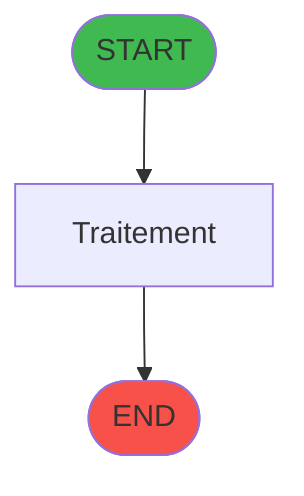
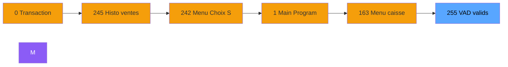
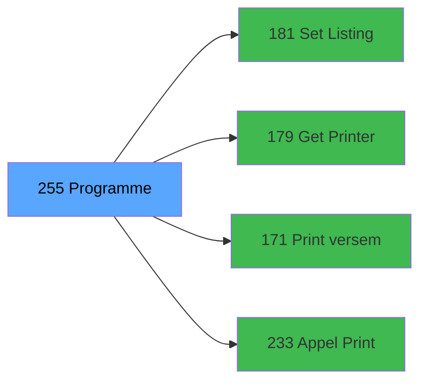

# ADH IDE 255 - VAD validés à imprimer

> **Version spec**: 3.5
> **Analyse**: 2026-01-27 17:57
> **Source**: `Prg_XXX.xml`

---

<!-- TAB:Fonctionnel -->

## SPECIFICATION FONCTIONNELLE

### 1.1 Objectif metier

| Element | Description |
|---------|-------------|
| **Qui** | Operateur |
| **Quoi** | VAD validés à imprimer
 |
| **Pourquoi** | A documenter |
| **Declencheur** | A identifier |

### 1.2 Regles metier

| Code | Regle | Condition |
|------|-------|-----------|
| RM-001 | A documenter | - |

### 1.3 Flux utilisateur

1. Demarrage programme
2. Traitement principal
3. Fin programme

### 1.4 Cas d'erreur

| Erreur | Comportement |
|--------|--------------|
| - | A documenter |

---

<!-- TAB:Technique -->

## SPECIFICATION TECHNIQUE

### 2.1 Identification

| Attribut | Valeur |
|----------|--------|
| **Format IDE** | ADH IDE 255 |
| **Description** | VAD validés à imprimer
 |
| **Module** | ADH |

### 2.2 Tables

| # | Nom logique | Nom physique | Acces | Usage |
|---|-------------|--------------|-------|-------|
| 31 | gm-complet_______gmc | `cafil009_dat` | R | 1x |
| 34 | hebergement______heb | `cafil012_dat` | L | 1x |
| 34 | hebergement______heb | `cafil012_dat` | R | 1x |
| 40 | comptable________cte | `cafil018_dat` | L | 1x |
| 40 | comptable________cte | `cafil018_dat` | R | 1x |
| 69 | initialisation___ini | `cafil047_dat` | L | 2x |
| 122 | unilateral_bilateral | `cafil100_dat` | L | 2x |
| 197 | articles_en_stock | `caisse_artstock` | L | 1x |
| 197 | articles_en_stock | `caisse_artstock` | R | 1x |
| 263 | vente | `caisse_vente` | L | 2x |
| 382 | pv_discount_reasons | `pv_discountlist_dat` | L | 1x |
| 519 | pv_cust_rentals | `%club_user%_pv_rentals_dat` | L | 1x |
| 596 | tempo_ecran_police | `%club_user%tmp_ecrpolice_dat` | L | 2x |
| 804 | valeur_credit_bar_defaut | `valeur_credit_bar_defaut` | L | 2x |
| 847 | stat_lieu_vente_date | `%club_user%_stat_lieu_vente_date` | L | 1x |
| 945 | Table_945 | - | L | 3x |
### 2.3 Parametres d'entree

| Variable | Nom | Type | Picture |
|----------|-----|------|---------|
| - | Aucun parametre | - | - |
### 2.4 Algorigramme

### 2.5 Expressions cles

| IDE | Expression | Commentaire |
|-----|------------|-------------|
| 1 | `{0,1}` | - |
| 2 | `{0,2}` | - |
| 3 | `'VAD'` | - |
| 4 | `{0,9}` | - |
| 5 | `Trim({0,45})` | - |
| 6 | `Date()` | - |
| 7 | `{0,39}` | - |
| 8 | `IF({0,40}<>0,'N11.'&Trim(Str({0,40},'#'))&'CZ',...` | - |
| 9 | `{0,42}` | - |
| 10 | `{0,2}` | - |
| 11 | `'TRUE'LOG` | - |
| 12 | `DbDel('{596,4}'DSOURCE,'')` | - |
| 13 | `{0,11}='VER'` | - |
| 14 | `{0,42}<>'B'` | - |
| 15 | `3` | - |
| 16 | `4` | - |
| 17 | `'C'` | - |
| 18 | `Trim({0,1})=''` | - |
| 19 | `30` | - |

> **Total**: 19 expressions (affichees: 19)
### 2.6 Variables importantes

### 2.7 Statistiques

| Metrique | Valeur |
|----------|--------|
| **Taches** | 4 |
| **Lignes logique** | 451 |
| **Lignes desactivees** | 0 |
---

<!-- TAB:Cartographie -->

## CARTOGRAPHIE APPLICATIVE

### 3.1 Chaine d'appels depuis Main

### 3.2 Callers directs

| IDE | Programme | Nb appels |
|-----|-----------|-----------|
| 0 | Transaction Nouv vente PMS-584 | 2 |
| 0 | Transaction Nouv vente PMS-710 | 2 |
| 0 | Transaction Nouv vente PMS-721 | 2 |
| 244 | Histo ventes payantes /PMS-605 | 1 |
| 245 | Histo ventes payantes /PMS-623 | 1 |
### 3.3 Callees

| Niv | IDE | Programme | Nb appels |
|-----|-----|-----------|-----------|
| 1 | 181 | Set Listing Number | 3 |
| 1 | 179 | Get Printer | 2 |
| 1 | 171 | Print versement retrait | 1 |
| 1 | 233 | Appel Print ticket vente PMS28 | 1 |
### 3.4 Verification orphelin

| Critere | Resultat |
|---------|----------|
| Callers actifs | A verifier |
| **Conclusion** | A analyser |

---

## HISTORIQUE

| Date | Action | Auteur |
|------|--------|--------|
| 2026-01-27 20:24 | **DATA V2** - Tables reelles, Expressions, Stats, CallChain | Script |
| 2026-01-27 19:50 | **DATA POPULATED** - Tables, Callgraph (19 expr) | Script |
| 2026-01-27 17:57 | **Upgrade V3.5** - TAB markers, Mermaid | Claude |

---

*Specification V3.5 - Format avec TAB markers et Mermaid*
