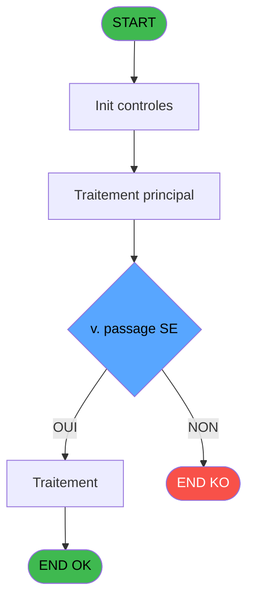
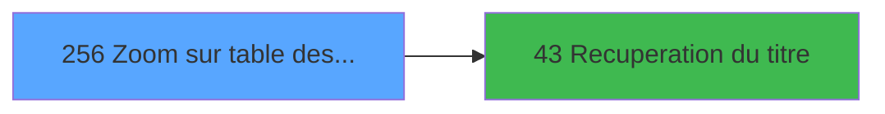

# ADH IDE 256 - Zoom sur table des gratuites

> **Analyse**: Phases 1-4 2026-02-08 04:41 -> 04:41 (4s) | Assemblage 04:41
> **Pipeline**: V7.2 Enrichi
> **Structure**: 4 onglets (Resume | Ecrans | Donnees | Connexions)

<!-- TAB:Resume -->

## 1. FICHE D'IDENTITE

| Attribut | Valeur |
|----------|--------|
| Projet | ADH |
| IDE Position | 256 |
| Nom Programme | Zoom sur table des gratuites |
| Fichier source | `Prg_256.xml` |
| Dossier IDE | Consultation |
| Taches | 1 (0 ecrans visibles) |
| Tables modifiees | 0 |
| Programmes appeles | 1 |
| Complexite | **BASSE** (score 5/100) |
| Statut | **ORPHELIN_POTENTIEL** |

## 2. DESCRIPTION FONCTIONNELLE

Le programme ADH IDE 256 est un zoom permettant de consulter et gérer la table des gratuités. Il s'agit d'une interface de référence qui récupère les données de la table des gratuités (likely `cafil069_dat` ou équivalent) pour affichage en grille.

Ce programme est appelé depuis ADH IDE 43, qui gère la récupération du titre ou du contexte à afficher. Le flux de navigation suggère que c'est un zoom secondaire, accessible depuis un menu ou une recherche dans les tables de paramétrage caisse.

Comme zoom de table de référence, ADH IDE 256 implémente probablement un pattern Browse classique : affichage multi-colonnes des gratuités (code, libellé, description), recherche/filtrage, et possibilité de sélectionner une gratuité pour retour à l'écran appelant. C'est un composant réutilisable du système de gestion caisse.

## 3. BLOCS FONCTIONNELS

## 5. REGLES METIER

1 regles identifiees:

### Autres (1 regles)

#### [RM-001] Negation de (v. passage SE [E]) (condition inversee)

| Element | Detail |
|---------|--------|
| **Condition** | `NOT (v. passage SE [E])` |
| **Si vrai** | Action si vrai |
| **Variables** | ER (v. passage SE) |
| **Expression source** | Expression 1 : `NOT (v. passage SE [E])` |
| **Exemple** | Si NOT (v. passage SE [E]) → Action si vrai |

## 6. CONTEXTE

- **Appele par**: (aucun)
- **Appelle**: 1 programmes | **Tables**: 1 (W:0 R:1 L:0) | **Taches**: 1 | **Expressions**: 10

<!-- TAB:Ecrans -->

## 8. ECRANS

*(Programme sans ecran visible)*

## 9. NAVIGATION

### 9.3 Structure hierarchique (0 tache)

| Position | Tache | Type | Dimensions | Bloc |
|----------|-------|------|------------|------|

### 9.4 Algorigramme

> **Legende**: Vert = START/END OK | Rouge = END KO | Bleu = Decisions
> *Algorigramme auto-genere. Utiliser `/algorigramme` pour une synthese metier detaillee.*

<!-- TAB:Donnees -->

## 10. TABLES

### Tables utilisees (1)

| ID | Nom | Description | Type | R | W | L | Usages |
|----|-----|-------------|------|---|---|---|--------|
| 95 | tables_gratuites_tgr |  | DB | R |   |   | 1 |

### Colonnes par table (1 / 1 tables avec colonnes identifiees)

Table 95 - tables_gratuites_tgr (R) - 1 usages

| Lettre | Variable | Acces | Type |
|--------|----------|-------|------|
| A | > societe | R | Alpha |
| B | <> imputation | R | Numeric |
| C | <> sous imputation | R | Numeric |
| D | <> libelle | R | Alpha |
| E | v. passage SE | R | Logical |
| F | V. titre | R | Alpha |
| G | bouton quitter | R | Alpha |
| H | bouton selectionner | R | Alpha |

## 11. VARIABLES

### 11.1 Variables de session (2)

Variables persistantes pendant toute la session.

| Lettre | Nom | Type | Usage dans |
|--------|-----|------|-----------|
| ER | v. passage SE | Logical | 1x session |
| ES | V. titre | Alpha | - |

### 11.2 Autres (6)

Variables diverses.

| Lettre | Nom | Type | Usage dans |
|--------|-----|------|-----------|
| EN | > societe | Alpha | 1x refs |
| EO | <> imputation | Numeric | - |
| EP | <> sous imputation | Numeric | - |
| EQ | <> libelle | Alpha | - |
| ET | bouton quitter | Alpha | 1x refs |
| EU | bouton selectionner | Alpha | 1x refs |

## 12. EXPRESSIONS

**10 / 10 expressions decodees (100%)**

### 12.1 Repartition par type

| Type | Expressions | Regles |
|------|-------------|--------|
| NEGATION | 1 | 5 |
| CONSTANTE | 3 | 0 |
| CAST_LOGIQUE | 1 | 0 |
| CONDITION | 1 | 0 |
| OTHER | 3 | 0 |
| STRING | 1 | 0 |

### 12.2 Expressions cles par type

#### NEGATION (1 expressions)

| Type | IDE | Expression | Regle |
|------|-----|------------|-------|
| NEGATION | 1 | `NOT (v. passage SE [E])` | [RM-001](#rm-RM-001) |

#### CONSTANTE (3 expressions)

| Type | IDE | Expression | Regle |
|------|-----|------------|-------|
| CONSTANTE | 6 | `19` | - |
| CONSTANTE | 4 | `'&Quitter'` | - |
| CONSTANTE | 3 | `'&Selectionner'` | - |

#### CAST_LOGIQUE (1 expressions)

| Type | IDE | Expression | Regle |
|------|-----|------------|-------|
| CAST_LOGIQUE | 2 | `'TRUE'LOG` | - |

#### CONDITION (1 expressions)

| Type | IDE | Expression | Regle |
|------|-----|------------|-------|
| CONDITION | 7 | `> societe [A]` | - |

#### OTHER (3 expressions)

| Type | IDE | Expression | Regle |
|------|-----|------------|-------|
| OTHER | 10 | `[I]` | - |
| OTHER | 9 | `bouton selectionner [H]` | - |
| OTHER | 8 | `bouton quitter [G]` | - |

#### STRING (1 expressions)

| Type | IDE | Expression | Regle |
|------|-----|------------|-------|
| STRING | 5 | `Trim ([J])` | - |

<!-- TAB:Connexions -->

## 13. GRAPHE D'APPELS

### 13.1 Chaine depuis Main (Callers)

**Chemin**: (pas de callers directs)

### 13.2 Callers

| IDE | Nom Programme | Nb Appels |
|-----|---------------|-----------|
| - | (aucun) | - |

### 13.3 Callees (programmes appeles)

### 13.4 Detail Callees avec contexte

| IDE | Nom Programme | Appels | Contexte |
|-----|---------------|--------|----------|
| [43](ADH-IDE-43.md) | Recuperation du titre | 1 | Recuperation donnees |

## 14. RECOMMANDATIONS MIGRATION

### 14.1 Profil du programme

| Metrique | Valeur | Impact migration |
|----------|--------|-----------------|
| Lignes de logique | 23 | Programme compact |
| Expressions | 10 | Peu de logique |
| Tables WRITE | 0 | Impact faible |
| Sous-programmes | 1 | Peu de dependances |
| Ecrans visibles | 0 | Ecran unique ou traitement batch |
| Code desactive | 0% (0 / 23) | Code sain |
| Regles metier | 1 | Quelques regles a preserver |

### 14.2 Plan de migration par bloc

### 14.3 Dependances critiques

| Dependance | Type | Appels | Impact |
|------------|------|--------|--------|
| [Recuperation du titre (IDE 43)](ADH-IDE-43.md) | Sous-programme | 1x | Normale - Recuperation donnees |

---
*Spec DETAILED generee par Pipeline V7.2 - 2026-02-08 04:42*
