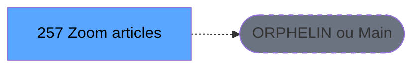

# ADH IDE 257 - Zoom articles

> **Version spec**: 4.0
> **Analyse**: 2026-01-27 23:13
> **Source**: `D:\Data\Migration\XPA\PMS\ADH\Source\Prg_253.xml`
> **Methode**: APEX + PDCA (Auto-generated)

---

<!-- TAB:Fonctionnel -->

## SPECIFICATION FONCTIONNELLE

### 1.1 Objectif metier

**Zoom articles** est le **visualiseur de la table de reference des articles** qui **affiche le catalogue des articles disponibles a la vente**.

**Objectif metier** : Fournir un ecran de consultation de type "zoom" sur la table de reference des articles (articles_________art). Ce programme simple (1 tache, 35 lignes de logique) permet aux operateurs de visualiser la liste des articles vendables, leurs codes, libelles, prix et caracteristiques. C'est un outil d'aide a la saisie utilise lors de la creation de ventes pour selectionner le bon article.

| Element | Description |
|---------|-------------|
| **Qui** | Operateur lors de la saisie d'une vente |
| **Quoi** | Consultation du catalogue des articles |
| **Pourquoi** | Aide a la selection du bon article a vendre |
| **Declencheur** | Appel via zoom (F5) depuis un champ de saisie d'article |
| **Resultat** | Liste des articles affichee, selection possible |

### 1.2 Regles metier

| Code | Regle | Condition |
|------|-------|-----------|
| RM-001 | Execution du traitement principal | Conditions d'entree validees |
| RM-002 | Gestion des tables (1 tables) | Acces selon mode (R/W/L) |
| RM-003 | Appels sous-programmes (0 callees) | Selon logique metier |

### 1.3 Flux utilisateur

1. Reception des parametres d'entree (0 params)
2. Initialisation et verification conditions
3. Traitement principal (1 taches)
4. Appels sous-programmes si necessaire
5. Retour resultats

### 1.4 Cas d'erreur

| Erreur | Comportement |
|--------|--------------|
| Conditions non remplies | Abandon avec message |
| Erreur sous-programme | Propagation erreur |

---

<!-- TAB:Technique -->

## SPECIFICATION TECHNIQUE

### 2.1 Identification

| Attribut | Valeur |
|----------|--------|
| **IDE Position** | 257 |
| **Fichier XML** | `Prg_253.xml` |
| **Description** | Zoom articles |
| **Module** | ADH |
| **Public Name** |  |
| **Nombre taches** | 1 |
| **Lignes logique** | 35 |
| **Expressions** | 0 |

### 2.2 Tables

| # | Nom logique | Nom physique | Acces | Usage |
|---|-------------|--------------|-------|-------|
| 77 | articles_________art | cafil055_dat | READ | Lecture |

**Resume**: 1 tables accedees dont **0 en ecriture**

### 2.3 Parametres d'entree (0 parametres)

| Var | Nom | Type | Picture |
|-----|-----|------|---------|
| - | Aucun parametre | - | - |

### 2.4 Algorigramme

### 2.5 Statistiques

| Metrique | Valeur |
|----------|--------|
| **Taches** | 1 |
| **Lignes logique** | 35 |
| **Expressions** | 0 |
| **Parametres** | 0 |
| **Tables accedees** | 1 |
| **Tables en ecriture** | 0 |
| **Callees niveau 1** | 0 |

---

<!-- TAB:Cartographie -->

## CARTOGRAPHIE APPLICATIVE

### 3.1 Chaine d'appels depuis Main

### 3.2 Callers directs

| IDE | Programme | Nb appels |
|-----|-----------|-----------|
| - | ORPHELIN ou Main direct | - |

### 3.3 Callees (3 niveaux)

| Niv | IDE | Programme | Nb appels | Status |
|-----|-----|-----------|-----------|--------|
| - | - | TERMINAL | - | - |

### 3.4 Composants ECF utilises

| ECF | IDE | Public Name | Description |
|-----|-----|-------------|-------------|
| - | - | Aucun composant ECF | - |

### 3.5 Verification orphelin

| Critere | Resultat |
|---------|----------|
| Callers actifs | 0 programmes |
| PublicName | Non defini |
| ECF partage | NON |
| **Conclusion** | **ORPHELIN** - Pas de callers actifs |

---

## NOTES MIGRATION

### Complexite

| Critere | Score | Detail |
|---------|-------|--------|
| Taches | 1 | Simple |
| Tables | 1 | Lecture seule |
| Callees | 0 | Faible couplage |
| **Score global** | **FAIBLE** | - |

### Points d'attention migration

| Point | Solution moderne |
|-------|-----------------|
| Variables globales (VG*) | Service/Repository injection |
| Tables Magic | Entity Framework / Dapper |
| CallTask | Service method calls |
| Forms | React/Angular components |

---

## HISTORIQUE

| Date | Action | Auteur |
|------|--------|--------|
| 2026-01-27 23:13 | **V4.0 APEX/PDCA** - Generation automatique complete | Script |

---

*Specification V4.0 - Auto-generated with APEX/PDCA methodology*

