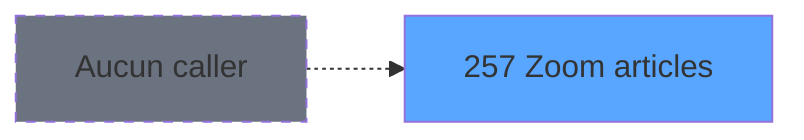

# ADH IDE 257 - Zoom articles

> **Analyse**: Phases 1-4 2026-02-08 04:42 -> 04:42 (4s) | Assemblage 04:42
> **Pipeline**: V7.2 Enrichi
> **Structure**: 4 onglets (Resume | Ecrans | Donnees | Connexions)

<!-- TAB:Resume -->

## 1. FICHE D'IDENTITE

| Attribut | Valeur |
|----------|--------|
| Projet | ADH |
| IDE Position | 257 |
| Nom Programme | Zoom articles |
| Fichier source | `Prg_257.xml` |
| Dossier IDE | Ventes |
| Taches | 1 (0 ecrans visibles) |
| Tables modifiees | 0 |
| Programmes appeles | 1 |
| Complexite | **BASSE** (score 5/100) |
| Statut | **ORPHELIN_POTENTIEL** |

## 2. DESCRIPTION FONCTIONNELLE

ADH IDE 257 est un programme de consultation permettant l'affichage interactif de la liste complète des articles disponibles dans le système. Il fonctionne comme un zoom dynamique populaire dans les interfaces POS et de gestion de caisse, offrant aux utilisateurs la capacité de parcourir, rechercher et sélectionner des articles pour les opérations de vente.

Le programme récupère les données depuis la table articles (cafil001_dat selon la nomenclature standard ADH) et les présente dans une grille de navigation. L'appel à ADH IDE 43 pour récupérer le titre suggère une standardisation des libellés affichés, probablement pour assurer la cohérence des en-têtes à travers les zooms du module caisse.

Son intégration dans le flux ADH IDE 121 (Gestion_Caisse_142) en fait un composant critique du système de saisie de ventes, permettant la sélection rapide d'articles sans navigation externe. C'est un élément typique des interfaces ergonomiques de point de vente moderne.

## 3. BLOCS FONCTIONNELS

## 5. REGLES METIER

3 regles identifiees:

### Autres (3 regles)

#### [RM-001] Si > service village [A]>'' alors > service village [A] sinon '')

| Element | Detail |
|---------|--------|
| **Condition** | `> service village [A]>''` |
| **Si vrai** | > service village [A] |
| **Si faux** | '') |
| **Variables** | EN (> service village) |
| **Expression source** | Expression 6 : `IF (> service village [A]>'',> service village [A],'')` |
| **Exemple** | Si > service village [A]>'' → > service village [A]. Sinon → '') |

#### [RM-002] Negation de (v. passage [H]) (condition inversee)

| Element | Detail |
|---------|--------|
| **Condition** | `NOT (v. passage [H])` |
| **Si vrai** | Action si vrai |
| **Variables** | EU (v. passage) |
| **Expression source** | Expression 16 : `NOT (v. passage [H])` |
| **Exemple** | Si NOT (v. passage [H]) → Action si vrai |

#### [RM-003] Condition composite: (([Q]='VRL' OR [Q]='VSL') AND [P]<>'X') OR ([Q]<>'VRL' AND [Q]<>'VSL')

| Element | Detail |
|---------|--------|
| **Condition** | `(([Q]='VRL' OR [Q]='VSL') AND [P]<>'X') OR ([Q]<>'VRL' AND [Q]<>'VSL')` |
| **Si vrai** | Action si vrai |
| **Expression source** | Expression 17 : `(([Q]='VRL' OR [Q]='VSL') AND [P]<>'X') OR ([Q]<>'VRL' AND [` |
| **Exemple** | Si (([Q]='VRL' OR [Q]='VSL') AND [P]<>'X') OR ([Q]<>'VRL' AND [Q]<>'VSL') → Action si vrai |

## 6. CONTEXTE

- **Appele par**: (aucun)
- **Appelle**: 1 programmes | **Tables**: 1 (W:0 R:1 L:0) | **Taches**: 1 | **Expressions**: 17

<!-- TAB:Ecrans -->

## 8. ECRANS

*(Programme sans ecran visible)*

## 9. NAVIGATION

### 9.3 Structure hierarchique (0 tache)

| Position | Tache | Type | Dimensions | Bloc |
|----------|-------|------|------------|------|

### 9.4 Algorigramme

> **Legende**: Vert = START/END OK | Rouge = END KO | Bleu = Decisions
> *Algorigramme auto-genere. Utiliser `/algorigramme` pour une synthese metier detaillee.*

<!-- TAB:Donnees -->

## 10. TABLES

### Tables utilisees (1)

| ID | Nom | Description | Type | R | W | L | Usages |
|----|-----|-------------|------|---|---|---|--------|
| 77 | articles_________art | Articles et stock | DB | R |   |   | 1 |

### Colonnes par table (1 / 1 tables avec colonnes identifiees)

Table 77 - articles_________art (R) - 1 usages

| Lettre | Variable | Acces | Type |
|--------|----------|-------|------|
| A | > service village | R | Alpha |
| B | > code article | R | Numeric |
| C | < libelle article | R | Alpha |
| D | < imputation | R | Numeric |
| E | < sous imputation | R | Numeric |
| F | < prix unitaire | R | Numeric |
| G | < masque montant | R | Alpha |
| H | v. passage | R | Logical |
| I | v. titre ecran | R | Alpha |
| J | bouton quitter | R | Alpha |
| K | bouton selectionner | R | Alpha |

## 11. VARIABLES

### 11.1 Variables de session (2)

Variables persistantes pendant toute la session.

| Lettre | Nom | Type | Usage dans |
|--------|-----|------|-----------|
| EU | v. passage | Logical | 1x session |
| EV | v. titre ecran | Alpha | 1x session |

### 11.2 Autres (9)

Variables diverses.

| Lettre | Nom | Type | Usage dans |
|--------|-----|------|-----------|
| EN | > service village | Alpha | 2x refs |
| EO | > code article | Numeric | 1x refs |
| EP | < libelle article | Alpha | - |
| EQ | < imputation | Numeric | - |
| ER | < sous imputation | Numeric | - |
| ES | < prix unitaire | Numeric | - |
| ET | < masque montant | Alpha | - |
| EW | bouton quitter | Alpha | 1x refs |
| EX | bouton selectionner | Alpha | 1x refs |

## 12. EXPRESSIONS

**17 / 17 expressions decodees (100%)**

### 12.1 Repartition par type

| Type | Expressions | Regles |
|------|-------------|--------|
| CONDITION | 4 | 2 |
| NEGATION | 1 | 5 |
| CONSTANTE | 4 | 0 |
| CAST_LOGIQUE | 1 | 0 |
| OTHER | 6 | 0 |
| STRING | 1 | 0 |

### 12.2 Expressions cles par type

#### CONDITION (4 expressions)

| Type | IDE | Expression | Regle |
|------|-----|------------|-------|
| CONDITION | 17 | `(([Q]='VRL' OR [Q]='VSL') AND [P]<>'X') OR ([Q]<>'VRL' AND [Q]<>'VSL')` | [RM-003](#rm-RM-003) |
| CONDITION | 6 | `IF (> service village [A]>'',> service village [A],'')` | [RM-001](#rm-RM-001) |
| CONDITION | 8 | `> code article [B]` | - |
| CONDITION | 7 | `> service village [A]` | - |

#### NEGATION (1 expressions)

| Type | IDE | Expression | Regle |
|------|-----|------------|-------|
| NEGATION | 16 | `NOT (v. passage [H])` | [RM-002](#rm-RM-002) |

#### CONSTANTE (4 expressions)

| Type | IDE | Expression | Regle |
|------|-----|------------|-------|
| CONSTANTE | 5 | `'&Selectionner'` | - |
| CONSTANTE | 15 | `' '` | - |
| CONSTANTE | 3 | `'&Quitter'` | - |
| CONSTANTE | 4 | `41` | - |

#### CAST_LOGIQUE (1 expressions)

| Type | IDE | Expression | Regle |
|------|-----|------------|-------|
| CAST_LOGIQUE | 1 | `'TRUE'LOG` | - |

#### OTHER (6 expressions)

| Type | IDE | Expression | Regle |
|------|-----|------------|-------|
| OTHER | 12 | `[L]` | - |
| OTHER | 13 | `[M]` | - |
| OTHER | 14 | `[N]` | - |
| OTHER | 9 | `v. titre ecran [I]` | - |
| OTHER | 10 | `bouton selectionner [K]` | - |
| ... | | *+1 autres* | |

#### STRING (1 expressions)

| Type | IDE | Expression | Regle |
|------|-----|------------|-------|
| STRING | 2 | `Trim ([R])` | - |

<!-- TAB:Connexions -->

## 13. GRAPHE D'APPELS

### 13.1 Chaine depuis Main (Callers)

**Chemin**: (pas de callers directs)

### 13.2 Callers

| IDE | Nom Programme | Nb Appels |
|-----|---------------|-----------|
| - | (aucun) | - |

### 13.3 Callees (programmes appeles)

### 13.4 Detail Callees avec contexte

| IDE | Nom Programme | Appels | Contexte |
|-----|---------------|--------|----------|
| [43](ADH-IDE-43.md) | Recuperation du titre | 1 | Recuperation donnees |

## 14. RECOMMANDATIONS MIGRATION

### 14.1 Profil du programme

| Metrique | Valeur | Impact migration |
|----------|--------|-----------------|
| Lignes de logique | 35 | Programme compact |
| Expressions | 17 | Peu de logique |
| Tables WRITE | 0 | Impact faible |
| Sous-programmes | 1 | Peu de dependances |
| Ecrans visibles | 0 | Ecran unique ou traitement batch |
| Code desactive | 0% (0 / 35) | Code sain |
| Regles metier | 3 | Quelques regles a preserver |

### 14.2 Plan de migration par bloc

### 14.3 Dependances critiques

| Dependance | Type | Appels | Impact |
|------------|------|--------|--------|
| [Recuperation du titre (IDE 43)](ADH-IDE-43.md) | Sous-programme | 1x | Normale - Recuperation donnees |

---
*Spec DETAILED generee par Pipeline V7.2 - 2026-02-08 04:43*
