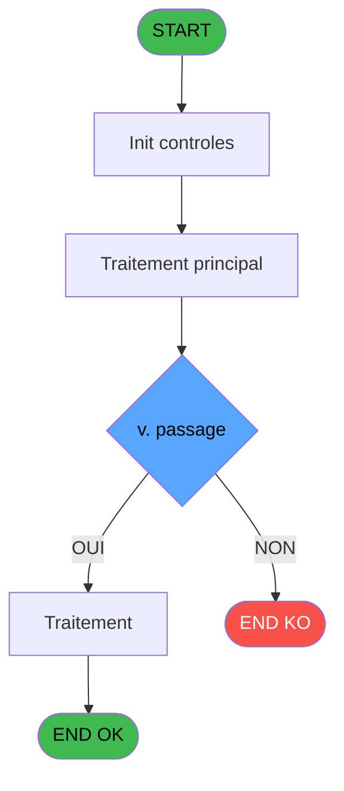
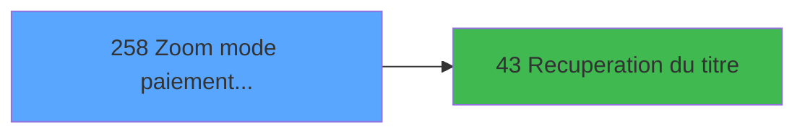

# ADH IDE 258 - Zoom mode paiement change GM

> **Analyse**: Phases 1-4 2026-02-08 04:43 -> 04:43 (5s) | Assemblage 04:43
> **Pipeline**: V7.2 Enrichi
> **Structure**: 4 onglets (Resume | Ecrans | Donnees | Connexions)

<!-- TAB:Resume -->

## 1. FICHE D'IDENTITE

| Attribut | Valeur |
|----------|--------|
| Projet | ADH |
| IDE Position | 258 |
| Nom Programme | Zoom mode paiement change GM |
| Fichier source | `Prg_258.xml` |
| Dossier IDE | Change |
| Taches | 1 (0 ecrans visibles) |
| Tables modifiees | 0 |
| Programmes appeles | 1 |
| Complexite | **BASSE** (score 5/100) |
| Statut | **ORPHELIN_POTENTIEL** |

## 2. DESCRIPTION FONCTIONNELLE

ADH IDE 258 est un programme de consultation de table de référence destiné à l'interface de gestion de caisse (Gestion_Caisse_GM). Il récupère les modes de paiement disponibles pour les opérations de change, permettant aux opérateurs de sélectionner le moyen par lequel un client règle son échange de devises. Le programme fonctionne en mode zoom, affichant une liste filtrable des modes de paiement avec leurs codes et libellés.

Le flux d'exécution débute par un appel à ADH IDE 43 pour récupérer le titre (probablement "Modes de paiement - Change"), suivi de la lecture de la table REF des moyens de règlement. Les données sont présentées dans une grille de consultation permettant la navigation et la sélection d'un enregistrement. Ce programme s'intègre dans le workflow de change en fournissant l'élément de saisie nécessaire pour spécifier comment le client finance son opération.

Le programme utilise les tables de référence du composant partagé REF.ecf et respecte les conventions de zoom des programmes ADH (affichage modal, sélection simple). Il fait partie du contexte fonctionnel des opérations de change et de gestion devises du module de caisse.

## 3. BLOCS FONCTIONNELS

## 5. REGLES METIER

1 regles identifiees:

### Autres (1 regles)

#### [RM-001] Negation de (v. passage [D]) (condition inversee)

| Element | Detail |
|---------|--------|
| **Condition** | `NOT (v. passage [D])` |
| **Si vrai** | Action si vrai |
| **Variables** | EQ (v. passage) |
| **Expression source** | Expression 12 : `NOT (v. passage [D])` |
| **Exemple** | Si NOT (v. passage [D]) → Action si vrai |

## 6. CONTEXTE

- **Appele par**: (aucun)
- **Appelle**: 1 programmes | **Tables**: 1 (W:0 R:1 L:0) | **Taches**: 1 | **Expressions**: 12

<!-- TAB:Ecrans -->

## 8. ECRANS

*(Programme sans ecran visible)*

## 9. NAVIGATION

### 9.3 Structure hierarchique (0 tache)

| Position | Tache | Type | Dimensions | Bloc |
|----------|-------|------|------------|------|

### 9.4 Algorigramme

> **Legende**: Vert = START/END OK | Rouge = END KO | Bleu = Decisions
> *Algorigramme auto-genere. Utiliser `/algorigramme` pour une synthese metier detaillee.*

<!-- TAB:Donnees -->

## 10. TABLES

### Tables utilisees (1)

| ID | Nom | Description | Type | R | W | L | Usages |
|----|-----|-------------|------|---|---|---|--------|
| 50 | moyens_reglement_mor | Reglements / paiements | DB | R |   |   | 1 |

### Colonnes par table (1 / 1 tables avec colonnes identifiees)

Table 50 - moyens_reglement_mor (R) - 1 usages

| Lettre | Variable | Acces | Type |
|--------|----------|-------|------|
| A | > societe | R | Alpha |
| B | > devise | R | Alpha |
| C | < mode paiement | R | Alpha |
| D | v. passage | R | Logical |
| E | bouton quitter | R | Alpha |
| F | bouton selectionner | R | Alpha |
| G | v.titre | R | Alpha |

## 11. VARIABLES

### 11.1 Variables de session (2)

Variables persistantes pendant toute la session.

| Lettre | Nom | Type | Usage dans |
|--------|-----|------|-----------|
| EQ | v. passage | Logical | 1x session |
| ET | v.titre | Alpha | - |

### 11.2 Autres (5)

Variables diverses.

| Lettre | Nom | Type | Usage dans |
|--------|-----|------|-----------|
| EN | > societe | Alpha | 1x refs |
| EO | > devise | Alpha | 1x refs |
| EP | < mode paiement | Alpha | 1x refs |
| ER | bouton quitter | Alpha | - |
| ES | bouton selectionner | Alpha | - |

## 12. EXPRESSIONS

**12 / 12 expressions decodees (100%)**

### 12.1 Repartition par type

| Type | Expressions | Regles |
|------|-------------|--------|
| NEGATION | 1 | 5 |
| CONSTANTE | 5 | 0 |
| CAST_LOGIQUE | 1 | 0 |
| CONDITION | 3 | 0 |
| OTHER | 1 | 0 |
| STRING | 1 | 0 |

### 12.2 Expressions cles par type

#### NEGATION (1 expressions)

| Type | IDE | Expression | Regle |
|------|-----|------------|-------|
| NEGATION | 12 | `NOT (v. passage [D])` | [RM-001](#rm-RM-001) |

#### CONSTANTE (5 expressions)

| Type | IDE | Expression | Regle |
|------|-----|------------|-------|
| CONSTANTE | 8 | `''` | - |
| CONSTANTE | 9 | `'O'` | - |
| CONSTANTE | 5 | `'&Selectionner'` | - |
| CONSTANTE | 3 | `83` | - |
| CONSTANTE | 4 | `'&Quitter'` | - |

#### CAST_LOGIQUE (1 expressions)

| Type | IDE | Expression | Regle |
|------|-----|------------|-------|
| CAST_LOGIQUE | 1 | `'TRUE'LOG` | - |

#### CONDITION (3 expressions)

| Type | IDE | Expression | Regle |
|------|-----|------------|-------|
| CONDITION | 10 | `< mode paiement [C]` | - |
| CONDITION | 7 | `> devise [B]` | - |
| CONDITION | 6 | `> societe [A]` | - |

#### OTHER (1 expressions)

| Type | IDE | Expression | Regle |
|------|-----|------------|-------|
| OTHER | 11 | `[I]` | - |

#### STRING (1 expressions)

| Type | IDE | Expression | Regle |
|------|-----|------------|-------|
| STRING | 2 | `Trim ([L])` | - |

<!-- TAB:Connexions -->

## 13. GRAPHE D'APPELS

### 13.1 Chaine depuis Main (Callers)

**Chemin**: (pas de callers directs)

### 13.2 Callers

| IDE | Nom Programme | Nb Appels |
|-----|---------------|-----------|
| - | (aucun) | - |

### 13.3 Callees (programmes appeles)

### 13.4 Detail Callees avec contexte

| IDE | Nom Programme | Appels | Contexte |
|-----|---------------|--------|----------|
| [43](ADH-IDE-43.md) | Recuperation du titre | 1 | Recuperation donnees |

## 14. RECOMMANDATIONS MIGRATION

### 14.1 Profil du programme

| Metrique | Valeur | Impact migration |
|----------|--------|-----------------|
| Lignes de logique | 20 | Programme compact |
| Expressions | 12 | Peu de logique |
| Tables WRITE | 0 | Impact faible |
| Sous-programmes | 1 | Peu de dependances |
| Ecrans visibles | 0 | Ecran unique ou traitement batch |
| Code desactive | 0% (0 / 20) | Code sain |
| Regles metier | 1 | Quelques regles a preserver |

### 14.2 Plan de migration par bloc

### 14.3 Dependances critiques

| Dependance | Type | Appels | Impact |
|------------|------|--------|--------|
| [Recuperation du titre (IDE 43)](ADH-IDE-43.md) | Sous-programme | 1x | Normale - Recuperation donnees |

---
*Spec DETAILED generee par Pipeline V7.2 - 2026-02-08 04:44*
