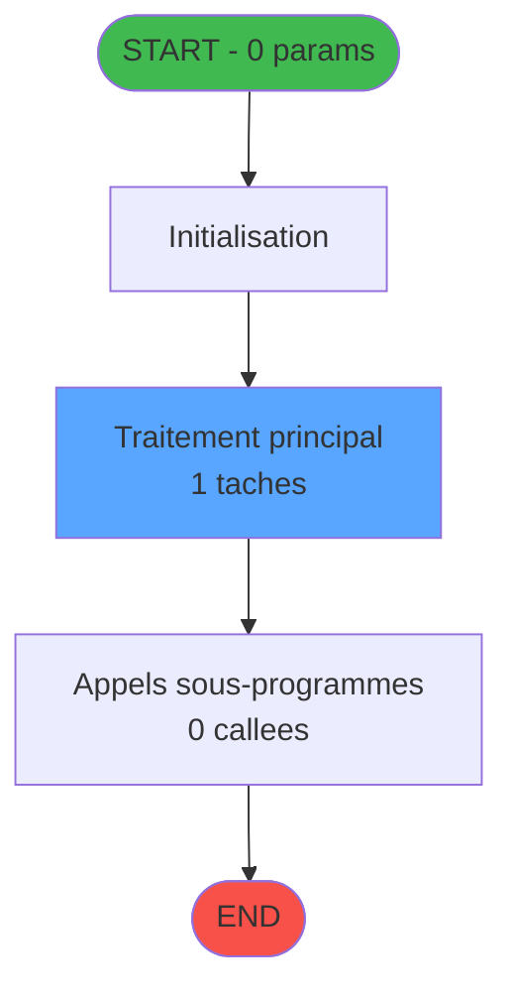
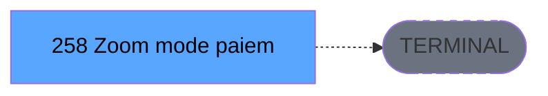

# ADH IDE 258 - Zoom mode paiement change GM

> **Version spec**: 4.0
> **Analyse**: 2026-01-27 23:13
> **Source**: `D:\Data\Migration\XPA\PMS\ADH\Source\Prg_254.xml`
> **Methode**: APEX + PDCA (Auto-generated)

---

<!-- TAB:Fonctionnel -->

## SPECIFICATION FONCTIONNELLE

### 1.1 Objectif metier

**Zoom mode paiement change GM** est le **selecteur de mode de paiement pour les operations de change GM (Gestion Monetaire)** qui **permet a l'operateur de choisir un moyen de reglement lors d'une operation de change**.

**Objectif metier** : Fournir une fenetre de selection (zoom) pour consulter et choisir parmi les modes de paiement disponibles pour les operations de change dans le module de gestion monetaire, en lecture sur la table des moyens de reglement.

| Element | Description |
|---------|-------------|
| **Qui** | Operateur caisse ou comptable effectuant une operation de change |
| **Quoi** | Fenetre de selection des modes de paiement pour change GM |
| **Pourquoi** | Permettre le choix du moyen de reglement adapte lors d'une operation de change monetaire |
| **Declencheur** | Clic sur zoom depuis un champ mode de paiement dans un ecran de change |
| **Resultat** | Retour du mode de paiement selectionne au programme appelant |

### 1.2 Regles metier

| Code | Regle | Condition |
|------|-------|-----------|
| RM-001 | Execution du traitement principal | Conditions d'entree validees |
| RM-002 | Gestion des tables (1 tables) | Acces selon mode (R/W/L) |
| RM-003 | Appels sous-programmes (0 callees) | Selon logique metier |

### 1.3 Flux utilisateur

1. Reception des parametres d'entree (0 params)
2. Initialisation et verification conditions
3. Traitement principal (1 taches)
4. Appels sous-programmes si necessaire
5. Retour resultats

### 1.4 Cas d'erreur

| Erreur | Comportement |
|--------|--------------|
| Conditions non remplies | Abandon avec message |
| Erreur sous-programme | Propagation erreur |

---

<!-- TAB:Technique -->

## SPECIFICATION TECHNIQUE

### 2.1 Identification

| Attribut | Valeur |
|----------|--------|
| **IDE Position** | 258 |
| **Fichier XML** | `Prg_254.xml` |
| **Description** | Zoom mode paiement change GM |
| **Module** | ADH |
| **Public Name** |  |
| **Nombre taches** | 1 |
| **Lignes logique** | 20 |
| **Expressions** | 0 |

### 2.2 Tables

| # | Nom logique | Nom physique | Acces | Usage |
|---|-------------|--------------|-------|-------|
| 50 | moyens_reglement_mor | cafil028_dat | READ | Lecture |

**Resume**: 1 tables accedees dont **0 en ecriture**

### 2.3 Parametres d'entree (0 parametres)

| Var | Nom | Type | Picture |
|-----|-----|------|---------|
| - | Aucun parametre | - | - |

### 2.4 Algorigramme

### 2.5 Statistiques

| Metrique | Valeur |
|----------|--------|
| **Taches** | 1 |
| **Lignes logique** | 20 |
| **Expressions** | 0 |
| **Parametres** | 0 |
| **Tables accedees** | 1 |
| **Tables en ecriture** | 0 |
| **Callees niveau 1** | 0 |

---

<!-- TAB:Cartographie -->

## CARTOGRAPHIE APPLICATIVE

### 3.1 Chaine d'appels depuis Main

### 3.2 Callers directs

| IDE | Programme | Nb appels |
|-----|-----------|-----------|
| - | ORPHELIN ou Main direct | - |

### 3.3 Callees (3 niveaux)

| Niv | IDE | Programme | Nb appels | Status |
|-----|-----|-----------|-----------|--------|
| - | - | TERMINAL | - | - |

### 3.4 Composants ECF utilises

| ECF | IDE | Public Name | Description |
|-----|-----|-------------|-------------|
| - | - | Aucun composant ECF | - |

### 3.5 Verification orphelin

| Critere | Resultat |
|---------|----------|
| Callers actifs | 0 programmes |
| PublicName | Non defini |
| ECF partage | NON |
| **Conclusion** | **ORPHELIN** - Pas de callers actifs |

---

## NOTES MIGRATION

### Complexite

| Critere | Score | Detail |
|---------|-------|--------|
| Taches | 1 | Simple |
| Tables | 1 | Lecture seule |
| Callees | 0 | Faible couplage |
| **Score global** | **FAIBLE** | - |

### Points d'attention migration

| Point | Solution moderne |
|-------|-----------------|
| Variables globales (VG*) | Service/Repository injection |
| Tables Magic | Entity Framework / Dapper |
| CallTask | Service method calls |
| Forms | React/Angular components |

---

## HISTORIQUE

| Date | Action | Auteur |
|------|--------|--------|
| 2026-01-27 23:13 | **V4.0 APEX/PDCA** - Generation automatique complete | Script |

---

*Specification V4.0 - Auto-generated with APEX/PDCA methodology*

