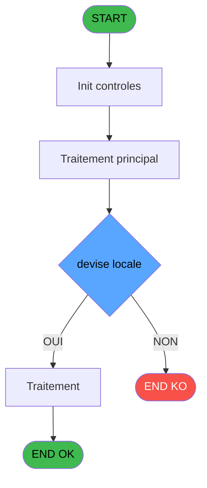
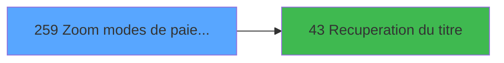

# ADH IDE 259 - Zoom modes de paiement

> **Analyse**: Phases 1-4 2026-02-08 04:44 -> 04:44 (4s) | Assemblage 04:44
> **Pipeline**: V7.2 Enrichi
> **Structure**: 4 onglets (Resume | Ecrans | Donnees | Connexions)

<!-- TAB:Resume -->

## 1. FICHE D'IDENTITE

| Attribut | Valeur |
|----------|--------|
| Projet | ADH |
| IDE Position | 259 |
| Nom Programme | Zoom modes de paiement |
| Fichier source | `Prg_259.xml` |
| Dossier IDE | Consultation |
| Taches | 1 (0 ecrans visibles) |
| Tables modifiees | 0 |
| Programmes appeles | 1 |
| Complexite | **BASSE** (score 5/100) |
| Statut | **ORPHELIN_POTENTIEL** |

## 2. DESCRIPTION FONCTIONNELLE

ADH IDE 259 est un programme de zoom permettant de consulter et gérer la liste des modes de paiement disponibles dans le système. Ce programme affiche une grille de sélection interactive des différents moyens de règlement (espèces, carte bancaire, chèque, virement, etc.) avec leurs propriétés associées. L'utilisateur peut naviguer dans cette liste, rechercher un mode spécifique et le sélectionner pour l'utiliser dans d'autres opérations (ventes, encaissements, etc.).

Le programme s'inscrit dans la chaîne ADH IDE 1 → IDE 43 (récupération du titre) → IDE 259. Il constitue un point d'accès rapide aux données de référence des moyens de paiement stockées dans la table REF associée. Cette architecture permet une réutilisation cohérente du zoom dans différents contextes de gestion de caisse et de facturation.

Techniquement, ADH IDE 259 fonctionne comme un browse simple avec validation des sélections et retour de la clé du mode de paiement sélectionné. Il s'appuie sur la structure de données référencée (ID, libellé, code comptable, statut actif/inactif) pour offrir une expérience utilisateur fluide et une intégration transparente avec les autres modules de gestion caisse.

## 3. BLOCS FONCTIONNELS

## 5. REGLES METIER

2 regles identifiees:

### Autres (2 regles)

#### [RM-001] Negation de (v. passage [F]) (condition inversee)

| Element | Detail |
|---------|--------|
| **Condition** | `NOT (v. passage [F])` |
| **Si vrai** | Action si vrai |
| **Variables** | ES (v. passage) |
| **Expression source** | Expression 11 : `NOT (v. passage [F])` |
| **Exemple** | Si NOT (v. passage [F]) → Action si vrai |

#### [RM-002] Condition toujours vraie (flag actif)

| Element | Detail |
|---------|--------|
| **Condition** | `> devise [B]=> devise locale [E]` |
| **Si vrai** | 'TRUE'LOG |
| **Si faux** | [K]<>'CHQ') |
| **Variables** | EO (> devise), ER (> devise locale) |
| **Expression source** | Expression 12 : `IF (> devise [B]=> devise locale [E],'TRUE'LOG,[K]<>'CHQ')` |
| **Exemple** | Si > devise [B]=> devise locale [E] → 'TRUE'LOG. Sinon → [K]<>'CHQ') |

## 6. CONTEXTE

- **Appele par**: (aucun)
- **Appelle**: 1 programmes | **Tables**: 1 (W:0 R:1 L:0) | **Taches**: 1 | **Expressions**: 12

<!-- TAB:Ecrans -->

## 8. ECRANS

*(Programme sans ecran visible)*

## 9. NAVIGATION

### 9.3 Structure hierarchique (0 tache)

| Position | Tache | Type | Dimensions | Bloc |
|----------|-------|------|------------|------|

### 9.4 Algorigramme

> **Legende**: Vert = START/END OK | Rouge = END KO | Bleu = Decisions
> *Algorigramme auto-genere. Utiliser `/algorigramme` pour une synthese metier detaillee.*

<!-- TAB:Donnees -->

## 10. TABLES

### Tables utilisees (1)

| ID | Nom | Description | Type | R | W | L | Usages |
|----|-----|-------------|------|---|---|---|--------|
| 50 | moyens_reglement_mor | Reglements / paiements | DB | R |   |   | 1 |

### Colonnes par table (1 / 1 tables avec colonnes identifiees)

Table 50 - moyens_reglement_mor (R) - 1 usages

| Lettre | Variable | Acces | Type |
|--------|----------|-------|------|
| A | > societe | R | Alpha |
| B | > devise | R | Alpha |
| C | > type d'operation | R | Alpha |
| D | < mode de paiement | R | Alpha |
| E | > devise locale | R | Alpha |
| F | v. passage | R | Logical |
| G | v. titre | R | Alpha |
| H | bouton quitter | R | Alpha |
| I | bouton selectionner | R | Alpha |

## 11. VARIABLES

### 11.1 Variables de session (2)

Variables persistantes pendant toute la session.

| Lettre | Nom | Type | Usage dans |
|--------|-----|------|-----------|
| ES | v. passage | Logical | 1x session |
| ET | v. titre | Alpha | - |

### 11.2 Autres (7)

Variables diverses.

| Lettre | Nom | Type | Usage dans |
|--------|-----|------|-----------|
| EN | > societe | Alpha | 1x refs |
| EO | > devise | Alpha | 2x refs |
| EP | > type d'operation | Alpha | 1x refs |
| EQ | < mode de paiement | Alpha | 1x refs |
| ER | > devise locale | Alpha | 1x refs |
| EU | bouton quitter | Alpha | - |
| EV | bouton selectionner | Alpha | - |

## 12. EXPRESSIONS

**12 / 12 expressions decodees (100%)**

### 12.1 Repartition par type

| Type | Expressions | Regles |
|------|-------------|--------|
| NEGATION | 1 | 5 |
| CAST_LOGIQUE | 2 | 5 |
| CONSTANTE | 4 | 0 |
| CONDITION | 4 | 0 |
| OTHER | 1 | 0 |

### 12.2 Expressions cles par type

#### NEGATION (1 expressions)

| Type | IDE | Expression | Regle |
|------|-----|------------|-------|
| NEGATION | 11 | `NOT (v. passage [F])` | [RM-001](#rm-RM-001) |

#### CAST_LOGIQUE (2 expressions)

| Type | IDE | Expression | Regle |
|------|-----|------------|-------|
| CAST_LOGIQUE | 12 | `IF (> devise [B]=> devise locale [E],'TRUE'LOG,[K]<>'CHQ')` | [RM-002](#rm-RM-002) |
| CAST_LOGIQUE | 10 | `'TRUE'LOG` | - |

#### CONSTANTE (4 expressions)

| Type | IDE | Expression | Regle |
|------|-----|------------|-------|
| CONSTANTE | 3 | `61` | - |
| CONSTANTE | 7 | `'O'` | - |
| CONSTANTE | 1 | `'&Quitter'` | - |
| CONSTANTE | 2 | `'&Selectionner'` | - |

#### CONDITION (4 expressions)

| Type | IDE | Expression | Regle |
|------|-----|------------|-------|
| CONDITION | 6 | `> type d'operation [C]` | - |
| CONDITION | 8 | `< mode de paiement [D]` | - |
| CONDITION | 4 | `> societe [A]` | - |
| CONDITION | 5 | `> devise [B]` | - |

#### OTHER (1 expressions)

| Type | IDE | Expression | Regle |
|------|-----|------------|-------|
| OTHER | 9 | `[K]` | - |

<!-- TAB:Connexions -->

## 13. GRAPHE D'APPELS

### 13.1 Chaine depuis Main (Callers)

**Chemin**: (pas de callers directs)

### 13.2 Callers

| IDE | Nom Programme | Nb Appels |
|-----|---------------|-----------|
| - | (aucun) | - |

### 13.3 Callees (programmes appeles)

### 13.4 Detail Callees avec contexte

| IDE | Nom Programme | Appels | Contexte |
|-----|---------------|--------|----------|
| [43](ADH-IDE-43.md) | Recuperation du titre | 1 | Recuperation donnees |

## 14. RECOMMANDATIONS MIGRATION

### 14.1 Profil du programme

| Metrique | Valeur | Impact migration |
|----------|--------|-----------------|
| Lignes de logique | 22 | Programme compact |
| Expressions | 12 | Peu de logique |
| Tables WRITE | 0 | Impact faible |
| Sous-programmes | 1 | Peu de dependances |
| Ecrans visibles | 0 | Ecran unique ou traitement batch |
| Code desactive | 0% (0 / 22) | Code sain |
| Regles metier | 2 | Quelques regles a preserver |

### 14.2 Plan de migration par bloc

### 14.3 Dependances critiques

| Dependance | Type | Appels | Impact |
|------------|------|--------|--------|
| [Recuperation du titre (IDE 43)](ADH-IDE-43.md) | Sous-programme | 1x | Normale - Recuperation donnees |

---
*Spec DETAILED generee par Pipeline V7.2 - 2026-02-08 04:44*
