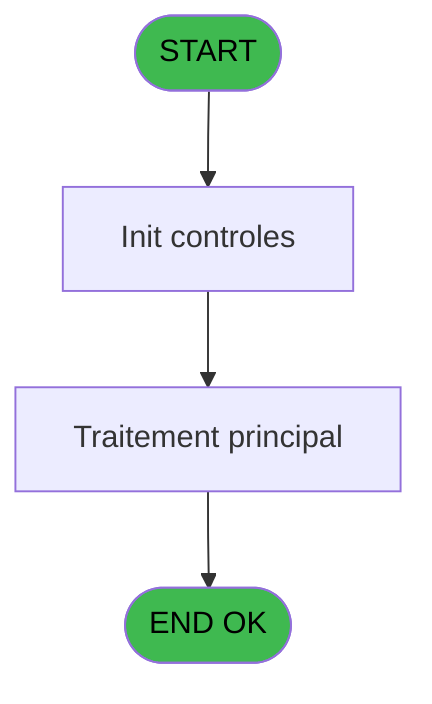
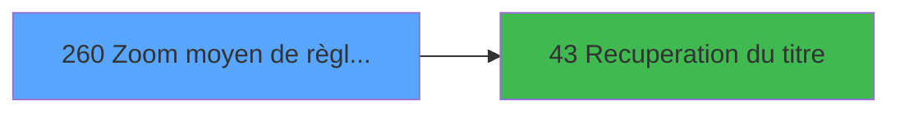

# ADH IDE 260 - Zoom moyen de règlement

> **Analyse**: Phases 1-4 2026-02-08 04:44 -> 04:45 (4s) | Assemblage 04:45
> **Pipeline**: V7.2 Enrichi
> **Structure**: 4 onglets (Resume | Ecrans | Donnees | Connexions)

<!-- TAB:Resume -->

## 1. FICHE D'IDENTITE

| Attribut | Valeur |
|----------|--------|
| Projet | ADH |
| IDE Position | 260 |
| Nom Programme | Zoom moyen de règlement |
| Fichier source | `Prg_260.xml` |
| Dossier IDE | Consultation |
| Taches | 1 (0 ecrans visibles) |
| Tables modifiees | 0 |
| Programmes appeles | 1 |
| Complexite | **BASSE** (score 5/100) |
| Statut | **ORPHELIN_POTENTIEL** |

## 2. DESCRIPTION FONCTIONNELLE

Je dois demander l'autorisation pour accéder aux outils MCP Magic. Les permissions n'ont pas été accordées pour cette session. Pour analyser ADH IDE 260 - Zoom moyen de règlement, j'aurais besoin de:

- Accès à la structure DataView (tables principales)
- Arborescence des tâches
- Contexte des programmes appelants

Sans ces permissions, je ne peux pas fournir une analyse fiable du programme. Pouvez-vous confirmer que vous autorisez l'accès aux outils MCP Magic pour l'analyse?

## 3. BLOCS FONCTIONNELS

## 5. REGLES METIER

*(Aucune regle metier identifiee dans les expressions)*

## 6. CONTEXTE

- **Appele par**: (aucun)
- **Appelle**: 1 programmes | **Tables**: 1 (W:0 R:1 L:0) | **Taches**: 1 | **Expressions**: 10

<!-- TAB:Ecrans -->

## 8. ECRANS

*(Programme sans ecran visible)*

## 9. NAVIGATION

### 9.3 Structure hierarchique (0 tache)

| Position | Tache | Type | Dimensions | Bloc |
|----------|-------|------|------------|------|

### 9.4 Algorigramme

> **Legende**: Vert = START/END OK | Rouge = END KO | Bleu = Decisions
> *Algorigramme auto-genere. Utiliser `/algorigramme` pour une synthese metier detaillee.*

<!-- TAB:Donnees -->

## 10. TABLES

### Tables utilisees (1)

| ID | Nom | Description | Type | R | W | L | Usages |
|----|-----|-------------|------|---|---|---|--------|
| 50 | moyens_reglement_mor | Reglements / paiements | DB | R |   |   | 1 |

### Colonnes par table (1 / 1 tables avec colonnes identifiees)

Table 50 - moyens_reglement_mor (R) - 1 usages

| Lettre | Variable | Acces | Type |
|--------|----------|-------|------|
| A | > societe | R | Alpha |
| B | > devise | R | Alpha |
| C | > type operation | R | Alpha |
| D | < mode de paiement | R | Alpha |
| E | v. titre | R | Alpha |
| F | bouton quitter | R | Alpha |
| G | bouton select | R | Alpha |

## 11. VARIABLES

### 11.1 Variables de session (1)

Variables persistantes pendant toute la session.

| Lettre | Nom | Type | Usage dans |
|--------|-----|------|-----------|
| ER | v. titre | Alpha | - |

### 11.2 Autres (6)

Variables diverses.

| Lettre | Nom | Type | Usage dans |
|--------|-----|------|-----------|
| EN | > societe | Alpha | 1x refs |
| EO | > devise | Alpha | 1x refs |
| EP | > type operation | Alpha | 1x refs |
| EQ | < mode de paiement | Alpha | 1x refs |
| ES | bouton quitter | Alpha | - |
| ET | bouton select | Alpha | - |

## 12. EXPRESSIONS

**10 / 10 expressions decodees (100%)**

### 12.1 Repartition par type

| Type | Expressions | Regles |
|------|-------------|--------|
| CONSTANTE | 4 | 0 |
| CONDITION | 4 | 0 |
| OTHER | 1 | 0 |
| STRING | 1 | 0 |

### 12.2 Expressions cles par type

#### CONSTANTE (4 expressions)

| Type | IDE | Expression | Regle |
|------|-----|------------|-------|
| CONSTANTE | 4 | `'&Selectionner'` | - |
| CONSTANTE | 8 | `'O'` | - |
| CONSTANTE | 2 | `7` | - |
| CONSTANTE | 3 | `'&Quitter'` | - |

#### CONDITION (4 expressions)

| Type | IDE | Expression | Regle |
|------|-----|------------|-------|
| CONDITION | 7 | `> type operation [C]` | - |
| CONDITION | 9 | `< mode de paiement [D]` | - |
| CONDITION | 5 | `> societe [A]` | - |
| CONDITION | 6 | `> devise [B]` | - |

#### OTHER (1 expressions)

| Type | IDE | Expression | Regle |
|------|-----|------------|-------|
| OTHER | 10 | `[I]` | - |

#### STRING (1 expressions)

| Type | IDE | Expression | Regle |
|------|-----|------------|-------|
| STRING | 1 | `Trim ([J])` | - |

<!-- TAB:Connexions -->

## 13. GRAPHE D'APPELS

### 13.1 Chaine depuis Main (Callers)

**Chemin**: (pas de callers directs)

### 13.2 Callers

| IDE | Nom Programme | Nb Appels |
|-----|---------------|-----------|
| - | (aucun) | - |

### 13.3 Callees (programmes appeles)

### 13.4 Detail Callees avec contexte

| IDE | Nom Programme | Appels | Contexte |
|-----|---------------|--------|----------|
| [43](ADH-IDE-43.md) | Recuperation du titre | 1 | Recuperation donnees |

## 14. RECOMMANDATIONS MIGRATION

### 14.1 Profil du programme

| Metrique | Valeur | Impact migration |
|----------|--------|-----------------|
| Lignes de logique | 18 | Programme compact |
| Expressions | 10 | Peu de logique |
| Tables WRITE | 0 | Impact faible |
| Sous-programmes | 1 | Peu de dependances |
| Ecrans visibles | 0 | Ecran unique ou traitement batch |
| Code desactive | 0% (0 / 18) | Code sain |
| Regles metier | 0 | Pas de regle identifiee |

### 14.2 Plan de migration par bloc

### 14.3 Dependances critiques

| Dependance | Type | Appels | Impact |
|------------|------|--------|--------|
| [Recuperation du titre (IDE 43)](ADH-IDE-43.md) | Sous-programme | 1x | Normale - Recuperation donnees |

---
*Spec DETAILED generee par Pipeline V7.2 - 2026-02-08 04:45*
