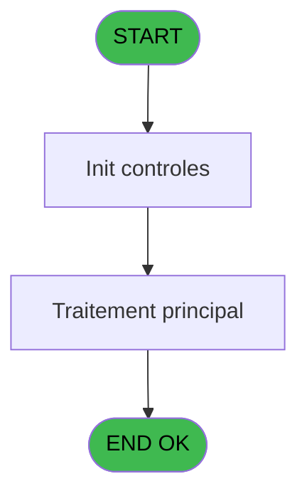
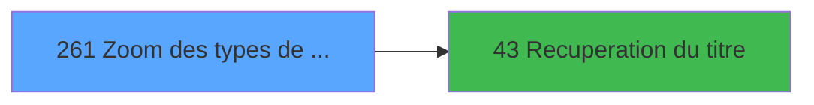

# ADH IDE 261 - Zoom des types de taux

> **Analyse**: Phases 1-4 2026-02-08 04:45 -> 04:45 (4s) | Assemblage 04:45
> **Pipeline**: V7.2 Enrichi
> **Structure**: 4 onglets (Resume | Ecrans | Donnees | Connexions)

<!-- TAB:Resume -->

## 1. FICHE D'IDENTITE

| Attribut | Valeur |
|----------|--------|
| Projet | ADH |
| IDE Position | 261 |
| Nom Programme | Zoom des types de taux |
| Fichier source | `Prg_261.xml` |
| Dossier IDE | Change |
| Taches | 1 (0 ecrans visibles) |
| Tables modifiees | 0 |
| Programmes appeles | 1 |
| Complexite | **BASSE** (score 5/100) |
| Statut | **ORPHELIN_POTENTIEL** |

## 2. DESCRIPTION FONCTIONNELLE

ADH IDE 261 est un programme de consultation affichant la liste des types de taux de change disponibles dans le système. C'est un zoom de référence typique qui se limite à la lecture de données, sans modification possible. Le programme récupère les informations depuis la table `cafil028_dat` (types taux change) et les présente sous forme de grille pour sélection utilisateur.

La logique est minimaliste : après appel du titre via ADH IDE 43, le programme charge simplement les types de taux existants et permet à l'utilisateur de sélectionner l'un d'entre eux pour retour à l'appelant. Aucun calcul ni traitement métier complexe, juste une présentation structurée des données de référence.

Ce zoom s'intègre dans le workflow de gestion des devises et des taux de change (modules ADH IDE 20-25), offrant une interface pratique pour choisir parmi les types de taux sans avoir à connaître les codes internes. Son appel depuis ADH IDE 43 crée une chaîne de consultation rapide et efficace des données de base.

## 3. BLOCS FONCTIONNELS

## 5. REGLES METIER

*(Aucune regle metier identifiee dans les expressions)*

## 6. CONTEXTE

- **Appele par**: (aucun)
- **Appelle**: 1 programmes | **Tables**: 2 (W:0 R:1 L:1) | **Taches**: 1 | **Expressions**: 10

<!-- TAB:Ecrans -->

## 8. ECRANS

*(Programme sans ecran visible)*

## 9. NAVIGATION

### 9.3 Structure hierarchique (0 tache)

| Position | Tache | Type | Dimensions | Bloc |
|----------|-------|------|------------|------|

### 9.4 Algorigramme

> **Legende**: Vert = START/END OK | Rouge = END KO | Bleu = Decisions
> *Algorigramme auto-genere. Utiliser `/algorigramme` pour une synthese metier detaillee.*

<!-- TAB:Donnees -->

## 10. TABLES

### Tables utilisees (2)

| ID | Nom | Description | Type | R | W | L | Usages |
|----|-----|-------------|------|---|---|---|--------|
| 124 | type_taux_change | Devises / taux de change | DB | R |   |   | 1 |
| 139 | moyens_reglement_mor | Reglements / paiements | DB |   |   | L | 1 |

### Colonnes par table (1 / 1 tables avec colonnes identifiees)

Table 124 - type_taux_change (R) - 1 usages

| Lettre | Variable | Acces | Type |
|--------|----------|-------|------|
| A | > societe | R | Alpha |
| B | > devise | R | Alpha |
| C | > type operation | R | Alpha |
| D | > mode paiement | R | Alpha |
| E | < Type Taux | R | Numeric |
| F | v. titre | R | Alpha |
| G | bouton selectionner | R | Alpha |
| H | bouton quitter | R | Alpha |

## 11. VARIABLES

### 11.1 Variables de session (1)

Variables persistantes pendant toute la session.

| Lettre | Nom | Type | Usage dans |
|--------|-----|------|-----------|
| ES | v. titre | Alpha | - |

### 11.2 Autres (7)

Variables diverses.

| Lettre | Nom | Type | Usage dans |
|--------|-----|------|-----------|
| EN | > societe | Alpha | 1x refs |
| EO | > devise | Alpha | 1x refs |
| EP | > type operation | Alpha | 1x refs |
| EQ | > mode paiement | Alpha | 1x refs |
| ER | < Type Taux | Numeric | - |
| ET | bouton selectionner | Alpha | - |
| EU | bouton quitter | Alpha | 1x refs |

## 12. EXPRESSIONS

**10 / 10 expressions decodees (100%)**

### 12.1 Repartition par type

| Type | Expressions | Regles |
|------|-------------|--------|
| CONSTANTE | 4 | 0 |
| CONDITION | 4 | 0 |
| OTHER | 1 | 0 |
| STRING | 1 | 0 |

### 12.2 Expressions cles par type

#### CONSTANTE (4 expressions)

| Type | IDE | Expression | Regle |
|------|-----|------------|-------|
| CONSTANTE | 4 | `'&Selectionner'` | - |
| CONSTANTE | 6 | `'O'` | - |
| CONSTANTE | 2 | `8` | - |
| CONSTANTE | 3 | `'&Quitter'` | - |

#### CONDITION (4 expressions)

| Type | IDE | Expression | Regle |
|------|-----|------------|-------|
| CONDITION | 8 | `> type operation [C]` | - |
| CONDITION | 9 | `> mode paiement [D]` | - |
| CONDITION | 5 | `> societe [A]` | - |
| CONDITION | 7 | `> devise [B]` | - |

#### OTHER (1 expressions)

| Type | IDE | Expression | Regle |
|------|-----|------------|-------|
| OTHER | 10 | `bouton quitter [H]` | - |

#### STRING (1 expressions)

| Type | IDE | Expression | Regle |
|------|-----|------------|-------|
| STRING | 1 | `Trim ([Q])` | - |

<!-- TAB:Connexions -->

## 13. GRAPHE D'APPELS

### 13.1 Chaine depuis Main (Callers)

**Chemin**: (pas de callers directs)

### 13.2 Callers

| IDE | Nom Programme | Nb Appels |
|-----|---------------|-----------|
| - | (aucun) | - |

### 13.3 Callees (programmes appeles)

### 13.4 Detail Callees avec contexte

| IDE | Nom Programme | Appels | Contexte |
|-----|---------------|--------|----------|
| [43](ADH-IDE-43.md) | Recuperation du titre | 1 | Recuperation donnees |

## 14. RECOMMANDATIONS MIGRATION

### 14.1 Profil du programme

| Metrique | Valeur | Impact migration |
|----------|--------|-----------------|
| Lignes de logique | 28 | Programme compact |
| Expressions | 10 | Peu de logique |
| Tables WRITE | 0 | Impact faible |
| Sous-programmes | 1 | Peu de dependances |
| Ecrans visibles | 0 | Ecran unique ou traitement batch |
| Code desactive | 0% (0 / 28) | Code sain |
| Regles metier | 0 | Pas de regle identifiee |

### 14.2 Plan de migration par bloc

### 14.3 Dependances critiques

| Dependance | Type | Appels | Impact |
|------------|------|--------|--------|
| [Recuperation du titre (IDE 43)](ADH-IDE-43.md) | Sous-programme | 1x | Normale - Recuperation donnees |

---
*Spec DETAILED generee par Pipeline V7.2 - 2026-02-08 04:46*
