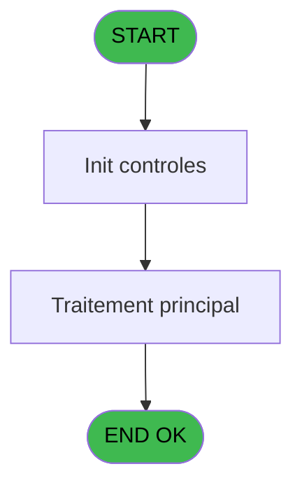
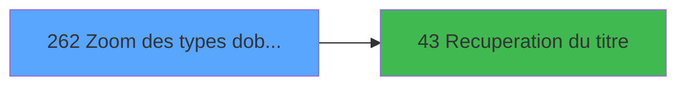

# ADH IDE 262 - Zoom  des types d'objets

> **Analyse**: Phases 1-4 2026-02-08 04:46 -> 04:46 (4s) | Assemblage 04:46
> **Pipeline**: V7.2 Enrichi
> **Structure**: 4 onglets (Resume | Ecrans | Donnees | Connexions)

<!-- TAB:Resume -->

## 1. FICHE D'IDENTITE

| Attribut | Valeur |
|----------|--------|
| Projet | ADH |
| IDE Position | 262 |
| Nom Programme | Zoom  des types d'objets |
| Fichier source | `Prg_262.xml` |
| Dossier IDE | Consultation |
| Taches | 1 (0 ecrans visibles) |
| Tables modifiees | 0 |
| Programmes appeles | 1 |
| Complexite | **BASSE** (score 5/100) |
| Statut | **ORPHELIN_POTENTIEL** |

## 2. DESCRIPTION FONCTIONNELLE

# ADH IDE 262 - Zoom des types d'objets

Ce programme constitue une table de référence pour la gestion des types d'objets entreposés en coffre-fort. Il affiche une liste complète des catégories d'objets (bijoux, documents, appareils électroniques, etc.) avec leurs caractéristiques et codes de classification. Le programme serve de zoom—une fenêtre de consultation rapide—permettant aux opérateurs de caisse de sélectionner le type d'objet lors de l'enregistrement d'un dépôt.

L'interaction avec ADH IDE 43 indique que le programme récupère dynamiquement le titre ou le libellé associé à chaque type d'objet. Cette approche garantit la cohérence des données : une modification du titre dans le programme 43 se répercute automatiquement dans tous les endroits où il est référencé, évitant les incohérences d'affichage.

Le zoom s'inscrit dans le workflow complet de gestion des dépôts d'objets (garanties, bijoux, documents), fournissant une sélection structurée et validée au lieu de demander à l'opérateur de saisir manuellement un code. Cela réduit les erreurs de saisie et améliore l'ergonomie de la caisse.

## 3. BLOCS FONCTIONNELS

## 5. REGLES METIER

*(Aucune regle metier identifiee dans les expressions)*

## 6. CONTEXTE

- **Appele par**: (aucun)
- **Appelle**: 1 programmes | **Tables**: 1 (W:0 R:1 L:0) | **Taches**: 1 | **Expressions**: 6

<!-- TAB:Ecrans -->

## 8. ECRANS

*(Programme sans ecran visible)*

## 9. NAVIGATION

### 9.3 Structure hierarchique (0 tache)

| Position | Tache | Type | Dimensions | Bloc |
|----------|-------|------|------------|------|

### 9.4 Algorigramme

> **Legende**: Vert = START/END OK | Rouge = END KO | Bleu = Decisions
> *Algorigramme auto-genere. Utiliser `/algorigramme` pour une synthese metier detaillee.*

<!-- TAB:Donnees -->

## 10. TABLES

### Tables utilisees (1)

| ID | Nom | Description | Type | R | W | L | Usages |
|----|-----|-------------|------|---|---|---|--------|
| 99 | depot_objet______obj | Depots et garanties | DB | R |   |   | 1 |

### Colonnes par table (1 / 1 tables avec colonnes identifiees)

Table 99 - depot_objet______obj (R) - 1 usages

| Lettre | Variable | Acces | Type |
|--------|----------|-------|------|
| A | > societe | R | Alpha |
| B | < descriptif | R | Alpha |
| C | v.titre | R | Alpha |
| D | bouton selectionner | R | Alpha |
| E | bouton quitter | R | Alpha |

## 11. VARIABLES

### 11.1 Variables de session (1)

Variables persistantes pendant toute la session.

| Lettre | Nom | Type | Usage dans |
|--------|-----|------|-----------|
| EP | v.titre | Alpha | 1x session |

### 11.2 Autres (4)

Variables diverses.

| Lettre | Nom | Type | Usage dans |
|--------|-----|------|-----------|
| EN | > societe | Alpha | 1x refs |
| EO | < descriptif | Alpha | - |
| EQ | bouton selectionner | Alpha | - |
| ER | bouton quitter | Alpha | 1x refs |

## 12. EXPRESSIONS

**6 / 6 expressions decodees (100%)**

### 12.1 Repartition par type

| Type | Expressions | Regles |
|------|-------------|--------|
| CONSTANTE | 3 | 0 |
| CONDITION | 1 | 0 |
| OTHER | 1 | 0 |
| STRING | 1 | 0 |

### 12.2 Expressions cles par type

#### CONSTANTE (3 expressions)

| Type | IDE | Expression | Regle |
|------|-----|------------|-------|
| CONSTANTE | 4 | `'&Selectionner'` | - |
| CONSTANTE | 3 | `'&Quitter'` | - |
| CONSTANTE | 2 | `11` | - |

#### CONDITION (1 expressions)

| Type | IDE | Expression | Regle |
|------|-----|------------|-------|
| CONDITION | 5 | `> societe [A]` | - |

#### OTHER (1 expressions)

| Type | IDE | Expression | Regle |
|------|-----|------------|-------|
| OTHER | 6 | `bouton quitter [E]` | - |

#### STRING (1 expressions)

| Type | IDE | Expression | Regle |
|------|-----|------------|-------|
| STRING | 1 | `Trim (v.titre [C])` | - |

<!-- TAB:Connexions -->

## 13. GRAPHE D'APPELS

### 13.1 Chaine depuis Main (Callers)

**Chemin**: (pas de callers directs)

### 13.2 Callers

| IDE | Nom Programme | Nb Appels |
|-----|---------------|-----------|
| - | (aucun) | - |

### 13.3 Callees (programmes appeles)

### 13.4 Detail Callees avec contexte

| IDE | Nom Programme | Appels | Contexte |
|-----|---------------|--------|----------|
| [43](ADH-IDE-43.md) | Recuperation du titre | 1 | Recuperation donnees |

## 14. RECOMMANDATIONS MIGRATION

### 14.1 Profil du programme

| Metrique | Valeur | Impact migration |
|----------|--------|-----------------|
| Lignes de logique | 14 | Programme compact |
| Expressions | 6 | Peu de logique |
| Tables WRITE | 0 | Impact faible |
| Sous-programmes | 1 | Peu de dependances |
| Ecrans visibles | 0 | Ecran unique ou traitement batch |
| Code desactive | 0% (0 / 14) | Code sain |
| Regles metier | 0 | Pas de regle identifiee |

### 14.2 Plan de migration par bloc

### 14.3 Dependances critiques

| Dependance | Type | Appels | Impact |
|------------|------|--------|--------|
| [Recuperation du titre (IDE 43)](ADH-IDE-43.md) | Sous-programme | 1x | Normale - Recuperation donnees |

---
*Spec DETAILED generee par Pipeline V7.2 - 2026-02-08 04:47*
