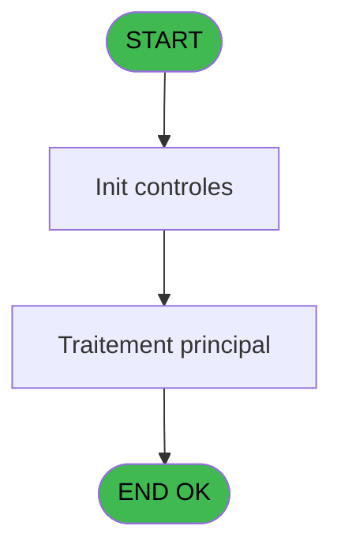
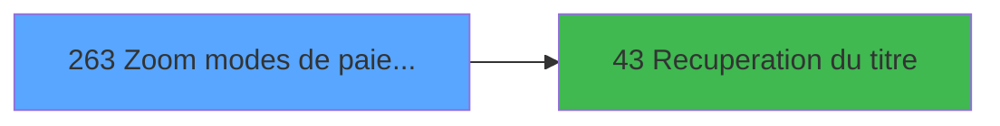

# ADH IDE 263 - Zoom modes de paiement

> **Analyse**: Phases 1-4 2026-02-08 04:47 -> 04:47 (4s) | Assemblage 04:47
> **Pipeline**: V7.2 Enrichi
> **Structure**: 4 onglets (Resume | Ecrans | Donnees | Connexions)

<!-- TAB:Resume -->

## 1. FICHE D'IDENTITE

| Attribut | Valeur |
|----------|--------|
| Projet | ADH |
| IDE Position | 263 |
| Nom Programme | Zoom modes de paiement |
| Fichier source | `Prg_263.xml` |
| Dossier IDE | Consultation |
| Taches | 1 (0 ecrans visibles) |
| Tables modifiees | 0 |
| Programmes appeles | 1 |
| Complexite | **BASSE** (score 5/100) |
| Statut | **ORPHELIN_POTENTIEL** |

## 2. DESCRIPTION FONCTIONNELLE

ADH IDE 263 est un programme de zoom (table de référence) qui affiche la liste complète des modes de paiement disponibles dans le système. Ce zoom est appelé lors de la saisie d'une transaction pour permettre à l'utilisateur de sélectionner rapidement le mode de paiement approprié parmi les options configurées (espèces, chèque, carte bancaire, virement, etc.). Les données proviennent de la table REF `cafil009_dat` (moyens_reglement).

Le programme est déclenché depuis des contextes de saisie de paiement (ADH IDE 43 ou autres programmes de gestion caisse). Il récupère le titre du mode de paiement pour afficher les colonnes appropriées dans la grille du zoom. L'utilisateur navigue dans la liste et sélectionne son choix, qui est renvoyé au programme appelant pour validation et traitement.

Ce zoom fait partie de la suite des programmes de référence intégrés dans ADH.ecf (composant Sessions_Reprises partagé). Son rôle est strictement consultatif et de sélection - il ne modifie aucune donnée, seulement restitue le code du mode de paiement choisi au programme appelant pour poursuite du workflow de paiement.

## 3. BLOCS FONCTIONNELS

## 5. REGLES METIER

*(Aucune regle metier identifiee dans les expressions)*

## 6. CONTEXTE

- **Appele par**: (aucun)
- **Appelle**: 1 programmes | **Tables**: 1 (W:0 R:1 L:0) | **Taches**: 1 | **Expressions**: 7

<!-- TAB:Ecrans -->

## 8. ECRANS

*(Programme sans ecran visible)*

## 9. NAVIGATION

### 9.3 Structure hierarchique (0 tache)

| Position | Tache | Type | Dimensions | Bloc |
|----------|-------|------|------------|------|

### 9.4 Algorigramme

> **Legende**: Vert = START/END OK | Rouge = END KO | Bleu = Decisions
> *Algorigramme auto-genere. Utiliser `/algorigramme` pour une synthese metier detaillee.*

<!-- TAB:Donnees -->

## 10. TABLES

### Tables utilisees (1)

| ID | Nom | Description | Type | R | W | L | Usages |
|----|-----|-------------|------|---|---|---|--------|
| 100 | depot_devise_____ddv | Depots et garanties | DB | R |   |   | 1 |

### Colonnes par table (1 / 1 tables avec colonnes identifiees)

Table 100 - depot_devise_____ddv (R) - 1 usages

| Lettre | Variable | Acces | Type |
|--------|----------|-------|------|
| A | > societe | R | Alpha |
| B | < mode paiement | R | Alpha |
| C | v. titre | R | Alpha |
| D | bouton selectionner | R | Alpha |
| E | bouton quitter | R | Alpha |

## 11. VARIABLES

### 11.1 Variables de session (1)

Variables persistantes pendant toute la session.

| Lettre | Nom | Type | Usage dans |
|--------|-----|------|-----------|
| EP | v. titre | Alpha | - |

### 11.2 Autres (4)

Variables diverses.

| Lettre | Nom | Type | Usage dans |
|--------|-----|------|-----------|
| EN | > societe | Alpha | 1x refs |
| EO | < mode paiement | Alpha | 1x refs |
| EQ | bouton selectionner | Alpha | 1x refs |
| ER | bouton quitter | Alpha | 1x refs |

## 12. EXPRESSIONS

**7 / 7 expressions decodees (100%)**

### 12.1 Repartition par type

| Type | Expressions | Regles |
|------|-------------|--------|
| CONSTANTE | 3 | 0 |
| CONDITION | 2 | 0 |
| OTHER | 1 | 0 |
| STRING | 1 | 0 |

### 12.2 Expressions cles par type

#### CONSTANTE (3 expressions)

| Type | IDE | Expression | Regle |
|------|-----|------------|-------|
| CONSTANTE | 4 | `11` | - |
| CONSTANTE | 3 | `'&Quitter'` | - |
| CONSTANTE | 2 | `'&Selectionner'` | - |

#### CONDITION (2 expressions)

| Type | IDE | Expression | Regle |
|------|-----|------------|-------|
| CONDITION | 6 | `< mode paiement [B]` | - |
| CONDITION | 5 | `> societe [A]` | - |

#### OTHER (1 expressions)

| Type | IDE | Expression | Regle |
|------|-----|------------|-------|
| OTHER | 7 | `bouton selectionner [D]` | - |

#### STRING (1 expressions)

| Type | IDE | Expression | Regle |
|------|-----|------------|-------|
| STRING | 1 | `Trim (bouton quitter [E])` | - |

<!-- TAB:Connexions -->

## 13. GRAPHE D'APPELS

### 13.1 Chaine depuis Main (Callers)

**Chemin**: (pas de callers directs)

### 13.2 Callers

| IDE | Nom Programme | Nb Appels |
|-----|---------------|-----------|
| - | (aucun) | - |

### 13.3 Callees (programmes appeles)

### 13.4 Detail Callees avec contexte

| IDE | Nom Programme | Appels | Contexte |
|-----|---------------|--------|----------|
| [43](ADH-IDE-43.md) | Recuperation du titre | 1 | Recuperation donnees |

## 14. RECOMMANDATIONS MIGRATION

### 14.1 Profil du programme

| Metrique | Valeur | Impact migration |
|----------|--------|-----------------|
| Lignes de logique | 13 | Programme compact |
| Expressions | 7 | Peu de logique |
| Tables WRITE | 0 | Impact faible |
| Sous-programmes | 1 | Peu de dependances |
| Ecrans visibles | 0 | Ecran unique ou traitement batch |
| Code desactive | 0% (0 / 13) | Code sain |
| Regles metier | 0 | Pas de regle identifiee |

### 14.2 Plan de migration par bloc

### 14.3 Dependances critiques

| Dependance | Type | Appels | Impact |
|------------|------|--------|--------|
| [Recuperation du titre (IDE 43)](ADH-IDE-43.md) | Sous-programme | 1x | Normale - Recuperation donnees |

---
*Spec DETAILED generee par Pipeline V7.2 - 2026-02-08 04:47*
