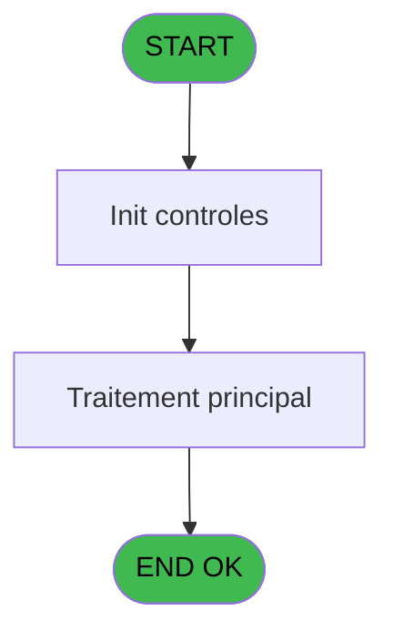
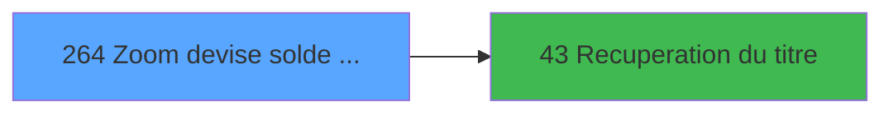

# ADH IDE 264 - Zoom devise solde compte

> **Analyse**: Phases 1-4 2026-02-08 04:47 -> 04:48 (4s) | Assemblage 04:48
> **Pipeline**: V7.2 Enrichi
> **Structure**: 4 onglets (Resume | Ecrans | Donnees | Connexions)

<!-- TAB:Resume -->

## 1. FICHE D'IDENTITE

| Attribut | Valeur |
|----------|--------|
| Projet | ADH |
| IDE Position | 264 |
| Nom Programme | Zoom devise solde compte |
| Fichier source | `Prg_264.xml` |
| Dossier IDE | Change |
| Taches | 1 (0 ecrans visibles) |
| Tables modifiees | 0 |
| Programmes appeles | 1 |
| Complexite | **BASSE** (score 5/100) |
| Statut | **ORPHELIN_POTENTIEL** |

## 2. DESCRIPTION FONCTIONNELLE

ADH IDE 264 est un programme de consultation permettant d'afficher le solde d'un compte dans une devise spécifique. Ce programme fait partie de la chaîne de visualisation des zooms (tableaux de référence) et intervient après la sélection d'une devise dans le formulaire de consultation. Il récupère le solde du compte converti dans la devise choisie en interrogeant les tables de taux de change et les opérations enregistrées.

Le programme utilise les paramètres d'identification du compte (société, numéro compte, filiation) et applique les taux de change actuels pour convertir le solde. Il appelle le programme ADH IDE 43 pour récupérer le titre ou l'identifiant du compte, puis calcule la conversion en utilisant la table des taux de change (cafil028_dat). Le résultat est retourné au programme appelant pour affichage dans l'interface de zoom.

C'est un programme transactionnel simple sans logique métier complexe, utilisant principalement des lectures dans les tables de référence et effectuant un calcul de conversion via une formule mathématique basée sur les taux. Le programme s'inscrit dans le workflow de gestion des consultations de compte du module Caisse.

## 3. BLOCS FONCTIONNELS

## 5. REGLES METIER

*(Aucune regle metier identifiee dans les expressions)*

## 6. CONTEXTE

- **Appele par**: (aucun)
- **Appelle**: 1 programmes | **Tables**: 1 (W:0 R:1 L:0) | **Taches**: 1 | **Expressions**: 8

<!-- TAB:Ecrans -->

## 8. ECRANS

*(Programme sans ecran visible)*

## 9. NAVIGATION

### 9.3 Structure hierarchique (0 tache)

| Position | Tache | Type | Dimensions | Bloc |
|----------|-------|------|------------|------|

### 9.4 Algorigramme

> **Legende**: Vert = START/END OK | Rouge = END KO | Bleu = Decisions
> *Algorigramme auto-genere. Utiliser `/algorigramme` pour une synthese metier detaillee.*

<!-- TAB:Donnees -->

## 10. TABLES

### Tables utilisees (1)

| ID | Nom | Description | Type | R | W | L | Usages |
|----|-----|-------------|------|---|---|---|--------|
| 90 | devises__________dev | Devises / taux de change | DB | R |   |   | 1 |

### Colonnes par table (1 / 1 tables avec colonnes identifiees)

Table 90 - devises__________dev (R) - 1 usages

| Lettre | Variable | Acces | Type |
|--------|----------|-------|------|
| A | > societe | R | Alpha |
| B | < devise | R | Alpha |
| C | v. titre | R | Alpha |
| D | bouton quitter | R | Alpha |
| E | bouton selectionner | R | Alpha |

## 11. VARIABLES

### 11.1 Variables de session (1)

Variables persistantes pendant toute la session.

| Lettre | Nom | Type | Usage dans |
|--------|-----|------|-----------|
| EP | v. titre | Alpha | - |

### 11.2 Autres (4)

Variables diverses.

| Lettre | Nom | Type | Usage dans |
|--------|-----|------|-----------|
| EN | > societe | Alpha | 1x refs |
| EO | < devise | Alpha | 1x refs |
| EQ | bouton quitter | Alpha | - |
| ER | bouton selectionner | Alpha | 1x refs |

## 12. EXPRESSIONS

**8 / 8 expressions decodees (100%)**

### 12.1 Repartition par type

| Type | Expressions | Regles |
|------|-------------|--------|
| CONSTANTE | 4 | 0 |
| CONDITION | 2 | 0 |
| OTHER | 1 | 0 |
| STRING | 1 | 0 |

### 12.2 Expressions cles par type

#### CONSTANTE (4 expressions)

| Type | IDE | Expression | Regle |
|------|-----|------------|-------|
| CONSTANTE | 4 | `60` | - |
| CONSTANTE | 6 | `'O'` | - |
| CONSTANTE | 1 | `'&Quitter'` | - |
| CONSTANTE | 2 | `'&Selectionner'` | - |

#### CONDITION (2 expressions)

| Type | IDE | Expression | Regle |
|------|-----|------------|-------|
| CONDITION | 7 | `< devise [B]` | - |
| CONDITION | 5 | `> societe [A]` | - |

#### OTHER (1 expressions)

| Type | IDE | Expression | Regle |
|------|-----|------------|-------|
| OTHER | 8 | `bouton selectionner [E]` | - |

#### STRING (1 expressions)

| Type | IDE | Expression | Regle |
|------|-----|------------|-------|
| STRING | 3 | `Trim ([G])` | - |

<!-- TAB:Connexions -->

## 13. GRAPHE D'APPELS

### 13.1 Chaine depuis Main (Callers)

**Chemin**: (pas de callers directs)

### 13.2 Callers

| IDE | Nom Programme | Nb Appels |
|-----|---------------|-----------|
| - | (aucun) | - |

### 13.3 Callees (programmes appeles)

### 13.4 Detail Callees avec contexte

| IDE | Nom Programme | Appels | Contexte |
|-----|---------------|--------|----------|
| [43](ADH-IDE-43.md) | Recuperation du titre | 1 | Recuperation donnees |

## 14. RECOMMANDATIONS MIGRATION

### 14.1 Profil du programme

| Metrique | Valeur | Impact migration |
|----------|--------|-----------------|
| Lignes de logique | 14 | Programme compact |
| Expressions | 8 | Peu de logique |
| Tables WRITE | 0 | Impact faible |
| Sous-programmes | 1 | Peu de dependances |
| Ecrans visibles | 0 | Ecran unique ou traitement batch |
| Code desactive | 0% (0 / 14) | Code sain |
| Regles metier | 0 | Pas de regle identifiee |

### 14.2 Plan de migration par bloc

### 14.3 Dependances critiques

| Dependance | Type | Appels | Impact |
|------------|------|--------|--------|
| [Recuperation du titre (IDE 43)](ADH-IDE-43.md) | Sous-programme | 1x | Normale - Recuperation donnees |

---
*Spec DETAILED generee par Pipeline V7.2 - 2026-02-08 04:48*
