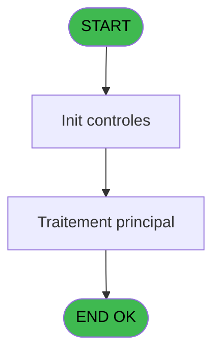
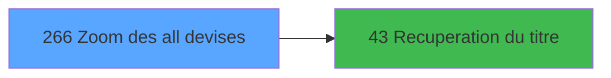

# ADH IDE 266 - Zoom des all devises

> **Analyse**: Phases 1-4 2026-02-08 04:49 -> 04:49 (4s) | Assemblage 04:49
> **Pipeline**: V7.2 Enrichi
> **Structure**: 4 onglets (Resume | Ecrans | Donnees | Connexions)

<!-- TAB:Resume -->

## 1. FICHE D'IDENTITE

| Attribut | Valeur |
|----------|--------|
| Projet | ADH |
| IDE Position | 266 |
| Nom Programme | Zoom des all devises |
| Fichier source | `Prg_266.xml` |
| Dossier IDE | Change |
| Taches | 1 (0 ecrans visibles) |
| Tables modifiees | 0 |
| Programmes appeles | 1 |
| Complexite | **BASSE** (score 5/100) |
| Statut | **ORPHELIN_POTENTIEL** |

## 2. DESCRIPTION FONCTIONNELLE

## Programme ADH IDE 266 - Zoom des devises

**ADH IDE 266** est un zoom de sélection permettant la consultation et le choix d'une devise parmi l'ensemble complet du référentiel système. Appelé uniquement par le programme "Comptes de dépôt" (ADH IDE 40), il fournit une interface de liste exhaustive de toutes les devises disponibles, incluant les devises historiques ou inactives. Ce programme est un composant UI pur, sans modifications de données et sans appels à d'autres sous-programmes.

Le programme accède en **lecture seule** à la table `cafil045_dat` (Devises) et ne contient aucune logique métier complexe : seulement 15 lignes actives sans expressions. Son flux est linéaire : réception implicite de paramètres d'entrée (zéro), initialisation, affichage de la liste des devises, et retour du code devise sélectionné au programme appelant. Aucun traitement supplémentaire n'est déclenché par ce zoom.

Sa migration vers une architecture moderne serait triviale : il suffirait de créer un composant React/modal avec un select/dropdown alimenté par un service `IDeviseService` et une requête EF Core sur la table Devises. **Complexité de migration : très faible** - c'est un excellent candidat pour une migration précoce en raison de ses dépendances minimales et de son absence de logique métier.

## 3. BLOCS FONCTIONNELS

## 5. REGLES METIER

*(Aucune regle metier identifiee dans les expressions)*

## 6. CONTEXTE

- **Appele par**: (aucun)
- **Appelle**: 1 programmes | **Tables**: 1 (W:0 R:1 L:0) | **Taches**: 1 | **Expressions**: 8

<!-- TAB:Ecrans -->

## 8. ECRANS

*(Programme sans ecran visible)*

## 9. NAVIGATION

### 9.3 Structure hierarchique (0 tache)

| Position | Tache | Type | Dimensions | Bloc |
|----------|-------|------|------------|------|

### 9.4 Algorigramme

> **Legende**: Vert = START/END OK | Rouge = END KO | Bleu = Decisions
> *Algorigramme auto-genere. Utiliser `/algorigramme` pour une synthese metier detaillee.*

<!-- TAB:Donnees -->

## 10. TABLES

### Tables utilisees (1)

| ID | Nom | Description | Type | R | W | L | Usages |
|----|-----|-------------|------|---|---|---|--------|
| 67 | tables___________tab |  | DB | R |   |   | 1 |

### Colonnes par table (1 / 1 tables avec colonnes identifiees)

Table 67 - tables___________tab (R) - 1 usages

| Lettre | Variable | Acces | Type |
|--------|----------|-------|------|
| A | > societe | R | Alpha |
| B | < devise | R | Alpha |
| C | v.titre | R | Alpha |
| D | bouton selectionner | R | Alpha |
| E | bouton quitter | R | Alpha |

## 11. VARIABLES

### 11.1 Variables de session (1)

Variables persistantes pendant toute la session.

| Lettre | Nom | Type | Usage dans |
|--------|-----|------|-----------|
| EP | v.titre | Alpha | 1x session |

### 11.2 Autres (4)

Variables diverses.

| Lettre | Nom | Type | Usage dans |
|--------|-----|------|-----------|
| EN | > societe | Alpha | - |
| EO | < devise | Alpha | 1x refs |
| EQ | bouton selectionner | Alpha | - |
| ER | bouton quitter | Alpha | - |

## 12. EXPRESSIONS

**8 / 8 expressions decodees (100%)**

### 12.1 Repartition par type

| Type | Expressions | Regles |
|------|-------------|--------|
| CONSTANTE | 5 | 0 |
| CONDITION | 1 | 0 |
| OTHER | 1 | 0 |
| STRING | 1 | 0 |

### 12.2 Expressions cles par type

#### CONSTANTE (5 expressions)

| Type | IDE | Expression | Regle |
|------|-----|------------|-------|
| CONSTANTE | 5 | `6` | - |
| CONSTANTE | 6 | `'BDEV'` | - |
| CONSTANTE | 4 | `'&Selectionner'` | - |
| CONSTANTE | 1 | `''` | - |
| CONSTANTE | 3 | `'&Quitter'` | - |

#### CONDITION (1 expressions)

| Type | IDE | Expression | Regle |
|------|-----|------------|-------|
| CONDITION | 7 | `< devise [B]` | - |

#### OTHER (1 expressions)

| Type | IDE | Expression | Regle |
|------|-----|------------|-------|
| OTHER | 8 | `[F]` | - |

#### STRING (1 expressions)

| Type | IDE | Expression | Regle |
|------|-----|------------|-------|
| STRING | 2 | `Trim (v.titre [C])` | - |

<!-- TAB:Connexions -->

## 13. GRAPHE D'APPELS

### 13.1 Chaine depuis Main (Callers)

**Chemin**: (pas de callers directs)

### 13.2 Callers

| IDE | Nom Programme | Nb Appels |
|-----|---------------|-----------|
| - | (aucun) | - |

### 13.3 Callees (programmes appeles)

### 13.4 Detail Callees avec contexte

| IDE | Nom Programme | Appels | Contexte |
|-----|---------------|--------|----------|
| [43](ADH-IDE-43.md) | Recuperation du titre | 1 | Recuperation donnees |

## 14. RECOMMANDATIONS MIGRATION

### 14.1 Profil du programme

| Metrique | Valeur | Impact migration |
|----------|--------|-----------------|
| Lignes de logique | 15 | Programme compact |
| Expressions | 8 | Peu de logique |
| Tables WRITE | 0 | Impact faible |
| Sous-programmes | 1 | Peu de dependances |
| Ecrans visibles | 0 | Ecran unique ou traitement batch |
| Code desactive | 0% (0 / 15) | Code sain |
| Regles metier | 0 | Pas de regle identifiee |

### 14.2 Plan de migration par bloc

### 14.3 Dependances critiques

| Dependance | Type | Appels | Impact |
|------------|------|--------|--------|
| [Recuperation du titre (IDE 43)](ADH-IDE-43.md) | Sous-programme | 1x | Normale - Recuperation donnees |

---
*Spec DETAILED generee par Pipeline V7.2 - 2026-02-08 04:51*
