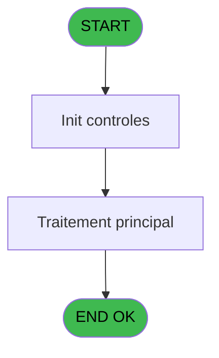
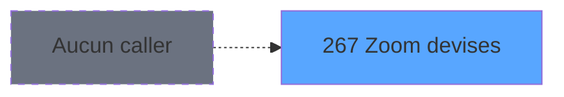
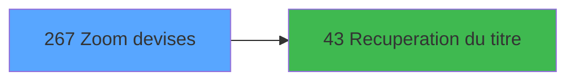

# ADH IDE 267 - Zoom devises

> **Analyse**: Phases 1-4 2026-02-08 04:51 -> 04:51 (4s) | Assemblage 04:51
> **Pipeline**: V7.2 Enrichi
> **Structure**: 4 onglets (Resume | Ecrans | Donnees | Connexions)

<!-- TAB:Resume -->

## 1. FICHE D'IDENTITE

| Attribut | Valeur |
|----------|--------|
| Projet | ADH |
| IDE Position | 267 |
| Nom Programme | Zoom devises |
| Fichier source | `Prg_267.xml` |
| Dossier IDE | Change |
| Taches | 1 (0 ecrans visibles) |
| Tables modifiees | 0 |
| Programmes appeles | 1 |
| Complexite | **BASSE** (score 5/100) |
| Statut | **ORPHELIN_POTENTIEL** |

## 2. DESCRIPTION FONCTIONNELLE

ADH IDE 267 est un programme de consultation simple qui affiche la liste des devises disponibles dans le système. Il s'agit d'une fonction de zoom typique, accessible depuis les formulaires qui nécessitent la sélection d'une devise. Le programme récupère les données de la table de référence des devises et les présente de manière conviviale à l'utilisateur pour faciliter le choix.

Le programme appelle ADH IDE 43 pour récupérer le titre ou la description de chaque devise. Cette dépendance externe enrichit l'affichage en ajoutant des informations de contexte sur les devises, permettant aux utilisateurs de mieux comprendre le sens de chaque code devise affiché. C'est un pattern courant dans les zooms Magic : afficher le code ET le libellé associé pour améliorer l'UX.

L'exécution est rapide et sans effets de bord puisqu'il s'agit d'une opération de lecture seule. Le programme est généralement appelé depuis des contextes où l'utilisateur doit sélectionner une devise (opérations de change, conversions, paramètres de facturation, etc.). Il fait partie du composant ADH.ecf partagé et peut être utilisé par d'autres modules comme PBP ou PVE qui ont besoin de gérer des devises.

## 3. BLOCS FONCTIONNELS

## 5. REGLES METIER

*(Aucune regle metier identifiee dans les expressions)*

## 6. CONTEXTE

- **Appele par**: (aucun)
- **Appelle**: 1 programmes | **Tables**: 2 (W:0 R:1 L:1) | **Taches**: 1 | **Expressions**: 13

<!-- TAB:Ecrans -->

## 8. ECRANS

*(Programme sans ecran visible)*

## 9. NAVIGATION

### 9.3 Structure hierarchique (0 tache)

| Position | Tache | Type | Dimensions | Bloc |
|----------|-------|------|------------|------|

### 9.4 Algorigramme

> **Legende**: Vert = START/END OK | Rouge = END KO | Bleu = Decisions
> *Algorigramme auto-genere. Utiliser `/algorigramme` pour une synthese metier detaillee.*

<!-- TAB:Donnees -->

## 10. TABLES

### Tables utilisees (2)

| ID | Nom | Description | Type | R | W | L | Usages |
|----|-----|-------------|------|---|---|---|--------|
| 50 | moyens_reglement_mor | Reglements / paiements | DB | R |   |   | 1 |
| 67 | tables___________tab |  | DB |   |   | L | 1 |

### Colonnes par table (1 / 1 tables avec colonnes identifiees)

Table 50 - moyens_reglement_mor (R) - 1 usages

| Lettre | Variable | Acces | Type |
|--------|----------|-------|------|
| A | PO societe | R | Alpha |
| B | PO type depôt | R | Alpha |
| C | PO devise | R | Alpha |
| D | v.titre | R | Alpha |
| E | Bouton selection | R | Alpha |
| F | Bouton quitter | R | Alpha |

## 11. VARIABLES

### 11.1 Parametres entrants (3)

Variables recues en parametre.

| Lettre | Nom | Type | Usage dans |
|--------|-----|------|-----------|
| EN | PO societe | Alpha | 1x parametre entrant |
| EO | PO type depôt | Alpha | 1x parametre entrant |
| EP | PO devise | Alpha | 1x parametre entrant |

### 11.2 Variables de session (1)

Variables persistantes pendant toute la session.

| Lettre | Nom | Type | Usage dans |
|--------|-----|------|-----------|
| EQ | v.titre | Alpha | 1x session |

### 11.3 Autres (2)

Variables diverses.

| Lettre | Nom | Type | Usage dans |
|--------|-----|------|-----------|
| ER | Bouton selection | Alpha | - |
| ES | Bouton quitter | Alpha | - |

## 12. EXPRESSIONS

**13 / 13 expressions decodees (100%)**

### 12.1 Repartition par type

| Type | Expressions | Regles |
|------|-------------|--------|
| CONSTANTE | 7 | 0 |
| OTHER | 5 | 0 |
| STRING | 1 | 0 |

### 12.2 Expressions cles par type

#### CONSTANTE (7 expressions)

| Type | IDE | Expression | Regle |
|------|-----|------------|-------|
| CONSTANTE | 10 | `'&Quitter'` | - |
| CONSTANTE | 11 | `'BDEV'` | - |
| CONSTANTE | 12 | `''` | - |
| CONSTANTE | 9 | `'&Selectionner'` | - |
| CONSTANTE | 2 | `15` | - |
| ... | | *+2 autres* | |

#### OTHER (5 expressions)

| Type | IDE | Expression | Regle |
|------|-----|------------|-------|
| OTHER | 8 | `[I]` | - |
| OTHER | 13 | `[I]` | - |
| OTHER | 7 | `PO devise [C]` | - |
| OTHER | 3 | `PO societe [A]` | - |
| OTHER | 4 | `PO type depôt [B]` | - |

#### STRING (1 expressions)

| Type | IDE | Expression | Regle |
|------|-----|------------|-------|
| STRING | 1 | `Trim (v.titre [D])` | - |

<!-- TAB:Connexions -->

## 13. GRAPHE D'APPELS

### 13.1 Chaine depuis Main (Callers)

**Chemin**: (pas de callers directs)

### 13.2 Callers

| IDE | Nom Programme | Nb Appels |
|-----|---------------|-----------|
| - | (aucun) | - |

### 13.3 Callees (programmes appeles)

### 13.4 Detail Callees avec contexte

| IDE | Nom Programme | Appels | Contexte |
|-----|---------------|--------|----------|
| [43](ADH-IDE-43.md) | Recuperation du titre | 1 | Recuperation donnees |

## 14. RECOMMANDATIONS MIGRATION

### 14.1 Profil du programme

| Metrique | Valeur | Impact migration |
|----------|--------|-----------------|
| Lignes de logique | 24 | Programme compact |
| Expressions | 13 | Peu de logique |
| Tables WRITE | 0 | Impact faible |
| Sous-programmes | 1 | Peu de dependances |
| Ecrans visibles | 0 | Ecran unique ou traitement batch |
| Code desactive | 0% (0 / 24) | Code sain |
| Regles metier | 0 | Pas de regle identifiee |

### 14.2 Plan de migration par bloc

### 14.3 Dependances critiques

| Dependance | Type | Appels | Impact |
|------------|------|--------|--------|
| [Recuperation du titre (IDE 43)](ADH-IDE-43.md) | Sous-programme | 1x | Normale - Recuperation donnees |

---
*Spec DETAILED generee par Pipeline V7.2 - 2026-02-08 04:51*
