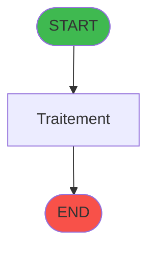
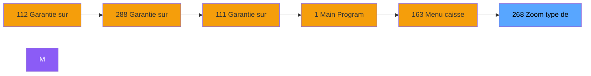
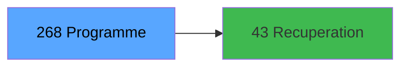

# ADH IDE 268 - Programme supprime (Prg_264)

> **Version spec**: 3.5
> **Analyse**: 2026-01-27 17:57
> **Source**: `Prg_XXX.xml`

---

<!-- TAB:Fonctionnel -->

## SPECIFICATION FONCTIONNELLE

### 1.1 Objectif metier

| Element | Description |
|---------|-------------|
| **Qui** | Operateur |
| **Quoi** | Programme supprime (Prg_264)
 |
| **Pourquoi** | A documenter |
| **Declencheur** | A identifier |

### 1.2 Regles metier

| Code | Regle | Condition |
|------|-------|-----------|
| RM-001 | A documenter | - |

### 1.3 Flux utilisateur

1. Demarrage programme
2. Traitement principal
3. Fin programme

### 1.4 Cas d'erreur

| Erreur | Comportement |
|--------|--------------|
| - | A documenter |

---

<!-- TAB:Technique -->

## SPECIFICATION TECHNIQUE

### 2.1 Identification

| Attribut | Valeur |
|----------|--------|
| **Format IDE** | ADH IDE 268 |
| **Description** | Programme supprime (Prg_264)
 |
| **Module** | ADH |

### 2.2 Tables

| # | Nom logique | Nom physique | Acces | Usage |
|---|-------------|--------------|-------|-------|
| 91 | garantie_________gar | `cafil069_dat` | R | 1x |
### 2.3 Parametres d'entree

| Variable | Nom | Type | Picture |
|----------|-----|------|---------|
| - | Aucun parametre | - | - |
### 2.4 Algorigramme

### 2.5 Expressions cles

| IDE | Expression | Commentaire |
|-----|------------|-------------|
| 1 | `Trim ({0,12})` | - |
| 2 | `'&Quitter'` | - |
| 3 | `'&Selectionner'` | - |
| 4 | `13` | - |
| 5 | `{0,1}` | - |
| 6 | `{0,2}` | - |
| 7 | `{0,17}` | - |
| 8 | `IF ({0,16}='$CARD','O','')` | - |
| 9 | `{0,14}` | - |
| 10 | `{0,15}` | - |
| 11 | `{0,18}` | - |
| 12 | `'TRUE'LOG` | - |
| 13 | `'FALSE'LOG` | - |
| 14 | `CndRange( ({0,8}='O' OR {0,9}) OR ({32768,82}='...` | - |
| 15 | `'Guaranty Types'` | - |
| 16 | `IF({0,9},'{0,3}'FORM,'{0,2}'FORM)` | - |
| 17 | `IF({0,10} AND NOT {32768,3},{0,15}<>'CASH','TRU...` | - |

> **Total**: 17 expressions (affichees: 17)
### 2.6 Variables importantes

### 2.7 Statistiques

| Metrique | Valeur |
|----------|--------|
| **Taches** | 1 |
| **Lignes logique** | 34 |
| **Lignes desactivees** | 0 |
---

<!-- TAB:Cartographie -->

## CARTOGRAPHIE APPLICATIVE

### 3.1 Chaine d'appels depuis Main

### 3.2 Callers directs

| IDE | Programme | Nb appels |
|-----|-----------|-----------|
| 111 | Garantie sur compte | 5 |
| 112 | Garantie sur compte PMS-584 | 5 |
| 288 | Garantie sur compte | 5 |
### 3.3 Callees

| Niv | IDE | Programme | Nb appels |
|-----|-----|-----------|-----------|
| 1 | 43 | Recuperation du titre | 1 |
### 3.4 Verification orphelin

| Critere | Resultat |
|---------|----------|
| Callers actifs | A verifier |
| **Conclusion** | A analyser |

---

## HISTORIQUE

| Date | Action | Auteur |
|------|--------|--------|
| 2026-01-27 20:25 | **DATA V2** - Tables reelles, Expressions, Stats, CallChain | Script |
| 2026-01-27 19:51 | **DATA POPULATED** - Tables, Callgraph (17 expr) | Script |
| 2026-01-27 17:57 | **Upgrade V3.5** - TAB markers, Mermaid | Claude |

---

*Specification V3.5 - Format avec TAB markers et Mermaid*
